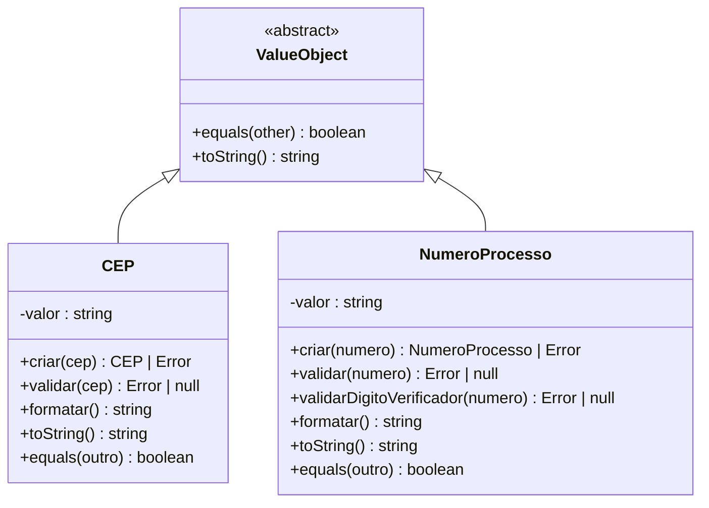
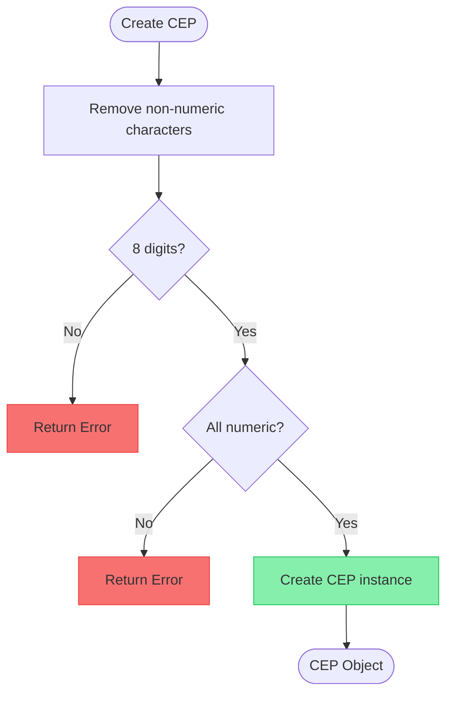
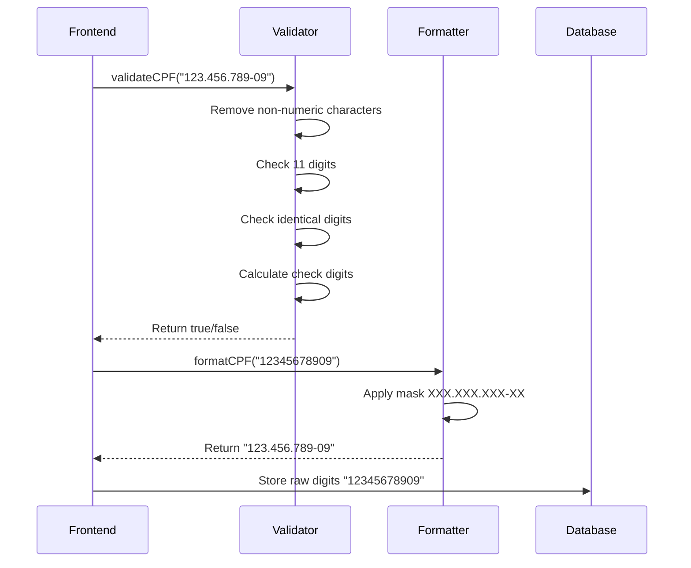

# Value Objects

<cite>
**Referenced Files in This Document**   
- [value-objects.ts](file://types/domain/value-objects.ts)
- [enderecos-persistence.service.ts](file://backend/enderecos/services/enderecos-persistence.service.ts)
- [cpf.validator.ts](file://app/_lib/assinatura-digital/validators/cpf.validator.ts)
- [cnpj.validator.ts](file://app/_lib/assinatura-digital/validators/cnpj.validator.ts)
- [cnpj.ts](file://app/_lib/assinatura-digital/formatters/cnpj.ts)
- [cpf.ts](file://app/_lib/assinatura-digital/formatters/cpf.ts)
- [enderecos.ts](file://types/domain/enderecos.ts)
</cite>

## Table of Contents
1. [Introduction](#introduction)
2. [Value Object Structure](#value-object-structure)
3. [Core Value Objects Implementation](#core-value-objects-implementation)
4. [Address Validation and Data Integrity](#address-validation-and-data-integrity)
5. [CPF/CNPJ Value Objects](#cpfcnpj-value-objects)
6. [Benefits of Value Objects](#benefits-of-value-objects)
7. [Implementation Considerations](#implementation-considerations)
8. [Conclusion](#conclusion)

## Introduction
Value Objects in Sinesys are fundamental domain modeling components that represent concepts defined by their attributes rather than identity. These immutable objects encapsulate business rules, validation logic, and formatting behavior for critical domain concepts such as Brazilian tax identifiers (CPF/CNPJ), postal codes (CEP), and judicial process numbers. By implementing value objects, Sinesys ensures data integrity across the application, prevents invalid data states, and makes business rules explicit and centralized. This documentation provides a comprehensive analysis of the value object implementation, demonstrating how they contribute to a robust and maintainable domain model.

## Value Object Structure
The value objects in Sinesys follow a consistent design pattern that emphasizes immutability, validation, and behavior encapsulation. Each value object is implemented as a class with a private constructor, ensuring that instances can only be created through controlled factory methods. This design prevents the creation of invalid objects by enforcing validation at construction time.

The structure includes static factory methods (typically named `criar` or "create") that handle input normalization and validation before instantiation. If validation fails, these methods return an Error object rather than creating an invalid instance. Once created, value objects provide methods for formatting, string representation, and equality comparison, while maintaining their immutable nature.

**Diagram sources**
- [value-objects.ts](file://types/domain/value-objects.ts#L15-L242)

**Section sources**
- [value-objects.ts](file://types/domain/value-objects.ts#L1-L243)

## Core Value Objects Implementation
Sinesys implements several key value objects to represent important domain concepts with strict validation rules. The two primary examples are the CEP (postal code) and NumeroProcesso (judicial process number) value objects, both defined in the domain types directory.

The CEP value object represents a valid Brazilian postal code in the format NNNNN-NNN (eight numeric digits). It provides normalization by removing non-numeric characters from input, validates that exactly eight digits are present, and ensures all characters are numeric. The object offers formatting capabilities to present the CEP in the standard Brazilian format and supports equality comparison between instances.

The NumeroProcesso value object represents a judicial process number in the CNJ format (NNNNNNN-DD.AAAA.J.TR.OOOO). Beyond basic format validation, this value object implements the complex CNJ algorithm (Resolution 65/2008, MNI PJe/TRT) to validate the check digits using the mod 97 algorithm in three stages. This sophisticated validation ensures that only legitimate judicial process numbers can be represented in the system.

**Diagram sources**
- [value-objects.ts](file://types/domain/value-objects.ts#L15-L93)

**Section sources**
- [value-objects.ts](file://types/domain/value-objects.ts#L15-L243)

## Address Validation and Data Integrity
While the Endereco (address) entity is not implemented as a traditional value object class, Sinesys applies value object principles to address data integrity through comprehensive validation logic in the persistence layer. The enderecos-persistence.service.ts file contains validation functions that ensure address data meets business requirements before storage.

The validation system checks for valid CEP format (eight numeric digits) and valid Brazilian state abbreviations (UF) against a predefined list of all 27 states. Additionally, the system enforces minimum address requirements, ensuring that at least one of the following fields is present: street (logradouro), municipality (municipio), or postal code (cep). This approach prevents incomplete or invalid address data from being stored in the database.

The implementation demonstrates how value object principles can be applied beyond dedicated classes, extending to service-level validation that maintains data consistency across the application. When creating or updating an address, the system performs these validations and returns appropriate error messages if any checks fail, ensuring that only valid address data persists in the system.

**Section sources**
- [enderecos-persistence.service.ts](file://backend/enderecos/services/enderecos-persistence.service.ts#L26-L44)
- [enderecos.ts](file://types/domain/enderecos.ts#L30-L63)

## CPF/CNPJ Value Objects
Although CPF (individual taxpayer registry) and CNPJ (corporate taxpayer registry) are not implemented as formal value object classes in the domain types, Sinesys provides comprehensive validation and formatting functionality for these critical Brazilian identifiers. The system includes dedicated validator and formatter modules that encapsulate the complex business rules associated with these tax identifiers.

The CPF validation follows the official algorithm, which includes checking for exactly 11 numeric digits, verifying that not all digits are identical (a common invalid pattern), and calculating the two check digits using weighted sums. Similarly, the CNPJ validation implements the official algorithm for corporate tax identifiers, which requires 14 numeric digits and uses a different weighting pattern for check digit calculation.

Formatting functions are also provided to present these identifiers in their standard Brazilian formats (XXX.XXX.XXX-XX for CPF and XX.XXX.XXX/XXXX-XX for CNPJ). These utilities are used consistently across the application to ensure uniform presentation of tax identifiers while maintaining the raw numeric values for storage and comparison.

**Diagram sources**
- [cpf.validator.ts](file://app/_lib/assinatura-digital/validators/cpf.validator.ts#L2-L34)
- [cnpj.validator.ts](file://app/_lib/assinatura-digital/validators/cnpj.validator.ts#L2-L43)
- [cnpj.ts](file://app/_lib/assinatura-digital/formatters/cnpj.ts#L2-L17)

**Section sources**
- [cpf.validator.ts](file://app/_lib/assinatura-digital/validators/cpf.validator.ts#L1-L34)
- [cnpj.validator.ts](file://app/_lib/assinatura-digital/validators/cnpj.validator.ts#L1-L43)
- [cnpj.ts](file://app/_lib/assinatura-digital/formatters/cnpj.ts#L1-L17)

## Benefits of Value Objects
The implementation of value objects in Sinesys provides several significant benefits to the application architecture and domain model. First and foremost, value objects prevent invalid data states by enforcing validation rules at the point of object creation. This "fail fast" approach ensures that invalid data cannot propagate through the system, reducing the risk of runtime errors and data corruption.

Value objects promote code reuse by centralizing validation and formatting logic in a single location. Instead of duplicating validation rules across multiple components and services, developers can rely on the value object's built-in validation, ensuring consistency throughout the application. This centralization also makes it easier to modify business rules, as changes only need to be made in one place.

The use of value objects makes business rules explicit and self-documenting. The presence of a CEP or NumeroProcesso class immediately communicates to developers that these are important domain concepts with specific rules and behaviors. This improves code readability and maintainability, as the intent behind the data is clear from the type system.

Additionally, value objects support immutability, which simplifies reasoning about code and eliminates entire classes of bugs related to unintended state changes. The equality comparison methods provided by value objects enable reliable comparison logic, ensuring that two objects with the same attributes are considered equal regardless of their reference.

## Implementation Considerations
When implementing value objects in Sinesys, several important considerations were addressed to ensure optimal performance and usability. The factory method pattern used in value objects (e.g., `criar`) returns either a valid instance or an Error, requiring callers to handle both success and failure cases appropriately. This approach prioritizes correctness over convenience, ensuring that invalid data states cannot be created.

For performance-critical scenarios, the creation of value objects should be considered carefully, as each instantiation involves validation overhead. However, this cost is typically justified by the benefits of data integrity and the prevention of invalid states. In cases where performance is paramount, caching strategies or bulk validation approaches might be considered.

Serialization of value objects is handled through their `toString()` method, which returns the normalized, unformatted value suitable for storage or transmission. This ensures that the essential data is preserved while allowing formatting to be applied as needed for presentation. When deserializing, the factory methods should be used to re-create valid instances, ensuring that any stored data is re-validated.

The current implementation could be enhanced by creating formal CPF and CNPJ value object classes that follow the same pattern as CEP and NumeroProcesso, providing a more consistent API across all identifier types. This would further improve type safety and make the domain model more cohesive.

## Conclusion
Value objects in Sinesys play a crucial role in maintaining data integrity and enforcing business rules across the application. By representing domain concepts like postal codes, judicial process numbers, and tax identifiers as immutable objects with built-in validation, the system prevents invalid data states and ensures consistency. The implementation demonstrates a thoughtful approach to domain modeling, applying value object principles not only through dedicated classes but also through service-level validation and utility functions. This comprehensive strategy contributes to a robust, maintainable, and reliable application architecture that effectively represents the complex requirements of the legal technology domain.