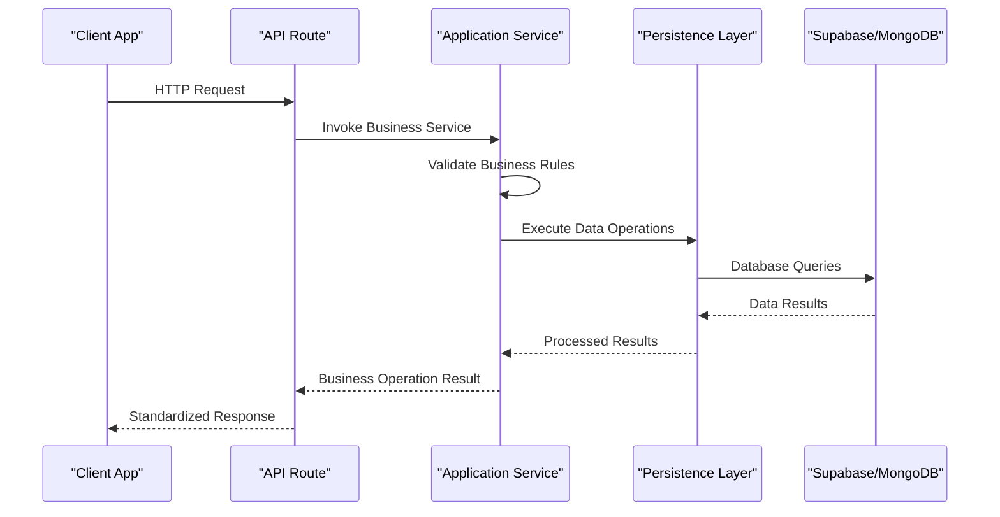
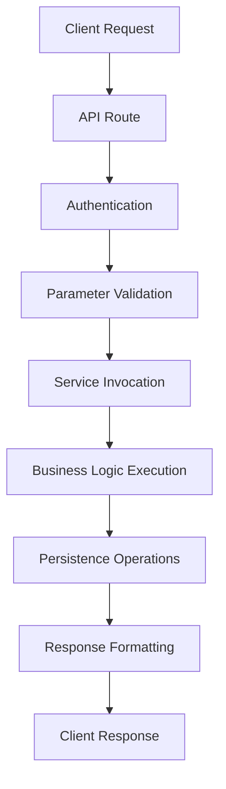
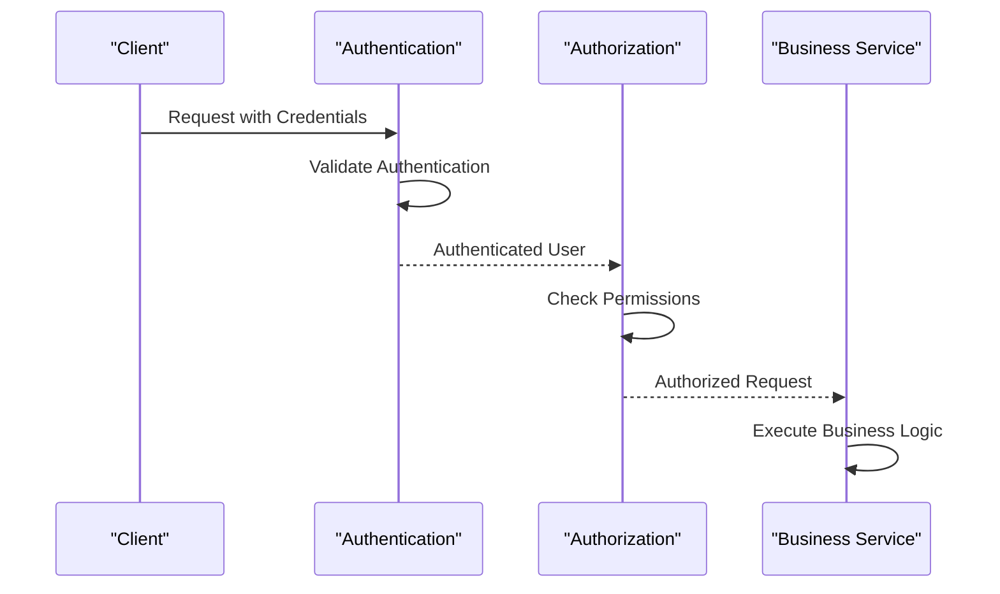
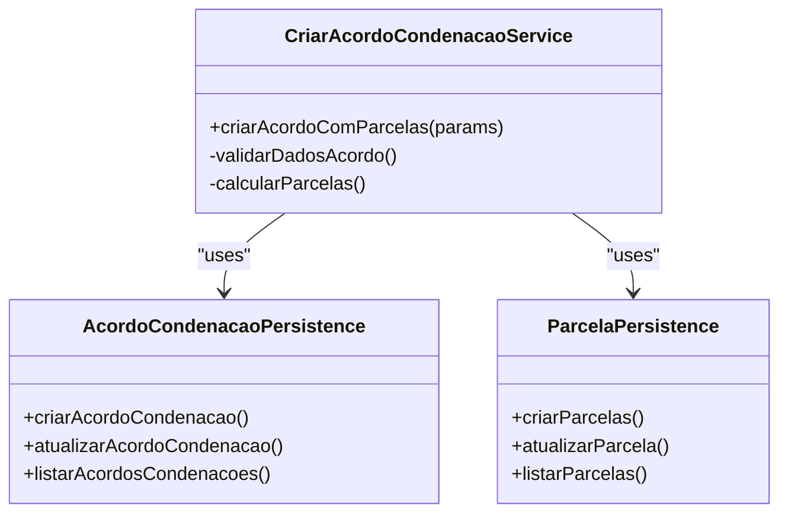

# Application Layer

<cite>
**Referenced Files in This Document**   
- [criar-acordo-condenacao.service.ts](file://backend/acordos-condenacoes/services/acordos-condenacoes/criar-acordo-condenacao.service.ts)
- [listar-acervo.service.ts](file://backend/acervo/services/listar-acervo.service.ts)
- [criar-audiencia.service.ts](file://backend/audiencias/services/criar-audiencia.service.ts)
- [acordo-condenacao-persistence.service.ts](file://backend/acordos-condenacoes/services/persistence/acordo-condenacao-persistence.service.ts)
- [parcela-persistence.service.ts](file://backend/acordos-condenacoes/services/persistence/parcela-persistence.service.ts)
- [route.ts](file://app/api/acordos-condenacoes/route.ts)
- [route.ts](file://app/api/acervo/route.ts)
- [route.ts](file://app/api/audiencias/route.ts)
- [api-auth.ts](file://backend/auth/api-auth.ts)
- [authorization.ts](file://backend/auth/authorization.ts)
- [require-permission.ts](file://backend/auth/require-permission.ts)
</cite>

## Table of Contents
1. [Introduction](#introduction)
2. [Service Organization by Feature Domain](#service-organization-by-feature-domain)
3. [Business Logic Implementation](#business-logic-implementation)
4. [API Routes and Presentation Layer Integration](#api-routes-and-presentation-layer-integration)
5. [Authentication and Authorization](#authentication-and-authorization)
6. [Cross-Cutting Concerns](#cross-cutting-concerns)
7. [Service Interaction Patterns](#service-interaction-patterns)
8. [Conclusion](#conclusion)

## Introduction

The Application Layer in the Sinesys system serves as the central orchestrator of business functionality, containing the core business logic and services that coordinate domain objects and infrastructure components. This layer implements use cases by organizing services around feature domains such as acervo, acordos-condenacoes, and audiencias, with each service encapsulating specific business operations. The layer enforces business rules, manages transactions, and handles cross-cutting concerns like logging and error handling. It exposes functionality to the Presentation Layer through API routes in app/api/, creating a clear separation between business logic and user interface concerns. Services in this layer maintain loose coupling through well-defined interfaces and coordinate with persistence layers to implement comprehensive business operations.

## Service Organization by Feature Domain

The Application Layer organizes services in the backend/services/ directory by feature domain, creating a modular and maintainable architecture. Each feature domain contains its own services that implement specific business capabilities. The acervo domain handles case management and timeline synchronization, with services like listar-acervo.service.ts and sincronizar-timeline-cpf.service.ts. The acordos-condenacoes domain manages agreements and condemnations, including payment processing and distribution, implemented in services like criar-acordo-condenacao.service.ts. The audiencias domain handles hearing management with services such as criar-audiencia.service.ts and listar-audiencias.service.ts. Other domains include assistentes for AI assistants, captura for data capture from external systems, and financeiro for financial operations. Each service directory follows a consistent pattern with business logic services and persistence services separated into distinct subdirectories, promoting separation of concerns and making the codebase easier to navigate and maintain.

**Section sources**
- [criar-acordo-condenacao.service.ts](file://backend/acordos-condenacoes/services/acordos-condenacoes/criar-acordo-condenacao.service.ts)
- [listar-acervo.service.ts](file://backend/acervo/services/listar-acervo.service.ts)
- [criar-audiencia.service.ts](file://backend/audiencias/services/criar-audiencia.service.ts)

## Business Logic Implementation

The Application Layer implements business logic through services that coordinate domain objects and infrastructure components to fulfill specific use cases. For example, the criar-acordo-condenacao.service.ts service implements the creation of agreements and condemnations by orchestrating multiple operations. This service validates business rules such as ensuring custas processuais have a single installment and proper payment direction, then creates the main agreement record and calculates installment distribution. The service coordinates with persistence components to create the agreement and its associated installments in a transactional manner, returning a comprehensive result with success status and error information. Similarly, the listar-acervo.service.ts service implements complex filtering, pagination, and grouping logic for case management, handling parameters for unified multi-instance processes and various filtering criteria. These services encapsulate business rules and validation, ensuring data integrity and consistency across the application.

**Diagram sources**
- [criar-acordo-condenacao.service.ts](file://backend/acordos-condenacoes/services/acordos-condenacoes/criar-acordo-condenacao.service.ts)
- [listar-acervo.service.ts](file://backend/acervo/services/listar-acervo.service.ts)

## API Routes and Presentation Layer Integration

The Application Layer exposes services to the Presentation Layer through API routes defined in the app/api/ directory. These routes act as the interface between the frontend and the business logic, handling HTTP requests and responses. For example, the acordos-condenacoes route (app/api/acordos-condenacoes/route.ts) exposes both GET and POST operations, allowing clients to list agreements and create new ones. The route handles authentication, parses request parameters, invokes the appropriate service (criarAcordoComParcelas), and formats the response according to a standardized structure. Similarly, the acervo route (app/api/acervo/route.ts) provides extensive filtering, pagination, and grouping capabilities for case management, with comprehensive Swagger documentation defining the API contract. These API routes validate input parameters, handle errors gracefully, and return consistent responses with success flags and data payloads, enabling reliable integration with the frontend components.

**Diagram sources**
- [route.ts](file://app/api/acordos-condenacoes/route.ts)
- [route.ts](file://app/api/acervo/route.ts)
- [route.ts](file://app/api/audiencias/route.ts)

## Authentication and Authorization

The Application Layer implements comprehensive authentication and authorization mechanisms to secure access to business functionality. Authentication is handled through multiple methods including Supabase session authentication, Bearer tokens, and service API keys, as implemented in the api-auth.ts utility. This allows both user-facing access and system-to-system communication. Authorization is implemented through a granular permission system that checks user permissions for specific resources and operations. The authorization.ts service provides a caching mechanism to improve performance while checking permissions against the permissoes table in the database. The require-permission.ts helper simplifies permission checks in API routes by combining authentication and authorization into a single call. Super administrators have bypass access to all resources, while regular users are subject to granular permission checks. This multi-layered security approach ensures that only authorized users can access specific business operations.

**Diagram sources**
- [api-auth.ts](file://backend/auth/api-auth.ts)
- [authorization.ts](file://backend/auth/authorization.ts)
- [require-permission.ts](file://backend/auth/require-permission.ts)

## Cross-Cutting Concerns

The Application Layer addresses cross-cutting concerns such as logging, error handling, and transaction management to ensure robust and maintainable business operations. Services implement comprehensive error handling with try-catch blocks and detailed error messages that are logged for debugging purposes. The criar-acordo-condenacao.service.ts service, for example, logs the initiation and completion of agreement creation, along with any errors that occur during the process. The layer also handles transactional integrity by coordinating multiple persistence operations, with TODO comments indicating where database transactions should be implemented to ensure atomicity. Logging is implemented consistently across services, providing visibility into business operations for monitoring and debugging. Error responses are standardized with success flags and error messages, enabling consistent error handling in the Presentation Layer. These cross-cutting concerns are implemented in a way that doesn't interfere with the core business logic, maintaining separation of concerns.

**Section sources**
- [criar-acordo-condenacao.service.ts](file://backend/acordos-condenacoes/services/acordos-condenacoes/criar-acordo-condenacao.service.ts)
- [listar-acervo.service.ts](file://backend/acervo/services/listar-acervo.service.ts)

## Service Interaction Patterns

Services in the Application Layer maintain loose coupling through well-defined interfaces and dependency injection patterns. They interact with each other and with infrastructure components through clearly defined contracts rather than direct dependencies. For example, the criar-acordo-condenacao.service.ts service depends on persistence services (acordo-condenacao-persistence.service.ts and parcela-persistence.service.ts) through imports, but these dependencies are managed through the module system rather than direct instantiation. Services communicate through data transfer objects and return standardized results, avoiding tight coupling to specific implementations. The layer follows a clean architecture pattern where higher-level modules (services) depend on lower-level modules (persistence) through abstraction. This allows for easier testing, maintenance, and evolution of the system. Service interactions are typically orchestrated through the API layer, which acts as the primary entry point for business operations.

**Diagram sources**
- [criar-acordo-condenacao.service.ts](file://backend/acordos-condenacoes/services/acordos-condenacoes/criar-acordo-condenacao.service.ts)
- [acordo-condenacao-persistence.service.ts](file://backend/acordos-condenacoes/services/persistence/acordo-condenacao-persistence.service.ts)
- [parcela-persistence.service.ts](file://backend/acordos-condenacoes/services/persistence/parcela-persistence.service.ts)

## Conclusion

The Application Layer in Sinesys effectively implements the business logic and services that orchestrate the application's functionality. By organizing services around feature domains such as acervo, acordos-condenacoes, and audiencias, the layer provides a clear and maintainable structure for business operations. Services implement use cases by coordinating domain objects and infrastructure components, enforcing business rules and handling transactions. The layer exposes functionality to the Presentation Layer through well-documented API routes that handle authentication, parameter validation, and response formatting. Comprehensive authentication and authorization mechanisms ensure secure access to business operations, while cross-cutting concerns like logging and error handling are addressed consistently across services. The loose coupling between services through well-defined interfaces enables flexibility and maintainability, making the Application Layer a robust foundation for the Sinesys system.