# Business Process Services

<cite>
**Referenced Files in This Document**   
- [criar-acordo-condenacao.service.ts](file://backend/acordos-condenacoes/services/acordos-condenacoes/criar-acordo-condenacao.service.ts)
- [acordo-condenacao-persistence.service.ts](file://backend/acordos-condenacoes/services/persistence/acordo-condenacao-persistence.service.ts)
- [criar-audiencia.service.ts](file://backend/audiencias/services/criar-audiencia.service.ts)
- [buscar-audiencias-cliente-cpf.service.ts](file://backend/audiencias/services/persistence/buscar-audiencias-cliente-cpf.service.ts)
- [gerenciar-orcamento.service.ts](file://backend/financeiro/orcamento/services/orcamento/gerenciar-orcamento.service.ts)
- [orcamento-persistence.service.ts](file://backend/financeiro/orcamento/services/persistence/orcamento-persistence.service.ts)
- [route.ts](file://app/api/acordos-condenacoes/route.ts)
- [route.ts](file://app/api/audiencias/route.ts)
- [route.ts](file://app/api/financeiro/orcamentos/route.ts)
</cite>

## Table of Contents
1. [Introduction](#introduction)
2. [Core Business Process Services](#core-business-process-services)
3. [Agreement Management Service](#agreement-management-service)
4. [Hearing Scheduling Service](#hearing-scheduling-service)
5. [Budget Management Service](#budget-management-service)
6. [Process Orchestration and State Management](#process-orchestration-and-state-management)
7. [Integration with UI and External Systems](#integration-with-ui-and-external-systems)
8. [Common Issues and Solutions](#common-issues-and-solutions)
9. [Conclusion](#conclusion)

## Introduction
The Business Process Services sub-component of the Application Layer implements complex legal workflows such as agreement management, hearing scheduling, deadline tracking, contract lifecycle management, and digital signature processes. These services orchestrate multiple domain objects, manage transactions, handle state transitions, and enforce business validations across various legal and financial processes. This document provides a detailed analysis of key services including agreement creation, hearing scheduling, and budget management, explaining their implementation details, relationships with other components, and solutions to common issues like process state consistency.

## Core Business Process Services
The Business Process Services layer serves as the central orchestrator for complex legal and financial workflows within the application. These services implement domain-specific business logic while maintaining separation from data access and presentation layers. The services follow a clean architecture pattern where business rules are encapsulated in service classes that coordinate with persistence layers and validate business constraints before data manipulation.

Key characteristics of these services include:
- **Transaction Management**: Ensuring data consistency across related operations
- **Business Validation**: Enforcing domain-specific rules before processing
- **State Transition Handling**: Managing lifecycle states of business entities
- **Orchestration**: Coordinating multiple domain objects and services
- **Error Handling**: Providing meaningful feedback for business rule violations

These services act as intermediaries between the API layer and persistence layer, transforming input data, applying business rules, and coordinating with multiple data sources when necessary.

**Section sources**
- [criar-acordo-condenacao.service.ts](file://backend/acordos-condenacoes/services/acordos-condenacoes/criar-acordo-condenacao.service.ts#L1-L243)
- [criar-audiencia.service.ts](file://backend/audiencias/services/criar-audiencia.service.ts#L1-L110)
- [gerenciar-orcamento.service.ts](file://backend/financeiro/orcamento/services/orcamento/gerenciar-orcamento.service.ts#L1-L334)

## Agreement Management Service
The agreement management service handles the creation and management of legal agreements and condemnations, including their associated payment installments. This service implements complex business rules for different types of agreements while ensuring data consistency across related entities.

### Agreement Creation with Installments
The `criarAcordoComParcelas` function orchestrates the creation of an agreement with its associated installments through a multi-step process:

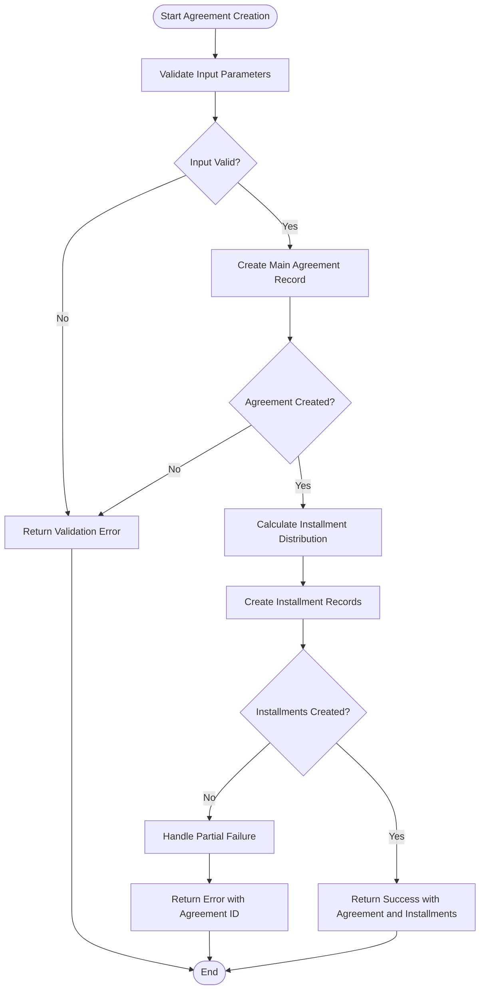

**Diagram sources**
- [criar-acordo-condenacao.service.ts](file://backend/acordos-condenacoes/services/acordos-condenacoes/criar-acordo-condenacao.service.ts#L43-L105)

**Section sources**
- [criar-acordo-condenacao.service.ts](file://backend/acordos-condenacoes/services/acordos-condenacoes/criar-acordo-condenacao.service.ts#L43-L105)
- [acordo-condenacao-persistence.service.ts](file://backend/acordos-condenacoes/services/persistence/acordo-condenacao-persistence.service.ts#L144-L195)

### Business Validation Rules
The service implements comprehensive validation rules to ensure data integrity and compliance with legal requirements:

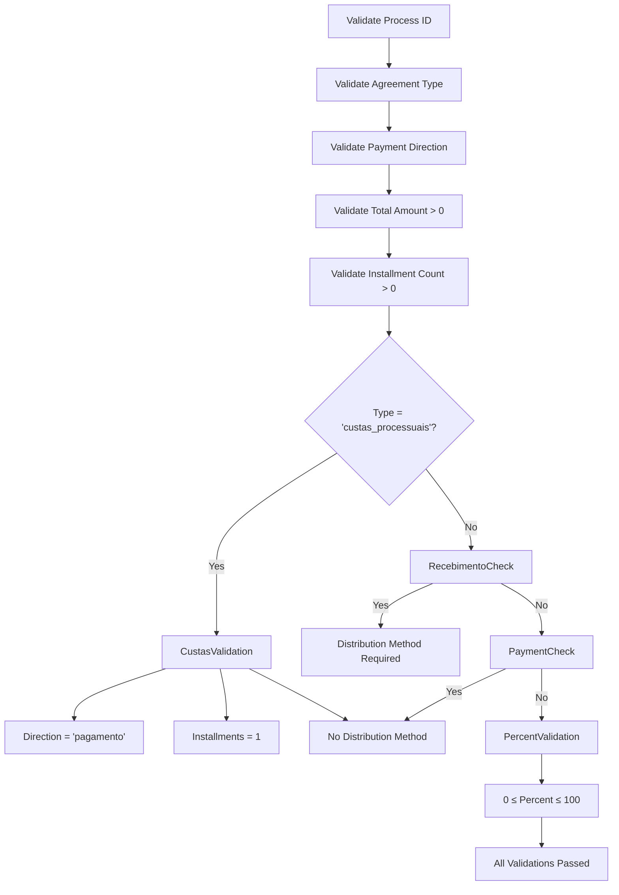

**Diagram sources**
- [criar-acordo-condenacao.service.ts](file://backend/acordos-condenacoes/services/acordos-condenacoes/criar-acordo-condenacao.service.ts#L111-L184)

**Section sources**
- [criar-acordo-condenacao.service.ts](file://backend/acordos-condenacoes/services/acordos-condenacoes/criar-acordo-condenacao.service.ts#L111-L184)

### Installment Calculation Logic
The service automatically calculates installment distribution based on the agreement terms, ensuring proper rounding and distribution of amounts:

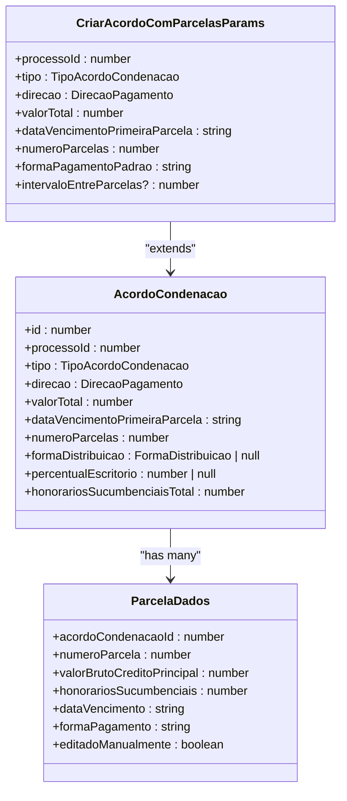

**Diagram sources**
- [criar-acordo-condenacao.service.ts](file://backend/acordos-condenacoes/services/acordos-condenacoes/criar-acordo-condenacao.service.ts#L190-L242)

**Section sources**
- [criar-acordo-condenacao.service.ts](file://backend/acordos-condenacoes/services/acordos-condenacoes/criar-acordo-condenacao.service.ts#L190-L242)

## Hearing Scheduling Service
The hearing scheduling service manages the creation and tracking of court hearings, integrating with case management systems to maintain accurate scheduling information.

### Hearing Creation Process
The `criarAudiencia` function handles the creation of new hearings by coordinating multiple data sources and enforcing business rules:

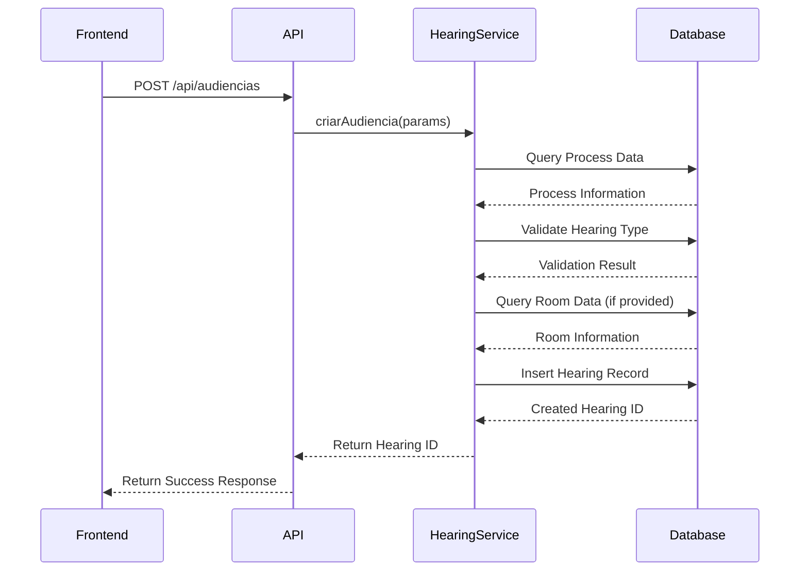

**Diagram sources**
- [criar-audiencia.service.ts](file://backend/audiencias/services/criar-audiencia.service.ts#L9-L109)

**Section sources**
- [criar-audiencia.service.ts](file://backend/audiencias/services/criar-audiencia.service.ts#L9-L109)

### Data Orchestration
The service orchestrates data from multiple domain objects to create a complete hearing record:

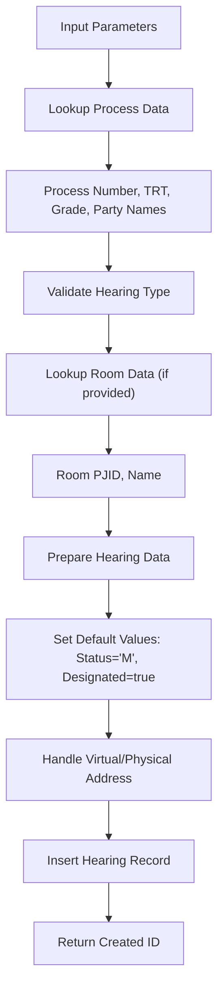

**Diagram sources**
- [criar-audiencia.service.ts](file://backend/audiencias/services/criar-audiencia.service.ts#L12-L97)

**Section sources**
- [criar-audiencia.service.ts](file://backend/audiencias/services/criar-audiencia.service.ts#L12-L97)

## Budget Management Service
The budget management service handles financial planning and tracking, implementing a multi-state workflow for budget lifecycle management.

### Budget Lifecycle Management
The service implements a state machine pattern for budget management with distinct phases:

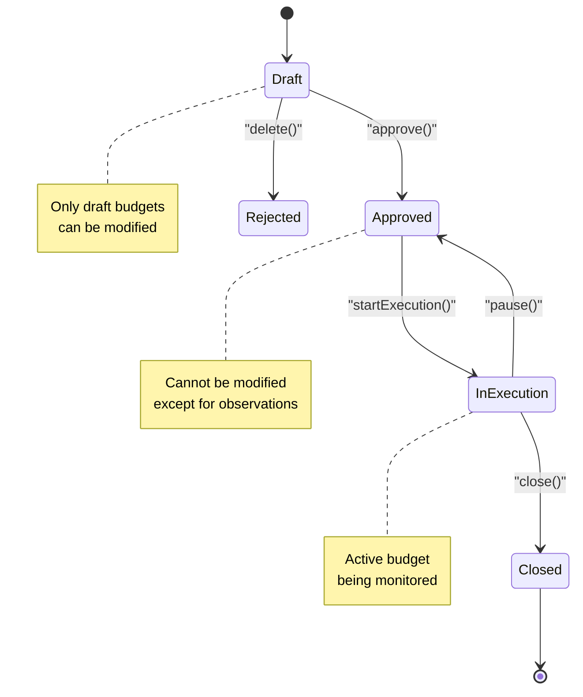

**Diagram sources**
- [gerenciar-orcamento.service.ts](file://backend/financeiro/orcamento/services/orcamento/gerenciar-orcamento.service.ts#L38-L184)

**Section sources**
- [gerenciar-orcamento.service.ts](file://backend/financeiro/orcamento/services/orcamento/gerenciar-orcamento.service.ts#L38-L184)

### Item Management Operations
The service provides comprehensive operations for managing budget items with proper state validation:

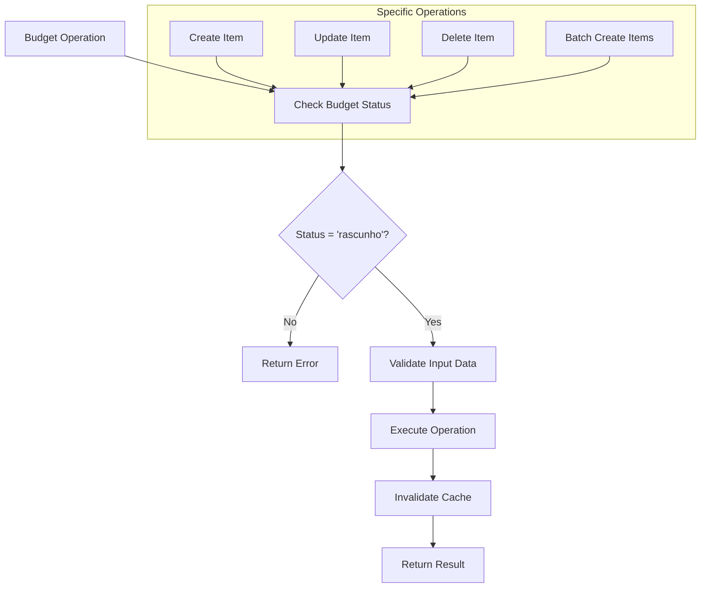

**Diagram sources**
- [gerenciar-orcamento.service.ts](file://backend/financeiro/orcamento/services/orcamento/gerenciar-orcamento.service.ts#L194-L333)

**Section sources**
- [gerenciar-orcamento.service.ts](file://backend/financeiro/orcamento/services/orcamento/gerenciar-orcamento.service.ts#L194-L333)

## Process Orchestration and State Management
The business process services implement sophisticated orchestration patterns to manage complex workflows while maintaining data consistency and enforcing business rules.

### Transaction Management and Error Handling
While the current implementation lacks explicit database transactions, it implements a robust error handling strategy:

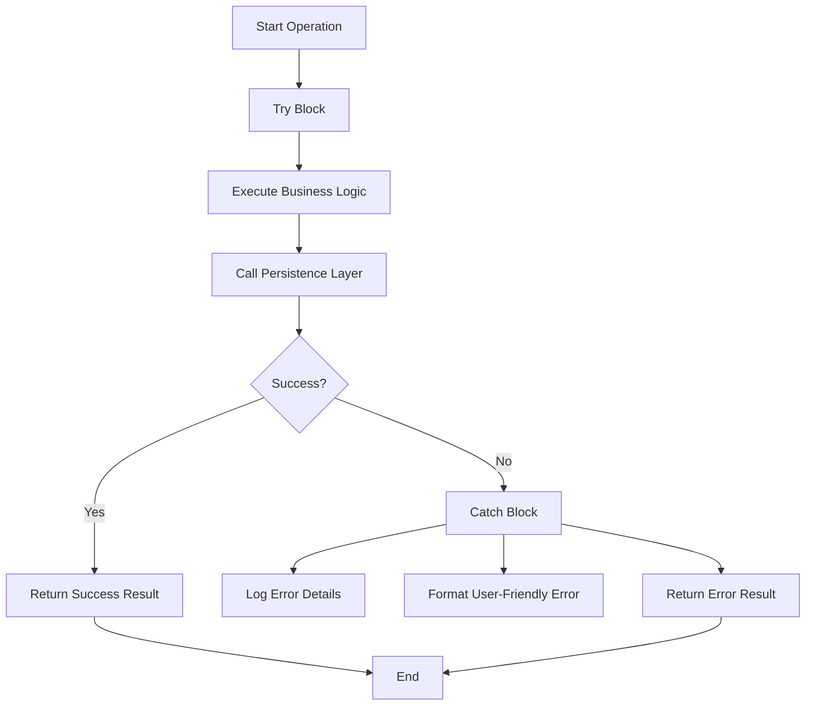

For agreement creation, the service currently has a known limitation where if the agreement is created successfully but installment creation fails, the agreement remains in the database without its installments. This represents a partial failure scenario that should be addressed with proper transaction management.

**Section sources**
- [criar-acordo-condenacao.service.ts](file://backend/acordos-condenacoes/services/acordos-condenacoes/criar-acordo-condenacao.service.ts#L53-L105)

### State Transition Validation
Each service implements strict validation of state transitions to prevent invalid operations:

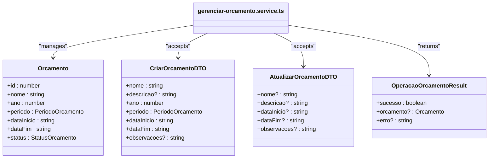

The budget management service enforces that only budgets in "rascunho" (draft) status can be updated or deleted, while only approved budgets can start execution, and only executing budgets can be closed.

**Diagram sources**
- [gerenciar-orcamento.service.ts](file://backend/financeiro/orcamento/services/orcamento/gerenciar-orcamento.service.ts#L88-L143)

**Section sources**
- [gerenciar-orcamento.service.ts](file://backend/financeiro/orcamento/services/orcamento/gerenciar-orcamento.service.ts#L88-L143)

## Integration with UI and External Systems
The business process services integrate with the frontend through API routes and with external systems through various data sources.

### API Layer Integration
The services are exposed to the frontend through Next.js API routes that handle HTTP requests and responses:

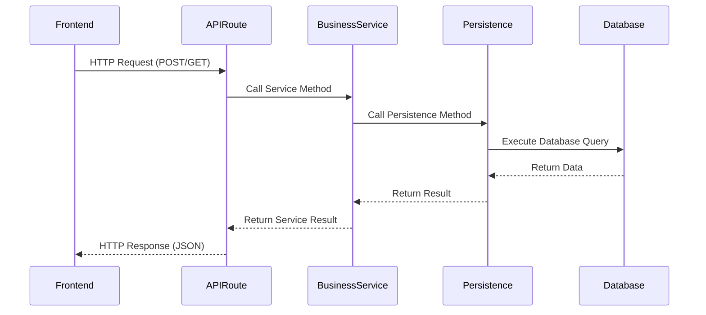

The API routes act as adapters between the HTTP protocol and the business services, handling request parsing, authentication, and response formatting.

**Section sources**
- [route.ts](file://app/api/acordos-condenacoes/route.ts)
- [route.ts](file://app/api/audiencias/route.ts)
- [route.ts](file://app/api/financeiro/orcamentos/route.ts)

### External System Integration
The services integrate with external systems through various mechanisms:

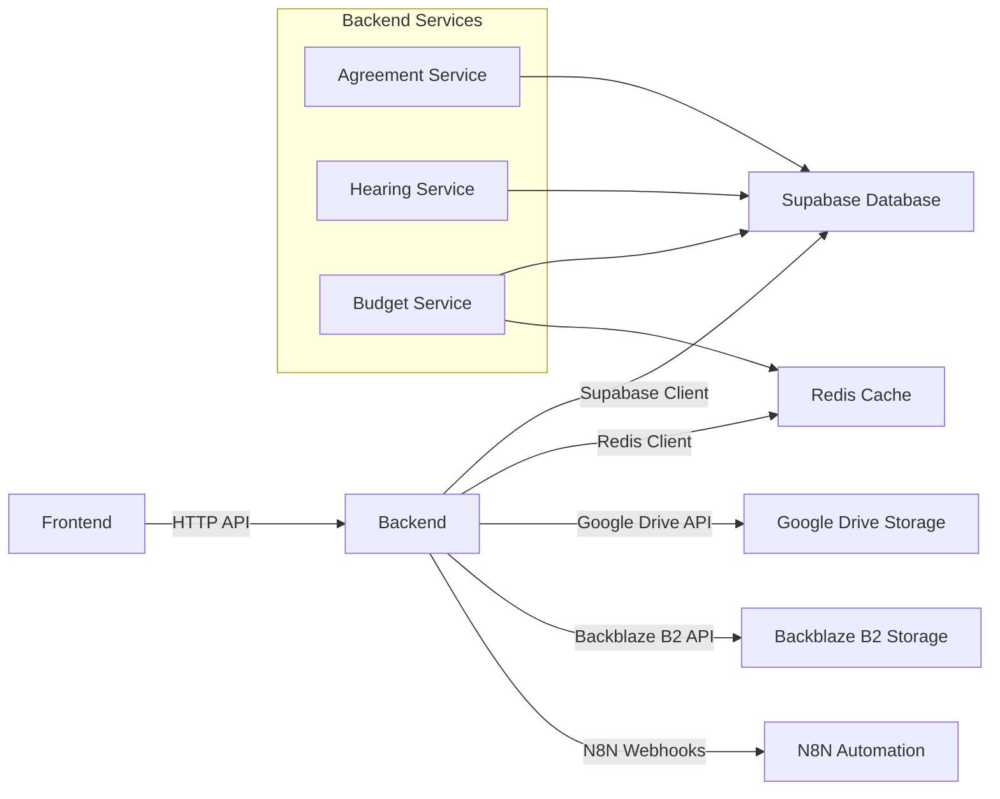

The services use Supabase for database operations, Redis for caching, and various storage providers for document management, creating a distributed system architecture.

**Section sources**
- [criar-acordo-condenacao.service.ts](file://backend/acordos-condenacoes/services/acordos-condenacoes/criar-acordo-condenacao.service.ts)
- [criar-audiencia.service.ts](file://backend/audiencias/services/criar-audiencia.service.ts)
- [gerenciar-orcamento.service.ts](file://backend/financeiro/orcamento/services/orcamento/gerenciar-orcamento.service.ts)

## Common Issues and Solutions
The business process services address several common challenges in legal technology applications.

### Process State Consistency
One of the main challenges is maintaining consistency across related entities. For example, in the agreement management service, there's a risk of partial failure where the agreement is created but installments fail to be created.

**Current Solution**: The service logs the partial failure and returns an error message indicating that the agreement was created but installments failed, allowing for manual intervention.

**Recommended Improvement**: Implement database transactions to ensure atomicity of the entire operation, rolling back the agreement creation if installment creation fails.

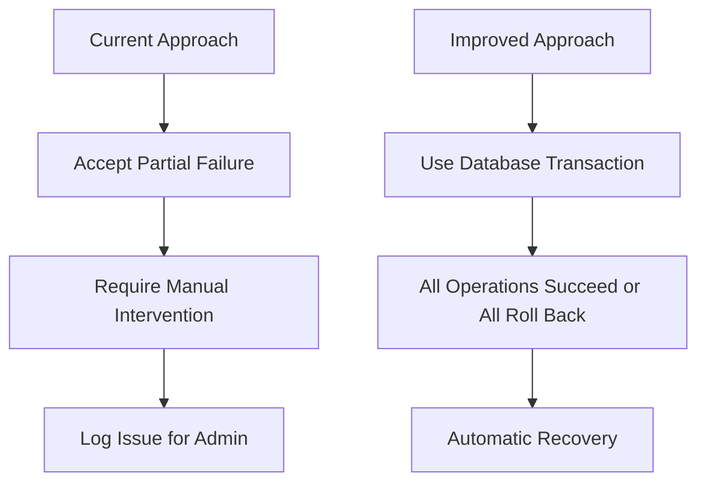

**Section sources**
- [criar-acordo-condenacao.service.ts](file://backend/acordos-condenacoes/services/acordos-condenacoes/criar-acordo-condenacao.service.ts#L75-L85)

### Business Rule Enforcement
The services implement comprehensive business rule enforcement to prevent invalid data states:

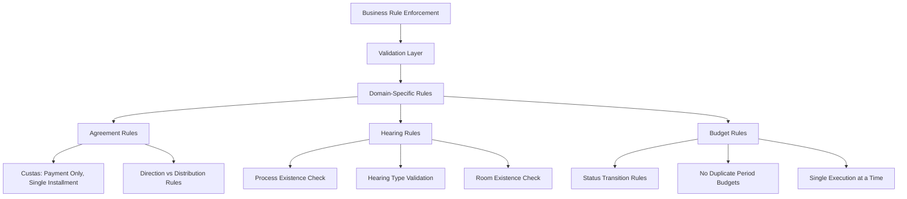

The services validate business rules at multiple levels: input validation, business logic validation, and persistence layer validation, creating defense in depth against invalid data.

**Section sources**
- [criar-acordo-condenacao.service.ts](file://backend/acordos-condenacoes/services/acordos-condenacoes/criar-acordo-condenacao.service.ts#L111-L184)
- [criar-audiencia.service.ts](file://backend/audiencias/services/criar-audiencia.service.ts#L13-L48)
- [gerenciar-orcamento.service.ts](file://backend/financeiro/orcamento/services/orcamento/gerenciar-orcamento.service.ts#L96-L108)

## Conclusion
The Business Process Services in the Application Layer provide robust implementations of complex legal workflows, demonstrating thoughtful design patterns for managing state, enforcing business rules, and orchestrating multiple domain objects. These services effectively separate business logic from data access and presentation concerns, following clean architecture principles.

Key strengths include comprehensive business validation, clear state management, and well-defined service boundaries. Areas for improvement include implementing proper transaction management to prevent partial failures and enhancing error recovery mechanisms.

The services successfully integrate with both the frontend UI and external systems, providing a stable foundation for legal process automation. By following the patterns demonstrated in these services, developers can extend the system with additional business processes while maintaining consistency and reliability.