# Data Management Services

<cite>
**Referenced Files in This Document**   
- [buscar-acervo.service.ts](file://backend/acervo/services/buscar-acervo.service.ts)
- [atualizar-cliente.service.ts](file://backend/clientes/services/clientes/atualizar-cliente.service.ts)
- [listar-partes-contrarias.service.ts](file://backend/partes-contrarias/services/partes-contrarias/listar-partes-contrarias.service.ts)
- [listar-acervo.service.ts](file://backend/acervo/services/persistence/listar-acervo.service.ts)
- [cliente-persistence.service.ts](file://backend/clientes/services/persistence/cliente-persistence.service.ts)
- [parte-contraria-persistence.service.ts](file://backend/partes-contrarias/services/persistence/parte-contraria-persistence.service.ts)
- [route.ts](file://app/api/partes-contrarias/route.ts)
- [route.ts](file://app/api/clientes/route.ts)
</cite>

## Table of Contents
1. [Introduction](#introduction)
2. [Core Data Entities](#core-data-entities)
3. [Service Architecture](#service-architecture)
4. [CRUD Operations Implementation](#crud-operations-implementation)
5. [Data Validation and Business Rules](#data-validation-and-business-rules)
6. [API Layer Integration](#api-layer-integration)
7. [Data Consistency and Relationships](#data-consistency-and-relationships)
8. [Error Handling and Logging](#error-handling-and-logging)
9. [Performance Considerations](#performance-considerations)
10. [Conclusion](#conclusion)

## Introduction

The Data Management Services sub-component of the Application Layer provides a comprehensive system for managing core legal entities in the Sinesys platform. This document details the implementation of services that handle CRUD (Create, Read, Update, Delete) operations for essential entities such as processes (acervo), clients, opposing parties, representatives, and third parties. The services are designed with a clear separation of concerns, following a layered architecture that separates business logic from data persistence.

These services serve as the backbone of the application's data management capabilities, ensuring data integrity, enforcing business rules, and providing efficient access to legal entity information. The implementation follows a service-oriented pattern where each entity has dedicated services for different operations, with clear interfaces and well-defined responsibilities. The services coordinate with the persistence layer to interact with the database while maintaining business logic in the application layer.

The architecture emphasizes type safety through TypeScript interfaces and domain models, ensuring that data structures are consistent across the application. Services are designed to be reusable and composable, allowing for efficient code maintenance and extension. The system also incorporates caching mechanisms to improve performance for frequently accessed data, particularly for read operations on large datasets like the legal process inventory (acervo).

**Section sources**
- [buscar-acervo.service.ts](file://backend/acervo/services/buscar-acervo.service.ts)
- [atualizar-cliente.service.ts](file://backend/clientes/services/clientes/atualizar-cliente.service.ts)
- [listar-partes-contrarias.service.ts](file://backend/partes-contrarias/services/partes-contrarias/listar-partes-contrarias.service.ts)

## Core Data Entities

The Data Management Services operate on several core legal entities that represent the fundamental building blocks of the legal case management system. These entities include clients (clientes), opposing parties (partes contrárias), representatives (representantes), third parties (terceiros), and legal processes (acervo). Each entity has a rich data model with numerous attributes that capture comprehensive information about individuals and organizations involved in legal proceedings.

The client entity (cliente) is a complex data structure with approximately 60 fields that accommodate both individual persons (pessoa física - PF) and legal entities (pessoa jurídica - PJ). For individuals, it includes personal information such as CPF (individual taxpayer registry), RG (identity document), date of birth, gender, marital status, and nationality. For legal entities, it includes CNPJ (corporate taxpayer registry), state registration, date of incorporation, and corporate structure details. The entity also captures contact information, including multiple email addresses and phone numbers, as well as relationship data to addresses and associated legal processes.

Opposing parties (partes contrárias) follow a similar data model to clients but are specifically designated as parties on the opposing side of legal proceedings. The data structure is nearly identical to the client entity, allowing for consistent data management across different party types while maintaining the semantic distinction between clients and opposing parties. This design enables the system to treat both entity types similarly in terms of data operations while preserving their distinct roles in legal contexts.

The process entity (acervo) represents legal cases and contains metadata about court proceedings, including process number, court of jurisdiction, legal classification, status, and key dates such as filing date and next hearing date. It also maintains relationships with parties involved in the case, establishing connections between processes and the individuals or organizations participating in them. This entity serves as the central hub that connects various parties and their interactions within the legal framework.

```mermaid
erDiagram
CLIENTE {
number id PK
"pf"|"pj" tipo_pessoa
string nome
string nome_social_fantasia
string cpf
string cnpj
string rg
string emails[]
string ddd_celular
string numero_celular
string ddd_residencial
string numero_residencial
string ddd_comercial
string numero_comercial
string tipo_documento
string status_pje
string situacao_pje
string login_pje
boolean autoridade
string observacoes
json dados_anteriores
number endereco_id FK
boolean ativo
number created_by
timestamp created_at
timestamp updated_at
}
PARTE_CONTRARIA {
number id PK
"pf"|"pj" tipo_pessoa
string nome
string nome_social_fantasia
string cpf
string cnpj
string rg
string emails[]
string ddd_celular
string numero_celular
string ddd_residencial
string numero_residencial
string ddd_comercial
string numero_comercial
string tipo_documento
string status_pje
string situacao_pje
string login_pje
boolean autoridade
string observacoes
json dados_anteriores
number endereco_id FK
boolean ativo
number created_by
timestamp created_at
timestamp updated_at
}
ACERVO {
number id PK
number id_pje
number advogado_id
"acervo_geral"|"arquivado" origem
string trt
"primeiro_grau"|"segundo_grau" grau
string numero_processo
number numero
string descricao_orgao_julgador
string classe_judicial
boolean segredo_justica
string status
string codigo_status_processo
number prioridade_processual
string nome_parte_autora
number qtde_parte_autora
string nome_parte_re
number qtde_parte_re
string data_autuacao
boolean juizo_digital
string data_arquivamento
string data_proxima_audiencia
boolean tem_associacao
number responsavel_id FK
timestamp created_at
timestamp updated_at
}
ENDERECO {
number id PK
string logradouro
string numero
string complemento
string bairro
string cidade
string estado
string pais
string cep
string tipo_endereco
string tipo_logradouro
string ponto_referencia
string latitude
string longitude
timestamp created_at
timestamp updated_at
}
PROCESSO_PARTES {
number id PK
number entidade_id
number processo_id
string numero_processo
string tipo_parte
string polo
"cliente"|"parte_contraria"|"representante"|"terceiro" tipo_entidade
timestamp created_at
timestamp updated_at
}
CLIENTE ||--o{ PROCESSO_PARTES : "has"
PARTE_CONTRARIA ||--o{ PROCESSO_PARTES : "has"
ACERVO ||--o{ PROCESSO_PARTES : "has"
CLIENTE }o--|| ENDERECO : "has"
PARTE_CONTRARIA }o--|| ENDERECO : "has"
```

**Diagram sources**
- [cliente-persistence.service.ts](file://backend/clientes/services/persistence/cliente-persistence.service.ts#L81-L167)
- [parte-contraria-persistence.service.ts](file://backend/partes-contrarias/services/persistence/parte-contraria-persistence.service.ts#L88-L174)
- [listar-acervo.service.ts](file://backend/acervo/services/persistence/listar-acervo.service.ts#L40-L69)

## Service Architecture

The Data Management Services follow a well-defined architectural pattern that separates concerns between business logic and data persistence. The architecture implements a service layer that acts as an intermediary between the API layer and the persistence layer, ensuring that business rules are consistently enforced across all data operations. This layered approach provides clear separation of responsibilities and enhances code maintainability.

Each service follows a consistent structure with two main components: the business service and the persistence service. The business service (e.g., `atualizar-cliente.service.ts`) contains the application logic, validation rules, and workflow orchestration, while the persistence service (e.g., `cliente-persistence.service.ts`) handles direct database interactions. This separation allows for easier testing, as business logic can be tested independently of database operations, and enables the implementation of different persistence strategies without affecting the business rules.

The services are organized in a hierarchical directory structure that reflects the entity being managed. For example, client-related services are located in `backend/clientes/services/clientes/`, while their corresponding persistence services are in `backend/clientes/services/persistence/`. This organization makes it easy to locate related functionality and understand the relationships between different components. The persistence services are designed to be reusable by multiple business services, promoting code reuse and consistency across operations.

The architecture incorporates several design patterns to enhance functionality and maintainability. The services use dependency injection to access the database client and caching mechanisms, making them easier to test and configure. They also implement a result pattern for operations, returning structured objects that contain success status, data, and error messages rather than throwing exceptions for expected error conditions. This approach makes error handling more predictable and reduces the risk of unhandled exceptions.


**Diagram sources**
- [atualizar-cliente.service.ts](file://backend/clientes/services/clientes/atualizar-cliente.service.ts#L4-L7)
- [cliente-persistence.service.ts](file://backend/clientes/services/persistence/cliente-persistence.service.ts#L4-L5)
- [buscar-acervo.service.ts](file://backend/acervo/services/buscar-acervo.service.ts#L4-L5)

## CRUD Operations Implementation

The Data Management Services implement comprehensive CRUD operations for core legal entities, following a consistent pattern across different entity types. Each operation is carefully designed to handle specific business requirements while maintaining data integrity and providing meaningful feedback to the calling components. The implementation demonstrates a clear separation between high-level business operations and low-level data persistence.

For create operations, the services follow a validation-first approach, ensuring that all required fields are present and valid before attempting to persist data. The `criarCliente` function in the client persistence service validates the presence of essential fields like `tipo_pessoa` and `nome`, and performs type-specific validation for CPF (individual taxpayer registry) or CNPJ (corporate taxpayer registry) depending on whether the entity is an individual or organization. The service also validates email formats when provided, preventing the storage of invalid contact information.

Read operations are implemented with support for filtering, pagination, and sorting to handle large datasets efficiently. The `listarAcervo` function in the acervo persistence service accepts parameters for pagination (pagina, limite), filtering (busca, origem, trt, grau), and sorting (ordenar_por, ordem). The service constructs database queries dynamically based on the provided parameters, applying appropriate filters and ordering before executing the query. Results include metadata about pagination (total, pagina, limite, totalPaginas) to facilitate client-side navigation.

Update operations implement a careful approach to data modification, preserving the previous state of the record for audit purposes. The `atualizarCliente` service sets the `dados_anteriores` field to the current state of the client before applying updates, creating a historical record of changes. This implementation ensures data traceability and supports audit requirements. The service also prevents changes to immutable fields like `tipo_pessoa`, maintaining data consistency across the system.

Delete operations are implemented with proper error handling to manage cases where the target entity does not exist. The services return structured results indicating success or failure, rather than throwing exceptions for expected conditions like attempting to delete a non-existent record. This approach makes error handling more predictable for calling components and reduces the risk of unhandled exceptions.


**Diagram sources**
- [atualizar-cliente.service.ts](file://backend/clientes/services/clientes/atualizar-cliente.service.ts#L20-L47)
- [cliente-persistence.service.ts](file://backend/clientes/services/persistence/cliente-persistence.service.ts#L339-L522)
- [listar-acervo.service.ts](file://backend/acervo/services/persistence/listar-acervo.service.ts#L75-L222)

## Data Validation and Business Rules

The Data Management Services implement comprehensive data validation and enforce critical business rules to maintain data integrity and consistency across the application. Validation occurs at multiple levels, from basic field validation to complex business rule enforcement, ensuring that only valid and meaningful data is stored in the system. The validation strategy follows a layered approach, with immediate validation of input parameters and more sophisticated validation of business constraints.

Field-level validation ensures that basic data requirements are met before any processing occurs. For client and opposing party entities, the services validate the presence of required fields such as `tipo_pessoa` (individual or corporate) and `nome` (name). They also validate document numbers, ensuring that CPF (individual taxpayer registry) contains exactly 11 digits and CNPJ (corporate taxpayer registry) contains exactly 14 digits. Email addresses are validated against a regular expression pattern to ensure they follow the standard email format. These validations prevent the storage of obviously invalid data and provide immediate feedback to users.

Business rule validation enforces more complex constraints that are specific to the legal domain. The services prevent changes to immutable fields like `tipo_pessoa`, ensuring that an entity cannot be converted from an individual to a corporation or vice versa. This rule maintains data consistency and prevents potential issues with related records that may depend on the entity type. The services also implement duplicate prevention by checking for existing records with the same CPF or CNPJ before creating new entities, avoiding data duplication.

The validation system handles error conditions gracefully, returning structured error objects that include both success status and descriptive error messages. This approach allows calling components to handle errors appropriately without needing to parse exception messages. The services distinguish between validation errors (e.g., missing required fields) and constraint violations (e.g., duplicate records), providing specific error messages for each case to help users understand and correct the issues.


**Diagram sources**
- [cliente-persistence.service.ts](file://backend/clientes/services/persistence/cliente-persistence.service.ts#L179-L333)
- [parte-contraria-persistence.service.ts](file://backend/partes-contrarias/services/persistence/parte-contraria-persistence.service.ts#L186-L323)
- [atualizar-cliente.service.ts](file://backend/clientes/services/clientes/atualizar-cliente.service.ts#L14-L18)

## API Layer Integration

The Data Management Services are seamlessly integrated with the API layer through dedicated route handlers that expose the service functionality to external consumers. The API routes follow RESTful principles, providing standard HTTP methods for CRUD operations on legal entities. This integration layer acts as a bridge between the external world and the internal service layer, handling HTTP-specific concerns like authentication, request parsing, and response formatting.

The API routes implement comprehensive authentication and authorization using the `authenticateRequest` function, which validates bearer tokens, session cookies, or service API keys. This security layer ensures that only authorized users and services can access the data management functionality. The authentication result is checked at the beginning of each route handler, and unauthorized requests are immediately rejected with a 401 status code, preventing unauthorized access to sensitive legal data.

Request handling follows a structured pattern that includes input validation, service invocation, and response formatting. For GET requests, the routes parse query parameters from the URL and convert them to the appropriate format for the service layer. For POST requests, they parse JSON bodies and validate required fields before invoking the corresponding service. The routes handle errors gracefully, catching exceptions and returning appropriate HTTP status codes and error messages in a consistent format.

Response formatting ensures that data is presented in a standardized way regardless of the underlying service implementation. Successful responses include a `success: true` flag and the data payload, while error responses include a descriptive error message and the appropriate HTTP status code. This consistent response format makes it easier for client applications to handle responses predictably and implement appropriate error handling.


**Diagram sources**
- [route.ts](file://app/api/clientes/route.ts#L173-L204)
- [route.ts](file://app/api/partes-contrarias/route.ts#L164-L189)
- [atualizar-cliente.service.ts](file://backend/clientes/services/clientes/atualizar-cliente.service.ts#L20-L47)

## Data Consistency and Relationships

The Data Management Services ensure data consistency across related entities through careful management of relationships and referential integrity. The system maintains connections between legal processes (acervo) and the parties involved in them through the `processo_partes` junction table, which establishes many-to-many relationships between processes and parties. This design allows a single process to have multiple parties on each side and enables parties to participate in multiple processes.

When updating party information, the services preserve the historical state of the record by storing the previous data in the `dados_anteriores` field. This approach provides an audit trail of changes while maintaining referential integrity with related processes. The historical data can be used for compliance purposes and to understand the evolution of party information over time. This implementation ensures that changes to party details do not affect the historical accuracy of process records.

The services handle cascading operations carefully to maintain data consistency. When a party is updated, the changes are reflected in all related processes through the `processo_partes` table, ensuring that the most current information is available. However, the system also preserves historical context by not modifying past process records, striking a balance between data accuracy and historical integrity. This approach supports both current operations and historical analysis of legal proceedings.

The architecture includes mechanisms to prevent data inconsistencies such as orphaned records or broken relationships. Foreign key constraints in the database ensure that party records cannot be deleted if they are referenced by active processes. The services also validate relationships during create and update operations, ensuring that all references point to valid entities. This comprehensive approach to data consistency helps maintain the reliability and trustworthiness of the legal case management system.

```mermaid
erDiagram
ACERVO ||--o{ PROCESSO_PARTES : "has"
CLIENTE ||--o{ PROCESSO_PARTES : "participates in"
PARTE_CONTRARIA ||--o{ PROCESSO_PARTES : "participates in"
REPRESENTANTE ||--o{ PROCESSO_PARTES : "represents"
TERCEIRO ||--o{ PROCESSO_PARTES : "involved in"
PROCESSO_PARTES {
number id PK
number entidade_id
number processo_id FK
string numero_processo
string tipo_parte
string polo
"cliente"|"parte_contraria"|"representante"|"terceiro" tipo_entidade
timestamp created_at
timestamp updated_at
}
CLIENTE {
number id PK
string nome
string cpf
string cnpj
json dados_anteriores
timestamp created_at
timestamp updated_at
}
ACERVO {
number id PK
string numero_processo
string status
timestamp data_autuacao
timestamp created_at
timestamp updated_at
}
```

**Diagram sources**
- [processo_partes.sql](file://supabase/schemas/17_processo_partes.sql)
- [cliente-persistence.service.ts](file://backend/clientes/services/persistence/cliente-persistence.service.ts#L367-L368)
- [parte-contraria-persistence.service.ts](file://backend/partes-contrarias/services/persistence/parte-contraria-persistence.service.ts#L353-L354)

## Error Handling and Logging

The Data Management Services implement a comprehensive error handling and logging strategy to ensure system reliability and facilitate troubleshooting. The services use a structured approach to error management, distinguishing between expected error conditions (handled as part of normal flow) and unexpected exceptions (indicating system issues). This approach provides meaningful feedback to users while maintaining system stability.

For expected error conditions such as validation failures or constraint violations, the services return structured result objects with a `sucesso: false` flag and descriptive error messages. This pattern avoids the use of exceptions for expected conditions, making error handling more predictable for calling components. The error messages are designed to be user-friendly, explaining the issue in clear terms and suggesting possible solutions when appropriate.

For unexpected exceptions, the services implement try-catch blocks to prevent unhandled errors from crashing the application. When an unexpected error occurs, it is logged with detailed context including the operation being performed and relevant parameters. The services then return a generic error message to the client while preserving the detailed error information for debugging purposes. This approach maintains system availability while providing developers with the information needed to diagnose and fix issues.

Logging is implemented at multiple levels of the service stack, with different types of information recorded at each level. The business services log high-level operations using descriptive console messages that include operation type and key parameters. The persistence services log database interactions, including cache hits and misses, to monitor performance and identify potential issues. This comprehensive logging strategy provides visibility into system behavior and supports proactive monitoring and troubleshooting.

```mermaid
flowchart TD
A[Service Operation] --> B{Operation Successful?}
B --> |Yes| C[Return Success Result]
B --> |No| D{Error Type}
D --> |Expected| E[Return Structured Error]
D --> |Unexpected| F[Log Detailed Error]
F --> G[Return Generic Error]
style C fill:#9f9,stroke:#333
style E fill:#f99,stroke:#333
style G fill:#f99,stroke:#333
style F fill:#ff9,stroke:#333
subgraph "Logging Levels"
H["console.log('📝 Atualizando cliente...')"]
I["console.debug('Cache hit for listarAcervo')"]
J["console.error('❌ Erro ao atualizar cliente:')"]
end
```



**Diagram sources**
- [atualizar-cliente.service.ts](file://backend/clientes/services/clientes/atualizar-cliente.service.ts#L23-L35)
- [cliente-persistence.service.ts](file://backend/clientes/services/persistence/cliente-persistence.service.ts#L317-L333)
- [listar-acervo.service.ts](file://backend/acervo/services/persistence/listar-acervo.service.ts#L79-L84)

## Performance Considerations

The Data Management Services incorporate several performance optimizations to ensure efficient data access and system responsiveness, particularly when handling large datasets like the legal process inventory (acervo). The most significant optimization is the implementation of Redis caching for frequently accessed data, which reduces database load and improves response times for read operations. The caching strategy is carefully designed to balance performance benefits with data freshness requirements.

For the acervo (legal processes) data, the services implement a 15-minute TTL (time-to-live) cache for list operations, significantly reducing database queries for common operations like browsing the process inventory. Individual process records are cached with a 15-minute TTL, while client records have a longer 20-minute TTL. This tiered caching approach recognizes that client information changes less frequently than process status updates, allowing for longer cache durations without compromising data accuracy.

The services also optimize database queries by using appropriate indexing and query patterns. List operations include count queries with `count: 'exact'` to support pagination, while filtering is implemented using efficient database operators like `ilike` for partial matching and `eq` for exact matches. The services apply pagination at the database level using range queries, preventing the retrieval of large result sets that could impact performance.

For complex operations that involve multiple entities, the services implement batch operations to minimize database round-trips. When retrieving opposing parties with their associated processes, the service first fetches the parties and then queries the `processo_partes` table for all related processes in a single operation, rather than making individual queries for each party. This batching strategy significantly reduces database load and improves response times for complex queries.


**Diagram sources**
- [listar-acervo.service.ts](file://backend/acervo/services/persistence/listar-acervo.service.ts#L16-L17)
- [cliente-persistence.service.ts](file://backend/clientes/services/persistence/cliente-persistence.service.ts#L553-L554)
- [parte-contraria-persistence.service.ts](file://backend/partes-contrarias/services/persistence/parte-contraria-persistence.service.ts#L947-L972)

## Conclusion

The Data Management Services in the Sinesys platform provide a robust and well-structured foundation for managing core legal entities. The implementation demonstrates a thoughtful approach to software architecture, with clear separation of concerns between business logic and data persistence, comprehensive validation and error handling, and effective integration with the API layer. The services are designed to handle the complex requirements of legal case management while maintaining data integrity and system performance.

Key strengths of the implementation include the consistent service pattern across different entity types, the comprehensive validation of data and business rules, and the effective use of caching to optimize performance. The services provide a reliable interface for creating, reading, updating, and deleting legal entities, with proper handling of relationships and data consistency. The integration with the API layer ensures secure and standardized access to these capabilities.

For developers working with these services, the clear structure and consistent patterns make it relatively straightforward to understand and extend the functionality. The use of TypeScript interfaces and domain models provides strong typing that helps prevent errors and makes the code more maintainable. The comprehensive logging and error handling also facilitate troubleshooting and debugging.

Future enhancements could include more sophisticated search capabilities, improved batch operations for bulk updates, and enhanced audit logging for compliance purposes. However, the current implementation provides a solid foundation that effectively meets the core requirements for managing legal entities in the Sinesys platform.