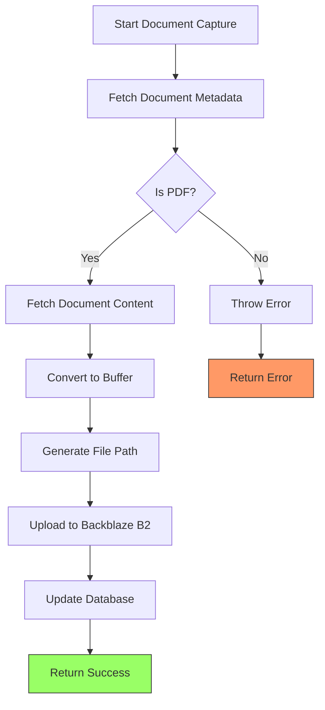
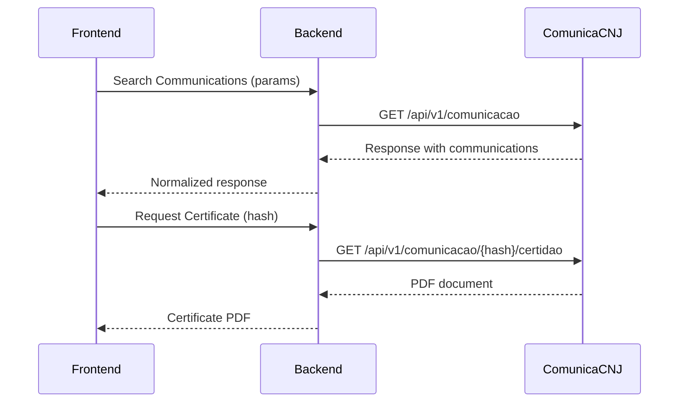
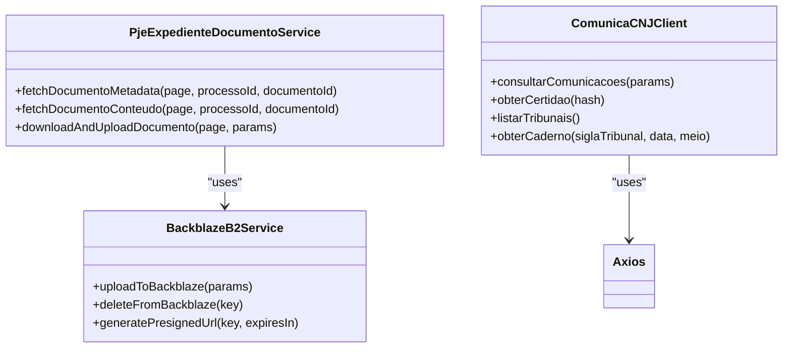
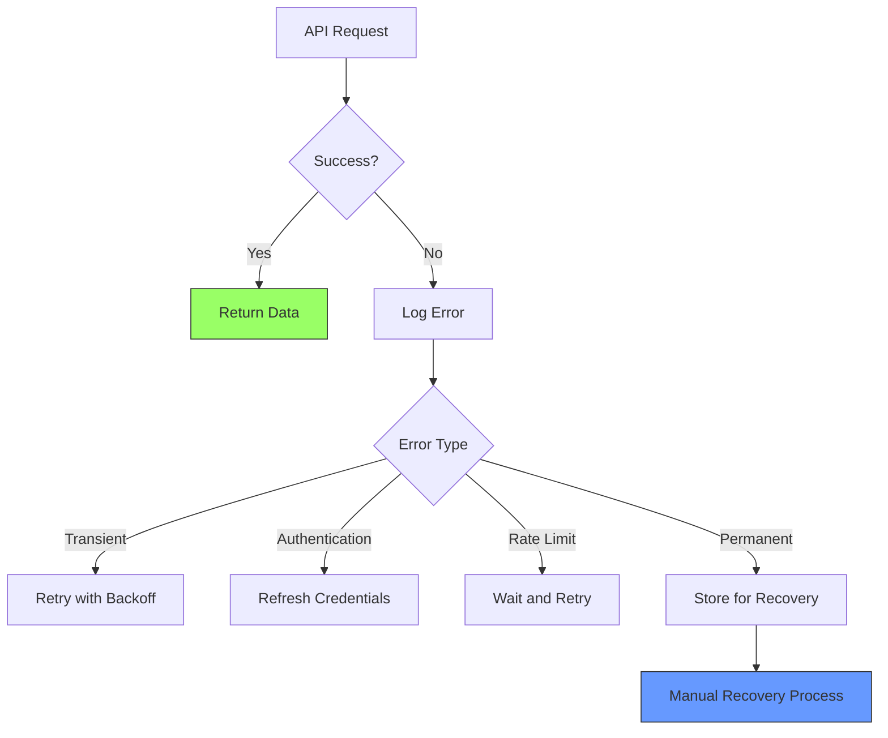
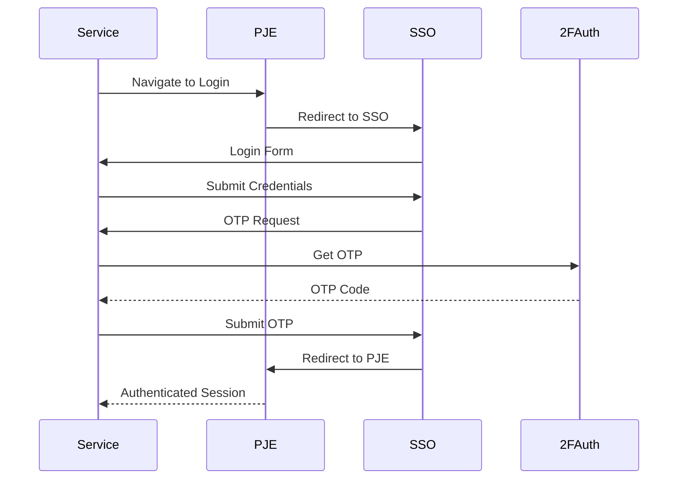
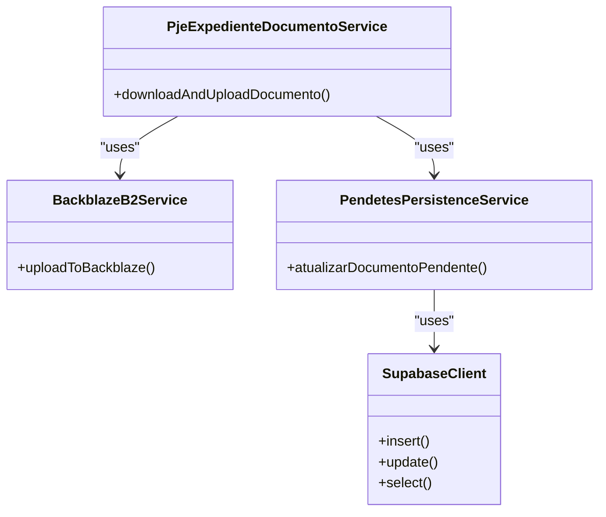

# Integration Services

<cite>
**Referenced Files in This Document**   
- [pje-expediente-documento.service.ts](file://backend/captura/services/pje/pje-expediente-documento.service.ts)
- [captura-recovery.service.ts](file://backend/captura/services/recovery/captura-recovery.service.ts)
- [comunica-cnj-client.ts](file://backend/comunica-cnj/client/comunica-cnj-client.ts)
- [obter-certidao.service.ts](file://backend/comunica-cnj/services/comunica-cnj/obter-certidao.service.ts)
- [trt-auth.service.ts](file://backend/captura/services/trt/trt-auth.service.ts)
- [pendentes-persistence.service.ts](file://backend/captura/services/persistence/pendentes-persistence.service.ts)
- [backblaze-b2.service.ts](file://backend/storage/backblaze-b2.service.ts)
- [documento-types.ts](file://backend/types/pje-trt/documento-types.ts)
- [types.ts](file://backend/comunica-cnj/types/types.ts)
</cite>

## Table of Contents
1. [Introduction](#introduction)
2. [PJE-TRT Judicial Data Capture](#pje-trt-judicial-data-capture)
3. [Comunica CNJ Certificate Generation](#comunica-cnj-certificate-generation)
4. [Document Collaboration Integration](#document-collaboration-integration)
5. [Service Implementation Details](#service-implementation-details)
6. [Error Handling and Recovery](#error-handling-and-recovery)
7. [Data Synchronization and Transformation](#data-synchronization-and-transformation)
8. [Authentication and Rate Limiting](#authentication-and-rate-limiting)
9. [Relationships with Data Management Services](#relationships-with-data-management-services)
10. [Common Issues and Solutions](#common-issues-and-solutions)
11. [Conclusion](#conclusion)

## Introduction

Integration Services form a critical sub-component of the Application Layer, enabling seamless communication with external systems such as PJE-TRT for judicial data capture, Comunica CNJ for certificate generation, and document collaboration platforms. These services orchestrate complex workflows involving authentication, data retrieval, transformation, storage, and error handling to ensure reliable integration with external APIs.

The integration architecture follows a service-oriented design pattern, with specialized services handling specific external systems. Each service encapsulates the complexity of interacting with external APIs, providing a clean interface for the rest of the application. The services are designed with resilience in mind, incorporating retry mechanisms, rate limiting, and comprehensive error handling to maintain system stability even when external dependencies experience issues.

This document provides a comprehensive analysis of the key integration services, focusing on their implementation details, API interaction patterns, error handling strategies, and relationships with other components in the system.

**Section sources**
- [pje-expediente-documento.service.ts](file://backend/captura/services/pje/pje-expediente-documento.service.ts#L1-L299)
- [comunica-cnj-client.ts](file://backend/comunica-cnj/client/comunica-cnj-client.ts#L1-L574)

## PJE-TRT Judicial Data Capture

The PJE-TRT integration service enables the capture of judicial data from the PJE (Processo Judicial Eletrônico) system used by Brazilian Labor Courts (TRT). This service is specifically designed to retrieve documents from pending cases that require manifestation, providing a complete workflow from authentication to data persistence.

The core functionality is implemented in the `pje-expediente-documento.service.ts` file, which orchestrates the entire document capture process. The service follows a three-step approach: first, it retrieves document metadata to validate the document type; second, it fetches the actual document content; and third, it uploads the document to cloud storage and updates the database with the file information.

**Diagram sources**
- [pje-expediente-documento.service.ts](file://backend/captura/services/pje/pje-expediente-documento.service.ts#L171-L298)

The service uses Playwright to interact with the PJE system through a browser context, maintaining authentication cookies across requests. This approach allows the service to navigate the PJE interface as a human user would, ensuring compatibility with the system's security mechanisms. The authentication process is handled by the `trt-auth.service.ts` file, which manages the login flow including two-factor authentication via the 2FAuth service.

**Section sources**
- [pje-expediente-documento.service.ts](file://backend/captura/services/pje/pje-expediente-documento.service.ts#L1-L299)
- [trt-auth.service.ts](file://backend/captura/services/trt/trt-auth.service.ts#L1-L603)

## Comunica CNJ Certificate Generation

The Comunica CNJ integration enables certificate generation from the CNJ's (National Council of Justice) public API for procedural communications. This service provides access to official communications published in electronic bulletins and official gazettes, allowing users to obtain certified copies of legal notices.

The integration is implemented through the `comunica-cnj-client.ts` file, which provides a comprehensive client for the Comunica CNJ API. The client supports multiple operations including searching for communications, retrieving tribunal information, and obtaining certificate PDFs. The service follows RESTful principles and handles JSON responses from the API.

**Diagram sources**
- [comunica-cnj-client.ts](file://backend/comunica-cnj/client/comunica-cnj-client.ts#L162-L207)
- [comunica-cnj-client.ts](file://backend/comunica-cnj/client/comunica-cnj-client.ts#L221-L265)

The service implements rate limiting to comply with API usage policies, tracking rate limit headers and preventing requests when the limit is reached. It also includes retry logic for handling temporary failures, automatically retrying requests after appropriate delays. The client uses Axios for HTTP requests and includes comprehensive error handling to provide meaningful feedback when API calls fail.

**Section sources**
- [comunica-cnj-client.ts](file://backend/comunica-cnj/client/comunica-cnj-client.ts#L1-L574)
- [obter-certidao.service.ts](file://backend/comunica-cnj/services/comunica-cnj/obter-certidao.service.ts#L1-L66)

## Document Collaboration Integration

The document collaboration integration enables seamless interaction with cloud storage platforms for document management and sharing. Currently, the system integrates with Backblaze B2 for document storage, providing reliable and scalable cloud storage for captured judicial documents.

The integration is implemented in the `backblaze-b2.service.ts` file, which provides a service layer for uploading, downloading, and managing documents in Backblaze B2 storage. The service uses the AWS SDK v3 with S3-compatible API to interact with Backblaze B2, ensuring compatibility and reliability.

**Diagram sources**
- [backblaze-b2.service.ts](file://backend/storage/backblaze-b2.service.ts#L78-L116)

The service supports key operations including uploading documents, generating presigned URLs for secure access, and deleting documents. When a document is uploaded, the service returns metadata including the public URL, file key, and bucket name, which are stored in the application database for future reference. Presigned URLs provide temporary access to private documents without making the entire bucket public.

**Section sources**
- [backblaze-b2.service.ts](file://backend/storage/backblaze-b2.service.ts#L1-L195)

## Service Implementation Details

The integration services follow a modular design with clear separation of concerns. Each service focuses on a specific external system and provides a well-defined interface for other components to use. The implementation details reveal sophisticated patterns for handling the complexities of external API integration.

The PJE-TRT document service (`pje-expediente-documento.service.ts`) implements a comprehensive workflow that begins with metadata retrieval to validate the document type before proceeding with the full download. This approach conserves bandwidth and processing time by avoiding unnecessary downloads of non-PDF documents. The service converts the base64-encoded PDF content from the PJE API into a Buffer for efficient handling during the upload process.

**Diagram sources**
- [pje-expediente-documento.service.ts](file://backend/captura/services/pje/pje-expediente-documento.service.ts#L68-L298)
- [backblaze-b2.service.ts](file://backend/storage/backblaze-b2.service.ts#L78-L116)
- [comunica-cnj-client.ts](file://backend/comunica-cnj/client/comunica-cnj-client.ts#L162-L265)

The Comunica CNJ client (`comunica-cnj-client.ts`) implements a class-based approach with instance methods for each API operation. The client maintains rate limit state in memory, tracking the number of remaining requests and reset time from API headers. This allows the service to make informed decisions about when to make requests and when to wait to avoid exceeding rate limits.

**Section sources**
- [pje-expediente-documento.service.ts](file://backend/captura/services/pje/pje-expediente-documento.service.ts#L1-L299)
- [backblaze-b2.service.ts](file://backend/storage/backblaze-b2.service.ts#L1-L195)
- [comunica-cnj-client.ts](file://backend/comunica-cnj/client/comunica-cnj-client.ts#L1-L574)

## Error Handling and Recovery

The integration services implement comprehensive error handling strategies to ensure system reliability and provide meaningful feedback when issues occur. Each service includes detailed logging, error classification, and recovery mechanisms to handle the various failure modes that can occur when interacting with external systems.

The `captura-recovery.service.ts` file provides specialized functionality for recovering from failed capture attempts. This service allows administrators to list, search, and analyze capture logs stored in MongoDB, enabling reprocessing of failed captures. The recovery service includes functions for listing logs with filters, searching by log ID, and retrieving detailed error information.

**Diagram sources**
- [captura-recovery.service.ts](file://backend/captura/services/recovery/captura-recovery.service.ts#L35-L148)
- [captura-recovery.service.ts](file://backend/captura/services/recovery/captura-recovery.service.ts#L166-L186)

The error handling strategy includes different approaches for different error types. Transient errors (network issues, timeouts) are handled with retry mechanisms, while authentication errors trigger credential refresh processes. Rate limiting errors are handled by respecting the rate limit headers and waiting until the limit resets. Permanent errors are logged and stored for potential manual recovery through the recovery service.

**Section sources**
- [captura-recovery.service.ts](file://backend/captura/services/recovery/captura-recovery.service.ts#L1-L395)
- [pje-expediente-documento.service.ts](file://backend/captura/services/pje/pje-expediente-documento.service.ts#L283-L297)
- [comunica-cnj-client.ts](file://backend/comunica-cnj/client/comunica-cnj-client.ts#L497-L536)

## Data Synchronization and Transformation

The integration services handle complex data synchronization and transformation processes to ensure data consistency between external systems and the application database. When data is retrieved from external APIs, it undergoes transformation to match the application's data model before being persisted.

The PJE-TRT service transforms document data from the PJE API format to the application's internal format, mapping fields appropriately and handling data type conversions. For example, date strings from the PJE API are parsed into ISO format timestamps before storage. The service also generates appropriate file names and paths for documents based on the process number, document ID, and capture date.

**Diagram sources**
- [pje-expediente-documento.service.ts](file://backend/captura/services/pje/pje-expediente-documento.service.ts#L245-L251)
- [documento-types.ts](file://backend/types/pje-trt/documento-types.ts#L159-L164)

The Comunica CNJ service implements similar transformation logic, normalizing the API response to a consistent internal format. The raw response from the Comunica CNJ API has inconsistent field naming (mix of snake_case and camelCase), so the service normalizes these to a consistent format. It also enriches the data by extracting party names and attorney information from the destination arrays.

**Section sources**
- [pje-expediente-documento.service.ts](file://backend/captura/services/pje/pje-expediente-documento.service.ts#L245-L251)
- [comunica-cnj-client.ts](file://backend/comunica-cnj/client/comunica-cnj-client.ts#L55-L82)
- [documento-types.ts](file://backend/types/pje-trt/documento-types.ts#L159-L164)

## Authentication and Rate Limiting

Authentication and rate limiting are critical aspects of the integration services, ensuring secure and compliant access to external APIs. The services implement sophisticated mechanisms to handle authentication challenges and respect API rate limits.

The PJE-TRT integration uses browser-based authentication through Playwright, simulating a real user login process. This includes handling the SSO (Single Sign-On) with gov.br, entering credentials, and processing two-factor authentication codes. The `trt-auth.service.ts` file manages this complex flow, including anti-detection measures to prevent the system from being identified as automated.

**Diagram sources**
- [trt-auth.service.ts](file://backend/captura/services/trt/trt-auth.service.ts#L291-L384)

The Comunica CNJ service implements rate limiting based on HTTP headers returned by the API. The client tracks the rate limit state (limit, remaining, reset time) and prevents requests when the limit is reached. When a rate limit error (429) is received, the service automatically waits for the reset period before retrying the request.

**Section sources**
- [trt-auth.service.ts](file://backend/captura/services/trt/trt-auth.service.ts#L1-L603)
- [comunica-cnj-client.ts](file://backend/comunica-cnj/client/comunica-cnj-client.ts#L387-L405)

## Relationships with Data Management Services

The integration services work closely with data management services to ensure captured data is properly stored and accessible within the application. The services follow a pattern of retrieving data from external systems, transforming it to the application's data model, and persisting it through dedicated data management services.

The PJE-TRT document service integrates with the `pendentes-persistence.service.ts` file, which handles database operations for pending cases. After a document is successfully uploaded to Backblaze B2, the document service calls the persistence service to update the corresponding record in the database with the file information (name, URL, key, bucket).

**Diagram sources**
- [pje-expediente-documento.service.ts](file://backend/captura/services/pje/pje-expediente-documento.service.ts#L273-L274)
- [pendentes-persistence.service.ts](file://backend/captura/services/persistence/pendentes-persistence.service.ts#L258-L287)

The Comunica CNJ service similarly integrates with data management services to store captured communications in the database. When a communication is retrieved from the CNJ API, it is transformed and persisted through dedicated services that handle the database operations, ensuring data consistency and proper relationship management.

**Section sources**
- [pje-expediente-documento.service.ts](file://backend/captura/services/pje/pje-expediente-documento.service.ts#L39-L40)
- [pendentes-persistence.service.ts](file://backend/captura/services/persistence/pendentes-persistence.service.ts#L1-L288)

## Common Issues and Solutions

The integration services are designed to handle a variety of common issues that can occur when interacting with external systems. Understanding these issues and their solutions is crucial for maintaining system reliability and troubleshooting problems.

One common issue is authentication failure, which can occur due to expired credentials, incorrect OTP codes, or changes in the authentication flow. The services handle this by implementing retry mechanisms and providing clear error messages to help users resolve the issue. For PJE-TRT integration, users may need to update their credentials or ensure their 2FAuth configuration is correct.

Network connectivity issues are another common problem, especially when dealing with government systems that may have intermittent availability. The services implement retry mechanisms with exponential backoff to handle temporary network issues. The Playwright-based PJE integration includes timeout handling and page load state waiting to accommodate slow network conditions.

Rate limiting is a frequent challenge with external APIs like Comunica CNJ. The client service handles this by tracking rate limit headers and automatically waiting when the limit is reached. Developers should monitor rate limit usage and adjust request patterns to stay within limits.

Data format inconsistencies can occur when external APIs change their response structure. The services include defensive programming practices such as optional chaining and default values to handle missing or unexpected fields. When significant changes occur, the data transformation logic may need to be updated to accommodate the new format.

**Section sources**
- [pje-expediente-documento.service.ts](file://backend/captura/services/pje/pje-expediente-documento.service.ts#L283-L297)
- [comunica-cnj-client.ts](file://backend/comunica-cnj/client/comunica-cnj-client.ts#L497-L536)
- [trt-auth.service.ts](file://backend/captura/services/trt/trt-auth.service.ts#L149-L153)

## Conclusion

The Integration Services sub-component provides robust and reliable connectivity with external systems essential for the application's functionality. By implementing sophisticated patterns for authentication, data retrieval, transformation, and error handling, these services ensure seamless interaction with external APIs while maintaining system stability.

The modular design of the services allows for easy maintenance and extension, with clear separation of concerns between different integration points. The comprehensive error handling and recovery mechanisms provide resilience against the various failure modes that can occur when interacting with external systems.

For developers, understanding these services is crucial for troubleshooting integration issues and extending the system's capabilities. The services provide a solid foundation for adding new integrations with other external systems in the future, following the established patterns and best practices.