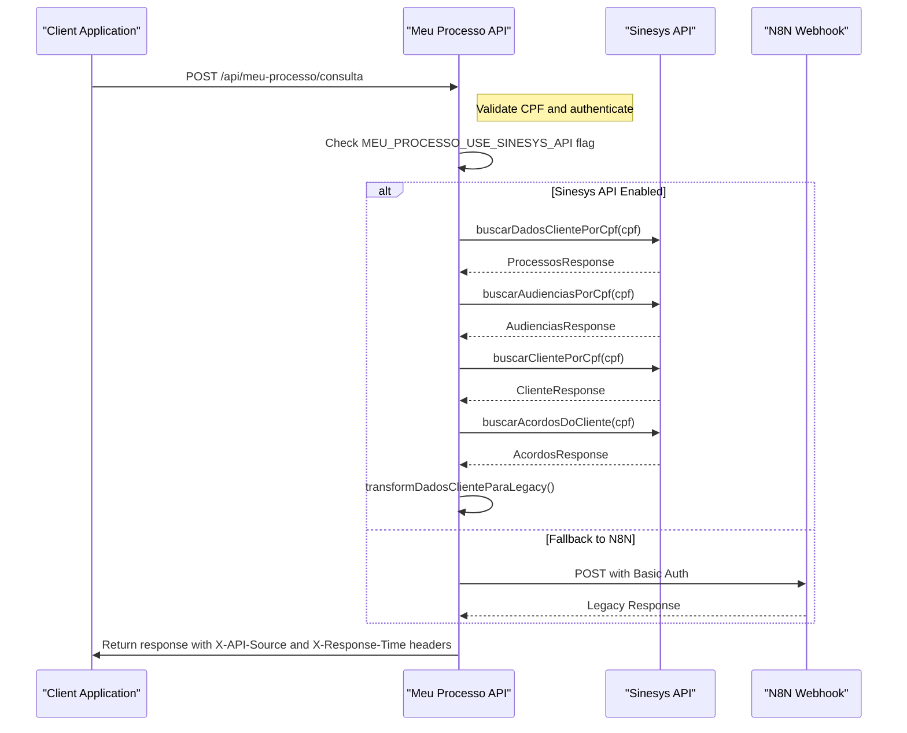

# Sinesys API Integration

<cite>
**Referenced Files in This Document**   
- [sinesys-client.ts](file://lib/services/sinesys-client.ts)
- [meu-processo-types.ts](file://lib/types/meu-processo-types.ts)
- [meu-processo-transformers.ts](file://lib/transformers/meu-processo-transformers.ts)
- [route.ts](file://app/api/meu-processo/consulta/route.ts)
- [ANALISE-MIGRACAO-MEU-PROCESSO.md](file://ANALISE-MIGRACAO-MEU-PROCESSO.md)
- [DEPLOY.md](file://DEPLOY.md)
- [api-referencia/page.tsx](file://app/ajuda/desenvolvimento/api-referencia/page.tsx)
- [variaveis-ambiente/page.tsx](file://app/ajuda/desenvolvimento/variaveis-ambiente/page.tsx)
- [meu-processo-metrics.ts](file://lib/services/meu-processo-metrics.ts)
</cite>

## Update Summary
**Changes Made**   
- Added documentation for the new Meu Processo Consulta endpoint with feature flag support (MEU_PROCESSO_USE_SINESYS_API)
- Added fallback mechanism to N8N webhook with configurable credentials
- Documented configurable timeout (MEU_PROCESSO_TIMEOUT), retry attempts (MEU_PROCESSO_RETRIES), and response caching (MEU_PROCESSO_CACHE_TTL)
- Updated environment variables section with new configuration options
- Added error logging with X-API-Source and X-Response-Time headers
- Enhanced implementation details for the new API route

## Table of Contents
1. [Introduction](#introduction)
2. [API Client Overview](#api-client-overview)
3. [Authentication and Configuration](#authentication-and-configuration)
4. [Core API Endpoints](#core-api-endpoints)
5. [Data Models and Response Structure](#data-models-and-response-structure)
6. [Error Handling](#error-handling)
7. [Integration Patterns](#integration-patterns)
8. [N8N Integration](#n8n-integration)
9. [Best Practices](#best-practices)

## Introduction

The Sinesys API integration provides a comprehensive interface for accessing legal case management data from the Sinesys system. This documentation details the integration architecture, client implementation, and usage patterns for external applications to consume Sinesys data securely and efficiently.

The integration is designed to support the "Meu Processo" application and other client-facing services that need to retrieve case information, hearings, contracts, and agreements based on client CPF (Brazilian individual taxpayer registry). The API follows a layered architecture with proper authentication, error handling, and retry mechanisms.

**Section sources**
- [sinesys-client.ts](file://lib/services/sinesys-client.ts)
- [meu-processo-types.ts](file://lib/types/meu-processo-types.ts)

## API Client Overview

The Sinesys API integration is implemented through a dedicated client class that provides a clean, type-safe interface for consuming the API. The client abstracts the underlying HTTP communication and provides high-level methods for common operations.

The `SinesysClient` class serves as the primary interface for API integration, offering methods to retrieve various types of legal data by CPF. The client is designed with robust features including request retry logic, timeout handling, and proper error propagation.

```mermaid
classDiagram
class SinesysClient {
-config : SinesysClientConfig
+constructor(config : SinesysClientConfig)
-request<T>(endpoint : string, options? : RequestInit) : Promise<T>
-requestWithRetry<T>(endpoint : string, options? : RequestInit) : Promise<T>
+buscarProcessosPorCpf(cpf : string) : Promise<SinesysProcessoResponse>
+buscarAudienciasPorCpf(cpf : string) : Promise<SinesysAudienciasResponse>
+buscarClientePorCpf(cpf : string) : Promise<SinesysClienteResponse>
+buscarContratosPorClienteId(clienteId : number, options? : {pagina? : number, limite? : number}) : Promise<SinesysContratosResponse>
+buscarContratosPorCpf(cpf : string, options? : {pagina? : number, limite? : number}) : Promise<SinesysContratosResponse>
+buscarAcordosPorProcessoId(processoId : number, options? : {pagina? : number, limite? : number}) : Promise<SinesysAcordosResponse>
+buscarDadosClientePorCpf(cpf : string) : Promise<any>
+buscarAcordosDoCliente(cpf : string) : Promise<SinesysAcordosResponse>
}
class SinesysClientConfig {
+baseUrl : string
+apiKey : string
+timeout? : number
+retries? : number
}
SinesysClient --> SinesysClientConfig : "uses"
```

**Diagram sources**
- [sinesys-client.ts](file://lib/services/sinesys-client.ts)

**Section sources**   
- [sinesys-client.ts](file://lib/services/sinesys-client.ts)

## Authentication and Configuration

The Sinesys API integration uses a service-level API key for authentication. This key must be included in the HTTP headers of all requests to authorize access to the API endpoints.

### Environment Variables

The client is configured using environment variables that should be set in the consuming application:

```env
NEXT_PUBLIC_SINESYS_API_URL=https://api.sinesys.com.br
SINESYS_SERVICE_API_KEY=<chave_secreta>
SINESYS_TIMEOUT=30000
SINESYS_RETRIES=2
```

The API key is sent in the `x-service-api-key` header for each request, providing a secure authentication mechanism that doesn't expose user credentials.

### Configuration Options

The `SinesysClientConfig` interface defines the configuration options for the client:

- `baseUrl`: The base URL of the Sinesys API
- `apiKey`: The service API key for authentication
- `timeout`: Request timeout in milliseconds (default: 30,000ms)
- `retries`: Number of retry attempts for failed requests (default: 2)

The client uses these configuration options to establish a connection with the Sinesys API and handle requests appropriately.

**Section sources**   
- [sinesys-client.ts](file://lib/services/sinesys-client.ts)
- [ANALISE-MIGRACAO-MEU-PROCESSO.md](file://ANALISE-MIGRACAO-MEU-PROCESSO.md)

## Core API Endpoints

The Sinesys API provides several endpoints for retrieving legal case information. The client exposes methods that correspond to these endpoints, making it easy to access the required data.

### Process Data Endpoint

The process data endpoint retrieves all legal cases associated with a client's CPF. This information includes case numbers, types, parties involved, court information, and timeline data.

**Endpoint**: `GET /api/acervo/cliente/cpf/{cpf}`

### Hearing Data Endpoint

The hearing data endpoint retrieves all scheduled hearings for a client. This includes hearing types, dates, times, modalities (virtual, in-person, hybrid), and status information.

**Endpoint**: `GET /api/audiencias/cliente/cpf/{cpf}`

### Client Data Endpoint

The client data endpoint retrieves the client's registration information, including name, contact details, and address.

**Endpoint**: `GET /api/clientes/buscar/por-cpf/{cpf}`

### Contract Data Endpoint

The contract data endpoint retrieves all contracts associated with a client. Since this endpoint requires a client ID rather than a CPF, the integration first retrieves the client ID using the CPF before fetching the contracts.

**Endpoint**: `GET /api/contratos?clienteId={id}`

### Agreement Data Endpoint

The agreement data endpoint retrieves all agreements and judgments associated with a specific case. This requires a process ID, which must be obtained from the process data before fetching agreements.

**Endpoint**: `GET /api/acordos-condenacoes?processoId={id}`

### New API Endpoint: Meu Processo Consulta

A new API endpoint has been implemented at `app/api/meu-processo/consulta/route.ts` to serve as the primary interface for the "Meu Processo" application. This endpoint provides a unified interface that aggregates data from multiple sources and transforms it into the legacy format required by existing integrations.

**Endpoint**: `POST /api/meu-processo/consulta`

**Authentication**: Service API Key via header `x-service-api-key`

**Feature Flag**: Controlled by environment variable `MEU_PROCESSO_USE_SINESYS_API` (boolean)

**Request Body**:
```json
{
  "cpf": "12345678901"
}
```

**Response**:
```json
{
  "contratos": [],
  "acordos_condenacoes": [],
  "audiencias": [],
  "processos": [],
  "message": "Não foram encontrados dados para este CPF"
}
```

The endpoint performs the following operations:
1. Validates the CPF format
2. Authenticates the request using the service API key
3. When `MEU_PROCESSO_USE_SINESYS_API=true`, retrieves all client data (processes, hearings, contracts) in parallel from Sinesys API
4. Fetches agreements for all client processes
5. Transforms the aggregated data into the legacy N8N webhook format
6. On Sinesys API failure, automatically falls back to N8N webhook
7. Returns the transformed data with appropriate caching headers

**Configuration Options**:
- `MEU_PROCESSO_USE_SINESYS_API`: Feature flag to enable/disable Sinesys API (default: false)
- `MEU_PROCESSO_N8N_WEBHOOK_URL`: Fallback N8N webhook URL
- `MEU_PROCESSO_N8N_WEBHOOK_USER`: N8N webhook username
- `MEU_PROCESSO_N8N_WEBHOOK_PASSWORD`: N8N webhook password
- `MEU_PROCESSO_TIMEOUT`: Configurable timeout in milliseconds (default: 30000)
- `MEU_PROCESSO_CACHE_TTL`: Response cache TTL in seconds (default: 300)

**Response Headers**:
- `Cache-Control`: private, max-age=${CACHE_TTL}
- `X-Response-Time`: Response time in milliseconds
- `X-API-Source`: Source of data (sinesys, n8n, or fallback)

**Section sources**   
- [route.ts](file://app/api/meu-processo/consulta/route.ts)
- [sinesys-client.ts](file://lib/services/sinesys-client.ts)



**Diagram sources**   
- [route.ts](file://app/api/meu-processo/consulta/route.ts)
- [sinesys-client.ts](file://lib/services/sinesys-client.ts)

**Section sources**   
- [route.ts](file://app/api/meu-processo/consulta/route.ts)
- [sinesys-client.ts](file://lib/services/sinesys-client.ts)

## Data Models and Response Structure

The Sinesys API returns data in a consistent format with a standardized response structure. All responses follow the pattern `{ success: boolean, data?: T, error?: string }`, where `T` is the specific data type for the endpoint.

### Response Structure

All API responses conform to the following interface:

```typescript
interface ApiResponse<T> {
  success: boolean;
  data?: T;
  error?: string;
}
```

This consistent structure makes it easy to handle responses across different endpoints and provides clear feedback on the success or failure of API calls.

### Process Data Model

The process data model includes comprehensive information about legal cases, including:

- Case number (CNJ format)
- Case type/nature
- Client's role in the case (plaintiff, defendant, etc.)
- Opposing party
- Court and jurisdiction
- Confidentiality status
- Claim value
- Instance information (first degree, second degree)
- Timeline of case movements
- Synchronization status of the timeline
- Last recorded movement
- Party information

### Hearing Data Model

The hearing data model includes detailed information about scheduled hearings:

- Associated case number
- Hearing type (e.g., Instruction Hearing)
- Date and time
- Modality (virtual, in-person, hybrid)
- Status (scheduled, completed, canceled, postponed)
- Location details (virtual URL, physical address, room)
- Party information
- Client's role
- Opposing party
- Court and division
- Confidentiality status
- Additional observations

### Agreement Data Model

The agreement data model includes information about settlements and judgments:

- Case association
- Type (settlement, judgment)
- Direction (receipt, payment)
- Total value
- Payment method (single payment, installment)
- Payment modality (judicial, extrajudicial)
- Number of installments
- Installment details (value, due date, status, payment date)


**Diagram sources**   
- [processos.ts](file://types/sinesys/processos.ts)
- [audiencias.ts](file://types/sinesys/audiencias.ts)
- [meu-processo-types.ts](file://lib/types/meu-processo-types.ts)

**Section sources**   
- [processos.ts](file://types/sinesys/processos.ts)
- [audiencias.ts](file://types/sinesys/audiencias.ts)
- [common.ts](file://types/sinesys/common.ts)
- [meu-processo-types.ts](file://lib/types/meu-processo-types.ts)

## Error Handling

The Sinesys API integration includes comprehensive error handling to ensure robust operation even when issues occur. The client implements several layers of error management to provide meaningful feedback and maintain application stability.

### SinesysAPIError Class

The integration defines a custom `SinesysAPIError` class that extends the base JavaScript Error class. This error class includes additional properties to provide detailed information about API errors:

- `message`: Human-readable error description
- `statusCode`: HTTP status code (when available)
- `details`: Additional error details
- `code`: Error code identifier

### Error Types

The client handles several types of errors:

1. **HTTP Errors**: Errors with status codes (4xx, 5xx) from the API
2. **Network Errors**: Connectivity issues or server unavailability
3. **Timeout Errors**: Requests that exceed the configured timeout
4. **Client Errors**: Issues with request parameters or authentication

### Retry Mechanism

The client implements an automatic retry mechanism for failed requests. By default, it will attempt to retry failed requests up to 2 times with exponential backoff. The retry logic is intelligent and will not retry requests that fail with client errors (4xx status codes), only server errors (5xx status codes) and network issues.

The retry delay follows an exponential backoff pattern, with a maximum delay of 5 seconds between attempts. This prevents overwhelming the server with repeated requests while still providing resilience against transient failures.

The Meu Processo Consulta endpoint also implements a fallback mechanism:
- When `MEU_PROCESSO_USE_SINESYS_API=true`, it attempts to retrieve data from the Sinesys API
- If the Sinesys API call fails, it automatically falls back to the N8N webhook
- The `X-API-Source` header indicates which source was used (sinesys, n8n, or fallback)

**Section sources**   
- [sinesys-client.ts](file://lib/services/sinesys-client.ts)
- [meu-processo-types.ts](file://lib/types/meu-processo-types.ts)
- [route.ts](file://app/api/meu-processo/consulta/route.ts)

## Integration Patterns

The Sinesys API integration supports several common patterns for consuming legal case data. These patterns are designed to optimize performance and provide the data in formats suitable for different use cases.

### Single CPF Lookup Pattern

The most common integration pattern is retrieving all data for a single client using their CPF. The client provides a convenience method `buscarDadosClientePorCpf` that performs this operation efficiently by making multiple requests in parallel:

```typescript
const result = await sinesysClient.buscarDadosClientePorCpf('123.456.789-00');
```

This method concurrently retrieves process data, hearing data, and contract data, aggregating the results into a single response object. This parallel execution significantly reduces the total latency compared to sequential requests.

### Agreement Aggregation Pattern

For clients with multiple cases, retrieving all agreements requires a more complex pattern. The `buscarAcordosDoCliente` method implements this pattern by:

1. First retrieving all processes for the client
2. Then making individual requests for agreements on each process
3. Aggregating all agreement data into a single response

This pattern handles cases where some process agreement requests might fail individually, ensuring that data from successful requests is still returned.

### Data Transformation Pattern

The integration supports data transformation to accommodate different consumer requirements. For example, the legacy N8N webhook format can be generated from the standard API responses, ensuring backward compatibility with existing integrations.

The `transformDadosClienteParaLegacy` function in `meu-processo-transformers.ts` handles this transformation, converting the modern API response format into the legacy structure expected by the "Meu Processo" application. This function processes each data type (processes, hearings, contracts, agreements) and maps them to their corresponding legacy format.

**Section sources**   
- [sinesys-client.ts](file://lib/services/sinesys-client.ts)
- [meu-processo-transformers.ts](file://lib/transformers/meu-processo-transformers.ts)

## N8N Integration

The Sinesys API can be integrated with N8N for workflow automation. This integration allows for automated data processing, notifications, and other business processes.

### Configuration

To configure the N8N integration, the following environment variables should be set:

- `SINESYS_BASE_URL`: Base URL of the Sinesys API
- `SINESYS_API_TOKEN`: Authentication token
- `SINESYS_SERVICE_KEY`: Service API key
- `MEU_PROCESSO_N8N_WEBHOOK_URL`: Fallback webhook URL for Meu Processo Consulta endpoint
- `MEU_PROCESSO_N8N_WEBHOOK_USER`: Username for N8N webhook authentication
- `MEU_PROCESSO_N8N_WEBHOOK_PASSWORD`: Password for N8N webhook authentication

### HTTP Request Configuration

The N8N HTTP request node should be configured with the following settings:

```json
{
  "method": "GET",
  "url": "={{$env.SINESYS_BASE_URL}}/api/acervo",
  "authentication": "genericCredentialType",
  "genericAuthType": "httpHeaderAuth",
  "options": {
    "headerName": "Authorization",
    "headerValue": "Bearer {{$env.SINESYS_API_TOKEN}}"
  }
}
```

Additional headers may be required depending on the specific endpoint, such as the `x-service-api-key` header for service-level authentication.

The Meu Processo Consulta endpoint uses Basic Authentication for the N8N webhook fallback, with credentials configured via environment variables.

**Section sources**   
- [api-referencia/page.tsx](file://app/ajuda/desenvolvimento/api-referencia/page.tsx)
- [variaveis-ambiente/page.tsx](file://app/ajuda/desenvolvimento/variaveis-ambiente/page.tsx)

## Best Practices

When integrating with the Sinesys API, several best practices should be followed to ensure optimal performance, reliability, and security.

### Caching Strategy

Implement client-side caching to reduce the number of API calls and improve response times. The data retrieved from the Sinesys API typically doesn't change frequently, making it well-suited for caching with a reasonable TTL (time-to-live).

The Meu Processo Consulta endpoint supports configurable response caching via the `MEU_PROCESSO_CACHE_TTL` environment variable, with a default of 300 seconds (5 minutes). The `Cache-Control` header is set accordingly in the response.

### Error Handling

Implement comprehensive error handling to provide a good user experience even when API issues occur. Display meaningful error messages to users and implement retry logic for transient failures.

The Meu Processo Consulta endpoint includes detailed error logging with the `MeuProcessoLogger` class, recording request details, duration, and error information. The `X-API-Source` and `X-Response-Time` headers provide valuable information for monitoring and debugging.

### Rate Limiting

Respect any rate limits imposed by the API to avoid being blocked. The client's built-in retry mechanism with exponential backoff helps prevent overwhelming the server with repeated requests.

### Security

Never expose the service API key in client-side code. If the integration is used in a browser-based application, consider implementing a proxy server that handles the API requests on behalf of the client, keeping the API key secure on the server side.

The Meu Processo Consulta endpoint validates the service API key from the `x-service-api-key` header before processing any requests, ensuring that only authorized clients can access the data.

### Data Privacy

Handle client data with care, following all applicable data protection regulations. The CPF and other personal information should be stored and transmitted securely, with appropriate access controls.

The Meu Processo Consulta endpoint masks CPFs in log entries using `cpf.replace(/\d(?=\d{4})/g, '*')`, protecting sensitive information while still allowing for debugging and monitoring.

**Section sources**   
- [sinesys-client.ts](file://lib/services/sinesys-client.ts)
- [ANALISE-MIGRACAO-MEU-PROCESSO.md](file://ANALISE-MIGRACAO-MEU-PROCESSO.md)
- [DEPLOY.md](file://DEPLOY.md)
- [route.ts](file://app/api/meu-processo/consulta/route.ts)
- [meu-processo-metrics.ts](file://lib/services/meu-processo-metrics.ts)