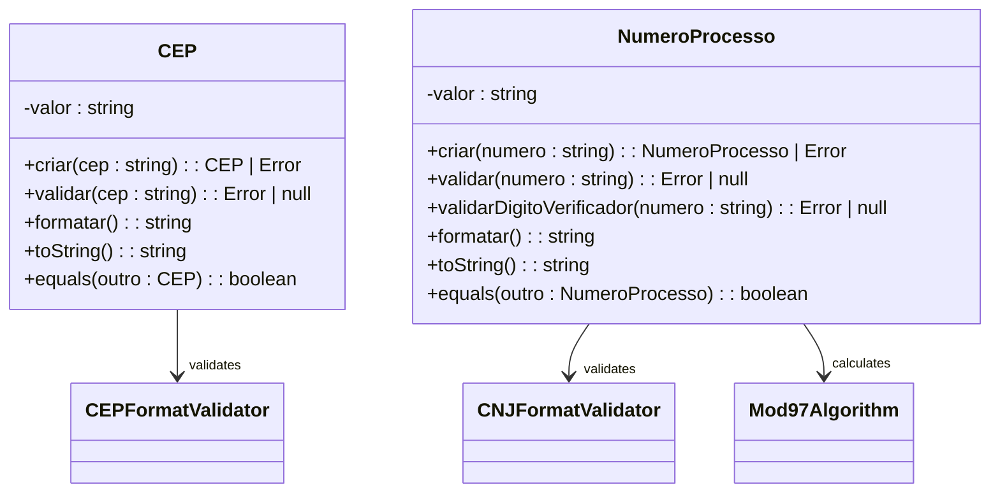
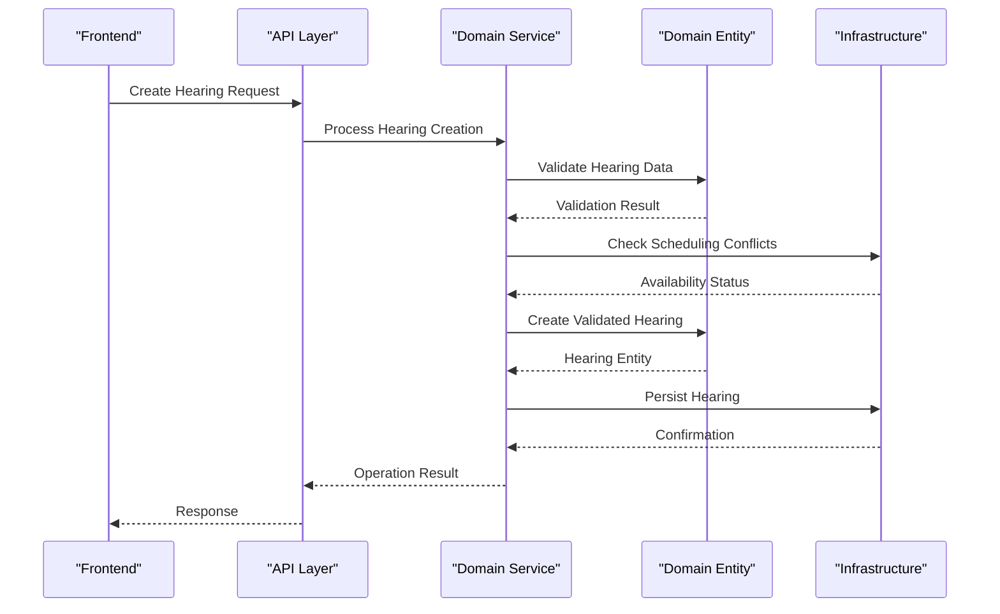
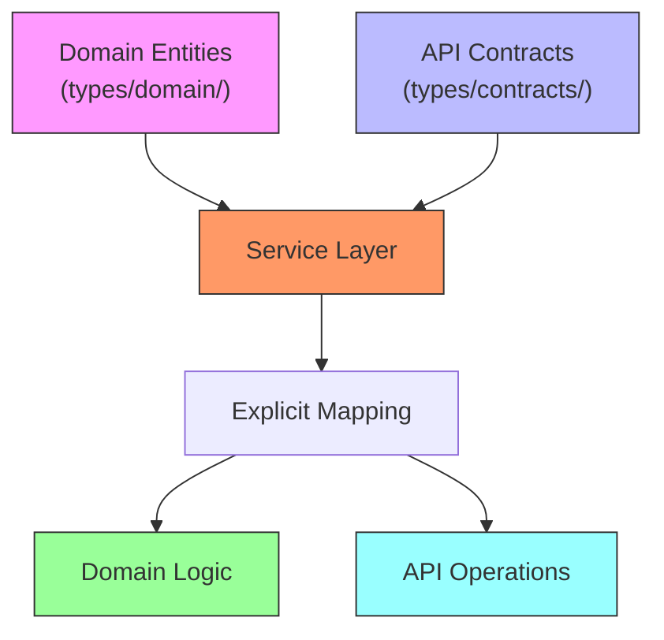
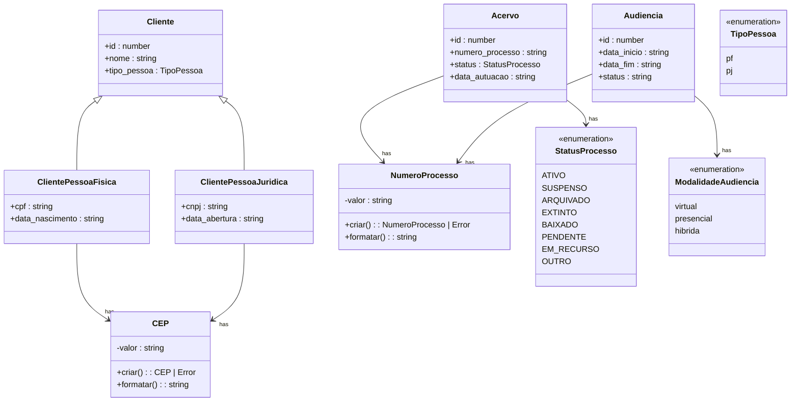

# Domain Layer

<cite>
**Referenced Files in This Document**   
- [acervo.ts](file://types/domain/acervo.ts)
- [audiencias.ts](file://types/domain/audiencias.ts)
- [common.ts](file://types/domain/common.ts)
- [partes.ts](file://types/domain/partes.ts)
- [pessoa.ts](file://types/domain/pessoa.ts)
- [value-objects.ts](file://types/domain/value-objects.ts)
- [acervo.ts](file://types/contracts/acervo.ts)
- [audiencias.ts](file://types/contracts/audiencias.ts)
- [partes.ts](file://types/contracts/partes.ts)
- [pessoa.ts](file://types/contracts/pessoa.ts)
- [processo-partes.ts](file://types/contracts/processo-partes.ts)
- [representantes.ts](file://types/contracts/representantes.ts)
</cite>

## Table of Contents
1. [Introduction](#introduction)
2. [Core Domain Entities](#core-domain-entities)
3. [Value Objects and Domain Invariants](#value-objects-and-domain-invariants)
4. [Domain Services and Business Logic](#domain-services-and-business-logic)
5. [Separation Between Domain and Contract Types](#separation-between-domain-and-contract-types)
6. [Design Patterns in the Domain Layer](#design-patterns-in-the-domain-layer)
7. [Domain Testing Strategy](#domain-testing-strategy)
8. [Conclusion](#conclusion)

## Introduction

The Domain Layer in the Sinesys legal management system represents the core business logic and domain model, encapsulating the essential concepts and rules of legal case management. This layer is designed to be independent of infrastructure concerns, focusing purely on business semantics and invariants. It implements a rich domain model using domain-driven design (DDD) principles, with entities, value objects, and domain services forming the backbone of the system's business logic.

This documentation provides a comprehensive overview of the Domain Layer, detailing how domain entities such as Acervo, Audiencia, and Contrato represent core legal concepts. It explains how value objects enforce business rules and data integrity, how domain services coordinate complex business operations, and how the separation between domain entities and data transfer objects maintains clean architectural boundaries. The documentation also covers testing strategies that ensure domain logic correctness in isolation from infrastructure components.

## Core Domain Entities

The Sinesys Domain Layer implements several key domain entities that represent fundamental concepts in legal case management. These entities encapsulate both data and behavior, ensuring that business rules and invariants are maintained throughout the application lifecycle.

The `Acervo` entity represents a legal case in the system's inventory, containing detailed information about the judicial process including case number, parties involved, jurisdictional details, and status. It includes specific fields such as `numero_processo`, `status`, and `data_autuacao` that capture essential case metadata. The entity also supports complex representations through related interfaces like `ProcessoUnificado`, which aggregates data from multiple instances of the same case across different jurisdictional levels.

The `Audiencia` entity models a court hearing with comprehensive details including scheduling information (`data_inicio`, `data_fim`), location details, participants, and status tracking. It captures both virtual and in-person hearing modalities through the `ModalidadeAudiencia` type, supporting hybrid arrangements where different parties may attend differently. The entity includes validation constraints to ensure temporal consistency between start and end times.

The `Cliente`, `ParteContraria`, and `Terceiro` entities represent different types of parties involved in legal proceedings, with specialized implementations for individuals (`PessoaFisica`) and organizations (`PessoaJuridica`). These entities share common characteristics through base interfaces while maintaining specific attributes relevant to their type. For example, individual clients include personal information like `cpf` and `data_nascimento`, while organizational clients include corporate details like `cnpj` and `inscricao_estadual`.

**Section sources**
- [acervo.ts](file://types/domain/acervo.ts)
- [audiencias.ts](file://types/domain/audiencias.ts)
- [partes.ts](file://types/domain/partes.ts)
- [pessoa.ts](file://types/domain/pessoa.ts)

## Value Objects and Domain Invariants

The Sinesys Domain Layer employs value objects to represent domain concepts with specific validation rules and invariants. These immutable objects ensure data integrity by encapsulating validation logic and preventing the creation of invalid states.

The `CEP` value object represents a Brazilian postal code with built-in validation to ensure it conforms to the standard format of eight numeric digits. The class provides static validation methods that check both the length and character composition of the input, rejecting any values that don't meet the requirements. It also includes formatting capabilities to present the CEP in the conventional NNNNN-NNN format while maintaining the raw numeric representation internally.

The `NumeroProcesso` value object implements the CNJ (National Council of Justice) standard for Brazilian legal case numbers. It validates both the structural format (20 digits) and the mathematical integrity of the verification digits using the mod-97 algorithm specified in CNJ Resolution 65/2008. The validation process involves three sequential operations that verify the check digits against the case number components, ensuring that only valid case numbers can be instantiated. This prevents the system from processing or storing incorrectly formatted case identifiers.

These value objects follow the principle of "fail fast" by returning `Error` instances when validation fails, allowing calling code to handle validation failures appropriately. They also implement equality comparison methods to support reliable identity checking based on value rather than reference. By encapsulating these validation rules within dedicated value objects, the domain layer ensures consistent enforcement of business rules across the entire application.

**Diagram sources **
- [value-objects.ts](file://types/domain/value-objects.ts)

**Section sources**
- [value-objects.ts](file://types/domain/value-objects.ts)

## Domain Services and Business Logic

Domain services in the Sinesys system coordinate complex business operations that involve multiple domain entities or require external coordination. These services encapsulate business logic that doesn't naturally belong to a single entity, maintaining the integrity of the domain model while enabling sophisticated functionality.

The domain layer implements business rules for client information validation through specialized validation logic embedded within entity creation and update operations. For example, when creating or updating a `Cliente` entity, the system validates CPF/CNPJ numbers, email formats, and other critical identifiers to ensure data quality. These validations are enforced at the domain level, preventing invalid data from being persisted regardless of the entry point.

For hearing scheduling, the domain enforces constraints that ensure temporal consistency and prevent scheduling conflicts. When creating or modifying an `Audiencia` entity, the system validates that the end time occurs after the start time and that the hearing doesn't overlap with other scheduled events for the same participants. These rules are implemented within domain services that have access to the necessary context and historical data to make informed decisions.

The separation of concerns between domain logic and infrastructure is maintained through the use of interfaces and dependency inversion. Domain services define the required operations through abstract interfaces, while infrastructure components provide concrete implementations. This allows the core business logic to remain independent of specific database technologies, messaging systems, or external APIs.

**Diagram sources **
- [audiencias.ts](file://types/domain/audiencias.ts)
- [partes.ts](file://types/domain/partes.ts)

**Section sources**
- [acervo.ts](file://types/domain/acervo.ts)
- [audiencias.ts](file://types/domain/audiencias.ts)
- [partes.ts](file://types/domain/partes.ts)

## Separation Between Domain and Contract Types

The Sinesys architecture maintains a clear separation between domain entities and data transfer objects (DTOs), ensuring that business logic remains isolated from presentation and transport concerns. This separation is implemented through distinct type definitions in the `types/domain/` and `types/contracts/` directories.

Domain entities in `types/domain/` focus on business semantics and invariants, containing only the properties necessary to represent the core business concepts. In contrast, contract types in `types/contracts/` are designed for API communication and include additional metadata such as pagination information, filtering parameters, and sorting options. For example, while the `Acervo` domain entity represents a single legal case, the `ListarAcervoParams` contract type includes pagination controls (`pagina`, `limite`) and filtering criteria that are relevant to API operations but not to the business domain.

This separation enables independent evolution of the domain model and API contracts. Changes to API requirements, such as adding new filtering options or modifying response formats, can be implemented in the contract layer without affecting the underlying domain logic. Similarly, enhancements to business rules or entity relationships can be made in the domain layer without requiring changes to API signatures.

The mapping between domain entities and DTOs is handled explicitly in service layers, ensuring that transformations are intentional and well-documented. This approach prevents "leaky abstractions" where infrastructure concerns contaminate the pure business logic of the domain layer.

**Diagram sources **
- [acervo.ts](file://types/domain/acervo.ts)
- [acervo.ts](file://types/contracts/acervo.ts)
- [audiencias.ts](file://types/domain/audiencias.ts)
- [audiencias.ts](file://types/contracts/audiencias.ts)

**Section sources**
- [acervo.ts](file://types/domain/acervo.ts)
- [acervo.ts](file://types/contracts/acervo.ts)
- [audiencias.ts](file://types/domain/audiencias.ts)
- [audiencias.ts](file://types/contracts/audiencias.ts)
- [partes.ts](file://types/domain/partes.ts)
- [partes.ts](file://types/contracts/partes.ts)

## Design Patterns in the Domain Layer

The Sinesys Domain Layer implements several key design patterns from domain-driven design to create a rich, expressive model of the legal management domain. These patterns include entities, value objects, and domain services, each serving a distinct purpose in the overall architecture.

Entities are implemented as interfaces with unique identifiers (`id` properties) that maintain their identity throughout their lifecycle. The `Acervo`, `Audiencia`, and `Cliente` entities all follow this pattern, with their identity preserved across state changes. These entities encapsulate both data and behavior, with methods that enforce business rules and maintain invariants.

Value objects are implemented as classes with immutable properties and validation logic embedded in their construction process. The `CEP` and `NumeroProcesso` classes exemplify this pattern, using static factory methods (`criar`) that return either a valid instance or an `Error` object. This approach ensures that invalid values cannot be represented in the domain model, enforcing data integrity at the type level.

The domain also employs discriminated unions to represent polymorphic domain concepts. For example, the `Cliente` type is defined as a union of `ClientePessoaFisica` and `ClientePessoaJuridica`, allowing the system to handle both individual and organizational clients while maintaining type safety. This pattern enables conditional logic based on the `tipo_pessoa` property, which serves as the discriminant.

Shared domain types are extracted into common interfaces and re-exported across multiple domain files. The `TipoPessoa` and `GrauProcesso` types are defined in `common.ts` and imported by various domain entities, ensuring consistency across the domain model. This approach reduces duplication and makes it easier to modify shared definitions.

**Diagram sources **
- [acervo.ts](file://types/domain/acervo.ts)
- [audiencias.ts](file://types/domain/audiencias.ts)
- [partes.ts](file://types/domain/partes.ts)
- [common.ts](file://types/domain/common.ts)
- [value-objects.ts](file://types/domain/value-objects.ts)

**Section sources**
- [acervo.ts](file://types/domain/acervo.ts)
- [audiencias.ts](file://types/domain/audiencias.ts)
- [common.ts](file://types/domain/common.ts)
- [partes.ts](file://types/domain/partes.ts)
- [pessoa.ts](file://types/domain/pessoa.ts)
- [value-objects.ts](file://types/domain/value-objects.ts)

## Domain Testing Strategy

The Sinesys Domain Layer is designed to be testable in isolation, with unit tests focusing on the correctness of business rules and invariants without dependencies on external systems. This testing strategy ensures that the core business logic remains reliable and predictable.

Value objects are tested extensively to verify their validation logic and formatting capabilities. Tests for the `CEP` class validate that it correctly rejects invalid inputs (wrong length, non-numeric characters) and properly formats valid inputs. Similarly, tests for the `NumeroProcesso` class verify both structural validation and the mathematical correctness of the CNJ check digit algorithm.

Entity behavior is tested through scenarios that exercise business rules and state transitions. For example, tests for the `Audiencia` entity verify that scheduling constraints are enforced, such as preventing end times that precede start times. These tests use the domain layer's own validation methods to confirm that invalid states cannot be created.

The separation between domain logic and infrastructure enables comprehensive testing of business rules without requiring database connections or network calls. Test fixtures can be created using pure JavaScript/TypeScript objects, allowing tests to run quickly and reliably in any environment. This approach supports test-driven development practices, where domain logic is defined and validated through tests before implementation.

## Conclusion

The Domain Layer in the Sinesys legal management system provides a robust foundation for the application's business logic, implementing a rich domain model that accurately represents the complexities of legal case management. Through the use of domain entities, value objects, and domain services, the layer encapsulates business rules and invariants, ensuring data integrity and consistency across the application.

The clear separation between domain entities and contract types maintains architectural boundaries, allowing the business logic to evolve independently of presentation and infrastructure concerns. This separation, combined with comprehensive testing strategies, ensures that the domain model remains reliable and maintainable as the system grows.

By adhering to domain-driven design principles, the Sinesys Domain Layer creates a shared understanding of the business domain that can be leveraged across the entire development team. This shared model serves as a foundation for consistent decision-making and enables the system to adapt to changing business requirements while maintaining its core integrity.