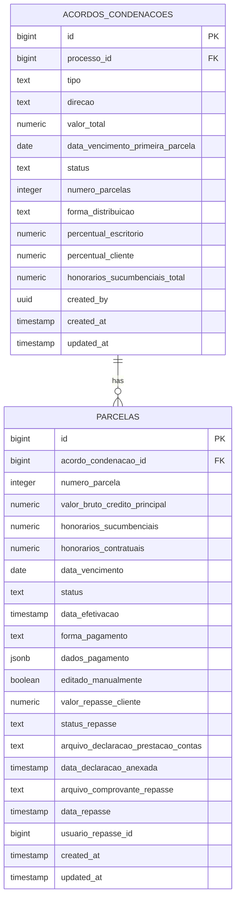
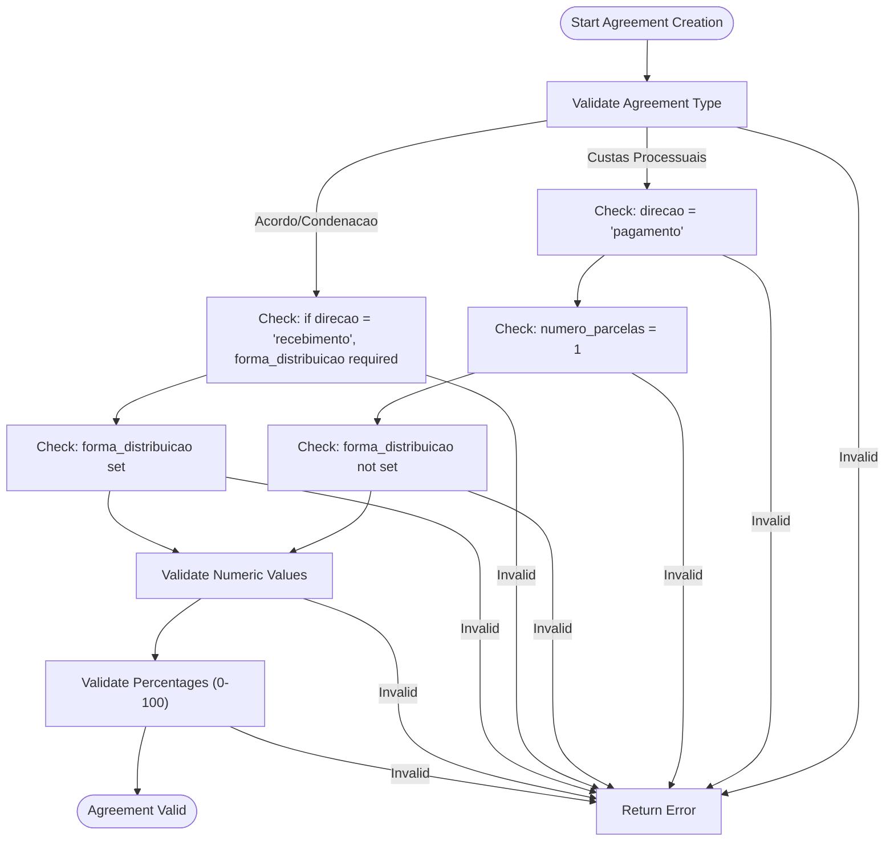
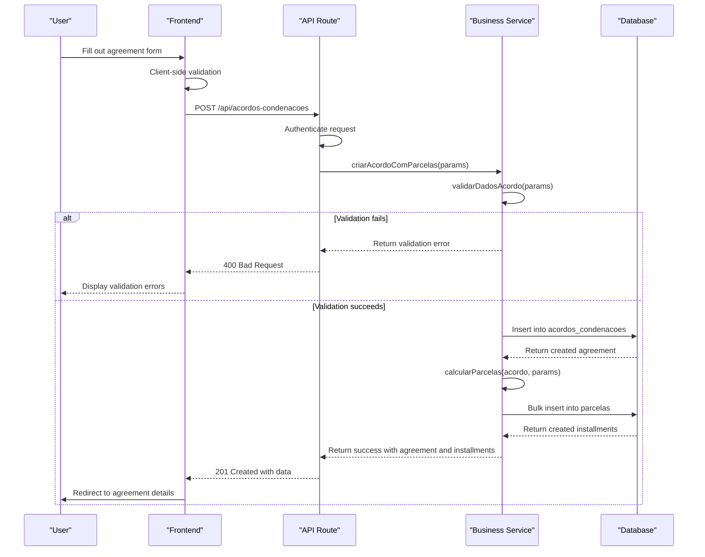
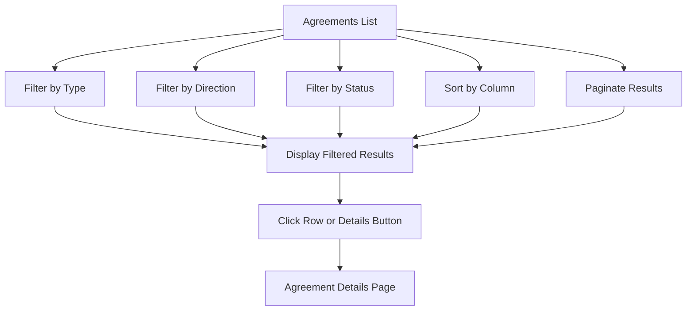
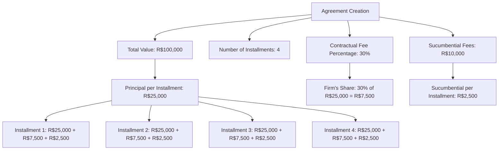

# Agreement Management

<cite>
**Referenced Files in This Document**   
- [acordo-condenacao-form.tsx](file://app/(dashboard)/acordos-condenacoes/components/acordo-condenacao-form.tsx)
- [acordos-condenacoes-list.tsx](file://app/(dashboard)/acordos-condenacoes/components/acordos-condenacoes-list.tsx)
- [parcelas-table.tsx](file://app/(dashboard)/acordos-condenacoes/components/parcelas-table.tsx)
- [acordo-condenacao-persistence.service.ts](file://backend/acordos-condenacoes/services/persistence/acordo-condenacao-persistence.service.ts)
- [parcela-persistence.service.ts](file://backend/acordos-condenacoes/services/persistence/parcela-persistence.service.ts)
- [criar-acordo-condenacao.service.ts](file://backend/acordos-condenacoes/services/acordos-condenacoes/criar-acordo-condenacao.service.ts)
- [route.ts](file://app/api/acordos-condenacoes/route.ts)
- [20_acordos_condenacoes.sql](file://supabase/schemas/20_acordos_condenacoes.sql)
</cite>

## Table of Contents
1. [Introduction](#introduction)
2. [Domain Model Structure](#domain-model-structure)
3. [Business Rules and Validation](#business-rules-and-validation)
4. [Agreement Lifecycle Management](#agreement-lifecycle-management)
5. [User Interfaces](#user-interfaces)
6. [Relationships with Legal Processes, Clients, and Financial Obligations](#relationships-with-legal-processes-clients-and-financial-obligations)
7. [Financial Distribution Calculations](#financial-distribution-calculations)
8. [Integration with Payment Tracking](#integration-with-payment-tracking)
9. [Handling Agreement Modifications](#handling-agreement-modifications)
10. [Common Issues and Troubleshooting](#common-issues-and-troubleshooting)

## Introduction

The Agreement Management sub-feature in the Financial Domain provides a comprehensive system for managing judgment agreements (acordos-condenacoes) within a legal management platform. This system enables legal professionals to create, modify, and track agreements, condenações (judgments), and custas processuais (court costs) associated with legal processes. The implementation covers the complete lifecycle of financial obligations arising from legal cases, including creation, payment tracking, distribution calculations, and repasse (client disbursement) management.

The system is designed to handle both receivements (where the law firm receives funds) and payments (where the law firm pays funds), with special handling for different types of agreements including settlements, judgments, and court costs. The implementation integrates seamlessly with the broader legal management system, connecting agreements to specific legal processes, clients, and financial tracking systems.

This documentation provides a detailed explanation of the implementation, covering the domain model structure, business rules, lifecycle management, user interfaces, and integration points. The content is designed to be accessible to beginners while providing sufficient technical depth for experienced developers working with the system.

**Section sources**
- [acordos-condenacoes-list.tsx](file://app/(dashboard)/acordos-condenacoes/components/acordos-condenacoes-list.tsx#L1-L376)
- [acordo-condenacao-form.tsx](file://app/(dashboard)/acordos-condenacoes/components/acordo-condenacao-form.tsx#L1-L369)

## Domain Model Structure

The Agreement Management system is built around two core entities: `acordos_condenacoes` (agreements/judgments) and `parcelas` (installments). These entities are implemented as database tables with a one-to-many relationship, where one agreement can have multiple installments.

### Agreement/Condenação Entity

The `acordos_condenacoes` table represents the main agreement or judgment record and contains the following key fields:

**Diagram sources**
- [20_acordos_condenacoes.sql](file://supabase/schemas/20_acordos_condenacoes.sql#L6-L128)

The `acordos_condenacoes` entity has several important attributes:

- **tipo**: The type of financial obligation, which can be 'acordo' (settlement), 'condenacao' (judgment), or 'custas_processuais' (court costs)
- **direcao**: The direction of the financial flow, either 'recebimento' (receipt) where the firm receives funds or 'pagamento' (payment) where the firm pays funds
- **valor_total**: The total value of the agreement or judgment
- **data_vencimento_primeira_parcela**: The due date of the first installment
- **status**: The current status of the agreement, calculated based on the status of its installments (pendente, pago_parcial, pago_total, atrasado)
- **numero_parcelas**: The number of installments for the agreement
- **forma_distribuicao**: For receipts, indicates whether the distribution is 'integral' (the firm receives everything and then repasses to the client) or 'dividido' (each party receives directly)
- **percentual_escritorio**: The percentage of contractual fees that belongs to the firm (default 30%)
- **percentual_cliente**: The percentage that belongs to the client, automatically calculated as 100 - percentual_escritorio
- **honorarios_sucumbenciais_total**: The total amount of sucumbential fees (100% of which belongs to the firm)

### Parcela (Installment) Entity

The `parcelas` table represents individual installments of an agreement or judgment and contains detailed information about each payment. Key attributes include:

- **acordo_condenacao_id**: Foreign key linking to the parent agreement
- **numero_parcela**: The installment number (1, 2, 3, etc.)
- **valor_bruto_credito_principal**: The gross amount of the principal credit for this installment
- **honorarios_sucumbenciais**: The amount of sucumbential fees for this installment
- **honorarios_contratuais**: The amount of contractual fees for this installment, calculated automatically
- **data_vencimento**: The due date of the installment
- **status**: The current status of the installment (pendente, recebida, paga, atrasado)
- **data_efetivacao**: The date when the installment was marked as received or paid
- **forma_pagamento**: The payment method (transferencia_direta, deposito_judicial, deposito_recursal)
- **dados_pagamento**: Additional payment details stored as JSONB (e.g., court order number)
- **editado_manualmente**: A flag indicating if the installment values were manually edited
- **valor_repasse_cliente**: The amount to be repassed to the client
- **status_repasse**: The status of the client disbursement (nao_aplicavel, pendente_declaracao, pendente_transferencia, repassado)
- **arquivo_declaracao_prestacao_contas**: Path to the declaration of account settlement document
- **arquivo_comprovante_repasse**: Path to the transfer receipt document

The relationship between agreements and installments is enforced with a foreign key constraint and cascading delete, ensuring that when an agreement is deleted, all its installments are also removed.

**Section sources**
- [20_acordos_condenacoes.sql](file://supabase/schemas/20_acordos_condenacoes.sql#L6-L128)
- [acordo-condenacao-persistence.service.ts](file://backend/acordos-condenacoes/services/persistence/acordo-condenacao-persistence.service.ts#L5-L445)
- [parcela-persistence.service.ts](file://backend/acordos-condenacoes/services/persistence/parcela-persistence.service.ts#L6-L472)

## Business Rules and Validation

The Agreement Management system implements several business rules and validation constraints to ensure data integrity and enforce legal and financial best practices.

### Type-Specific Rules

The system enforces specific rules based on the type of financial obligation:

- **Custas Processuais (Court Costs)**: Must always have direction set to 'pagamento' (payment), must be a single installment (numero_parcelas = 1), and cannot have a forma_distribuicao (distribution method) specified
- **Acordos (Settlements) and Condenações (Judgments)**: Can be either 'recebimento' (receipt) or 'pagamento' (payment), can have multiple installments, and for receipts, must specify a forma_distribuicao

These rules are enforced at both the database level through check constraints and at the application level through validation logic in the backend services.

**Diagram sources**
- [20_acordos_condenacoes.sql](file://supabase/schemas/20_acordos_condenacoes.sql#L9-L17)
- [criar-acordo-condenacao.service.ts](file://backend/acordos-condenacoes/services/acordos-condenacoes/criar-acordo-condenacao.service.ts#L111-L185)

### Direction-Based Rules

The system enforces rules based on the financial direction of the agreement:

- **Recebimento (Receipt)**: When the firm is receiving funds, the system requires a forma_distribuicao to be specified (either 'integral' or 'dividido'). This determines how the funds will be distributed between the firm and the client.
- **Pagamento (Payment)**: When the firm is making a payment, the forma_distribuicao must not be specified, as the payment is going entirely to the recipient.

These rules prevent inconsistent data entry and ensure that the system accurately reflects the financial arrangements.

### Required Fields and Constraints

The system enforces the following constraints on required fields:

- **processo_id**: Must be specified and reference a valid legal process
- **tipo**: Must be one of 'acordo', 'condenacao', or 'custas_processuais'
- **direcao**: Must be either 'recebimento' or 'pagamento'
- **valor_total**: Must be greater than zero
- **data_vencimento_primeira_parcela**: Must be specified
- **numero_parcelas**: Must be greater than zero
- **percentual_escritorio**: If specified, must be between 0 and 100

These constraints are implemented as NOT NULL constraints and CHECK constraints in the database schema, providing a first line of defense against invalid data.

**Section sources**
- [20_acordos_condenacoes.sql](file://supabase/schemas/20_acordos_condenacoes.sql#L9-L35)
- [criar-acordo-condenacao.service.ts](file://backend/acordos-condenacoes/services/acordos-condenacoes/criar-acordo-condenacao.service.ts#L116-L130)

## Agreement Lifecycle Management

The Agreement Management system supports a complete lifecycle for agreements and judgments, from creation through to final payment and closure.

### Creation Process

The creation process begins with the user accessing the "Novo Acordo/Condenação" form, which collects all necessary information to create a new agreement. The form guides the user through the required fields and enforces business rules in real-time.

When the user submits the form, the following sequence occurs:

**Diagram sources**
- [route.ts](file://app/api/acordos-condenacoes/route.ts#L169-L245)
- [criar-acordo-condenacao.service.ts](file://backend/acordos-condenacoes/services/acordos-condenacoes/criar-acordo-condenacao.service.ts#L43-L106)
- [acordo-condenacao-persistence.service.ts](file://backend/acordos-condenacoes/services/persistence/acordo-condenacao-persistence.service.ts#L144-L196)

The creation process automatically generates the appropriate number of installments based on the agreement terms, distributing the total value and sucumbential fees equally across the installments (with adjustments for the final installment to account for rounding).

### Status Management

The system automatically manages the status of agreements and installments based on their payment status:

- **Agreement Status**: Calculated based on the status of its installments
  - **pendente**: All installments are pending
  - **pago_parcial**: Some installments are paid, but not all
  - **pago_total**: All installments are paid
  - **atrasado**: One or more installments are past due

- **Installment Status**: 
  - **pendente**: Installment is due but not yet paid
  - **recebida**: Installment has been received (for receipts)
  - **paga**: Installment has been paid (for payments)
  - **atrasado**: Installment is past due

The status is updated automatically when installments are marked as paid or received, providing real-time visibility into the financial status of each agreement.

### Deletion Rules

The system implements strict rules for deleting agreements to prevent data inconsistency:

- An agreement cannot be deleted if any of its installments have been marked as paid or received
- This prevents the accidental removal of payment history and ensures financial audit trails are maintained
- If deletion is required, all paid installments must first be reversed or adjusted

These rules are enforced in the backend service, which checks the status of all installments before allowing deletion.

**Section sources**
- [criar-acordo-condenacao.service.ts](file://backend/acordos-condenacoes/services/acordos-condenacoes/criar-acordo-condenacao.service.ts#L43-L106)
- [acordo-condenacao-persistence.service.ts](file://backend/acordos-condenacoes/services/persistence/acordo-condenacao-persistence.service.ts#L380-L421)
- [parcela-persistence.service.ts](file://backend/acordos-condenacoes/services/persistence/parcela-persistence.service.ts#L324-L355)

## User Interfaces

The Agreement Management system provides several user interfaces for creating, viewing, and managing agreements and their installments.

### List View

The main interface is the agreements list view, which displays all agreements in a tabular format with filtering and sorting capabilities. The table includes columns for:

- Process number
- Type (with color-coded badges)
- Direction (with color-coded badges)
- Total value
- Number of installments
- Due date of the first installment
- Status (with color-coded badges)
- Action buttons for viewing details

The list supports filtering by type, direction, and status, allowing users to quickly find specific agreements. The table is paginated and supports sorting by any column.

**Diagram sources**
- [acordos-condenacoes-list.tsx](file://app/(dashboard)/acordos-condenacoes/components/acordos-condenacoes-list.tsx#L1-L376)

### Creation Form

The creation form provides a guided interface for entering agreement details. The form dynamically adjusts based on the selected type and direction:

- When "Custas Processuais" is selected, the direction is automatically set to "Pagamento" and the number of installments is fixed at 1
- When "Recebimento" is selected, the form requires the user to specify the distribution method (integral or dividido)
- The form includes real-time validation and displays error messages for invalid entries

The form also allows users to specify the payment method for installments and the interval between installments (for multi-installment agreements).

### Details View

The details view provides comprehensive information about a specific agreement, including:

- Summary information (type, direction, total value, status, etc.)
- A table of all installments with their individual status and payment details
- Action buttons for editing installments and marking them as paid or received
- Sections for uploading documentation related to client disbursements

The installment table includes color-coded status badges and allows users to see at a glance which installments are pending, paid, or overdue.

**Section sources**
- [acordo-condenacao-form.tsx](file://app/(dashboard)/acordos-condenacoes/components/acordo-condenacao-form.tsx#L1-L369)
- [acordos-condenacoes-list.tsx](file://app/(dashboard)/acordos-condenacoes/components/acordos-condenacoes-list.tsx#L1-L376)
- [parcelas-table.tsx](file://app/(dashboard)/acordos-condenacoes/components/parcelas-table.tsx#L1-L255)

## Relationships with Legal Processes, Clients, and Financial Obligations

The Agreement Management system is tightly integrated with other components of the legal management platform, particularly legal processes, clients, and financial tracking systems.

### Legal Process Integration

Each agreement is linked to a specific legal process through the processo_id foreign key. This creates a direct relationship between financial obligations and the legal cases that generate them. This integration enables:

- Viewing all financial obligations associated with a specific legal process
- Understanding the financial implications of ongoing cases
- Tracking the resolution of cases through their financial outcomes

The system ensures referential integrity by validating that the processo_id references an existing legal process.

### Client Relationships

While the current implementation does not explicitly link agreements to clients in the database schema, the relationship is established through the legal process. Since each legal process is associated with one or more clients, the financial obligations of the process are effectively the financial obligations related to those clients.

For agreements involving client disbursements (repasse), the system tracks:
- The amount to be repassed to the client
- The status of the disbursement process
- Documentation related to the disbursement (declaration of account settlement and transfer receipt)

This ensures proper handling of client funds and provides an audit trail for client disbursements.

### Financial Obligations Integration

The Agreement Management system is part of a broader financial management ecosystem within the platform. It integrates with other financial components such as:

- **Payment Tracking**: The system updates payment status in real-time and can integrate with external payment tracking systems
- **Accounting**: Financial data from agreements can be exported for accounting purposes
- **Reporting**: The system provides data for financial reports on receivables, payables, and firm revenue

The integration with the financial domain ensures that all financial activities related to legal cases are tracked in a consistent and auditable manner.

**Section sources**
- [20_acordos_condenacoes.sql](file://supabase/schemas/20_acordos_condenacoes.sql#L8-L9)
- [acordo-condenacao-persistence.service.ts](file://backend/acordos-condenacoes/services/persistence/acordo-condenacao-persistence.service.ts#L52-L61)

## Financial Distribution Calculations

The system automatically calculates financial distributions for agreements, ensuring accurate allocation of funds between the firm and clients.

### Contractual Fee Distribution

For agreements involving receipts, the system calculates the distribution of contractual fees based on the percentual_escritorio setting:

- **percentual_escritorio**: The percentage of contractual fees that belongs to the firm (default 30%)
- **percentual_cliente**: The percentage that belongs to the client, automatically calculated as 100 - percentual_escritorio

These percentages are applied to the valor_bruto_credito_principal of each installment to determine the honorarios_contratuais (contractual fees) for the firm.

### Sucumbential Fees

Sucumbential fees (honorarios_sucumbenciais) are treated differently from contractual fees:

- They are always 100% retained by the firm
- They are not shared with the client
- They are specified as a total amount for the agreement and distributed across installments

The system automatically distributes the total sucumbential fees equally across all installments, with a small adjustment in the final installment to account for rounding.

### Installment Distribution

When creating installments for a new agreement, the system distributes the total value and fees across the specified number of installments:

- The principal credit amount (valor_bruto_credito_principal) is divided equally among installments
- The sucumbential fees are divided equally among installments
- The contractual fees are calculated based on the firm's percentage and the principal credit amount

The system handles rounding by adjusting the final installment to ensure the total distributed amounts exactly match the agreement totals.

**Diagram sources**
- [criar-acordo-condenacao.service.ts](file://backend/acordos-condenacoes/services/acordos-condenacoes/criar-acordo-condenacao.service.ts#L190-L242)
- [acordo-condenacao-persistence.service.ts](file://backend/acordos-condenacoes/services/persistence/acordo-condenacao-persistence.service.ts#L158-L167)

## Integration with Payment Tracking

The Agreement Management system integrates with payment tracking functionality to monitor the status of installments and update financial records in real-time.

### Payment Status Updates

Users can update the status of installments directly from the interface:

- For receipts: Mark installments as "recebida" (received)
- For payments: Mark installments as "paga" (paid)

When an installment is marked as paid or received, the system:

1. Updates the installment status in the database
2. Records the date of payment/receipt
3. Updates the parent agreement status based on the new installment status
4. Triggers any necessary workflows (e.g., initiating client disbursement)

### Manual Editing

The system allows for manual editing of installment values when necessary:

- Users can modify the principal amount, sucumbential fees, and due date
- When values are manually edited, the editado_manualmente flag is set to true
- This preserves the audit trail while allowing for necessary adjustments

Manual editing is typically used when the actual payment differs from the original agreement terms.

### Documentation Management

For client disbursements (repasse), the system provides functionality to manage supporting documentation:

- Upload declaration of account settlement (declaração de prestação de contas)
- Upload transfer receipt (comprovante de repasse)
- Track the status of the disbursement process

This ensures compliance with legal and ethical requirements for handling client funds.

**Section sources**
- [parcelas-table.tsx](file://app/(dashboard)/acordos-condenacoes/components/parcelas-table.tsx#L1-L255)
- [parcela-persistence.service.ts](file://backend/acordos-condenacoes/services/persistence/parcela-persistence.service.ts#L261-L322)

## Handling Agreement Modifications

The system provides functionality for modifying existing agreements, with safeguards to maintain data integrity.

### Editable Fields

After an agreement is created, certain fields can be modified:

- **valor_total**: The total value of the agreement
- **data_vencimento_primeira_parcela**: The due date of the first installment
- **percentual_escritorio**: The firm's percentage of contractual fees
- **honorarios_sucumbenciais_total**: The total amount of sucumbential fees
- **forma_distribuicao**: The distribution method (for receipts)

These modifications are typically made when there are changes to the agreement terms or when corrections are needed.

### Installment Recalculation

When certain agreement fields are modified, the system can automatically recalculate the installments:

- If the total value, number of installments, or fee percentages are changed
- The system redistributes the values across installments
- Only installments that have not been paid or received are modified
- Paid installments are preserved to maintain payment history

This ensures that changes to agreement terms are reflected in future installments while preserving the integrity of past payments.

### Versioning and Audit Trail

The system maintains an audit trail of all changes to agreements and installments:

- The updated_at timestamp is updated on every modification
- The created_by and updated_by fields track which user made changes
- The editado_manualmente flag indicates when installment values have been manually adjusted

This provides a complete history of changes for auditing and compliance purposes.

**Section sources**
- [acordo-condenacao-persistence.service.ts](file://backend/acordos-condenacoes/services/persistence/acordo-condenacao-persistence.service.ts#L324-L374)
- [parcela-persistence.service.ts](file://backend/acordos-condenacoes/services/persistence/parcela-persistence.service.ts#L261-L322)

## Common Issues and Troubleshooting

The Agreement Management system may encounter several common issues that users should be aware of.

### Validation Errors

Common validation errors include:

- **Missing required fields**: Ensure all required fields are filled out before submission
- **Invalid type-direction combinations**: Custas processuais must be payments, not receipts
- **Invalid distribution methods**: Distribution method is required for receipts but not for payments
- **Negative or zero values**: All monetary values must be greater than zero

These errors are typically caught by client-side validation in the form, but may also occur at the server level if data is submitted programmatically.

### Payment Status Conflicts

Issues may arise when trying to modify agreements with paid installments:

- **Cannot delete agreements with paid installments**: First reverse or adjust paid installments
- **Cannot modify paid installments**: Only future installments can be modified
- **Status calculation delays**: Agreement status may take a moment to update after installment changes

### Integration Issues

When integrating with external systems, consider:

- **Data synchronization delays**: Changes in the agreement system may take time to reflect in integrated systems
- **Format compatibility**: Ensure data formats (dates, currencies) are compatible between systems
- **Authentication requirements**: API access requires proper authentication tokens

### Best Practices

To avoid common issues:

- **Review agreement terms carefully** before creation
- **Use the correct agreement type** for the financial obligation
- **Set appropriate installment schedules** based on expected payment timing
- **Upload documentation promptly** for client disbursements
- **Regularly review agreement statuses** to identify overdue installments

Following these best practices will ensure smooth operation of the Agreement Management system and accurate financial tracking.

**Section sources**
- [criar-acordo-condenacao.service.ts](file://backend/acordos-condenacoes/services/acordos-condenacoes/criar-acordo-condenacao.service.ts#L111-L185)
- [acordo-condenacao-persistence.service.ts](file://backend/acordos-condenacoes/services/persistence/acordo-condenacao-persistence.service.ts#L380-L421)
- [parcela-persistence.service.ts](file://backend/acordos-condenacoes/services/persistence/parcela-persistence.service.ts#L324-L355)