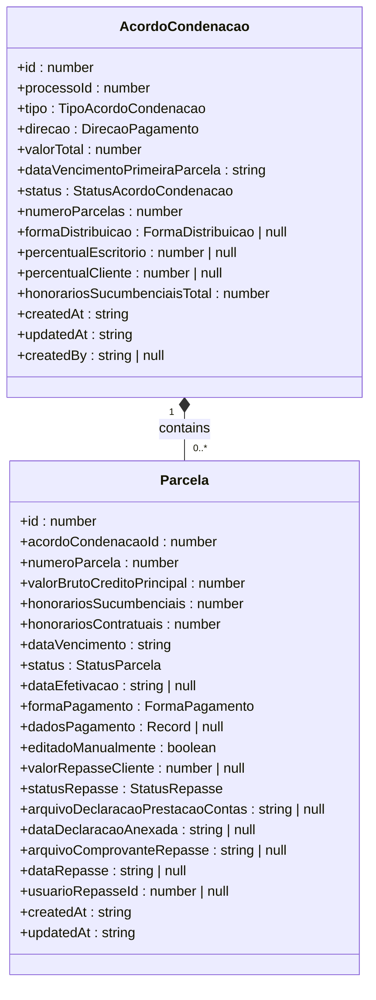
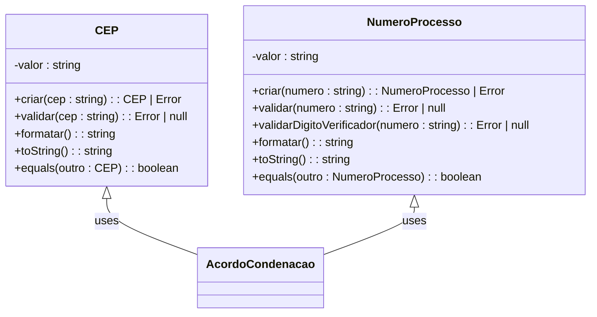
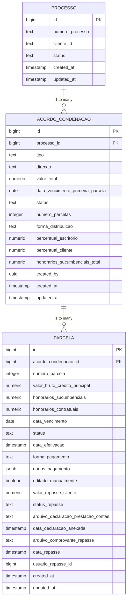
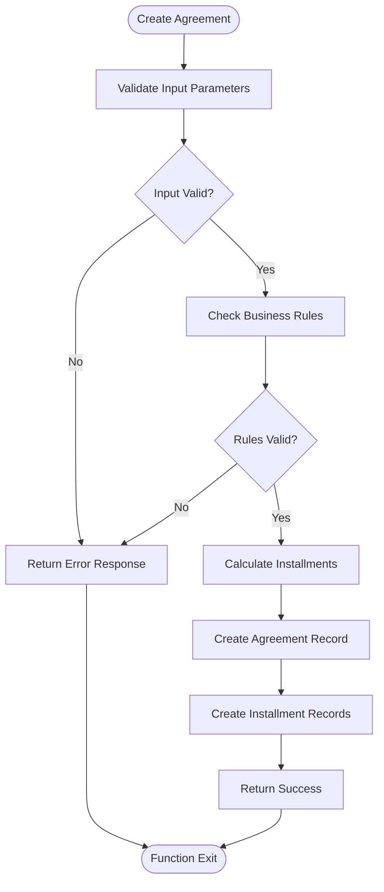

# Financial Domain

<cite>
**Referenced Files in This Document**   
- [acordo-condenacao-persistence.service.ts](file://backend/acordos-condenacoes/services/persistence/acordo-condenacao-persistence.service.ts)
- [parcela-persistence.service.ts](file://backend/acordos-condenacoes/services/persistence/parcela-persistence.service.ts)
- [20_acordos_condenacoes.sql](file://supabase/schemas/20_acordos_condenacoes.sql)
- [criar-acordo-condenacao.service.ts](file://backend/acordos-condenacoes/services/acordos-condenacoes/criar-acordo-condenacao.service.ts)
- [value-objects.ts](file://types/domain/value-objects.ts)
- [financeiro.ts](file://types/domain/financeiro.ts)
- [orcamento.types.ts](file://backend/types/financeiro/orcamento.types.ts)
- [contas-pagar.types.ts](file://backend/types/financeiro/contas-pagar.types.ts)
- [contas-receber.types.ts](file://backend/types/financeiro/contas-receber.types.ts)
- [obrigacoes.types.ts](file://backend/types/financeiro/obrigacoes.types.ts)
</cite>

## Table of Contents
1. [Introduction](#introduction)
2. [Core Financial Entities](#core-financial-entities)
3. [Agreement and Judgment Domain Model](#agreement-and-judgment-domain-model)
4. [Financial Value Objects](#financial-value-objects)
5. [Relationship with Legal Processes](#relationship-with-legal-processes)
6. [Business Rules and Validation](#business-rules-and-validation)
7. [Domain Separation and Invariants](#domain-separation-and-invariants)
8. [Data Access Patterns](#data-access-patterns)
9. [Lifecycle Management](#lifecycle-management)
10. [Conclusion](#conclusion)

## Introduction

The Financial Domain in Sinesys manages financial obligations, payments, and budgeting within the legal management system. This documentation details the domain models for agreements and judgments (acordos-condenacoes), their associated installments (parcelas), and the financial value objects that represent monetary amounts, dates, and payment statuses. The system is designed to maintain financial invariants and enforce business rules through well-defined domain entities, separate from data transfer objects.

**Section sources**
- [acordo-condenacao-persistence.service.ts](file://backend/acordos-condenacoes/services/persistence/acordo-condenacao-persistence.service.ts#L1-L445)
- [parcela-persistence.service.ts](file://backend/acordos-condenacoes/services/persistence/parcela-persistence.service.ts#L1-L472)

## Core Financial Entities

The financial domain in Sinesys is built around several core entities that represent financial obligations and transactions. The primary entities are agreements/judgments (acordos-condenacoes) and their installments (parcelas). These entities are closely tied to legal processes and represent financial obligations that arise from legal proceedings.

The domain also includes value objects that represent monetary amounts, dates, and other financial concepts. These value objects ensure that financial data is always valid and consistent throughout the system.

**Section sources**
- [acordo-condenacao-persistence.service.ts](file://backend/acordos-condenacoes/services/persistence/acordo-condenacao-persistence.service.ts#L1-L445)
- [parcela-persistence.service.ts](file://backend/acordos-condenacoes/services/persistence/parcela-persistence.service.ts#L1-L472)
- [financeiro.ts](file://types/domain/financeiro.ts#L1-L210)

## Agreement and Judgment Domain Model

The agreement and judgment domain model is centered around the `AcordoCondenacao` entity, which represents a financial agreement or judgment resulting from a legal process. This entity is linked to a specific legal process and contains information about the type of agreement, its direction (receipt or payment), total value, and payment schedule.

Each agreement can have multiple installments (parcelas), which are represented by the `Parcela` entity. The installments contain detailed information about each payment, including the due date, payment method, and status.

**Diagram sources**
- [acordo-condenacao-persistence.service.ts](file://backend/acordos-condenacoes/services/persistence/acordo-condenacao-persistence.service.ts#L79-L95)
- [parcela-persistence.service.ts](file://backend/acordos-condenacoes/services/persistence/parcela-persistence.service.ts#L52-L74)

## Financial Value Objects

The financial domain uses value objects to represent key financial concepts and ensure data integrity. These value objects encapsulate validation logic and business rules, preventing invalid data from being created.

The system includes value objects for monetary amounts, dates, and other financial concepts. These objects are immutable and provide methods for formatting and comparing values.

**Diagram sources**
- [value-objects.ts](file://types/domain/value-objects.ts#L1-L243)

## Relationship with Legal Processes

Financial obligations in Sinesys are intrinsically linked to legal processes. Each agreement or judgment (acordo-condenacao) is associated with a specific legal process through the `processoId` field. This relationship ensures that financial data is always contextualized within the legal framework from which it arises.

The system maintains a clear connection between financial records and their corresponding legal processes, allowing for comprehensive tracking and reporting. This relationship is enforced at the database level through foreign key constraints.

**Diagram sources**
- [20_acordos_condenacoes.sql](file://supabase/schemas/20_acordos_condenacoes.sql#L6-L128)

## Business Rules and Validation

The financial domain enforces several business rules and validation constraints to ensure data integrity and consistency. These rules are implemented at both the application and database levels.

Key business rules include:
- Validation of agreement types and directions
- Constraints on payment schedules and installment calculations
- Rules for distributing values between office and client percentages
- Validation of financial calculations and rounding

**Diagram sources**
- [criar-acordo-condenacao.service.ts](file://backend/acordos-condenacoes/services/acordos-condenacoes/criar-acordo-condenacao.service.ts#L43-L243)

## Domain Separation and Invariants

The financial domain maintains a clear separation between domain entities and data transfer objects (DTOs). This separation ensures that business logic and validation rules are encapsulated within the domain layer, while DTOs are used for data transfer between layers.

Domain invariants are enforced through value objects and validation methods. These invariants ensure that financial data remains consistent and valid throughout the system's lifecycle.

**Section sources**
- [acordo-condenacao-persistence.service.ts](file://backend/acordos-condenacoes/services/persistence/acordo-condenacao-persistence.service.ts#L51-L62)
- [parcela-persistence.service.ts](file://backend/acordos-condenacoes/services/persistence/parcela-persistence.service.ts#L24-L33)
- [value-objects.ts](file://types/domain/value-objects.ts#L1-L243)

## Data Access Patterns

The financial domain uses repository and service patterns for data access. The persistence layer handles database operations, while service layers implement business logic.

Data access is performed through well-defined interfaces that abstract the underlying database implementation. This allows for flexibility in changing the data storage mechanism without affecting the business logic.

**Section sources**
- [acordo-condenacao-persistence.service.ts](file://backend/acordos-condenacoes/services/persistence/acordo-condenacao-persistence.service.ts#L144-L445)
- [parcela-persistence.service.ts](file://backend/acordos-condenacoes/services/persistence/parcela-persistence.service.ts#L97-L472)

## Lifecycle Management

Financial records in Sinesys have a well-defined lifecycle that includes creation, modification, and deletion. The system enforces rules for each stage of the lifecycle to ensure data integrity.

Key lifecycle management features include:
- Status tracking for agreements and installments
- Audit trails for financial changes
- Rules for modifying and deleting financial records
- Integration with legal process lifecycle

**Section sources**
- [acordo-condenacao-persistence.service.ts](file://backend/acordos-condenacoes/services/persistence/acordo-condenacao-persistence.service.ts#L376-L419)
- [parcela-persistence.service.ts](file://backend/acordos-condenacoes/services/persistence/parcela-persistence.service.ts#L327-L388)

## Conclusion

The Financial Domain in Sinesys provides a robust framework for managing financial obligations, payments, and budgeting within the legal management system. By using well-defined domain models, value objects, and business rules, the system ensures data integrity and consistency. The clear separation between domain entities and data transfer objects, along with comprehensive lifecycle management, makes the financial domain a reliable and maintainable component of the Sinesys platform.