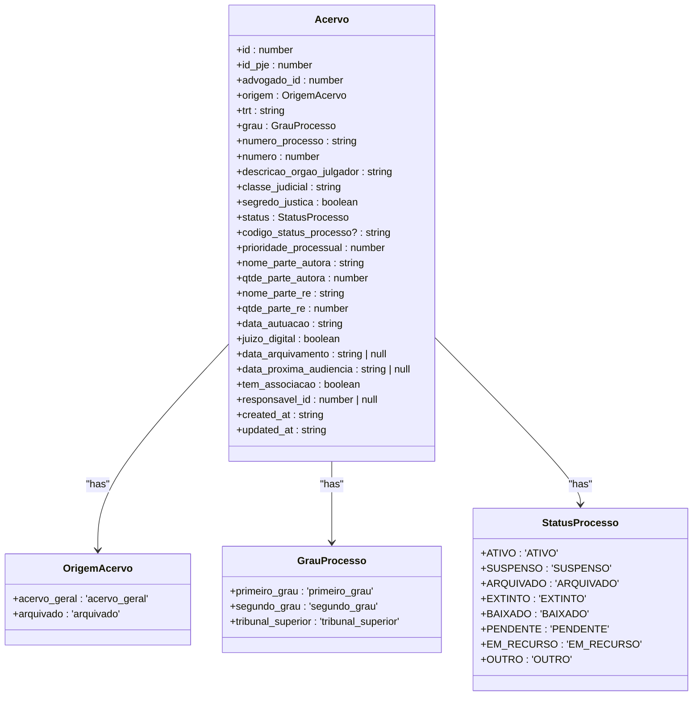
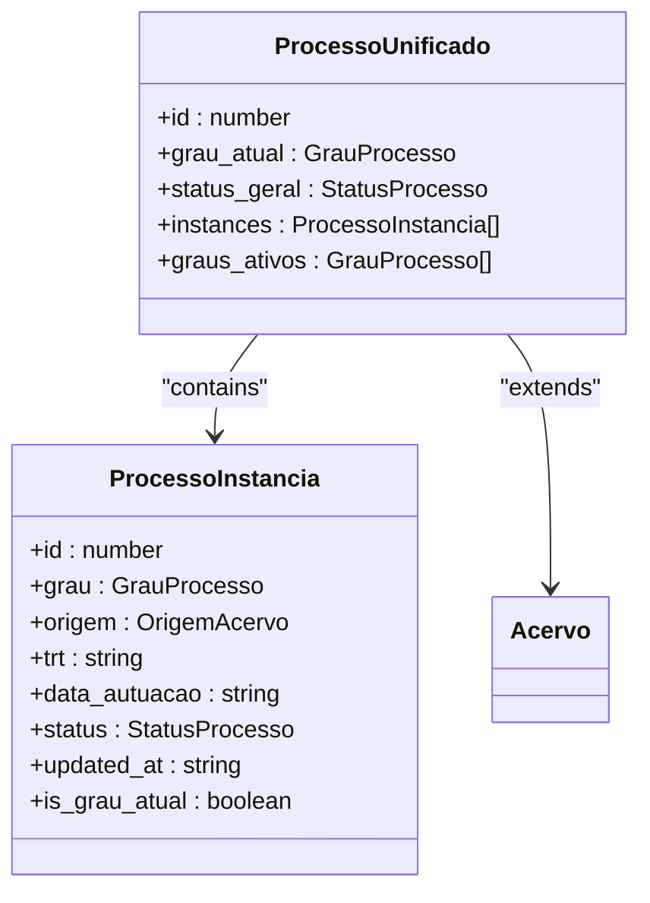
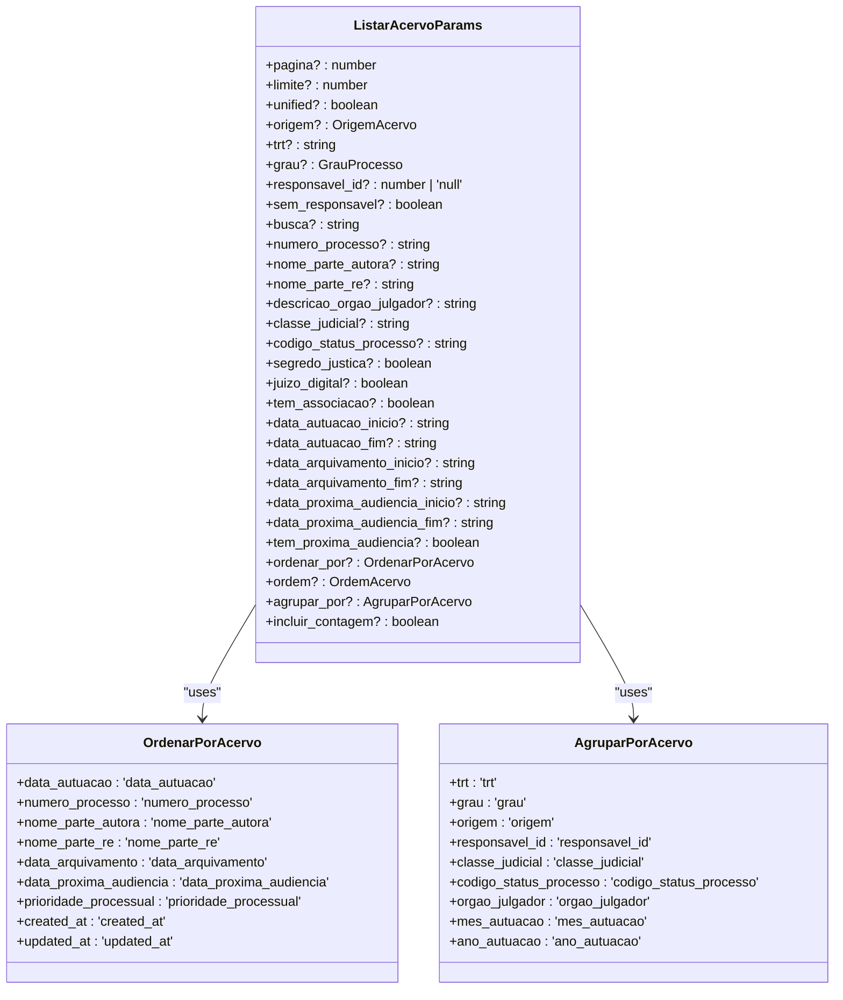
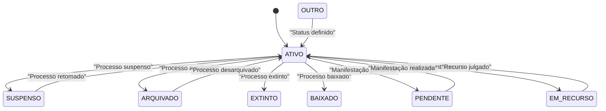
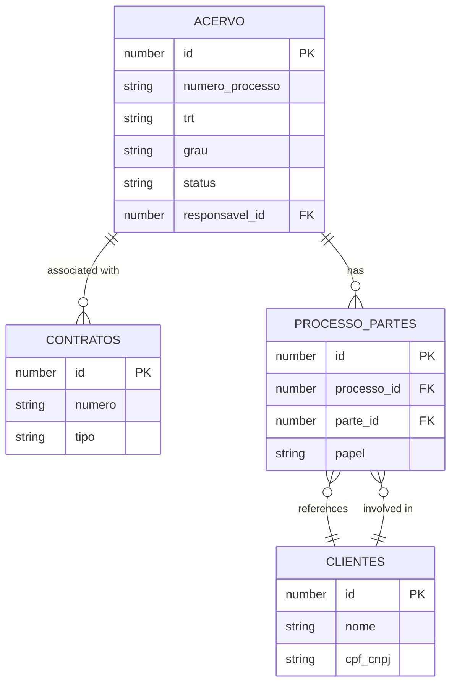
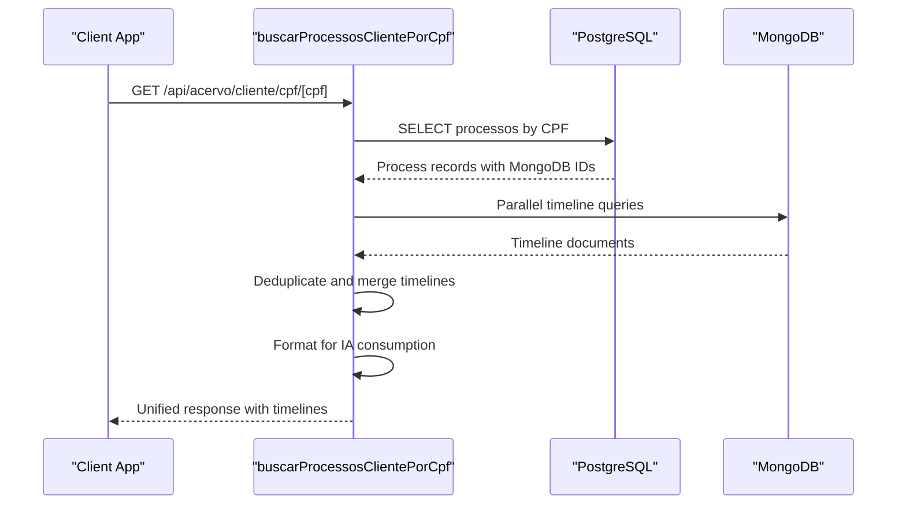

# Acervo Management

<cite>
**Referenced Files in This Document**   
- [acervo.ts](file://types/domain/acervo.ts)
- [acervo.sql](file://supabase/schemas/04_acervo.sql)
- [05_acervo_unificado_view.sql](file://supabase/schemas/05_acervo_unificado_view.sql)
- [listar-acervo.service.ts](file://backend/acervo/services/listar-acervo.service.ts)
- [listar-acervo-unificado.service.ts](file://backend/acervo/services/persistence/listar-acervo-unificado.service.ts)
- [buscar-acervo.service.ts](file://backend/acervo/services/buscar-acervo.service.ts)
- [atribuir-responsavel.service.ts](file://backend/acervo/services/atribuir-responsavel.service.ts)
- [route.ts](file://app/api/acervo/route.ts)
- [timeline-unificada.service.ts](file://backend/acervo/services/timeline/timeline-unificada.service.ts)
- [common.ts](file://types/domain/common.ts)
</cite>

## Table of Contents
1. [Introduction](#introduction)
2. [Acervo Domain Model](#acervo-domain-model)
3. [Unified Process View](#unified-process-view)
4. [Data Access and Validation](#data-access-and-validation)
5. [Lifecycle and Status Management](#lifecycle-and-status-management)
6. [Relationships with Other Entities](#relationships-with-other-entities)
7. [API Endpoints and Service Layer](#api-endpoints-and-service-layer)
8. [Timeline Integration](#timeline-integration)
9. [Conclusion](#conclusion)

## Introduction

The Acervo entity in Sinesys represents the legal process management system that serves as the central repository for all judicial processes tracked by the platform. This documentation provides a comprehensive overview of the Acervo domain model, detailing its properties, business rules, relationships with other entities, and integration patterns. The Acervo system is designed to handle both first and second instance processes while providing a unified view of multi-instance legal proceedings. The model supports advanced search, filtering, and grouping capabilities while maintaining data integrity through well-defined validation rules and lifecycle management.

**Section sources**
- [acervo.ts](file://types/domain/acervo.ts#L15-L81)
- [acervo.sql](file://supabase/schemas/04_acervo.sql#L4-L77)

## Acervo Domain Model

The Acervo domain model represents a comprehensive record of judicial processes within the Sinesys system. Each Acervo entity contains detailed information about a legal process, including its identification, status, parties involved, and procedural metadata. The model is designed to capture both active processes from the general repository and archived processes, providing a complete historical view of legal proceedings.

### Core Properties

The Acervo entity contains the following core properties:



**Diagram sources **
- [acervo.ts](file://types/domain/acervo.ts#L15-L42)
- [common.ts](file://types/domain/common.ts#L33-L47)

**Section sources**
- [acervo.ts](file://types/domain/acervo.ts#L15-L42)
- [acervo.sql](file://supabase/schemas/04_acervo.sql#L4-L32)

### Process Number and Validation

The `numero_processo` field follows the CNJ (National Council of Justice) format standard, which consists of 20 digits structured as "NNNNNNN-DD.AAAA.J.TR.OOOO". The system validates process numbers to ensure they conform to this format, enabling accurate identification and tracking of legal proceedings across different jurisdictions. The validation rules include:

- Length validation (20 characters)
- Format pattern matching (numeric and separator validation)
- Check digit verification (when available)
- TRT code validation against known tribunal codes

The process number serves as a primary identifier for cross-referencing processes across different instances and systems, ensuring data consistency and integrity.

### Status and Lifecycle Properties

The Acervo model includes comprehensive status tracking through the `StatusProcesso` enum, which defines the current state of a legal process. The status transitions follow specific business rules that reflect the procedural stages of judicial proceedings:

- **ATIVO**: The process is currently active and under consideration
- **SUSPENSO**: Proceedings are temporarily suspended
- **ARQUIVADO**: The process has been archived
- **EXTINTO**: The process has been extinguished
- **BAIXADO**: The process has been closed
- **PENDENTE**: There are pending actions or manifestations
- **EM_RECURSO**: The process is under appeal
- **OUTRO**: Other status not covered by the above categories

The `codigo_status_processo` field stores the original status code from the PJE (Electronic Judicial Process) system, allowing for precise mapping to the standardized `StatusProcesso` enum while preserving the source system's classification.

**Section sources**
- [acervo.ts](file://types/domain/acervo.ts#L27-L34)
- [common.ts](file://types/domain/common.ts#L38-L47)
- [listar-acervo-unificado.service.ts](file://backend/acervo/services/persistence/listar-acervo-unificado.service.ts#L21-L34)

## Unified Process View

The unified process view is a critical feature of the Acervo system that enables the consolidation of multi-instance legal proceedings into a single, coherent representation. This view addresses the complexity of tracking processes that evolve through different judicial instances (first degree, second degree, superior courts) by providing a comprehensive timeline and status overview.

### ProcessoUnificado Data Structure

The `ProcessoUnificado` interface extends the base Acervo model to include multi-instance metadata, creating a holistic view of a legal process across its lifecycle:



**Diagram sources **
- [acervo.ts](file://types/domain/acervo.ts#L74-L80)
- [acervo.ts](file://types/domain/acervo.ts#L58-L67)

**Section sources**
- [acervo.ts](file://types/domain/acervo.ts#L74-L80)
- [05_acervo_unificado_view.sql](file://supabase/schemas/05_acervo_unificado_view.sql#L96-L142)

### Instance Management and Current Status

The unified view identifies the current instance of a process using a well-defined algorithm that considers both the date of filing (`data_autuacao`) and the last update time (`updated_at`). The instance with the most recent filing date is considered the current instance, with the update timestamp serving as a tiebreaker when filing dates are identical.

The `grau_atual` field indicates the current judicial instance of the process, while the `graus_ativos` array lists all instances where the process is currently active. This distinction is crucial for understanding the process's current status and potential parallel proceedings in different courts.

The `instances` array contains metadata for all instances of the process, including their status, filing date, and whether they represent the current instance. This comprehensive view enables users to track the complete history and current state of a legal proceeding across multiple jurisdictions.

## Data Access and Validation

The Acervo system implements a robust data access layer with comprehensive validation rules to ensure data integrity and consistency. The system follows a service-oriented architecture with clear separation between business logic, data persistence, and API interfaces.

### Query Parameters and Filtering

The Acervo service supports extensive filtering and search capabilities through the `ListarAcervoParams` interface, which defines a comprehensive set of query parameters:



**Diagram sources **
- [acervo.ts](file://types/contracts/acervo.ts#L46-L76)
- [acervo.ts](file://types/contracts/acervo.ts#L12-L20)
- [acervo.ts](file://types/contracts/acervo.ts#L26-L35)

**Section sources**
- [acervo.ts](file://types/contracts/acervo.ts#L46-L76)
- [listar-acervo.service.ts](file://backend/acervo/services/listar-acervo.service.ts#L30-L45)

### Data Access Patterns

The Acervo system employs several data access patterns to optimize performance and scalability:

1. **Caching Strategy**: The system implements Redis caching with a 15-minute TTL for frequently accessed queries, reducing database load and improving response times.

2. **Materialized View**: The `acervo_unificado` materialized view in PostgreSQL enables efficient grouping and aggregation of multi-instance processes without loading large datasets into application memory.

3. **Indexing Strategy**: Comprehensive database indexing on key fields (advogado_id, trt, grau, numero_processo) ensures fast query performance even with large datasets.

4. **Pagination**: The system supports server-side pagination with configurable limits (default 50, maximum 2000) to manage large result sets efficiently.

5. **Grouping**: The system supports grouping by various criteria (TRT, grau, origem, responsavel_id, etc.) with options to include full process details or only counts.

## Lifecycle and Status Management

The Acervo system implements comprehensive lifecycle management for legal processes, tracking their evolution from initial filing through final disposition. The system enforces business rules and invariants to maintain data consistency and reflect the procedural realities of judicial proceedings.

### Status Transitions and Business Rules

The status management system follows well-defined business rules that govern the transitions between different process states:



**Diagram sources **
- [common.ts](file://types/domain/common.ts#L38-L47)
- [listar-acervo-unificado.service.ts](file://backend/acervo/services/persistence/listar-acervo-unificado.service.ts#L21-L34)

**Section sources**
- [common.ts](file://types/domain/common.ts#L38-L47)
- [listar-acervo-unificado.service.ts](file://backend/acervo/services/persistence/listar-acervo-unificado.service.ts#L21-L34)

### Responsible Party Management

The Acervo system tracks the responsible party for each legal process through the `responsavel_id` field, which references a user in the system. This enables accountability and workflow management by assigning ownership of specific cases. The system supports:

- Assignment and reassignment of responsible parties
- Filtering processes by responsible party
- Identifying processes without assigned responsibility
- Tracking changes to responsibility through audit logs

The responsible party management is integrated with the system's permission model, ensuring that only authorized users can modify responsibility assignments.

## Relationships with Other Entities

The Acervo entity maintains relationships with several other domain entities in the Sinesys system, creating a comprehensive legal case management ecosystem. These relationships enable cross-functional workflows and data consistency across different aspects of legal practice management.

### Client and Contract Relationships

The Acervo system integrates with client and contract management through the following relationships:



**Diagram sources **
- [acervo.sql](file://supabase/schemas/04_acervo.sql#L7-L8)
- [12_contrato_processos.sql](file://supabase/schemas/12_contrato_processos.sql#L1-L10)
- [17_processo_partes.sql](file://supabase/schemas/17_processo_partes.sql#L1-L10)

**Section sources**
- [acervo.sql](file://supabase/schemas/04_acervo.sql#L7-L8)
- [12_contrato_processos.sql](file://supabase/schemas/12_contrato_processos.sql#L1-L10)
- [17_processo_partes.sql](file://supabase/schemas/17_processo_partes.sql#L1-L10)

The relationship with clients is established through the `processo_partes` table, which links processes to parties (including clients) and defines their role (plaintiff, defendant, etc.). This many-to-many relationship allows a single process to involve multiple clients and a single client to be involved in multiple processes.

Contracts are associated with processes through the `contrato_processos` table, enabling the tracking of which legal services contracts are related to specific cases. This integration supports billing, reporting, and contract compliance workflows.

## API Endpoints and Service Layer

The Acervo system exposes a comprehensive API layer that provides access to process data through well-defined endpoints. The service layer implements business logic and data access patterns, ensuring consistent and secure access to the underlying data.

### API Architecture

The API follows a RESTful design with the following key endpoints:

```mermaid
flowchart TD
A[Client Application] --> B[/api/acervo]
A --> C[/api/acervo/[id]]
A --> D[/api/acervo/[id]/responsavel]
A --> E[/api/acervo/cliente/cpf/[cpf]]
A --> F[/api/acervo/[id]/timeline]
B --> G[listar-acervo.service]
C --> H[buscar-acervo.service]
D --> I[atribuir-responsavel.service]
E --> J[buscar-processos-cliente-cpf.service]
F --> K[timeline-unificada.service]
G --> L[listar-acervo-unificado.service]
H --> M[buscarAcervoPorId]
I --> N[update responsible]
J --> O[buscarProcessosPorCpf]
K --> P[obterTimelineUnificada]
L --> Q[acervo_unificado view]
M --> R[acervo table]
O --> S[processos_cliente_por_cpf view]
P --> T[acervo table]
P --> U[timeline_mongodb collection]
```

**Diagram sources **
- [route.ts](file://app/api/acervo/route.ts#L321-L448)
- [route.ts](file://app/api/acervo/cliente/cpf/[cpf]/route.ts#L203-L268)
- [listar-acervo.service.ts](file://backend/acervo/services/listar-acervo.service.ts#L30-L45)

**Section sources**
- [route.ts](file://app/api/acervo/route.ts#L321-L448)
- [listar-acervo.service.ts](file://backend/acervo/services/listar-acervo.service.ts#L30-L45)
- [buscar-acervo.service.ts](file://backend/acervo/services/buscar-acervo.service.ts#L10-L13)

### Service Layer Implementation

The service layer implements the business logic for Acervo operations, with clear separation between service interfaces and persistence implementations:

- **listar-acervo.service.ts**: Orchestrates the listing operation, determining whether to return unified, grouped, or individual instances based on parameters.
- **buscar-acervo.service.ts**: Handles retrieval of individual process records by ID.
- **atribuir-responsavel.service.ts**: Manages the assignment of responsible parties to processes.
- **buscar-processos-cliente-cpf.service.ts**: Provides client-specific process lookup with timeline integration.

The service layer follows the principle of single responsibility, with each service focusing on a specific aspect of Acervo management. The services are designed to be composable, allowing higher-level operations to combine multiple service calls as needed.

## Timeline Integration

The Acervo system integrates with the timeline functionality to provide a complete view of process events and movements. This integration enables users to track the chronological progression of legal proceedings, including document filings, hearings, and other significant events.

### Unified Timeline Service

The timeline-unificada.service.ts implements a sophisticated aggregation system that combines timelines from multiple process instances:



**Diagram sources **
- [timeline-unificada.service.ts](file://backend/acervo/services/timeline/timeline-unificada.service.ts#L166-L281)
- [buscar-processos-cliente-cpf.service.ts](file://backend/acervo/services/buscar-processos-cliente-cpf.service.ts#L121-L261)

**Section sources**
- [timeline-unificada.service.ts](file://backend/acervo/services/timeline/timeline-unificada.service.ts#L166-L281)
- [buscar-processos-cliente-cpf.service.ts](file://backend/acervo/services/buscar-processos-cliente-cpf.service.ts#L121-L261)

The timeline integration features:

1. **Parallel Processing**: Timelines are fetched from MongoDB in parallel for optimal performance.
2. **Deduplication**: Events that appear in multiple instances are deduplicated based on content and metadata.
3. **Prioritization**: When duplicates exist, the system prioritizes entries from higher judicial instances.
4. **Lazy Synchronization**: Processes without timelines trigger background synchronization, allowing immediate response with status indication.

The unified timeline provides a comprehensive chronological view of all process events, enabling users to understand the complete history and current status of legal proceedings.

## Conclusion

The Acervo entity in Sinesys represents a sophisticated legal process management system that combines comprehensive data modeling with advanced integration capabilities. The system effectively addresses the complexities of managing multi-instance judicial proceedings through its unified process view, robust status management, and seamless integration with client and contract data. The implementation follows sound architectural principles with clear separation of concerns between domain models, service logic, and data access patterns. The use of materialized views, caching, and optimized indexing ensures high performance even with large datasets. The API design provides flexible access to process data while maintaining data integrity through well-defined validation rules and business invariants. Overall, the Acervo system serves as a powerful foundation for legal case management in the Sinesys platform.