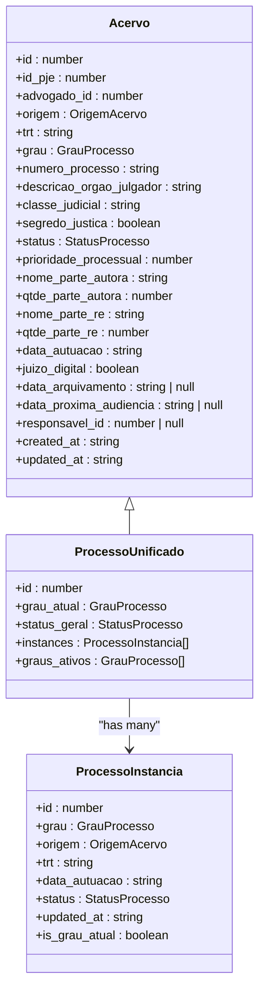
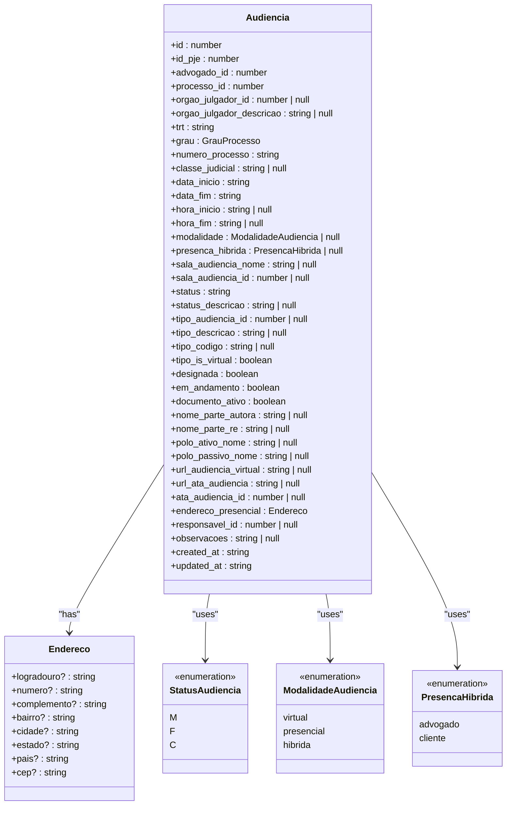
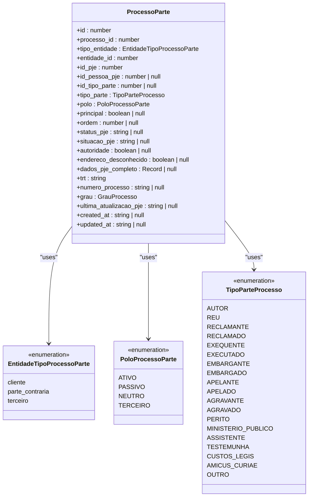
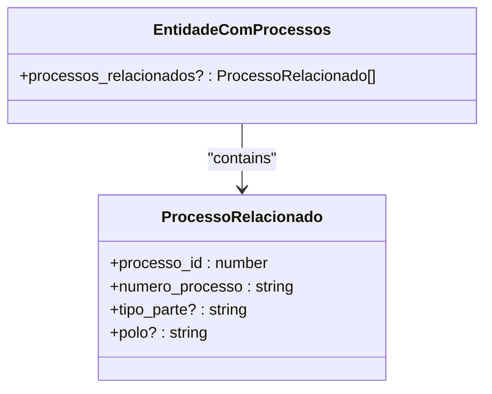
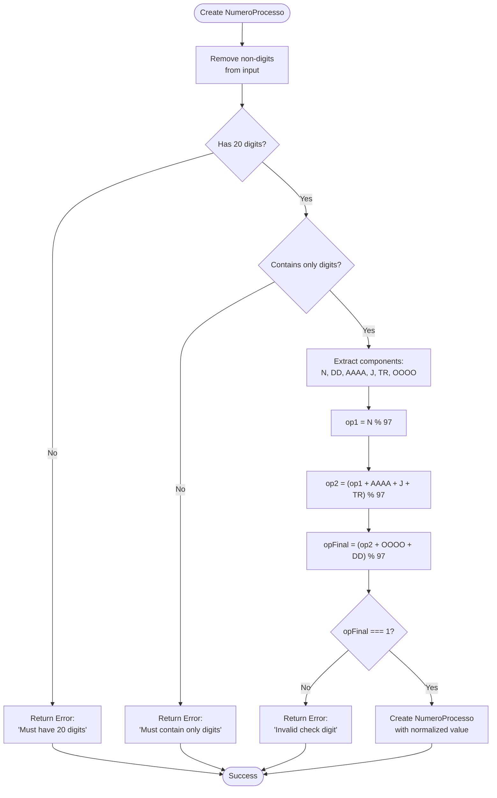
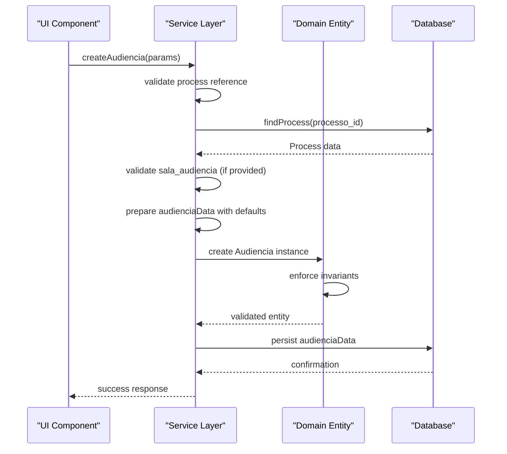

# Legal Process Domain

<cite>
**Referenced Files in This Document**   
- [acervo.ts](file://types/domain/acervo.ts)
- [audiencias.ts](file://types/domain/audiencias.ts)
- [processo-partes.ts](file://types/domain/processo-partes.ts)
- [processo-relacionado.ts](file://types/domain/processo-relacionado.ts)
- [value-objects.ts](file://types/domain/value-objects.ts)
- [acervo.ts](file://types/contracts/acervo.ts)
- [audiencias.ts](file://types/contracts/audiencias.ts)
- [processo-partes.ts](file://types/contracts/processo-partes.ts)
- [criar-audiencia.service.ts](file://backend/audiencias/services/criar-audiencia.service.ts)
- [nova-audiencia-dialog.tsx](file://app/(dashboard)/audiencias/components/nova-audiencia-dialog.tsx)
</cite>

## Table of Contents
1. [Introduction](#introduction)
2. [Core Data Models](#core-data-models)
3. [Acervo Entity](#acervo-entity)
4. [Audiencia Entity](#audiencia-entity)
5. [ProcessoPartes Relationship](#processopartes-relationship)
6. [ProcessoRelacionado Value Object](#processorelacionado-value-object)
7. [Domain Invariants and Validation](#domain-invariants-and-validation)
8. [Data Access Patterns](#data-access-patterns)
9. [Lifecycle Management](#lifecycle-management)
10. [Conclusion](#conclusion)

## Introduction
The Legal Process Domain in Sinesys manages judicial processes and their associated entities, providing a comprehensive system for tracking legal cases, hearings, and participant relationships. This documentation details the core domain models that represent legal processes (Acervo), hearings (Audiencia), and their interrelationships through the ProcessoPartes entity. The domain design follows domain-driven principles with clear separation between domain entities and data transfer objects, ensuring business rules are enforced through value objects and service layers. The system supports both automatically captured data from external systems (like PJe) and manually created records, maintaining data integrity through comprehensive validation rules.

## Core Data Models
The Legal Process Domain consists of several interconnected entities that represent different aspects of judicial processes. The core entities include Acervo (legal processes), Audiencia (hearings), and ProcessoPartes (the relationship between processes and participants). These entities are complemented by value objects like ProcessoRelacionado that track related processes. The domain model is designed to handle both active and archived processes, with support for multiple instances of the same process across different jurisdictional levels. The system maintains a clear separation between domain entities that enforce business rules and contract interfaces that define API parameters and responses.

**Section sources**
- [acervo.ts](file://types/domain/acervo.ts)
- [audiencias.ts](file://types/domain/audiencias.ts)
- [processo-partes.ts](file://types/domain/processo-partes.ts)
- [processo-relacionado.ts](file://types/domain/processo-relacionado.ts)

## Acervo Entity
The Acervo entity represents a legal process in the system, containing comprehensive information about the judicial case. It includes essential properties such as the process number (numero_processo), court information (trt), jurisdictional level (grau), and current status (status). The entity distinguishes between processes from the general collection (acervo_geral) and archived processes (arquivado) through the origem field. Key attributes include the filing date (data_autuacao), justice secrecy status (segredo_justica), and priority level (prioridade_processual). The entity also tracks the names of the plaintiff (nome_parte_autora) and defendant (nome_parte_re), along with their respective quantities when multiple parties are involved. For processes with multiple instances across different jurisdictional levels, the ProcessoUnificado interface provides a consolidated view that aggregates data from all instances while maintaining the integrity of each individual record.

**Diagram sources **
- [acervo.ts](file://types/domain/acervo.ts#L15-L81)

**Section sources**
- [acervo.ts](file://types/domain/acervo.ts#L15-L81)

## Audiencia Entity
The Audiencia entity models judicial hearings with detailed attributes including date (data_inicio, data_fim), time (hora_inicio, hora_fim), and virtual hearing URL (url_audiencia_virtual). The entity supports three modalities of hearings: virtual, presencial (in-person), and hibrida (hybrid), defined by the ModalidadeAudiencia type. For hybrid hearings, the system specifies which party will attend in person through the presenca_hibrida field, which can be either 'advogado' (lawyer) or 'cliente' (client). The entity includes comprehensive status tracking with values 'M' (scheduled), 'F' (completed), and 'C' (canceled). Additional attributes include the hearing room name (sala_audiencia_nome), type of hearing (tipo_descricao), and any observations (observacoes). The entity also maintains a reference to the responsible person (responsavel_id) and includes an endereco_presencial object for in-person hearings that contains full address details.

**Diagram sources **
- [audiencias.ts](file://types/domain/audiencias.ts#L25-L77)

**Section sources**
- [audiencias.ts](file://types/domain/audiencias.ts#L25-L77)

## ProcessoPartes Relationship
The ProcessoPartes entity establishes the many-to-many relationship between legal processes and their participants, serving as the junction table that connects processes with clients, opposing parties, and third parties. The entity includes the tipo_entidade field to distinguish between these participant types and the polo field to specify the procedural position (ATIVO, PASSIVO, NEUTRO, or TERCEIRO). The tipo_parte field captures the specific role of the participant in the process, with a comprehensive list of valid values including AUTOR, REU, RECLAMANTE, RECLAMADO, EXEQUENTE, EXECUTADO, and others. The entity supports hierarchical organization through the ordem field and designates a primary participant through the principal boolean flag. Additional metadata includes PJe system identifiers (id_pje, id_pessoa_pje), status information from the PJe system (status_pje, situacao_pje), and audit fields (created_at, updated_at) to track changes over time.

**Diagram sources **
- [processo-partes.ts](file://types/domain/processo-partes.ts#L68-L137)

**Section sources**
- [processo-partes.ts](file://types/domain/processo-partes.ts#L68-L137)

## ProcessoRelacionado Value Object
The ProcessoRelacionado value object represents a minimal set of data for tracking related legal processes, designed to be embedded within other entities without creating circular dependencies. It contains the essential information needed to reference another process: the processo_id (database identifier) and numero_processo (formatted process number). The value object also includes optional fields for tipo_parte (type of participation) and polo (procedural position) to provide context about the relationship between processes. This value object is used in the EntidadeComProcessos interface, which can be implemented by various entities to indicate their participation in multiple processes. The lightweight nature of this value object makes it ideal for list displays and quick references while maintaining the ability to navigate to full process details when needed.

**Diagram sources **
- [processo-relacionado.ts](file://types/domain/processo-relacionado.ts#L4-L21)

**Section sources**
- [processo-relacionado.ts](file://types/domain/processo-relacionado.ts#L4-L21)

## Domain Invariants and Validation
The Legal Process Domain enforces business rules through value objects that guarantee domain invariants are maintained. The NumeroProcesso value object validates process numbers according to the CNJ format (NNNNNNN-DD.AAAA.J.TR.OOOO) and verifies the check digit using the mod 97 algorithm as specified in CNJ Resolution 65/2008. The validation process involves three steps: extracting the sequential number, calculating the intermediate result with the year and tribunal codes, and verifying the final result with the origin code and check digits. The CEP value object ensures Brazilian postal codes follow the NNNNN-NNN format with exactly eight digits. These value objects are immutable and can only be created through factory methods that perform validation, preventing invalid data from entering the domain. The system also validates hearing creation through service layers that check for required fields and ensure data consistency between related entities.

**Diagram sources **
- [value-objects.ts](file://types/domain/value-objects.ts#L108-L243)

**Section sources**
- [value-objects.ts](file://types/domain/value-objects.ts#L108-L243)

## Data Access Patterns
The Legal Process Domain employs a clear separation between domain entities and data transfer objects (DTOs) through contract interfaces. The ListarAcervoParams interface defines the parameters for querying legal processes, supporting filtering by various criteria such as TRT, jurisdictional level, responsible person, and date ranges. The ListarAudienciasParams interface provides similar functionality for hearings, with additional filters for hearing status, modality, and type. These contract interfaces are used in API routes and service layers to standardize data access patterns across the application. The system supports both paginated results (ListarAcervoResult, ListarAudienciasResult) and grouped results (ListarAcervoAgrupadoResult) for different use cases. Service implementations like criar-audiencia.service.ts demonstrate how these contracts are used to validate input parameters and construct domain entities with proper relationships and default values.

**Section sources**
- [acervo.ts](file://types/contracts/acervo.ts)
- [audiencias.ts](file://types/contracts/audiencias.ts)
- [processo-partes.ts](file://types/contracts/processo-partes.ts)
- [criar-audiencia.service.ts](file://backend/audiencias/services/criar-audiencia.service.ts)

## Lifecycle Management
The lifecycle of legal processes and hearings in Sinesys is managed through dedicated service layers that handle creation, updates, and state transitions. When creating a new hearing through the criar-audiencia.service.ts service, the system validates the process reference, retrieves associated data, and sets default values such as status 'M' (scheduled) and designada true. The service constructs the audienciaData object with both direct parameters and derived data from related entities, ensuring consistency across the domain model. The system supports both automated data capture from external systems like PJe and manual creation through UI components like nova-audiencia-dialog.tsx, which collects all necessary fields including process selection, date/time, hearing type, and address information. The domain model maintains audit fields (created_at, updated_at) and tracks the last update from external systems (ultima_atualizacao_pje) to support synchronization and change tracking.

**Diagram sources **
- [criar-audiencia.service.ts](file://backend/audiencias/services/criar-audiencia.service.ts#L51-L85)
- [nova-audiencia-dialog.tsx](file://app/(dashboard)/audiencias/components/nova-audiencia-dialog.tsx#L94-L121)

**Section sources**
- [criar-audiencia.service.ts](file://backend/audiencias/services/criar-audiencia.service.ts)
- [nova-audiencia-dialog.tsx](file://app/(dashboard)/audiencias/components/nova-audiencia-dialog.tsx)

## Conclusion
The Legal Process Domain in Sinesys provides a robust and well-structured model for managing judicial processes and their associated entities. The domain design follows domain-driven principles with clear separation between entities, value objects, and data transfer contracts. Key features include comprehensive validation of process numbers through the NumeroProcesso value object, flexible representation of hearings with support for virtual, in-person, and hybrid modalities, and a sophisticated relationship model through the ProcessoPartes entity that captures the complex connections between processes and participants. The system maintains data integrity through immutable value objects that enforce domain invariants and service layers that validate business rules. The separation between domain entities and API contracts allows for flexible data access patterns while preserving the integrity of the core domain model. This architecture supports both automated data capture from external systems and manual data entry, making it adaptable to various legal practice workflows.