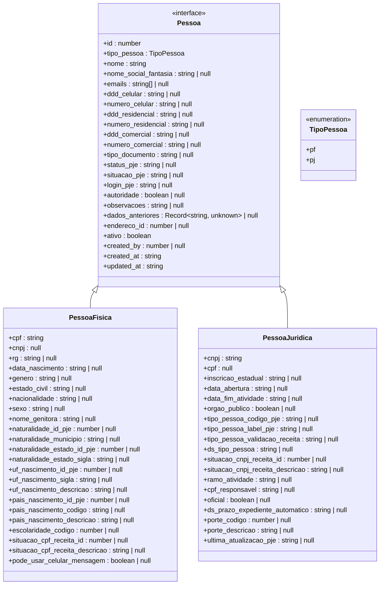
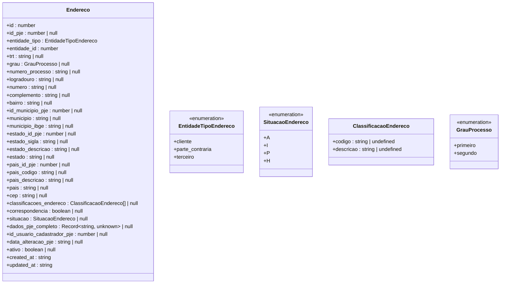
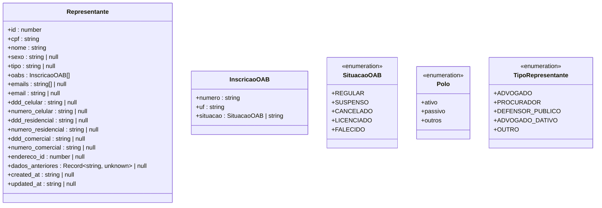
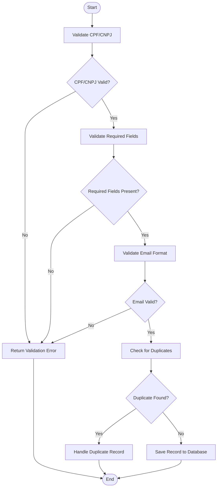
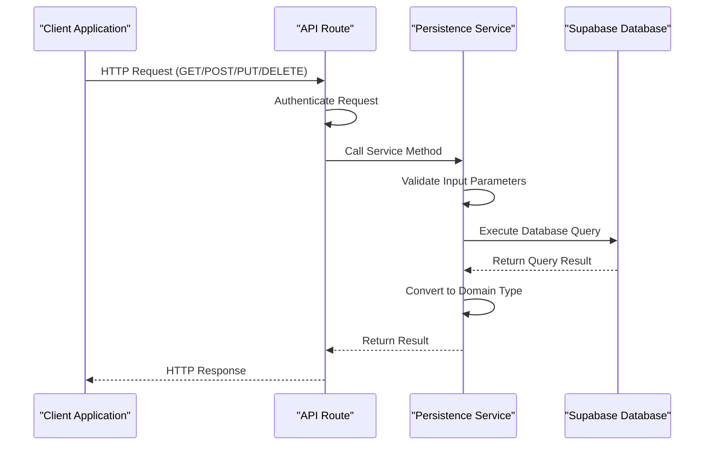
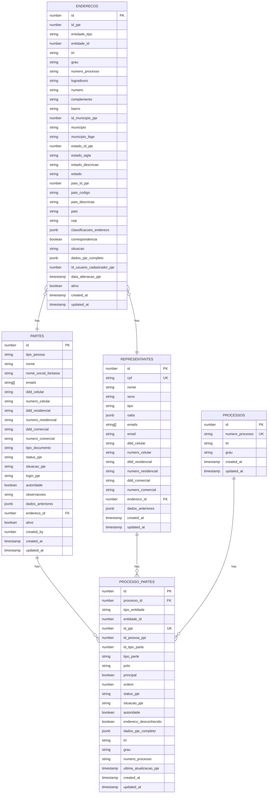
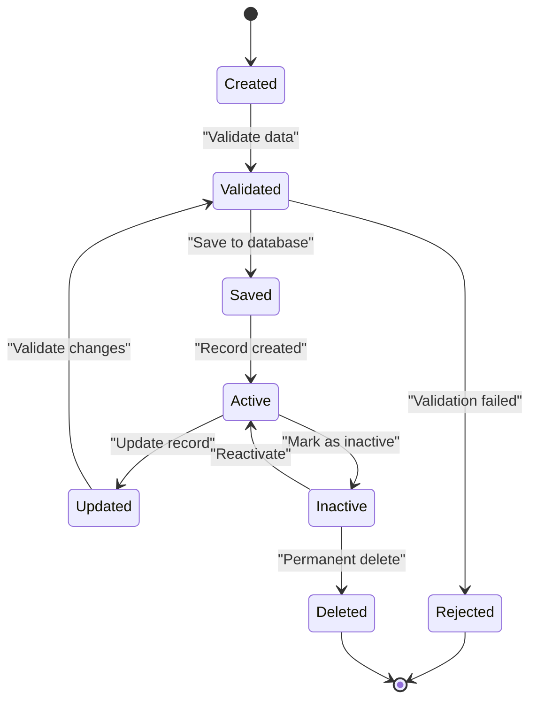

# Party Management Domain

<cite>
**Referenced Files in This Document**   
- [partes.ts](file://types/domain/partes.ts)
- [pessoa.ts](file://types/domain/pessoa.ts)
- [enderecos.ts](file://types/domain/enderecos.ts)
- [representantes.ts](file://types/domain/representantes.ts)
- [terceiros-persistence.service.ts](file://backend/partes/services/terceiros-persistence.service.ts)
- [processo-partes-persistence.service.ts](file://backend/partes/services/processo-partes-persistence.service.ts)
- [representantes-persistence.service.ts](file://backend/representantes/services/representantes-persistence.service.ts)
- [enderecos-persistence.service.ts](file://backend/enderecos/services/enderecos-persistence.service.ts)
- [partes.ts](file://types/contracts/partes.ts)
- [pessoa.ts](file://types/contracts/pessoa.ts)
- [representantes.ts](file://types/contracts/representantes.ts)
- [processo-partes.ts](file://types/contracts/processo-partes.ts)
- [enderecos.ts](file://types/contracts/enderecos.ts)
</cite>

## Table of Contents
1. [Introduction](#introduction)
2. [Core Domain Entities](#core-domain-entities)
3. [Data Access and Validation](#data-access-and-validation)
4. [Entity Relationships and Lifecycle](#entity-relationships-and-lifecycle)
5. [API Contracts and Data Transfer](#api-contracts-and-data-transfer)
6. [Conclusion](#conclusion)

## Introduction

The Party Management Domain in Sinesys is responsible for modeling and managing parties involved in legal processes. This domain encompasses various types of parties including clients, opposing parties, third parties (such as experts, public prosecutors, witnesses), and legal representatives (attorneys). The system is designed with a clear separation between domain entities and data transfer objects, ensuring business rules and invariants are maintained throughout the application.

This documentation provides a comprehensive overview of the core data models in the Party Management Domain, detailing the structure, relationships, validation rules, and lifecycle management of party information. The domain model is implemented using TypeScript interfaces and classes, with a focus on type safety and domain-driven design principles.

**Section sources**
- [partes.ts](file://types/domain/partes.ts#L1-L309)
- [pessoa.ts](file://types/domain/pessoa.ts#L1-L96)
- [enderecos.ts](file://types/domain/enderecos.ts#L1-L64)
- [representantes.ts](file://types/domain/representantes.ts#L1-L66)

## Core Domain Entities

### Partes Entity

The `Partes` entity represents parties in legal processes and serves as a base for different types of parties in the system. It is implemented as a discriminated union of different party types, allowing for type-safe handling of various party categories.

The `Partes` entity is divided into three main categories:
- **Cliente**: Represents clients in legal processes
- **ParteContraria**: Represents opposing parties
- **Terceiro**: Represents third parties such as experts, public prosecutors, assistants, witnesses, etc.

Each category has specific attributes for both physical persons (Pessoa Física) and legal entities (Pessoa Jurídica). The entity structure includes common fields such as name, contact information, document types, and status information, while also maintaining specific attributes for each party type.

For physical persons, the entity includes attributes like CPF (individual taxpayer registry), RG (identity card), date of birth, gender, marital status, and nationality. For legal entities, it includes CNPJ (corporate taxpayer registry), state registration, date of incorporation, and business activity sector.

```mermaid
classDiagram
class Partes {
<<interface>>
+id : number
+tipo_pessoa : TipoPessoa
+nome : string
+nome_social_fantasia : string | null
+emails : string[] | null
+telefone_celular : string | null
+telefone_residencial : string | null
+telefone_comercial : string | null
+tipo_documento : string | null
+status_pje : string | null
+situacao_pje : string | null
+login_pje : string | null
+autoridade : boolean | null
+observacoes : string | null
+dados_anteriores : Record~string, unknown~ | null
+endereco_id : number | null
+ativo : boolean
+created_by : number | null
+created_at : string
+updated_at : string
}
class ClientePessoaFisica {
+cpf : string
+cnpj : null
+rg : string | null
+data_nascimento : string | null
+genero : string | null
+estado_civil : string | null
+nacionalidade : string | null
+sexo : string | null
+nome_genitora : string | null
+naturalidade_id_pje : number | null
+naturalidade_municipio : string | null
+naturalidade_estado_id_pje : number | null
+naturalidade_estado_sigla : string | null
+uf_nascimento_id_pje : number | null
+uf_nascimento_sigla : string | null
+uf_nascimento_descricao : string | null
+pais_nascimento_id_pje : number | null
+pais_nascimento_codigo : string | null
+pais_nascimento_descricao : string | null
+escolaridade_codigo : number | null
+situacao_cpf_receita_id : number | null
+situacao_cpf_receita_descricao : string | null
+pode_usar_celular_mensagem : boolean | null
}
class ClientePessoaJuridica {
+cnpj : string
+cpf : null
+inscricao_estadual : string | null
+data_abertura : string | null
+data_fim_atividade : string | null
+orgao_publico : boolean | null
+tipo_pessoa_codigo_pje : string | null
+tipo_pessoa_label_pje : string | null
+tipo_pessoa_validacao_receita : string | null
+ds_tipo_pessoa : string | null
+situacao_cnpj_receita_id : number | null
+situacao_cnpj_receita_descricao : string | null
+ramo_atividade : string | null
+cpf_responsavel : string | null
+oficial : boolean | null
+ds_prazo_expediente_automatico : string | null
+porte_codigo : number | null
+porte_descricao : string | null
+ultima_atualizacao_pje : string | null
}
class ParteContrariaPessoaFisica {
+cpf : string
+cnpj : null
+rg : string | null
+data_nascimento : string | null
+genero : string | null
+estado_civil : string | null
+nacionalidade : string | null
+sexo : string | null
+nome_genitora : string | null
+naturalidade_id_pje : number | null
+naturalidade_municipio : string | null
+naturalidade_estado_id_pje : number | null
+naturalidade_estado_sigla : string | null
+uf_nascimento_id_pje : number | null
+uf_nascimento_sigla : string | null
+uf_nascimento_descricao : string | null
+pais_nascimento_id_pje : number | null
+pais_nascimento_codigo : string | null
+pais_nascimento_descricao : string | null
+escolaridade_codigo : number | null
+situacao_cpf_receita_id : number | null
+situacao_cpf_receita_descricao : string | null
+pode_usar_celular_mensagem : boolean | null
}
class ParteContrariaPessoaJuridica {
+cnpj : string
+cpf : null
+inscricao_estadual : string | null
+data_abertura : string | null
+data_fim_atividade : string | null
+orgao_publico : boolean | null
+tipo_pessoa_codigo_pje : string | null
+tipo_pessoa_label_pje : string | null
+tipo_pessoa_validacao_receita : string | null
+ds_tipo_pessoa : string | null
+situacao_cnpj_receita_id : number | null
+situacao_cnpj_receita_descricao : string | null
+ramo_atividade : string | null
+cpf_responsavel : string | null
+oficial : boolean | null
+ds_prazo_expediente_automatico : string | null
+porte_codigo : number | null
+porte_descricao : string | null
+ultima_atualizacao_pje : string | null
}
class TerceiroPessoaFisica {
+id_tipo_parte : number | null
+tipo_parte : TipoParteTerceiro
+polo : PoloTerceiro
+cpf : string
+cnpj : null
+tipo_documento : string | null
+rg : string | null
+sexo : string | null
+nome_genitora : string | null
+data_nascimento : string | null
+genero : string | null
+estado_civil : string | null
+nacionalidade : string | null
+uf_nascimento_id_pje : number | null
+uf_nascimento_sigla : string | null
+uf_nascimento_descricao : string | null
+naturalidade_id_pje : number | null
+naturalidade_municipio : string | null
+naturalidade_estado_id_pje : number | null
+naturalidade_estado_sigla : string | null
+pais_nascimento_id_pje : number | null
+pais_nascimento_codigo : string | null
+pais_nascimento_descricao : string | null
+escolaridade_codigo : number | null
+situacao_cpf_receita_id : number | null
+situacao_cpf_receita_descricao : string | null
+pode_usar_celular_mensagem : boolean | null
}
class TerceiroPessoaJuridica {
+id_tipo_parte : number | null
+tipo_parte : TipoParteTerceiro
+polo : PoloTerceiro
+cnpj : string
+cpf : null
+inscricao_estadual : string | null
+data_abertura : string | null
+data_fim_atividade : string | null
+orgao_publico : boolean | null
+tipo_pessoa_codigo_pje : string | null
+tipo_pessoa_label_pje : string | null
+tipo_pessoa_validacao_receita : string | null
+ds_tipo_pessoa : string | null
+situacao_cnpj_receita_id : number | null
+situacao_cnpj_receita_descricao : string | null
+ramo_atividade : string | null
+cpf_responsavel : string | null
+oficial : boolean | null
+ds_prazo_expediente_automatico : string | null
+porte_codigo : number | null
+porte_descricao : string | null
}
Partes <|-- ClientePessoaFisica
Partes <|-- ClientePessoaJuridica
Partes <|-- ParteContrariaPessoaFisica
Partes <|-- ParteContrariaPessoaJuridica
Partes <|-- TerceiroPessoaFisica
Partes <|-- TerceiroPessoaJuridica
class TipoParteTerceiro {
<<enumeration>>
+PERITO
+MINISTERIO_PUBLICO
+ASSISTENTE
+TESTEMUNHA
+CUSTOS_LEGIS
+AMICUS_CURIAE
+OUTRO
}
class PoloTerceiro {
<<enumeration>>
+ATIVO
+PASSIVO
+NEUTRO
+TERCEIRO
}
```

**Diagram sources**
- [partes.ts](file://types/domain/partes.ts#L1-L309)

**Section sources**
- [partes.ts](file://types/domain/partes.ts#L1-L309)

### Pessoa Entity

The `Pessoa` entity models individuals and legal entities with attributes like name, CPF/CNPJ, and contact information. It serves as a foundational entity that can be used across different contexts in the system.

The entity is implemented as a discriminated union with two main variants: `PessoaFisica` (physical person) and `PessoaJuridica` (legal entity). This design allows for type-safe handling of both person types while maintaining a common interface for shared attributes.

For physical persons, the entity includes the CPF (Cadastro de Pessoas Físicas) field, which is validated using the standard Brazilian CPF validation algorithm. For legal entities, it includes the CNPJ (Cadastro Nacional da Pessoa Jurídica) field, validated using the Brazilian CNPJ validation algorithm.

The entity also includes comprehensive contact information fields such as email addresses, phone numbers (mobile, residential, commercial), and address information. Additional attributes include document type, status information from the PJE (Processo Judicial Eletrônico) system, and audit fields for tracking creation and modification.

**Diagram sources**
- [pessoa.ts](file://types/domain/pessoa.ts#L1-L96)

**Section sources**
- [pessoa.ts](file://types/domain/pessoa.ts#L1-L96)

### Enderecos Entity

The `Enderecos` entity manages address information for parties in the system. It is designed to be polymorphic, allowing it to be associated with different types of entities such as clients, opposing parties, and third parties.

The entity includes comprehensive address fields such as street, number, complement, neighborhood, municipality, state, country, and postal code (CEP). It also includes metadata about the address such as its status (active, inactive, principal, historical), classification, and correspondence status.

The entity is linked to the party through a polymorphic relationship, with fields `entidade_tipo` and `entidade_id` that specify the type and ID of the associated entity. This design allows a single address to be associated with different types of parties without requiring separate address tables for each party type.

**Diagram sources**
- [enderecos.ts](file://types/domain/enderecos.ts#L1-L64)

**Section sources**
- [enderecos.ts](file://types/domain/enderecos.ts#L1-L64)

### Representantes Entity

The `Representantes` entity tracks legal representatives (attorneys) with OAB (Ordem dos Advogados do Brasil) numbers and specialization. Unlike other party types, representatives are modeled as a separate entity with a unique structure optimized for attorney information.

The entity is designed to be unique by CPF, meaning there is only one record per attorney in the system regardless of how many processes they are involved in. This design ensures data consistency and avoids duplication of attorney information.

The entity includes the attorney's OAB registration information as an array of `InscricaoOAB` objects, allowing an attorney to have registrations in multiple states. Each registration includes the OAB number, state (UF), and situation (regular, suspended, canceled, licensed, deceased).

The entity also includes contact information, specialization, and audit fields. It is linked to processes through the `processo_partes` table, which establishes the relationship between a representative and a specific legal process.

**Diagram sources**
- [representantes.ts](file://types/domain/representantes.ts#L1-L66)

**Section sources**
- [representantes.ts](file://types/domain/representantes.ts#L1-L66)

## Data Access and Validation

### Validation Rules

The Party Management Domain implements comprehensive validation rules to ensure data integrity and compliance with business requirements. These validations are implemented at multiple levels: domain entities, persistence services, and API contracts.

For CPF and CNPJ validation, the system uses standard Brazilian algorithms to verify the validity of these identification numbers. The validation functions are implemented in the persistence services and are applied when creating or updating party records.

**Diagram sources**
- [terceiros-persistence.service.ts](file://backend/partes/services/terceiros-persistence.service.ts#L28-L77)
- [representantes-persistence.service.ts](file://backend/representantes/services/representantes-persistence.service.ts#L36-L98)

**Section sources**
- [terceiros-persistence.service.ts](file://backend/partes/services/terceiros-persistence.service.ts#L28-L77)
- [representantes-persistence.service.ts](file://backend/representantes/services/representantes-persistence.service.ts#L36-L98)

### Data Access Patterns

The data access layer in the Party Management Domain follows a service-oriented architecture with dedicated persistence services for each entity type. These services implement CRUD operations with proper error handling and type conversion.

The persistence services use Supabase as the underlying database provider and implement type-safe queries using TypeScript. Each service includes methods for creating, reading, updating, and deleting entities, as well as specialized methods for listing entities with pagination and filtering.

The services also implement proper error mapping, converting database-specific error codes into meaningful error messages that can be returned to the client. This ensures a consistent error handling experience across the application.

**Diagram sources**
- [terceiros-persistence.service.ts](file://backend/partes/services/terceiros-persistence.service.ts#L263-L324)
- [representantes-persistence.service.ts](file://backend/representantes/services/representantes-persistence.service.ts#L209-L257)

**Section sources**
- [terceiros-persistence.service.ts](file://backend/partes/services/terceiros-persistence.service.ts#L263-L324)
- [representantes-persistence.service.ts](file://backend/representantes/services/representantes-persistence.service.ts#L209-L257)

## Entity Relationships and Lifecycle

### Relationship Model

The Party Management Domain implements a flexible relationship model that allows parties to be associated with multiple legal processes. This is achieved through the `processo_partes` entity, which serves as a junction table between parties and processes.

The relationship model supports different types of parties (clients, opposing parties, third parties, representatives) and different roles within a process (active party, passive party, neutral party). The model also supports the concept of a "principal" party, which indicates the main representative of a party in a process.

The `processo_partes` entity includes metadata about the relationship such as the PJE ID, process number, TRT (Regional Labor Court), and process degree. This metadata allows the system to maintain synchronization with the PJE system and track the origin of party information.

**Diagram sources**
- [processo-partes-persistence.service.ts](file://backend/partes/services/processo-partes-persistence.service.ts#L86-L119)
- [partes.ts](file://types/domain/partes.ts#L1-L309)
- [representantes.ts](file://types/domain/representantes.ts#L1-L66)
- [enderecos.ts](file://types/domain/enderecos.ts#L1-L64)

**Section sources**
- [processo-partes-persistence.service.ts](file://backend/partes/services/processo-partes-persistence.service.ts#L86-L119)

### Lifecycle Management

The lifecycle of party information in the Sinesys system is managed through a combination of domain rules, persistence services, and API contracts. The system implements proper validation, error handling, and data consistency checks to ensure the integrity of party information throughout its lifecycle.

When creating a new party, the system validates all required fields and checks for duplicates based on identification numbers (CPF/CNPJ). The creation process also includes validation of contact information and address data to ensure completeness.

When updating a party, the system implements immutability rules for certain fields such as the party type. The update process also maintains an audit trail by storing the previous state of the record in the `dados_anteriores` field.

The system also implements soft delete functionality for addresses, marking them as inactive rather than permanently removing them from the database. This allows for historical tracking of address changes while maintaining data integrity.

**Diagram sources**
- [terceiros-persistence.service.ts](file://backend/partes/services/terceiros-persistence.service.ts#L268-L324)
- [enderecos-persistence.service.ts](file://backend/enderecos/services/enderecos-persistence.service.ts#L135-L172)
- [representantes-persistence.service.ts](file://backend/representantes/services/representantes-persistence.service.ts#L262-L320)

**Section sources**
- [terceiros-persistence.service.ts](file://backend/partes/services/terceiros-persistence.service.ts#L268-L324)
- [enderecos-persistence.service.ts](file://backend/enderecos/services/enderecos-persistence.service.ts#L135-L172)
- [representantes-persistence.service.ts](file://backend/representantes/services/representantes-persistence.service.ts#L262-L320)

## API Contracts and Data Transfer

### Data Transfer Objects

The Party Management Domain uses a clear separation between domain entities and data transfer objects (DTOs). The DTOs are defined in the `contracts` directory and are used for API communication, ensuring that the internal domain model is not exposed directly to external consumers.

The DTOs include parameter interfaces for API operations such as `CriarClienteParams`, `AtualizarClienteParams`, `ListarClientesParams`, etc. These interfaces define the structure of data that is expected by the API endpoints and include optional fields to support partial updates and flexible querying.

The system also includes result interfaces such as `ListarClientesResult` that define the structure of API responses, including pagination information and the actual data.

```mermaid
classDiagram
class CriarClienteParams {
+tipo_pessoa : 'pf' | 'pj'
+nome : string
+cpf? : string
+cnpj? : string
+nome_social_fantasia? : string | null
+emails? : string[] | null
+ddd_celular? : string | null
+numero_celular? : string | null
+ddd_residencial? : string | null
+numero_residencial? : string | null
+ddd_comercial? : string | null
+numero_comercial? : string | null
+tipo_documento? : string | null
+status_pje? : string | null
+situacao_pje? : string | null
+login_pje? : string | null
+autoridade? : boolean | null
+rg? : string | null
+data_nascimento? : string | null
+genero? : string | null
+estado_civil? : string | null
+nacionalidade? : string | null
+sexo? : string | null
+nome_genitora? : string | null
+naturalidade_id_pje? : number | null
+naturalidade_municipio? : string | null
+naturalidade_estado_id_pje? : number | null
+naturalidade_estado_sigla? : string | null
+uf_nascimento_id_pje? : number | null
+uf_nascimento_sigla? : string | null
+uf_nascimento_descricao? : string | null
+pais_nascimento_id_pje? : number | null
+pais_nascimento_codigo? : string | null
+pais_nascimento_descricao? : string | null
+escolaridade_codigo? : number | null
+situacao_cpf_receita_id? : number | null
+situacao_cpf_receita_descricao? : string | null
+pode_usar_celular_mensagem? : boolean | null
+observacoes? : string | null
+endereco_id? : number | null
+ativo? : boolean
+created_by? : number | null
}
class AtualizarClienteParams {
+id : number
+tipo_pessoa? : 'pf' | 'pj'
+nome? : string
+cpf? : string
+cnpj? : string
+nome_social_fantasia? : string | null
+emails? : string[] | null
+ddd_celular? : string | null
+numero_celular? : string | null
+ddd_residencial? : string | null
+numero_residencial? : string | null
+ddd_comercial? : string | null
+numero_comercial? : string | null
+tipo_documento? : string | null
+status_pje? : string | null
+situacao_pje? : string | null
+login_pje? : string | null
+autoridade? : boolean | null
+rg? : string | null
+data_nascimento? : string | null
+genero? : string | null
+estado_civil? : string | null
+nacionalidade? : string | null
+sexo? : string | null
+nome_genitora? : string | null
+naturalidade_id_pje? : number | null
+naturalidade_municipio? : string | null
+naturalidade_estado_id_pje? : number | null
+naturalidade_estado_sigla? : string | null
+uf_nascimento_id_pje? : number | null
+uf_nascimento_sigla? : string | null
+uf_nascimento_descricao? : string | null
+pais_nascimento_id_pje? : number | null
+pais_nascimento_codigo? : string | null
+pais_nascimento_descricao? : string | null
+escolaridade_codigo? : number | null
+situacao_cpf_receita_id? : number | null
+situacao_cpf_receita_descricao? : string | null
+pode_usar_celular_mensagem? : boolean | null
+observacoes? : string | null
+dados_anteriores? : Record~string, unknown~ | null
+endereco_id? : number | null
+ativo? : boolean
}
class ListarClientesParams {
+pagina? : number
+limite? : number
+tipo_pessoa? : TipoPessoa
+trt? : string
+grau? : GrauProcesso
+busca? : string
+nome? : string
+cpf? : string
+cnpj? : string
+ordenar_por? : OrdenarPorCliente
+ordem? : OrdemCliente
+numero_processo? : string
}
class ListarClientesResult {
+clientes : Cliente[]
+total : number
+pagina : number
+limite : number
+totalPaginas : number
}
class CriarRepresentanteParams {
+cpf : string
+nome : string
+sexo? : string | null
+tipo? : string | null
+oabs? : InscricaoOAB[]
+emails? : string[] | null
+email? : string | null
+ddd_celular? : string | null
+numero_celular? : string | null
+ddd_residencial? : string | null
+numero_residencial? : string | null
+ddd_comercial? : string | null
+numero_comercial? : string | null
+endereco_id? : number | null
+dados_anteriores? : Record~string, unknown~ | null
}
class AtualizarRepresentanteParams {
+id : number
+cpf? : string
+nome? : string
+sexo? : string | null
+tipo? : string | null
+oabs? : InscricaoOAB[]
+emails? : string[] | null
+email? : string | null
+ddd_celular? : string | null
+numero_celular? : string | null
+ddd_residencial? : string | null
+numero_residencial? : string | null
+ddd_comercial? : string | null
+numero_comercial? : string | null
+endereco_id? : number | null
+dados_anteriores? : Record~string, unknown~ | null
}
class ListarRepresentantesParams {
+pagina? : number
+limite? : number
+nome? : string
+cpf? : string
+oab? : string
+uf_oab? : string
+busca? : string
+ordenar_por? : OrdenarPorRepresentante
+ordem? : 'asc' | 'desc'
}
class ListarRepresentantesResult {
+representantes : Representante[]
+total : number
+pagina : number
+limite : number
+totalPaginas : number
}
CriarClienteParams <|-- CriarClientePFParams
CriarClienteParams <|-- CriarClientePJParams
AtualizarClienteParams <|-- AtualizarClientePFParams
AtualizarClienteParams <|-- AtualizarClientePJParams
CriarRepresentanteParams
AtualizarRepresentanteParams
ListarClientesParams
ListarClientesResult
ListarRepresentantesParams
ListarRepresentantesResult
```

**Diagram sources**
- [partes.ts](file://types/contracts/partes.ts#L35-L232)
- [representantes.ts](file://types/contracts/representantes.ts#L23-L81)

**Section sources**
- [partes.ts](file://types/contracts/partes.ts#L35-L232)
- [representantes.ts](file://types/contracts/representantes.ts#L23-L81)

### API Endpoints

The Party Management Domain exposes a comprehensive set of API endpoints for managing party information. These endpoints follow REST principles and are designed to support the full lifecycle of party data.

The API includes endpoints for creating, reading, updating, and deleting parties, as well as specialized endpoints for searching and listing parties with pagination and filtering. The endpoints are secured with authentication and authorization mechanisms to ensure data privacy and security.

The API also includes endpoints for managing the relationships between parties and processes, allowing parties to be associated with specific legal processes and roles within those processes.

```mermaid
flowchart TD
subgraph "API Endpoints"
A["GET /api/partes/terceiros"]
B["POST /api/partes/terceiros"]
C["GET /api/partes/terceiros/[id]"]
D["PUT /api/partes/terceiros/[id]"]
E["DELETE /api/partes/terceiros/[id]"]
F["GET /api/representantes"]
G["POST /api/representantes"]
H["GET /api/representantes/[id]"]
I["PUT /api/representantes/[id]"]
J["DELETE /api/representantes/[id]"]
K["GET /api/partes/processo-partes"]
L["POST /api/partes/processo-partes"]
M["GET /api/partes/processo-partes/[id]"]
N["PUT /api/partes/processo-partes/[id]"]
O["DELETE /api/partes/processo-partes/[id]"]
P["GET /api/partes/enderecos"]
Q["POST /api/partes/enderecos"]
R["GET /api/partes/enderecos/[id]"]
S["PUT /api/partes/enderecos/[id]"]
T["DELETE /api/partes/enderecos/[id]"]
end
A --> |List| Service
B --> |Create| Service
C --> |Get by ID| Service
D --> |Update| Service
E --> |Delete| Service
F --> |List| Service
G --> |Create| Service
H --> |Get by ID| Service
I --> |Update| Service
J --> |Delete| Service
K --> |List| Service
L --> |Create| Service
M --> |Get by ID| Service
N --> |Update| Service
O --> |Delete| Service
P --> |List| Service
Q --> |Create| Service
R --> |Get by ID| Service
S --> |Update| Service
T --> |Delete| Service
subgraph "Persistence Service"
Service["Domain Service Layer"]
end
Service --> Database["Supabase Database"]
```

**Diagram sources**
- [terceiros/route.ts](file://app/api/partes/terceiros/route.ts#L1-L109)
- [representantes/route.ts](file://app/api/representantes/route.ts#L1-L294)
- [processo-partes/route.ts](file://app/api/partes/processo-partes/route.ts)

**Section sources**
- [terceiros/route.ts](file://app/api/partes/terceiros/route.ts#L1-L109)
- [representantes/route.ts](file://app/api/representantes/route.ts#L1-L294)

## Conclusion

The Party Management Domain in Sinesys provides a comprehensive and robust system for managing parties in legal processes. The domain model is well-structured, with clear separation between domain entities and data transfer objects, ensuring maintainability and scalability.

The system implements comprehensive validation rules for CPF/CNPJ numbers and other critical fields, ensuring data integrity and compliance with Brazilian legal requirements. The relationship model allows parties to be associated with multiple processes, supporting complex legal scenarios.

The data access layer follows best practices with dedicated persistence services for each entity type, implementing proper error handling and type conversion. The API contracts are well-defined, providing a clear interface for external consumers while protecting the internal domain model.

Overall, the Party Management Domain demonstrates a mature and well-designed approach to managing party information in a legal technology context, balancing flexibility, data integrity, and ease of use.

**Section sources**
- [partes.ts](file://types/domain/partes.ts#L1-L309)
- [pessoa.ts](file://types/domain/pessoa.ts#L1-L96)
- [enderecos.ts](file://types/domain/enderecos.ts#L1-L64)
- [representantes.ts](file://types/domain/representantes.ts#L1-L66)
- [terceiros-persistence.service.ts](file://backend/partes/services/terceiros-persistence.service.ts)
- [representantes-persistence.service.ts](file://backend/representantes/services/representantes-persistence.service.ts)
- [processo-partes-persistence.service.ts](file://backend/partes/services/processo-partes-persistence.service.ts)
- [enderecos-persistence.service.ts](file://backend/enderecos/services/enderecos-persistence.service.ts)