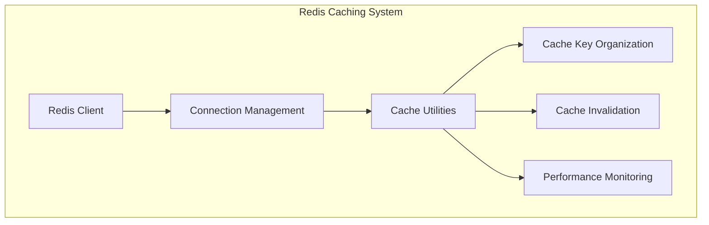
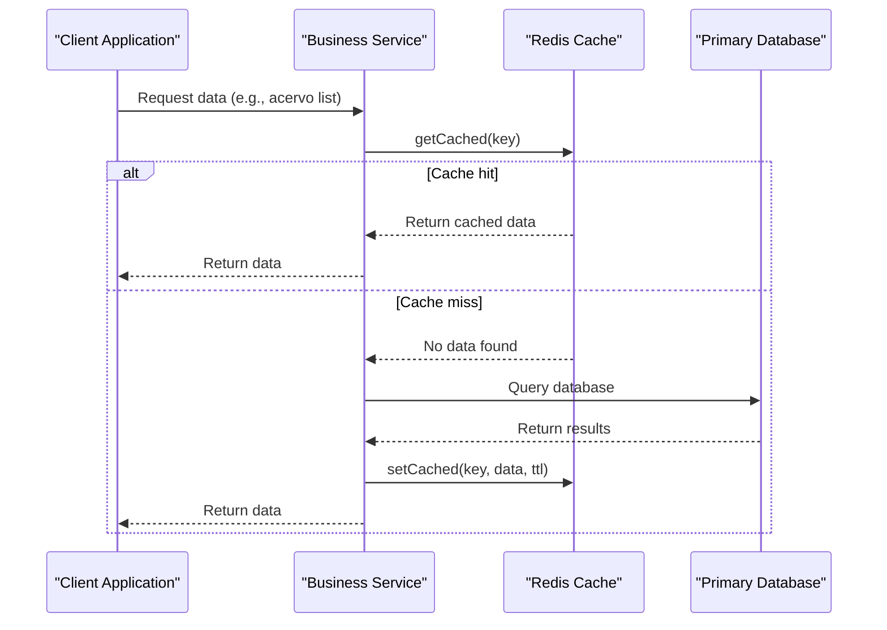

# Caching System

<cite>
**Referenced Files in This Document**   
- [client.ts](file://backend/utils/redis/client.ts)
- [cache-utils.ts](file://backend/utils/redis/cache-utils.ts)
- [cache-keys.ts](file://backend/utils/redis/cache-keys.ts)
- [invalidation.ts](file://backend/utils/redis/invalidation.ts)
- [index.ts](file://backend/utils/redis/index.ts)
- [listar-acervo.service.ts](file://backend/acervo/services/persistence/listar-acervo.service.ts)
- [listar-audiencias.service.ts](file://backend/audiencias/services/persistence/listar-audiencias.service.ts)
- [authorization.ts](file://backend/auth/authorization.ts)
</cite>

## Table of Contents
1. [Introduction](#introduction)
2. [Redis Implementation Overview](#redis-implementation-overview)
3. [Connection Management](#connection-management)
4. [Cache Utility Functions](#cache-utility-functions)
5. [Cache Key Organization](#cache-key-organization)
6. [Expiration Policies](#expiration-policies)
7. [Cache Invalidation Strategies](#cache-invalidation-strategies)
8. [Service Usage Examples](#service-usage-examples)
9. [Cache Consistency with Primary Database](#cache-consistency-with-primary-database)
10. [Common Issues and Solutions](#common-issues-and-solutions)
11. [Performance Monitoring](#performance-monitoring)
12. [Conclusion](#conclusion)

## Introduction

The Sinesys caching system is designed to improve application performance by reducing database load through strategic Redis implementation. This document provides a comprehensive overview of the Redis-based caching infrastructure, focusing on connection management, utility functions, cache invalidation strategies, and practical usage patterns. The system is particularly effective for frequently accessed data such as user permissions and process timelines, where caching significantly reduces response times and database queries. The implementation follows best practices for cache organization, expiration, and consistency maintenance with the primary database.

**Section sources**
- [client.ts](file://backend/utils/redis/client.ts)
- [cache-utils.ts](file://backend/utils/redis/cache-utils.ts)

## Redis Implementation Overview

The Sinesys caching system is built on Redis, implemented through a modular architecture in the `backend/utils/redis/` directory. The system provides a comprehensive set of tools for caching frequently accessed data, with a focus on improving application performance by reducing database load. The implementation includes connection management, cache utilities, key organization, and invalidation strategies that work together to create an efficient caching layer. The system is designed to be easily integrated into various services across the application, particularly for data that is read frequently but updated infrequently, such as user permissions, process timelines, and list data for various entities.

**Diagram sources**
- [client.ts](file://backend/utils/redis/client.ts)
- [cache-utils.ts](file://backend/utils/redis/cache-utils.ts)
- [cache-keys.ts](file://backend/utils/redis/cache-keys.ts)
- [invalidation.ts](file://backend/utils/redis/invalidation.ts)

**Section sources**
- [client.ts](file://backend/utils/redis/client.ts)
- [cache-utils.ts](file://backend/utils/redis/cache-utils.ts)
- [cache-keys.ts](file://backend/utils/redis/cache-keys.ts)
- [invalidation.ts](file://backend/utils/redis/invalidation.ts)

## Connection Management

The Redis connection management is handled through the `client.ts` file, which provides a singleton pattern implementation for the Redis client. The system uses environment variables to configure the Redis connection, including `REDIS_URL` and `REDIS_PASSWORD`, with the password handled separately from the URL for security reasons. The connection is established only when the `ENABLE_REDIS_CACHE` environment variable is set to 'true'. The implementation includes robust error handling and retry mechanisms, with exponential backoff strategy that retries up to three times with increasing delays. Connection events are properly logged, including connect, ready, and close events, providing visibility into the connection state. The client uses ioredis with specific configuration options including maxRetriesPerRequest set to 3 and enableReadyCheck set to false.

**Section sources**
- [client.ts](file://backend/utils/redis/client.ts)

## Cache Utility Functions

The cache utility functions are implemented in `cache-utils.ts` and provide a comprehensive set of operations for interacting with the Redis cache. The core functions include `getCached` for retrieving data, `setCached` for storing data, and `deleteCached` for removing specific keys. The system also includes `deletePattern` for removing multiple keys matching a pattern, which is useful for bulk invalidation. A higher-order function `withCache` is provided to simplify the cache-aside pattern implementation, automatically checking the cache before executing a function and storing the result. The utilities also include `getCacheStats` for monitoring cache performance, extracting key metrics such as memory usage, hit/miss rates, and uptime from Redis INFO command. Document-specific helpers are available for common operations like invalidating document, template, and folder caches.

**Section sources**
- [cache-utils.ts](file://backend/utils/redis/cache-utils.ts)

## Cache Key Organization

The cache key organization follows a consistent pattern using prefixes defined in `CACHE_PREFIXES` constant. Each entity type has its own prefix (e.g., 'pendentes', 'audiencias', 'acervo') which helps in organizing and identifying cache entries. For list queries, keys are generated using `generateCacheKey` function which combines the prefix with serialized parameters, ensuring that different query parameters result in different cache keys. The system uses deterministic serialization by sorting object keys to ensure consistent key generation. For specific entity lookups, direct ID-based keys are used (e.g., `acervo:id:123`). The key organization supports both exact matches and pattern-based operations, enabling efficient cache invalidation strategies. The system also includes specialized key generation functions for different entities in `cache-keys.ts`, which normalize parameters by removing undefined values and sorting keys.

**Section sources**
- [cache-utils.ts](file://backend/utils/redis/cache-utils.ts)
- [cache-keys.ts](file://backend/utils/redis/cache-keys.ts)

## Expiration Policies

The caching system implements multiple expiration policies tailored to different types of data. A default TTL (Time To Live) is configured through the `REDIS_CACHE_TTL` environment variable, with a default value of 600 seconds (10 minutes). Specific entities have custom TTLs based on their update frequency and importance. For example, the acervo service uses a 900-second (15-minute) TTL for list queries, reflecting the relatively stable nature of this data. Document-specific TTLs are defined in `DOCUMENT_CACHE_TTLS` with different durations for different document types: 300 seconds (5 minutes) for individual documents, 60 seconds (1 minute) for document lists (which change more frequently), 600 seconds (10 minutes) for templates, and 300 seconds (5 minutes) for folders. The system allows overriding the default TTL when setting cache entries, providing flexibility for different use cases. The expiration policy balances performance gains with data freshness, ensuring users receive reasonably up-to-date information while minimizing database load.

**Section sources**
- [cache-utils.ts](file://backend/utils/redis/cache-utils.ts)
- [listar-acervo.service.ts](file://backend/acervo/services/persistence/listar-acervo.service.ts)

## Cache Invalidation Strategies

The cache invalidation strategies are implemented in `invalidation.ts` and follow a comprehensive approach to maintain cache consistency. The system provides both entity-specific and bulk invalidation functions. For each major entity type (pendentes, audiencias, acervo, usuarios, clientes, contratos), there are dedicated invalidation functions that remove all cache entries for that entity using pattern matching (e.g., `pendentes:*`). A global `invalidateAllListCaches` function invalidates all list caches in parallel for multiple entities. The `invalidateCacheOnUpdate` function serves as a central entry point that routes to appropriate invalidation logic based on entity type and ID, also removing ID-specific keys. For document-related entities, specialized invalidation functions handle templates, folders, and sharing information. The system uses Redis's `KEYS` command with patterns followed by `DEL` to remove multiple keys, though the code notes that `SCAN` should be considered for production use with large datasets. The invalidation strategy ensures that stale data is removed when underlying data changes, maintaining consistency between cache and database.

**Section sources**
- [invalidation.ts](file://backend/utils/redis/invalidation.ts)

## Service Usage Examples

The caching system is implemented in various services across the application, with clear patterns for usage. In the acervo service, the `listar-acervo.service.ts` file demonstrates the cache-aside pattern: before querying the database, the system checks for cached results using `getCached` with a key generated from query parameters. If found (cache hit), the cached result is returned immediately. If not found (cache miss), the database query is executed, and the result is stored in cache using `setCached` with an appropriate TTL before being returned. The same pattern is used in the audiencias service. For user permissions, a separate in-memory cache is used in `authorization.ts` with a TTL-based invalidation strategy, where permissions are cached for a period and expired entries are cleaned periodically. These implementations show how the caching utilities are integrated into service layers to reduce database load for frequently accessed data like user permissions and process timelines.

**Diagram sources**
- [listar-acervo.service.ts](file://backend/acervo/services/persistence/listar-acervo.service.ts)
- [listar-audiencias.service.ts](file://backend/audiencias/services/persistence/listar-audiencias.service.ts)

**Section sources**
- [listar-acervo.service.ts](file://backend/acervo/services/persistence/listar-acervo.service.ts)
- [listar-audiencias.service.ts](file://backend/audiencias/services/persistence/listar-audiencias.service.ts)
- [authorization.ts](file://backend/auth/authorization.ts)

## Cache Consistency with Primary Database

Cache consistency with the primary database is maintained through a combination of expiration policies and proactive invalidation strategies. The system uses time-based expiration as the primary mechanism, ensuring that even if invalidation fails, stale data will eventually be removed from the cache. For immediate consistency, the system implements write-through invalidation patterns where cache entries are invalidated when corresponding database records are updated. The `invalidateCacheOnUpdate` function is called from various service layers when entities are modified, ensuring that affected cache entries are removed. For list queries that might be affected by individual record changes, the system invalidates entire list caches rather than trying to update individual entries, which is more reliable and simpler to implement. The acervo and audiencias services demonstrate this approach by invalidating their entire list caches when individual records are modified. This strategy prioritizes data consistency over cache efficiency, ensuring users always see up-to-date information after modifications.

**Section sources**
- [invalidation.ts](file://backend/utils/redis/invalidation.ts)
- [listar-acervo.service.ts](file://backend/acervo/services/persistence/listar-acervo.service.ts)

## Common Issues and Solutions

The caching system addresses several common issues in distributed caching. Cache stampede (thundering herd) is mitigated through the use of reasonable TTL values and the cache-aside pattern, where the first request after expiration bears the database load while subsequent requests can use the newly cached data. The system avoids infinite loops by handling Redis unavailability gracefully, with functions returning null or bypassing cache operations when Redis is not available. Memory management is addressed through the use of pattern-based deletion for bulk invalidation and the inherent TTL mechanism that automatically removes expired entries. The implementation acknowledges the potential performance issue with the `KEYS` command in `deletePattern` and notes that `SCAN` should be considered for production use with large datasets. Error handling is comprehensive, with warnings logged for cache operation failures but without failing the entire request, ensuring application resilience when the cache layer has issues.

**Section sources**
- [cache-utils.ts](file://backend/utils/redis/cache-utils.ts)
- [invalidation.ts](file://backend/utils/redis/invalidation.ts)

## Performance Monitoring

Performance monitoring of the caching layer is implemented through the `getCacheStats` function in `cache-utils.ts`, which retrieves key metrics from Redis using the INFO command. The function extracts and returns important statistics including memory usage (`used_memory`), connection metrics (`total_connections_received`), performance indicators (`keyspace_hits`, `keyspace_misses`), and server uptime (`uptime_in_seconds`). These metrics provide visibility into cache efficiency, with hit/miss ratios indicating how effectively the cache is reducing database load. The system also includes debug logging for cache hits and misses, with messages like "Cache hit for listarAcervo" or "Cache miss for listarAudiencias" that help in understanding cache behavior during development and troubleshooting. An API endpoint at `/api/cache/stats` exposes these statistics, allowing for external monitoring and alerting. The combination of real-time metrics and operational logging enables effective performance analysis and optimization of the caching layer.

**Section sources**
- [cache-utils.ts](file://backend/utils/redis/cache-utils.ts)
- [app/api/cache/stats/route.ts](file://app/api/cache/stats/route.ts)