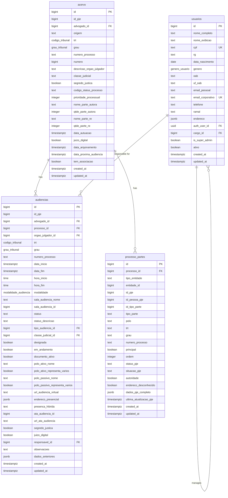
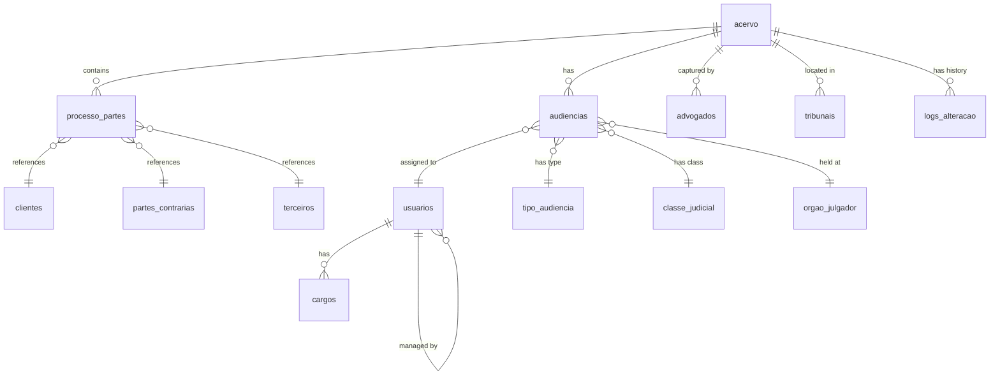
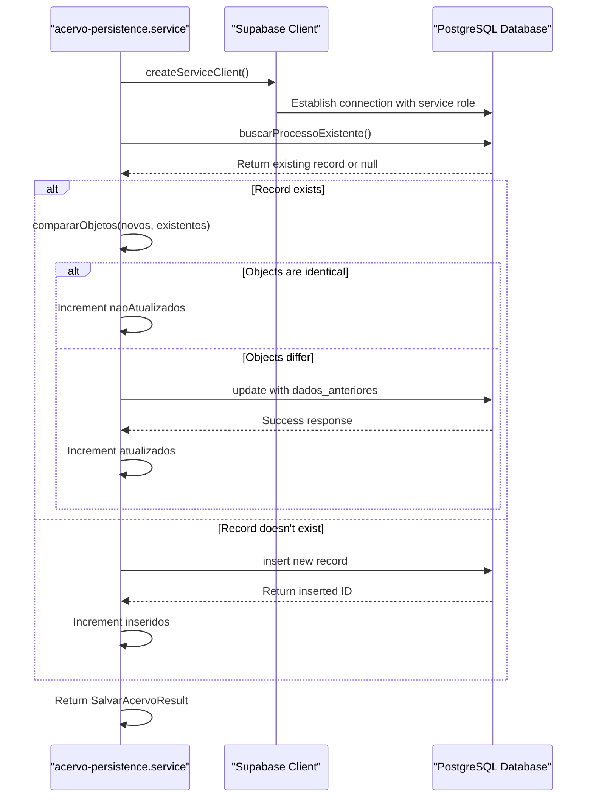
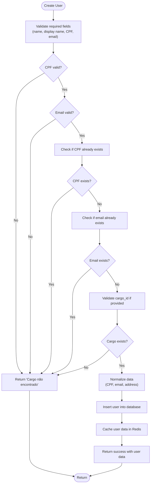
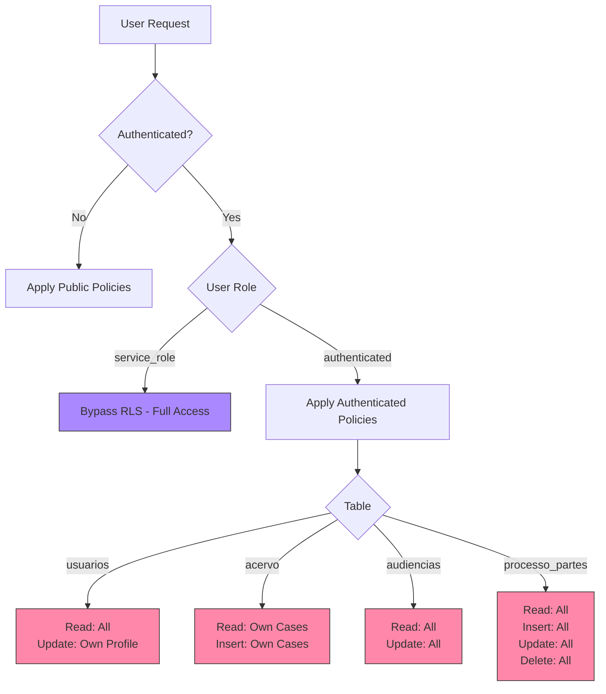
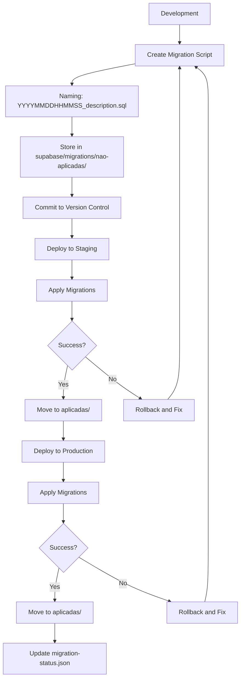
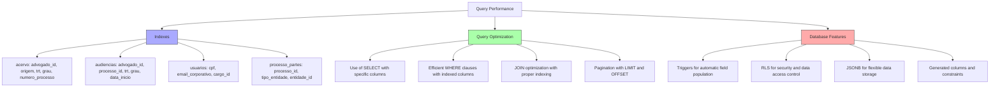

# Database Persistence

<cite>
**Referenced Files in This Document**   
- [04_acervo.sql](file://supabase/schemas/04_acervo.sql)
- [07_audiencias.sql](file://supabase/schemas/07_audiencias.sql)
- [08_usuarios.sql](file://supabase/schemas/08_usuarios.sql)
- [17_processo_partes.sql](file://supabase/schemas/17_processo_partes.sql)
- [00_permissions.sql](file://supabase/schemas/00_permissions.sql)
- [01_enums.sql](file://supabase/schemas/01_enums.sql)
- [acervo-persistence.service.ts](file://backend/captura/services/persistence/acervo-persistence.service.ts)
- [usuario-persistence.service.ts](file://backend/usuarios/services/persistence/usuario-persistence.service.ts)
- [service-client.ts](file://backend/utils/supabase/service-client.ts)
- [client.ts](file://lib/client.ts)
- [migrations](file://supabase/migrations/)
</cite>

## Table of Contents
1. [Introduction](#introduction)
2. [Core Data Model](#core-data-model)
3. [Entity Relationships](#entity-relationships)
4. [CRUD Operations Implementation](#crud-operations-implementation)
5. [Supabase Client and Service Architecture](#supabase-client-and-service-architecture)
6. [Row Level Security (RLS) Policies](#row-level-security-rls-policies)
7. [Migration Strategy](#migration-strategy)
8. [Performance Optimization](#performance-optimization)
9. [Conclusion](#conclusion)

## Introduction

The Sinesys database persistence system is built on Supabase, a PostgreSQL-based platform that provides a comprehensive suite of database management tools. This documentation details the PostgreSQL schema design, CRUD operations implementation, migration strategy, Row Level Security (RLS) policies, and performance optimization techniques used in the system. The core tables include acervo (legal cases), audiencias (hearings), usuarios (users), and processos (processes), with a sophisticated relationship model that supports the legal workflow requirements of the application.

The system leverages Supabase's capabilities to provide a robust, secure, and scalable database layer that integrates seamlessly with the application's business logic. The architecture emphasizes data integrity, security, and performance, with careful attention to indexing, query optimization, and access control.

**Section sources**
- [04_acervo.sql](file://supabase/schemas/04_acervo.sql)
- [07_audiencias.sql](file://supabase/schemas/07_audiencias.sql)
- [08_usuarios.sql](file://supabase/schemas/08_usuarios.sql)

## Core Data Model

The Sinesys database schema is designed to support the complex requirements of legal case management, with a focus on capturing and organizing information about legal cases, hearings, users, and related entities. The core tables are defined in SQL schema files within the supabase/schemas directory, with each file responsible for creating specific tables and associated database objects.

The acervo table serves as the central repository for legal cases, storing comprehensive information about each case including its status, parties involved, and procedural details. The table is designed with a composite unique constraint on (id_pje, trt, grau, numero_processo) to ensure that each process is uniquely identified across different courts and instances, while allowing multiple lawyers to access the same case without duplication.



**Diagram sources**
- [04_acervo.sql](file://supabase/schemas/04_acervo.sql)
- [07_audiencias.sql](file://supabase/schemas/07_audiencias.sql)
- [08_usuarios.sql](file://supabase/schemas/08_usuarios.sql)
- [17_processo_partes.sql](file://supabase/schemas/17_processo_partes.sql)

The audiencias table stores information about scheduled hearings, with a design that supports both virtual and in-person hearings. The table includes a sophisticated trigger function (populate_modalidade_audiencia) that automatically determines the hearing modality based on the presence of a virtual meeting URL, physical address, or hearing type description. This ensures data consistency and reduces the need for manual data entry.

The usuarios table represents system users (law firm employees and collaborators), storing both personal and professional information. The table includes comprehensive indexing for efficient querying by CPF, corporate email, and other key attributes. It also implements RLS policies that control access based on user authentication and role.

**Section sources**
- [04_acervo.sql](file://supabase/schemas/04_acervo.sql)
- [07_audiencias.sql](file://supabase/schemas/07_audiencias.sql)
- [08_usuarios.sql](file://supabase/schemas/08_usuarios.sql)
- [17_processo_partes.sql](file://supabase/schemas/17_processo_partes.sql)

## Entity Relationships

The Sinesys database implements a sophisticated relationship model that connects legal cases with their associated entities, including parties, hearings, and users. The core relationship is established through the processo_partes table, which serves as a junction table for the many-to-many relationship between processes (acervo) and parties (clients, opposing parties, third parties).

The processo_partes table uses a polymorphic foreign key design, with tipo_entidade indicating the type of entity (cliente, parte_contraria, or terceiro) and entidade_id referencing the specific entity in its respective table. This flexible design allows the system to associate any type of party with a legal process while maintaining referential integrity.



**Diagram sources**
- [17_processo_partes.sql](file://supabase/schemas/17_processo_partes.sql)
- [04_acervo.sql](file://supabase/schemas/04_acervo.sql)
- [07_audiencias.sql](file://supabase/schemas/07_audiencias.sql)
- [08_usuarios.sql](file://supabase/schemas/08_usuarios.sql)

The relationship between processes and hearings is straightforward, with the audiencias table containing a foreign key (processo_id) that references the acervo table. This allows the system to efficiently retrieve all hearings associated with a specific legal case. The audiencias table also includes redundant data (trt, grau, numero_processo) to support efficient querying without requiring joins in common use cases.

User relationships are implemented through the responsavel_id field in the audiencias table, which references the usuarios table. This allows the system to assign responsibility for specific hearings to individual users, with all changes tracked through the logs_alteracao system. The usuarios table also supports hierarchical relationships through the cargo_id field, which references the cargos table to establish organizational structure.

**Section sources**
- [17_processo_partes.sql](file://supabase/schemas/17_processo_partes.sql)
- [04_acervo.sql](file://supabase/schemas/04_acervo.sql)
- [07_audiencias.sql](file://supabase/schemas/07_audiencias.sql)

## CRUD Operations Implementation

The Sinesys system implements CRUD operations through dedicated persistence services in the backend directory. These services abstract database interactions and provide a clean interface for business logic components to interact with the database. The services are designed to handle complex operations such as data comparison, change tracking, and error handling.

The acervo-persistence.service.ts file implements operations for managing legal cases in the acervo table. The salvarAcervo function is a sophisticated implementation that compares incoming data with existing records before performing updates, avoiding unnecessary database writes when data hasn't changed. This optimization reduces database load and improves performance, especially during bulk operations.



**Diagram sources**
- [acervo-persistence.service.ts](file://backend/captura/services/persistence/acervo-persistence.service.ts)
- [service-client.ts](file://backend/utils/supabase/service-client.ts)

The usuario-persistence.service.ts file implements comprehensive CRUD operations for user management, including creation, updating, retrieval, and listing of users. The service includes extensive validation logic to ensure data integrity, such as CPF format validation, email format validation, and uniqueness constraints for CPF and corporate email.

The service also implements caching using Redis to improve performance for frequently accessed data. The buscarUsuarioPorId, buscarUsuarioPorCpf, and buscarUsuarioPorEmail functions all check the cache before querying the database, reducing database load and improving response times. Cache invalidation is handled automatically when users are updated or deleted.



**Diagram sources**
- [usuario-persistence.service.ts](file://backend/usuarios/services/persistence/usuario-persistence.service.ts)
- [service-client.ts](file://backend/utils/supabase/service-client.ts)

Both services use the createServiceClient function to establish a connection to Supabase with service role privileges, bypassing RLS policies for administrative operations. This allows the services to perform operations that would be restricted for regular users, such as bulk updates and system-level data management.

**Section sources**
- [acervo-persistence.service.ts](file://backend/captura/services/persistence/acervo-persistence.service.ts)
- [usuario-persistence.service.ts](file://backend/usuarios/services/persistence/usuario-persistence.service.ts)
- [service-client.ts](file://backend/utils/supabase/service-client.ts)

## Supabase Client and Service Architecture

The Sinesys system implements a sophisticated Supabase client architecture that separates concerns between frontend and backend database access. The architecture uses different client configurations for different contexts, ensuring appropriate security and performance characteristics for each use case.

For backend services, the system uses a service client created by createServiceClient in backend/utils/supabase/service-client.ts. This client uses the Supabase secret key (or legacy service role key) to authenticate with administrative privileges, bypassing RLS policies. The client is configured with autoRefreshToken and persistSession disabled, as it is intended for server-side operations rather than user sessions.

```mermaid
classDiagram
class SupabaseClient {
+createClient(url, key, options) SupabaseClient
}
class ServiceClient {
+createServiceClient() SupabaseClient
-getSupabaseConfig() Config
}
class FrontendClient {
+createClient() SupabaseClient
}
class PersistenceService {
+salvarAcervo(params) Promise~SalvarAcervoResult~
+criarUsuario(params) Promise~OperacaoUsuarioResult~
+atualizarUsuario(id, params) Promise~OperacaoUsuarioResult~
+buscarUsuarioPorId(id) Promise~Usuario | null~
+buscarUsuarioPorCpf(cpf) Promise~Usuario | null~
+buscarUsuarioPorEmail(email) Promise~Usuario | null~
+listarUsuarios(params) Promise~ListarUsuariosResult~
}
SupabaseClient <|-- ServiceClient
SupabaseClient <|-- FrontendClient
ServiceClient --> PersistenceService
FrontendClient --> "API Routes" : uses
PersistenceService --> "Database" : interacts with
note right of ServiceClient
Uses secret key for administrative
access, bypasses RLS policies
end note
note right of FrontendClient
Uses publishable key for
authenticated user access
end note
```

**Diagram sources**
- [service-client.ts](file://backend/utils/supabase/service-client.ts)
- [client.ts](file://lib/client.ts)
- [acervo-persistence.service.ts](file://backend/captura/services/persistence/acervo-persistence.service.ts)
- [usuario-persistence.service.ts](file://backend/usuarios/services/persistence/usuario-persistence.service.ts)

For frontend access, the system uses a different client configuration created by createClient in lib/client.ts. This client uses the publishable (anon) key and is configured for browser use, with session persistence enabled. The frontend client respects RLS policies and is used by authenticated users to access data they are authorized to view.

The persistence services in the backend directory use the service client to perform database operations, abstracting the complexity of direct database access from the business logic. This separation of concerns allows the system to maintain a clean architecture where business logic is decoupled from data access concerns.

**Section sources**
- [service-client.ts](file://backend/utils/supabase/service-client.ts)
- [client.ts](file://lib/client.ts)
- [acervo-persistence.service.ts](file://backend/captura/services/persistence/acervo-persistence.service.ts)
- [usuario-persistence.service.ts](file://backend/usuarios/services/persistence/usuario-persistence.service.ts)

## Row Level Security (RLS) Policies

The Sinesys database implements a comprehensive Row Level Security (RLS) system to control data access based on user roles and authentication status. RLS policies are defined directly in the SQL schema files and are enforced by PostgreSQL at the database level, providing a robust security layer that cannot be bypassed by application logic.

The RLS system is initialized in 00_permissions.sql, which grants the service_role full access to all tables and sequences in the public schema. This allows backend services to bypass RLS policies for administrative operations while ensuring that regular users are subject to access controls.



**Diagram sources**
- [00_permissions.sql](file://supabase/schemas/00_permissions.sql)
- [08_usuarios.sql](file://supabase/schemas/08_usuarios.sql)
- [04_acervo.sql](file://supabase/schemas/04_acervo.sql)
- [07_audiencias.sql](file://supabase/schemas/07_audiencias.sql)
- [17_processo_partes.sql](file://supabase/schemas/17_processo_partes.sql)

The usuarios table implements three RLS policies:
1. "Service role tem acesso total a usuarios" - Grants full access to the service_role, allowing backend services to manage user records.
2. "Usuários autenticados podem ler usuarios" - Allows authenticated users to read all user records, supporting user directory functionality.
3. "Usuários podem atualizar seu próprio perfil" - Allows users to update their own profile information, with a security check ensuring they can only modify their own record.

The acervo and audiencias tables have RLS enabled but do not define specific policies in their schema files, relying on policies defined elsewhere in the system. This suggests a modular approach to security policy management, where core tables enable RLS while policy definitions are centralized or defined in separate migration files.

The processo_partes table implements a comprehensive set of RLS policies that allow authenticated users to perform all operations (select, insert, update, delete) while restricting access based on authentication status. The service_role has full access to bypass these policies for administrative operations.

**Section sources**
- [00_permissions.sql](file://supabase/schemas/00_permissions.sql)
- [08_usuarios.sql](file://supabase/schemas/08_usuarios.sql)
- [04_acervo.sql](file://supabase/schemas/04_acervo.sql)
- [07_audiencias.sql](file://supabase/schemas/07_audiencias.sql)
- [17_processo_partes.sql](file://supabase/schemas/17_processo_partes.sql)

## Migration Strategy

The Sinesys system uses a structured migration strategy to manage database schema changes over time. Migrations are stored in the supabase/migrations directory, with a clear naming convention that includes timestamps to ensure proper ordering. The migration files are SQL scripts that modify the database schema, with applied migrations stored in the aplicadas subdirectory and pending migrations in the nao-aplicadas subdirectory.

The migration system follows a versioned approach, with each migration file named using the format YYYYMMDDHHMMSS_description.sql. This timestamp-based naming ensures that migrations are applied in the correct order, regardless of when they were created. The system appears to use Supabase's built-in migration tools to apply these scripts to the database.



**Diagram sources**
- [migrations](file://supabase/migrations/)

The migration history shows a systematic approach to database evolution, with migrations covering a wide range of changes:
- Table creation (e.g., 20250118115831_create_agendamentos.sql)
- Schema modifications (e.g., 20250120000002_fix_audiencias_schema.sql)
- Policy updates (e.g., 20250120000001_fix_rls_policies_granular_permissions.sql)
- Data model enhancements (e.g., 20251126185956_refactor_audiencias_add_modalidade_and_horarios.sql)
- System integrations (e.g., 20251204140000_add_comunica_cnj_integration.sql)

The system also includes utility scripts in the scripts/database directory for managing migrations, such as apply-migrations-via-supabase-sdk.ts for applying migrations programmatically and check-applied-migrations.ts for verifying migration status. This suggests a comprehensive approach to migration management that supports both automated and manual processes.

The migration strategy emphasizes backward compatibility and data integrity, with many migrations including data migration logic to transform existing data to fit new schema requirements. For example, migrations related to the audiencias table show a progression of schema improvements, with earlier migrations creating the basic structure and later migrations adding fields for modality, horários, and other attributes.

**Section sources**
- [migrations](file://supabase/migrations/)
- [apply-migrations-via-supabase-sdk.ts](file://scripts/database/apply-migrations-via-supabase-sdk.ts)
- [check-applied-migrations.ts](file://scripts/database/check-applied-migrations.ts)

## Performance Optimization

The Sinesys database implements several performance optimization techniques to ensure efficient query execution and responsive application performance. These optimizations include comprehensive indexing, efficient query patterns, and strategic use of database features like triggers and materialized views.

The core tables include multiple indexes designed to support common query patterns. For example, the acervo table has indexes on advogado_id, origem, trt, grau, and numero_processo, enabling efficient filtering by lawyer, origin, court, instance, and process number. Composite indexes like idx_acervo_advogado_trt_grau and idx_acervo_numero_processo_trt_grau support queries that filter by multiple attributes simultaneously.



**Diagram sources**
- [04_acervo.sql](file://supabase/schemas/04_acervo.sql)
- [07_audiencias.sql](file://supabase/schemas/07_audiencias.sql)
- [08_usuarios.sql](file://supabase/schemas/08_usuarios.sql)
- [17_processo_partes.sql](file://supabase/schemas/17_processo_partes.sql)

The audiencias table includes indexes on responsavel_id and data_inicio, supporting queries that find hearings assigned to specific users or scheduled within a particular time period. The usuarios table includes specialized indexes such as idx_usuarios_oab on (oab, uf_oab) for searching by OAB number and idx_usuarios_endereco using GIN for efficient querying of JSONB address data.

The system also uses database features like triggers to optimize data management. For example, the audiencias table has a trigger (trigger_set_modalidade_audiencia) that automatically populates the modalidade field based on other attributes, reducing the need for application-level logic and ensuring data consistency.

Query optimization is further enhanced by the use of appropriate data types and constraints. The schema uses generated identity columns for primary keys, enum types for fields with a fixed set of values, and proper foreign key constraints to maintain referential integrity. These design choices contribute to query optimization by providing the database optimizer with more information about data relationships and constraints.

**Section sources**
- [04_acervo.sql](file://supabase/schemas/04_acervo.sql)
- [07_audiencias.sql](file://supabase/schemas/07_audiencias.sql)
- [08_usuarios.sql](file://supabase/schemas/08_usuarios.sql)
- [17_processo_partes.sql](file://supabase/schemas/17_processo_partes.sql)

## Conclusion

The Sinesys database persistence system demonstrates a well-architected approach to managing legal case data with Supabase and PostgreSQL. The system combines a robust data model with sophisticated CRUD operations, comprehensive security policies, and performance optimizations to create a reliable and scalable foundation for the application.

Key strengths of the system include:
- A flexible data model that supports complex legal workflows through polymorphic relationships and comprehensive entity tracking
- Efficient CRUD operations that minimize unnecessary database writes through data comparison
- A layered security model using Row Level Security to control data access based on user roles
- A systematic migration strategy that enables safe and reliable schema evolution
- Performance optimizations through strategic indexing and query patterns

The architecture effectively separates concerns between the database layer, persistence services, and business logic, creating a maintainable and extensible system. The use of Supabase features like RLS, real-time subscriptions, and authentication integration provides a solid foundation for building a secure and responsive legal case management application.

Future enhancements could include more sophisticated caching strategies, advanced query optimization through query planning analysis, and expanded use of PostgreSQL features like partitioning for large tables. However, the current implementation provides a strong foundation that meets the core requirements of the application.