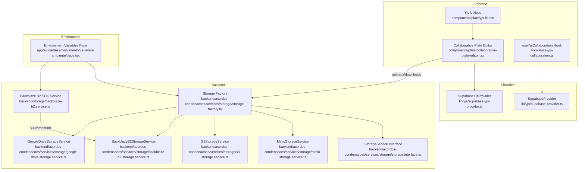
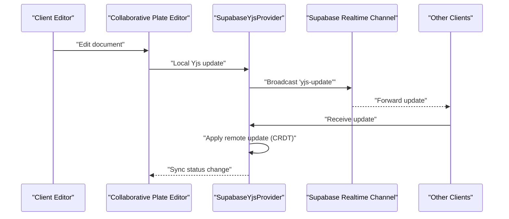
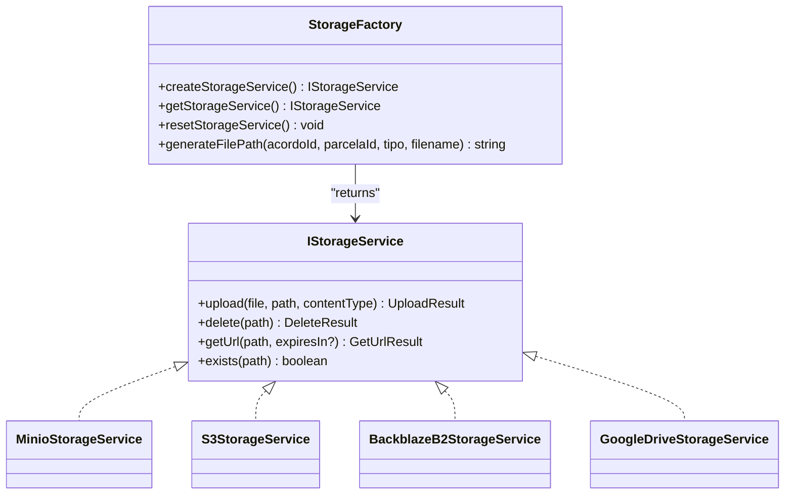
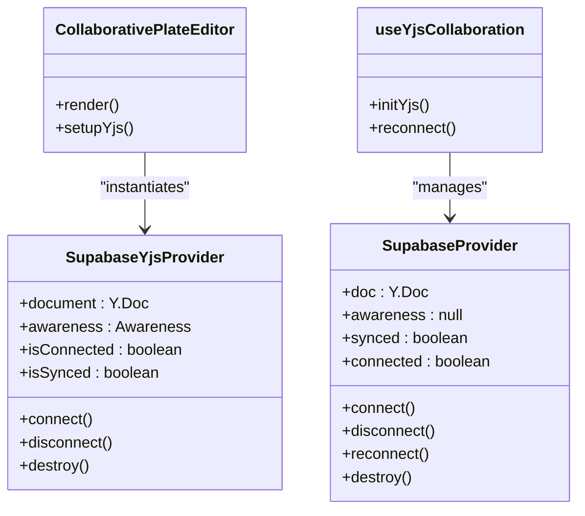
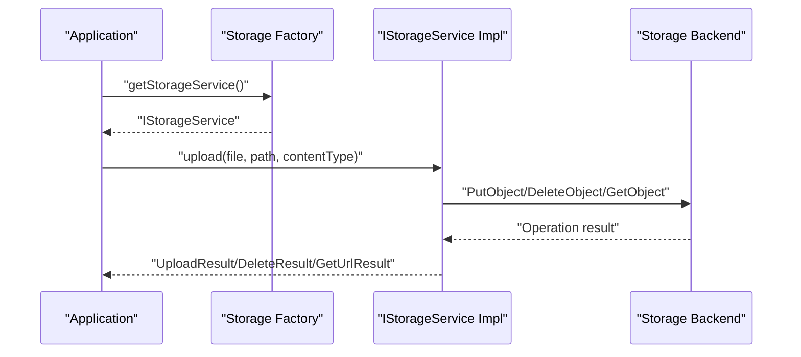
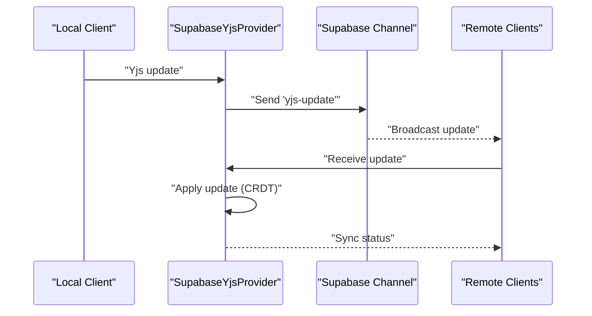
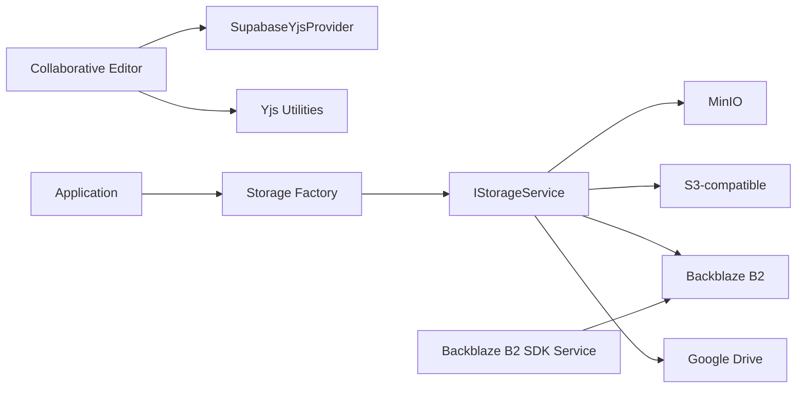

# External Integrations

<cite>
**Referenced Files in This Document**
- [storage-factory.ts](file://backend/acordos-condenacoes/services/storage/storage-factory.ts)
- [storage.interface.ts](file://backend/acordos-condenacoes/services/storage/storage.interface.ts)
- [minio-storage.service.ts](file://backend/acordos-condenacoes/services/storage/minio-storage.service.ts)
- [s3-storage.service.ts](file://backend/acordos-condenacoes/services/storage/s3-storage.service.ts)
- [backblaze-b2-storage.service.ts](file://backend/acordos-condenacoes/services/storage/backblaze-b2-storage.service.ts)
- [google-drive-storage.service.ts](file://backend/acordos-condenacoes/services/storage/google-drive-storage.service.ts)
- [backblaze-b2.service.ts](file://backend/storage/backblaze-b2.service.ts)
- [yjs-kit.tsx](file://components/plate/yjs-kit.tsx)
- [collaborative-plate-editor.tsx](file://components/plate/collaborative-plate-editor.tsx)
- [use-yjs-collaboration.ts](file://hooks/use-yjs-collaboration.ts)
- [supabase-provider.ts](file://lib/yjs/supabase-provider.ts)
- [supabase-yjs-provider.ts](file://lib/yjs/supabase-yjs-provider.ts)
- [retry/index.ts](file://backend/utils/retry/index.ts)
- [variaveis-ambiente/page.tsx](file://app/ajuda/desenvolvimento/variaveis-ambiente/page.tsx)
</cite>

## Table of Contents
1. [Introduction](#introduction)
2. [Project Structure](#project-structure)
3. [Core Components](#core-components)
4. [Architecture Overview](#architecture-overview)
5. [Detailed Component Analysis](#detailed-component-analysis)
6. [Dependency Analysis](#dependency-analysis)
7. [Performance Considerations](#performance-considerations)
8. [Troubleshooting Guide](#troubleshooting-guide)
9. [Conclusion](#conclusion)

## Introduction
This document explains how Sinesys integrates with external systems for storage and real-time collaboration. It focuses on:
- How the storage subsystem abstracts multiple backends (MinIO, S3-compatible, Backblaze B2, Google Drive) via a unified interface and factory.
- How real-time collaboration is implemented using Yjs with Supabase Realtime as transport, enabling collaborative editing across clients.
- Data flow, authentication, protocols, error handling, and fallback strategies for reliability.

## Project Structure
The integration spans backend services, shared storage abstractions, frontend collaboration utilities, and Supabase-based Yjs providers.

**Diagram sources**
- [collaborative-plate-editor.tsx](file://components/plate/collaborative-plate-editor.tsx#L1-L220)
- [use-yjs-collaboration.ts](file://hooks/use-yjs-collaboration.ts#L1-L201)
- [yjs-kit.tsx](file://components/plate/yjs-kit.tsx#L1-L46)
- [supabase-provider.ts](file://lib/yjs/supabase-provider.ts#L1-L251)
- [supabase-yjs-provider.ts](file://lib/yjs/supabase-yjs-provider.ts#L1-L358)
- [storage-factory.ts](file://backend/acordos-condenacoes/services/storage/storage-factory.ts#L1-L90)
- [storage.interface.ts](file://backend/acordos-condenacoes/services/storage/storage.interface.ts#L1-L91)
- [minio-storage.service.ts](file://backend/acordos-condenacoes/services/storage/minio-storage.service.ts#L1-L195)
- [s3-storage.service.ts](file://backend/acordos-condenacoes/services/storage/s3-storage.service.ts#L1-L39)
- [backblaze-b2-storage.service.ts](file://backend/acordos-condenacoes/services/storage/backblaze-b2-storage.service.ts#L1-L174)
- [google-drive-storage.service.ts](file://backend/acordos-condenacoes/services/storage/google-drive-storage.service.ts#L1-L195)
- [backblaze-b2.service.ts](file://backend/storage/backblaze-b2.service.ts#L1-L195)
- [variaveis-ambiente/page.tsx](file://app/ajuda/desenvolvimento/variaveis-ambiente/page.tsx#L1-L322)

**Section sources**
- [storage-factory.ts](file://backend/acordos-condenacoes/services/storage/storage-factory.ts#L1-L90)
- [storage.interface.ts](file://backend/acordos-condenacoes/services/storage/storage.interface.ts#L1-L91)
- [collaborative-plate-editor.tsx](file://components/plate/collaborative-plate-editor.tsx#L1-L220)
- [supabase-provider.ts](file://lib/yjs/supabase-provider.ts#L1-L251)
- [supabase-yjs-provider.ts](file://lib/yjs/supabase-yjs-provider.ts#L1-L358)
- [variaveis-ambiente/page.tsx](file://app/ajuda/desenvolvimento/variaveis-ambiente/page.tsx#L1-L322)

## Core Components
- Storage Factory and Interface
  - The factory selects a storage backend based on environment variables and returns a singleton implementing a shared interface.
  - The interface defines upload, delete, getUrl, and exists operations with consistent result shapes.

- Storage Implementations
  - MinIO: S3-compatible client wrapper with bucket creation and presigned URLs.
  - S3-compatible: Uses AWS SDK v3 to upload/delete/getUrl and check existence.
  - Backblaze B2: Dedicated service using S3-compatible API with presigned URL generation.
  - Google Drive: Uses a webhook (n8n) to perform upload/delete/getUrl/exists operations.

- Real-time Collaboration (Yjs + Supabase)
  - Frontend editors integrate Yjs with Plate.js and use Supabase channels to broadcast incremental updates.
  - Providers encapsulate connection, sync requests, and awareness updates.

**Section sources**
- [storage-factory.ts](file://backend/acordos-condenacoes/services/storage/storage-factory.ts#L1-L90)
- [storage.interface.ts](file://backend/acordos-condenacoes/services/storage/storage.interface.ts#L1-L91)
- [minio-storage.service.ts](file://backend/acordos-condenacoes/services/storage/minio-storage.service.ts#L1-L195)
- [s3-storage.service.ts](file://backend/acordos-condenacoes/services/storage/s3-storage.service.ts#L1-L39)
- [backblaze-b2-storage.service.ts](file://backend/acordos-condenacoes/services/storage/backblaze-b2-storage.service.ts#L1-L174)
- [google-drive-storage.service.ts](file://backend/acordos-condenacoes/services/storage/google-drive-storage.service.ts#L1-L195)
- [collaborative-plate-editor.tsx](file://components/plate/collaborative-plate-editor.tsx#L1-L220)
- [supabase-provider.ts](file://lib/yjs/supabase-provider.ts#L1-L251)
- [supabase-yjs-provider.ts](file://lib/yjs/supabase-yjs-provider.ts#L1-L358)

## Architecture Overview
The system separates concerns:
- Application logic interacts with the storage factory to upload/download files without binding to a specific provider.
- Real-time collaboration uses Yjs with CRDT semantics and Supabase Realtime channels for transport.
- Environment variables configure providers and credentials.

**Diagram sources**
- [collaborative-plate-editor.tsx](file://components/plate/collaborative-plate-editor.tsx#L88-L151)
- [supabase-yjs-provider.ts](file://lib/yjs/supabase-yjs-provider.ts#L131-L191)
- [supabase-yjs-provider.ts](file://lib/yjs/supabase-yjs-provider.ts#L221-L238)
- [supabase-yjs-provider.ts](file://lib/yjs/supabase-yjs-provider.ts#L240-L250)
- [supabase-yjs-provider.ts](file://lib/yjs/supabase-yjs-provider.ts#L253-L271)
- [supabase-yjs-provider.ts](file://lib/yjs/supabase-yjs-provider.ts#L273-L289)
- [supabase-yjs-provider.ts](file://lib/yjs/supabase-yjs-provider.ts#L291-L306)

## Detailed Component Analysis

### Storage Factory and Interface
- Purpose: Centralized selection of storage backend and singleton access.
- Behavior:
  - Reads STORAGE_PROVIDER from environment and instantiates the appropriate service.
  - Provides a singleton instance and a reset function for testing.
  - Generates file paths for uploads.

**Diagram sources**
- [storage-factory.ts](file://backend/acordos-condenacoes/services/storage/storage-factory.ts#L1-L90)
- [storage.interface.ts](file://backend/acordos-condenacoes/services/storage/storage.interface.ts#L1-L91)
- [minio-storage.service.ts](file://backend/acordos-condenacoes/services/storage/minio-storage.service.ts#L1-L195)
- [s3-storage.service.ts](file://backend/acordos-condenacoes/services/storage/s3-storage.service.ts#L1-L39)
- [backblaze-b2-storage.service.ts](file://backend/acordos-condenacoes/services/storage/backblaze-b2-storage.service.ts#L1-L174)
- [google-drive-storage.service.ts](file://backend/acordos-condenacoes/services/storage/google-drive-storage.service.ts#L1-L195)

**Section sources**
- [storage-factory.ts](file://backend/acordos-condenacoes/services/storage/storage-factory.ts#L1-L90)
- [storage.interface.ts](file://backend/acordos-condenacoes/services/storage/storage.interface.ts#L1-L91)

### Storage Implementations

#### MinIO Implementation
- Uses an S3-compatible client to upload, delete, and generate presigned URLs.
- Ensures bucket exists and handles missing credentials gracefully with structured results.

**Section sources**
- [minio-storage.service.ts](file://backend/acordos-condenacoes/services/storage/minio-storage.service.ts#L1-L195)

#### S3-Compatible Implementation
- Reads environment variables for endpoint, region, bucket, keys, and optional SSL/port.
- Implements upload, delete, getUrl, and exists using AWS SDK v3 commands.

**Section sources**
- [s3-storage.service.ts](file://backend/acordos-condenacoes/services/storage/s3-storage.service.ts#L1-L39)

#### Backblaze B2 Implementation
- Initializes S3Client with B2 endpoint and credentials.
- Supports upload, delete, getUrl, and exists; includes presigned URL generation utility in a separate backend service.

**Section sources**
- [backblaze-b2-storage.service.ts](file://backend/acordos-condenacoes/services/storage/backblaze-b2-storage.service.ts#L1-L174)
- [backblaze-b2.service.ts](file://backend/storage/backblaze-b2.service.ts#L1-L195)

#### Google Drive Implementation
- Relies on a webhook (n8n) to perform operations.
- Converts streams to base64 for upload; returns standardized results.

**Section sources**
- [google-drive-storage.service.ts](file://backend/acordos-condenacoes/services/storage/google-drive-storage.service.ts#L1-L195)

### Real-time Collaboration with Yjs and Supabase

#### Provider Classes
- SupabaseProvider: Minimal provider for general Yjs usage with Realtime broadcast events.
- SupabaseYjsProvider: Full-featured provider for Plate.js integration, including awareness and cursor support.

**Diagram sources**
- [supabase-provider.ts](file://lib/yjs/supabase-provider.ts#L1-L251)
- [supabase-yjs-provider.ts](file://lib/yjs/supabase-yjs-provider.ts#L1-L358)
- [collaborative-plate-editor.tsx](file://components/plate/collaborative-plate-editor.tsx#L88-L151)
- [use-yjs-collaboration.ts](file://hooks/use-yjs-collaboration.ts#L66-L162)

#### Editor Integration
- The collaborative editor sets up Yjs, attaches the provider, and enables cursors and awareness.
- It connects to the provider after plugin configuration.

**Section sources**
- [collaborative-plate-editor.tsx](file://components/plate/collaborative-plate-editor.tsx#L88-L151)
- [yjs-kit.tsx](file://components/plate/yjs-kit.tsx#L1-L46)

#### Hook for Collaboration
- The hook initializes Yjs, optionally persists to IndexedDB, creates a provider, and exposes connection/sync state and error handling.

**Section sources**
- [use-yjs-collaboration.ts](file://hooks/use-yjs-collaboration.ts#L1-L201)

### Data Flow and Protocols

#### Storage Data Flow
- Application code calls the storage factory to get a configured service.
- The service performs the operation against the selected backend and returns a standardized result.

**Diagram sources**
- [storage-factory.ts](file://backend/acordos-condenacoes/services/storage/storage-factory.ts#L58-L63)
- [storage.interface.ts](file://backend/acordos-condenacoes/services/storage/storage.interface.ts#L1-L91)
- [minio-storage.service.ts](file://backend/acordos-condenacoes/services/storage/minio-storage.service.ts#L77-L118)
- [s3-storage.service.ts](file://backend/acordos-condenacoes/services/storage/s3-storage.service.ts#L26-L39)
- [backblaze-b2-storage.service.ts](file://backend/acordos-condenacoes/services/storage/backblaze-b2-storage.service.ts#L50-L102)
- [google-drive-storage.service.ts](file://backend/acordos-condenacoes/services/storage/google-drive-storage.service.ts#L70-L123)

#### Authentication and Credentials
- Storage backends rely on environment variables:
  - MinIO/S3-compatible: endpoint, region, bucket, access key, secret key, optional SSL/port.
  - Backblaze B2: endpoint, region, bucket, key ID, application key.
  - Google Drive: webhook URL and optional token.
- The environment page lists these variables and whether they are required.

**Section sources**
- [minio-storage.service.ts](file://backend/acordos-condenacoes/services/storage/minio-storage.service.ts#L37-L58)
- [s3-storage.service.ts](file://backend/acordos-condenacoes/services/storage/s3-storage.service.ts#L26-L39)
- [backblaze-b2-storage.service.ts](file://backend/acordos-condenacoes/services/storage/backblaze-b2-storage.service.ts#L21-L48)
- [backblaze-b2.service.ts](file://backend/storage/backblaze-b2.service.ts#L45-L67)
- [google-drive-storage.service.ts](file://backend/acordos-condenacoes/services/storage/google-drive-storage.service.ts#L30-L37)
- [variaveis-ambiente/page.tsx](file://app/ajuda/desenvolvimento/variaveis-ambiente/page.tsx#L174-L199)

#### Real-time Collaboration Data Flow
- Local edits trigger Yjs updates; providers broadcast them to the channel.
- On subscription, providers request a full sync if needed and apply incoming updates.

**Diagram sources**
- [supabase-yjs-provider.ts](file://lib/yjs/supabase-yjs-provider.ts#L221-L238)
- [supabase-yjs-provider.ts](file://lib/yjs/supabase-yjs-provider.ts#L253-L271)
- [supabase-yjs-provider.ts](file://lib/yjs/supabase-yjs-provider.ts#L273-L289)
- [supabase-yjs-provider.ts](file://lib/yjs/supabase-yjs-provider.ts#L291-L306)

### Error Handling and Fallback Strategies
- Storage operations return structured results with success/error fields; implementations log and return safe failures.
- Backblaze B2 includes a separate service that generates presigned URLs and throws descriptive errors when environment variables are missing.
- Retry utility provides exponential backoff for transient errors; can be used around external calls.
- Environment configuration ensures missing variables are detected early.

**Section sources**
- [minio-storage.service.ts](file://backend/acordos-condenacoes/services/storage/minio-storage.service.ts#L118-L149)
- [backblaze-b2-storage.service.ts](file://backend/acordos-condenacoes/services/storage/backblaze-b2-storage.service.ts#L95-L102)
- [backblaze-b2.service.ts](file://backend/storage/backblaze-b2.service.ts#L116-L122)
- [retry/index.ts](file://backend/utils/retry/index.ts#L1-L134)
- [storage-factory.ts](file://backend/acordos-condenacoes/services/storage/storage-factory.ts#L37-L45)

## Dependency Analysis
- Coupling:
  - Frontend editors depend on provider implementations and Yjs utilities.
  - Storage implementations depend on environment variables and external SDKs/HTTP endpoints.
- Cohesion:
  - Storage factory and interface keep backend-specific logic isolated behind a common contract.
- External dependencies:
  - AWS SDK v3 for S3-compatible operations.
  - Supabase client for Realtime channels.
  - Webhook for Google Drive operations.

**Diagram sources**
- [collaborative-plate-editor.tsx](file://components/plate/collaborative-plate-editor.tsx#L88-L151)
- [supabase-yjs-provider.ts](file://lib/yjs/supabase-yjs-provider.ts#L131-L191)
- [storage-factory.ts](file://backend/acordos-condenacoes/services/storage/storage-factory.ts#L1-L90)
- [storage.interface.ts](file://backend/acordos-condenacoes/services/storage/storage.interface.ts#L1-L91)
- [backblaze-b2.service.ts](file://backend/storage/backblaze-b2.service.ts#L1-L195)

**Section sources**
- [storage-factory.ts](file://backend/acordos-condenacoes/services/storage/storage-factory.ts#L1-L90)
- [storage.interface.ts](file://backend/acordos-condenacoes/services/storage/storage.interface.ts#L1-L91)
- [collaborative-plate-editor.tsx](file://components/plate/collaborative-plate-editor.tsx#L88-L151)
- [supabase-yjs-provider.ts](file://lib/yjs/supabase-yjs-provider.ts#L131-L191)

## Performance Considerations
- Use presigned URLs for temporary access to reduce latency and avoid long-lived public exposure.
- Batch updates in Yjs to minimize broadcast traffic; keep document sizes reasonable.
- Enable local persistence (IndexedDB) to reduce initial sync costs and improve resilience.
- Configure exponential backoff for transient failures when interacting with external APIs.

[No sources needed since this section provides general guidance]

## Troubleshooting Guide
- Storage
  - Verify environment variables for the chosen provider are set.
  - Check that the bucket exists and credentials are valid.
  - For Backblaze B2, ensure endpoint, region, and keys are correct; use the dedicated SDK service for presigned URLs.
- Real-time Collaboration
  - Confirm Supabase connectivity and channel subscription status.
  - Inspect provider events for sync and connection changes.
  - Use the reconnect function to recover from transient channel errors.
- General
  - Use the retry utility for transient network or server errors.
  - Review logs for detailed error messages during upload/delete/getUrl operations.

**Section sources**
- [storage-factory.ts](file://backend/acordos-condenacoes/services/storage/storage-factory.ts#L18-L46)
- [backblaze-b2.service.ts](file://backend/storage/backblaze-b2.service.ts#L45-L67)
- [use-yjs-collaboration.ts](file://hooks/use-yjs-collaboration.ts#L184-L201)
- [retry/index.ts](file://backend/utils/retry/index.ts#L60-L115)

## Conclusion
Sinesys achieves flexible external integrations through a clean storage abstraction and a robust real-time collaboration layer:
- The storage factory and interface decouple application logic from backend specifics, enabling seamless switching among MinIO, S3-compatible, Backblaze B2, and Google Drive.
- Yjs with Supabase Realtime delivers reliable, conflict-free collaborative editing across clients.
- Environment-driven configuration, structured error handling, and retry strategies contribute to operational reliability and maintainability.