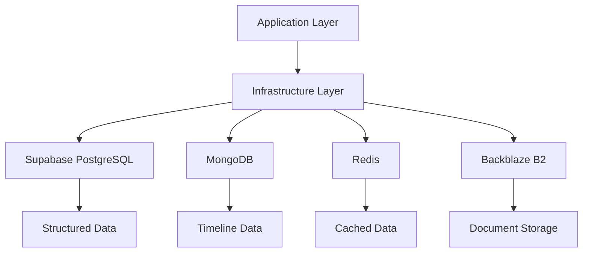
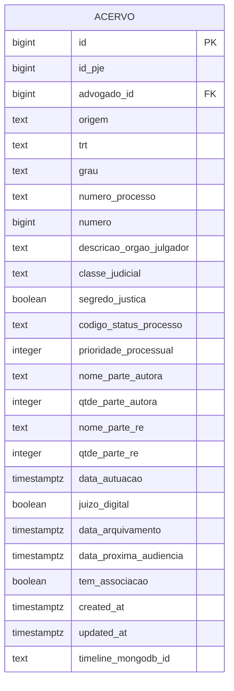
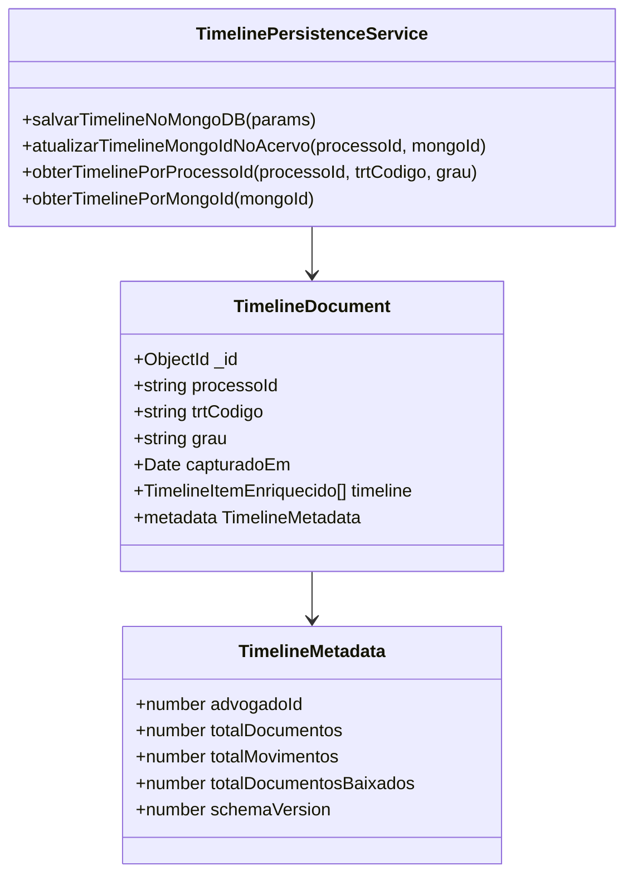
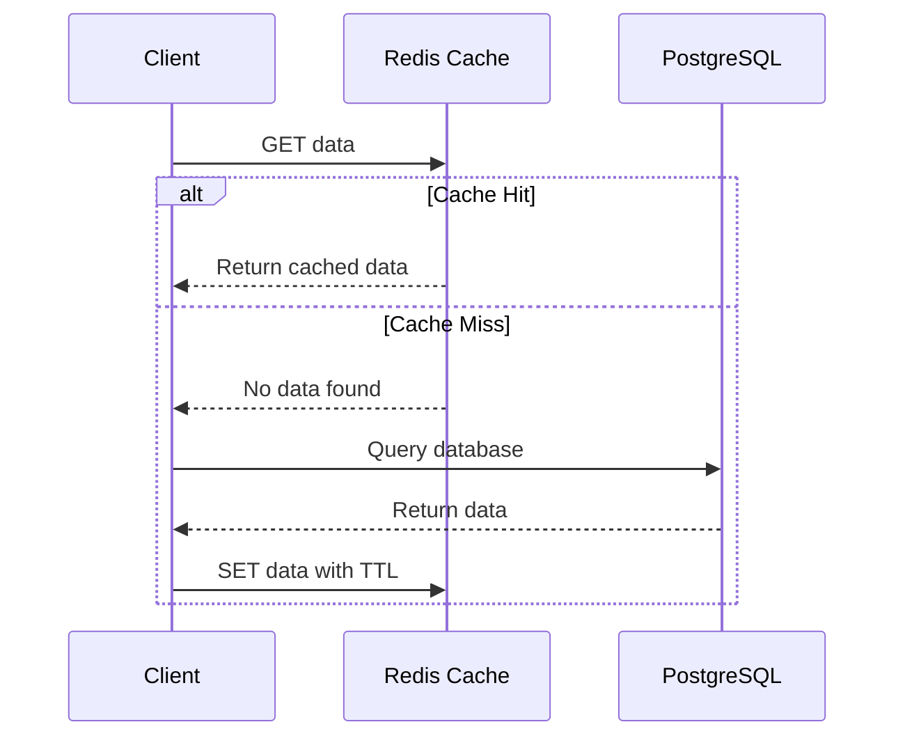
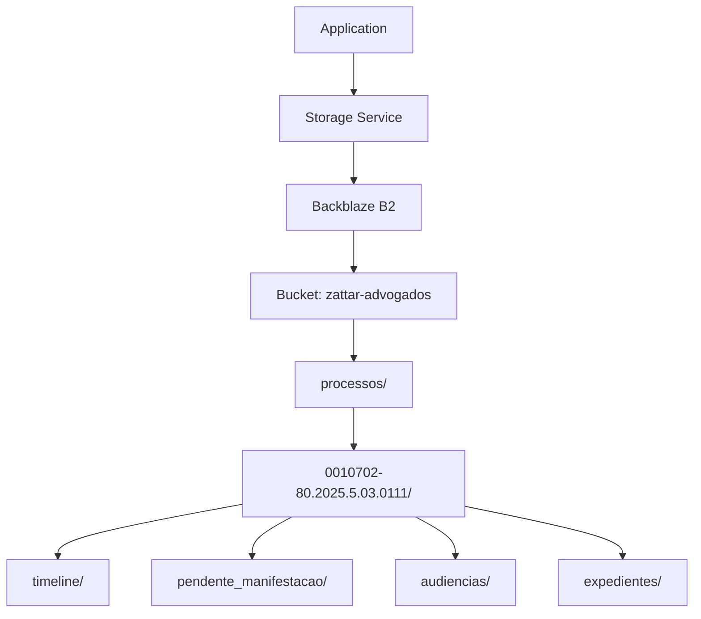

# Infrastructure Layer

<cite>
**Referenced Files in This Document**   
- [acervo-persistence.service.ts](file://backend/captura/services/persistence/acervo-persistence.service.ts)
- [timeline-persistence.service.ts](file://backend/captura/services/timeline/timeline-persistence.service.ts)
- [service-client.ts](file://backend/utils/supabase/service-client.ts)
- [client.ts](file://backend/utils/mongodb/client.ts)
- [collections.ts](file://backend/utils/mongodb/collections.ts)
- [timeline.ts](file://backend/types/mongodb/timeline.ts)
- [cache-utils.ts](file://backend/utils/redis/cache-utils.ts)
- [client.ts](file://backend/utils/redis/client.ts)
- [backblaze-b2.service.ts](file://backend/storage/backblaze-b2.service.ts)
- [backblaze-b2-storage.service.ts](file://backend/acordos-condenacoes/services/storage/backblaze-b2-storage.service.ts)
- [04_acervo.sql](file://supabase/schemas/04_acervo.sql)
- [20251120000001_add_timeline_mongodb_id_to_acervo.sql](file://supabase/migrations/aplicadas/20251120000001_add_timeline_mongodb_id_to_acervo.sql)
- [MIGRACAO_BACKBLAZE_B2.md](file://backend/storage/MIGRACAO_BACKBLAZE_B2.md)
</cite>

## Table of Contents
1. [Introduction](#introduction)
2. [Data Persistence Architecture](#data-persistence-architecture)
3. [Supabase PostgreSQL Implementation](#supabase-postgresql-implementation)
4. [MongoDB for Timeline Data](#mongodb-for-timeline-data)
5. [Redis Caching Strategy](#redis-caching-strategy)
6. [Database Migration Management](#database-migration-management)
7. [External Storage Integration](#external-storage-integration)
8. [Connection and Transaction Management](#connection-and-transaction-management)
9. [Data Consistency Across Storage Backends](#data-consistency-across-storage-backends)
10. [Performance Optimization](#performance-optimization)

## Introduction

The Sinesys Infrastructure Layer provides a robust foundation for data persistence and external system integration. This documentation details the architecture and implementation of the persistence mechanisms, focusing on the multi-database strategy that combines Supabase PostgreSQL for structured data, MongoDB for timeline data storage, and Redis for caching. The layer also manages integration with external storage systems like Backblaze B2 for document storage. The design emphasizes abstraction between the Application Layer and persistence mechanisms, ensuring maintainability and flexibility. The infrastructure handles connection management, transaction control, and performance optimization through indexing and caching strategies.

## Data Persistence Architecture

The Sinesys Infrastructure Layer implements a polyglot persistence model, utilizing different database technologies optimized for specific data types and access patterns. The architecture separates concerns between structured relational data, unstructured timeline data, and temporary cached data. The persistence services provide an abstraction layer that isolates the Application Layer from the underlying database technologies. This separation allows for independent scaling and optimization of each storage system. The architecture follows a service-oriented approach where specific persistence services handle operations for particular domains, such as acervo (legal case collection) and timeline data. Connection management is centralized through utility classes that provide singleton patterns for database clients, ensuring efficient resource utilization.

**Diagram sources**
- [acervo-persistence.service.ts](file://backend/captura/services/persistence/acervo-persistence.service.ts)
- [timeline-persistence.service.ts](file://backend/captura/services/timeline/timeline-persistence.service.ts)
- [client.ts](file://backend/utils/mongodb/client.ts)
- [client.ts](file://backend/utils/redis/client.ts)

**Section sources**
- [acervo-persistence.service.ts](file://backend/captura/services/persistence/acervo-persistence.service.ts)
- [timeline-persistence.service.ts](file://backend/captura/services/timeline/timeline-persistence.service.ts)

## Supabase PostgreSQL Implementation

The primary data persistence mechanism in Sinesys is Supabase PostgreSQL, which stores structured data for legal cases, users, and related entities. The implementation uses Supabase's service client with secret key authentication for backend operations, bypassing Row Level Security (RLS) for administrative tasks. The `createServiceClient` function in `service-client.ts` establishes connections using environment variables for configuration, prioritizing the newer Supabase Secret Key over the legacy service_role key. The database schema is defined in SQL files within the `supabase/schemas/` directory, with the `04_acervo.sql` file defining the structure for the acervo (case collection) table. This table includes comprehensive fields for case metadata, parties involved, and procedural information, with appropriate indexes to optimize query performance.

**Diagram sources**
- [04_acervo.sql](file://supabase/schemas/04_acervo.sql)
- [20251120000001_add_timeline_mongodb_id_to_acervo.sql](file://supabase/migrations/aplicadas/20251120000001_add_timeline_mongodb_id_to_acervo.sql)

**Section sources**
- [04_acervo.sql](file://supabase/schemas/04_acervo.sql)
- [service-client.ts](file://backend/utils/supabase/service-client.ts)

## MongoDB for Timeline Data

Timeline data in Sinesys is stored in MongoDB, a document database optimized for hierarchical and unstructured data. The implementation uses a dedicated MongoDB client with singleton pattern to manage connections efficiently. The `getMongoClient` and `getMongoDatabase` functions in `client.ts` handle connection establishment and database access, with configurable pool settings for optimal performance in serverless environments. The timeline data is stored in the `timeline` collection, with documents containing the complete timeline of a legal case, including enriched data from external sources like Google Drive. The `TimelineDocument` interface defines the structure of these documents, including metadata such as capture date, total documents, and schema version for future migrations.

The integration between PostgreSQL and MongoDB is managed through a reference field in the acervo table (`timeline_mongodb_id`) that stores the ObjectId of the corresponding timeline document. This hybrid approach allows for efficient querying of case metadata from PostgreSQL while leveraging MongoDB's capabilities for storing and retrieving complex timeline data. The `timeline-persistence.service.ts` file contains functions for saving, updating, and retrieving timeline data, with comprehensive logging for monitoring and debugging.

**Diagram sources**
- [timeline-persistence.service.ts](file://backend/captura/services/timeline/timeline-persistence.service.ts)
- [timeline.ts](file://backend/types/mongodb/timeline.ts)
- [client.ts](file://backend/utils/mongodb/client.ts)

**Section sources**
- [timeline-persistence.service.ts](file://backend/captura/services/timeline/timeline-persistence.service.ts)
- [timeline.ts](file://backend/types/mongodb/timeline.ts)
- [client.ts](file://backend/utils/mongodb/client.ts)

## Redis Caching Strategy

Sinesys implements a Redis-based caching strategy to improve application performance and reduce database load. The Redis client is configured with retry logic and exponential backoff to handle connection issues gracefully. The caching system follows the Cache-Aside (Lazy Loading) pattern, where data is first retrieved from the cache, and only fetched from the database in case of a cache miss. The `withCache` function in `cache-utils.ts` provides a higher-order function that wraps asynchronous operations with caching logic, automatically storing results in Redis with a configurable TTL (Time To Live).

The Redis implementation includes health checks through the `isRedisAvailable` function, which determines if the Redis client is ready to accept commands. Cache statistics are available through the `getCacheStats` function, which parses the Redis INFO command output to extract key metrics such as memory usage, connection count, and hit/miss ratios. This monitoring capability allows for proactive cache management and performance optimization. The caching strategy is particularly effective for frequently accessed but infrequently changing data, such as reference data and user session information.

**Diagram sources**
- [cache-utils.ts](file://backend/utils/redis/cache-utils.ts)
- [client.ts](file://backend/utils/redis/client.ts)

**Section sources**
- [cache-utils.ts](file://backend/utils/redis/cache-utils.ts)
- [client.ts](file://backend/utils/redis/client.ts)

## Database Migration Management

The Sinesys infrastructure employs a comprehensive migration strategy for managing database schema changes. Migrations are organized in the `supabase/migrations/` directory, with subdirectories for `aplicadas` (applied) and `nao-aplicadas` (not applied) migrations. This organization allows for clear tracking of migration status and facilitates collaboration among team members. The migration process is automated through scripts like `apply-migrations-via-supabase-sdk.ts` and `apply-migrations-manual.ts`, which execute SQL migration files against the database.

Each migration follows a structured format with clear descriptions, SQL statements, and comments explaining the purpose and impact of the changes. For example, the migration `20251120000001_add_timeline_mongodb_id_to_acervo.sql` adds a `timeline_mongodb_id` column to the acervo table to support the hybrid PostgreSQL-MongoDB architecture. This migration includes appropriate indexes and comments to ensure maintainability. The migration scripts include error handling and validation to prevent partial application of changes, with fallback mechanisms for manual intervention when necessary.

The migration strategy also includes a status tracking system through the `migration-status.json` file, which records which migrations have been applied. This allows the system to determine the current database state and apply only the necessary migrations. The `organize-migrations.ts` script helps maintain the migration directory structure by moving applied migrations to the appropriate subdirectory, ensuring a clean and organized migration history.

**Section sources**
- [20251120000001_add_timeline_mongodb_id_to_acervo.sql](file://supabase/migrations/aplicadas/20251120000001_add_timeline_mongodb_id_to_acervo.sql)
- [apply-migrations-via-supabase-sdk.ts](file://scripts/database/apply-migrations-via-supabase-sdk.ts)
- [apply-migrations-manual.ts](file://scripts/apply-migrations-manual.ts)
- [organize-migrations.ts](file://scripts/outros/organize-migrations.ts)

## External Storage Integration

Sinesys integrates with external storage systems through a pluggable storage service architecture. The primary external storage is Backblaze B2, which replaced Google Drive as the document storage backend. The migration to Backblaze B2 was documented in `MIGRACAO_BACKBLAZE_B2.md`, which outlines the implementation steps, configuration requirements, and testing procedures. The storage service implementation follows the AWS S3 API specification, allowing for compatibility with the S3-compatible interface of Backblaze B2.

The `BackblazeB2StorageService` class implements the `IStorageService` interface, providing methods for upload, delete, and URL generation operations. The service uses environment variables for configuration, including endpoint, region, bucket name, and authentication credentials. The storage architecture includes a naming strategy for files, with a hierarchical structure based on process number and document type. For example, timeline documents are stored in paths like `processos/{numeroProcesso}/timeline/doc_{id}_{YYYYMMDD}.pdf`.

The integration includes support for both public and private access patterns. Public access allows direct URL access to documents, while private access uses presigned URLs with expiration times for secure document sharing. The `generatePresignedUrl` function in `backblaze-b2.service.ts` creates time-limited URLs that grant temporary access to private documents. This approach balances ease of access with security requirements for sensitive legal documents.

**Diagram sources**
- [backblaze-b2-storage.service.ts](file://backend/acordos-condenacoes/services/storage/backblaze-b2-storage.service.ts)
- [backblaze-b2.service.ts](file://backend/storage/backblaze-b2.service.ts)
- [MIGRACAO_BACKBLAZE_B2.md](file://backend/storage/MIGRACAO_BACKBLAZE_B2.md)

**Section sources**
- [backblaze-b2-storage.service.ts](file://backend/acordos-condenacoes/services/storage/backblaze-b2-storage.service.ts)
- [backblaze-b2.service.ts](file://backend/storage/backblaze-b2.service.ts)
- [MIGRACAO_BACKBLAZE_B2.md](file://backend/storage/MIGRACAO_BACKBLAZE_B2.md)

## Connection and Transaction Management

The Sinesys infrastructure implements robust connection and transaction management across all persistence layers. For Supabase PostgreSQL, the service client is configured with `autoRefreshToken: false` and `persistSession: false` to optimize for serverless environments where connections are short-lived. This configuration prevents unnecessary token refresh operations and session persistence, reducing overhead for backend services.

MongoDB connection management follows a singleton pattern with connection pooling. The `getMongoClient` function ensures that only one client instance is created and reused across the application, with a maximum pool size of 10 connections and a minimum of 2. The `maxIdleTimeMS` setting of 60,000 milliseconds ensures that idle connections are closed after one minute, preventing resource exhaustion in serverless environments.

Transaction management in PostgreSQL is handled through Supabase's built-in transaction support, with the infrastructure layer abstracting these operations through service methods. For example, the `salvarAcervo` function in `acervo-persistence.service.ts` processes multiple processes in a loop, with each operation potentially affecting multiple tables. While not using explicit database transactions, the service implements application-level transaction semantics by logging operations and handling errors appropriately.

The infrastructure also includes distributed locking mechanisms to prevent race conditions in concurrent operations. The `DistributedLock` class in `distributed-lock.ts` uses Supabase's advisory locks to coordinate access to shared resources across multiple instances. This is particularly important for scheduled jobs and background processes that might otherwise conflict when accessing the same data.

**Section sources**
- [service-client.ts](file://backend/utils/supabase/service-client.ts)
- [client.ts](file://backend/utils/mongodb/client.ts)
- [acervo-persistence.service.ts](file://backend/captura/services/persistence/acervo-persistence.service.ts)
- [distributed-lock.ts](file://backend/utils/locks/distributed-lock.ts)

## Data Consistency Across Storage Backends

Maintaining data consistency across multiple storage backends is a critical aspect of the Sinesys infrastructure. The system employs several strategies to ensure consistency between PostgreSQL, MongoDB, and external storage systems. The primary mechanism is the use of reference fields, such as the `timeline_mongodb_id` in the acervo table, which links relational data to document data. When a timeline is saved to MongoDB, the resulting ObjectId is immediately updated in the corresponding acervo record, ensuring referential integrity.

The infrastructure also implements a reconciliation strategy for handling inconsistencies. For example, if a timeline document is deleted from MongoDB but the reference remains in PostgreSQL, the system detects this during subsequent queries and clears the reference field. This self-healing capability prevents dangling references and maintains data integrity.

For external storage, the system stores metadata about stored documents directly in the database. The migration to Backblaze B2 added columns like `arquivo_url`, `arquivo_bucket`, and `arquivo_key` to relevant tables, allowing the application to reconstruct storage paths and verify document existence. The `exists` method in the storage service implementation checks for document presence in the external storage, enabling the application to handle missing documents gracefully.

The infrastructure also includes monitoring and logging for consistency checks. Operations that modify data across multiple storage systems include comprehensive logging that records the state of each operation. This audit trail enables troubleshooting of consistency issues and provides visibility into data synchronization processes.

**Section sources**
- [timeline-persistence.service.ts](file://backend/captura/services/timeline/timeline-persistence.service.ts)
- [backblaze-b2-storage.service.ts](file://backend/acordos-condenacoes/services/storage/backblaze-b2-storage.service.ts)
- [MIGRACAO_BACKBLAZE_B2.md](file://backend/storage/MIGRACAO_BACKBLAZE_B2.md)

## Performance Optimization

The Sinesys infrastructure incorporates multiple performance optimization strategies across all persistence layers. In PostgreSQL, comprehensive indexing is implemented to accelerate query performance. The acervo table includes indexes on frequently queried fields such as `advogado_id`, `trt`, `grau`, and `numero_processo`, with composite indexes for common query patterns. These indexes are carefully selected to balance query performance with the overhead of index maintenance during write operations.

For MongoDB, the system leverages the document database's native capabilities for efficient storage and retrieval of hierarchical data. The timeline documents are stored in a denormalized format that minimizes the need for joins and lookups, improving read performance for complex timeline data. The MongoDB client is configured with connection pooling to reduce connection establishment overhead.

The Redis caching layer provides significant performance benefits by reducing database load for frequently accessed data. The cache-aside pattern ensures that hot data is served from memory, with typical response times orders of magnitude faster than database queries. The caching strategy is complemented by appropriate TTL settings that balance data freshness with performance.

Additional performance optimizations include batch operations for bulk data processing, connection pooling for database clients, and efficient error handling that prevents cascading failures. The infrastructure also includes monitoring capabilities through cache statistics and database performance metrics, enabling proactive optimization based on actual usage patterns.

**Section sources**
- [04_acervo.sql](file://supabase/schemas/04_acervo.sql)
- [cache-utils.ts](file://backend/utils/redis/cache-utils.ts)
- [client.ts](file://backend/utils/mongodb/client.ts)
- [service-client.ts](file://backend/utils/supabase/service-client.ts)