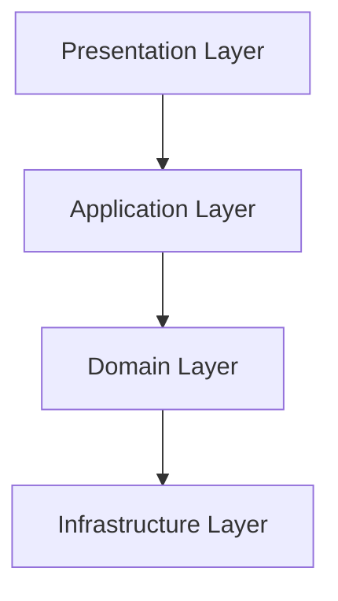
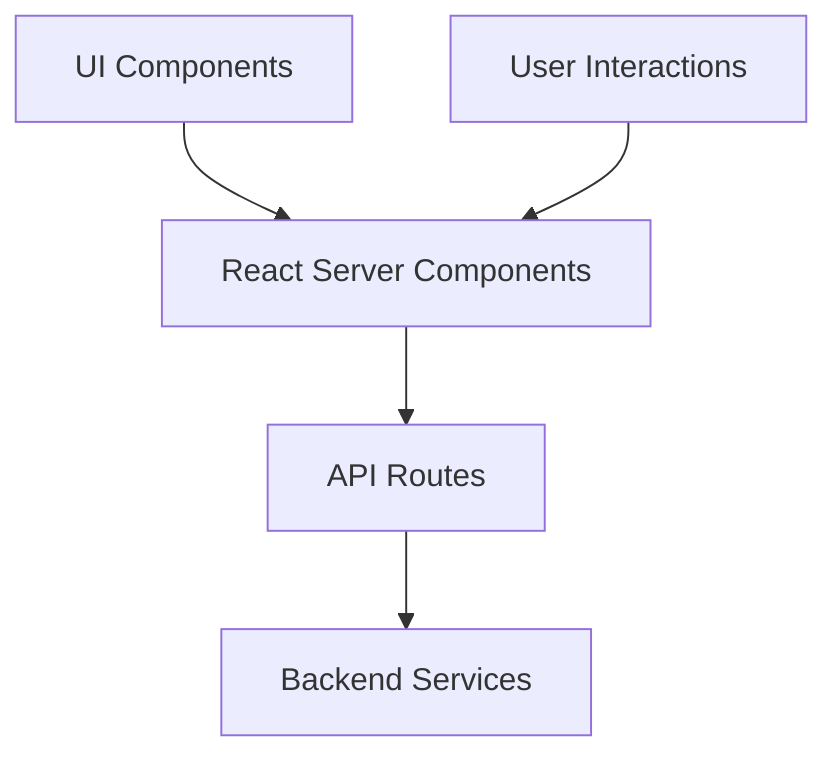
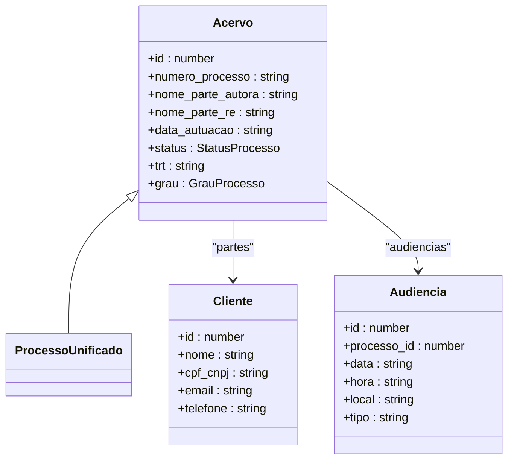
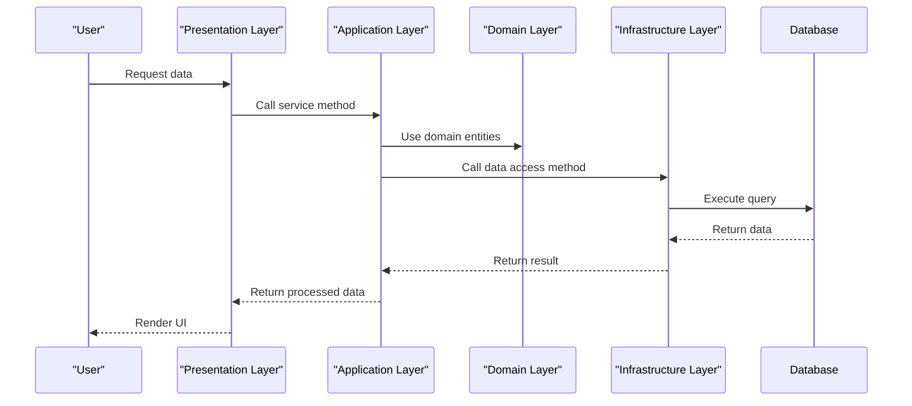

# Layered Architecture

<cite>
**Referenced Files in This Document**   
- [README.md](file://README.md)
- [types/domain/acervo.ts](file://types/domain/acervo.ts)
- [types/domain/index.ts](file://types/domain/index.ts)
- [types/contracts/acervo.ts](file://types/contracts/acervo.ts)
- [backend/acervo/services/listar-acervo.service.ts](file://backend/acervo/services/listar-acervo.service.ts)
- [backend/acervo/services/persistence/listar-acervo.service.ts](file://backend/acervo/services/persistence/listar-acervo.service.ts)
- [app/api/acervo/route.ts](file://app/api/acervo/route.ts)
- [app/_lib/dashboard-api.ts](file://app/_lib/dashboard-api.ts)
- [app/(dashboard)/acordos-condenacoes/page.tsx](file://app/(dashboard)/acordos-condenacoes/page.tsx)
- [backend/types/acervo/types.ts](file://backend/types/acervo/types.ts)
</cite>

## Table of Contents
1. [Introduction](#introduction)
2. [Four-Layer Architecture](#four-layer-architecture)
3. [Layer Responsibilities](#layer-responsibilities)
4. [Dependency Rules](#dependency-rules)
5. [Presentation Layer](#presentation-layer)
6. [Application Layer](#application-layer)
7. [Domain Layer](#domain-layer)
8. [Infrastructure Layer](#infrastructure-layer)
9. [Cross-Layer Interactions](#cross-layer-interactions)
10. [Benefits of Layered Architecture](#benefits-of-layered-architecture)
11. [Conclusion](#conclusion)

## Introduction

The Sinesys application implements a strict four-layer architecture that separates concerns and promotes maintainability, testability, and scalability. This architectural pattern divides the system into Presentation, Application, Domain, and Infrastructure layers, with dependencies flowing strictly downward from higher to lower layers. This documentation details the responsibilities of each layer, the dependency rules that govern their interactions, and how this structure supports the overall goals of the application.

The layered architecture enables clear separation between UI components, business logic, domain entities, and data persistence mechanisms. By enforcing strict dependency rules, the architecture ensures that business logic remains independent of infrastructure concerns and that the domain model stays pure and focused on business rules. This approach facilitates easier testing, maintenance, and evolution of the system over time.

**Section sources**
- [README.md](file://README.md#L73-L344)

## Four-Layer Architecture

The Sinesys application follows a four-layer architectural pattern that clearly separates concerns and establishes well-defined boundaries between different aspects of the system. This architecture consists of the Presentation layer, Application layer, Domain layer, and Infrastructure layer, with dependencies flowing strictly downward from higher to lower layers.

This layered approach provides several key benefits:
- **Separation of Concerns**: Each layer has a distinct responsibility, making the codebase easier to understand and maintain
- **Testability**: Layers can be tested in isolation, with higher layers easily mocked during lower-layer testing
- **Maintainability**: Changes to one layer have minimal impact on others, reducing the risk of unintended side effects
- **Scalability**: Teams can work on different layers independently, enabling parallel development
- **Flexibility**: Implementation details can be changed without affecting other layers

The architecture enforces strict dependency rules where higher layers can depend on lower layers, but not vice versa. This ensures that business logic remains independent of infrastructure concerns and that the domain model stays pure and focused on business rules.

**Diagram sources**
- [README.md](file://README.md#L73-L344)

## Layer Responsibilities

Each layer in the Sinesys architecture has clearly defined responsibilities that contribute to the overall functionality of the system. The Presentation layer handles UI components and user interactions, the Application layer manages business services and coordinates operations, the Domain layer contains pure business logic and entities, and the Infrastructure layer handles data persistence and external integrations.

This separation ensures that business logic is not mixed with UI concerns or data access code, making the system more maintainable and testable. The Domain layer represents the core business concepts and rules, while the Application layer orchestrates these concepts to implement specific use cases. The Infrastructure layer provides the technical implementation details for data storage and retrieval, while the Presentation layer focuses solely on user experience.

The strict separation of responsibilities allows teams to work on different aspects of the system independently and enables easier refactoring and evolution of the codebase over time.

**Section sources**
- [README.md](file://README.md#L73-L344)

## Dependency Rules

The Sinesys architecture enforces strict dependency rules that ensure dependencies flow downward only, from higher layers to lower layers. This unidirectional dependency flow prevents circular dependencies and maintains the integrity of the layered architecture.

The dependency rules are as follows:
- The Presentation layer can depend on the Application, Domain, and Infrastructure layers
- The Application layer can depend on the Domain and Infrastructure layers
- The Domain layer can only depend on other Domain layer components
- The Infrastructure layer can depend on external libraries and services

This dependency structure ensures that business logic remains independent of infrastructure concerns and that the domain model stays pure and focused on business rules. It also enables easier testing, as higher layers can be mocked when testing lower layers.

The architecture prevents lower layers from depending on higher layers, which would create tight coupling and make the system more difficult to maintain and evolve. This strict dependency enforcement is a key factor in the maintainability and testability of the Sinesys application.

**Section sources**
- [README.md](file://README.md#L73-L344)

## Presentation Layer

The Presentation layer in Sinesys is responsible for handling UI components and user interactions. Located in the `app/(dashboard)/` directory, this layer implements React Server Components that render the user interface and handle user input. The layer interacts with backend services through API routes, providing a clean separation between UI concerns and business logic.

React Server Components in the Presentation layer fetch data from backend services using API routes and render the appropriate UI components based on the received data. These components are designed to be reusable and focused on presentation concerns, without containing business logic or data access code.

The Presentation layer uses client-side data fetching and state management to provide a responsive user experience. It leverages Next.js App Router for routing and page rendering, with each page component responsible for rendering a specific view or feature of the application.

**Diagram sources**
- [app/(dashboard)/acordos-condenacoes/page.tsx](file://app/(dashboard)/acordos-condenacoes/page.tsx)
- [app/api/acervo/route.ts](file://app/api/acervo/route.ts)

## Application Layer

The Application layer in Sinesys manages business services and orchestrates operations between the Domain and Infrastructure layers. Located in the `backend/services/` directory, this layer contains service classes that implement specific use cases and coordinate the execution of business logic.

Application services in this layer are responsible for:
- Validating input parameters
- Orchestrating multiple domain operations
- Managing transactions
- Handling security and authorization
- Coordinating data access through the Infrastructure layer

These services act as intermediaries between the Presentation layer and the Domain layer, translating UI-level operations into domain-level operations. They ensure that business rules are properly enforced and that operations are executed in the correct sequence.

The Application layer is designed to be independent of specific infrastructure implementations, allowing it to focus on business logic rather than technical details. This separation enables easier testing and maintenance, as business rules can be verified without requiring specific database or external service configurations.

**Section sources**
- [backend/acervo/services/listar-acervo.service.ts](file://backend/acervo/services/listar-acervo.service.ts)

## Domain Layer

The Domain layer in Sinesys contains pure business logic and entities, representing the core concepts and rules of the application. Located in the `types/domain/` directory, this layer defines the fundamental building blocks of the system, including entities, value objects, and domain-specific types.

The Domain layer is designed to be independent of infrastructure concerns and UI considerations, focusing solely on business rules and concepts. It contains definitions for key entities such as Acervo, Cliente, and Audiencia, along with their associated properties and behaviors.

This layer serves as the "single source of truth" for business concepts, ensuring consistency across the application. By keeping business logic in this isolated layer, the system can evolve without affecting other layers, and business rules can be tested in isolation.

The Domain layer is shared across the entire application, allowing both frontend and backend components to use the same definitions and ensuring consistency in data representation.

**Diagram sources**
- [types/domain/acervo.ts](file://types/domain/acervo.ts)
- [types/domain/index.ts](file://types/domain/index.ts)

## Infrastructure Layer

The Infrastructure layer in Sinesys handles data persistence and external integrations. Located in the `backend/persistence/` directory, this layer contains the technical implementation details for storing and retrieving data from databases and external services.

This layer is responsible for:
- Implementing data access patterns and repository interfaces
- Executing database queries and transactions
- Managing connections to data stores
- Handling data serialization and deserialization
- Implementing caching strategies

The Infrastructure layer provides concrete implementations of data access interfaces defined in higher layers, allowing the Application and Domain layers to interact with data stores without knowing the specific implementation details.

By isolating infrastructure concerns in this layer, the system can easily switch between different data storage technologies or modify data access patterns without affecting business logic. This separation also enables easier testing, as infrastructure components can be mocked or replaced with test doubles.

The layer interacts with external data stores such as Supabase (PostgreSQL), MongoDB, and Redis, providing a consistent interface for data access regardless of the underlying technology.

**Section sources**
- [backend/acervo/services/persistence/listar-acervo.service.ts](file://backend/acervo/services/persistence/listar-acervo.service.ts)

## Cross-Layer Interactions

Cross-layer interactions in Sinesys follow a strict pattern where higher layers depend on lower layers, but not vice versa. This unidirectional dependency flow ensures that business logic remains independent of infrastructure concerns and that the domain model stays pure and focused on business rules.

The typical flow of a request through the layers is:
1. The Presentation layer receives user input and makes a request to an API route
2. The API route in the Presentation layer invokes a service in the Application layer
3. The Application layer service uses domain entities and orchestrates operations
4. The Application layer service calls infrastructure components to persist or retrieve data
5. The response flows back through the layers to the Presentation layer for rendering

This flow ensures that business logic is properly encapsulated and that infrastructure details are hidden from higher layers. For example, when the acervo service needs to retrieve data, it uses domain entities without knowing the specific database implementation, thanks to the abstraction provided by the Infrastructure layer.

The architecture also supports the use of shared types between layers, with domain types being imported and used consistently across the application. This ensures data consistency and reduces the risk of errors due to type mismatches.

**Diagram sources**
- [app/api/acervo/route.ts](file://app/api/acervo/route.ts)
- [backend/acervo/services/listar-acervo.service.ts](file://backend/acervo/services/listar-acervo.service.ts)
- [backend/acervo/services/persistence/listar-acervo.service.ts](file://backend/acervo/services/persistence/listar-acervo.service.ts)

## Benefits of Layered Architecture

The layered architecture in Sinesys provides several key benefits that contribute to the maintainability, testability, and scalability of the application. These benefits include improved code organization, easier testing, enhanced maintainability, and better team collaboration.

The clear separation of concerns allows developers to focus on specific aspects of the system without needing to understand the entire codebase. This modularity makes it easier to onboard new team members and enables parallel development across different features.

The architecture's strict dependency rules prevent circular dependencies and ensure that business logic remains independent of infrastructure concerns. This separation makes it easier to refactor or replace components without affecting other parts of the system.

Testing is significantly improved by the layered structure, as each layer can be tested in isolation with appropriate mocks for dependencies. Unit tests can focus on business logic in the Domain and Application layers, while integration tests can verify the interactions between layers.

The architecture also supports scalability by enabling teams to work on different layers independently and by making it easier to identify performance bottlenecks and optimize specific components.

Finally, the layered approach facilitates long-term maintenance by making the codebase more predictable and easier to navigate. Changes to one layer have minimal impact on others, reducing the risk of unintended side effects and making the system more resilient to change.

**Section sources**
- [README.md](file://README.md#L73-L344)

## Conclusion

The four-layer architecture in Sinesys provides a robust foundation for building a maintainable, testable, and scalable application. By clearly separating concerns into Presentation, Application, Domain, and Infrastructure layers with strict dependency rules, the architecture ensures that business logic remains pure and independent of infrastructure concerns.

This approach enables teams to work more efficiently, improves code quality, and makes the system easier to maintain and evolve over time. The use of React Server Components in the Presentation layer, combined with well-defined service layers and a pure domain model, creates a clean separation between UI concerns, business logic, and data persistence.

The architecture's benefits in terms of testability, maintainability, and scalability make it well-suited for a complex legal management system like Sinesys. As the application continues to grow, this layered approach will help ensure that new features can be added with minimal impact on existing code, and that the system can adapt to changing requirements over time.