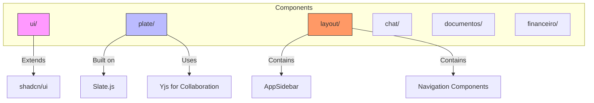
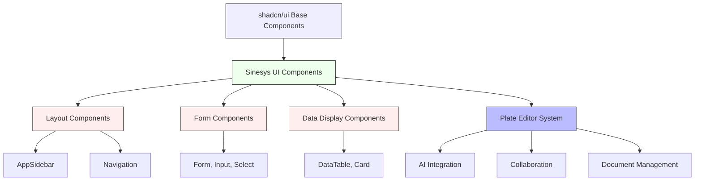
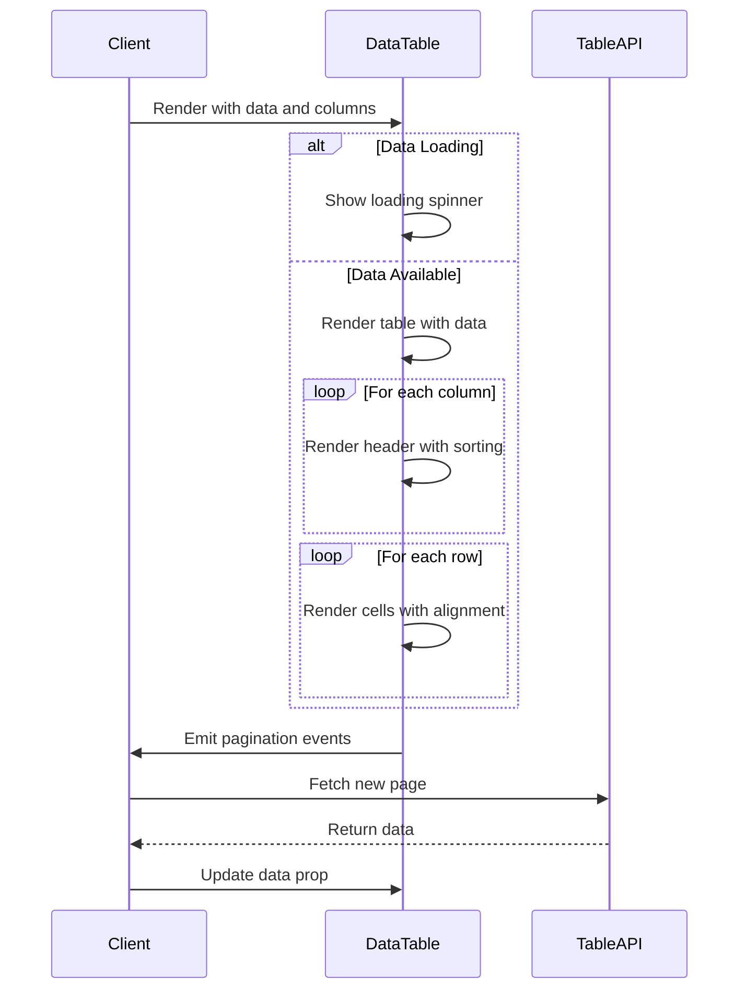
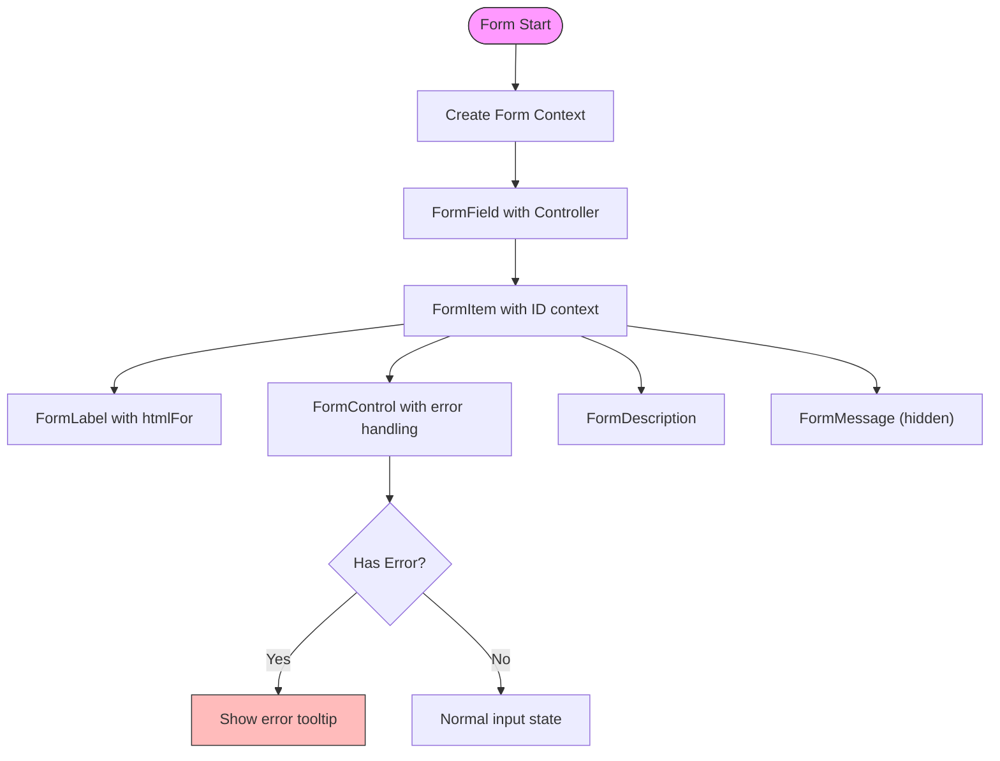
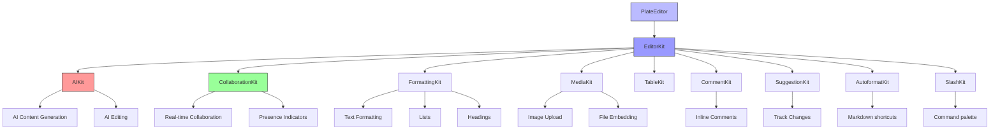
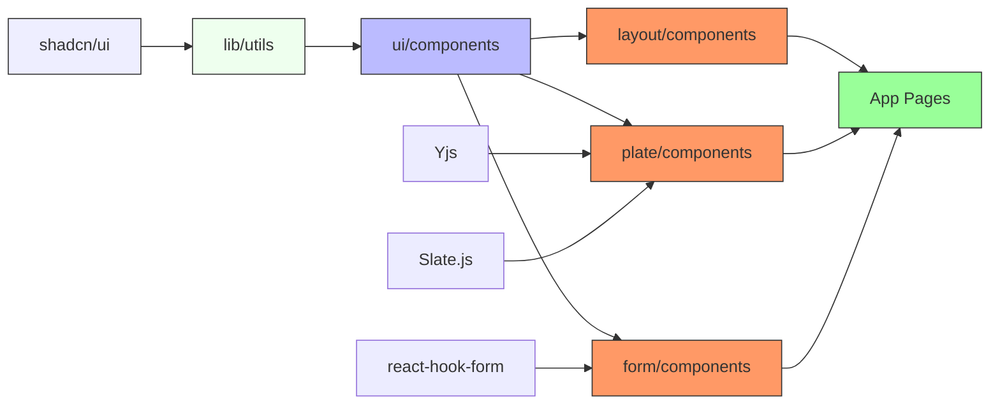

# Component Library

<cite>
**Referenced Files in This Document**   
- [components/ui/button.tsx](file://components/ui/button.tsx)
- [components/ui/data-table.tsx](file://components/ui/data-table.tsx)
- [components/ui/dialog.tsx](file://components/ui/dialog.tsx)
- [components/ui/form.tsx](file://components/ui/form.tsx)
- [components/ui/input.tsx](file://components/ui/input.tsx)
- [components/ui/select.tsx](file://components/ui/select.tsx)
- [components/ui/label.tsx](file://components/ui/label.tsx)
- [components/ui/textarea.tsx](file://components/ui/textarea.tsx)
- [components/ui/table.tsx](file://components/ui/table.tsx)
- [components/ui/card.tsx](file://components/ui/card.tsx)
- [components/plate/plate-editor.tsx](file://components/plate/plate-editor.tsx)
- [components/plate/editor-kit.tsx](file://components/plate/editor-kit.tsx)
- [components/layout/app-sidebar.tsx](file://components/layout/app-sidebar.tsx)
- [components/layout/nav-main.tsx](file://components/layout/nav-main.tsx)
- [components/ui/theme-provider.tsx](file://components/ui/theme-provider.tsx)
</cite>

## Table of Contents
1. [Introduction](#introduction)
2. [Project Structure](#project-structure)
3. [Core Components](#core-components)
4. [Architecture Overview](#architecture-overview)
5. [Detailed Component Analysis](#detailed-component-analysis)
6. [Dependency Analysis](#dependency-analysis)
7. [Performance Considerations](#performance-considerations)
8. [Troubleshooting Guide](#troubleshooting-guide)
9. [Conclusion](#conclusion)

## Introduction
The Sinesys Component Library is a comprehensive UI component system built on top of shadcn/ui, providing a rich set of reusable components for the Sinesys application. The library follows a modular architecture with components organized into logical directories based on functionality. The core components in the `ui/` directory extend shadcn/ui base components with custom styling and functionality, while specialized component systems like the Plate editor provide advanced document management capabilities. The component library emphasizes accessibility, responsive design, and theming, with all components designed to work seamlessly with React Server Components.

**Section sources**
- [components/ui/button.tsx](file://components/ui/button.tsx#L1-L61)
- [components/ui/data-table.tsx](file://components/ui/data-table.tsx#L1-L333)
- [components/ui/dialog.tsx](file://components/ui/dialog.tsx#L1-L144)

## Project Structure
The component library is organized into several key directories within the `components/` folder. The `ui/` directory contains base UI components that extend shadcn/ui, providing consistent styling and behavior across the application. The `plate/` directory houses the document editor system built on Plate, which provides rich text editing capabilities with AI integration, collaboration features, and document management. The `layout/` directory contains navigation and structural components like the application sidebar and navigation menus. Additional component directories include `chat/`, `documentos/`, and `financeiro/`, which contain domain-specific components.



**Diagram sources **
- [components/ui/button.tsx](file://components/ui/button.tsx#L1-L61)
- [components/plate/plate-editor.tsx](file://components/plate/plate-editor.tsx#L1-L600)
- [components/layout/app-sidebar.tsx](file://components/layout/app-sidebar.tsx#L1-L258)

**Section sources**
- [components/ui/button.tsx](file://components/ui/button.tsx#L1-L61)
- [components/plate/plate-editor.tsx](file://components/plate/plate-editor.tsx#L1-L600)
- [components/layout/app-sidebar.tsx](file://components/layout/app-sidebar.tsx#L1-L258)

## Core Components
The Sinesys Component Library provides a comprehensive set of core UI components that serve as the building blocks for the application. These components are designed to be reusable, accessible, and consistent in their behavior and styling. The library extends shadcn/ui components with custom variants, accessibility features, and integration with the application's design system. Key components include buttons, data tables, dialogs, form elements, and layout components that work together to create a cohesive user experience.

**Section sources**
- [components/ui/button.tsx](file://components/ui/button.tsx#L1-L61)
- [components/ui/data-table.tsx](file://components/ui/data-table.tsx#L1-L333)
- [components/ui/dialog.tsx](file://components/ui/dialog.tsx#L1-L144)

## Architecture Overview
The component library follows a layered architecture with clear separation of concerns. At the foundation are the shadcn/ui base components, which provide accessible, unstyled primitives. The Sinesys `ui/` components extend these with application-specific styling using Tailwind CSS and the `cva` (Class Variance Authority) library for variant management. Higher-level components in the `plate/` and `layout/` directories compose these base components to create complex UI patterns. The architecture supports React Server Components while ensuring interactive components are properly marked with "use client" directives.



**Diagram sources **
- [components/ui/button.tsx](file://components/ui/button.tsx#L1-L61)
- [components/plate/plate-editor.tsx](file://components/plate/plate-editor.tsx#L1-L600)
- [components/layout/app-sidebar.tsx](file://components/layout/app-sidebar.tsx#L1-L258)

## Detailed Component Analysis

### Button Component Analysis
The Button component is a foundational UI element that extends shadcn/ui with custom styling and behavior. It uses the `cva` library to define variants for different visual styles (default, destructive, outline, secondary, ghost, link) and sizes (default, sm, lg, icon variants). The component supports the `asChild` prop to allow rendering as different elements while maintaining consistent styling. Accessibility features include focus states, disabled states, and proper keyboard navigation.

```mermaid
classDiagram
class Button {
+variant : "default"|"destructive"|"outline"|"secondary"|"ghost"|"link"
+size : "default"|"sm"|"lg"|"icon"|"icon-sm"|"icon-lg"
+asChild : boolean
+className : string
+children : ReactNode
}
Button --> "1" "0..1" Slot : asChild
Button --> "1" "1" buttonVariants : cva config
```

**Diagram sources **
- [components/ui/button.tsx](file://components/ui/button.tsx#L7-L61)

**Section sources**
- [components/ui/button.tsx](file://components/ui/button.tsx#L1-L61)

### Data Table Component Analysis
The DataTable component provides a comprehensive solution for displaying tabular data with support for server-side pagination, sorting, and row selection. Built on TanStack Table, it offers a flexible API for integrating with backend data sources while providing a consistent UI experience. The component handles loading states, error states, and empty states with appropriate visual feedback. It supports customizable rendering of headers and cells through the column definition API.



**Diagram sources **
- [components/ui/data-table.tsx](file://components/ui/data-table.tsx#L76-L333)

**Section sources**
- [components/ui/data-table.tsx](file://components/ui/data-table.tsx#L1-L333)

### Form Component Analysis
The Form component provides a structured approach to form management using react-hook-form for state management and validation. It implements a compound component pattern with FormItem, FormLabel, FormControl, FormDescription, and FormMessage components that work together to create accessible forms. The component handles error states with tooltips that appear on blur, providing immediate feedback while maintaining a clean visual appearance.



**Diagram sources **
- [components/ui/form.tsx](file://components/ui/form.tsx#L24-L217)

**Section sources**
- [components/ui/form.tsx](file://components/ui/form.tsx#L1-L217)

### Plate Editor System Analysis
The Plate editor system provides a rich text editing experience with AI integration, collaboration features, and document management capabilities. Built on the Plate framework (which is based on Slate.js), it offers a modular plugin architecture through the EditorKit system. The editor supports AI-powered content generation, comments, suggestions, and real-time collaboration through Yjs. The system is designed for document management with features like version history, sharing, and template integration.



**Diagram sources **
- [components/plate/plate-editor.tsx](file://components/plate/plate-editor.tsx#L1-L600)
- [components/plate/editor-kit.tsx](file://components/plate/editor-kit.tsx#L41-L96)

**Section sources**
- [components/plate/plate-editor.tsx](file://components/plate/plate-editor.tsx#L1-L600)
- [components/plate/editor-kit.tsx](file://components/plate/editor-kit.tsx#L1-L96)

### Layout Components Analysis
The layout components provide the structural foundation for the application interface, including the main navigation sidebar and breadcrumb navigation. The AppSidebar component implements a collapsible sidebar with multiple navigation sections (Platform, Services, Administration) and user profile information. The navigation system uses Next.js routing with path-based active state detection and mobile-responsive behavior.

```mermaid
classDiagram
class AppSidebar {
+teams : Team[]
+navPrincipal : NavItem[]
+navServicos : NavItem[]
+navAdministracao : NavItem[]
}
class NavMain {
+items : NavItem[]
}
class NavItem {
+title : string
+url : string
+icon : LucideIcon
+items? : SubItem[]
}
class SubItem {
+title : string
+url : string
}
AppSidebar --> "1" "1" Sidebar : from ui/sidebar
AppSidebar --> "1" "1" TeamSwitcher
AppSidebar --> "1" "1" NavMain
AppSidebar --> "1" "1" NavProjects
AppSidebar --> "1" "1" NavUser
NavMain --> "1" "1..*" NavItem
NavItem --> "0..*" "1..*" SubItem
```

**Diagram sources **
- [components/layout/app-sidebar.tsx](file://components/layout/app-sidebar.tsx#L34-L174)
- [components/layout/nav-main.tsx](file://components/layout/nav-main.tsx#L29-L117)

**Section sources**
- [components/layout/app-sidebar.tsx](file://components/layout/app-sidebar.tsx#L1-L258)
- [components/layout/nav-main.tsx](file://components/layout/nav-main.tsx#L1-L117)

## Dependency Analysis
The component library has a well-defined dependency structure with clear boundaries between components. The base UI components in the `ui/` directory depend on shadcn/ui primitives and utility functions from the `lib/utils` directory. The Plate editor system has dependencies on the Plate framework, Slate.js, and Yjs for collaboration. Layout components depend on UI components for rendering but maintain separation of concerns. The dependency graph shows a hierarchical structure with base components at the foundation and higher-level components building upon them.



**Diagram sources **
- [components/ui/button.tsx](file://components/ui/button.tsx#L5)
- [components/plate/plate-editor.tsx](file://components/plate/plate-editor.tsx#L6)
- [components/ui/form.tsx](file://components/ui/form.tsx#L14)

**Section sources**
- [components/ui/button.tsx](file://components/ui/button.tsx#L1-L61)
- [components/plate/plate-editor.tsx](file://components/plate/plate-editor.tsx#L1-L600)
- [components/ui/form.tsx](file://components/ui/form.tsx#L1-L217)

## Performance Considerations
The component library implements several performance optimizations to ensure a smooth user experience. The DataTable component uses virtualization concepts through server-side pagination to handle large datasets efficiently. The Plate editor implements memoization and useCallback hooks to prevent unnecessary re-renders during editing. Layout components use React.useId for stable IDs and implement loading states with skeleton screens to provide immediate feedback. The component library follows React Server Component patterns where possible to reduce client-side JavaScript bundle size.

**Section sources**
- [components/ui/data-table.tsx](file://components/ui/data-table.tsx#L167-L178)
- [components/plate/plate-editor.tsx](file://components/plate/plate-editor.tsx#L24-L31)
- [components/layout/app-sidebar.tsx](file://components/layout/app-sidebar.tsx#L249-L251)

## Troubleshooting Guide
When working with the Sinesys Component Library, several common issues may arise. For form components, ensure that the FormProvider wraps all form elements and that field names are correctly referenced. For the Plate editor, verify that the "use client" directive is present and that the editor plugins are properly configured in the EditorKit. When using the DataTable component, ensure that server-side pagination and sorting callbacks are properly implemented to avoid UI inconsistencies. For layout components, check that the SidebarProvider is present at the application root level.

**Section sources**
- [components/ui/form.tsx](file://components/ui/form.tsx#L24-L217)
- [components/plate/plate-editor.tsx](file://components/plate/plate-editor.tsx#L1-L600)
- [components/ui/data-table.tsx](file://components/ui/data-table.tsx#L76-L333)

## Conclusion
The Sinesys Component Library provides a robust foundation for building consistent, accessible, and feature-rich user interfaces. By extending shadcn/ui with custom components and integrating advanced systems like the Plate editor, the library offers both simplicity for common UI patterns and power for complex document management scenarios. The component architecture supports modern React patterns including React Server Components, while maintaining excellent performance and accessibility characteristics. The library's modular design allows for easy extension and customization to meet evolving application requirements.