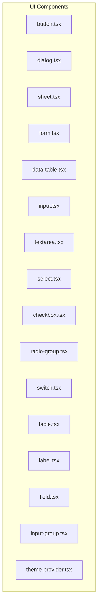
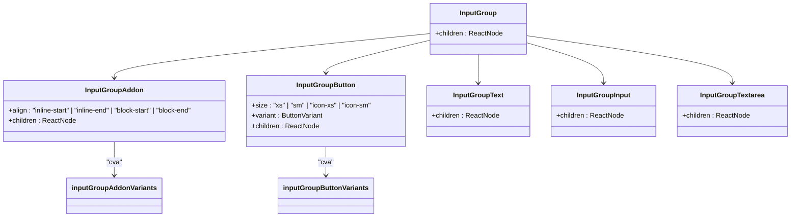
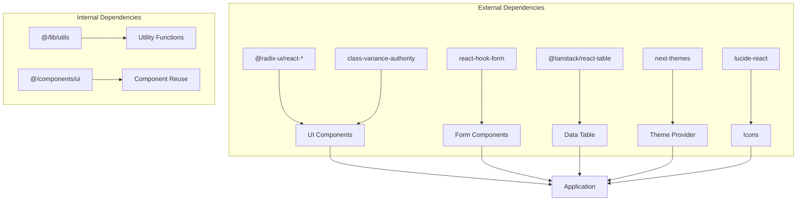

# UI Components

<cite>
**Referenced Files in This Document**   
- [button.tsx](file://components/ui/button.tsx)
- [dialog.tsx](file://components/ui/dialog.tsx)
- [sheet.tsx](file://components/ui/sheet.tsx)
- [form.tsx](file://components/ui/form.tsx)
- [data-table.tsx](file://components/ui/data-table.tsx)
- [input.tsx](file://components/ui/input.tsx)
- [textarea.tsx](file://components/ui/textarea.tsx)
- [select.tsx](file://components/ui/select.tsx)
- [checkbox.tsx](file://components/ui/checkbox.tsx)
- [radio-group.tsx](file://components/ui/radio-group.tsx)
- [switch.tsx](file://components/ui/switch.tsx)
- [table.tsx](file://components/ui/table.tsx)
- [label.tsx](file://components/ui/label.tsx)
- [field.tsx](file://components/ui/field.tsx)
- [input-group.tsx](file://components/ui/input-group.tsx)
- [theme-provider.tsx](file://components/ui/theme-provider.tsx)
</cite>

## Table of Contents
1. [Introduction](#introduction)
2. [Project Structure](#project-structure)
3. [Core Components](#core-components)
4. [Architecture Overview](#architecture-overview)
5. [Detailed Component Analysis](#detailed-component-analysis)
6. [Dependency Analysis](#dependency-analysis)
7. [Performance Considerations](#performance-considerations)
8. [Troubleshooting Guide](#troubleshooting-guide)
9. [Conclusion](#conclusion)

## Introduction
The Sinesys UI Components library provides a comprehensive set of reusable UI elements built on shadcn/ui patterns. This documentation details the implementation of base UI components including buttons, dialogs, forms, data tables, and input controls. The components are designed with accessibility, responsiveness, and theming in mind, following modern React patterns and Tailwind CSS integration.

## Project Structure
The UI components are organized in a modular structure within the components/ui directory. Each component is implemented as a standalone React component with clear props interfaces and styling through Tailwind CSS and class-variance-authority for variant management.



**Diagram sources**
- [button.tsx](file://components/ui/button.tsx)
- [dialog.tsx](file://components/ui/dialog.tsx)
- [sheet.tsx](file://components/ui/sheet.tsx)
- [form.tsx](file://components/ui/form.tsx)
- [data-table.tsx](file://components/ui/data-table.tsx)
- [input.tsx](file://components/ui/input.tsx)
- [textarea.tsx](file://components/ui/textarea.tsx)
- [select.tsx](file://components/ui/select.tsx)
- [checkbox.tsx](file://components/ui/checkbox.tsx)
- [radio-group.tsx](file://components/ui/radio-group.tsx)
- [switch.tsx](file://components/ui/switch.tsx)
- [table.tsx](file://components/ui/table.tsx)
- [label.tsx](file://components/ui/label.tsx)
- [field.tsx](file://components/ui/field.tsx)
- [input-group.tsx](file://components/ui/input-group.tsx)
- [theme-provider.tsx](file://components/ui/theme-provider.tsx)

**Section sources**
- [button.tsx](file://components/ui/button.tsx)
- [dialog.tsx](file://components/ui/dialog.tsx)
- [sheet.tsx](file://components/ui/sheet.tsx)
- [form.tsx](file://components/ui/form.tsx)
- [data-table.tsx](file://components/ui/data-table.tsx)
- [input.tsx](file://components/ui/input.tsx)
- [textarea.tsx](file://components/ui/textarea.tsx)
- [select.tsx](file://components/ui/select.tsx)
- [checkbox.tsx](file://components/ui/checkbox.tsx)
- [radio-group.tsx](file://components/ui/radio-group.tsx)
- [switch.tsx](file://components/ui/switch.tsx)
- [table.tsx](file://components/ui/table.tsx)
- [label.tsx](file://components/ui/label.tsx)
- [field.tsx](file://components/ui/field.tsx)
- [input-group.tsx](file://components/ui/input-group.tsx)
- [theme-provider.tsx](file://components/ui/theme-provider.tsx)

## Core Components
The Sinesys UI Components library implements a comprehensive set of base UI elements following shadcn/ui patterns. These components are built with accessibility, responsiveness, and theming in mind, providing a consistent user experience across the application.

**Section sources**
- [button.tsx](file://components/ui/button.tsx)
- [dialog.tsx](file://components/ui/dialog.tsx)
- [form.tsx](file://components/ui/form.tsx)
- [data-table.tsx](file://components/ui/data-table.tsx)
- [input.tsx](file://components/ui/input.tsx)
- [textarea.tsx](file://components/ui/textarea.tsx)
- [select.tsx](file://components/ui/select.tsx)
- [checkbox.tsx](file://components/ui/checkbox.tsx)
- [radio-group.tsx](file://components/ui/radio-group.tsx)
- [switch.tsx](file://components/ui/switch.tsx)
- [table.tsx](file://components/ui/table.tsx)
- [label.tsx](file://components/ui/label.tsx)
- [field.tsx](file://components/ui/field.tsx)
- [input-group.tsx](file://components/ui/input-group.tsx)
- [theme-provider.tsx](file://components/ui/theme-provider.tsx)

## Architecture Overview
The UI components architecture follows a modular design pattern with clear separation of concerns. Components are built using Radix UI primitives for accessible interactions, styled with Tailwind CSS, and organized with class-variance-authority for variant management.

```mermaid
graph TD
subgraph "UI Architecture"
A[Radix UI Primitives] --> B[Component Implementation]
C[Tailwind CSS] --> B
D[class-variance-authority] --> B
E[react-hook-form] --> F[Form Components]
G[@tanstack/react-table] --> H[Data Table]
I[Next Themes] --> J[Theme Provider]
B --> K[Application]
end
```

**Diagram sources**
- [button.tsx](file://components/ui/button.tsx)
- [dialog.tsx](file://components/ui/dialog.tsx)
- [form.tsx](file://components/ui/form.tsx)
- [data-table.tsx](file://components/ui/data-table.tsx)
- [theme-provider.tsx](file://components/ui/theme-provider.tsx)

## Detailed Component Analysis

### Button Component Analysis
The Button component is a versatile UI element with multiple variants and sizes, built using class-variance-authority for style management.

```mermaid
classDiagram
class Button {
+className : string
+variant : "default" | "destructive" | "outline" | "secondary" | "ghost" | "link"
+size : "default" | "sm" | "lg" | "icon" | "icon-sm" | "icon-lg"
+asChild : boolean
+children : ReactNode
}
Button --> "uses" class-variance-authority : "buttonVariants"
Button --> "@radix-ui/react-slot" : "Slot"
Button --> "@/lib/utils" : "cn"
```

**Diagram sources**
- [button.tsx](file://components/ui/button.tsx#L7-L60)

**Section sources**
- [button.tsx](file://components/ui/button.tsx#L1-L61)

### Dialog and Sheet Components Analysis
The Dialog and Sheet components provide modal interaction patterns with accessibility features and theming support.

```mermaid
classDiagram
class Dialog {
+children : ReactNode
+open : boolean
+onOpenChange : (open : boolean) => void
}
class Sheet {
+children : ReactNode
+open : boolean
+onOpenChange : (open : boolean) => void
+side : "top" | "right" | "bottom" | "left"
}
class DialogContent {
+children : ReactNode
+showCloseButton : boolean
}
class SheetContent {
+children : ReactNode
+side : "top" | "right" | "bottom" | "left"
}
Dialog --> DialogContent
Sheet --> SheetContent
DialogContent --> "@radix-ui/react-dialog"
SheetContent --> "@radix-ui/react-dialog"
```

**Diagram sources**
- [dialog.tsx](file://components/ui/dialog.tsx#L9-L143)
- [sheet.tsx](file://components/ui/sheet.tsx#L9-L139)

**Section sources**
- [dialog.tsx](file://components/ui/dialog.tsx#L1-L144)
- [sheet.tsx](file://components/ui/sheet.tsx#L1-L140)

### Form Components Analysis
The form components provide a comprehensive system for building accessible forms with validation and error handling.

```mermaid
classDiagram
class Form {
+children : ReactNode
}
class FormField {
+name : string
+render : (props : { field : ControllerRenderProps }) => ReactNode
}
class FormItem {
+children : ReactNode
}
class FormLabel {
+children : ReactNode
}
class FormControl {
+children : ReactNode
}
class FormDescription {
+children : ReactNode
}
Form --> FormProvider : "react-hook-form"
FormField --> Controller : "react-hook-form"
FormControl --> Tooltip : "shows validation errors"
FormLabel --> Label : "accessibility"
Form ..> FormItem
FormItem ..> FormLabel
FormItem ..> FormControl
FormItem ..> FormDescription
```

**Diagram sources**
- [form.tsx](file://components/ui/form.tsx#L24-L216)
- [field.tsx](file://components/ui/field.tsx#L81-L94)
- [input.tsx](file://components/ui/input.tsx#L5-L21)
- [textarea.tsx](file://components/ui/textarea.tsx#L5-L18)
- [select.tsx](file://components/ui/select.tsx#L9-L13)
- [checkbox.tsx](file://components/ui/checkbox.tsx#L9-L32)
- [radio-group.tsx](file://components/ui/radio-group.tsx#L9-L45)
- [switch.tsx](file://components/ui/switch.tsx#L8-L31)

**Section sources**
- [form.tsx](file://components/ui/form.tsx#L1-L217)
- [field.tsx](file://components/ui/field.tsx#L1-L249)
- [input.tsx](file://components/ui/input.tsx#L1-L22)
- [textarea.tsx](file://components/ui/textarea.tsx#L1-L19)
- [select.tsx](file://components/ui/select.tsx#L1-L188)
- [checkbox.tsx](file://components/ui/checkbox.tsx#L1-L33)
- [radio-group.tsx](file://components/ui/radio-group.tsx#L1-L46)
- [switch.tsx](file://components/ui/switch.tsx#L1-L32)

### Data Table Component Analysis
The data-table component provides a feature-rich table implementation with sorting, pagination, and filtering capabilities.

```mermaid
classDiagram
class DataTable {
+data : TData[]
+columns : ColumnDef<TData>[]
+pagination : PaginationConfig
+sorting : SortingConfig
+rowSelection : RowSelectionConfig
+isLoading : boolean
+error : string | null
+onRowClick : (row : TData) => void
+emptyMessage : string
}
class PaginationConfig {
+pageIndex : number
+pageSize : number
+total : number
+totalPages : number
+onPageChange : (pageIndex : number) => void
+onPageSizeChange : (pageSize : number) => void
}
class SortingConfig {
+columnId : string | null
+direction : 'asc' | 'desc' | null
+onSortingChange : (columnId : string | null, direction : 'asc' | 'desc' | null) => void
}
class RowSelectionConfig {
+state : RowSelectionState
+onRowSelectionChange : (state : RowSelectionState) => void
+getRowId : (row : TData) => string
}
DataTable --> "@tanstack/react-table" : "useReactTable"
DataTable --> Table : "renders table structure"
DataTable --> Button : "pagination controls"
DataTable --> Select : "page size selector"
DataTable --> Empty : "empty state"
```

**Diagram sources**
- [data-table.tsx](file://components/ui/data-table.tsx#L76-L332)
- [table.tsx](file://components/ui/table.tsx#L5-L95)
- [button.tsx](file://components/ui/button.tsx)
- [select.tsx](file://components/ui/select.tsx)
- [empty.tsx](file://components/ui/empty.tsx)

**Section sources**
- [data-table.tsx](file://components/ui/data-table.tsx#L1-L333)
- [table.tsx](file://components/ui/table.tsx#L1-L96)

### Input Group Component Analysis
The input-group component provides a flexible system for combining inputs with addons, buttons, and text.



**Diagram sources**
- [input-group.tsx](file://components/ui/input-group.tsx#L11-L170)

**Section sources**
- [input-group.tsx](file://components/ui/input-group.tsx#L1-L171)

### Theming System Analysis
The theme provider component integrates Next.js themes with the UI components for dark mode support.

```mermaid
classDiagram
class ThemeProvider {
+children : ReactNode
+attribute : string
+defaultTheme : string
+enableSystem : boolean
+disableTransitionOnChange : boolean
}
ThemeProvider --> "next-themes" : "ThemeProvider"
ThemeProvider --> "Tailwind CSS" : "dark class"
```

**Diagram sources**
- [theme-provider.tsx](file://components/ui/theme-provider.tsx#L6-L8)

**Section sources**
- [theme-provider.tsx](file://components/ui/theme-provider.tsx#L1-L10)

## Dependency Analysis
The UI components library has a well-defined dependency structure with clear separation between UI primitives and external libraries.



**Diagram sources**
- [package.json](file://package.json)
- [button.tsx](file://components/ui/button.tsx)
- [dialog.tsx](file://components/ui/dialog.tsx)
- [form.tsx](file://components/ui/form.tsx)
- [data-table.tsx](file://components/ui/data-table.tsx)
- [theme-provider.tsx](file://components/ui/theme-provider.tsx)

**Section sources**
- [package.json](file://package.json)
- [button.tsx](file://components/ui/button.tsx)
- [dialog.tsx](file://components/ui/dialog.tsx)
- [form.tsx](file://components/ui/form.tsx)
- [data-table.tsx](file://components/ui/data-table.tsx)
- [theme-provider.tsx](file://components/ui/theme-provider.tsx)

## Performance Considerations
The UI components are designed with performance in mind, particularly for rendering large data sets in tables and virtualized lists. The data-table component implements server-side pagination and sorting to minimize client-side processing. Form components use React Hook Form for efficient form state management with minimal re-renders. The theme provider leverages Next.js themes for efficient theme switching without full page reloads.

**Section sources**
- [data-table.tsx](file://components/ui/data-table.tsx)
- [form.tsx](file://components/ui/form.tsx)
- [theme-provider.tsx](file://components/ui/theme-provider.tsx)

## Troubleshooting Guide
When implementing UI components, ensure proper accessibility by using semantic HTML and ARIA attributes. For form validation, ensure error messages are properly displayed and accessible to screen readers. When using the data-table component with large data sets, implement server-side pagination and sorting to maintain performance. For theme switching issues, verify the theme provider is properly configured in the application layout.

**Section sources**
- [form.tsx](file://components/ui/form.tsx)
- [data-table.tsx](file://components/ui/data-table.tsx)
- [theme-provider.tsx](file://components/ui/theme-provider.tsx)

## Conclusion
The Sinesys UI Components library provides a comprehensive set of accessible, responsive, and themeable UI elements built on modern React patterns. The components follow shadcn/ui conventions with clear props interfaces, variant management through class-variance-authority, and integration with popular libraries like react-hook-form and @tanstack/react-table. The library supports dark mode through Next.js themes and provides extensive customization options for styling and behavior.