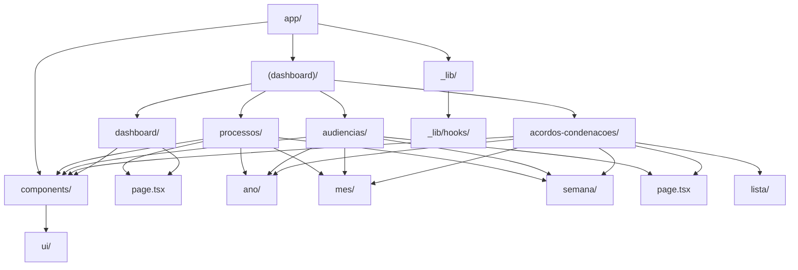
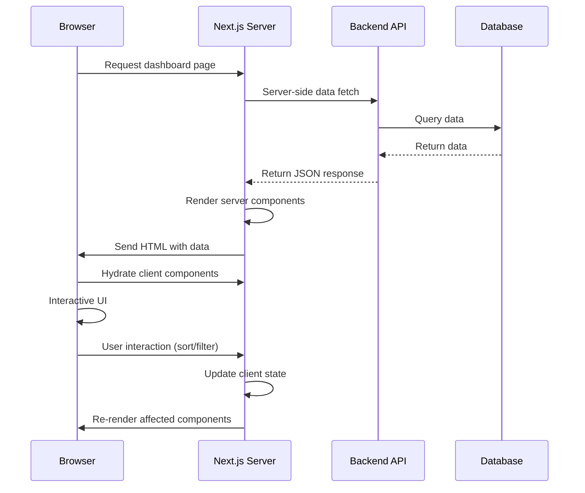
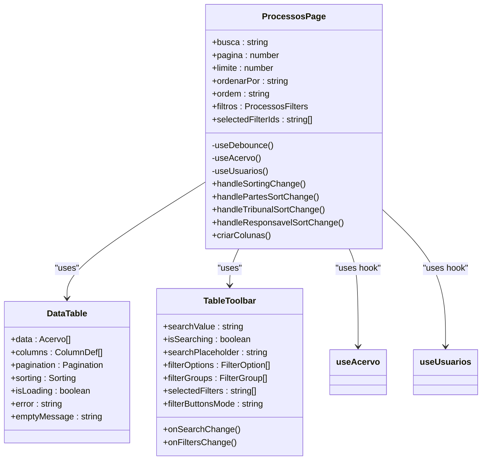
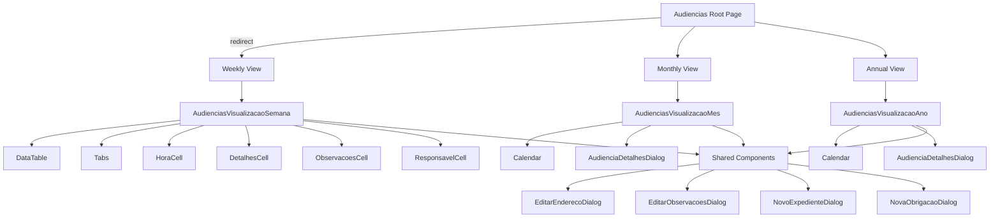
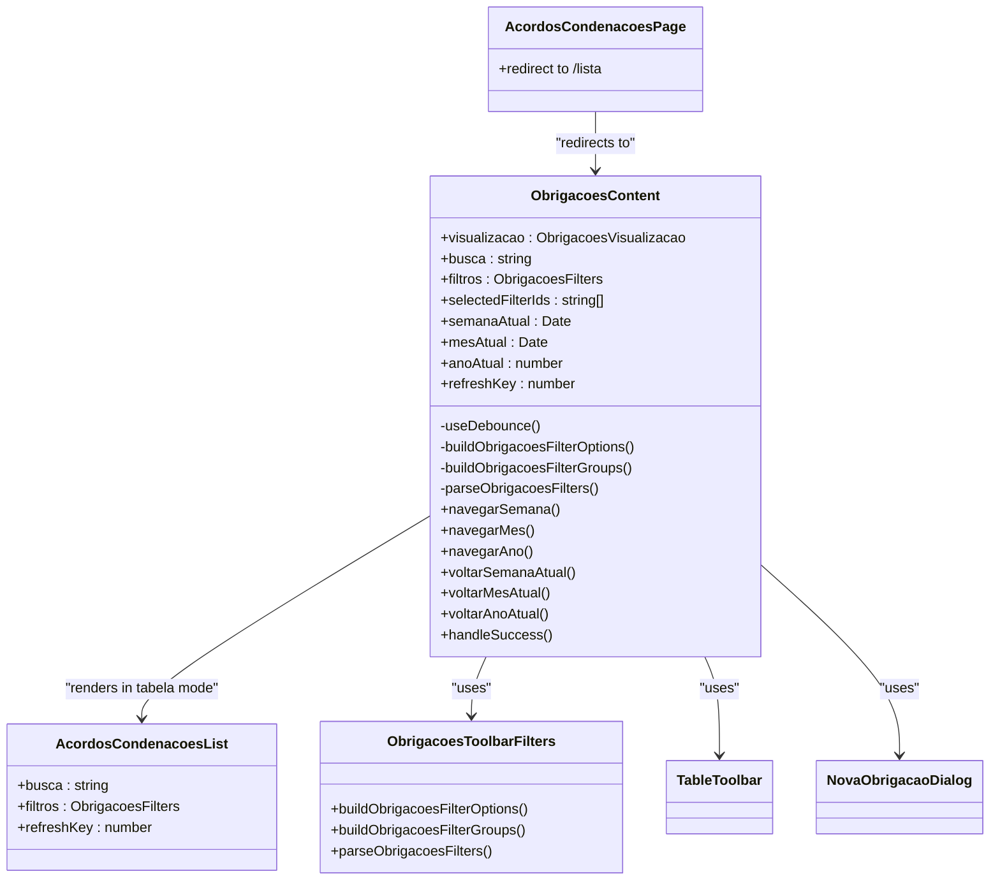
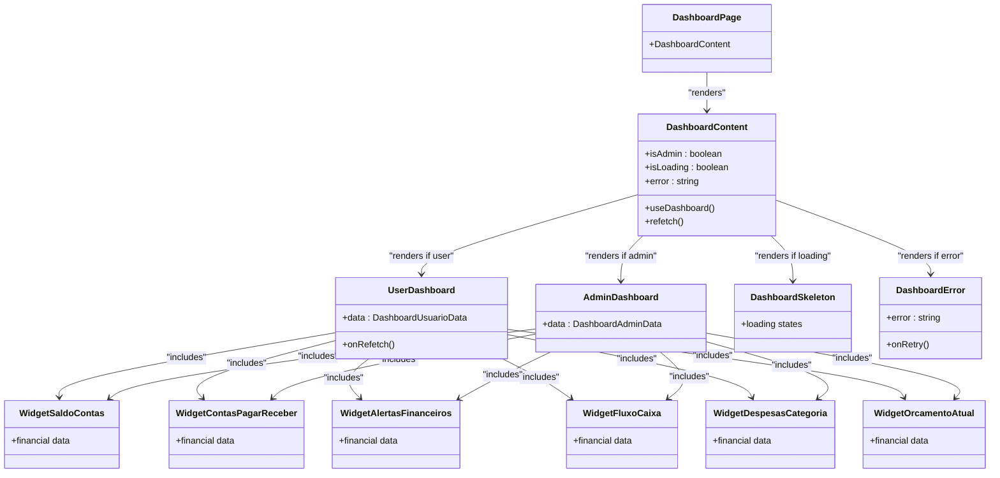

# Dashboard UI

<cite>
**Referenced Files in This Document**   
- [processos/page.tsx](file://app/(dashboard)/processos/page.tsx)
- [audiencias/page.tsx](file://app/(dashboard)/audiencias/page.tsx)
- [acordos-condenacoes/page.tsx](file://app/(dashboard)/acordos-condenacoes/page.tsx)
- [dashboard/page.tsx](file://app/(dashboard)/dashboard/page.tsx)
- [dashboard/components/dashboard-content.tsx](file://app/(dashboard)/dashboard/components/dashboard-content.tsx)
- [processos/components/processos-toolbar-filters.tsx](file://app/(dashboard)/processos/components/processos-toolbar-filters.tsx)
- [audiencias/components/audiencias-visualizacao-semana.tsx](file://app/(dashboard)/audiencias/components/audiencias-visualizacao-semana.tsx)
- [audiencias/components/audiencias-visualizacao-mes.tsx](file://app/(dashboard)/audiencias/components/audiencias-visualizacao-mes.tsx)
- [audiencias/components/audiencias-visualizacao-ano.tsx](file://app/(dashboard)/audiencias/components/audiencias-visualizacao-ano.tsx)
- [acordos-condenacoes/components/obrigacoes-content.tsx](file://app/(dashboard)/acordos-condenacoes/components/obrigacoes-content.tsx)
- [layout.tsx](file://app/layout.tsx)
</cite>

## Table of Contents
1. [Introduction](#introduction)
2. [Project Structure](#project-structure)
3. [Core Components](#core-components)
4. [Architecture Overview](#architecture-overview)
5. [Detailed Component Analysis](#detailed-component-analysis)
6. [Dependency Analysis](#dependency-analysis)
7. [Performance Considerations](#performance-considerations)
8. [Troubleshooting Guide](#troubleshooting-guide)
9. [Conclusion](#conclusion)

## Introduction
The Sinesys Dashboard UI is a comprehensive legal management system built with Next.js App Router and React Server Components. This documentation provides a detailed explanation of the implementation of key dashboard pages such as processos, audiencias, and acordos-condenacoes. The system leverages server-side data fetching to populate client components with interactive elements, creating a responsive and efficient user experience. The dashboard features various data visualization widgets, responsive views (ano, mes, semana), and sophisticated filtering mechanisms that enable users to efficiently manage legal processes, hearings, and agreements.

**Section sources**
- [layout.tsx](file://app/layout.tsx#L1-L72)

## Project Structure
The Sinesys Dashboard UI follows a well-organized directory structure based on the Next.js App Router pattern. The main dashboard pages are located under the `app/(dashboard)/` directory, with each major feature having its own subdirectory (processos, audiencias, acordos-condenacoes, dashboard). Each feature directory contains page components, specialized components, and view-specific implementations (ano, mes, semana). The application uses React Server Components for server-side rendering and data fetching, with client components imported using the 'use client' directive when interactivity is required. Shared UI components are located in the `components/ui/` directory, while business logic and data fetching hooks are organized in `app/_lib/hooks/`.

**Diagram sources **
- [processos/page.tsx](file://app/(dashboard)/processos/page.tsx)
- [audiencias/page.tsx](file://app/(dashboard)/audiencias/page.tsx)
- [acordos-condenacoes/page.tsx](file://app/(dashboard)/acordos-condenacoes/page.tsx)
- [dashboard/page.tsx](file://app/(dashboard)/dashboard/page.tsx)

## Core Components
The Sinesys Dashboard UI implements several core components that provide the foundation for the application's functionality. These include data tables with advanced filtering and sorting capabilities, visualization widgets for financial data, and responsive calendar views for scheduling. The dashboard uses React Server Components to fetch data on the server side, which is then passed to client components for interactive elements. Key components include the DataTable for displaying process information, TableToolbar for search and filtering, and specialized visualization components like WidgetSaldoContas and WidgetFluxoCaixa for financial data representation.

**Section sources**
- [processos/page.tsx](file://app/(dashboard)/processos/page.tsx#L1-L762)
- [dashboard/components/dashboard-content.tsx](file://app/(dashboard)/dashboard/components/dashboard-content.tsx#L1-L191)

## Architecture Overview
The Sinesys Dashboard UI follows a modern Next.js App Router architecture with React Server Components. The application implements a hybrid rendering approach where server components handle data fetching and initial rendering, while client components manage interactivity and state. Data is fetched server-side using custom hooks like useAcervo and useDashboard, which retrieve information from API endpoints. This data is then passed to client components through props, enabling interactive features like sorting, filtering, and real-time updates. The architecture separates concerns effectively, with dedicated components for data fetching, presentation, and user interaction.

**Diagram sources **
- [processos/page.tsx](file://app/(dashboard)/processos/page.tsx#L1-L762)
- [dashboard/components/dashboard-content.tsx](file://app/(dashboard)/dashboard/components/dashboard-content.tsx#L1-L191)

## Detailed Component Analysis

### Processos Page Analysis
The processos page implements a comprehensive interface for managing legal processes with advanced filtering, sorting, and visualization capabilities. The page uses server-side data fetching to retrieve process information, which is then displayed in a DataTable component with customizable columns. Users can search processes, apply filters through the TableToolbar, and sort by various criteria including tribunal (TRT), degree (grau), and responsible party. The implementation includes specialized components for displaying process information, handling responsible party assignment, and formatting data for Brazilian legal standards.

**Diagram sources **
- [processos/page.tsx](file://app/(dashboard)/processos/page.tsx#L1-L762)
- [processos/components/processos-toolbar-filters.tsx](file://app/(dashboard)/processos/components/processos-toolbar-filters.tsx#L1-L220)

### Audiencias Page Analysis
The audiencias page implements a sophisticated scheduling interface with multiple view modes (week, month, year) for managing court hearings. The page architecture follows a redirect pattern, automatically routing users to the weekly view as the default. The weekly view presents hearings in a tabbed interface organized by day of the week, while the monthly and annual views use calendar components with visual indicators for days containing hearings. Each view mode is implemented as a separate component that shares common functionality through props and callbacks.

**Diagram sources **
- [audiencias/page.tsx](file://app/(dashboard)/audiencias/page.tsx#L1-L10)
- [audiencias/components/audiencias-visualizacao-semana.tsx](file://app/(dashboard)/audiencias/components/audiencias-visualizacao-semana.tsx#L1-L800)
- [audiencias/components/audiencias-visualizacao-mes.tsx](file://app/(dashboard)/audiencias/components/audiencias-visualizacao-mes.tsx#L1-L70)
- [audiencias/components/audiencias-visualizacao-ano.tsx](file://app/(dashboard)/audiencias/components/audiencias-visualizacao-ano.tsx#L1-L71)

### Acordos Condenacoes Page Analysis
The acordos-condenacoes page implements a financial agreements management system with multiple visualization modes. The page follows a redirect pattern to the list view, providing users with a table-based interface for managing obligations. The implementation includes a shared ObrigacoesContent component that orchestrates different view modes (tabela, semana, mes, ano) and manages state for search, filtering, and navigation. The page features a comprehensive toolbar with search functionality, filter groups, and controls for creating new obligations.

**Diagram sources **
- [acordos-condenacoes/page.tsx](file://app/(dashboard)/acordos-condenacoes/page.tsx#L1-L10)
- [acordos-condenacoes/components/obrigacoes-content.tsx](file://app/(dashboard)/acordos-condenacoes/components/obrigacoes-content.tsx#L1-L288)

### Dashboard Page Analysis
The dashboard page implements a personalized overview interface with financial widgets and user-specific content. The implementation uses a conditional rendering pattern based on user role (admin vs. regular user), displaying different content and widgets accordingly. The dashboard features a modular architecture with reusable widget components and a sortable layout that allows users to customize their view. The page handles loading states, error boundaries, and data refresh functionality to ensure a reliable user experience.

**Diagram sources **
- [dashboard/page.tsx](file://app/(dashboard)/dashboard/page.tsx#L1-L10)
- [dashboard/components/dashboard-content.tsx](file://app/(dashboard)/dashboard/components/dashboard-content.tsx#L1-L191)

## Dependency Analysis
The Sinesys Dashboard UI has a well-defined dependency structure that separates concerns and promotes reusability. The application relies heavily on Next.js App Router features, React Server Components, and custom hooks for data fetching. UI components are built using a combination of ShadCN UI primitives and custom implementations. The dependency graph shows a clear separation between server-side data fetching components and client-side interactive components. Key dependencies include React for component management, Lucide React for icons, and TanStack React Table for data table functionality. The application also uses Supabase for backend services and data storage.

```mermaid
graph TD
A[Dashboard UI] --> B[Next.js App Router]
A --> C[React Server Components]
A --> D[React Client Components]
B --> E[Server-side Rendering]
B --> F[Client-side Hydration]
B --> G[Route Handlers]
C --> H[Data Fetching]
C --> I[Server Actions]
D --> J[State Management]
D --> K[Event Handling]
A --> L[ShadCN UI]
L --> M[Button]
L --> N[DataTable]
L --> O[TableToolbar]
L --> P[Popover]
L --> Q[Tooltip]
L --> R[Badge]
L --> S[Calendar]
L --> T[Tabs]
A --> U[Lucide React]
U --> V[Icons: ArrowUpDown, Eye, Pencil, etc.]
A --> W[TanStack React Table]
W --> X[Column Definitions]
W --> Y[Sorting]
W --> Z[Filtering]
W --> AA[Pagination]
A --> AB[Supabase]
AB --> AC[Authentication]
AB --> AD[Database]
AB --> AE[Storage]
A --> AF[Custom Hooks]
AF --> AG[useAcervo]
AF --> AH[useDashboard]
AF --> AI[useUsuarios]
AF --> AJ[useDebounce]
```

**Diagram sources **
- [processos/page.tsx](file://app/(dashboard)/processos/page.tsx#L1-L762)
- [dashboard/components/dashboard-content.tsx](file://app/(dashboard)/dashboard/components/dashboard-content.tsx#L1-L191)
- [audiencias/components/audiencias-visualizacao-semana.tsx](file://app/(dashboard)/audiencias/components/audiencias-visualizacao-semana.tsx#L1-L800)

## Performance Considerations
The Sinesys Dashboard UI implements several performance optimization strategies to handle large datasets and ensure a responsive user experience. The application uses React Server Components to minimize client-side JavaScript bundle size and reduce initial load time. Data fetching is optimized with server-side queries and pagination to prevent loading excessive data at once. Client-side performance is enhanced through memoization of expensive computations using React.useMemo, debounced search functionality to prevent excessive API calls, and virtualized rendering for large lists. The dashboard also implements loading skeletons to provide immediate visual feedback during data fetching and error boundaries to gracefully handle failures without disrupting the entire application.

**Section sources**
- [processos/page.tsx](file://app/(dashboard)/processos/page.tsx#L1-L762)
- [dashboard/components/dashboard-content.tsx](file://app/(dashboard)/dashboard/components/dashboard-content.tsx#L1-L191)
- [audiencias/components/audiencias-visualizacao-semana.tsx](file://app/(dashboard)/audiencias/components/audiencias-visualizacao-semana.tsx#L1-L800)

## Troubleshooting Guide
When encountering issues with the Sinesys Dashboard UI, consider the following common problems and solutions:

1. **Data Loading Issues**: If data fails to load, check the network tab for API errors. The dashboard implements error boundaries that display user-friendly messages and retry buttons. Ensure the backend services are running and accessible.

2. **Filtering and Sorting Problems**: If filters or sorting don't work as expected, verify that the filter configurations in components like processos-toolbar-filters.tsx are correctly defined. Check that the API endpoints support the requested filtering and sorting parameters.

3. **Responsive View Navigation**: For issues with week/month/year navigation in audiencias or acordos-condenacoes views, ensure that date state management is properly initialized. The use of React.useEffect to set initial dates helps prevent hydration mismatches.

4. **Interactive Component Failures**: If client components like dialogs or buttons don't respond, verify that the 'use client' directive is present in the component file. Check for JavaScript errors in the console that might prevent component hydration.

5. **Performance with Large Datasets**: For slow performance with large datasets, ensure that pagination is properly implemented and that only necessary data is fetched server-side. Consider implementing virtualized scrolling for long lists.

**Section sources**
- [processos/page.tsx](file://app/(dashboard)/processos/page.tsx#L1-L762)
- [dashboard/components/dashboard-content.tsx](file://app/(dashboard)/dashboard/components/dashboard-content.tsx#L1-L191)
- [audiencias/components/audiencias-visualizacao-semana.tsx](file://app/(dashboard)/audiencias/components/audiencias-visualizacao-semana.tsx#L1-L800)

## Conclusion
The Sinesys Dashboard UI demonstrates a sophisticated implementation of Next.js App Router with React Server Components for building a comprehensive legal management system. The architecture effectively separates server-side data fetching from client-side interactivity, resulting in a fast and responsive user experience. Key features like the processos, audiencias, and acordos-condenacoes pages showcase advanced data visualization, filtering, and navigation capabilities that cater to the specific needs of legal professionals. The dashboard's modular design, with reusable components and clear separation of concerns, makes it maintainable and extensible. By leveraging modern React patterns and performance optimizations, the application provides a robust foundation for managing complex legal workflows while remaining accessible to users with varying technical expertise.