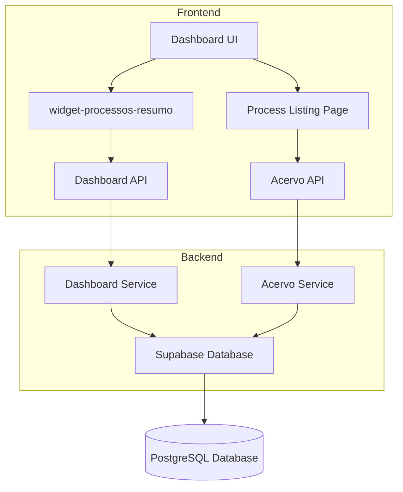
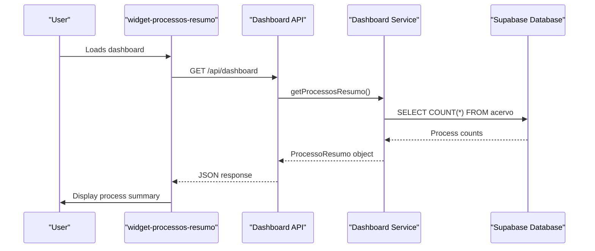
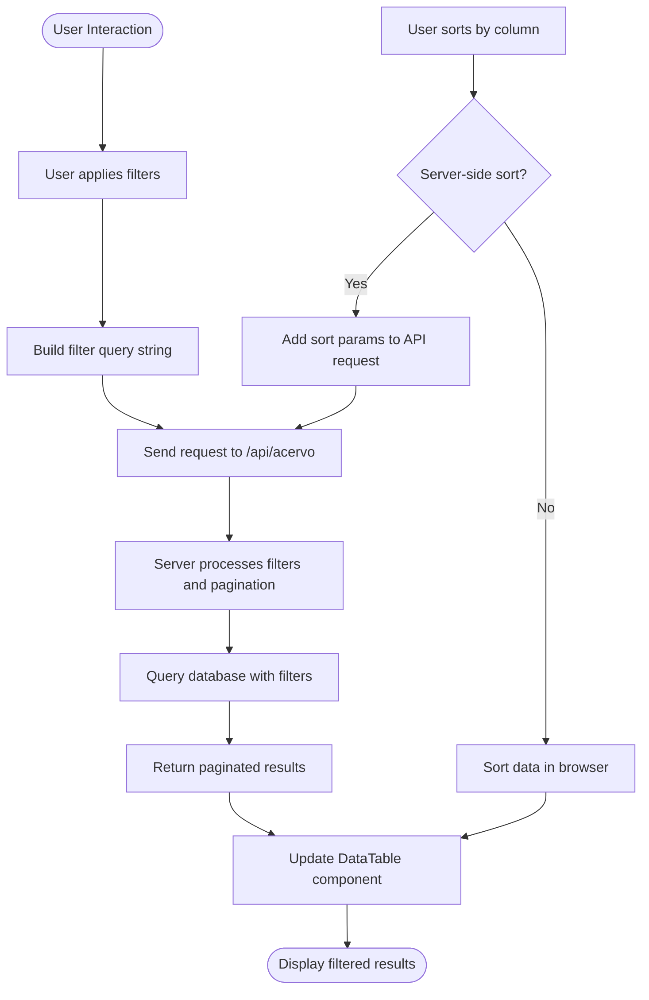

# Process Visualization

<cite>
**Referenced Files in This Document**   
- [widget-processos-resumo.tsx](file://app/(dashboard)/dashboard/components/widgets/widget-processos-resumo.tsx)
- [page.tsx](file://app/(dashboard)/processos/page.tsx)
- [dashboard-content.tsx](file://app/(dashboard)/dashboard/components/dashboard-content.tsx)
- [dashboard-grid.tsx](file://app/(dashboard)/dashboard/components/dashboard-grid.tsx)
- [dashboard-api.ts](file://app/_lib/dashboard-api.ts)
- [dashboard-types.ts](file://app/_lib/dashboard-types.ts)
- [dashboard-api.ts](file://app/api/dashboard-api.ts)
- [dashboard-processos.persistence.ts](file://backend/dashboard/services/persistence/dashboard-processos.persistence.ts)
- [processos-toolbar-filters.tsx](file://app/(dashboard)/processos/components/processos-toolbar-filters.tsx)
- [use-acervo.ts](file://app/_lib/hooks/use-acervo.ts)
</cite>

## Table of Contents
1. [Introduction](#introduction)
2. [Core Components](#core-components)
3. [Architecture Overview](#architecture-overview)
4. [Data Aggregation and Display](#data-aggregation-and-display)
5. [Filtering, Sorting, and Pagination](#filtering-sorting-and-pagination)
6. [Relationship with Full Process Management](#relationship-with-full-process-management)
7. [Performance Optimization and Error Handling](#performance-optimization-and-error-handling)
8. [Customization Options](#customization-options)
9. [Conclusion](#conclusion)

## Introduction
The Process Visualization feature in the Sinesys Dashboard UI provides a comprehensive overview of legal processes, enabling users to monitor their case load efficiently. This documentation details the implementation of the widget-processos-resumo component, its integration within the main dashboard layout, and the mechanisms for filtering, sorting, and pagination of process listings. The system is designed to handle large volumes of processes while maintaining optimal performance and providing meaningful insights through visual summaries.

## Core Components

The Process Visualization feature is built around several key components that work together to provide a seamless user experience. The primary component is the widget-processos-resumo, which displays a summary of processes on the dashboard. This widget is integrated into the main dashboard layout through the dashboard-content and dashboard-grid components. The process listing page provides a detailed view with advanced filtering and sorting capabilities.

**Section sources**
- [widget-processos-resumo.tsx](file://app/(dashboard)/dashboard/components/widgets/widget-processos-resumo.tsx)
- [dashboard-content.tsx](file://app/(dashboard)/dashboard/components/dashboard-content.tsx)
- [dashboard-grid.tsx](file://app/(dashboard)/dashboard/components/dashboard-grid.tsx)

## Architecture Overview

The Process Visualization feature follows a client-server architecture with clear separation of concerns. The frontend components are built using React with Next.js, while the backend services handle data processing and aggregation. The system uses a combination of server-side and client-side processing to optimize performance and user experience.

**Diagram sources**
- [widget-processos-resumo.tsx](file://app/(dashboard)/dashboard/components/widgets/widget-processos-resumo.tsx)
- [page.tsx](file://app/(dashboard)/processos/page.tsx)
- [dashboard-api.ts](file://app/_lib/dashboard-api.ts)
- [dashboard-processos.persistence.ts](file://backend/dashboard/services/persistence/dashboard-processos.persistence.ts)

## Data Aggregation and Display

The widget-processos-resumo component displays aggregated process data in a visually intuitive format. The data is fetched from the backend through the dashboard API, which aggregates information from the acervo table in the database. The widget shows key metrics including total processes, active vs. archived counts, distribution by tribunal (TRT), and distribution by judicial degree.

The data aggregation is performed in the backend service, specifically in the getProcessosResumo function. This function queries the acervo table, counts processes by various criteria, and returns a structured summary object. The frontend component then visualizes this data using a combination of numerical displays, a mini donut chart, and badge-based representations for tribunal and degree distributions.

**Diagram sources**
- [widget-processos-resumo.tsx](file://app/(dashboard)/dashboard/components/widgets/widget-processos-resumo.tsx)
- [dashboard-api.ts](file://app/_lib/dashboard-api.ts)
- [dashboard-processos.persistence.ts](file://backend/dashboard/services/persistence/dashboard-processos.persistence.ts)

## Filtering, Sorting, and Pagination

The process listing page implements comprehensive filtering, sorting, and pagination mechanisms to handle large volumes of processes. The filtering system is built around the processos-toolbar-filters component, which provides a flexible interface for users to refine their process view. The system supports various filter types including select, text, boolean, and date filters for criteria such as tribunal, judicial degree, origin, party names, and dates.

Sorting is implemented through a combination of server-side and client-side processing. Basic sorting by fields like filing date and process number is handled server-side through the acervo API. More complex sorting, such as by tribunal or degree, is performed client-side after the data is retrieved. This approach balances performance with functionality, ensuring that common sorting operations are efficient while still supporting more specialized sorting requirements.

Pagination is implemented using a standard page-based approach with configurable page size. The useAcervo hook manages the pagination state and automatically fetches the appropriate data page when the user navigates. The system includes error handling and loading states to provide feedback during data retrieval operations.

**Diagram sources**
- [page.tsx](file://app/(dashboard)/processos/page.tsx)
- [processos-toolbar-filters.tsx](file://app/(dashboard)/processos/components/processos-toolbar-filters.tsx)
- [use-acervo.ts](file://app/_lib/hooks/use-acervo.ts)

## Relationship with Full Process Management

The Process Visualization feature is closely integrated with the full process management system. The widget-processos-resumo on the dashboard provides a high-level summary that links to the detailed process management page. This relationship enables users to quickly navigate from an overview to detailed case information.

The data model used in the visualization is consistent with the full process management system, ensuring that information is synchronized across the application. When users update process information in the detailed view, these changes are reflected in the dashboard summary after the next data refresh. This integration creates a cohesive user experience where the dashboard serves as a starting point for deeper process exploration and management.

The relationship between the components is defined through shared data types and APIs. The ProcessoResumo interface used by the dashboard widget is part of the shared dashboard-types, ensuring type safety and consistency. The acervo API serves both the visualization components and the full process management pages, providing a single source of truth for process data.

**Section sources**
- [widget-processos-resumo.tsx](file://app/(dashboard)/dashboard/components/widgets/widget-processos-resumo.tsx)
- [page.tsx](file://app/(dashboard)/processos/page.tsx)
- [dashboard-types.ts](file://app/_lib/dashboard-types.ts)

## Performance Optimization and Error Handling

The Process Visualization feature includes several performance optimization strategies to handle large volumes of processes efficiently. The system implements data fetching optimizations such as query parameter memoization in the useAcervo hook, which prevents unnecessary re-fetching when parameters haven't changed. The dashboard widget uses server-side aggregation to minimize data transfer, retrieving only summary statistics rather than individual process records.

For error handling, the system implements comprehensive error states at multiple levels. The widget-processos-resumo component includes an error prop that displays error messages when data retrieval fails. The dashboard-content component provides a general error state with a retry mechanism. The useAcervo hook includes error handling with appropriate error messages and fallback states.

The system also addresses performance concerns related to large datasets through pagination and lazy loading. The process listing page limits the number of records displayed per page and only loads additional pages when requested by the user. This approach ensures that the interface remains responsive even with thousands of processes in the database.

**Section sources**
- [widget-processos-resumo.tsx](file://app/(dashboard)/dashboard/components/widgets/widget-processos-resumo.tsx)
- [dashboard-content.tsx](file://app/(dashboard)/dashboard/components/dashboard-content.tsx)
- [use-acervo.ts](file://app/_lib/hooks/use-acervo.ts)

## Customization Options

The Process Visualization feature offers several customization options for displaying key process metrics and status summaries. The widget-processos-resumo component accepts props that allow for customization of its appearance and behavior, including loading states, error messages, and class names for styling. The component can be easily integrated into different dashboard layouts by adjusting its className prop.

The filtering system provides extensive customization through the processos-toolbar-filters configuration. Administrators can modify the available filter options by updating the PROCESSOS_FILTER_CONFIGS array, adding or removing filter types as needed. The filter groups are organized into logical categories such as Tribunal, Grau, Origem, and Características, which can be reorganized or extended to meet specific organizational requirements.

The data visualization elements are also customizable. The mini donut chart uses configurable color schemes defined in the CHART_COLORS and CHART_PALETTE constants, which can be modified to match different branding requirements. The badge styling for tribunal and degree indicators uses dynamic color classes that can be adjusted to change the visual appearance of these elements.

**Section sources**
- [widget-processos-resumo.tsx](file://app/(dashboard)/dashboard/components/widgets/widget-processos-resumo.tsx)
- [processos-toolbar-filters.tsx](file://app/(dashboard)/processos/components/processos-toolbar-filters.tsx)

## Conclusion

The Process Visualization feature in the Sinesys Dashboard UI provides a robust and efficient way to monitor and manage legal processes. By combining server-side data aggregation with client-side interactivity, the system delivers a responsive user experience even with large datasets. The integration between the dashboard summary widget and the full process management page creates a seamless workflow for users, allowing them to quickly navigate from overview to detailed case information.

The implementation demonstrates best practices in web application architecture, with clear separation of concerns between frontend and backend components, consistent data modeling, and thoughtful performance optimization. The flexible filtering, sorting, and pagination mechanisms enable users to efficiently find and organize their processes, while the comprehensive error handling ensures reliability in various network conditions.

Future enhancements could include additional visualization options, such as timeline views or geographic distributions, and more advanced filtering capabilities like saved filter presets. The modular architecture of the system makes it well-suited for these types of extensions while maintaining the core functionality and performance characteristics.