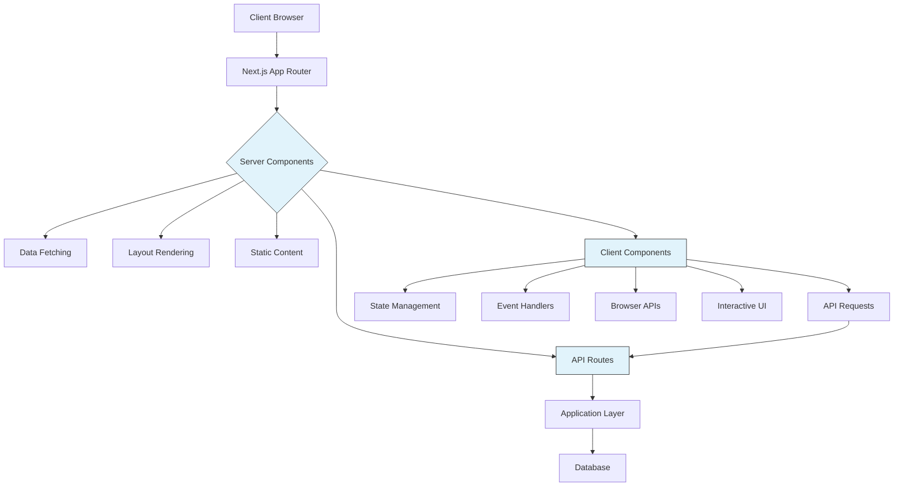
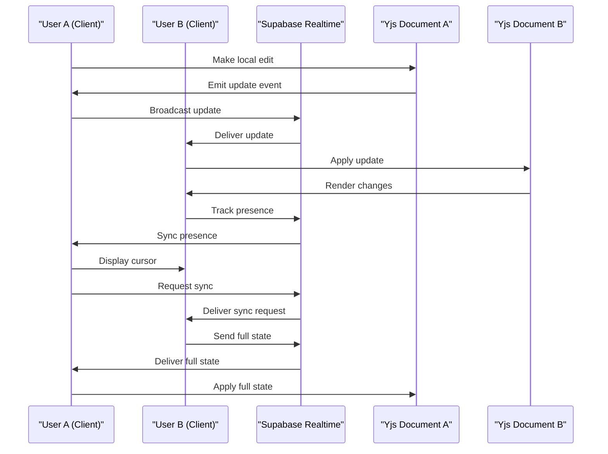
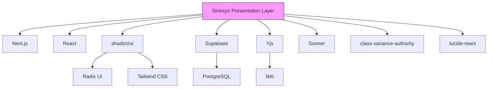

# Presentation Layer

<cite>
**Referenced Files in This Document**   
- [app/layout.tsx](file://app/layout.tsx)
- [app/(dashboard)/layout.tsx](file://app/(dashboard)/layout.tsx)
- [app/(dashboard)/acordos-condenacoes/page.tsx](file://app/(dashboard)/acordos-condenacoes/page.tsx)
- [app/(dashboard)/audiencias/page.tsx](file://app/(dashboard)/audiencias/page.tsx)
- [components/layout/app-sidebar.tsx](file://components/layout/app-sidebar.tsx)
- [components/ui/button.tsx](file://components/ui/button.tsx)
- [components/plate/yjs-kit.tsx](file://components/plate/yjs-kit.tsx)
- [components/plate/collaborative-plate-editor.tsx](file://components/plate/collaborative-plate-editor.tsx)
- [lib/yjs/supabase-provider.ts](file://lib/yjs/supabase-provider.ts)
- [lib/yjs/supabase-yjs-provider.ts](file://lib/yjs/supabase-yjs-provider.ts)
- [hooks/use-realtime-collaboration.ts](file://hooks/use-realtime-collaboration.ts)
- [components/ui/theme-provider.tsx](file://components/ui/theme-provider.tsx)
</cite>

## Table of Contents
1. [Introduction](#introduction)
2. [Project Structure](#project-structure)
3. [Core Components](#core-components)
4. [Architecture Overview](#architecture-overview)
5. [Detailed Component Analysis](#detailed-component-analysis)
6. [Dependency Analysis](#dependency-analysis)
7. [Performance Considerations](#performance-considerations)
8. [Troubleshooting Guide](#troubleshooting-guide)
9. [Conclusion](#conclusion)

## Introduction
The Sinesys Presentation Layer is a modern, scalable user interface implementation built with Next.js App Router and React Server Components. This documentation provides a comprehensive architectural overview of how the presentation layer delivers a responsive, accessible, and collaborative user experience for legal professionals. The system leverages React Server Components to enable server-side rendering while maintaining interactivity through Client Components, creating a seamless blend of performance and functionality. The UI is organized around the Next.js App Router structure with a focus on dashboard-based navigation, featuring specialized views for legal workflows such as agreements, condemnations, and hearings. The implementation uses shadcn/ui as a foundational component library, extended with custom UI components to ensure design consistency across the application.

**Section sources**
- [app/layout.tsx](file://app/layout.tsx#L1-L72)
- [app/(dashboard)/layout.tsx](file://app/(dashboard)/layout.tsx#L1-L22)

## Project Structure
The Sinesys application follows a well-organized directory structure centered around the Next.js App Router paradigm. The `app/` directory serves as the root for all routes and layouts, with the `(dashboard)` directory grouping all authenticated user interface components. Within `(dashboard)`, feature-specific directories such as `acordos-condenacoes/`, `audiencias/`, `processos/`, and `documentos/` contain their respective page components and nested route structures. Each feature directory typically includes subdirectories for different views (e.g., `semana/`, `mes/`, `ano/`, `lista/`) and a `components/` directory for feature-specific UI elements. The `components/` directory at the root level contains reusable UI components organized into subdirectories such as `layout/`, `ui/`, `plate/`, and feature-specific collections like `assinatura-digital/` and `documentos/`. The `lib/` directory houses utility functions, hooks, and integration code, while the `hooks/` directory contains custom React hooks for state management and data fetching.

```mermaid
graph TD
A[app/] --> B[(dashboard)/]
A --> C[components/]
A --> D[lib/]
A --> E[hooks/]
B --> F[acordos-condenacoes/]
B --> G[audiencias/]
B --> H[processos/]
B --> I[documentos/]
F --> J[components/]
F --> K[lista/]
F --> L[semana/]
F --> M[mes/]
F --> N[ano/]
G --> O[components/]
G --> P[lista/]
G --> Q[semana/]
G --> R[mes/]
G --> S[ano/]
C --> T[layout/]
C --> U[ui/]
C --> V[plate/]
C --> W[assinatura-digital/]
C --> X[documentos/]
T --> Y[app-sidebar.tsx]
T --> Z[nav-main.tsx]
T --> AA[nav-projects.tsx]
U --> AB[button.tsx]
U --> AC[card.tsx]
U --> AD[table.tsx]
U --> AE[form.tsx]
V --> AF[collaborative-plate-editor.tsx]
V --> AG[yjs-kit.tsx]
style A fill:#f9f,stroke:#333
style B fill:#f9f,stroke:#333
style C fill:#f9f,stroke:#333
```

**Diagram sources **
- [app/layout.tsx](file://app/layout.tsx#L1-L72)
- [app/(dashboard)/layout.tsx](file://app/(dashboard)/layout.tsx#L1-L22)
- [components/layout/app-sidebar.tsx](file://components/layout/app-sidebar.tsx#L1-L258)

**Section sources**
- [app/layout.tsx](file://app/layout.tsx#L1-L72)
- [app/(dashboard)/layout.tsx](file://app/(dashboard)/layout.tsx#L1-L22)
- [components/layout/app-sidebar.tsx](file://components/layout/app-sidebar.tsx#L1-L258)

## Core Components
The core components of the Sinesys Presentation Layer are designed to provide a consistent, accessible, and performant user experience. The application leverages React Server Components extensively to render UI on the server, reducing client-side JavaScript bundle size and improving initial load performance. Server Components are used for data fetching, layout rendering, and static content, while Client Components are employed for interactive elements that require state management, event handlers, and browser APIs. The `ThemeProvider` component wraps the entire application, enabling dark mode and system preference detection through the `next-themes` library. The `AppSidebar` component provides a persistent navigation interface with collapsible sections for core functionalities, services, and administration. UI components from shadcn/ui form the foundation of the design system, with custom variants and extensions implemented to meet specific legal workflow requirements. The `Toaster` component from `sonner` provides consistent notification feedback across the application.

**Section sources**
- [app/layout.tsx](file://app/layout.tsx#L1-L72)
- [components/ui/theme-provider.tsx](file://components/ui/theme-provider.tsx#L1-L10)
- [components/layout/app-sidebar.tsx](file://components/layout/app-sidebar.tsx#L1-L258)
- [components/ui/button.tsx](file://components/ui/button.tsx#L1-L61)

## Architecture Overview
The Sinesys Presentation Layer architecture is built on the Next.js App Router with a clear separation between Server Components and Client Components. The application root layout in `app/layout.tsx` defines the overall structure, including metadata, viewport settings, and global providers. The dashboard layout in `app/(dashboard)/layout.tsx` wraps authenticated routes with the `SidebarProvider` and `CopilotProviderWrapper`, establishing the navigation context and AI assistant integration. Feature pages such as `acordos-condenacoes/page.tsx` and `audiencias/page.tsx` serve as entry points that redirect to specific views within each feature domain. Data flows from the server to client through React Server Components that fetch data and pass it as props to Client Components that handle interactivity. The architecture leverages React's server-client component boundary to optimize performance, with server components handling data fetching and initial rendering, while client components manage user interactions and state updates. API routes in the `app/api/` directory provide the interface between the presentation layer and the application layer, with client components making requests to these endpoints as needed.



**Diagram sources **
- [app/layout.tsx](file://app/layout.tsx#L1-L72)
- [app/(dashboard)/layout.tsx](file://app/(dashboard)/layout.tsx#L1-L22)
- [app/(dashboard)/acordos-condenacoes/page.tsx](file://app/(dashboard)/acordos-condenacoes/page.tsx#L1-L10)
- [app/(dashboard)/audiencias/page.tsx](file://app/(dashboard)/audiencias/page.tsx#L1-L10)

**Section sources**
- [app/layout.tsx](file://app/layout.tsx#L1-L72)
- [app/(dashboard)/layout.tsx](file://app/(dashboard)/layout.tsx#L1-L22)
- [app/(dashboard)/acordos-condenacoes/page.tsx](file://app/(dashboard)/acordos-condenacoes/page.tsx#L1-L10)
- [app/(dashboard)/audiencias/page.tsx](file://app/(dashboard)/audiencias/page.tsx#L1-L10)

## Detailed Component Analysis

### Component A Analysis
The navigation system in Sinesys is implemented through the `AppSidebar` component, which provides a comprehensive dashboard navigation interface. The sidebar is organized into three main sections: core functionalities, services, and administration. Each section contains a collection of navigation items with icons and optional submenus. The component uses React state to manage the current user's profile information, which is fetched from the `/api/perfil` endpoint. The navigation structure is defined as static arrays within the component, with each item specifying a title, URL, icon, and optional submenu items. The sidebar integrates with the `SidebarProvider` from the UI library to manage its collapsed/expanded state. User presence and authentication status are handled through Supabase, with fallback mechanisms in place to handle API failures. The component implements lazy loading of user data through `useEffect`, ensuring that the UI remains responsive during initialization.

```mermaid
classDiagram
class AppSidebar {
+teams : Array
+navPrincipal : Array
+navServicos : Array
+navAdministracao : Array
-user : Object | null
-hasLoadedRef : Ref
+AppSidebar(props)
-loadUser() : Promise
}
class NavMain {
+items : Array
+NavMain(items)
}
class NavProjects {
+projects : Array
+label : String
+showActions : Boolean
+NavProjects(props)
}
class NavUser {
+user : Object
+NavUser(user)
}
class TeamSwitcher {
+teams : Array
+TeamSwitcher(teams)
}
AppSidebar --> NavMain : "renders"
AppSidebar --> NavProjects : "renders"
AppSidebar --> NavUser : "conditionally renders"
AppSidebar --> TeamSwitcher : "renders"
AppSidebar --> "fetch" : "/api/perfil"
AppSidebar --> "fetch" : "/api/me"
```

**Diagram sources **
- [components/layout/app-sidebar.tsx](file://components/layout/app-sidebar.tsx#L1-L258)

**Section sources**
- [components/layout/app-sidebar.tsx](file://components/layout/app-sidebar.tsx#L1-L258)

### Real-time Collaboration Implementation
The real-time collaboration features in Sinesys are implemented using Yjs, a CRDT-based collaboration framework, integrated with Supabase Realtime for data synchronization. The `SupabaseProvider` and `SupabaseYjsProvider` classes in the `lib/yjs/` directory create a bridge between Yjs and Supabase's Realtime capabilities, allowing multiple users to collaborate on documents simultaneously. The providers use Supabase channels to broadcast document updates, sync requests, and awareness information between clients. When a user connects to a document, they request the current state from other connected clients and apply any received updates to their local Yjs document. Local changes are encoded as updates and broadcast to other clients through the Supabase channel. The system implements a presence tracking mechanism that shows which users are currently viewing or editing a document, including their cursor positions and selection ranges. The `useRealtimeCollaboration` hook provides a React-friendly interface for integrating these collaboration features into components, handling connection lifecycle, presence updates, and remote change notifications.



**Diagram sources **
- [lib/yjs/supabase-provider.ts](file://lib/yjs/supabase-provider.ts#L1-L251)
- [lib/yjs/supabase-yjs-provider.ts](file://lib/yjs/supabase-yjs-provider.ts#L1-L358)
- [hooks/use-realtime-collaboration.ts](file://hooks/use-realtime-collaboration.ts#L1-L244)

**Section sources**
- [lib/yjs/supabase-provider.ts](file://lib/yjs/supabase-provider.ts#L1-L251)
- [lib/yjs/supabase-yjs-provider.ts](file://lib/yjs/supabase-yjs-provider.ts#L1-L358)
- [hooks/use-realtime-collaboration.ts](file://hooks/use-realtime-collaboration.ts#L1-L244)

## Dependency Analysis
The Sinesys Presentation Layer has a well-defined dependency structure that separates concerns and promotes reusability. The application depends on Next.js for routing, server components, and build optimization, with React as the foundational UI library. The UI component library is built on shadcn/ui, which itself is based on Radix UI and Tailwind CSS, providing accessible, unstyled components that can be customized through CSS. State management is handled through React's built-in useState and useReducer hooks, with additional custom hooks in the `hooks/` directory for specialized functionality. Data persistence and real-time capabilities are provided by Supabase, which handles authentication, database operations, and realtime subscriptions. The document collaboration system depends on Yjs for CRDT-based conflict resolution and operational transformation. Utility libraries such as class-variance-authority (cva) are used for conditional styling, while Sonner provides toast notifications. The dependency graph shows a clear hierarchy with the presentation layer at the top, depending on framework libraries, UI components, and external services, but not vice versa.



**Diagram sources **
- [package.json](file://package.json)
- [components/ui/button.tsx](file://components/ui/button.tsx#L1-L61)
- [lib/yjs/supabase-provider.ts](file://lib/yjs/supabase-provider.ts#L1-L251)

**Section sources**
- [package.json](file://package.json)
- [components/ui/button.tsx](file://components/ui/button.tsx#L1-L61)
- [lib/yjs/supabase-provider.ts](file://lib/yjs/supabase-provider.ts#L1-L251)

## Performance Considerations
The Sinesys Presentation Layer implements several performance optimizations to ensure a responsive user experience. React Server Components are used extensively to reduce client-side JavaScript bundle size and improve initial page load performance by rendering content on the server. Data fetching is performed on the server whenever possible, eliminating the need for loading states and reducing time to first meaningful paint. The application leverages Next.js built-in optimizations such as code splitting, image optimization, and font optimization. The UI components are designed with performance in mind, using efficient rendering patterns and minimizing unnecessary re-renders through React.memo and useCallback. The real-time collaboration system uses efficient CRDT algorithms to handle concurrent edits without conflicts, with updates transmitted as small binary patches rather than full document states. The Supabase Realtime integration uses presence tracking and selective broadcasting to minimize network traffic. The application also implements PWA capabilities, allowing for offline access and faster subsequent loads through service worker caching.

**Section sources**
- [app/layout.tsx](file://app/layout.tsx#L1-L72)
- [next.config.ts](file://next.config.ts)
- [components/plate/collaborative-plate-editor.tsx](file://components/plate/collaborative-plate-editor.tsx)
- [lib/yjs/supabase-provider.ts](file://lib/yjs/supabase-provider.ts#L1-L251)

## Troubleshooting Guide
When troubleshooting issues in the Sinesys Presentation Layer, consider the following common scenarios and solutions. For authentication-related issues, verify that the Supabase client is properly configured with the correct environment variables and that the user session is active. If navigation is not working as expected, check that the route structure in the `app/` directory matches the navigation links and that dynamic routes are properly configured with bracket syntax. For real-time collaboration issues, ensure that the Supabase Realtime channel is properly connected and that the Yjs document synchronization is functioning correctly. If UI components are not rendering properly, verify that the `ThemeProvider` is properly wrapped around the application and that the necessary CSS classes are being applied. For performance issues, check that server components are being used appropriately and that data fetching is not being performed on the client when it could be done on the server. When debugging real-time features, use the browser's developer tools to monitor network activity and inspect the Supabase Realtime channel messages.

**Section sources**
- [app/layout.tsx](file://app/layout.tsx#L1-L72)
- [components/layout/app-sidebar.tsx](file://components/layout/app-sidebar.tsx#L1-L258)
- [lib/yjs/supabase-provider.ts](file://lib/yjs/supabase-provider.ts#L1-L251)
- [hooks/use-realtime-collaboration.ts](file://hooks/use-realtime-collaboration.ts#L1-L244)

## Conclusion
The Sinesys Presentation Layer represents a modern, well-architected implementation of a legal technology user interface using Next.js App Router and React Server Components. The architecture effectively balances server-side rendering for performance with client-side interactivity for dynamic user experiences. The component organization follows a logical structure that separates concerns and promotes reusability, with feature-specific components co-located with their respective pages and shared components centralized in the `components/` directory. The integration of shadcn/ui provides a solid foundation for accessible, customizable UI elements, while custom components extend this foundation to meet specific legal workflow requirements. The real-time collaboration system built on Yjs and Supabase Realtime enables seamless multi-user editing of documents, a critical feature for legal teams working on case materials. The overall architecture demonstrates a thoughtful approach to modern web development, leveraging the latest React features while maintaining a focus on usability, performance, and maintainability.