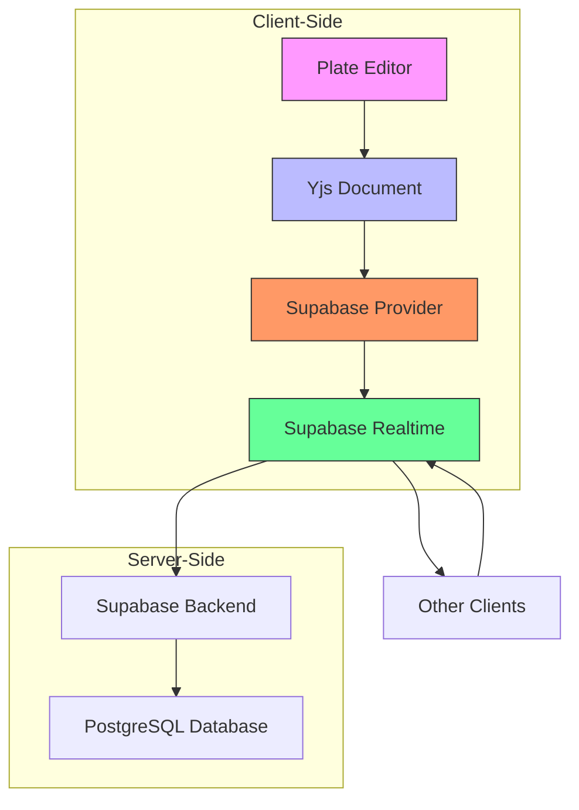
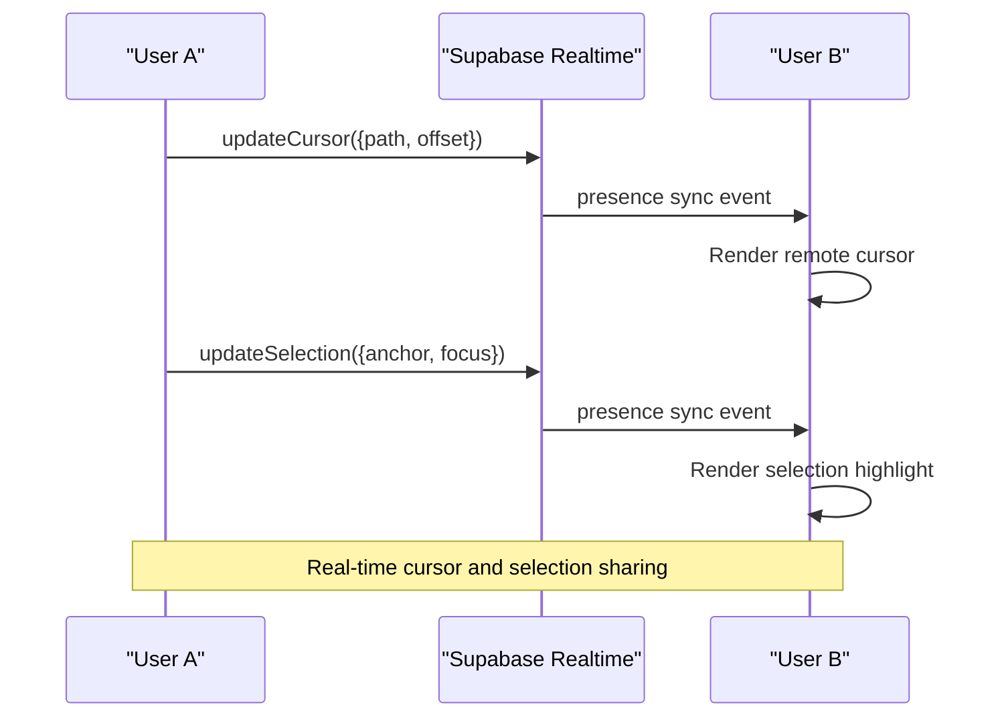
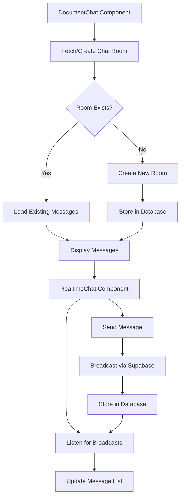
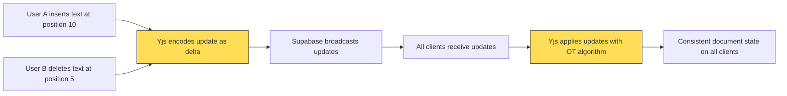
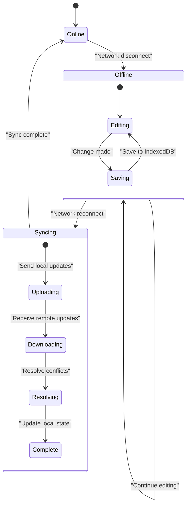

# Real-time Collaboration

<cite>
**Referenced Files in This Document**   
- [use-realtime-collaboration.ts](file://hooks/use-realtime-collaboration.ts)
- [use-yjs-collaboration.ts](file://hooks/use-yjs-collaboration.ts)
- [supabase-provider.ts](file://lib/yjs/supabase-provider.ts)
- [supabase-yjs-provider.ts](file://lib/yjs/supabase-yjs-provider.ts)
- [yjs-kit.tsx](file://components/plate/yjs-kit.tsx)
- [document-chat.tsx](file://components/documentos/document-chat.tsx)
- [remote-cursors-overlay.tsx](file://components/documentos/remote-cursors-overlay.tsx)
- [use-realtime-chat.tsx](file://hooks/use-realtime-chat.tsx)
- [use-realtime-cursors.ts](file://hooks/use-realtime-cursors.ts)
- [use-realtime-presence-room.ts](file://hooks/use-realtime-presence-room.ts)
</cite>

## Table of Contents
1. [Introduction](#introduction)
2. [Architecture Overview](#architecture-overview)
3. [Core Components](#core-components)
4. [Yjs and Plate Integration](#yjs-and-plate-integration)
5. [Presence and Cursor Sharing](#presence-and-cursor-sharing)
6. [Chat Integration](#chat-integration)
7. [Conflict Resolution and Data Consistency](#conflict-resolution-and-data-consistency)
8. [Offline Synchronization](#offline-synchronization)
9. [Performance Considerations](#performance-considerations)
10. [Troubleshooting Guide](#troubleshooting-guide)

## Introduction

The Real-time Collaboration system in Sinesys enables multiple users to simultaneously edit documents with operational transformation using Yjs and WebRTC. This system provides a seamless collaborative experience by integrating the Plate editor with Yjs providers and Supabase backend. The implementation supports presence indicators, cursor sharing, and chat integration within documents, allowing teams to work together efficiently. This documentation explains the technical details of the collaboration protocol, data consistency mechanisms, and how various components work together to provide a robust real-time editing experience.

## Architecture Overview

The real-time collaboration system in Sinesys follows a client-server architecture with CRDT-based synchronization. The system uses Yjs as the underlying CRDT implementation for conflict-free replicated data types, which ensures data consistency across multiple clients without requiring a central authority to resolve conflicts. Supabase Realtime serves as the communication layer, enabling bidirectional data flow between clients and the backend.



**Diagram sources**
- [use-yjs-collaboration.ts](file://hooks/use-yjs-collaboration.ts#L66-L201)
- [supabase-provider.ts](file://lib/yjs/supabase-provider.ts#L44-L251)

**Section sources**
- [use-yjs-collaboration.ts](file://hooks/use-yjs-collaboration.ts#L66-L201)
- [supabase-provider.ts](file://lib/yjs/supabase-provider.ts#L44-L251)

## Core Components

The real-time collaboration system consists of several key components that work together to provide a seamless editing experience. The system uses Yjs for CRDT-based document synchronization, Supabase Realtime for communication, and Plate.js as the rich text editor framework. The `useYjsCollaboration` hook initializes the Yjs document and connects it to the Supabase provider, while the `useRealtimeCollaboration` hook manages presence tracking and content updates. These components work together to ensure that all users see a consistent view of the document regardless of network conditions or edit conflicts.

**Section sources**
- [use-yjs-collaboration.ts](file://hooks/use-yjs-collaboration.ts#L66-L201)
- [use-realtime-collaboration.ts](file://hooks/use-realtime-collaboration.ts#L53-L244)

## Yjs and Plate Integration

The integration between Yjs and Plate.js is facilitated through custom provider implementations and hooks. The system uses a Supabase-based provider to synchronize Yjs documents across clients via Supabase Realtime channels. The `SupabaseProvider` class implements the necessary interfaces to connect Yjs with Supabase, handling both incremental updates and full state synchronization.

```mermaid
classDiagram
class YjsDocument {
+on(event, callback)
+off(event, callback)
+applyUpdate(update, origin)
+encodeStateAsUpdate()
}
class SupabaseProvider {
-supabase : SupabaseClient
-channel : RealtimeChannel
-doc : Y.Doc
+connect()
+disconnect()
+reconnect()
+destroy()
+broadcastUpdate(update)
+handleRemoteUpdate(payload)
+requestSync()
+sendFullState()
}
class PlateEditor {
+plugins : Plugin[]
+editor : Editor
+render()
}
YjsDocument --> SupabaseProvider : "synchronized via"
SupabaseProvider --> "Supabase Realtime" : "communicates through"
PlateEditor --> YjsDocument : "uses for state"
note right of SupabaseProvider
Custom provider implementation
for Supabase Realtime transport
end note
```

**Diagram sources**
- [supabase-provider.ts](file://lib/yjs/supabase-provider.ts#L44-L251)
- [supabase-yjs-provider.ts](file://lib/yjs/supabase-yjs-provider.ts#L78-L358)

**Section sources**
- [supabase-provider.ts](file://lib/yjs/supabase-provider.ts#L44-L251)
- [supabase-yjs-provider.ts](file://lib/yjs/supabase-yjs-provider.ts#L78-L358)

## Presence and Cursor Sharing

The system implements presence tracking and cursor sharing to enhance collaboration awareness. The `useRealtimeCollaboration` hook manages presence information for all users editing a document, including their cursor positions and selection ranges. When a user moves their cursor or makes a selection, this information is broadcast to other collaborators through Supabase Realtime presence tracking.



The `RemoteCursorsOverlay` component displays visual indicators for other users' cursors and selections within the document. Each collaborator is assigned a unique color from a predefined palette, making it easy to distinguish between different users. The system throttles cursor updates to minimize network traffic while maintaining a responsive user experience.

**Diagram sources**
- [use-realtime-collaboration.ts](file://hooks/use-realtime-collaboration.ts#L53-L244)
- [remote-cursors-overlay.tsx](file://components/documentos/remote-cursors-overlay.tsx#L15-L48)

**Section sources**
- [use-realtime-collaboration.ts](file://hooks/use-realtime-collaboration.ts#L53-L244)
- [remote-cursors-overlay.tsx](file://components/documentos/remote-cursors-overlay.tsx#L15-L48)

## Chat Integration

The document chat feature enables real-time communication within the context of a specific document. The `DocumentChat` component integrates with Supabase Realtime to provide a persistent chat room associated with each document. Users can discuss content, ask questions, or provide feedback without leaving the editing interface.



The chat system uses a hybrid approach, combining Supabase Realtime for immediate message delivery with persistent storage in the PostgreSQL database. This ensures that messages are not lost if users disconnect and can be retrieved when they return to the document. The `useRealtimeChat` hook manages the connection state, message history, and typing indicators.

**Diagram sources**
- [document-chat.tsx](file://components/documentos/document-chat.tsx#L50-L190)
- [use-realtime-chat.tsx](file://hooks/use-realtime-chat.tsx#L32-L230)

**Section sources**
- [document-chat.tsx](file://components/documentos/document-chat.tsx#L50-L190)
- [use-realtime-chat.tsx](file://hooks/use-realtime-chat.tsx#L32-L230)

## Conflict Resolution and Data Consistency

The system uses Yjs's CRDT implementation to handle conflict resolution automatically. When multiple users edit the same document simultaneously, Yjs ensures that all changes are merged consistently across all clients without requiring manual intervention. The operational transformation algorithm guarantees that the document reaches the same state on all clients regardless of the order in which updates are received.



The Supabase provider implements a synchronization protocol that handles both incremental updates and full state recovery. When a client connects, it requests the current document state from existing clients. If no response is received within a timeout period, the client assumes it is the first participant and proceeds with its local state. This approach ensures that documents remain available even when the backend is temporarily unreachable.

**Diagram sources**
- [supabase-provider.ts](file://lib/yjs/supabase-provider.ts#L44-L251)
- [use-yjs-collaboration.ts](file://hooks/use-yjs-collaboration.ts#L66-L201)

**Section sources**
- [supabase-provider.ts](file://lib/yjs/supabase-provider.ts#L44-L251)
- [use-yjs-collaboration.ts](file://hooks/use-yjs-collaboration.ts#L66-L201)

## Offline Synchronization

The system supports offline editing through local persistence and automatic synchronization when connectivity is restored. The `useYjsCollaboration` hook can be configured to enable IndexedDB persistence, which stores the document state locally in the browser. When a user edits a document while offline, changes are recorded in the local Yjs document and automatically synchronized with other collaborators when the connection is reestablished.



The synchronization process uses Yjs's built-in merge capabilities to combine changes from multiple sources. Local changes are encoded as updates and broadcast to other clients, while incoming updates are applied to the local document. This bidirectional synchronization ensures that no data is lost during offline periods.

**Diagram sources**
- [use-yjs-collaboration.ts](file://hooks/use-yjs-collaboration.ts#L66-L201)
- [supabase-provider.ts](file://lib/yjs/supabase-provider.ts#L44-L251)

**Section sources**
- [use-yjs-collaboration.ts](file://hooks/use-yjs-collaboration.ts#L66-L201)

## Performance Considerations

The real-time collaboration system is designed to minimize network traffic and maintain responsiveness even with multiple collaborators. The system implements several optimizations to achieve this goal:

1. **Throttling**: Cursor position updates are throttled to prevent excessive network traffic.
2. **Delta Encoding**: Only changes to the document are transmitted, not the entire content.
3. **Batching**: Multiple small updates are batched together when possible.
4. **Local First**: All edits are applied locally immediately, with remote synchronization happening in the background.

The Supabase provider uses efficient binary encoding (Uint8Array) for Yjs updates, which reduces payload size compared to JSON serialization. Presence updates are handled separately from document content updates to avoid unnecessary data transfer.

**Section sources**
- [use-realtime-collaboration.ts](file://hooks/use-realtime-collaboration.ts#L53-L244)
- [supabase-provider.ts](file://lib/yjs/supabase-provider.ts#L44-L251)

## Troubleshooting Guide

Common issues with the real-time collaboration system and their solutions:

1. **Users not seeing each other's edits**: Verify that all clients are connected to the same Supabase channel and that the document ID is correct.
2. **Cursor indicators not appearing**: Check that presence tracking is enabled and that the user has joined the collaboration room.
3. **Chat messages not syncing**: Ensure that the chat room has been properly created and that the user has permission to access it.
4. **Performance issues with large documents**: Consider implementing document chunking or pagination for very large content.

The system logs key events to the console, including connection status changes, synchronization events, and error conditions. These logs can be used to diagnose issues with the collaboration system.

**Section sources**
- [use-realtime-collaboration.ts](file://hooks/use-realtime-collaboration.ts#L53-L244)
- [use-yjs-collaboration.ts](file://hooks/use-yjs-collaboration.ts#L66-L201)
- [supabase-provider.ts](file://lib/yjs/supabase-provider.ts#L44-L251)