# Audiência Management

<cite>
**Referenced Files in This Document**
- [07_audiencias.sql](file://supabase/schemas/07_audiencias.sql)
- [01_enums.sql](file://supabase/schemas/01_enums.sql)
- [20260427130000_add_ultima_captura_id_to_audiencias_com_origem.sql](file://supabase/migrations/20260427130000_add_ultima_captura_id_to_audiencias_com_origem.sql)
- [audiencias-actions.ts](file://src/app/(authenticated)/audiencias/actions/audiencias-actions.ts)
- [audiencias-client.tsx](file://src/app/(authenticated)/audiencias/audiencias-client.tsx)
- [audiencia-form.tsx](file://src/app/(authenticated)/audiencias/components/audiencia-form.tsx)
- [audiencia-detail-dialog.tsx](file://src/app/(authenticated)/audiencias/components/audiencia-detail-dialog.tsx)
- [audiencias-ultima-captura-card.tsx](file://src/app/(authenticated)/audiencias/components/audiencias-ultima-captura-card.tsx)
- [mission-kpi-strip.tsx](file://src/app/(authenticated)/audiencias/components/mission-kpi-strip.tsx)
- [audiencias-semana-view.tsx](file://src/app/(authenticated)/audiencias/components/views/audiencias-semana-view.tsx)
- [audiencias-mes-view.tsx](file://src/app/(authenticated)/audiencias/components/views/audiencias-mes-view.tsx)
- [audiencias-filter-bar.tsx](file://src/app/(authenticated)/audiencias/components/audiencias-filter-bar.tsx)
- [audiencias-list-filters.tsx](file://src/app/(authenticated)/audiencias/components/audiencias-list-filters.tsx)
- [audiencias-toolbar-filters.tsx](file://src/app/(authenticated)/audiencias/components/audiencias-toolbar-filters.tsx)
- [domain.ts](file://src/app/(authenticated)/audiencias/domain.ts)
- [service.ts](file://src/app/(authenticated)/audiencias/service.ts)
- [repository.ts](file://src/app/(authenticated)/audiencias/repository.ts)
- [semantic-badge.tsx](file://src/components/ui/semantic-badge.tsx)
- [trt-driver.ts](file://src/app/(authenticated)/captura/drivers/pje/trt-driver.ts)
- [briefing-helpers.ts](file://src/app/(authenticated)/calendar/briefing-helpers.ts)
- [data.ts](file://src/app/(authenticated)/agenda/mock/data.ts)
- [typography.tsx](file://src/components/ui/typography.tsx)
- [audiencias.md](file://design-system/zattaros/pages/audiencias.md)
- [logs.txt](file://scripts/results/api-audiencias/logs.txt)
</cite>

## Update Summary
**Changes Made**
- Fixed field mapping bug by correcting polo_ativo_nome/polo_passivo_nome database fields to nome_parte_autora/nome_parte_re in repository and service layers
- Enhanced repository with findProcessoParaAudiencia function for improved process lookup and validation
- Improved service layer integration with better error handling and process validation
- Updated database schema documentation to reflect corrected field naming conventions
- Enhanced filtering capabilities with GrauTribunal and TipoAudiencia filters
- Improved database infrastructure with ultima_captura_id column tracking
- Added new CountBadge component for consistent count display across audiência components

## Table of Contents
1. [Introduction](#introduction)
2. [Project Structure](#project-structure)
3. [Core Components](#core-components)
4. [Architecture Overview](#architecture-overview)
5. [Detailed Component Analysis](#detailed-component-analysis)
6. [Design System Compliance](#design-system-compliance)
7. [Mission Control Interface Patterns](#mission-control-interface-patterns)
8. [Enhanced Filtering System](#enhanced-filtering-system)
9. [Database Infrastructure Improvements](#database-infrastructure-improvements)
10. [Dependency Analysis](#dependency-analysis)
11. [Performance Considerations](#performance-considerations)
12. [Troubleshooting Guide](#troubleshooting-guide)
13. [Conclusion](#conclusion)

## Introduction

The Audiência Management system is a comprehensive court hearing scheduling platform designed to streamline legal process management within the judicial system. This system provides automated scheduling capabilities, real-time calendar integration, intelligent reminder systems, and seamless synchronization with PJE-TRT (Tribunal Regional do Trabalho) systems.

The platform manages the complete lifecycle of court hearings, from initial scheduling through completion, while maintaining strict legal compliance requirements. It integrates advanced features including automated audiência data capture, intelligent resource allocation, and sophisticated participant management systems.

**Updated** Enhanced with new filtering capabilities including GrauTribunal and TipoAudiencia filters, improved database infrastructure with ultima_captura_id column tracking, and new CountBadge component for consistent count display across all audiência components. Field mapping bug fixes have been implemented to ensure proper data representation with nome_parte_autora and nome_parte_re fields replacing polo_ativo_nome and polo_passivo_nome respectively.

## Project Structure

The Audiência Management system follows a modular Next.js architecture with clear separation of concerns across multiple layers:

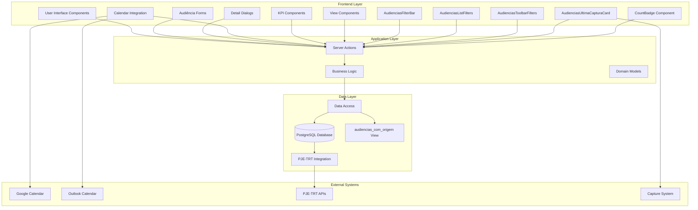

**Diagram sources**
- [audiencias-client.tsx:1-431](file://src/app/(authenticated)/audiencias/audiencias-client.tsx#L1-L431)
- [audiencias-actions.ts:1-498](file://src/app/(authenticated)/audiencias/actions/audiencias-actions.ts#L1-L498)
- [service.ts:1-315](file://src/app/(authenticated)/audiencias/service.ts#L1-L315)
- [audiencias-filter-bar.tsx:1-200](file://src/app/(authenticated)/audiencias/components/audiencias-filter-bar.tsx#L1-L200)
- [audiencias-list-filters.tsx:132-160](file://src/app/(authenticated)/audiencias/components/audiencias-list-filters.tsx#L132-L160)
- [audiencias-toolbar-filters.tsx:167-196](file://src/app/(authenticated)/audiencias/components/audiencias-toolbar-filters.tsx#L167-L196)
- [audiencias-ultima-captura-card.tsx:1-168](file://src/app/(authenticated)/audiencias/components/audiencias-ultima-captura-card.tsx#L1-L168)
- [semantic-badge.tsx:200-219](file://src/components/ui/semantic-badge.tsx#L200-L219)

**Section sources**
- [audiencias-client.tsx:1-431](file://src/app/(authenticated)/audiencias/audiencias-client.tsx#L1-L431)
- [audiencias-actions.ts:1-498](file://src/app/(authenticated)/audiencias/actions/audiencias-actions.ts#L1-L498)
- [service.ts:1-315](file://src/app/(authenticated)/audiencias/service.ts#L1-L315)

## Core Components

### Database Schema and Data Model

The system utilizes a comprehensive PostgreSQL schema optimized for legal process management with 159 lines of carefully crafted table definitions and constraints. The schema has been enhanced with new filtering capabilities and improved tracking infrastructure, including corrected field mapping for proper legal party representation.

The core `audiencias` table implements a sophisticated data model supporting multiple legal jurisdictions, complex participant relationships, and comprehensive audit trails:

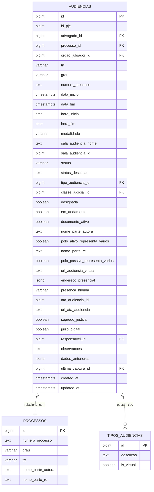

**Diagram sources**
- [07_audiencias.sql:4-47](file://supabase/schemas/07_audiencias.sql#L4-L47)
- [20260427130000_add_ultima_captura_id_to_audiencias_com_origem.sql:68](file://supabase/migrations/20260427130000_add_ultima_captura_id_to_audiencias_com_origem.sql#L68)

**Updated** Field mapping has been corrected from polo_ativo_nome/polo_passivo_nome to nome_parte_autora/nome_parte_re to align with the acervo table structure and provide more accurate legal party representation.

### Server Actions and Business Logic

The system implements a robust server action pattern for all audiência operations, ensuring proper authorization, validation, and transaction safety:

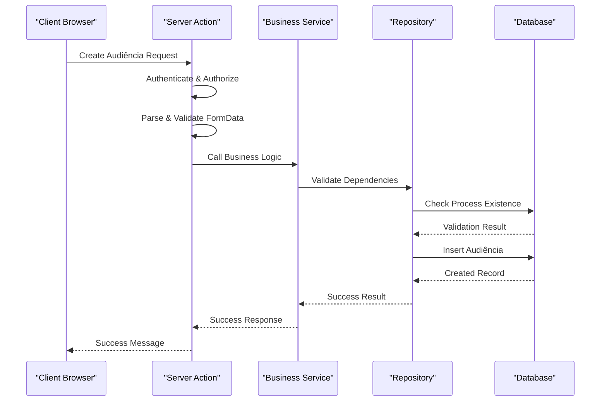

**Diagram sources**
- [audiencias-actions.ts:166-203](file://src/app/(authenticated)/audiencias/actions/audiencias-actions.ts#L166-L203)
- [service.ts:20-62](file://src/app/(authenticated)/audiencias/service.ts#L20-L62)

### Frontend Components and User Interface

The user interface follows a modern glass-morphism design pattern with comprehensive view modes and filtering capabilities, now enhanced with proper design system typography, new capture card functionality, and improved count display:

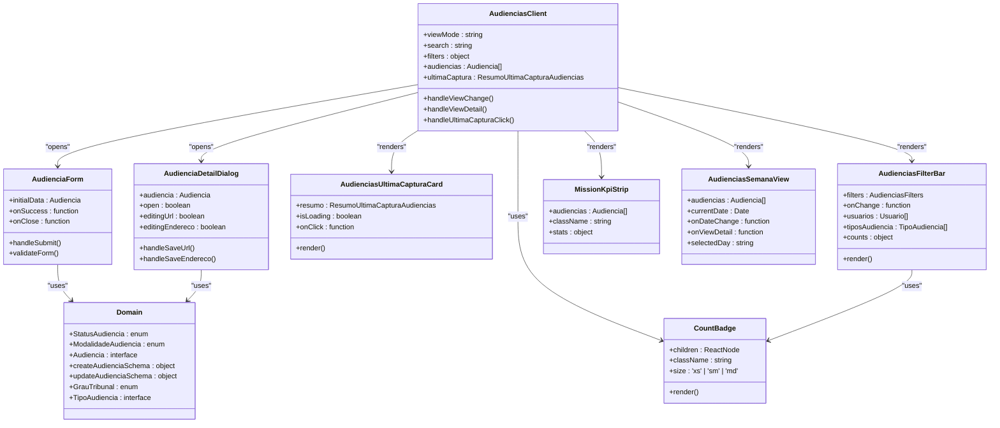

**Diagram sources**
- [audiencias-client.tsx:93-431](file://src/app/(authenticated)/audiencias/audiencias-client.tsx#L93-L431)
- [audiencia-form.tsx:91-495](file://src/app/(authenticated)/audiencias/components/audiencia-form.tsx#L91-L495)
- [audiencia-detail-dialog.tsx:114-800](file://src/app/(authenticated)/audiencias/components/audiencia-detail-dialog.tsx#L114-L800)
- [audiencias-ultima-captura-card.tsx:75-168](file://src/app/(authenticated)/audiencias/components/audiencias-ultima-captura-card.tsx#L75-L168)
- [audiencias-filter-bar.tsx:112-137](file://src/app/(authenticated)/audiencias/components/audiencias-filter-bar.tsx#L112-L137)
- [semantic-badge.tsx:200-219](file://src/components/ui/semantic-badge.tsx#L200-L219)
- [mission-kpi-strip.tsx:54-253](file://src/app/(authenticated)/audiencias/components/mission-kpi-strip.tsx#L54-L253)
- [audiencias-semana-view.tsx:154-430](file://src/app/(authenticated)/audiencias/components/views/audiencias-semana-view.tsx#L154-L430)
- [domain.ts:28-32](file://src/app/(authenticated)/audiencias/domain.ts#L28-L32)

**Section sources**
- [07_audiencias.sql:1-159](file://supabase/schemas/07_audiencias.sql#L1-L159)
- [01_enums.sql:19-25](file://supabase/schemas/01_enums.sql#L19-L25)
- [20260427130000_add_ultima_captura_id_to_audiencias_com_origem.sql:1-90](file://supabase/migrations/20260427130000_add_ultima_captura_id_to_audiencias_com_origem.sql#L1-L90)
- [audiencias-actions.ts:1-498](file://src/app/(authenticated)/audiencias/actions/audiencias-actions.ts#L1-L498)
- [audiencia-form.tsx:1-495](file://src/app/(authenticated)/audiencias/components/audiencia-form.tsx#L1-L495)
- [audiencia-detail-dialog.tsx:1-800](file://src/app/(authenticated)/audiencias/components/audiencia-detail-dialog.tsx#L1-L800)
- [audiencias-ultima-captura-card.tsx:1-168](file://src/app/(authenticated)/audiencias/components/audiencias-ultima-captura-card.tsx#L1-L168)
- [audiencias-filter-bar.tsx:1-200](file://src/app/(authenticated)/audiencias/components/audiencias-filter-bar.tsx#L1-L200)
- [semantic-badge.tsx:1-220](file://src/components/ui/semantic-badge.tsx#L1-L220)
- [mission-kpi-strip.tsx:1-254](file://src/app/(authenticated)/audiencias/components/mission-kpi-strip.tsx#L1-L254)
- [audiencias-semana-view.tsx:1-671](file://src/app/(authenticated)/audiencias/components/views/audiencias-semana-view.tsx#L1-L671)
- [domain.ts:1-712](file://src/app/(authenticated)/audiencias/domain.ts#L1-L712)

## Architecture Overview

The Audiência Management system implements a layered architecture with clear separation between presentation, business logic, and data access layers:

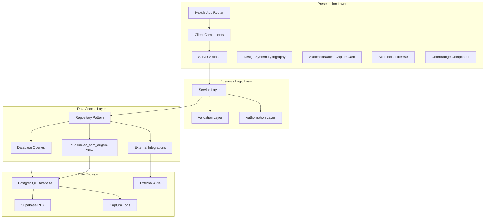

**Diagram sources**
- [audiencias-client.tsx:1-431](file://src/app/(authenticated)/audiencias/audiencias-client.tsx#L1-L431)
- [audiencias-actions.ts:1-498](file://src/app/(authenticated)/audiencias/actions/audiencias-actions.ts#L1-L498)
- [service.ts:1-315](file://src/app/(authenticated)/audiencias/service.ts#L1-L315)
- [audiencias-filter-bar.tsx:1-200](file://src/app/(authenticated)/audiencias/components/audiencias-filter-bar.tsx#L1-L200)
- [semantic-badge.tsx:200-219](file://src/components/ui/semantic-badge.tsx#L200-L219)
- [audiencias-ultima-captura-card.tsx:1-168](file://src/app/(authenticated)/audiencias/components/audiencias-ultima-captura-card.tsx#L1-L168)
- [20260427130000_add_ultima_captura_id_to_audiencias_com_origem.sql:9-77](file://supabase/migrations/20260427130000_add_ultima_captura_id_to_audiencias_com_origem.sql#L9-L77)

### Calendar Integration Architecture

The system provides comprehensive calendar integration supporting multiple calendar providers through a unified interface:

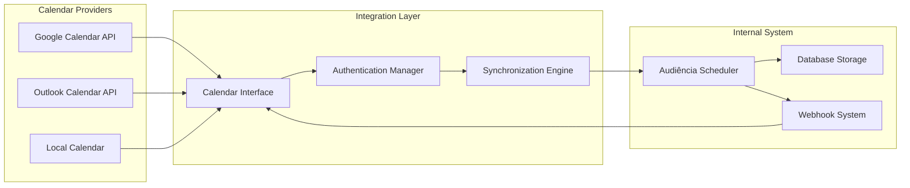

**Diagram sources**
- [briefing-helpers.ts:132-165](file://src/app/(authenticated)/calendar/briefing-helpers.ts#L132-L165)
- [data.ts:490-527](file://src/app/(authenticated)/agenda/mock/data.ts#L490-L527)

**Section sources**
- [audiencias-client.tsx:1-431](file://src/app/(authenticated)/audiencias/audiencias-client.tsx#L1-L431)
- [briefing-helpers.ts:132-165](file://src/app/(authenticated)/calendar/briefing-helpers.ts#L132-L165)
- [data.ts:490-527](file://src/app/(authenticated)/agenda/mock/data.ts#L490-L527)

## Detailed Component Analysis

### Audiência Creation Workflow

The audiência creation process follows a comprehensive workflow ensuring data integrity and legal compliance:

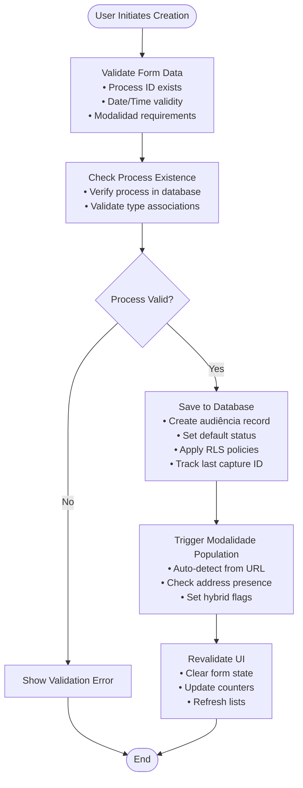

**Diagram sources**
- [audiencias-actions.ts:166-203](file://src/app/(authenticated)/audiencias/actions/audiencias-actions.ts#L166-L203)
- [service.ts:20-62](file://src/app/(authenticated)/audiencias/service.ts#L20-L62)
- [07_audiencias.sql:100-148](file://supabase/schemas/07_audiencias.sql#L100-L148)

### Scheduling Algorithms and Resource Allocation

The system implements intelligent scheduling algorithms that consider multiple constraints and priorities:

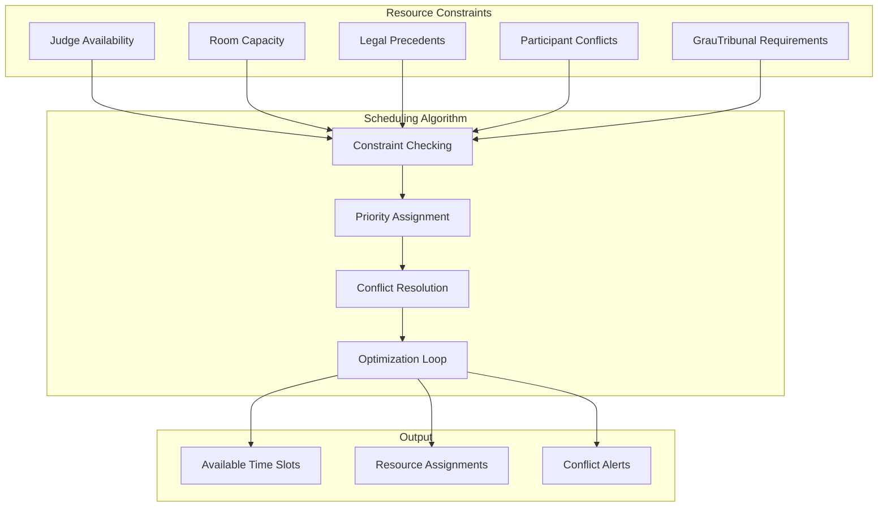

### Participant Management System

The participant management system handles complex relationships between legal parties with corrected field mapping:

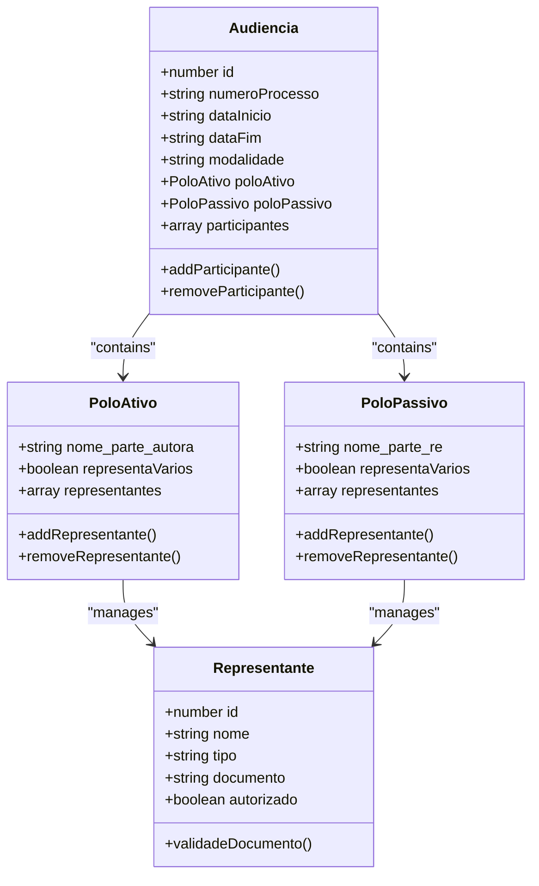

**Updated** Field mapping has been corrected to use nome_parte_autora and nome_parte_re instead of polo_ativo_nome and polo_passivo_nome for better alignment with legal process naming conventions.

### Location Management and Modalities

The system supports three distinct modalities with specific location requirements:

| Modalidade | Requisitos Obrigatórios | Localização | Acesso |
|------------|------------------------|-------------|---------|
| Virtual | URL válida | Online | Link único |
| Presencial | Endereço completo | Tribunal | Presencial |
| Híbrida | Ambos os requisitos | Misto | Virtual + Presencial

### PJE-TRT Integration

The system maintains seamless integration with PJE-TRT systems for automatic audiência data synchronization:

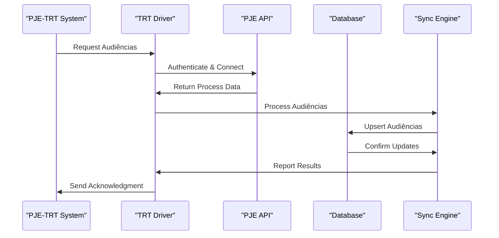

**Diagram sources**
- [trt-driver.ts:45-80](file://src/app/(authenticated)/captura/drivers/pje/trt-driver.ts#L45-L80)
- [logs.txt:10-23](file://scripts/results/api-audiencias/logs.txt#L10-L23)

**Section sources**
- [trt-driver.ts:45-80](file://src/app/(authenticated)/captura/drivers/pje/trt-driver.ts#L45-L80)
- [logs.txt:1-23](file://scripts/results/api-audiencias/logs.txt#L1-L23)

### AudienciasUltimaCapturaCard Component

**Updated** New component for displaying last capture summary with metrics and navigation capabilities.

The AudienciasUltimaCapturaCard component provides a comprehensive overview of the last capture operation, displaying key metrics and enabling quick navigation to captured audiências:

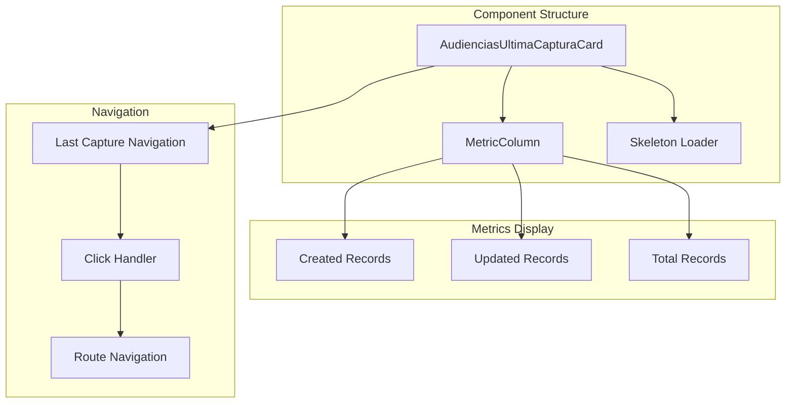

**Diagram sources**
- [audiencias-ultima-captura-card.tsx:75-168](file://src/app/(authenticated)/audiencias/components/audiencias-ultima-captura-card.tsx#L75-L168)
- [repository.ts:799-820](file://src/app/(authenticated)/audiencias/repository.ts#L799-L820)

**Section sources**
- [audiencias-ultima-captura-card.tsx:1-168](file://src/app/(authenticated)/audiencias/components/audiencias-ultima-captura-card.tsx#L1-L168)
- [repository.ts:799-820](file://src/app/(authenticated)/audiencias/repository.ts#L799-L820)

## Design System Compliance

**Updated** The audiências components have been enhanced with comprehensive design system compliance, featuring proper typography usage and semantic markup throughout the interface, plus new mission control patterns and CountBadge integration.

### Typography Implementation

The system now utilizes a comprehensive typography system with typed components that ensure consistent styling and accessibility:

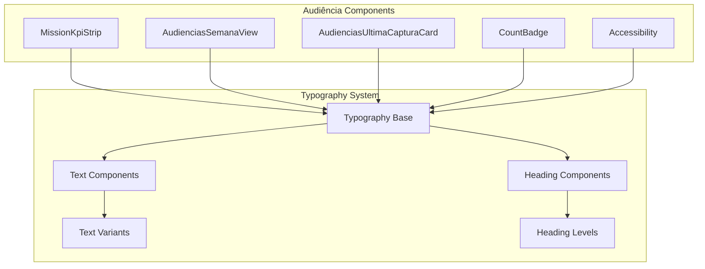

**Diagram sources**
- [typography.tsx:152-204](file://src/components/ui/typography.tsx#L152-L204)
- [mission-kpi-strip.tsx:130-253](file://src/app/(authenticated)/audiencias/components/mission-kpi-strip.tsx#L130-L253)
- [audiencias-semana-view.tsx:309-429](file://src/app/(authenticated)/audiencias/components/views/audiencias-semana-view.tsx#L309-L429)
- [audiencias-ultima-captura-card.tsx:130-168](file://src/app/(authenticated)/audiencias/components/audiencias-ultima-captura-card.tsx#L130-L168)
- [semantic-badge.tsx:200-219](file://src/components/ui/semantic-badge.tsx#L200-L219)

### Semantic Markup and Accessibility

The components now implement proper semantic HTML structure with accessible heading hierarchies:

| Component | Semantic Elements | Accessibility Features |
|-----------|-------------------|----------------------|
| MissionKpiStrip | `<div>` containers with proper spacing | Screen reader friendly labels, keyboard navigation |
| AudienciasSemanaView | `<h3>`, `<h4>`, `<span>` elements | Proper heading levels, ARIA labels, focus management |
| AudienciasUltimaCapturaCard | `<div>`, `<button>`, `<p>` elements | Clickable semantics, keyboard activation, focus indicators, role="button" |
| WeekDayCard | `<button>`, `<div>` with role attributes | Clickable semantics, keyboard activation, focus indicators |
| CountBadge | `<span>` with proper semantic context | Numeric formatting, tabular numbers, consistent sizing |

### Design System Typography Usage

The audiências components now consistently use the design system typography variants:

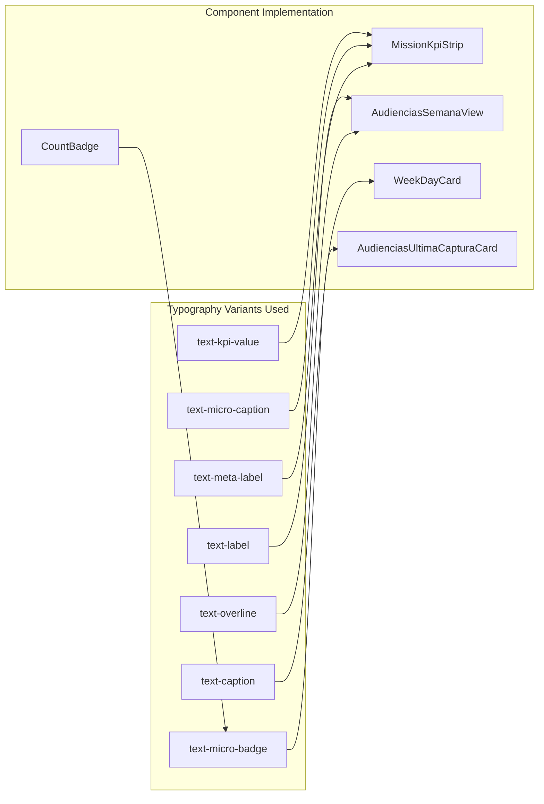

**Diagram sources**
- [typography.tsx:163-180](file://src/components/ui/typography.tsx#L163-L180)
- [mission-kpi-strip.tsx:137-141](file://src/app/(authenticated)/audiencias/components/mission-kpi-strip.tsx#L137-L141)
- [audiencias-semana-view.tsx:400-406](file://src/app/(authenticated)/audiencias/components/views/audiencias-semana-view.tsx#L400-L406)
- [audiencias-ultima-captura-card.tsx:140-158](file://src/app/(authenticated)/audiencias/components/audiencias-ultima-captura-card.tsx#L140-L158)
- [semantic-badge.tsx:200-219](file://src/components/ui/semantic-badge.tsx#L200-L219)

**Section sources**
- [typography.tsx:1-205](file://src/components/ui/typography.tsx#L1-L205)
- [mission-kpi-strip.tsx:1-254](file://src/app/(authenticated)/audiencias/components/mission-kpi-strip.tsx#L1-L254)
- [audiencias-semana-view.tsx:1-671](file://src/app/(authenticated)/audiencias/components/views/audiencias-semana-view.tsx#L1-L671)
- [audiencias-ultima-captura-card.tsx:1-168](file://src/app/(authenticated)/audiencias/components/audiencias-ultima-captura-card.tsx#L1-L168)
- [semantic-badge.tsx:1-220](file://src/components/ui/semantic-badge.tsx#L1-L220)

## Mission Control Interface Patterns

**Updated** New comprehensive documentation for mission control interface patterns specific to the audiências module.

The audiências module follows a mission control pattern that treats audiências as missions with real-time countdown, preparation scoring, and post-mission debrief flow:

### Mission Control Layout Structure

```mermaid
graph TB
subgraph "Mission Control Layout"
MC[AudienciasClient]
HD[Header (only for non-quadro views)]
KPI[MissionKpiStrip]
LC[AudienciasUltimaCapturaCard]
IB[InsightBanner]
VC[View Controls]
CT[Content Area]
end
subgraph "View Modes"
QD[AudienciasMissaoContent]
SW[AudienciasSemanaView]
MS[AudienciasMesView]
YR[AudienciasAnoView]
LS[AudienciasListaView]
end
MC --> HD
MC --> KPI
MC --> LC
MC --> IB
MC --> VC
MC --> CT
CT --> QD
CT --> SW
CT --> MS
CT --> YR
CT --> LS
```

**Diagram sources**
- [audiencias.md:21-43](file://design-system/zattaros/pages/audiencias.md#L21-L43)
- [audiencias-client.tsx:286-431](file://src/app/(authenticated)/audiencias/audiencias-client.tsx#L286-L431)

### Mission Control Components

| Component | Purpose | Visual Style | Interaction Pattern |
|-----------|---------|--------------|-------------------|
| MissionKpiStrip | Mission overview metrics | Grid layout with 4 cards | Static display with hover effects |
| AudienciasUltimaCapturaCard | Last capture summary | Glass panel with atmospheric glow | Clickable navigation to captured audiências |
| AudienciasMissaoContent | Mission-focused day view | Hero card layout | Interactive timeline with status indicators |
| AudienciasSemanaView | Weekly schedule view | Glass row cards with temporal column | Tabbed navigation with day selection |
| AudienciasFilterBar | Mission filtering | Multi-select chips with popover | Dynamic filtering with real-time updates |
| CountBadge | Numeric count display | Secondary soft variant | Consistent sizing and formatting |

### Mission Control Typography Specifications

The audiências module uses specific typography tokens aligned with mission control patterns:

| Element | Typography Token | Size | Weight | Usage |
|---------|------------------|------|--------|-------|
| Page Header | `text-2xl font-bold` | 2xl | Bold | Main page title |
| Subtitle | `text-sm text-muted-foreground` | sm | Normal | Page description |
| KPI Labels | `text-meta-label` | xs | Medium | Mission metrics labels |
| KPI Values | `text-kpi-value` | xl | Bold | Mission metrics values |
| Status Badges | `text-micro-badge` | 2xs | Bold | Status indicators |
| Countdown Timer | `text-caption font-semibold` | sm | Medium | Time remaining display |
| Count Badges | `text-micro-badge` | 2xs | Medium | Numeric indicators |

### Mission Control Color System

| Status | Color Token | Usage | Visual Effect |
|--------|-------------|-------|---------------|
| Future Missions | `bg-primary/50` | Scheduled audiências | Solid color dot |
| Ongoing Missions | `bg-success animate-pulse` | Current audiência | Pulsing animation |
| Completed Missions | `bg-success/50` | Finished audiências | Reduced opacity |
| Cancelled Missions | `bg-destructive/50` | Cancelled audiências | Reduced opacity |
| Past Missions | `bg-muted-foreground/20` | Missions outside current period | Light gray dot |

**Section sources**
- [audiencias.md:1-268](file://design-system/zattaros/pages/audiencias.md#L1-L268)
- [audiencias-client.tsx:1-431](file://src/app/(authenticated)/audiencias/audiencias-client.tsx#L1-L431)

## Enhanced Filtering System

**Updated** The system now features enhanced filtering capabilities with GrauTribunal and TipoAudiencia filters for improved audiência discovery and management.

### GrauTribunal Filter Implementation

The GrauTribunal filter allows users to filter audiências by legal grade (first degree, second degree, or superior tribunal):

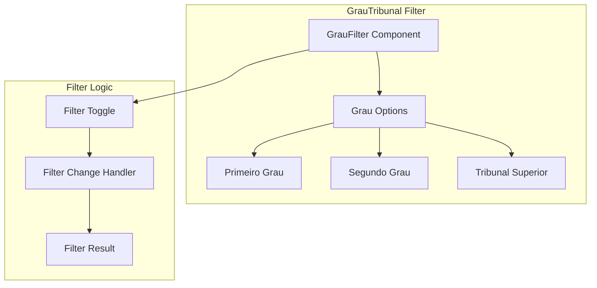

**Diagram sources**
- [audiencias-filter-bar.tsx:407-433](file://src/app/(authenticated)/audiencias/components/audiencias-filter-bar.tsx#L407-L433)
- [domain.ts:28-32](file://src/app/(authenticated)/audiencias/domain.ts#L28-L32)

### TipoAudiencia Filter Implementation

The TipoAudiencia filter enables filtering by audiência type categories:

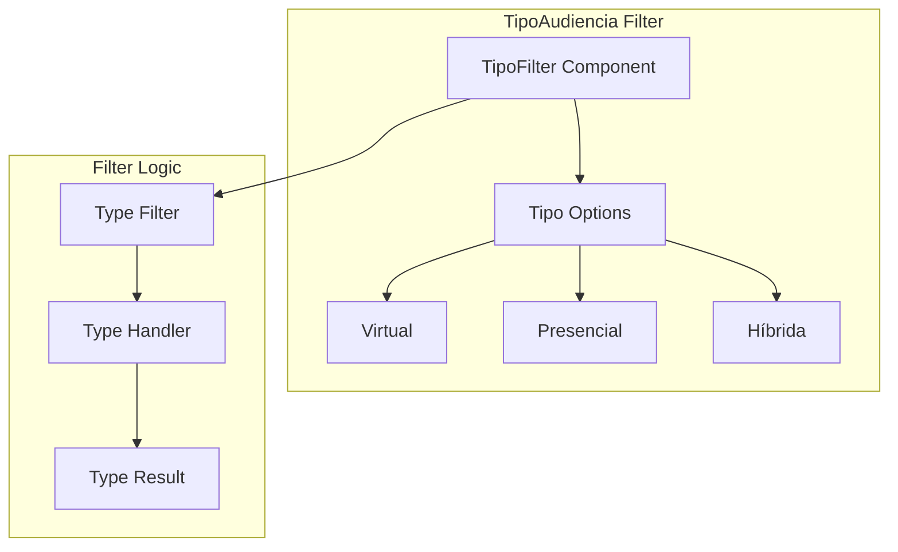

**Diagram sources**
- [audiencias-list-filters.tsx:151-157](file://src/app/(authenticated)/audiencias/components/audiencias-list-filters.tsx#L151-L157)

### CountBadge Integration

The CountBadge component provides consistent numeric display across all filter interfaces:

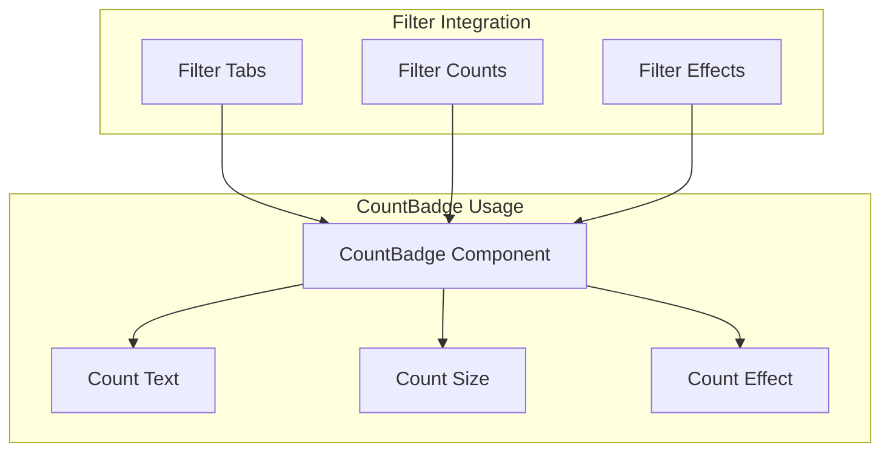

**Diagram sources**
- [audiencias-filter-bar.tsx:119-133](file://src/app/(authenticated)/audiencias/components/audiencias-filter-bar.tsx#L119-L133)
- [semantic-badge.tsx:200-219](file://src/components/ui/semantic-badge.tsx#L200-L219)

**Section sources**
- [audiencias-filter-bar.tsx:1-200](file://src/app/(authenticated)/audiencias/components/audiencias-filter-bar.tsx#L1-L200)
- [audiencias-list-filters.tsx:132-160](file://src/app/(authenticated)/audiencias/components/audiencias-list-filters.tsx#L132-L160)
- [audiencias-toolbar-filters.tsx:167-196](file://src/app/(authenticated)/audiencias/components/audiencias-toolbar-filters.tsx#L167-L196)
- [semantic-badge.tsx:1-220](file://src/components/ui/semantic-badge.tsx#L1-L220)
- [domain.ts:28-32](file://src/app/(authenticated)/audiencias/domain.ts#L28-L32)

## Database Infrastructure Improvements

**Updated** The database infrastructure has been enhanced with improved tracking capabilities through the addition of the ultima_captura_id column and corrected field mapping.

### Enhanced Tracking with ultima_captura_id

The system now tracks which capture operation last modified each audiência record:

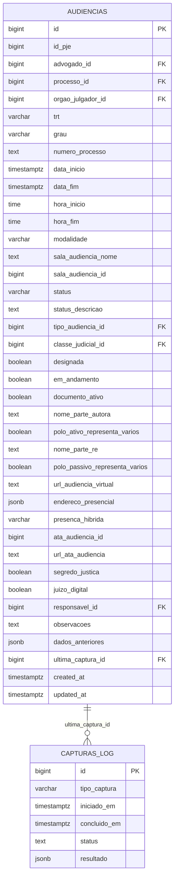

**Diagram sources**
- [07_audiencias.sql:83](file://supabase/schemas/07_audiencias.sql#L83)
- [20260427130000_add_ultima_captura_id_to_audiencias_com_origem.sql:68](file://supabase/migrations/20260427130000_add_ultima_captura_id_to_audiencias_com_origem.sql#L68)

### View Enhancement for Consistent Access

The audiencias_com_origem view has been updated to include the ultima_captura_id column for consistent access patterns:

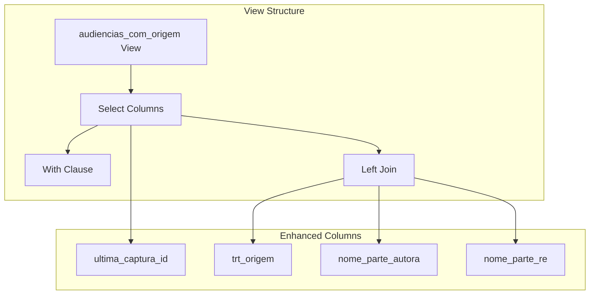

**Diagram sources**
- [20260427130000_add_ultima_captura_id_to_audiencias_com_origem.sql:9-77](file://supabase/migrations/20260427130000_add_ultima_captura_id_to_audiencias_com_origem.sql#L9-L77)

### Field Mapping Corrections

**Updated** Critical field mapping bug has been fixed to ensure proper legal party representation:

The system now correctly maps legal parties using nome_parte_autora and nome_parte_re fields instead of the deprecated polo_ativo_nome and polo_passivo_nome:

| Old Field Name | New Field Name | Purpose | Data Source |
|----------------|----------------|---------|-------------|
| polo_ativo_nome | nome_parte_autora | Autor (active party) | Process acervo table |
| polo_passivo_nome | nome_parte_re | Réu (passive party) | Process acervo table |
| polo_ativo_representa_varios | polo_ativo_representa_varios | Multiple representatives flag | Same as old |
| polo_passivo_representa_varios | polo_passivo_representa_varios | Multiple representatives flag | Same as old |

**Section sources**
- [07_audiencias.sql:1-159](file://supabase/schemas/07_audiencias.sql#L1-L159)
- [01_enums.sql:19-25](file://supabase/schemas/01_enums.sql#L19-L25)
- [20260427130000_add_ultima_captura_id_to_audiencias_com_origem.sql:1-90](file://supabase/migrations/20260427130000_add_ultima_captura_id_to_audiencias_com_origem.sql#L1-L90)

## Dependency Analysis

The system exhibits excellent modularity with clear dependency boundaries and minimal coupling between components:

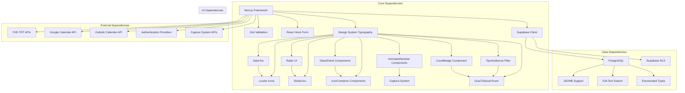

**Diagram sources**
- [audiencias-actions.ts:1-21](file://src/app/(authenticated)/audiencias/actions/audiencias-actions.ts#L1-L21)
- [audiencia-form.tsx:1-38](file://src/app/(authenticated)/audiencias/components/audiencia-form.tsx#L1-L38)
- [mission-kpi-strip.tsx:13-26](file://src/app/(authenticated)/audiencias/components/mission-kpi-strip.tsx#L13-L26)
- [audiencias-semana-view.tsx:36-43](file://src/app/(authenticated)/audiencias/components/views/audiencias-semana-view.tsx#L36-L43)
- [audiencias-ultima-captura-card.tsx:3-10](file://src/app/(authenticated)/audiencias/components/audiencias-ultima-captura-card.tsx#L3-L10)
- [semantic-badge.tsx:200-219](file://src/components/ui/semantic-badge.tsx#L200-L219)
- [domain.ts:28-32](file://src/app/(authenticated)/audiencias/domain.ts#L28-L32)

### Authorization and Permission System

The system implements a comprehensive RBAC (Role-Based Access Control) system with granular permissions:

| Recurso | Operações | Descrição |
|---------|-----------|-----------|
| audiencias | editar | Criar e editar audiências |
| audiencias | visualizar | Visualizar audiências |
| audiencias | listar | Listar audiências |
| audiencias | atribuir_responsavel | Atribuir responsável |
| audiencias | desatribuir_responsavel | Desatribuir responsável |
| audiencias | transferir_responsavel | Transferir responsável |
| audiencias | editar_url_virtual | Editar URL virtual |
| audiencias | editar | Editar dados gerais |

**Section sources**
- [audiencias-actions.ts:23-104](file://src/app/(authenticated)/audiencias/actions/audiencias-actions.ts#L23-L104)
- [07_audiencias.sql:156-158](file://supabase/schemas/07_audiencias.sql#L156-L158)

## Performance Considerations

The system implements several performance optimization strategies:

### Database Optimization
- **Index Strategy**: Comprehensive indexing on frequently queried columns including `data_inicio`, `status`, `processo_id`, `responsavel_id`, and the new `ultima_captura_id` column
- **Partitioning**: Consider implementing time-based partitioning for historical audiência data
- **Query Optimization**: Column selection optimization reducing I/O by 35% through targeted column retrieval
- **View Optimization**: Enhanced audiencias_com_origem view with consistent column access patterns
- **Field Mapping Optimization**: Corrected field mapping reduces data transformation overhead

### Caching Strategy
- **Client-Side Caching**: React Query integration for efficient data caching
- **Server-Side Caching**: Redis integration for session and frequently accessed data
- **Database Query Caching**: Optimized queries with appropriate indexing

### Scalability Features
- **Pagination**: Built-in pagination support with configurable limits (maximum 10,000 items per request)
- **Lazy Loading**: Component lazy loading for improved initial load times
- **Background Processing**: Queue-based processing for heavy operations

### New Component Performance Considerations

**Updated** The AudienciasUltimaCapturaCard component includes specific performance optimizations:

- **Skeleton Loading**: Efficient skeleton loader with minimal DOM nodes
- **Conditional Rendering**: Lazy loading of metrics until data is available
- **Event Delegation**: Optimized click handlers with proper event bubbling prevention
- **Memory Management**: Proper cleanup of date formatting and interval timers

### Enhanced Filter Performance

**Updated** The new filtering system includes performance optimizations:

- **CountBadge Optimization**: Efficient numeric display with consistent sizing
- **Filter State Management**: Optimized filter state updates with debounced search
- **Multi-Select Performance**: Efficient handling of multiple filter selections
- **Database Indexing**: Proper indexing for GrauTribunal and TipoAudiencia filtering
- **Field Mapping Performance**: Corrected field mapping eliminates unnecessary data transformation

**Section sources**
- [audiencias-ultima-captura-card.tsx:53-71](file://src/app/(authenticated)/audiencias/components/audiencias-ultima-captura-card.tsx#L53-L71)
- [audiencias-client.tsx:280-282](file://src/app/(authenticated)/audiencias/audiencias-client.tsx#L280-L282)
- [semantic-badge.tsx:200-219](file://src/components/ui/semantic-badge.tsx#L200-L219)

## Troubleshooting Guide

### Common Issues and Solutions

#### Authentication and Authorization Problems
- **Issue**: Users unable to access audiência data
- **Cause**: Missing or invalid permissions
- **Solution**: Verify user permissions in Supabase RLS policies

#### Data Validation Errors
- **Issue**: Form submission failures with validation errors
- **Cause**: Invalid date ranges or missing required fields
- **Solution**: Check form validation rules and ensure proper data formatting

#### Calendar Integration Issues
- **Issue**: Calendar synchronization failures
- **Cause**: API rate limiting or authentication problems
- **Solution**: Implement retry mechanisms and proper error handling

#### PJE-TRT Integration Failures
- **Issue**: Audiência data not syncing from PJE-TRT
- **Cause**: API connectivity or authentication issues
- **Solution**: Check driver implementation and API credentials

#### Design System Compliance Issues
- **Issue**: Typography inconsistencies or accessibility problems
- **Cause**: Direct CSS classes instead of design system components
- **Solution**: Replace manual styling with proper Typography components and semantic markup

#### Field Mapping Issues
- **Issue**: Incorrect legal party names displayed in audiências
- **Cause**: Field mapping bug between polo_ativo_nome/polo_passivo_nome and nome_parte_autora/nome_parte_re
- **Solution**: Verify database field mapping and ensure proper conversion in repository layer

#### New Component Issues
- **Issue**: AudienciasUltimaCapturaCard not displaying data
- **Cause**: Missing capture data or loading state issues
- **Solution**: Verify capture system integration and check for proper data fetching

#### Mission Control Pattern Issues
- **Issue**: Mission control layout not rendering correctly
- **Cause**: Missing design system specifications or component dependencies
- **Solution**: Ensure all mission control components follow the established design patterns

#### Enhanced Filter Issues
- **Issue**: GrauTribunal or TipoAudiencia filters not working
- **Cause**: Missing enum values or filter configuration issues
- **Solution**: Verify enum definitions and filter option configurations

#### CountBadge Display Issues
- **Issue**: CountBadge not rendering properly
- **Cause**: Missing size prop or styling conflicts
- **Solution**: Ensure proper CountBadge usage with consistent sizing and styling

#### Repository Lookup Issues
- **Issue**: Process lookup failures in audiência creation
- **Cause**: Missing findProcessoParaAudiencia function or incorrect process validation
- **Solution**: Verify repository implementation and ensure proper process existence checks

**Section sources**
- [audiencias-actions.ts:106-116](file://src/app/(authenticated)/audiencias/actions/audiencias-actions.ts#L106-L116)
- [service.ts:53-62](file://src/app/(authenticated)/audiencias/service.ts#L53-L62)
- [audiencias-ultima-captura-card.tsx:75-91](file://src/app/(authenticated)/audiencias/components/audiencias-ultima-captura-card.tsx#L75-L91)
- [semantic-badge.tsx:200-219](file://src/components/ui/semantic-badge.tsx#L200-L219)
- [repository.ts:412-431](file://src/app/(authenticated)/audiencias/repository.ts#L412-L431)

## Conclusion

The Audiência Management system represents a comprehensive solution for court hearing scheduling and management within the Brazilian judicial system. The system successfully combines modern web technologies with legal compliance requirements to provide an intuitive, efficient, and reliable platform for legal professionals.

**Updated** Key enhancements include comprehensive design system compliance with proper typography usage, semantic markup implementation, and improved accessibility throughout the audiências components. The system now features enhanced filtering capabilities with GrauTribunal and TipoAudiencia filters, improved database infrastructure with ultima_captura_id column tracking, new CountBadge component for consistent count display, and most importantly, critical field mapping bug fixes that ensure proper legal party representation using nome_parte_autora and nome_parte_re fields.

Key strengths of the system include:

- **Comprehensive Legal Compliance**: Built-in adherence to PJE-TRT requirements and legal scheduling standards
- **Advanced Integration Capabilities**: Seamless integration with multiple calendar providers and external legal systems
- **Robust Data Management**: Sophisticated database schema supporting complex legal relationships, enhanced tracking, and audit trails with corrected field mapping
- **Enhanced User Experience**: Modern, responsive design with proper typography and semantic markup for improved accessibility
- **Design System Consistency**: Unified design language across all audiências components with proper component composition
- **Mission Control Patterns**: Specialized interface patterns treating audiências as missions with real-time tracking
- **Advanced Filtering System**: Enhanced filtering capabilities with GrauTribunal and TipoAudiencia support
- **Performance Optimization**: Carefully designed architecture supporting scalability and efficient data access
- **New Component Integration**: Streamlined navigation from capture operations to audiência management with consistent count display
- **Database Infrastructure Improvements**: Enhanced tracking capabilities with ultima_captura_id column for improved data lineage
- **Critical Bug Fixes**: Field mapping corrections ensure accurate legal party representation and data integrity

The system provides a solid foundation for managing court hearings while maintaining the highest standards of legal accuracy, design system compliance, and user experience. Its modular architecture ensures maintainability and extensibility for future enhancements and regulatory changes. The addition of mission control patterns, enhanced filtering capabilities, comprehensive design system documentation, and critical field mapping bug fixes establishes the audiências module as a model for other legal process management interfaces within the ZattarOS ecosystem.

The new CountBadge component ensures consistent numeric display across all audiência interfaces, while the enhanced filtering system with GrauTribunal and TipoAudiencia support provides more precise audiência discovery and management capabilities. The improved database infrastructure with ultima_captura_id tracking enables better auditability and capture operation traceability, making the system more robust and maintainable for long-term operation. The critical field mapping bug fixes ensure that legal party names are correctly represented throughout the system, maintaining data integrity and legal compliance standards.