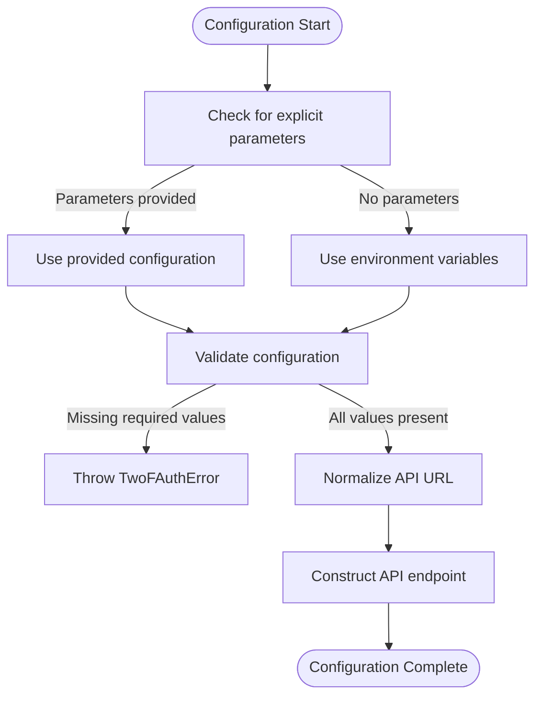
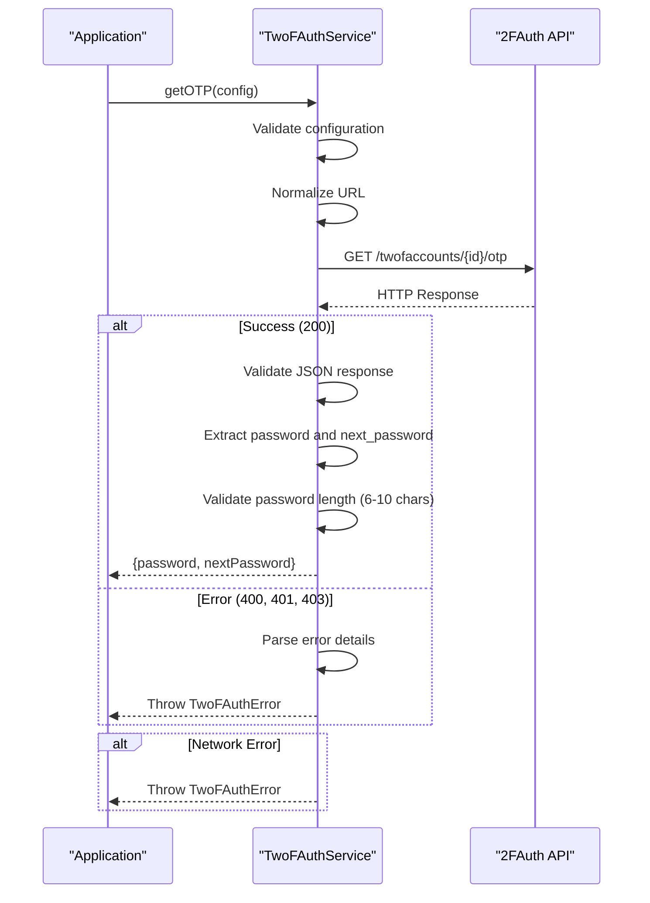
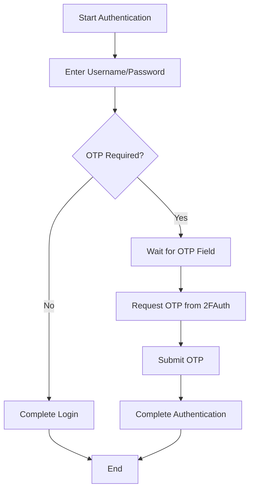

# 2FA Implementation

<cite>
**Referenced Files in This Document**   
- [twofauth.service.ts](file://backend/api/twofauth.service.ts)
- [test-2fauth.ts](file://scripts/outros/test-2fauth.ts)
- [.env.example](file://.env.example)
- [08_usuarios.sql](file://supabase/schemas/08_usuarios.sql)
- [trt-auth.service.ts](file://backend/captura/services/trt/trt-auth.service.ts)
</cite>

## Table of Contents
1. [Introduction](#introduction)
2. [2FAuth Service Architecture](#2fauth-service-architecture)
3. [Configuration and Environment Setup](#configuration-and-environment-setup)
4. [OTP Generation and Validation Process](#otp-generation-and-validation-process)
5. [Integration with Authentication Flow](#integration-with-authentication-flow)
6. [Error Handling and Troubleshooting](#error-handling-and-troubleshooting)
7. [Security Considerations](#security-considerations)

## Introduction
The Sinesys platform implements a robust two-factor authentication (2FA) system through integration with 2FAuth, a dedicated service for generating and managing one-time passwords (OTPs). This implementation enhances security for accessing external legal systems such as PJE (Processo Judicial Eletrônico) across various Brazilian courts including TRT, TJ, and TRF. The 2FA system is designed to provide an additional layer of protection beyond traditional username and password authentication, ensuring that only authorized users can access sensitive legal data and perform critical operations.

The 2FA implementation in Sinesys follows industry-standard practices for secure authentication, leveraging time-based one-time passwords (TOTP) to verify user identity during login processes. The system is built to be reusable across multiple judicial systems, providing a consistent and reliable authentication mechanism. This documentation provides comprehensive details about the 2FA implementation, including setup procedures, code validation processes, recovery mechanisms, and integration points within the broader authentication flow.

**Section sources**
- [twofauth.service.ts](file://backend/api/twofauth.service.ts#L1-L194)

## 2FAuth Service Architecture
The 2FAuth service in Sinesys is implemented as a modular and reusable component that can be integrated with various judicial systems. The architecture follows a clean separation of concerns, with distinct interfaces for configuration, response handling, and error management. The core functionality is encapsulated in the `getOTP` function, which serves as the primary interface for obtaining one-time passwords from the 2FAuth service.

The service architecture includes several key components:
- **TwoFAuthConfig interface**: Defines optional configuration parameters including API URL, authentication token, and account ID. This allows for flexible configuration that can be overridden at runtime.
- **TwoFAuthOTPResponse interface**: Specifies the structure of successful responses from the 2FAuth API, including the current password, next password (when available), OTP type (TOTP or HOTP), generation timestamp, period, and counter.
- **OTPResult interface**: Provides a simplified response structure containing the current password and next password, making it easier for consuming components to work with the data.
- **TwoFAuthErrorResponse interface**: Defines the structure of error responses from the 2FAuth API, including error messages and detailed reasons.
- **TwoFAuthError class**: A custom error class that extends JavaScript's built-in Error class, providing additional context such as status codes and error reasons for better error handling and debugging.

The service is designed to be resilient and fault-tolerant, with comprehensive error handling that covers network issues, API errors, and invalid responses. It also includes input validation to ensure that required configuration parameters are present before making API calls.

```mermaid
classDiagram
class TwoFAuthConfig {
+apiUrl? : string
+token? : string
+accountId? : string
}
class TwoFAuthOTPResponse {
+password : string
+next_password? : string
+otp_type : 'totp' | 'hotp'
+generated_at? : number
+period? : number
+counter? : number
}
class OTPResult {
+password : string
+nextPassword? : string
}
class TwoFAuthErrorResponse {
+message : string
+reason? : { [key : string] : string }
}
class TwoFAuthError {
+statusCode : number
+message : string
+reason? : { [key : string] : string }
+constructor(statusCode : number, message : string, reason? : { [key : string] : string })
}
class TwoFAuthService {
+getOTP(config? : TwoFAuthConfig) : Promise~OTPResult~
}
TwoFAuthService --> TwoFAuthConfig : "uses"
TwoFAuthService --> OTPResult : "returns"
TwoFAuthService --> TwoFAuthError : "throws"
TwoFAuthService --> TwoFAuthErrorResponse : "parses"
TwoFAuthService --> TwoFAuthOTPResponse : "parses"
```

**Diagram sources **
- [twofauth.service.ts](file://backend/api/twofauth.service.ts#L8-L171)

**Section sources**
- [twofauth.service.ts](file://backend/api/twofauth.service.ts#L8-L171)

## Configuration and Environment Setup
The 2FAuth service in Sinesys can be configured through environment variables, providing flexibility for different deployment environments. The configuration follows a hierarchical approach where explicit parameters take precedence over environment variables, allowing for both global and per-call customization.

The primary configuration parameters are:
- **TWOFAUTH_API_URL**: The base URL for the 2FAuth API endpoint. The service automatically normalizes this URL to ensure it points to the correct API version (v1).
- **TWOFAUTH_API_TOKEN**: The authentication token used to access the 2FAuth API, typically a JWT (JSON Web Token) that provides authorization.
- **TWOFAUTH_ACCOUNT_ID**: The identifier for the specific account within 2FAuth that will generate OTPs.

The service includes intelligent URL normalization logic that handles various input formats:
- If the URL ends with `/api/v1`, it is used as-is
- If the URL ends with `/api`, it appends `/v1`
- If the URL doesn't contain `/api`, it appends `/api/v1`

This normalization ensures consistent API endpoint construction regardless of how the base URL is provided. The service also validates that all required configuration parameters are present before making API calls, throwing a descriptive error if any are missing. This prevents failed API requests due to incomplete configuration.



**Diagram sources **
- [twofauth.service.ts](file://backend/api/twofauth.service.ts#L78-L101)
- [.env.example](file://.env.example#L26-L28)

**Section sources**
- [twofauth.service.ts](file://backend/api/twofauth.service.ts#L78-L101)
- [.env.example](file://.env.example#L26-L28)

## OTP Generation and Validation Process
The OTP generation and validation process in Sinesys is implemented through the `getOTP` function, which serves as the primary interface for obtaining one-time passwords from the 2FAuth service. The process follows a well-defined sequence of steps to ensure reliability and security.

When a request for an OTP is made, the service first checks for configuration parameters, falling back to environment variables if not provided. It then constructs the API endpoint URL using the normalized base URL and the account ID. The service makes a GET request to the 2FAuth API with appropriate headers, including the Bearer token for authentication and Accept header specifying JSON response format.

Upon receiving a response, the service performs comprehensive validation:
- It checks the content type to ensure a JSON response
- For error responses (non-200 status codes), it attempts to parse the error details and throws a TwoFAuthError with appropriate context
- For successful responses, it validates that the response contains the required password field
- It verifies that the password length is between 6 and 10 characters, as specified in the 2FAuth documentation

The service returns both the current password and next password when available, allowing applications to prepare for the next authentication cycle. This dual-password approach enhances user experience by reducing the need for frequent re-authentication while maintaining security.



**Diagram sources **
- [twofauth.service.ts](file://backend/api/twofauth.service.ts#L103-L193)

**Section sources**
- [twofauth.service.ts](file://backend/api/twofauth.service.ts#L103-L193)

## Integration with Authentication Flow
The 2FA implementation in Sinesys is integrated with the authentication flow for accessing external judicial systems, particularly the PJE platform. The integration occurs during the login process when the system detects the need for two-factor authentication.

When authenticating with a judicial system like TRT, the process follows these steps:
1. Initial login with username and password
2. Detection of OTP requirement by monitoring for OTP input fields
3. Request for OTP from the 2FAuth service
4. Automatic submission of the OTP to complete authentication

The integration is implemented in the TRT authentication service, which uses the 2FAuth service to obtain OTPs when required. The service monitors for OTP input fields on the login page and waits for them to become visible before proceeding. Once detected, it calls the `getOTP` function to retrieve the current password and submits it to the authentication form.

This integration is designed to be seamless from the user's perspective, automating the OTP entry process while maintaining security. The system handles various scenarios, including cases where the OTP field appears after a delay or where multiple authentication factors are required.



**Diagram sources **
- [trt-auth.service.ts](file://backend/captura/services/trt/trt-auth.service.ts#L89-L117)

**Section sources**
- [trt-auth.service.ts](file://backend/captura/services/trt/trt-auth.service.ts#L89-L117)

## Error Handling and Troubleshooting
The 2FA implementation in Sinesys includes comprehensive error handling to address various failure scenarios that may occur during the authentication process. The system is designed to provide meaningful error messages and guidance for troubleshooting common issues.

The primary error types handled by the system include:
- **Configuration errors**: Occur when required environment variables are missing or invalid. The system throws a descriptive error message listing the required variables.
- **Network errors**: Handle connectivity issues between Sinesys and the 2FAuth service. These are wrapped in TwoFAuthError with appropriate context.
- **API errors**: Cover HTTP status codes 400, 401, and 403 from the 2FAuth API. The system attempts to parse error details and include them in the thrown exception.
- **Response validation errors**: Occur when the API returns a non-JSON response or a JSON response missing required fields like the password.

For troubleshooting, the system provides a dedicated test script (`test-2fauth.ts`) that verifies the 2FAuth configuration and connectivity. This script performs several diagnostic steps:
1. Checks for complete configuration parameters
2. Normalizes the API URL
3. Tests listing available accounts to verify authentication
4. Attempts to retrieve an OTP to validate the complete workflow

The test script outputs detailed information about each step, including configuration values (with token truncation for security), API endpoints, and response details. This makes it easier to diagnose and resolve configuration issues.

**Section sources**
- [twofauth.service.ts](file://backend/api/twofauth.service.ts#L117-L193)
- [test-2fauth.ts](file://scripts/outros/test-2fauth.ts#L15-L114)

## Security Considerations
The 2FA implementation in Sinesys incorporates several security measures to protect sensitive authentication data and prevent unauthorized access. These considerations address both the technical implementation and operational practices.

Key security features include:
- **Secure configuration management**: Authentication tokens and API keys are stored as environment variables rather than being hardcoded in the source code. This prevents accidental exposure in version control systems.
- **Input validation**: The service validates all configuration parameters and API responses to prevent injection attacks and ensure data integrity.
- **Error handling**: Error messages are carefully crafted to provide sufficient information for debugging without revealing sensitive details about the system configuration.
- **Token protection**: The Bearer token used for 2FAuth API access is transmitted over HTTPS and is not logged in plaintext.
- **Rate limiting awareness**: While not explicitly implemented in the service, the design considers potential rate limits on the 2FAuth API to prevent account lockouts.

The system also follows the principle of least privilege, with the 2FAuth service having access only to the specific account needed for OTP generation. This minimizes the potential impact of a security breach.

**Section sources**
- [twofauth.service.ts](file://backend/api/twofauth.service.ts#L83-L87)
- [.env.example](file://.env.example#L26-L28)