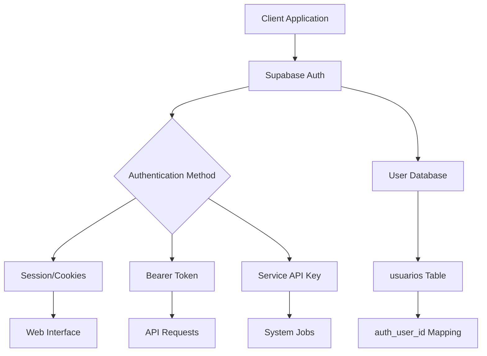
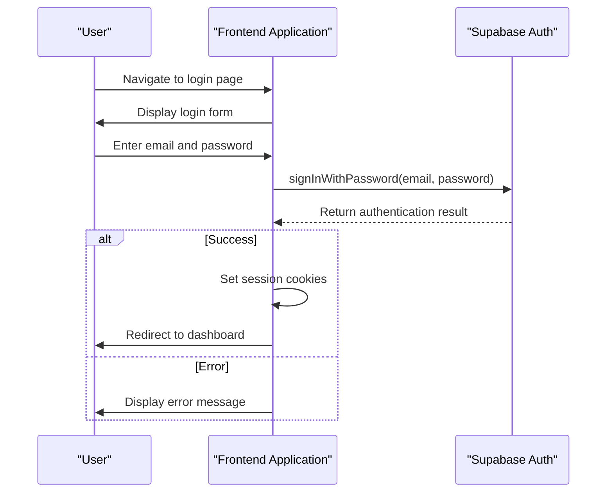
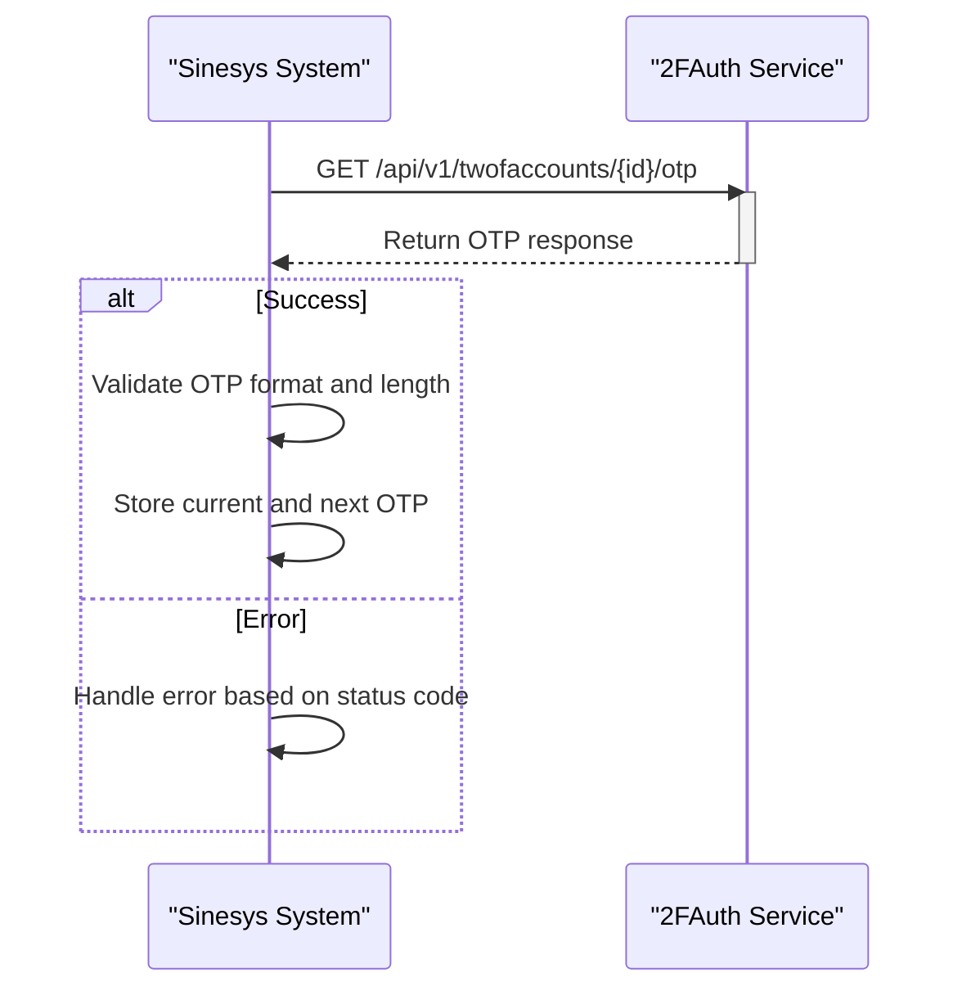
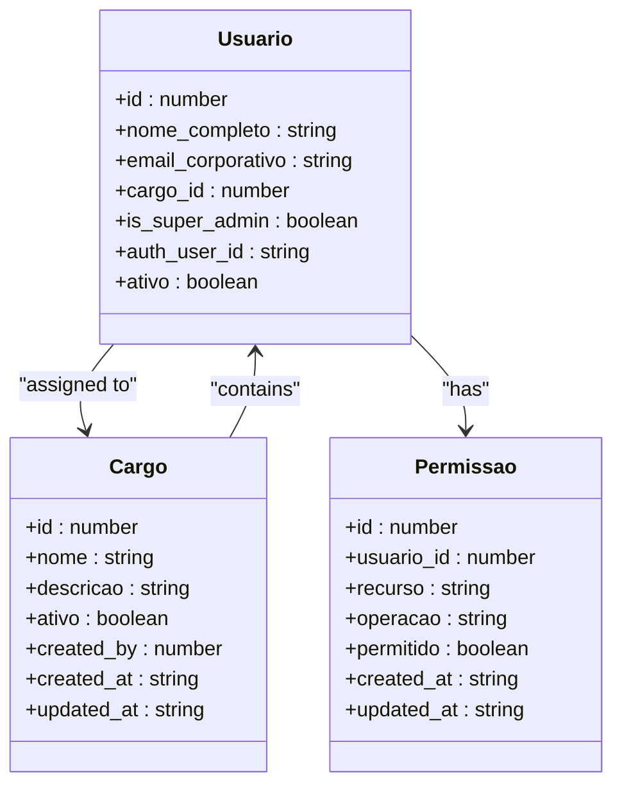
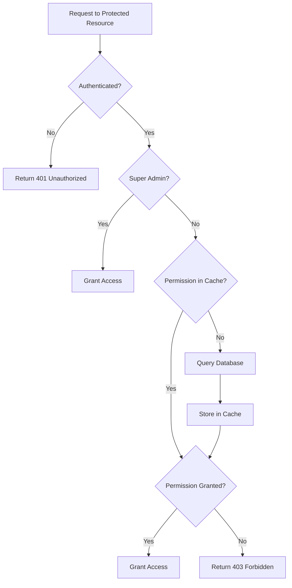
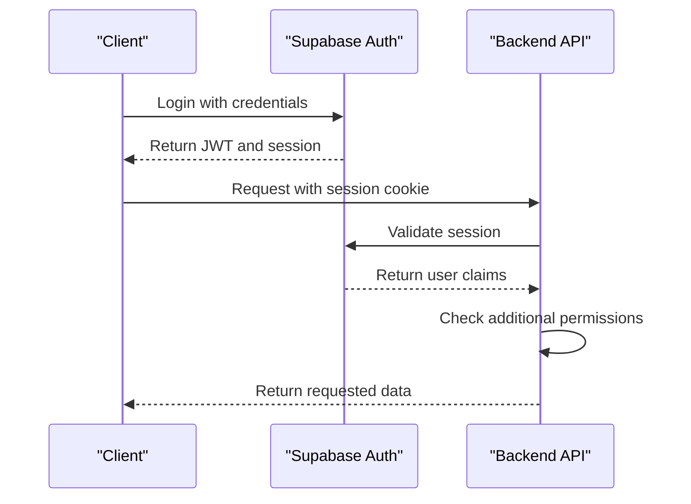
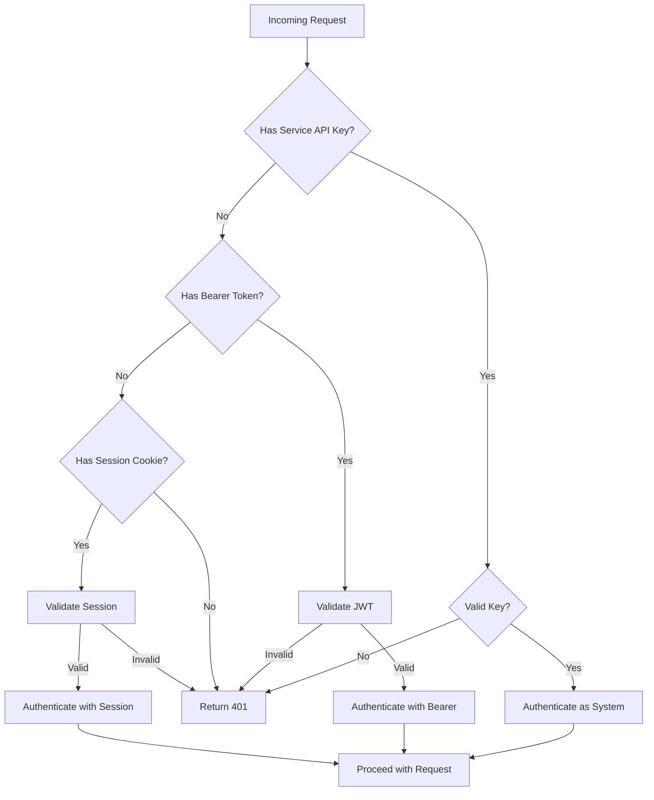
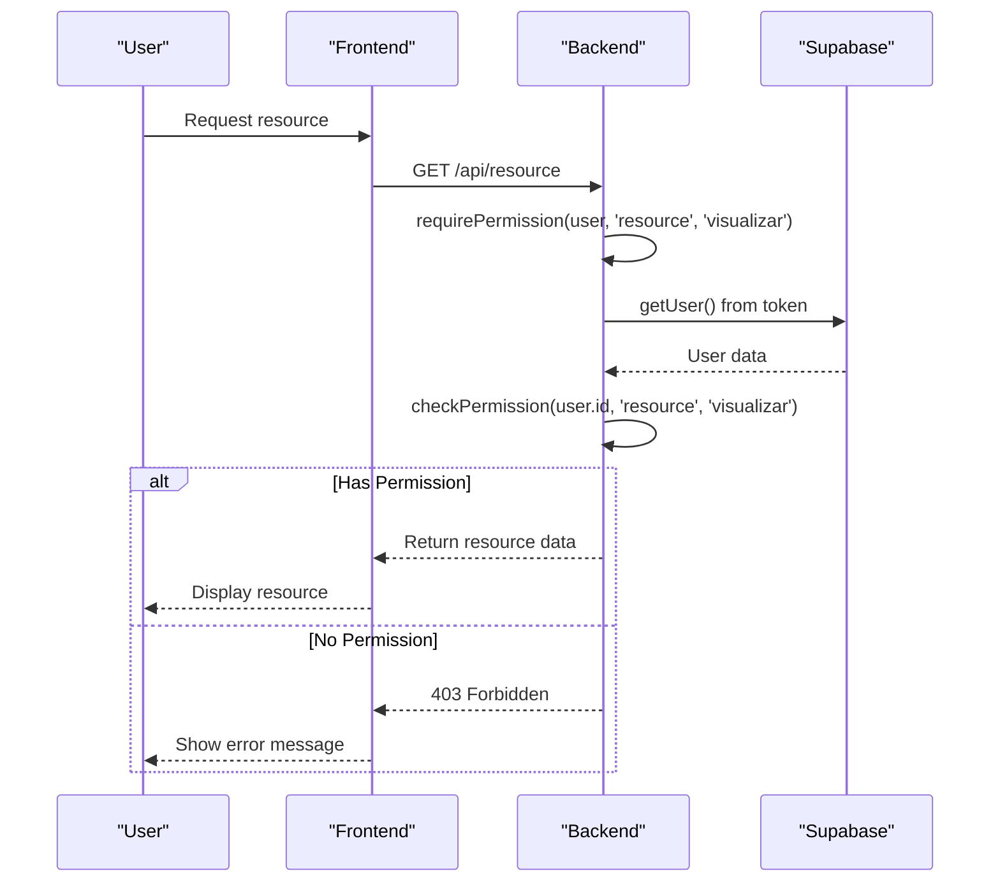

# Authentication and Authorization

<cite>
**Referenced Files in This Document**   
- [middleware.ts](file://app/_lib/middleware.ts)
- [api-auth.ts](file://backend/auth/api-auth.ts)
- [authorization.ts](file://backend/auth/authorization.ts)
- [require-permission.ts](file://backend/auth/require-permission.ts)
- [supabase.ts](file://app/_lib/supabase.ts)
- [client.ts](file://lib/client.ts)
- [server.ts](file://lib/server.ts)
- [twofauth.service.ts](file://backend/api/twofauth.service.ts)
- [types.ts](file://backend/types/permissoes/types.ts)
- [permissao-persistence.service.ts](file://backend/permissoes/services/persistence/permissao-persistence.service.ts)
- [cargo-persistence.service.ts](file://backend/cargos/services/persistence/cargo-persistence.service.ts)
- [login-form.tsx](file://app/auth/components/login-form.tsx)
- [forgot-password-form.tsx](file://app/auth/components/forgot-password-form.tsx)
- [update-password-form.tsx](file://app/auth/components/update-password-form.tsx)
</cite>

## Table of Contents
1. [Introduction](#introduction)
2. [Authentication System Overview](#authentication-system-overview)
3. [Login Process with Supabase Auth](#login-process-with-supabase-auth)
4. [Two-Factor Authentication (2FAuth) Integration](#two-factor-authentication-2fauth-integration)
5. [Role-Based Access Control with Cargos and Permissoes](#role-based-access-control-with-cargos-and-permissoes)
6. [Permission Matrix and Enforcement](#permission-matrix-and-enforcement)
7. [JWT Token Handling and Session Management](#jwt-token-handling-and-session-management)
8. [Secure API Access Implementation](#secure-api-access-implementation)
9. [Common Use Cases](#common-use-cases)
10. [Troubleshooting Common Issues](#troubleshooting-common-issues)
11. [Conclusion](#conclusion)

## Introduction

The Sinesys platform implements a comprehensive authentication and authorization system that combines Supabase Auth for user management with a custom granular permission system. This documentation details the complete authentication flow, including email/password login, two-factor authentication (2FAuth) integration, and the role-based access control system that governs user permissions throughout the application.

The system is designed to provide secure access to the platform's various features while maintaining flexibility in permission management. It leverages Supabase for authentication and session management, while implementing a custom authorization layer for fine-grained control over user actions within the application.

**Section sources**
- [middleware.ts](file://app/_lib/middleware.ts#L1-L73)
- [api-auth.ts](file://backend/auth/api-auth.ts#L1-L139)

## Authentication System Overview

The Sinesys authentication system is built on Supabase Auth, providing a robust foundation for user management and session handling. The system supports multiple authentication methods and integrates with external services for enhanced security features like two-factor authentication.

The architecture follows a layered approach with distinct components for authentication (verifying user identity) and authorization (determining user permissions). This separation allows for flexible security policies while maintaining a consistent user experience across the platform.

The system handles authentication through three primary methods:
1. Session-based authentication using cookies for web interface access
2. Bearer token authentication for API requests from the frontend
3. Service API key authentication for system jobs and background processes

This multi-method approach ensures secure access across different client types while maintaining a consistent authorization framework.

**Diagram sources **
- [api-auth.ts](file://backend/auth/api-auth.ts#L51-L137)
- [middleware.ts](file://app/_lib/middleware.ts#L40-L56)

## Login Process with Supabase Auth

The login process in Sinesys follows a standard email/password authentication flow using Supabase Auth. Users access the login page where they enter their credentials, which are then verified against the Supabase authentication system.

The login interface is implemented as a React component that handles form submission and error states. When a user submits their email and password, the frontend creates a Supabase client instance and calls the `signInWithPassword` method to authenticate the user.

Upon successful authentication, the user is redirected to the main dashboard. The system handles various error conditions with user-friendly messages, including invalid credentials, unconfirmed emails, and server-side authentication errors.

The middleware layer intercepts requests to protected routes and checks for valid authentication. If a user attempts to access a protected route without being authenticated, they are redirected to the login page.

**Diagram sources **
- [login-form.tsx](file://app/auth/components/login-form.tsx#L26-L87)
- [middleware.ts](file://app/_lib/middleware.ts#L44-L55)

**Section sources**
- [login-form.tsx](file://app/auth/components/login-form.tsx#L1-L147)
- [middleware.ts](file://app/_lib/middleware.ts#L40-L56)

## Two-Factor Authentication (2FAuth) Integration

Sinesys integrates with an external 2FAuth service to provide two-factor authentication capabilities. This integration enhances security by requiring a second factor beyond the standard email/password combination.

The 2FAuth service is implemented as a reusable API client that can be used across different legal systems (TRT, TJ, TRF, etc.). The service communicates with the 2FAuth API to retrieve one-time passwords (OTPs) for authentication purposes.

The integration supports both TOTP (Time-based One-Time Password) and HOTP (HMAC-based One-Time Password) algorithms. The service retrieves both the current OTP and the next OTP when available, allowing for smooth authentication transitions.

Configuration for the 2FAuth service can be provided directly or through environment variables, with the system checking for `TWOFAUTH_API_URL`, `TWOFAUTH_API_TOKEN`, and `TWOFAUTH_ACCOUNT_ID`. The service includes comprehensive error handling for various API response scenarios, including network errors, authentication failures, and invalid responses.

The implementation follows security best practices by using HTTPS for all communications and storing sensitive credentials securely in environment variables rather than in code.

**Diagram sources **
- [twofauth.service.ts](file://backend/api/twofauth.service.ts#L77-L172)

**Section sources**
- [twofauth.service.ts](file://backend/api/twofauth.service.ts#L1-L196)

## Role-Based Access Control with Cargos and Permissoes

Sinesys implements a sophisticated role-based access control (RBAC) system using the concepts of "cargos" (roles) and "permissoes" (permissions). This system provides granular control over user capabilities within the application.

The architecture separates roles (cargos) from individual permissions (permissoes), allowing for flexible permission management. Each user is assigned to a cargo, but permissions are managed at the individual user level rather than being inherited from roles. This approach provides maximum flexibility in permission assignment.

The system includes a cache layer for permission checks to improve performance, with a TTL of 5 minutes. The cache is automatically invalidated when permissions are modified, ensuring that authorization decisions are always based on current data.

Super administrators have a special bypass that grants them full access to all system resources, regardless of explicit permission assignments. This ensures that administrative users can always access necessary functionality.

The permission system is designed to be extensible, with a defined matrix of resources and operations that can be easily expanded as new features are added to the application.

**Diagram sources **
- [cargo-persistence.service.ts](file://backend/cargos/services/persistence/cargo-persistence.service.ts#L1-L286)
- [permissao-persistence.service.ts](file://backend/permissoes/services/persistence/permissao-persistence.service.ts#L1-L277)

**Section sources**
- [authorization.ts](file://backend/auth/authorization.ts#L56-L145)
- [cargo-persistence.service.ts](file://backend/cargos/services/persistence/cargo-persistence.service.ts#L1-L286)

## Permission Matrix and Enforcement

The permission system in Sinesys is built around a comprehensive permission matrix that defines all possible resource-operation combinations. This matrix serves as the foundation for the granular permission system, with 145 distinct permissions available across various application domains.

The permission matrix includes resources such as 'advogados', 'audiencias', 'contratos', 'financeiro', and 'usuarios', with operations including 'listar', 'visualizar', 'criar', 'editar', 'deletar', and more specialized actions like 'atribuir_responsavel' and 'baixar_expediente'.

Permission enforcement occurs through a middleware system that checks user permissions before allowing access to protected resources. The `requirePermission` helper function encapsulates the authentication and authorization logic, simplifying permission checks in API routes.

The system implements a caching mechanism to optimize permission checks, storing results for 5 minutes to reduce database queries. The cache is automatically cleared when permissions are modified, ensuring consistency between the cache and the database.

For complex scenarios requiring multiple permissions, the system provides a `checkMultiplePermissions` function that can verify whether a user has either all required permissions (AND logic) or at least one of several permissions (OR logic).

**Diagram sources **
- [authorization.ts](file://backend/auth/authorization.ts#L56-L145)
- [require-permission.ts](file://backend/auth/require-permission.ts#L67-L99)

**Section sources**
- [types.ts](file://backend/types/permissoes/types.ts#L9-L415)
- [authorization.ts](file://backend/auth/authorization.ts#L56-L145)
- [require-permission.ts](file://backend/auth/require-permission.ts#L67-L99)

## JWT Token Handling and Session Management

Sinesys implements a robust session management system using JWT (JSON Web Tokens) provided by Supabase Auth. The system handles token creation, validation, and refresh to maintain secure user sessions.

The frontend creates a Supabase client that manages the authentication state and handles token storage in browser cookies. When a user logs in, the authentication response includes a JWT that is automatically stored and sent with subsequent requests.

The middleware layer validates session cookies on each request to protected routes. For API routes, the system supports both cookie-based authentication and Bearer token authentication, providing flexibility for different client types.

Session security is enhanced through the use of secure, HTTP-only cookies and proper token expiration policies. The system automatically redirects unauthenticated users to the login page when their session expires.

The backend authentication system includes multiple layers of validation, checking both the token signature and expiration, as well as verifying the user's active status in the application database.

**Diagram sources **
- [supabase.ts](file://app/_lib/supabase.ts#L1-L10)
- [client.ts](file://lib/client.ts#L1-L9)
- [server.ts](file://lib/server.ts#L1-L34)

**Section sources**
- [middleware.ts](file://app/_lib/middleware.ts#L44-L45)
- [api-auth.ts](file://backend/auth/api-auth.ts#L84-L90)
- [supabase.ts](file://app/_lib/supabase.ts#L1-L10)

## Secure API Access Implementation

The API access system in Sinesys implements multiple authentication methods to secure endpoints for different client types. The `authenticateRequest` function serves as the central authentication handler, supporting three distinct authentication methods with a clear priority order.

The authentication hierarchy is:
1. Service API Key - for system jobs and background processes
2. Bearer Token - for frontend and external API clients
3. Session Cookies - for web interface access

This multi-layered approach ensures that different types of clients can securely access the API while maintaining consistent authorization policies. The system uses a service-level Supabase client for API key authentication, which has elevated privileges for system operations.

For Bearer token authentication, the system extracts the JWT from the Authorization header and validates it using the Supabase auth service. The user's UUID is then used to look up their application user ID in the 'usuarios' table, establishing the connection between Supabase authentication and application authorization.

The system includes comprehensive error handling for authentication failures, with appropriate HTTP status codes (401 for unauthorized, 403 for forbidden) and descriptive error messages to aid debugging while avoiding information disclosure.

**Diagram sources **
- [api-auth.ts](file://backend/auth/api-auth.ts#L51-L137)

**Section sources**
- [api-auth.ts](file://backend/auth/api-auth.ts#L1-L139)
- [require-permission.ts](file://backend/auth/require-permission.ts#L1-L111)

## Common Use Cases

### User Login Process
The user login process begins with navigating to the login page, where users enter their email and password. The frontend form handles input validation and submits the credentials to Supabase Auth. Upon successful authentication, the user is redirected to the dashboard. Error states are handled with user-friendly messages that guide users toward resolution.

### Password Reset Flow
The password reset process starts with the user requesting a reset from the login page. The system sends a password reset email with a link to the update-password page. When the user clicks the link, they can enter a new password. The frontend handles this through the forgot-password and update-password forms, which manage the entire reset workflow.

### Permission Checking in Frontend
Frontend components check user permissions before rendering sensitive UI elements. The application retrieves the user's permission set and uses it to conditionally display buttons, menu items, and other interactive elements. This prevents users from attempting actions they don't have permission to perform.

### Backend Permission Enforcement
API routes use the `requirePermission` helper to enforce authorization. This function first verifies authentication, then checks if the user has the required permission for the requested operation. If the user lacks the necessary permission, the request is rejected with a 403 status code.

**Diagram sources **
- [login-form.tsx](file://app/auth/components/login-form.tsx#L26-L87)
- [forgot-password-form.tsx](file://app/auth/components/forgot-password-form.ts#L25-L42)
- [require-permission.ts](file://backend/auth/require-permission.ts#L67-L99)

**Section sources**
- [login-form.tsx](file://app/auth/components/login-form.tsx#L1-L147)
- [forgot-password-form.tsx](file://app/auth/components/forgot-password-form.ts#L1-L100)
- [update-password-form.tsx](file://app/auth/components/update-password-form.ts#L1-L75)
- [require-permission.ts](file://backend/auth/require-permission.ts#L67-L99)

## Troubleshooting Common Issues

### Session Expiration
When user sessions expire, they are automatically redirected to the login page. This occurs when the JWT token has expired or when session cookies are no longer valid. Users simply need to log in again to continue using the application. The system could be enhanced with silent token refresh to minimize disruption.

### 2FA Setup Problems
Issues with 2FAuth integration typically stem from incorrect configuration of the API URL, token, or account ID. These values must be correctly set in environment variables or passed to the service. Network connectivity issues or service outages can also prevent successful OTP retrieval.

### Permission Conflicts
Permission conflicts may occur when a user has conflicting permissions assigned or when the permission cache becomes stale. The system automatically invalidates the cache when permissions are modified, but in rare cases, manual cache clearing may be necessary. Super admin users bypass permission checks entirely, which can lead to unexpected access patterns if not properly managed.

### Authentication Errors
Common authentication errors include invalid credentials, unconfirmed emails, and server-side database errors. The system provides specific error messages for each case to help users resolve issues. Supabase-specific errors like "Database error querying schema" indicate internal Supabase issues that may require administrative intervention.

**Section sources**
- [login-form.tsx](file://app/auth/components/login-form.tsx#L58-L83)
- [twofauth.service.ts](file://backend/api/twofauth.service.ts#L84-L136)
- [authorization.ts](file://backend/auth/authorization.ts#L73-L75)
- [api-auth.ts](file://backend/auth/api-auth.ts#L86-L90)

## Conclusion

The authentication and authorization system in Sinesys provides a comprehensive security framework that balances usability with robust protection. By leveraging Supabase Auth for user management and implementing a custom granular permission system, the platform achieves fine-grained control over user access while maintaining a smooth user experience.

The system's modular design allows for flexible authentication methods, including support for two-factor authentication through external services. The role-based access control with cargos and permissoes provides administrators with powerful tools for managing user permissions across the application's various features.

Future enhancements could include additional authentication methods, improved permission caching strategies, and more sophisticated audit logging for security monitoring. The current implementation provides a solid foundation for secure access control in the Sinesys platform.

[No sources needed since this section summarizes without analyzing specific files]