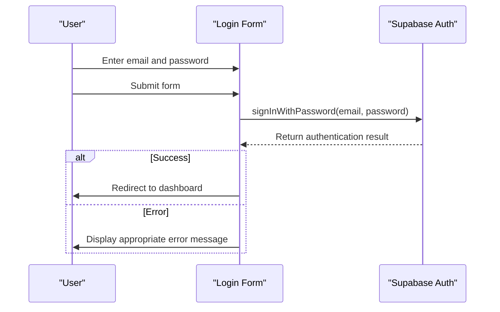
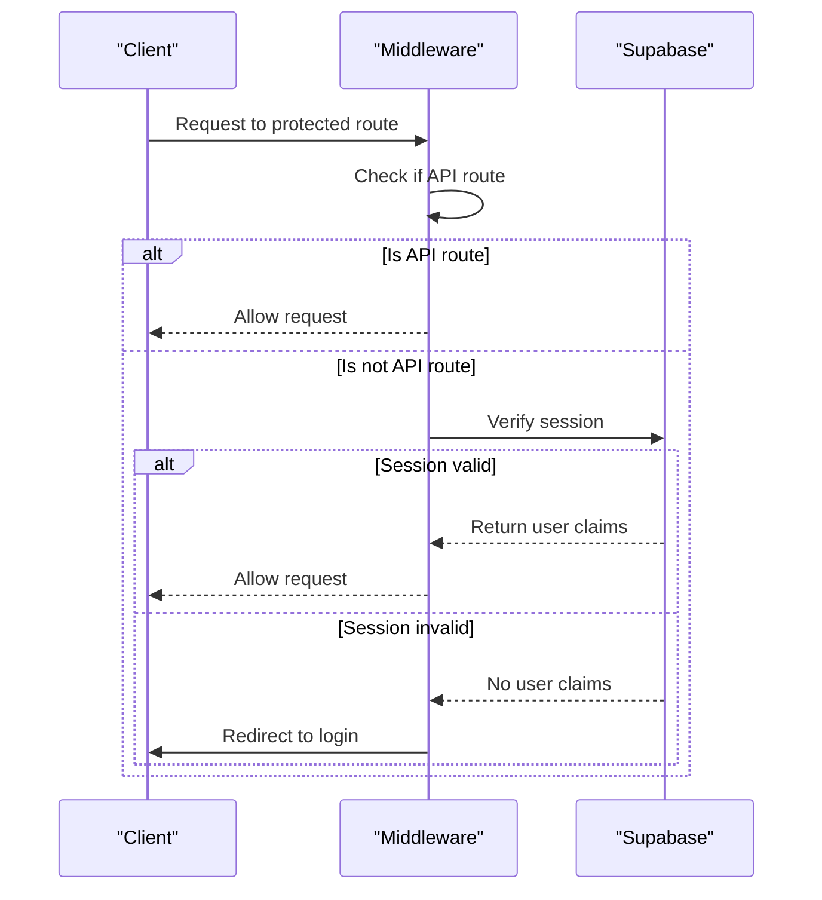

# Login Process

<cite>
**Referenced Files in This Document**   
- [login-form.tsx](file://app/auth/components/login-form.tsx)
- [page.tsx](file://app/auth/login/page.tsx)
- [supabase.ts](file://app/_lib/supabase.ts)
- [client.ts](file://app/_lib/client.ts)
- [middleware.ts](file://app/_lib/middleware.ts)
- [api-auth.ts](file://backend/auth/api-auth.ts)
</cite>

## Table of Contents
1. [Introduction](#introduction)
2. [Frontend Login Form Implementation](#frontend-login-form-implementation)
3. [Authentication Flow with Supabase](#authentication-flow-with-supabase)
4. [Backend Authentication API and Middleware](#backend-authentication-api-and-middleware)
5. [Session Management and Secure Cookie Handling](#session-management-and-secure-cookie-handling)
6. [Error Handling and User Feedback](#error-handling-and-user-feedback)
7. [Security Considerations](#security-considerations)
8. [Common Issues and Solutions](#common-issues-and-solutions)
9. [Conclusion](#conclusion)

## Introduction
The Sinesys application implements a secure authentication system using Supabase Auth for email/password credentials. This document details the complete login process, from the frontend user interface to backend authentication services. The system integrates Supabase's authentication capabilities with custom middleware to manage user sessions, protect routes, and ensure secure access to the application. The login process is designed to be user-friendly while maintaining high security standards through proper error handling, session management, and protection against common vulnerabilities.

## Frontend Login Form Implementation

The login form in Sinesys is implemented as a React component that handles user input, form submission, and error display. The form is located in the `LoginForm` component within the authentication section of the application.

The login page structure is minimal, focusing the user's attention on the authentication form. It uses a centered layout with appropriate spacing and includes the organization's logo for brand recognition. The form itself contains two input fields: one for the email address and another for the password. Both fields are required, with the email field using the appropriate HTML5 email input type for basic validation.

When the user submits the form, the component captures the email and password values and initiates the authentication process. During submission, the login button displays a loading state to prevent multiple submissions and provide visual feedback to the user. The form also includes a link to the "forgot password" functionality, allowing users to recover access to their accounts if they forget their credentials.

**Section sources**
- [login-form.tsx](file://app/auth/components/login-form.tsx#L19-L147)
- [page.tsx](file://app/auth/login/page.tsx#L3-L11)

## Authentication Flow with Supabase

The authentication flow in Sinesys leverages Supabase Auth to handle email/password credential verification. When a user submits their credentials, the frontend initiates the authentication process by calling Supabase's `signInWithPassword` method with the provided email and password.

The authentication process follows a structured sequence:
1. The user enters their email and password in the login form
2. Upon form submission, the frontend captures these credentials
3. The application calls Supabase Auth's `signInWithPassword` method with the credentials
4. Supabase verifies the credentials against its user database
5. If successful, Supabase returns authentication data including the user object and session information
6. The application redirects the user to the dashboard

The implementation includes proper error handling for various authentication failure scenarios, providing appropriate feedback to users without exposing sensitive information about the nature of the failure.

**Diagram sources**
- [login-form.tsx](file://app/auth/components/login-form.tsx#L32-L55)
- [supabase.ts](file://app/_lib/supabase.ts#L1-L10)

## Backend Authentication API and Middleware

Sinesys implements a comprehensive authentication system that combines frontend authentication with backend middleware to protect routes and manage user sessions. The backend authentication system supports multiple authentication methods, including session-based authentication for the frontend, Bearer tokens for API requests, and service API keys for system jobs.

The middleware, implemented in `middleware.ts`, intercepts incoming requests and checks for valid authentication. For requests to API routes, the middleware allows access without checking session cookies, as API endpoints use alternative authentication methods like Bearer tokens or service API keys. For all other routes, the middleware verifies the user's authentication status by checking Supabase session cookies.

If a user is not authenticated and attempts to access a protected route, the middleware redirects them to the login page. Conversely, if an authenticated user attempts to access the login page, they are redirected to the dashboard to prevent unnecessary login attempts.

The backend also includes an authentication utility (`api-auth.ts`) that provides a unified interface for authentication across different contexts. This utility can authenticate requests using three methods in order of priority:
1. Service API Key (for system jobs)
2. Bearer Token (for API requests)
3. Supabase Session (for frontend requests)

**Diagram sources**
- [middleware.ts](file://app/_lib/middleware.ts#L40-L56)
- [api-auth.ts](file://backend/auth/api-auth.ts#L51-L137)

**Section sources**
- [middleware.ts](file://app/_lib/middleware.ts#L1-L73)
- [api-auth.ts](file://backend/auth/api-auth.ts#L1-L139)

## Session Management and Secure Cookie Handling

Sinesys implements secure session management through Supabase's authentication system and Next.js middleware. When a user successfully authenticates, Supabase creates session cookies that are used to maintain the user's authenticated state across requests.

The session cookies are configured with security best practices:
- HTTPOnly flag to prevent access via JavaScript
- Secure flag to ensure transmission over HTTPS only
- SameSite attribute to prevent CSRF attacks
- Appropriate expiration times to balance security and user convenience

The middleware plays a crucial role in session management by verifying the validity of session cookies on each request to protected routes. It uses Supabase's server-side client to validate the session and extract user claims, ensuring that only authenticated users can access protected content.

The system also handles session updates and refreshes transparently, maintaining the user's session as long as they remain active. When a user logs out or their session expires, the cookies are properly invalidated and removed.

**Section sources**
- [middleware.ts](file://app/_lib/middleware.ts#L11-L30)
- [supabase.ts](file://app/_lib/supabase.ts#L1-L10)

## Error Handling and User Feedback

The login process in Sinesys includes comprehensive error handling to provide meaningful feedback to users while maintaining security. When authentication fails, the system catches errors and displays user-friendly messages that help users understand what went wrong without revealing sensitive information.

The error handling system distinguishes between different types of authentication failures:
- Invalid credentials (incorrect email or password)
- Unconfirmed email addresses
- Server-side authentication errors
- Database connectivity issues
- Known Supabase authentication bugs

For invalid credentials, users receive a simple message indicating that their email or password is incorrect. For unconfirmed emails, users are prompted to confirm their email address before logging in. The system also handles specific Supabase authentication errors, such as database schema issues related to email changes, providing appropriate guidance to users and developers.

During the login process, the UI provides visual feedback through loading states and error messages displayed below the form. The login button is disabled during submission to prevent multiple requests and potential rate limiting issues.

**Section sources**
- [login-form.tsx](file://app/auth/components/login-form.tsx#L56-L83)

## Security Considerations

Sinesys implements multiple security measures to protect the authentication process and user data. The system follows security best practices for web authentication, including:

1. **Secure Credential Transmission**: All authentication requests are transmitted over HTTPS, ensuring that credentials are encrypted in transit.

2. **Password Security**: Passwords are never exposed in the frontend code or logs. The password input field uses the appropriate HTML type to prevent browser autocomplete in certain contexts.

3. **CSRF Protection**: The system leverages Supabase's built-in CSRF protection mechanisms to prevent cross-site request forgery attacks.

4. **HTTPOnly Cookies**: Session cookies are marked as HTTPOnly, preventing access via client-side JavaScript and reducing the risk of XSS attacks.

5. **Rate Limiting**: While not explicitly shown in the code, Supabase Auth includes built-in rate limiting to prevent brute force attacks.

6. **Input Validation**: The system performs basic input validation on the frontend, with comprehensive validation handled by Supabase on the backend.

7. **Error Message Security**: Error messages are carefully crafted to avoid revealing whether an email address exists in the system, preventing user enumeration attacks.

The combination of Supabase's secure authentication infrastructure and the application's proper implementation creates a robust security posture for the login process.

**Section sources**
- [login-form.tsx](file://app/auth/components/login-form.tsx#L129-L134)
- [middleware.ts](file://app/_lib/middleware.ts#L15-L28)

## Common Issues and Solutions

The Sinesys login process addresses several common authentication issues:

**Incorrect Credentials**: When users enter incorrect email or password combinations, the system displays a clear error message: "Email ou senha incorretos" (Email or password incorrect). This generic message prevents attackers from determining which credential was incorrect, enhancing security.

**Unconfirmed Email Addresses**: Users who have not confirmed their email addresses receive a specific error message prompting them to confirm their email before logging in. This ensures that only verified users can access the system.

**Supabase Authentication Bugs**: The system handles known issues with Supabase Auth, such as database schema errors related to email changes. When these occur, users are informed of the issue and advised to contact support.

**Network and Server Errors**: For server-side authentication failures, the system provides appropriate error messages that guide users to try again later or contact support, without exposing technical details that could be exploited.

**Account Lockout**: While not explicitly implemented in the provided code, Supabase Auth includes mechanisms to prevent brute force attacks, which helps protect against account lockout due to excessive failed login attempts.

**Section sources**
- [login-form.tsx](file://app/auth/components/login-form.tsx#L59-L78)

## Conclusion

The login process in Sinesys provides a secure and user-friendly authentication experience by leveraging Supabase Auth for email/password credentials. The system combines a clean frontend interface with robust backend authentication services and middleware to protect routes and manage sessions. Key features include proper error handling, secure cookie management, and protection against common security vulnerabilities. The implementation follows best practices for web authentication, ensuring that user credentials are handled securely while providing a smooth user experience. By using Supabase as the authentication provider, Sinesys benefits from a reliable, scalable, and secure authentication infrastructure that handles the complexities of user management, allowing the application to focus on its core functionality.