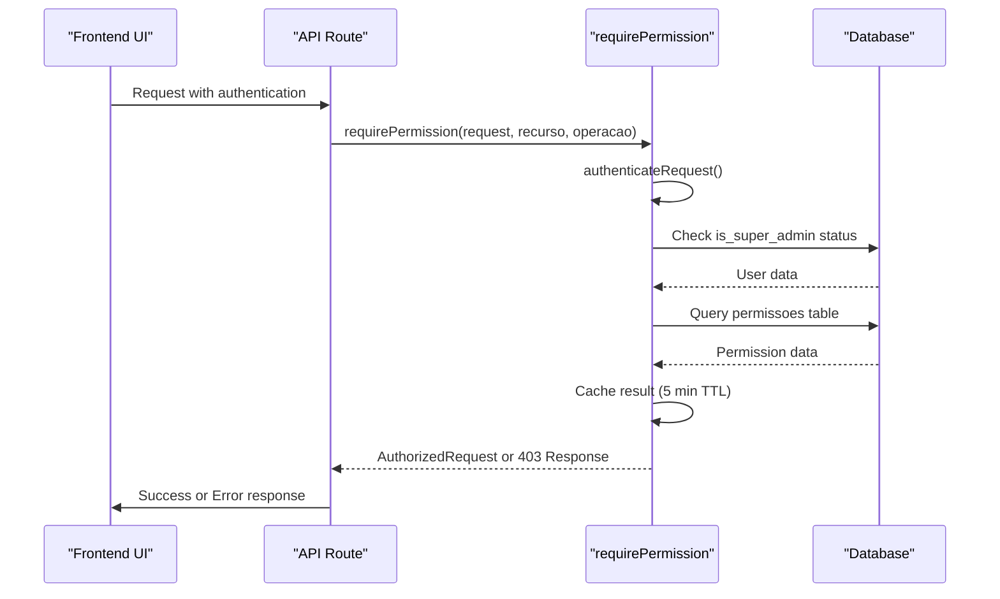
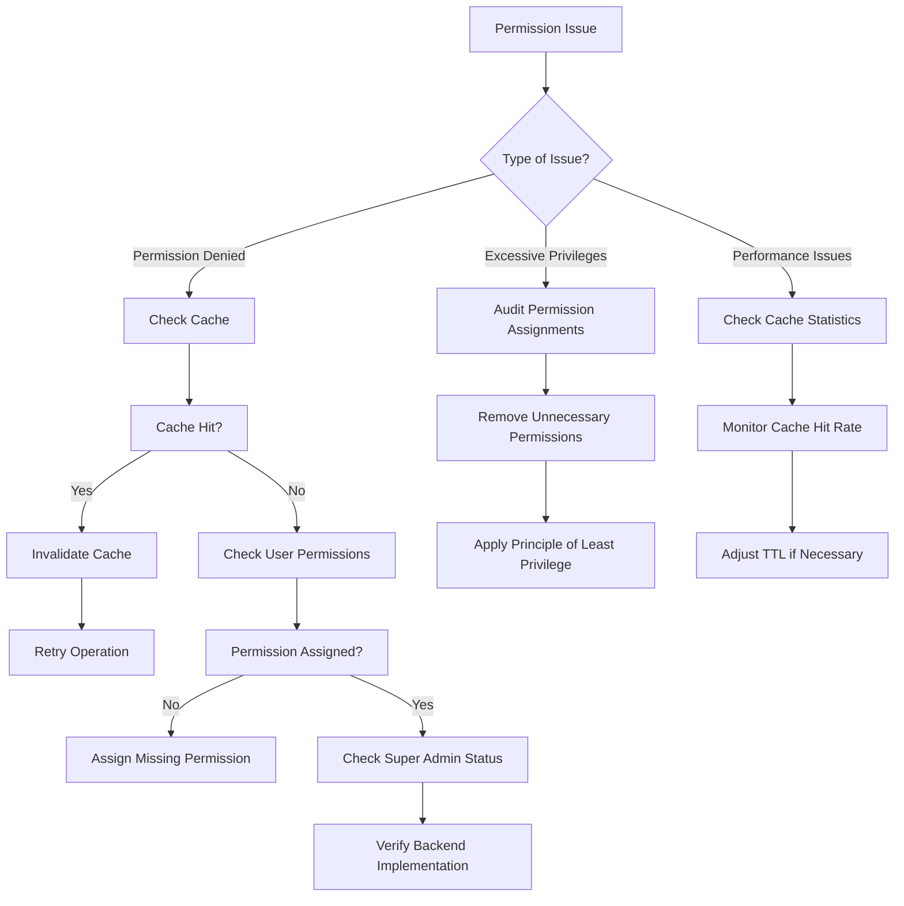

# Permission System

<cite>
**Referenced Files in This Document**   
- [require-permission.ts](file://backend/auth/require-permission.ts)
- [authorization.ts](file://backend/auth/authorization.ts)
- [permissao-persistence.service.ts](file://backend/permissoes/services/persistence/permissao-persistence.service.ts)
- [types.ts](file://backend/types/permissoes/types.ts)
- [minhas/route.ts](file://app/api/permissoes/minhas/route.ts)
- [recursos/route.ts](file://app/api/permissoes/recursos/route.ts)
- [usuarios/[id]/route.ts](file://app/api/permissoes/usuarios/[id]/route.ts)
- [00_permissions.sql](file://supabase/schemas/00_permissions.sql)
- [page.tsx](file://app/ajuda/integracao/permissoes/page.tsx)
</cite>

## Table of Contents
1. [Introduction](#introduction)
2. [Granular Permission Model](#granular-permission-model)
3. [Permission Matrix UI Component](#permission-matrix-ui-component)
4. [Permission Checks in Frontend and Backend](#permission-checks-in-frontend-and-backend)
5. [Permission Scopes and Resource-Level Access Control](#permission-scopes-and-resource-level-access-control)
6. [Action-Based Permissions](#action-based-permissions)
7. [Relationship with Role-Based Access Control](#relationship-with-role-based-access-control)
8. [Common Issues and Solutions](#common-issues-and-solutions)
9. [Conclusion](#conclusion)

## Introduction

The Sinesys permission system is a granular, user-based access control mechanism that provides fine-grained control over system resources and operations. Unlike traditional role-based systems, Sinesys implements direct user-to-permission assignments, allowing for precise access management across 20 resources with 126 distinct permissions. The system combines backend verification with frontend enforcement, caching mechanisms for performance, and comprehensive audit logging for security compliance. This documentation provides a comprehensive overview of the permission architecture, implementation details, and practical usage patterns.

**Section sources**
- [page.tsx](file://app/ajuda/integracao/permissoes/page.tsx#L72-L508)

## Granular Permission Model

The Sinesys permission system is built on a granular model that separates resources from operations, enabling precise access control. Each permission is defined by a combination of a resource and an operation, following the pattern `{resource}.{operation}`. The system supports 20 distinct resources such as 'advogados', 'contratos', 'audiencias', and 'financeiro', each with specific operations like 'criar', 'editar', 'deletar', and resource-specific actions like 'atribuir_responsavel' or 'baixar_expediente'. 

Permissions are stored in a dedicated `permissoes` table with a composite unique constraint on `usuario_id`, `recurso`, and `operacao`, ensuring no duplicate permission assignments. The system also recognizes super administrators through an `is_super_admin` flag, who automatically have access to all resources and operations without explicit permission assignments. This granular approach allows organizations to implement the principle of least privilege, granting users only the specific permissions they need to perform their duties.

```mermaid
erDiagram
PERMISSOES {
bigint id PK
bigint usuario_id FK
text recurso
text operacao
boolean permitido
timestamp created_at
timestamp updated_at
UNIQUE(usuario_id, recurso, operacao)
}
USUARIOS {
bigint id PK
text nome
text email
boolean is_super_admin
bigint cargo_id FK
}
PERMISSOES ||--o{ USUARIOS : "pertence a"
```

**Diagram sources**
- [00_permissions.sql](file://supabase/schemas/00_permissions.sql#L1-L21)
- [types.ts](file://backend/types/permissoes/types.ts#L9-L415)

**Section sources**
- [types.ts](file://backend/types/permissoes/types.ts#L9-L415)
- [permissao-persistence.service.ts](file://backend/permissoes/services/persistence/permissao-persistence.service.ts#L1-L277)

## Permission Matrix UI Component

The permission matrix UI component provides administrators with a comprehensive interface for managing user permissions across the system. This component displays all available resources and their associated operations in a tabular format, allowing for bulk permission assignments. The UI is accessible through the administration panel and presents permissions in a structured matrix where resources are listed as rows and operations as columns, with checkboxes enabling or disabling specific permissions.

The component integrates with the backend API endpoints to fetch the complete permission matrix and user-specific permissions. It supports batch operations through the `/api/permissoes/usuarios/[id]` endpoint, allowing administrators to assign or replace multiple permissions in a single request. The interface also includes visual indicators for super administrator status and provides real-time feedback on permission changes. For usability, the component groups related resources and operations, implements search and filtering capabilities, and includes audit trail information showing who made permission changes and when.

**Section sources**
- [page.tsx](file://app/ajuda/integracao/permissoes/page.tsx#L22-L44)

## Permission Checks in Frontend and Backend

Permission checks in Sinesys are implemented through a combination of frontend enforcement and mandatory backend verification. The system uses a middleware approach with the `requirePermission` function that handles both authentication and authorization in a single call. On the backend, API routes implement permission checks using the `requirePermission` helper, which first authenticates the request and then verifies the required permission before allowing access to protected resources.

In the frontend, permission checks are performed by calling the `/api/permissoes/minhas` endpoint to retrieve the current user's permissions, which are then cached and used to conditionally render UI elements. The system employs a 5-minute TTL cache to balance performance and security, with automatic cache invalidation when permissions are modified. Both frontend and backend implementations follow the same permission model, ensuring consistency across the application. The backend always performs final authorization checks, making frontend permission enforcement a convenience feature rather than a security boundary.



**Diagram sources**
- [require-permission.ts](file://backend/auth/require-permission.ts#L67-L111)
- [authorization.ts](file://backend/auth/authorization.ts#L56-L145)
- [minhas/route.ts](file://app/api/permissoes/minhas/route.ts#L35-L89)

**Section sources**
- [require-permission.ts](file://backend/auth/require-permission.ts#L67-L111)
- [minhas/route.ts](file://app/api/permissoes/minhas/route.ts#L35-L89)

## Permission Scopes and Resource-Level Access Control

Sinesys implements resource-level access control through a comprehensive permission scoping system that defines boundaries for different types of data and functionality. Each resource in the system represents a distinct domain such as 'contratos', 'audiencias', or 'financeiro', with specific operations that can be performed on that resource. The permission system supports both broad resource access (like 'listar' or 'visualizar') and granular, context-specific operations (like 'atribuir_responsavel' or 'editar_url_virtual').

Resource-level access control is enforced through database-level policies and application logic. The system uses Supabase's Row Level Security (RLS) to restrict data access at the database level, while the application layer provides additional business logic validation. For resources with hierarchical data structures, the permission model supports both entity-level and field-level access control. The system also implements resource-specific permission patterns, such as requiring separate permissions for creating, editing, and deleting entities, ensuring that users have appropriate access levels for different operations on the same resource.

**Section sources**
- [types.ts](file://backend/types/permissoes/types.ts#L9-L415)
- [authorization.ts](file://backend/auth/authorization.ts#L56-L145)

## Action-Based Permissions

The Sinesys permission system implements action-based permissions that go beyond basic CRUD operations to support complex business workflows. Each action is defined as a specific operation on a resource, allowing for precise control over user capabilities. The system includes common operations like 'criar', 'editar', and 'deletar', but also implements resource-specific actions such as 'atribuir_responsavel', 'baixar_expediente', 'reverter_baixa', and 'registrar_repasse'.

Action-based permissions enable the system to support complex business processes where different users need different levels of access to perform specific tasks. For example, in the financial module, separate permissions exist for 'confirmar', 'estornar', 'cancelar', and 'conciliar' operations on financial entries, allowing organizations to implement segregation of duties. The system also supports multi-step actions through permission combinations, where completing a complex workflow requires multiple specific permissions. This approach provides greater flexibility than traditional role-based systems, allowing administrators to grant exactly the permissions needed for specific job functions.

**Section sources**
- [types.ts](file://backend/types/permissoes/types.ts#L46-L111)

## Relationship with Role-Based Access Control

While Sinesys primarily implements a user-based permission system, it incorporates role-based access control concepts through the integration of cargo (position) assignments. Users are assigned to cargos, which can be associated with predefined permission sets, providing a hybrid approach that combines the flexibility of direct permission assignment with the organizational benefits of role-based management. The system allows administrators to define standard permission profiles for different organizational roles, which can then be applied to users when they are assigned to corresponding cargos.

However, unlike pure role-based systems, Sinesys allows for individual permission overrides, enabling administrators to grant additional permissions to specific users beyond their role assignments. This hybrid model provides both consistency in permission management across similar roles and the flexibility to accommodate exceptional cases. The system also supports temporary permission grants for specific tasks or projects, which can be easily revoked when no longer needed. This approach balances the administrative efficiency of role-based systems with the precision of user-based permission management.

**Section sources**
- [types.ts](file://backend/types/permissoes/types.ts#L29-L30)
- [page.tsx](file://app/ajuda/integracao/permissoes/page.tsx#L23-L43)

## Common Issues and Solutions

The Sinesys permission system addresses several common access control issues through specific design patterns and operational procedures. One frequent issue is permission gaps, where users lack necessary permissions to perform their duties. The system mitigates this through comprehensive permission auditing and the ability to quickly assign missing permissions via the permission matrix UI. Excessive privileges are prevented through the principle of least privilege, with new users receiving only basic access by default.

Permission caching issues are addressed through a 5-minute TTL cache with automatic invalidation when permissions are modified. The system provides the `invalidarCacheUsuario` function to manually clear a user's permission cache when immediate permission changes are required. Another common issue is the complexity of managing permissions at scale, which is addressed through batch operations and predefined permission templates for common roles. The system also includes comprehensive audit logging, recording all permission changes in the `logs_alteracao` table with details of what changed, who made the change, and when it occurred.



**Diagram sources**
- [authorization.ts](file://backend/auth/authorization.ts#L13-L31)
- [page.tsx](file://app/ajuda/integracao/permissoes/page.tsx#L420-L471)

**Section sources**
- [authorization.ts](file://backend/auth/authorization.ts#L13-L31)
- [page.tsx](file://app/ajuda/integracao/permissoes/page.tsx#L420-L471)

## Conclusion

The Sinesys permission system provides a robust, granular access control framework that balances security, flexibility, and usability. By implementing user-based permission assignments with support for super administrators and role-based patterns, the system offers a comprehensive solution for managing access in complex organizational environments. The combination of backend enforcement, frontend integration, caching for performance, and comprehensive audit logging creates a secure and maintainable access control system. The permission matrix UI component simplifies administration, while the well-defined API endpoints enable integration with external systems. This approach ensures that organizations can implement appropriate access controls that support their business processes while maintaining security and compliance.