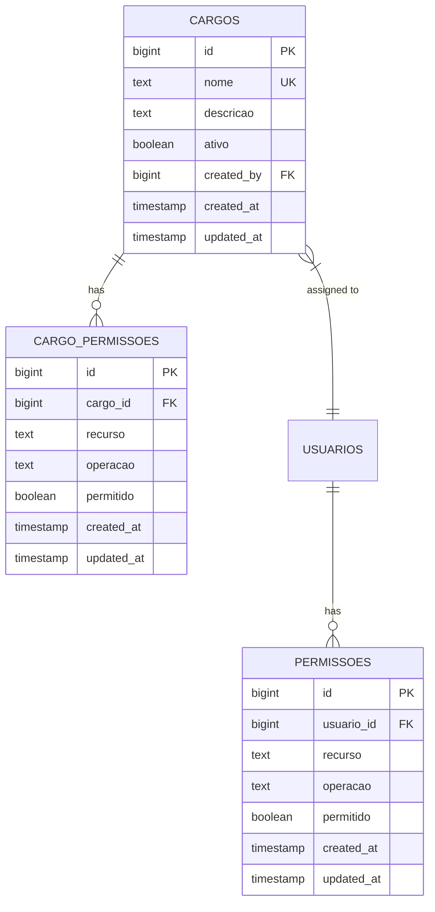
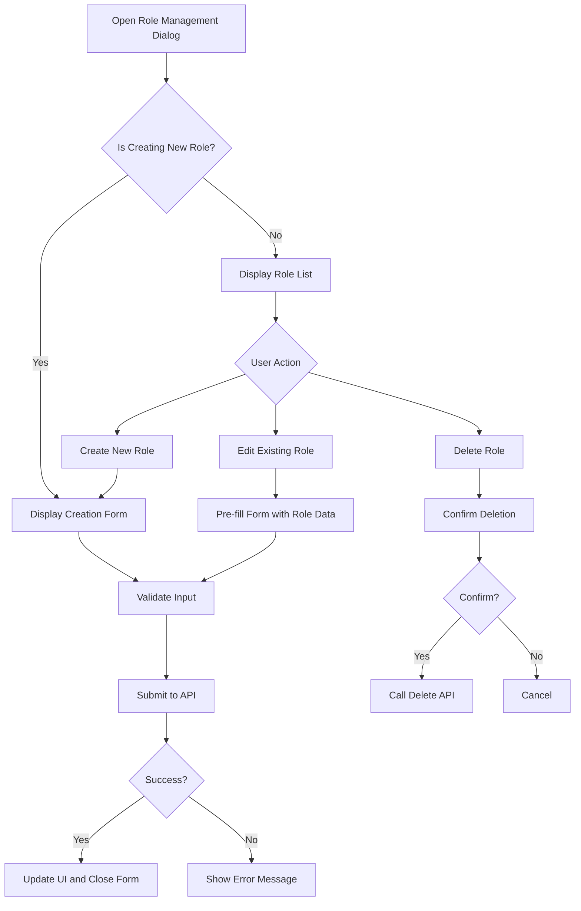
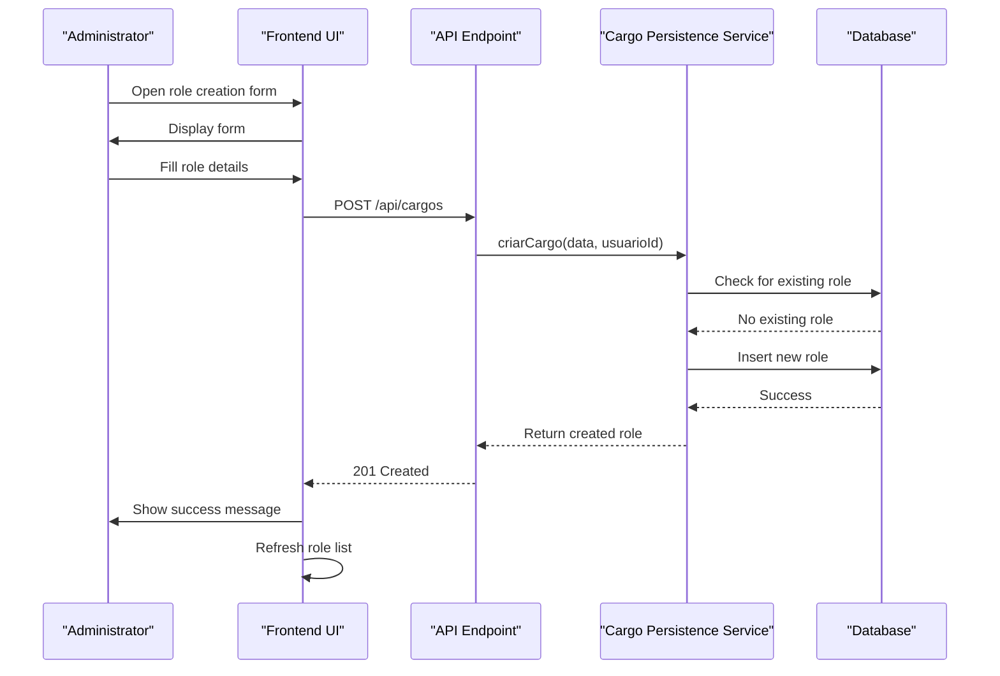
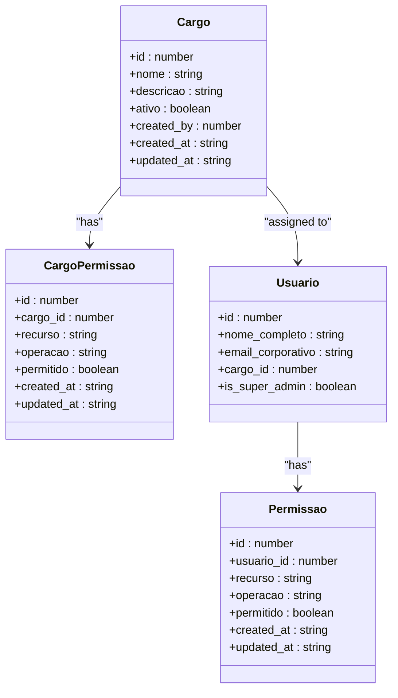
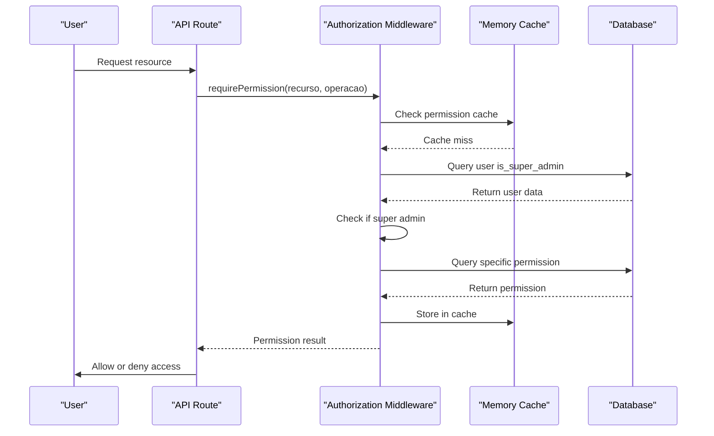
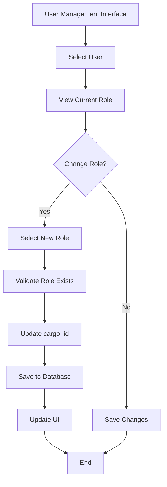
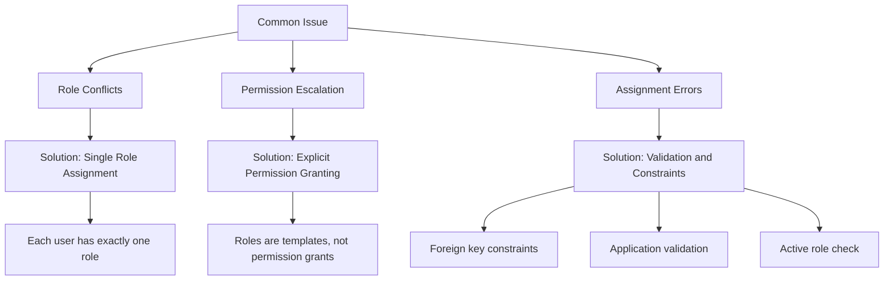
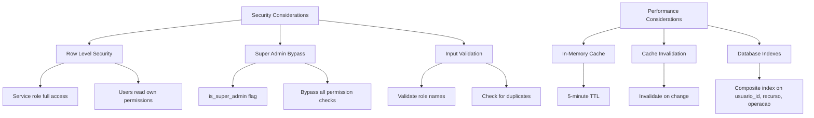

# Role-Based Access Control

<cite>
**Referenced Files in This Document**   
- [cargos-management-dialog.tsx](file://app/(dashboard)/usuarios/components/cargos-management-dialog.tsx)
- [use-cargos.ts](file://app/_lib/hooks/use-cargos.ts)
- [cargo-persistence.service.ts](file://backend/cargos/services/persistence/cargo-persistence.service.ts)
- [permissao-persistence.service.ts](file://backend/permissoes/services/persistence/permissao-persistence.service.ts)
- [authorization.ts](file://backend/auth/authorization.ts)
- [require-permission.ts](file://backend/auth/require-permission.ts)
- [22_cargos_permissoes.sql](file://supabase/schemas/22_cargos_permissoes.sql)
- [app/api/cargos/route.ts](file://app/api/cargos/route.ts)
</cite>

## Table of Contents
1. [Introduction](#introduction)
2. [Core Components](#core-components)
3. [Role Management Interface](#role-management-interface)
4. [Role Creation, Modification, and Deletion](#role-creation-modification-and-deletion)
5. [Role Hierarchy and Inheritance](#role-hierarchy-and-inheritance)
6. [Permission System Integration](#permission-system-integration)
7. [Role Assignment to Users](#role-assignment-to-users)
8. [Common Issues and Solutions](#common-issues-and-solutions)
9. [Security and Performance Considerations](#security-and-performance-considerations)

## Introduction
The Role-Based Access Control (RBAC) system in Sinesys provides a comprehensive framework for managing user permissions through roles (cargos). This system enables organizations to define roles with specific permission sets, assign these roles to users, and manage access to various resources within the application. The implementation combines role-based templates with granular permissions, allowing for both organizational structure and fine-grained access control. This documentation provides a detailed explanation of the RBAC system, covering role management, permission inheritance, and integration with the broader authorization framework.

## Core Components

The RBAC system in Sinesys consists of several interconnected components that work together to provide a robust access control mechanism. The system is built around three main entities: roles (cargos), permissions (permissoes), and role-permission templates (cargo_permissoes). These components are implemented across both frontend and backend layers, with a clear separation of concerns.

The database schema defines three key tables: `cargos` for storing role information, `permissoes` for granular user permissions, and `cargo_permissoes` for role-based permission templates. This structure allows for flexible permission management where roles serve as templates that can be applied to users, while individual permissions can be overridden as needed.

**Diagram sources**
- [22_cargos_permissoes.sql](file://supabase/schemas/22_cargos_permissoes.sql)

**Section sources**
- [22_cargos_permissoes.sql](file://supabase/schemas/22_cargos_permissoes.sql)

## Role Management Interface

The role management interface in Sinesys provides administrators with a comprehensive tool for managing roles within the system. Implemented as a dialog component, it offers a user-friendly interface for creating, editing, and deleting roles. The interface is designed to be intuitive while providing all necessary functionality for role administration.

The frontend implementation uses React with Next.js, leveraging SWR for data fetching and state management. The `CargosManagementDialog` component renders a modal dialog that displays a list of existing roles and provides forms for creating new roles or editing existing ones. The interface includes validation, loading states, and error handling to ensure a smooth user experience.

**Diagram sources**
- [cargos-management-dialog.tsx](file://app/(dashboard)/usuarios/components/cargos-management-dialog.tsx)

**Section sources**
- [cargos-management-dialog.tsx](file://app/(dashboard)/usuarios/components/cargos-management-dialog.tsx)

## Role Creation, Modification, and Deletion

The process of creating, modifying, and deleting roles in Sinesys follows a well-defined workflow that ensures data integrity and provides appropriate feedback to administrators. Each operation is handled through dedicated API endpoints that validate input, enforce business rules, and maintain audit trails.

When creating a new role, the system requires a unique name and optional description. The creation process includes validation to prevent duplicate role names and ensures that all required fields are properly filled. The backend service handles the database insertion and automatically manages timestamps and creator information.

**Diagram sources**
- [app/api/cargos/route.ts](file://app/api/cargos/route.ts)
- [cargo-persistence.service.ts](file://backend/cargos/services/persistence/cargo-persistence.service.ts)

**Section sources**
- [app/api/cargos/route.ts](file://app/api/cargos/route.ts)
- [cargo-persistence.service.ts](file://backend/cargos/services/persistence/cargo-persistence.service.ts)

## Role Hierarchy and Inheritance

The role system in Sinesys implements a template-based inheritance model where roles serve as permission templates that can be applied to users. This approach allows for efficient permission management while maintaining flexibility for individual overrides. The system does not implement a hierarchical role structure (where roles inherit from other roles) but instead uses role-based permission templates that are applied to users.

When a user is assigned to a role, the system does not automatically apply the role's permissions. Instead, the role serves as a suggestion or template that administrators can use when configuring a user's permissions. This design provides maximum flexibility, allowing administrators to start with a role's permission set and then customize it as needed for individual users.

The inheritance mechanism works through the `cargo_permissoes` table, which stores the default permissions for each role. These permissions are not automatically enforced but serve as a reference point when setting up user permissions. Administrators can view the permission template for a role and choose to apply all or some of these permissions to a user.

**Diagram sources**
- [22_cargos_permissoes.sql](file://supabase/schemas/22_cargos_permissoes.sql)

**Section sources**
- [22_cargos_permissoes.sql](file://supabase/schemas/22_cargos_permissoes.sql)

## Permission System Integration

The role-based access control system in Sinesys is tightly integrated with the granular permission system, creating a comprehensive authorization framework. While roles provide organizational structure, the actual access control is enforced through individual permissions stored in the `permissoes` table. This separation allows for both high-level role management and fine-grained permission control.

The integration between roles and permissions is managed through the backend authorization middleware. When checking if a user has permission to perform an action, the system first checks the user's individual permissions, then considers their role as context, but does not automatically grant permissions based on role membership. This design ensures that permissions are explicitly defined for each user, reducing the risk of unintended access.

**Diagram sources**
- [authorization.ts](file://backend/auth/authorization.ts)
- [require-permission.ts](file://backend/auth/require-permission.ts)

**Section sources**
- [authorization.ts](file://backend/auth/authorization.ts)
- [require-permission.ts](file://backend/auth/require-permission.ts)

## Role Assignment to Users

Role assignment in Sinesys is implemented as a simple reference from the users table to the cargos table. Each user has a `cargo_id` field that references their assigned role, but this assignment does not automatically confer permissions. Instead, the role serves as organizational metadata and a starting point for permission configuration.

The assignment process is straightforward: when a user is created or updated, an administrator can select a role from the available options. This selection updates the `cargo_id` field in the users table. The system provides validation to ensure that the referenced role exists and is active.

Role assignment is managed through the user management interface, which allows administrators to view and modify a user's role. The interface displays the user's current role and provides a dropdown list of available roles for reassignment. When a user's role is changed, the system does not automatically update their permissions, maintaining the principle of explicit permission assignment.

**Section sources**
- [22_cargos_permissoes.sql](file://supabase/schemas/22_cargos_permissoes.sql)

## Common Issues and Solutions

The RBAC implementation in Sinesys addresses several common issues in role-based access control systems. One potential issue is role conflicts, where a user might be assigned to multiple roles with conflicting permissions. The system avoids this by allowing only one role per user, eliminating the possibility of role conflicts.

Another common issue is permission escalation, where users might gain unintended access through role assignment. Sinesys mitigates this risk by decoupling role assignment from permission granting. Assigning a role to a user does not automatically grant any permissions; permissions must be explicitly assigned through the permission management system.

Role assignment errors, such as assigning a user to a non-existent or inactive role, are prevented through database constraints and application-level validation. The foreign key constraint between users and cargos ensures referential integrity, while the application validates that roles are active before allowing assignment.

**Section sources**
- [22_cargos_permissoes.sql](file://supabase/schemas/22_cargos_permissoes.sql)

## Security and Performance Considerations

The RBAC system in Sinesys incorporates several security and performance optimizations to ensure both robust protection and efficient operation. Security is prioritized through Row Level Security (RLS) policies in Supabase, which restrict access to permission data at the database level. Additionally, the system implements a super admin bypass that grants full access to users with the `is_super_admin` flag, providing emergency access when needed.

Performance is optimized through a multi-layered caching strategy. The authorization system uses in-memory caching with a 5-minute TTL to reduce database queries for permission checks. The cache is automatically invalidated when permissions are modified, ensuring consistency. For high-traffic scenarios, the system could be extended to use Redis for distributed caching.

**Section sources**
- [22_cargos_permissoes.sql](file://supabase/schemas/22_cargos_permissoes.sql)
- [authorization.ts](file://backend/auth/authorization.ts)