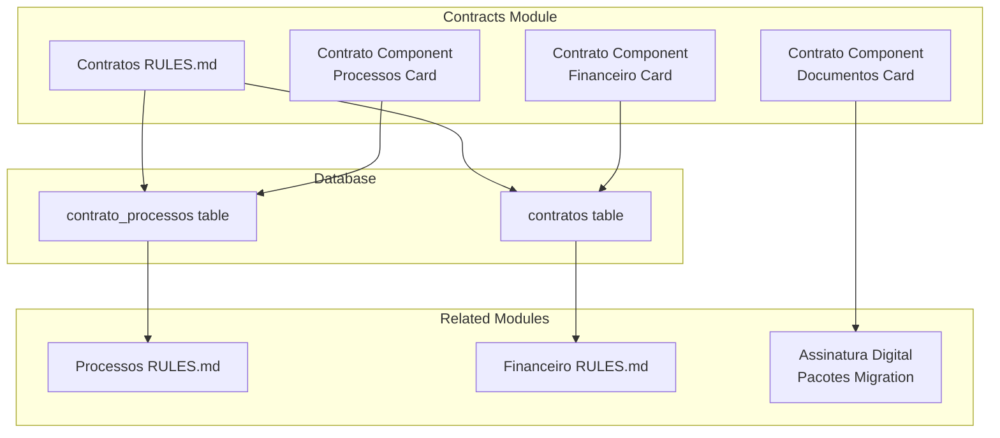
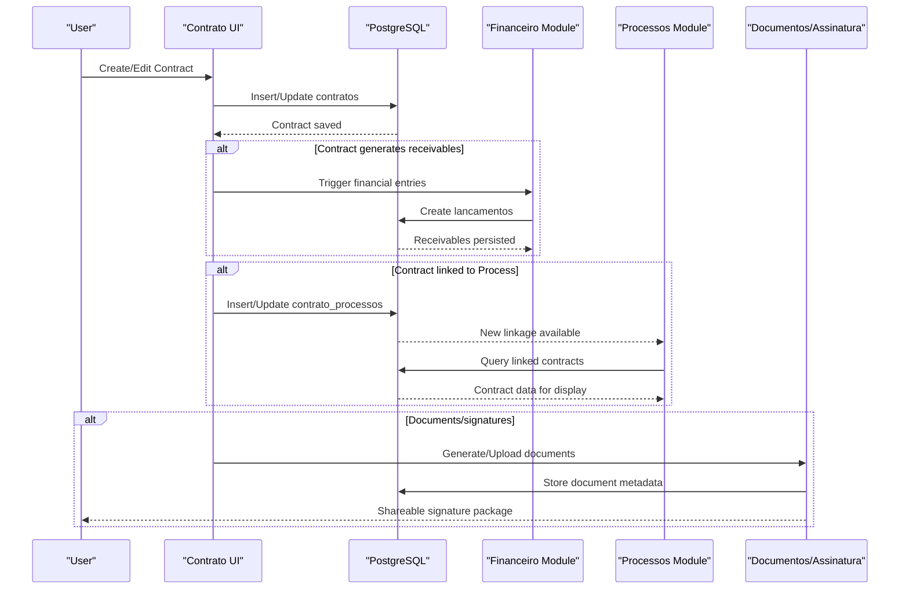
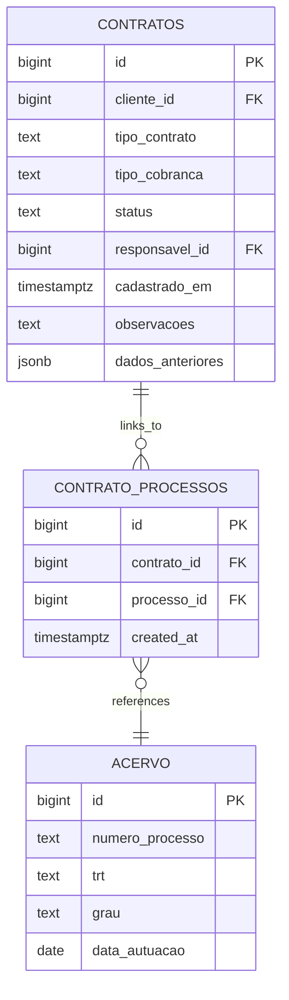
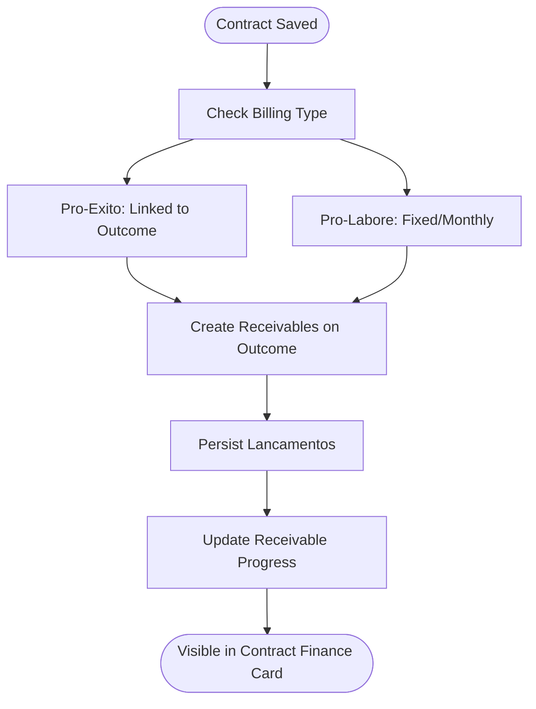
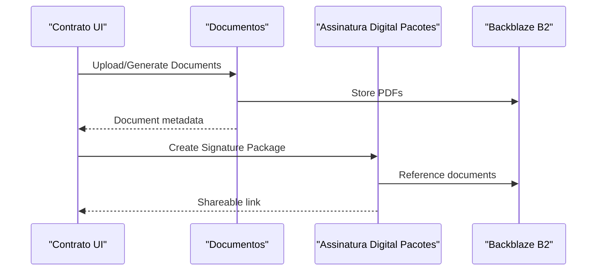
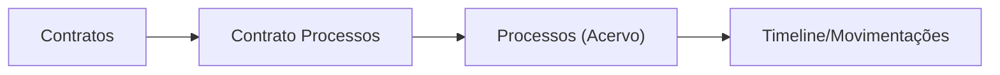
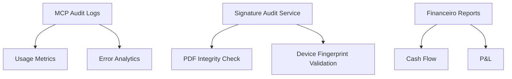
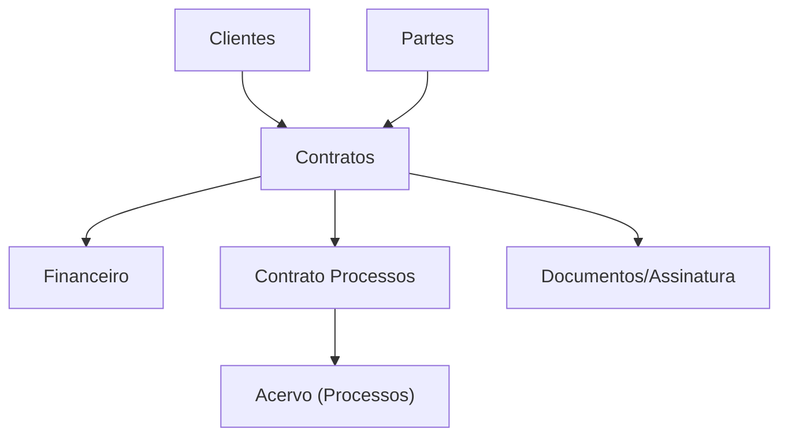

# Contract Integration and Relationships

<cite>
**Referenced Files in This Document**
- [src/app/(authenticated)/contratos/RULES.md](file://src/app/(authenticated)/contratos/RULES.md)
- [src/app/(authenticated)/processos/RULES.md](file://src/app/(authenticated)/processos/RULES.md)
- [src/app/(authenticated)/financeiro/RULES.md](file://src/app/(authenticated)/financeiro/RULES.md)
- [supabase/schemas/11_contratos.sql](file://supabase/schemas/11_contratos.sql)
- [supabase/schemas/12_contrato_processos.sql](file://supabase/schemas/12_contrato_processos.sql)
- [src/app/(authenticated)/contratos/[id]/components/contrato-processos-card.tsx](file://src/app/(authenticated)/contratos/[id]/components/contrato-processos-card.tsx)
- [src/app/(authenticated)/contratos/[id]/components/contrato-financeiro-card.tsx](file://src/app/(authenticated)/contratos/[id]/components/contrato-financeiro-card.tsx)
- [src/app/(authenticated)/contratos/[id]/components/contrato-documentos-card.tsx](file://src/app/(authenticated)/contratos/[id]/components/contrato-documentos-card.tsx)
- [supabase/migrations/20260416192859_assinatura_digital_pacotes.sql](file://supabase/migrations/20260416192859_assinatura_digital_pacotes.sql)
- [src/lib/mcp/audit.ts](file://src/lib/mcp/audit.ts)
- [src/shared/assinatura-digital/services/signature/audit.service.ts](file://src/shared/assinatura-digital/services/signature/audit.service.ts)
</cite>

## Table of Contents
1. [Introduction](#introduction)
2. [Project Structure](#project-structure)
3. [Core Components](#core-components)
4. [Architecture Overview](#architecture-overview)
5. [Detailed Component Analysis](#detailed-component-analysis)
6. [Dependency Analysis](#dependency-analysis)
7. [Performance Considerations](#performance-considerations)
8. [Troubleshooting Guide](#troubleshooting-guide)
9. [Conclusion](#conclusion)

## Introduction
This document explains how contracts integrate with legal processes (processos), financial tracking (financeiro), and document management systems. It details bidirectional relationships, synchronization mechanisms, and the impact of contract changes on related system components. Examples include contract-process linkage, financial obligations tracking, and document associations. It also covers integration with audit systems, compliance monitoring, and reporting features.

## Project Structure
The contract module is organized around:
- Business rules and validation (RULES.md)
- Database schema for contracts and contract-process relationships
- UI components that surface integrations (processos, financeiro, documents)
- Document management and signature packages
- Audit and compliance services

**Diagram sources**
- [src/app/(authenticated)/contratos/RULES.md](file://src/app/(authenticated)/contratos/RULES.md#L1-L192)
- [supabase/schemas/11_contratos.sql:1-61](file://supabase/schemas/11_contratos.sql#L1-L61)
- [supabase/schemas/12_contrato_processos.sql:1-29](file://supabase/schemas/12_contrato_processos.sql#L1-L29)
- [src/app/(authenticated)/processos/RULES.md](file://src/app/(authenticated)/processos/RULES.md#L1-L106)
- [src/app/(authenticated)/financeiro/RULES.md](file://src/app/(authenticated)/financeiro/RULES.md#L1-L188)
- [supabase/migrations/20260416192859_assinatura_digital_pacotes.sql:1-25](file://supabase/migrations/20260416192859_assinatura_digital_pacotes.sql#L1-L25)

**Section sources**
- [src/app/(authenticated)/contratos/RULES.md](file://src/app/(authenticated)/contratos/RULES.md#L1-L192)
- [supabase/schemas/11_contratos.sql:1-61](file://supabase/schemas/11_contratos.sql#L1-L61)
- [supabase/schemas/12_contrato_processos.sql:1-29](file://supabase/schemas/12_contrato_processos.sql#L1-L29)

## Core Components
- Contracts table: Stores contract metadata, status, responsible users, and audit fields.
- Contract-process relationship: Many-to-many via a dedicated junction table linking contracts to process acervo records.
- Contract-process card: Displays linked processes and enables adding new links.
- Contract-finance card: Shows receivable summary and individual receivables derived from the contract.
- Contract-documents card: Manages legal documents and generation of signature packages.
- Signature packages: Group multiple contract-related documents under a single shareable link.

**Section sources**
- [supabase/schemas/11_contratos.sql:1-61](file://supabase/schemas/11_contratos.sql#L1-L61)
- [supabase/schemas/12_contrato_processos.sql:1-29](file://supabase/schemas/12_contrato_processos.sql#L1-L29)
- [src/app/(authenticated)/contratos/[id]/components/contrato-processos-card.tsx](file://src/app/(authenticated)/contratos/[id]/components/contrato-processos-card.tsx#L1-L118)
- [src/app/(authenticated)/contratos/[id]/components/contrato-financeiro-card.tsx](file://src/app/(authenticated)/contratos/[id]/components/contrato-financeiro-card.tsx#L1-L214)
- [src/app/(authenticated)/contratos/[id]/components/contrato-documentos-card.tsx](file://src/app/(authenticated)/contratos/[id]/components/contrato-documentos-card.tsx#L1-L74)
- [supabase/migrations/20260416192859_assinatura_digital_pacotes.sql:1-25](file://supabase/migrations/20260416192859_assinatura_digital_pacotes.sql#L1-L25)

## Architecture Overview
The contract lifecycle integrates with processes, finance, and documents:

**Diagram sources**
- [src/app/(authenticated)/contratos/RULES.md](file://src/app/(authenticated)/contratos/RULES.md#L84-L95)
- [src/app/(authenticated)/financeiro/RULES.md](file://src/app/(authenticated)/financeiro/RULES.md#L45-L56)
- [src/app/(authenticated)/processos/RULES.md](file://src/app/(authenticated)/processos/RULES.md#L66-L79)
- [supabase/schemas/12_contrato_processos.sql:1-29](file://supabase/schemas/12_contrato_processos.sql#L1-L29)
- [supabase/migrations/20260416192859_assinatura_digital_pacotes.sql:1-25](file://supabase/migrations/20260416192859_assinatura_digital_pacotes.sql#L1-L25)

## Detailed Component Analysis

### Contracts and Legal Processes Integration
- Relationship model: One contract can be linked to multiple processes via the contract-processes table.
- UI integration: The contract detail page displays linked processes and allows adding new links.
- Impact on process management: Linked contracts enrich process views with contractual terms and obligations.

**Diagram sources**
- [supabase/schemas/11_contratos.sql:1-61](file://supabase/schemas/11_contratos.sql#L1-L61)
- [supabase/schemas/12_contrato_processos.sql:1-29](file://supabase/schemas/12_contrato_processos.sql#L1-L29)

**Section sources**
- [src/app/(authenticated)/contratos/RULES.md](file://src/app/(authenticated)/contratos/RULES.md#L91-L95)
- [src/app/(authenticated)/processos/RULES.md](file://src/app/(authenticated)/processos/RULES.md#L66-L79)
- [src/app/(authenticated)/contratos/[id]/components/contrato-processos-card.tsx](file://src/app/(authenticated)/contratos/[id]/components/contrato-processos-card.tsx#L52-L118)

### Financial Obligations Tracking
- Generation of receivables: Contracts generate financial entries based on billing type (pro-exito/pro-labore).
- Receivable summary: The contract detail page aggregates total value, received, pending, and progress percentage.
- Status propagation: Payment status updates in finance feed back into contract visibility and reporting.

**Diagram sources**
- [src/app/(authenticated)/contratos/RULES.md](file://src/app/(authenticated)/contratos/RULES.md#L84-L89)
- [src/app/(authenticated)/financeiro/RULES.md](file://src/app/(authenticated)/financeiro/RULES.md#L45-L56)
- [src/app/(authenticated)/contratos/[id]/components/contrato-financeiro-card.tsx](file://src/app/(authenticated)/contratos/[id]/components/contrato-financeiro-card.tsx#L138-L214)

**Section sources**
- [src/app/(authenticated)/contratos/RULES.md](file://src/app/(authenticated)/contratos/RULES.md#L84-L89)
- [src/app/(authenticated)/financeiro/RULES.md](file://src/app/(authenticated)/financeiro/RULES.md#L45-L56)
- [src/app/(authenticated)/contratos/[id]/components/contrato-financeiro-card.tsx](file://src/app/(authenticated)/contratos/[id]/components/contrato-financeiro-card.tsx#L138-L214)

### Document Management and Signature Packages
- Document association: Contracts manage legal pieces and attachments.
- Signature packages: Multiple contract-related documents can be grouped under a single shareable link for client signing.
- Compliance: Audit services validate document integrity and device fingerprint entropy.

**Diagram sources**
- [src/app/(authenticated)/contratos/[id]/components/contrato-documentos-card.tsx](file://src/app/(authenticated)/contratos/[id]/components/contrato-documentos-card.tsx#L19-L74)
- [supabase/migrations/20260416192859_assinatura_digital_pacotes.sql:1-25](file://supabase/migrations/20260416192859_assinatura_digital_pacotes.sql#L1-L25)
- [src/shared/assinatura-digital/services/signature/audit.service.ts:1-199](file://src/shared/assinatura-digital/services/signature/audit.service.ts#L1-L199)

**Section sources**
- [src/app/(authenticated)/contratos/[id]/components/contrato-documentos-card.tsx](file://src/app/(authenticated)/contratos/[id]/components/contrato-documentos-card.tsx#L1-L74)
- [supabase/migrations/20260416192859_assinatura_digital_pacotes.sql:1-25](file://supabase/migrations/20260416192859_assinatura_digital_pacotes.sql#L1-L25)
- [src/shared/assinatura-digital/services/signature/audit.service.ts:1-199](file://src/shared/assinatura-digital/services/signature/audit.service.ts#L1-L199)

### Case Management and Timeline Events
- Process unification: Processos module aggregates multi-instance processes (first, second, superior) for unified management.
- Timeline integration: Movimentations captured from PJE feed into process timelines; contract-linked processes inherit this context.
- Contract-process linkage: Enhances case management by surfacing contractual obligations alongside procedural events.

**Diagram sources**
- [src/app/(authenticated)/processos/RULES.md](file://src/app/(authenticated)/processos/RULES.md#L66-L79)
- [supabase/schemas/12_contrato_processos.sql:1-29](file://supabase/schemas/12_contrato_processos.sql#L1-L29)

**Section sources**
- [src/app/(authenticated)/processos/RULES.md](file://src/app/(authenticated)/processos/RULES.md#L66-L79)

### Audit Systems, Compliance Monitoring, and Reporting
- Audit logs: MCP audit service tracks tool usage, success rates, and durations for compliance reporting.
- Document integrity: Forensic audit service validates PDF integrity and device fingerprint entropy for legal admissibility.
- Reporting: Financeiro module provides consolidated reports (cash flow, P&L) that reflect contract-driven receivables.

**Diagram sources**
- [src/lib/mcp/audit.ts:203-256](file://src/lib/mcp/audit.ts#L203-L256)
- [src/shared/assinatura-digital/services/signature/audit.service.ts:1-199](file://src/shared/assinatura-digital/services/signature/audit.service.ts#L1-L199)
- [src/app/(authenticated)/financeiro/RULES.md](file://src/app/(authenticated)/financeiro/RULES.md#L152-L159)

**Section sources**
- [src/lib/mcp/audit.ts:203-256](file://src/lib/mcp/audit.ts#L203-L256)
- [src/shared/assinatura-digital/services/signature/audit.service.ts:1-199](file://src/shared/assinatura-digital/services/signature/audit.service.ts#L1-L199)
- [src/app/(authenticated)/financeiro/RULES.md](file://src/app/(authenticated)/financeiro/RULES.md#L152-L159)

## Dependency Analysis
- Contracts depend on clients and optionally on parties for validation.
- Contract-process linkage depends on process existence in the acervo.
- Financeiro depends on contracts for receivable generation and on processes for cost allocations.
- Document management depends on contracts for context and on signature packages for distribution.

**Diagram sources**
- [src/app/(authenticated)/contratos/RULES.md](file://src/app/(authenticated)/contratos/RULES.md#L53-L66)
- [supabase/schemas/12_contrato_processos.sql:1-29](file://supabase/schemas/12_contrato_processos.sql#L1-L29)
- [src/app/(authenticated)/financeiro/RULES.md](file://src/app/(authenticated)/financeiro/RULES.md#L38-L42)

**Section sources**
- [src/app/(authenticated)/contratos/RULES.md](file://src/app/(authenticated)/contratos/RULES.md#L53-L66)
- [supabase/schemas/12_contrato_processos.sql:1-29](file://supabase/schemas/12_contrato_processos.sql#L1-L29)
- [src/app/(authenticated)/financeiro/RULES.md](file://src/app/(authenticated)/financeiro/RULES.md#L38-L42)

## Performance Considerations
- Indexes on contracts and contract-processes support efficient filtering and joins.
- Revalidation paths after mutations ensure UI consistency across contracts, finance, and dashboards.
- Pagination defaults and limits in related modules prevent heavy queries on large datasets.

[No sources needed since this section provides general guidance]

## Troubleshooting Guide
- Contract creation/update errors: Validate client/partes existence and schema constraints; check audit field preservation.
- Process linkage issues: Ensure process exists in acervo and unique constraint prevents duplicate links.
- Financial discrepancies: Confirm receivable generation matches billing type and status propagation.
- Document/signature problems: Verify package creation and storage references; review audit service logs for integrity and fingerprint validation.

**Section sources**
- [src/app/(authenticated)/contratos/RULES.md](file://src/app/(authenticated)/contratos/RULES.md#L183-L192)
- [supabase/schemas/12_contrato_processos.sql:10-11](file://supabase/schemas/12_contrato_processos.sql#L10-L11)
- [src/app/(authenticated)/financeiro/RULES.md](file://src/app/(authenticated)/financeiro/RULES.md#L45-L56)
- [src/shared/assinatura-digital/services/signature/audit.service.ts:1-199](file://src/shared/assinatura-digital/services/signature/audit.service.ts#L1-L199)

## Conclusion
Contracts serve as the central integration point across legal processes, financial obligations, and document management. The defined relationships, UI components, and audit/compliance features ensure transparency, traceability, and seamless synchronization across modules. Contract changes propagate to processes, finance, and documents, enabling comprehensive case management and reporting.