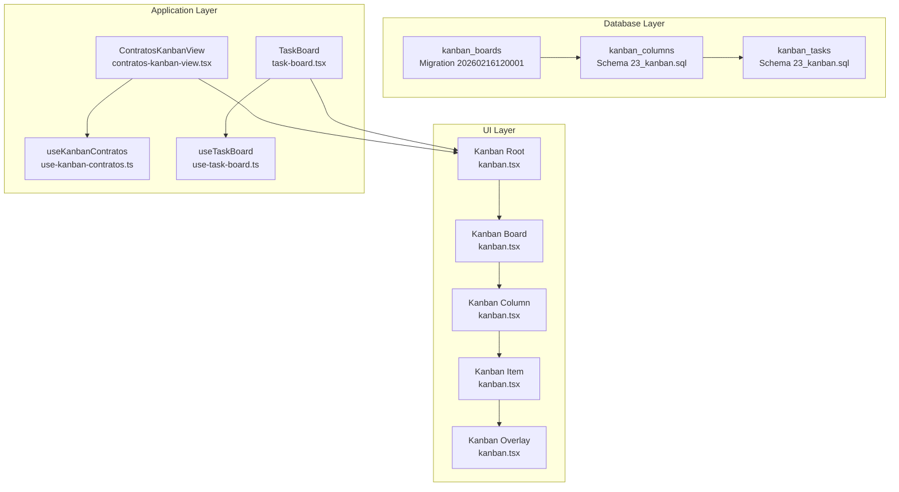
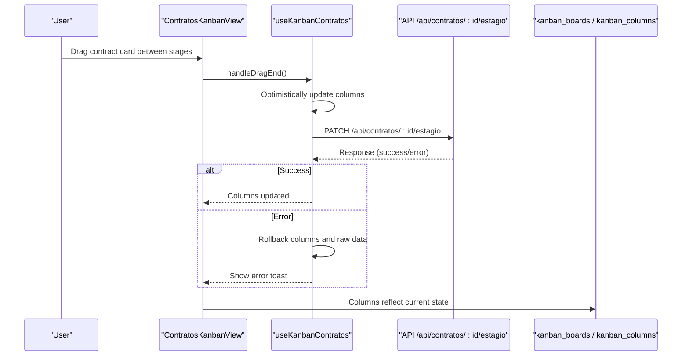
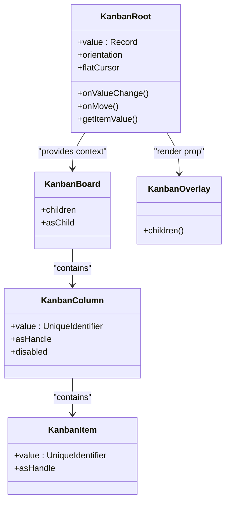
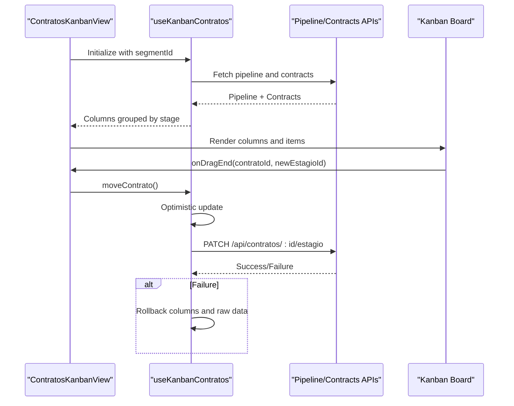
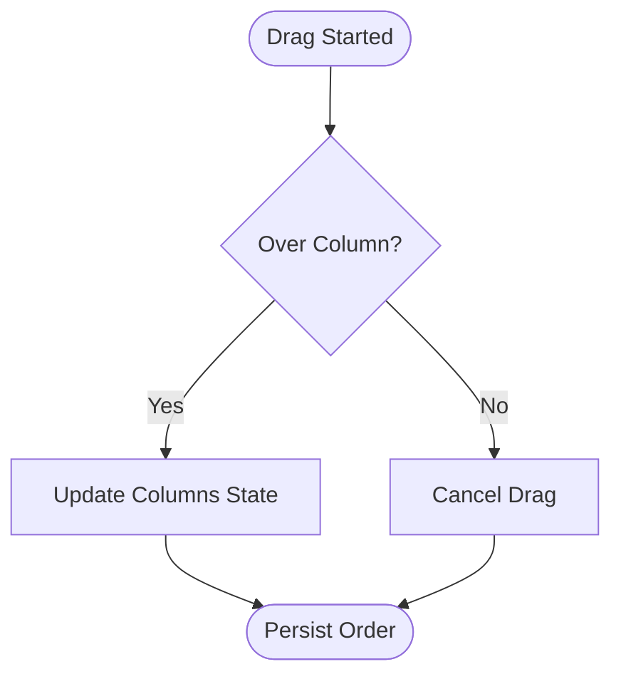
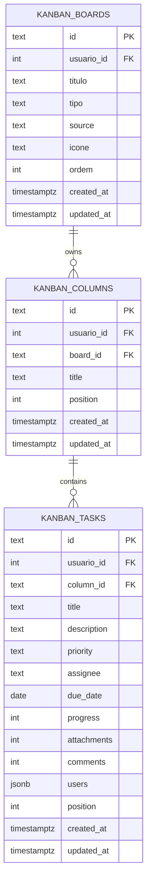
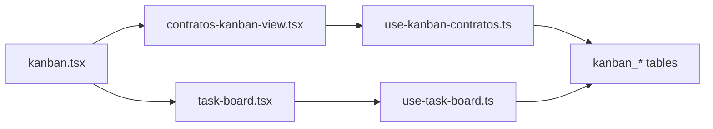

# Contract Kanban Boards and Task Management

<cite>
**Referenced Files in This Document**
- [20260216120001_create_kanban_boards.sql](file://supabase/migrations/20260216120001_create_kanban_boards.sql)
- [23_kanban.sql](file://supabase/schemas/23_kanban.sql)
- [kanban.tsx](file://src/components/ui/kanban.tsx)
- [contratos-kanban-view.tsx](file://src/app/(authenticated)/contratos/components/contratos-kanban-view.tsx)
- [use-kanban-contratos.ts](file://src/app/(authenticated)/contratos/hooks/use-kanban-contratos.ts)
- [task-board.tsx](file://src/app/(authenticated)/project-management/components/tasks/task-board.tsx)
- [use-task-board.ts](file://src/app/(authenticated)/project-management/hooks/use-task-board.ts)
</cite>

## Table of Contents
1. [Introduction](#introduction)
2. [Project Structure](#project-structure)
3. [Core Components](#core-components)
4. [Architecture Overview](#architecture-overview)
5. [Detailed Component Analysis](#detailed-component-analysis)
6. [Dependency Analysis](#dependency-analysis)
7. [Performance Considerations](#performance-considerations)
8. [Troubleshooting Guide](#troubleshooting-guide)
9. [Conclusion](#conclusion)

## Introduction
This document describes the Contract Kanban Boards and Task Management system, focusing on the kanban board implementation, drag-and-drop functionality, and column-based workflow visualization. It explains task assignment, status tracking, and progress monitoring capabilities, along with integration with contract pipelines, deadline management, and team collaboration features. The document also covers board customization, column configuration, task prioritization, real-time updates, notifications, reporting, permissions, access controls, and collaborative editing capabilities.

## Project Structure
The system is implemented across three main layers:
- Database schema and migrations define the kanban data model and security policies.
- UI components provide reusable drag-and-drop kanban primitives.
- Application views and hooks orchestrate contract-specific kanban boards and task boards with business logic.

**Diagram sources**
- [20260216120001_create_kanban_boards.sql:1-65](file://supabase/migrations/20260216120001_create_kanban_boards.sql#L1-L65)
- [23_kanban.sql:1-127](file://supabase/schemas/23_kanban.sql#L1-L127)
- [kanban.tsx:1-1040](file://src/components/ui/kanban.tsx#L1-L1040)
- [contratos-kanban-view.tsx](file://src/app/(authenticated)/contratos/components/contratos-kanban-view.tsx#L1-L392)
- [use-kanban-contratos.ts](file://src/app/(authenticated)/contratos/hooks/use-kanban-contratos.ts#L1-L266)
- [task-board.tsx](file://src/app/(authenticated)/project-management/components/tasks/task-board.tsx#L1-L126)
- [use-task-board.ts](file://src/app/(authenticated)/project-management/hooks/use-task-board.ts#L1-L176)

**Section sources**
- [20260216120001_create_kanban_boards.sql:1-65](file://supabase/migrations/20260216120001_create_kanban_boards.sql#L1-L65)
- [23_kanban.sql:1-127](file://supabase/schemas/23_kanban.sql#L1-L127)
- [kanban.tsx:1-1040](file://src/components/ui/kanban.tsx#L1-L1040)
- [contratos-kanban-view.tsx](file://src/app/(authenticated)/contratos/components/contratos-kanban-view.tsx#L1-L392)
- [use-kanban-contratos.ts](file://src/app/(authenticated)/contratos/hooks/use-kanban-contratos.ts#L1-L266)
- [task-board.tsx](file://src/app/(authenticated)/project-management/components/tasks/task-board.tsx#L1-L126)
- [use-task-board.ts](file://src/app/(authenticated)/project-management/hooks/use-task-board.ts#L1-L176)

## Core Components
- Kanban primitives: A reusable drag-and-drop system built on dnd-kit, providing Kanban root, board, column, item, and overlay components with keyboard, mouse, and touch support.
- Contract Kanban View: A specialized board for contracts that integrates with contract pipelines, supports drag-and-drop movement between stages, optimistic updates, and rollback on failure.
- Task Board: A project management kanban board for tasks with status-based columns, drag-and-drop reordering, and persistence of order changes.
- Database Schema: Defines kanban boards, columns, and tasks with Row Level Security (RLS) policies, foreign keys, and constraints for data integrity.

Key capabilities:
- Drag-and-drop across columns and items with keyboard navigation.
- Optimistic UI updates with automatic rollback on errors.
- Column-based workflow visualization aligned with contract pipelines or task statuses.
- Task assignment, priority, due dates, progress tracking, and collaboration indicators.

**Section sources**
- [kanban.tsx:1-1040](file://src/components/ui/kanban.tsx#L1-L1040)
- [contratos-kanban-view.tsx](file://src/app/(authenticated)/contratos/components/contratos-kanban-view.tsx#L1-L392)
- [use-kanban-contratos.ts](file://src/app/(authenticated)/contratos/hooks/use-kanban-contratos.ts#L1-L266)
- [task-board.tsx](file://src/app/(authenticated)/project-management/components/tasks/task-board.tsx#L1-L126)
- [use-task-board.ts](file://src/app/(authenticated)/project-management/hooks/use-task-board.ts#L1-L176)
- [23_kanban.sql:1-127](file://supabase/schemas/23_kanban.sql#L1-L127)
- [20260216120001_create_kanban_boards.sql:1-65](file://supabase/migrations/20260216120001_create_kanban_boards.sql#L1-L65)

## Architecture Overview
The system follows a layered architecture:
- Database layer stores board definitions, columns, and tasks with RLS policies.
- UI layer provides generic kanban primitives for building domain-specific boards.
- Application layer orchestrates business logic, data fetching, and user interactions.

**Diagram sources**
- [contratos-kanban-view.tsx](file://src/app/(authenticated)/contratos/components/contratos-kanban-view.tsx#L244-L283)
- [use-kanban-contratos.ts](file://src/app/(authenticated)/contratos/hooks/use-kanban-contratos.ts#L197-L255)
- [20260216120001_create_kanban_boards.sql:42-61](file://supabase/migrations/20260216120001_create_kanban_boards.sql#L42-L61)

**Section sources**
- [contratos-kanban-view.tsx](file://src/app/(authenticated)/contratos/components/contratos-kanban-view.tsx#L213-L346)
- [use-kanban-contratos.ts](file://src/app/(authenticated)/contratos/hooks/use-kanban-contratos.ts#L109-L265)
- [20260216120001_create_kanban_boards.sql:1-65](file://supabase/migrations/20260216120001_create_kanban_boards.sql#L1-L65)

## Detailed Component Analysis

### Kanban Primitives (Reusable UI)
The kanban primitives provide a flexible foundation for building boards:
- KanbanRoot: Central context provider managing drag-and-drop state, collision detection, and announcements.
- KanbanBoard: Container for columns with sortable context and orientation support.
- KanbanColumn: Draggable column with sortable items inside.
- KanbanItem: Draggable task/card within a column.
- KanbanOverlay: Render prop overlay for drag previews.

Implementation highlights:
- Sensors for mouse, touch, and keyboard with custom coordinate getters for cross-container navigation.
- Collision detection optimized for board boundaries and column containers.
- Accessibility announcements for screen readers during drag operations.
- Flat cursor option and handle-based dragging for ergonomic UX.

**Diagram sources**
- [kanban.tsx:200-590](file://src/components/ui/kanban.tsx#L200-L590)
- [kanban.tsx:600-768](file://src/components/ui/kanban.tsx#L600-L768)
- [kanban.tsx:769-1040](file://src/components/ui/kanban.tsx#L769-L1040)

**Section sources**
- [kanban.tsx:1-1040](file://src/components/ui/kanban.tsx#L1-L1040)

### Contract Kanban View
The Contract Kanban View renders a pipeline-driven board:
- Fetches contract pipeline and contracts for a selected segment.
- Groups contracts by stage and displays them in columns.
- Supports drag-and-drop to move contracts between stages with optimistic updates and rollback on error.
- Provides search filtering and skeleton/empty states.

Key behaviors:
- Uses a dedicated hook to manage state, fetch data, and perform moves.
- Integrates with contract pipeline stages to color-code and label columns.
- Handles edge cases like missing pipeline, empty segments, and invalid moves.

**Diagram sources**
- [contratos-kanban-view.tsx](file://src/app/(authenticated)/contratos/components/contratos-kanban-view.tsx#L361-L391)
- [use-kanban-contratos.ts](file://src/app/(authenticated)/contratos/hooks/use-kanban-contratos.ts#L120-L187)
- [use-kanban-contratos.ts](file://src/app/(authenticated)/contratos/hooks/use-kanban-contratos.ts#L197-L255)

**Section sources**
- [contratos-kanban-view.tsx](file://src/app/(authenticated)/contratos/components/contratos-kanban-view.tsx#L1-L392)
- [use-kanban-contratos.ts](file://src/app/(authenticated)/contratos/hooks/use-kanban-contratos.ts#L1-L266)

### Task Board (Project Management)
The Task Board provides a status-based kanban for tasks:
- Columns correspond to task statuses (e.g., to-do, in-progress, review, done, canceled).
- Drag-and-drop reordering within and across columns.
- Persists ordering changes via an action that batches updates.
- Includes keyboard and pointer sensors for accessibility and usability.

**Diagram sources**
- [task-board.tsx](file://src/app/(authenticated)/project-management/components/tasks/task-board.tsx#L82-L125)
- [use-task-board.ts](file://src/app/(authenticated)/project-management/hooks/use-task-board.ts#L82-L165)

**Section sources**
- [task-board.tsx](file://src/app/(authenticated)/project-management/components/tasks/task-board.tsx#L1-L126)
- [use-task-board.ts](file://src/app/(authenticated)/project-management/hooks/use-task-board.ts#L1-L176)

### Database Schema and Permissions
The kanban system relies on well-defined tables and RLS policies:
- kanban_boards: Stores board definitions with ownership and type/source constraints.
- kanban_columns: Defines columns per board with ordering and ownership.
- kanban_tasks: Represents tasks with priority, due dates, progress, and collaborators.

Security and integrity:
- RLS enabled on all tables with policies allowing authenticated users to manage their own data.
- Foreign keys enforce referential integrity between boards, columns, and tasks.
- Indexes support efficient queries by user, board, and position.

**Diagram sources**
- [23_kanban.sql:23-127](file://supabase/schemas/23_kanban.sql#L23-L127)
- [20260216120001_create_kanban_boards.sql:6-64](file://supabase/migrations/20260216120001_create_kanban_boards.sql#L6-L64)

**Section sources**
- [23_kanban.sql:1-127](file://supabase/schemas/23_kanban.sql#L1-L127)
- [20260216120001_create_kanban_boards.sql:1-65](file://supabase/migrations/20260216120001_create_kanban_boards.sql#L1-L65)

## Dependency Analysis
The system exhibits clear separation of concerns:
- UI primitives depend on dnd-kit and are framework-agnostic.
- Application views depend on UI primitives and business hooks.
- Hooks encapsulate data fetching, state management, and optimistic updates.
- Database schema defines the canonical data model with RLS policies.

**Diagram sources**
- [kanban.tsx:1-1040](file://src/components/ui/kanban.tsx#L1-L1040)
- [contratos-kanban-view.tsx](file://src/app/(authenticated)/contratos/components/contratos-kanban-view.tsx#L1-L392)
- [use-kanban-contratos.ts](file://src/app/(authenticated)/contratos/hooks/use-kanban-contratos.ts#L1-L266)
- [task-board.tsx](file://src/app/(authenticated)/project-management/components/tasks/task-board.tsx#L1-L126)
- [use-task-board.ts](file://src/app/(authenticated)/project-management/hooks/use-task-board.ts#L1-L176)
- [23_kanban.sql:1-127](file://supabase/schemas/23_kanban.sql#L1-L127)

**Section sources**
- [kanban.tsx:1-1040](file://src/components/ui/kanban.tsx#L1-L1040)
- [contratos-kanban-view.tsx](file://src/app/(authenticated)/contratos/components/contratos-kanban-view.tsx#L1-L392)
- [use-kanban-contratos.ts](file://src/app/(authenticated)/contratos/hooks/use-kanban-contratos.ts#L1-L266)
- [task-board.tsx](file://src/app/(authenticated)/project-management/components/tasks/task-board.tsx#L1-L126)
- [use-task-board.ts](file://src/app/(authenticated)/project-management/hooks/use-task-board.ts#L1-L176)
- [23_kanban.sql:1-127](file://supabase/schemas/23_kanban.sql#L1-L127)

## Performance Considerations
- Drag-and-drop performance: The dnd-kit configuration uses collision detection optimized for board boundaries and sortable strategies tuned for list layouts. Consider virtualizing long lists and limiting overlay complexity for large datasets.
- Data fetching: Parallel fetching of pipeline and contracts reduces latency. Debounce search filters and avoid unnecessary re-renders by memoizing derived data.
- Database indexing: Ensure indexes on user, board, and position fields are maintained to support fast queries and updates.
- Optimistic updates: Minimize rollback frequency by validating inputs early and batching backend requests where appropriate.

## Troubleshooting Guide
Common issues and resolutions:
- Drag-and-drop not working:
  - Verify the board is rendered within the Kanban context and columns/items are properly registered.
  - Check sensor configuration and ensure no conflicting event handlers prevent default actions.
- Moves not persisting:
  - Confirm the backend endpoint responds successfully and the hook handles errors gracefully with rollback.
  - Inspect network requests and error messages returned by the API.
- Permission errors:
  - Ensure RLS policies are enabled and the authenticated user matches the resource owner.
  - Verify JWT claims include the expected user ID for row-level checks.
- Stale data after move:
  - Confirm the hook updates both UI state and raw data references to support accurate rollbacks.

**Section sources**
- [kanban.tsx:561-588](file://src/components/ui/kanban.tsx#L561-L588)
- [use-kanban-contratos.ts](file://src/app/(authenticated)/contratos/hooks/use-kanban-contratos.ts#L232-L252)
- [23_kanban.sql:110-124](file://supabase/schemas/23_kanban.sql#L110-L124)

## Conclusion
The Contract Kanban Boards and Task Management system combines robust database modeling with flexible UI primitives to deliver an intuitive, accessible, and secure workflow solution. The kanban boards support drag-and-drop interactions, optimistic updates, and real-world collaboration needs, while the underlying schema enforces data integrity and access controls. By leveraging the provided components and hooks, teams can customize boards, configure columns, prioritize tasks, track deadlines, and collaborate effectively across contract pipelines and project tasks.