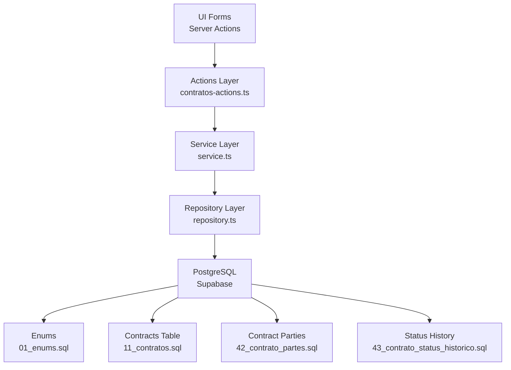
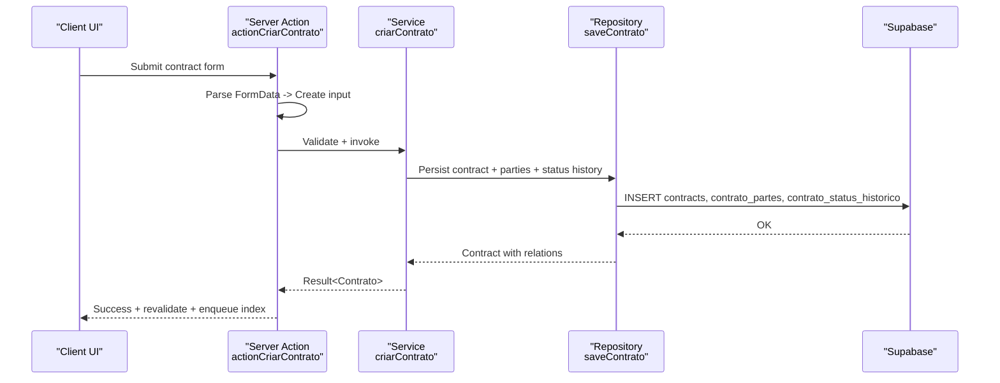
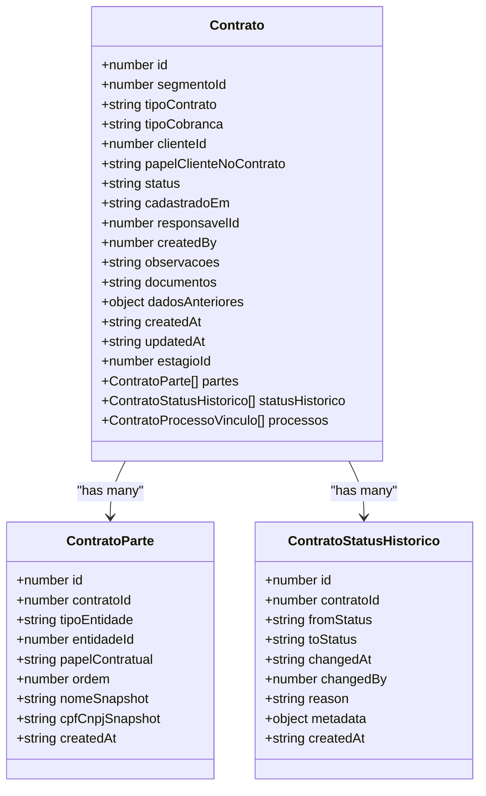
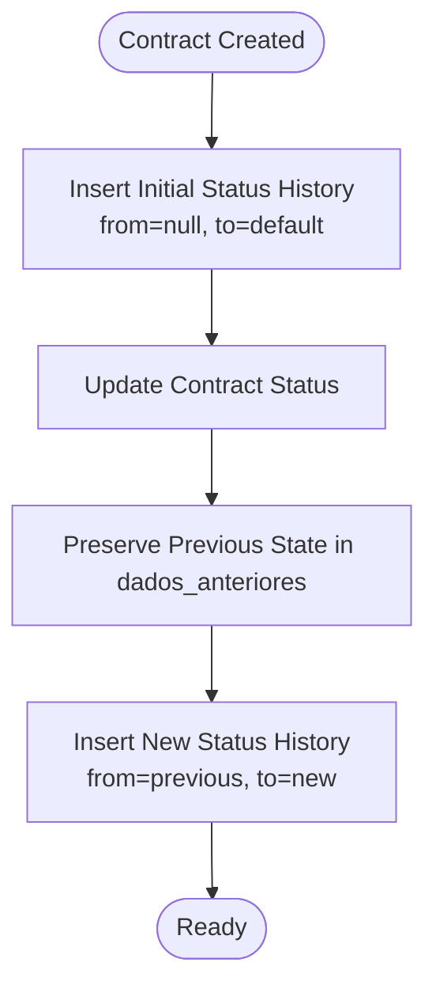
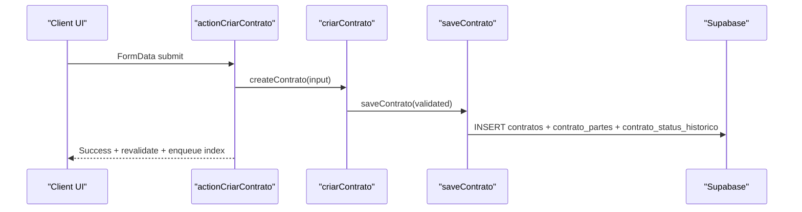
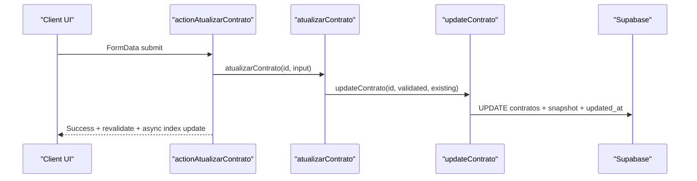
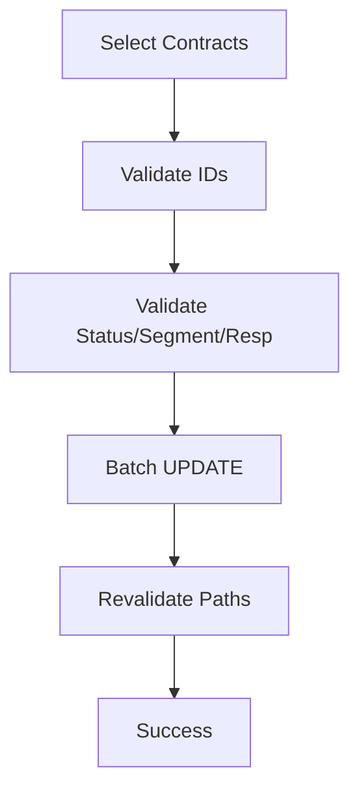
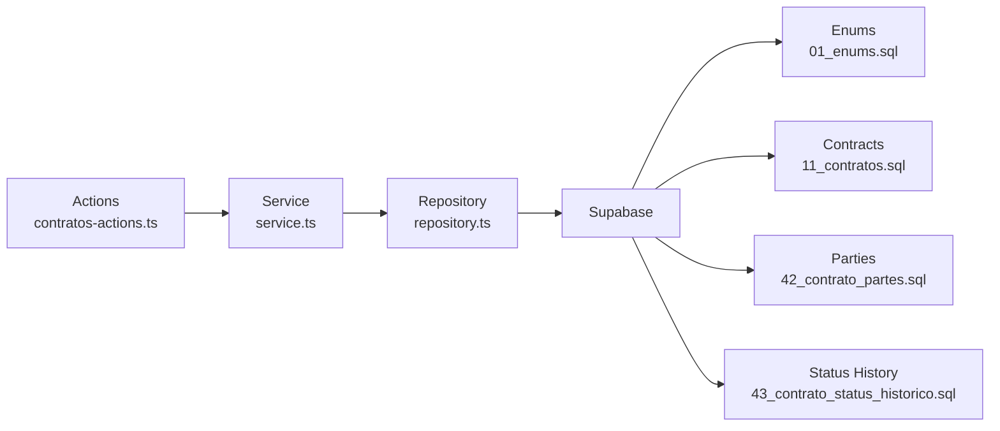

# Contract Lifecycle Management

<cite>
**Referenced Files in This Document**
- [domain.ts](file://src/shared/contratos/domain.ts)
- [service.ts](file://src/shared/contratos/service.ts)
- [repository.ts](file://src/shared/contratos/repository.ts)
- [errors.ts](file://src/shared/contratos/errors.ts)
- [contratos-actions.ts](file://src/app/(authenticated)/contratos/actions/contratos-actions.ts)
- [11_contratos.sql](file://supabase/schemas/11_contratos.sql)
- [42_contrato_partes.sql](file://supabase/schemas/42_contrato_partes.sql)
- [43_contrato_status_historico.sql](file://supabase/schemas/43_contrato_status_historico.sql)
- [01_enums.sql](file://supabase/schemas/01_enums.sql)
</cite>

## Table of Contents
1. [Introduction](#introduction)
2. [Project Structure](#project-structure)
3. [Core Components](#core-components)
4. [Architecture Overview](#architecture-overview)
5. [Detailed Component Analysis](#detailed-component-analysis)
6. [Dependency Analysis](#dependency-analysis)
7. [Performance Considerations](#performance-considerations)
8. [Troubleshooting Guide](#troubleshooting-guide)
9. [Conclusion](#conclusion)

## Introduction
This document describes the Contract Lifecycle Management system, covering the complete lifecycle from creation to termination. It explains status tracking, renewal processes, archival procedures, validation rules, version control mechanisms, audit trails, integration with legal and financial processes, and document management. It also documents automated workflows, modification procedures, amendment tracking, compliance monitoring, termination and renewal notices, and historical data management.

## Project Structure
The contract lifecycle feature is implemented across three layers:
- Domain layer: Strongly typed contracts, enums, and validation schemas
- Service layer: Business logic and use cases
- Repository layer: Database access and persistence
- Actions layer: UI adapters implementing server actions and semantic indexing
- Database schemas: Typed enums and relational tables for contracts, parties, and status history

**Diagram sources**
- [contratos-actions.ts](file://src/app/(authenticated)/contratos/actions/contratos-actions.ts#L1-L800)
- [service.ts:1-404](file://src/shared/contratos/service.ts#L1-L404)
- [repository.ts:1-800](file://src/shared/contratos/repository.ts#L1-L800)
- [01_enums.sql:85-116](file://supabase/schemas/01_enums.sql#L85-L116)
- [11_contratos.sql:1-61](file://supabase/schemas/11_contratos.sql#L1-L61)
- [42_contrato_partes.sql:1-21](file://supabase/schemas/42_contrato_partes.sql#L1-L21)
- [43_contrato_status_historico.sql:1-19](file://supabase/schemas/43_contrato_status_historico.sql#L1-L19)

**Section sources**
- [domain.ts:1-368](file://src/shared/contratos/domain.ts#L1-L368)
- [service.ts:1-404](file://src/shared/contratos/service.ts#L1-L404)
- [repository.ts:1-800](file://src/shared/contratos/repository.ts#L1-L800)
- [contratos-actions.ts](file://src/app/(authenticated)/contratos/actions/contratos-actions.ts#L1-L800)
- [01_enums.sql:85-116](file://supabase/schemas/01_enums.sql#L85-L116)
- [11_contratos.sql:1-61](file://supabase/schemas/11_contratos.sql#L1-L61)
- [42_contrato_partes.sql:1-21](file://supabase/schemas/42_contrato_partes.sql#L1-L21)
- [43_contrato_status_historico.sql:1-19](file://supabase/schemas/43_contrato_status_historico.sql#L1-L19)

## Core Components
- Domain: Defines contract types, enums, validation schemas, and list/query parameters
- Service: Implements business rules for create, update, list, and stats operations
- Repository: Handles database reads/writes, joins, and counters
- Actions: Converts UI forms to typed inputs, validates with schemas, invokes services, and triggers semantic indexing
- Database: Typed enums and relational tables for contracts, parties, and status history

Key capabilities:
- Contract creation with validation and party modeling
- Partial updates with audit-aware snapshots
- Status transitions tracked in dedicated history table
- Bulk operations for mass status/segment/responsible changes
- Semantic indexing for search and discovery

**Section sources**
- [domain.ts:105-143](file://src/shared/contratos/domain.ts#L105-L143)
- [service.ts:80-136](file://src/shared/contratos/service.ts#L80-L136)
- [repository.ts:642-741](file://src/shared/contratos/repository.ts#L642-L741)
- [contratos-actions.ts](file://src/app/(authenticated)/contratos/actions/contratos-actions.ts#L440-L492)
- [11_contratos.sql:4-27](file://supabase/schemas/11_contratos.sql#L4-L27)
- [43_contrato_status_historico.sql:3-13](file://supabase/schemas/43_contrato_status_historico.sql#L3-L13)

## Architecture Overview
The system follows layered architecture with explicit separation of concerns:
- UI triggers server actions
- Actions convert FormData to typed inputs and delegate to service layer
- Service validates and orchestrates repository operations
- Repository persists to Supabase with typed enums and foreign keys
- Audit and semantic indexing are integrated at the edges

**Diagram sources**
- [contratos-actions.ts](file://src/app/(authenticated)/contratos/actions/contratos-actions.ts#L440-L492)
- [service.ts:80-136](file://src/shared/contratos/service.ts#L80-L136)
- [repository.ts:642-741](file://src/shared/contratos/repository.ts#L642-L741)
- [11_contratos.sql:4-27](file://supabase/schemas/11_contratos.sql#L4-L27)
- [42_contrato_partes.sql:3-14](file://supabase/schemas/42_contrato_partes.sql#L3-L14)
- [43_contrato_status_historico.sql:3-13](file://supabase/schemas/43_contrato_status_historico.sql#L3-L13)

## Detailed Component Analysis

### Contract Entity and Validation
- Contract entity includes core fields: type, billing mode, client, client role, status, timestamps, responsible, creator, observations, previous state snapshot, and relations
- Validation schemas enforce required fields, enums, and constraints
- Party modeling supports client, opposing party, and transitional opposing party with roles and ordering

**Diagram sources**
- [domain.ts:66-143](file://src/shared/contratos/domain.ts#L66-L143)
- [42_contrato_partes.sql:3-14](file://supabase/schemas/42_contrato_partes.sql#L3-L14)
- [43_contrato_status_historico.sql:3-13](file://supabase/schemas/43_contrato_status_historico.sql#L3-L13)

**Section sources**
- [domain.ts:105-143](file://src/shared/contratos/domain.ts#L105-L143)
- [domain.ts:185-239](file://src/shared/contratos/domain.ts#L185-L239)
- [42_contrato_partes.sql:3-14](file://supabase/schemas/42_contrato_partes.sql#L3-L14)
- [43_contrato_status_historico.sql:3-13](file://supabase/schemas/43_contrato_status_historico.sql#L3-L13)

### Status Tracking and History
- Status transitions are captured in a dedicated table with from/to status, timestamp, actor, reason, and metadata
- Creation inserts an initial history record reflecting the default status
- Updates preserve previous state in the snapshot field for auditability

**Diagram sources**
- [repository.ts:704-721](file://src/shared/contratos/repository.ts#L704-L721)
- [repository.ts:787-798](file://src/shared/contratos/repository.ts#L787-L798)
- [43_contrato_status_historico.sql:3-13](file://supabase/schemas/43_contrato_status_historico.sql#L3-L13)

**Section sources**
- [repository.ts:704-721](file://src/shared/contratos/repository.ts#L704-L721)
- [repository.ts:787-798](file://src/shared/contratos/repository.ts#L787-L798)
- [43_contrato_status_historico.sql:1-19](file://supabase/schemas/43_contrato_status_historico.sql#L1-L19)

### Lifecycle Workflows

#### Creation Workflow
- Validate input against schemas
- Verify referenced entities (client, opposing parties)
- Persist contract, parties, and initial status history
- Enqueue semantic indexing for search

**Diagram sources**
- [contratos-actions.ts](file://src/app/(authenticated)/contratos/actions/contratos-actions.ts#L440-L492)
- [service.ts:80-136](file://src/shared/contratos/service.ts#L80-L136)
- [repository.ts:642-741](file://src/shared/contratos/repository.ts#L642-L741)

**Section sources**
- [service.ts:80-136](file://src/shared/contratos/service.ts#L80-L136)
- [repository.ts:642-741](file://src/shared/contratos/repository.ts#L642-L741)
- [contratos-actions.ts](file://src/app/(authenticated)/contratos/actions/contratos-actions.ts#L440-L492)

#### Update Workflow
- Validate partial update
- Optionally verify referenced entities if changed
- Update contract and preserve previous state snapshot
- Update semantic index asynchronously

**Diagram sources**
- [contratos-actions.ts](file://src/app/(authenticated)/contratos/actions/contratos-actions.ts#L508-L574)
- [service.ts:240-324](file://src/shared/contratos/service.ts#L240-L324)
- [repository.ts:746-800](file://src/shared/contratos/repository.ts#L746-L800)

**Section sources**
- [service.ts:240-324](file://src/shared/contratos/service.ts#L240-L324)
- [repository.ts:746-800](file://src/shared/contratos/repository.ts#L746-L800)
- [contratos-actions.ts](file://src/app/(authenticated)/contratos/actions/contratos-actions.ts#L508-L574)

#### Bulk Operations
- Mass status change, responsible assignment, segment change, and hard delete
- Validated IDs and status values, then batched updates with revalidation

**Diagram sources**
- [contratos-actions.ts](file://src/app/(authenticated)/contratos/actions/contratos-actions.ts#L636-L798)

**Section sources**
- [contratos-actions.ts](file://src/app/(authenticated)/contratos/actions/contratos-actions.ts#L636-L798)

### Validation Rules and Version Control
- Zod schemas define required fields, enum constraints, and max lengths
- Partial updates require at least one field to change
- Audit snapshot preserves previous state for compliance and rollback scenarios
- Unique constraints on party triples prevent duplicates

**Section sources**
- [domain.ts:192-239](file://src/shared/contratos/domain.ts#L192-L239)
- [service.ts:262-266](file://src/shared/contratos/service.ts#L262-L266)
- [repository.ts:787-798](file://src/shared/contratos/repository.ts#L787-L798)
- [42_contrato_partes.sql](file://supabase/schemas/42_contrato_partes.sql#L13)

### Audit Trail and Compliance Monitoring
- Status history captures who changed status, when, and why
- Snapshot of previous state enables audit comparisons
- RLS enabled on all contract-related tables for row-level security
- Logs and triggers support broader audit infrastructure

**Section sources**
- [43_contrato_status_historico.sql:1-19](file://supabase/schemas/43_contrato_status_historico.sql#L1-L19)
- [repository.ts:787-798](file://src/shared/contratos/repository.ts#L787-L798)
- [11_contratos.sql:58-61](file://supabase/schemas/11_contratos.sql#L58-L61)

### Integration with Legal and Financial Processes
- Contract type and billing mode drive downstream workflows
- Parties table links to clients and opposing parties
- Process linkage allows contracts to connect to legal processes
- Finance module revalidated on contract changes

**Section sources**
- [domain.ts:121-143](file://src/shared/contratos/domain.ts#L121-L143)
- [42_contrato_partes.sql:3-14](file://supabase/schemas/42_contrato_partes.sql#L3-L14)
- [contratos-actions.ts](file://src/app/(authenticated)/contratos/actions/contratos-actions.ts#L472-L473)

### Document Management and Semantic Search
- Contract documents can be associated via the entity
- Semantic indexing enqueued after create/update for discoverability
- Metadata tagged for category and entity identification

**Section sources**
- [domain.ts:133-134](file://src/shared/contratos/domain.ts#L133-L134)
- [contratos-actions.ts](file://src/app/(authenticated)/contratos/actions/contratos-actions.ts#L368-L422)

### Renewal and Termination Procedures
- Status values include termination state
- Status history records provide evidence of termination decisions
- Bulk operations enable mass termination or status changes

**Section sources**
- [01_enums.sql:105-110](file://supabase/schemas/01_enums.sql#L105-L110)
- [43_contrato_status_historico.sql:6-10](file://supabase/schemas/43_contrato_status_historico.sql#L6-L10)
- [contratos-actions.ts](file://src/app/(authenticated)/contratos/actions/contratos-actions.ts#L636-L674)

### Historical Data Management
- Status history table stores all transitions with timestamps and actors
- Snapshot preservation ensures historical state reconstruction
- Counters and filters support reporting and analytics

**Section sources**
- [repository.ts:471-538](file://src/shared/contratos/repository.ts#L471-L538)
- [43_contrato_status_historico.sql:15-16](file://supabase/schemas/43_contrato_status_historico.sql#L15-L16)

## Dependency Analysis
The system exhibits clear layering with low coupling between UI and persistence:
- Actions depend on Service and Repository
- Service depends on Repository and domain schemas
- Repository depends on Supabase client and typed enums
- Database schemas define contracts, parties, and status history with foreign keys and indexes

**Diagram sources**
- [contratos-actions.ts](file://src/app/(authenticated)/contratos/actions/contratos-actions.ts#L1-L800)
- [service.ts:1-404](file://src/shared/contratos/service.ts#L1-L404)
- [repository.ts:1-800](file://src/shared/contratos/repository.ts#L1-L800)
- [01_enums.sql:85-116](file://supabase/schemas/01_enums.sql#L85-L116)
- [11_contratos.sql:1-61](file://supabase/schemas/11_contratos.sql#L1-L61)
- [42_contrato_partes.sql:1-21](file://supabase/schemas/42_contrato_partes.sql#L1-L21)
- [43_contrato_status_historico.sql:1-19](file://supabase/schemas/43_contrato_status_historico.sql#L1-L19)

**Section sources**
- [service.ts:1-404](file://src/shared/contratos/service.ts#L1-L404)
- [repository.ts:1-800](file://src/shared/contratos/repository.ts#L1-L800)
- [contratos-actions.ts](file://src/app/(authenticated)/contratos/actions/contratos-actions.ts#L1-L800)

## Performance Considerations
- Database indexes on frequently filtered/sorted columns (status, client, responsible, created_at)
- Efficient pagination with count and range queries
- Asynchronous semantic indexing avoids blocking UI responses
- Batch operations reduce round trips for bulk updates

[No sources needed since this section provides general guidance]

## Troubleshooting Guide
Common issues and resolutions:
- Validation errors: Check schema constraints and error mapping in actions
- Not found errors: Verify entity existence before linking
- Bulk operation failures: Confirm IDs are positive integers and status values are valid
- Indexing failures: Ensure AI indexing environment flag and service client configuration

**Section sources**
- [errors.ts:25-68](file://src/shared/contratos/errors.ts#L25-L68)
- [contratos-actions.ts](file://src/app/(authenticated)/contratos/actions/contratos-actions.ts#L626-L674)
- [contratos-actions.ts](file://src/app/(authenticated)/contratos/actions/contratos-actions.ts#L368-L422)

## Conclusion
The Contract Lifecycle Management system provides a robust, typed, and auditable foundation for managing contracts from creation to termination. It integrates validation, status tracking, party modeling, semantic search, and bulk operations while maintaining compliance through snapshots and history. The layered architecture ensures maintainability and scalability, supporting legal and financial workflows with strong data integrity guarantees.