# Contract Management System

<cite>
**Referenced Files in This Document**
- [README.md](file://README.md)
- [supabase/schemas/11_contratos.sql](file://supabase/schemas/11_contratos.sql)
- [supabase/schemas/42_contrato_partes.sql](file://supabase/schemas/42_contrato_partes.sql)
- [supabase/schemas/43_contrato_status_historico.sql](file://supabase/schemas/43_contrato_status_historico.sql)
- [supabase/schemas/44_contrato_tags.sql](file://supabase/schemas/44_contrato_tags.sql)
- [supabase/migrations/20260225000001_create_contrato_tipos.sql](file://supabase/migrations/20260225000001_create_contrato_tipos.sql)
- [supabase/migrations/20260225000002_create_contrato_pipelines.sql](file://supabase/migrations/20260225000002_create_contrato_pipelines.sql)
- [supabase/migrations/20260225000003_add_contratos_new_fk_columns.sql](file://supabase/migrations/20260225000003_add_contratos_new_fk_columns.sql)
- [supabase/migrations/20260225000004_add_formularios_tipo_contrato_config.sql](file://supabase/migrations/20260225000004_add_formularios_tipo_contrato_config.sql)
- [src/app/api/contratos/tipos/route.ts](file://src/app/api/contratos/tipos/route.ts)
- [src/app/(authenticated)/contratos/hooks/use-kanban-contratos.ts](file://src/app/(authenticated)/contratos/hooks/use-kanban-contratos.ts)
- [src/app/(authenticated)/contratos/kanban/page.tsx](file://src/app/(authenticated)/contratos/kanban/page.tsx)
- [openspec/changes/archive/2026-02-25-flexibilizar-contratos-pipeline-kanban/specs/contratos/spec.md](file://openspec/changes/archive/2026-02-25-flexibilizar-contratos-pipeline-kanban/specs/contratos/spec.md)
- [openspec/changes/archive/2026-02-25-flexibilizar-contratos-pipeline-kanban/specs/contrato-kanban/spec.md](file://openspec/changes/archive/2026-02-25-flexibilizar-contratos-pipeline-kanban/specs/contrato-kanban/spec.md)
- [openspec/specs/contrato-kanban/spec.md](file://openspec/specs/contrato-kanban/spec.md)
- [docs/superpowers/specs/2026-04-16-gerar-pdfs-contrato-trabalhista-design.md](file://docs/superpowers/specs/2026-04-16-gerar-pdfs-contrato-trabalhista-design.md)
- [docs/superpowers/plans/2026-04-16-gerar-pdfs-contrato-trabalhista.md](file://docs/superpowers/plans/2026-02-25-flexibilizar-contratos-pipeline-kanban/specs/contratos/spec.md)
- [src/lib/mcp/registries/expedientes-tools.ts](file://src/lib/mcp/registries/expedientes-tools.ts)
- [openspec/archive/refactor-contratos-modelo-relacional/specs/acervo/spec.md](file://openspec/archive/refactor-contratos-modelo-relacional/specs/acervo/spec.md)
</cite>

## Table of Contents
1. [Introduction](#introduction)
2. [Project Structure](#project-structure)
3. [Core Components](#core-components)
4. [Architecture Overview](#architecture-overview)
5. [Detailed Component Analysis](#detailed-component-analysis)
6. [Dependency Analysis](#dependency-analysis)
7. [Performance Considerations](#performance-considerations)
8. [Troubleshooting Guide](#troubleshooting-guide)
9. [Conclusion](#conclusion)
10. [Appendices](#appendices)

## Introduction
This document describes the Contract Management System implemented in the project. It covers contract types, creation workflows, lifecycle management, the contract pipeline system, kanban boards, tagging and labeling, template management, approval workflows, execution tracking, renewal management, integration with legal processes and document management, practical examples, status tracking, compliance monitoring, validation rules, version control, and audit trails.

## Project Structure
The system is built with a Next.js application, Supabase-backed PostgreSQL schema, and a set of OpenSpec-driven requirements and migration scripts that define the contract domain model and configurable workflows.

Key areas:
- Database schema and migrations define contract entities, parts, statuses, tags, and pipeline stages.
- API routes expose contract type management for admin operations.
- Frontend hooks and pages implement kanban views and contract creation flows.
- OpenSpec documents specify requirements for pipelines, kanban, and contract creation.
- Documentation outlines PDF generation from templates and integration with legal processes.

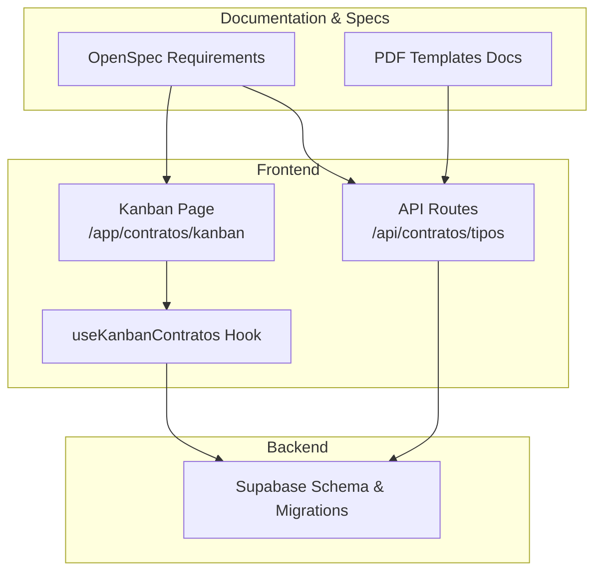

**Diagram sources**
- [src/app/api/contratos/tipos/route.ts:1-88](file://src/app/api/contratos/tipos/route.ts#L1-L88)
- [src/app/(authenticated)/contratos/kanban/page.tsx](file://src/app/(authenticated)/contratos/kanban/page.tsx#L1-L19)
- [src/app/(authenticated)/contratos/hooks/use-kanban-contratos.ts](file://src/app/(authenticated)/contratos/hooks/use-kanban-contratos.ts#L37-L115)
- [supabase/schemas/11_contratos.sql:1-61](file://supabase/schemas/11_contratos.sql#L1-L61)
- [supabase/migrations/20260225000001_create_contrato_tipos.sql:1-74](file://supabase/migrations/20260225000001_create_contrato_tipos.sql#L1-L74)
- [supabase/migrations/20260225000002_create_contrato_pipelines.sql:1-74](file://supabase/migrations/20260225000002_create_contrato_pipelines.sql#L1-L74)
- [openspec/changes/archive/2026-02-25-flexibilizar-contratos-pipeline-kanban/specs/contratos/spec.md:74-101](file://openspec/changes/archive/2026-02-25-flexibilizar-contratos-pipeline-kanban/specs/contratos/spec.md#L74-L101)
- [openspec/changes/archive/2026-02-25-flexibilizar-contratos-pipeline-kanban/specs/contrato-kanban/spec.md:1-35](file://openspec/changes/archive/2026-02-25-flexibilizar-contratos-pipeline-kanban/specs/contrato-kanban/spec.md#L1-L35)
- [docs/superpowers/specs/2026-04-16-gerar-pdfs-contrato-trabalhista-design.md:20-28](file://docs/superpowers/specs/2026-04-16-gerar-pdfs-contrato-trabalhista-design.md#L20-L28)

**Section sources**
- [README.md](file://README.md)
- [src/app/api/contratos/tipos/route.ts:1-88](file://src/app/api/contratos/tipos/route.ts#L1-L88)
- [src/app/(authenticated)/contratos/kanban/page.tsx](file://src/app/(authenticated)/contratos/kanban/page.tsx#L1-L19)
- [src/app/(authenticated)/contratos/hooks/use-kanban-contratos.ts](file://src/app/(authenticated)/contratos/hooks/use-kanban-contratos.ts#L37-L115)
- [supabase/schemas/11_contratos.sql:1-61](file://supabase/schemas/11_contratos.sql#L1-L61)
- [supabase/migrations/20260225000001_create_contrato_tipos.sql:1-74](file://supabase/migrations/20260225000001_create_contrato_tipos.sql#L1-L74)
- [supabase/migrations/20260225000002_create_contrato_pipelines.sql:1-74](file://supabase/migrations/20260225000002_create_contrato_pipelines.sql#L1-L74)
- [openspec/changes/archive/2026-02-25-flexibilizar-contratos-pipeline-kanban/specs/contratos/spec.md:74-101](file://openspec/changes/archive/2026-02-25-flexibilizar-contratos-pipeline-kanban/specs/contratos/spec.md#L74-L101)
- [openspec/changes/archive/2026-02-25-flexibilizar-contratos-pipeline-kanban/specs/contrato-kanban/spec.md:1-35](file://openspec/changes/archive/2026-02-25-flexibilizar-contratos-pipeline-kanban/specs/contrato-kanban/spec.md#L1-L35)
- [openspec/specs/contrato-kanban/spec.md:1-35](file://openspec/specs/contrato-kanban/spec.md#L1-L35)
- [docs/superpowers/specs/2026-04-16-gerar-pdfs-contrato-trabalhista-design.md:20-28](file://docs/superpowers/specs/2026-04-16-gerar-pdfs-contrato-trabalhista-design.md#L20-L28)

## Core Components
- Contract entity with configurable type, billing type, stage, parties, and timestamps.
- Configurable contract types and billing types tables.
- Pipeline and stage definitions per segment.
- Contract parts linking clients, opposing parties, and roles.
- Status change history for compliance and audit.
- Contract-tag relations enabling cross-entity propagation.
- API route for contract type lookup and creation.
- Kanban board rendering and drag-and-drop movement of contracts across stages.
- PDF template generation integrated with contract data.

**Section sources**
- [supabase/schemas/11_contratos.sql:1-61](file://supabase/schemas/11_contratos.sql#L1-L61)
- [supabase/schemas/42_contrato_partes.sql:1-21](file://supabase/schemas/42_contrato_partes.sql#L1-L21)
- [supabase/schemas/43_contrato_status_historico.sql:1-19](file://supabase/schemas/43_contrato_status_historico.sql#L1-L19)
- [supabase/schemas/44_contrato_tags.sql:1-15](file://supabase/schemas/44_contrato_tags.sql#L1-L15)
- [supabase/migrations/20260225000001_create_contrato_tipos.sql:1-74](file://supabase/migrations/20260225000001_create_contrato_tipos.sql#L1-L74)
- [supabase/migrations/20260225000002_create_contrato_pipelines.sql:1-74](file://supabase/migrations/20260225000002_create_contrato_pipelines.sql#L1-L74)
- [supabase/migrations/20260225000003_add_contratos_new_fk_columns.sql:1-16](file://supabase/migrations/20260225000003_add_contratos_new_fk_columns.sql#L1-L16)
- [supabase/migrations/20260225000004_add_formularios_tipo_contrato_config.sql:1-12](file://supabase/migrations/20260225000004_add_formularios_tipo_contrato_config.sql#L1-L12)
- [src/app/api/contratos/tipos/route.ts:1-88](file://src/app/api/contratos/tipos/route.ts#L1-L88)
- [src/app/(authenticated)/contratos/hooks/use-kanban-contratos.ts](file://src/app/(authenticated)/contratos/hooks/use-kanban-contratos.ts#L37-L115)
- [src/app/(authenticated)/contratos/kanban/page.tsx](file://src/app/(authenticated)/contratos/kanban/page.tsx#L1-L19)
- [docs/superpowers/specs/2026-04-16-gerar-pdfs-contrato-trabalhista-design.md:20-28](file://docs/superpowers/specs/2026-04-16-gerar-pdfs-contrato-trabalhista-design.md#L20-L28)

## Architecture Overview
The system separates concerns across schema, API, hooks, and pages. Contracts are represented by configurable entities and managed through pipelines. Parties and tags connect contracts to broader legal and administrative contexts. PDF templates are generated from contract data and stored artifacts.

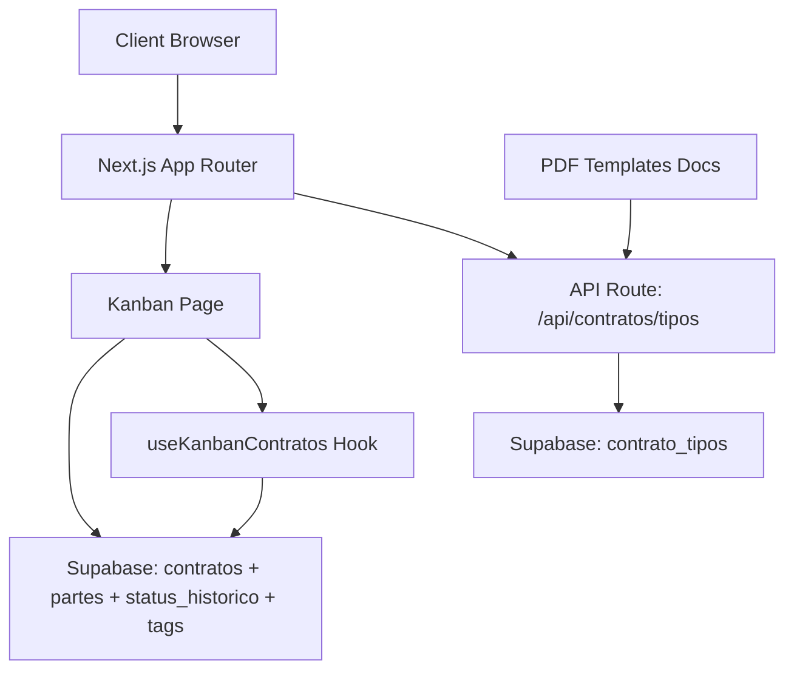

**Diagram sources**
- [src/app/api/contratos/tipos/route.ts:1-88](file://src/app/api/contratos/tipos/route.ts#L1-L88)
- [src/app/(authenticated)/contratos/kanban/page.tsx](file://src/app/(authenticated)/contratos/kanban/page.tsx#L1-L19)
- [src/app/(authenticated)/contratos/hooks/use-kanban-contratos.ts](file://src/app/(authenticated)/contratos/hooks/use-kanban-contratos.ts#L37-L115)
- [supabase/schemas/11_contratos.sql:1-61](file://supabase/schemas/11_contratos.sql#L1-L61)
- [supabase/schemas/42_contrato_partes.sql:1-21](file://supabase/schemas/42_contrato_partes.sql#L1-L21)
- [supabase/schemas/43_contrato_status_historico.sql:1-19](file://supabase/schemas/43_contrato_status_historico.sql#L1-L19)
- [supabase/schemas/44_contrato_tags.sql:1-15](file://supabase/schemas/44_contrato_tags.sql#L1-L15)
- [docs/superpowers/specs/2026-04-16-gerar-pdfs-contrato-trabalhista-design.md:20-28](file://docs/superpowers/specs/2026-04-16-gerar-pdfs-contrato-trabalhista-design.md#L20-L28)

## Detailed Component Analysis

### Contract Entity and Lifecycle
Contracts are stored with foreign keys to configurable types and stages, enabling flexible status management. Parties capture client and opposing party roles, while status history supports auditability. Tags enable cross-entity propagation to linked processes.

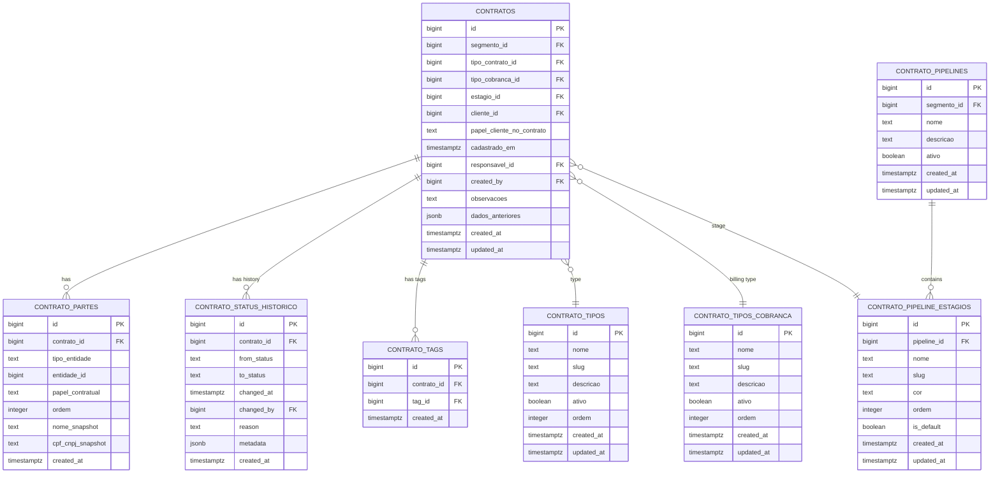

**Diagram sources**
- [supabase/schemas/11_contratos.sql:1-61](file://supabase/schemas/11_contratos.sql#L1-L61)
- [supabase/schemas/42_contrato_partes.sql:1-21](file://supabase/schemas/42_contrato_partes.sql#L1-L21)
- [supabase/schemas/43_contrato_status_historico.sql:1-19](file://supabase/schemas/43_contrato_status_historico.sql#L1-L19)
- [supabase/schemas/44_contrato_tags.sql:1-15](file://supabase/schemas/44_contrato_tags.sql#L1-L15)
- [supabase/migrations/20260225000001_create_contrato_tipos.sql:1-74](file://supabase/migrations/20260225000001_create_contrato_tipos.sql#L1-L74)
- [supabase/migrations/20260225000002_create_contrato_pipelines.sql:1-74](file://supabase/migrations/20260225000002_create_contrato_pipelines.sql#L1-L74)
- [supabase/migrations/20260225000003_add_contratos_new_fk_columns.sql:1-16](file://supabase/migrations/20260225000003_add_contratos_new_fk_columns.sql#L1-L16)

**Section sources**
- [supabase/schemas/11_contratos.sql:1-61](file://supabase/schemas/11_contratos.sql#L1-L61)
- [supabase/schemas/42_contrato_partes.sql:1-21](file://supabase/schemas/42_contrato_partes.sql#L1-L21)
- [supabase/schemas/43_contrato_status_historico.sql:1-19](file://supabase/schemas/43_contrato_status_historico.sql#L1-L19)
- [supabase/schemas/44_contrato_tags.sql:1-15](file://supabase/schemas/44_contrato_tags.sql#L1-L15)
- [supabase/migrations/20260225000001_create_contrato_tipos.sql:1-74](file://supabase/migrations/20260225000001_create_contrato_tipos.sql#L1-L74)
- [supabase/migrations/20260225000002_create_contrato_pipelines.sql:1-74](file://supabase/migrations/20260225000002_create_contrato_pipelines.sql#L1-L74)
- [supabase/migrations/20260225000003_add_contratos_new_fk_columns.sql:1-16](file://supabase/migrations/20260225000003_add_contratos_new_fk_columns.sql#L1-L16)

### Contract Types and Billing Types
Contract types and billing types are now configurable via dedicated tables. The API route exposes listing and creation for admin use.

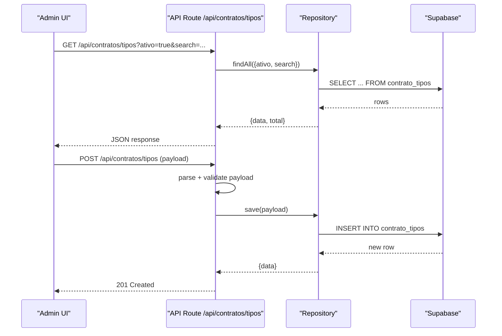

**Diagram sources**
- [src/app/api/contratos/tipos/route.ts:1-88](file://src/app/api/contratos/tipos/route.ts#L1-L88)
- [supabase/migrations/20260225000001_create_contrato_tipos.sql:1-74](file://supabase/migrations/20260225000001_create_contrato_tipos.sql#L1-L74)

**Section sources**
- [src/app/api/contratos/tipos/route.ts:1-88](file://src/app/api/contratos/tipos/route.ts#L1-L88)
- [supabase/migrations/20260225000001_create_contrato_tipos.sql:1-74](file://supabase/migrations/20260225000001_create_contrato_tipos.sql#L1-L74)

### Pipelines and Kanban Board
Pipelines define stages per segment with ordering and default stage selection. The kanban board renders columns for stages and allows moving contracts between stages.

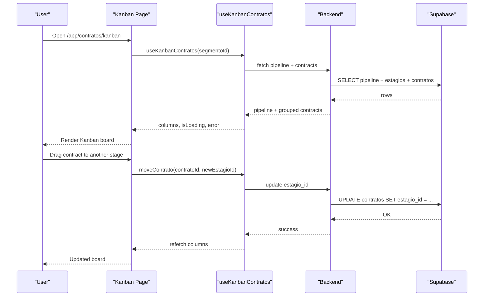

**Diagram sources**
- [src/app/(authenticated)/contratos/kanban/page.tsx](file://src/app/(authenticated)/contratos/kanban/page.tsx#L1-L19)
- [src/app/(authenticated)/contratos/hooks/use-kanban-contratos.ts](file://src/app/(authenticated)/contratos/hooks/use-kanban-contratos.ts#L37-L115)
- [supabase/migrations/20260225000002_create_contrato_pipelines.sql:1-74](file://supabase/migrations/20260225000002_create_contrato_pipelines.sql#L1-L74)
- [openspec/changes/archive/2026-02-25-flexibilizar-contratos-pipeline-kanban/specs/contrato-kanban/spec.md:1-35](file://openspec/changes/archive/2026-02-25-flexibilizar-contratos-pipeline-kanban/specs/contrato-kanban/spec.md#L1-L35)
- [openspec/specs/contrato-kanban/spec.md:1-35](file://openspec/specs/contrato-kanban/spec.md#L1-L35)

**Section sources**
- [src/app/(authenticated)/contratos/kanban/page.tsx](file://src/app/(authenticated)/contratos/kanban/page.tsx#L1-L19)
- [src/app/(authenticated)/contratos/hooks/use-kanban-contratos.ts](file://src/app/(authenticated)/contratos/hooks/use-kanban-contratos.ts#L37-L115)
- [supabase/migrations/20260225000002_create_contrato_pipelines.sql:1-74](file://supabase/migrations/20260225000002_create_contrato_pipelines.sql#L1-L74)
- [openspec/changes/archive/2026-02-25-flexibilizar-contratos-pipeline-kanban/specs/contrato-kanban/spec.md:1-35](file://openspec/changes/archive/2026-02-25-flexibilizar-contratos-pipeline-kanban/specs/contrato-kanban/spec.md#L1-L35)
- [openspec/specs/contrato-kanban/spec.md:1-35](file://openspec/specs/contrato-kanban/spec.md#L1-L35)

### Contract Creation Workflow
The creation workflow captures required fields and persists them with defaults derived from the configured pipeline. Validation ensures required fields are present before submission.

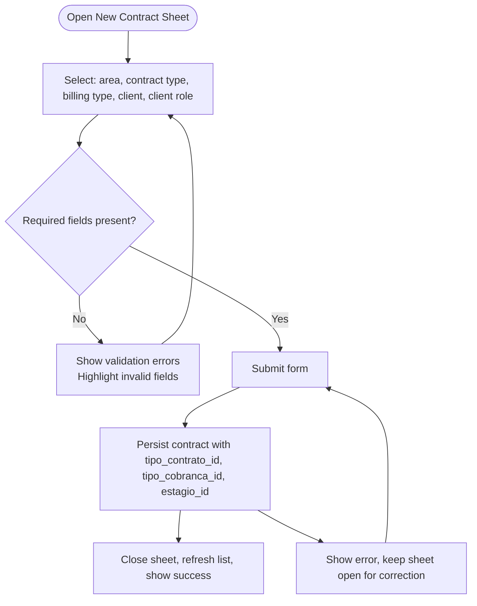

**Diagram sources**
- [openspec/changes/archive/2026-02-25-flexibilizar-contratos-pipeline-kanban/specs/contratos/spec.md:74-101](file://openspec/changes/archive/2026-02-25-flexibilizar-contratos-pipeline-kanban/specs/contratos/spec.md#L74-L101)
- [supabase/migrations/20260225000003_add_contratos_new_fk_columns.sql:1-16](file://supabase/migrations/20260225000003_add_contratos_new_fk_columns.sql#L1-L16)

**Section sources**
- [openspec/changes/archive/2026-02-25-flexibilizar-contratos-pipeline-kanban/specs/contratos/spec.md:74-101](file://openspec/changes/archive/2026-02-25-flexibilizar-contratos-pipeline-kanban/specs/contratos/spec.md#L74-L101)
- [supabase/migrations/20260225000003_add_contratos_new_fk_columns.sql:1-16](file://supabase/migrations/20260225000003_add_contratos_new_fk_columns.sql#L1-L16)

### Approval Workflows and Execution Tracking
Approval workflows are modeled by pipeline stages and status transitions. Execution tracking is supported by status history entries and timestamps.

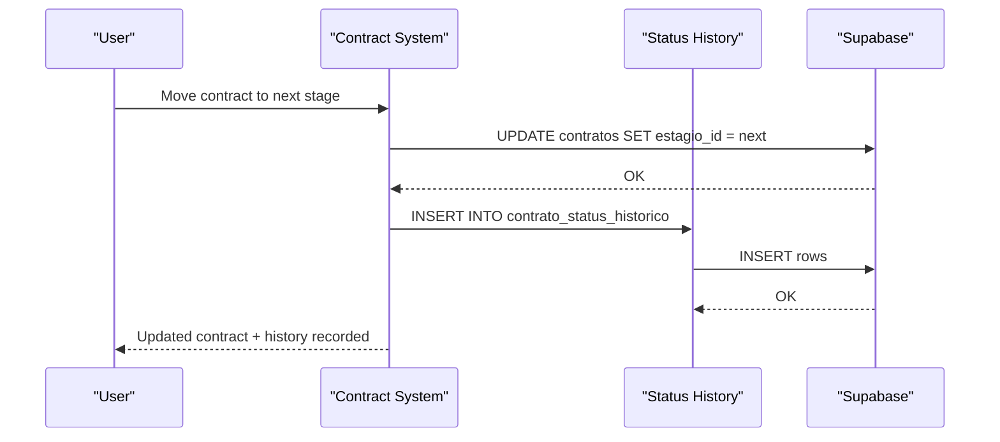

**Diagram sources**
- [supabase/schemas/43_contrato_status_historico.sql:1-19](file://supabase/schemas/43_contrato_status_historico.sql#L1-L19)
- [supabase/schemas/11_contratos.sql:1-61](file://supabase/schemas/11_contratos.sql#L1-L61)

**Section sources**
- [supabase/schemas/43_contrato_status_historico.sql:1-19](file://supabase/schemas/43_contrato_status_historico.sql#L1-L19)
- [supabase/schemas/11_contratos.sql:1-61](file://supabase/schemas/11_contratos.sql#L1-L61)

### Renewal Management
Renewal management is not explicitly defined in the current schema and migrations. It would typically involve:
- Linking renewed contracts to original contracts.
- Copying relevant terms and parties.
- Creating new pipeline stages for renewal workflows.
- Maintaining status history for renewals.

[No sources needed since this section provides general guidance]

### Template Management and PDF Generation
Templates are associated with forms and can be generated into PDFs using mapped contract data. The design document confirms template availability and mapping coverage.

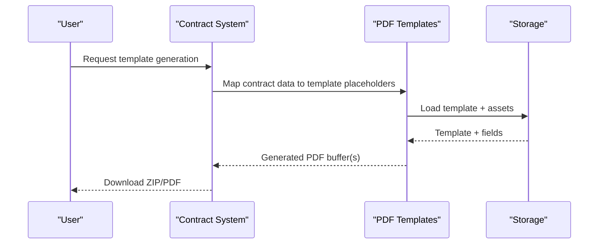

**Diagram sources**
- [docs/superpowers/specs/2026-04-16-gerar-pdfs-contrato-trabalhista-design.md:20-28](file://docs/superpowers/specs/2026-04-16-gerar-pdfs-contrato-trabalhista-design.md#L20-L28)
- [docs/superpowers/plans/2026-04-16-gerar-pdfs-contrato-trabalhista.md:893-969](file://docs/superpowers/plans/2026-04-16-gerar-pdfs-contrato-trabalhista.md#L893-L969)

**Section sources**
- [docs/superpowers/specs/2026-04-16-gerar-pdfs-contrato-trabalhista-design.md:20-28](file://docs/superpowers/specs/2026-04-16-gerar-pdfs-contrato-trabalhista-design.md#L20-L28)
- [docs/superpowers/plans/2026-04-16-gerar-pdfs-contrato-trabalhista.md:893-969](file://docs/superpowers/plans/2026-04-16-gerar-pdfs-contrato-trabalhista.md#L893-L969)

### Integration with Legal Processes and Expedientes
Contracts can be linked to legal processes (expedientes). Tools exist to manage expedientes, including finalization and reversal, which can be integrated with contract lifecycle events.

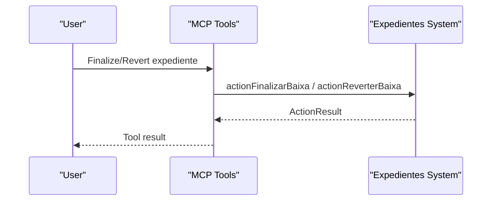

**Diagram sources**
- [src/lib/mcp/registries/expedientes-tools.ts:129-156](file://src/lib/mcp/registries/expedientes-tools.ts#L129-L156)

**Section sources**
- [src/lib/mcp/registries/expedientes-tools.ts:129-156](file://src/lib/mcp/registries/expedientes-tools.ts#L129-L156)

### Tagging and Labeling Mechanisms
Tags are associated with contracts and can propagate to linked processes. This enables cross-entity filtering and reporting.

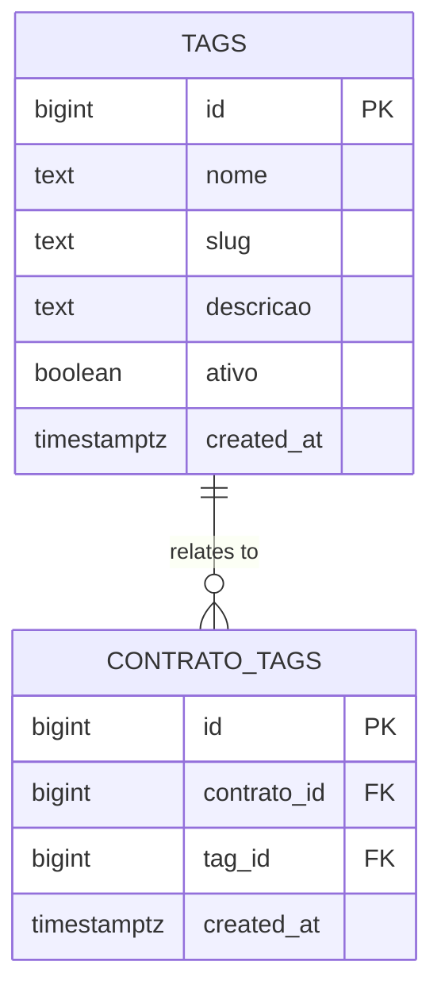

**Diagram sources**
- [supabase/schemas/44_contrato_tags.sql:1-15](file://supabase/schemas/44_contrato_tags.sql#L1-L15)

**Section sources**
- [supabase/schemas/44_contrato_tags.sql:1-15](file://supabase/schemas/44_contrato_tags.sql#L1-L15)
- [openspec/archive/refactor-contratos-modelo-relacional/specs/acervo/spec.md:1-21](file://openspec/archive/refactor-contratos-modelo-relacional/specs/acervo/spec.md#L1-L21)

### Practical Examples
- Creating a contract: Select area, type, billing type, client, and client role; submit to create with default stage from pipeline.
- Modifying a contract: Update parties, terms, and status; each change is audited in status history.
- Terminating a contract: Move to a terminal stage and record reasons in status history.

**Section sources**
- [openspec/changes/archive/2026-02-25-flexibilizar-contratos-pipeline-kanban/specs/contratos/spec.md:74-101](file://openspec/changes/archive/2026-02-25-flexibilizar-contratos-pipeline-kanban/specs/contratos/spec.md#L74-L101)
- [supabase/schemas/43_contrato_status_historico.sql:1-19](file://supabase/schemas/43_contrato_status_historico.sql#L1-L19)

### Compliance Monitoring and Audit Trails
- Status history records transitions with timestamps and actors.
- Data snapshot field preserves previous state for audits.
- Row-level security policies protect data access.

**Section sources**
- [supabase/schemas/43_contrato_status_historico.sql:1-19](file://supabase/schemas/43_contrato_status_historico.sql#L1-L19)
- [supabase/schemas/11_contratos.sql:1-61](file://supabase/schemas/11_contratos.sql#L1-L61)

## Dependency Analysis
The system exhibits low coupling between frontend and backend through explicit API boundaries. Supabase schema defines strong referential integrity among contracts, parts, tags, and pipelines.

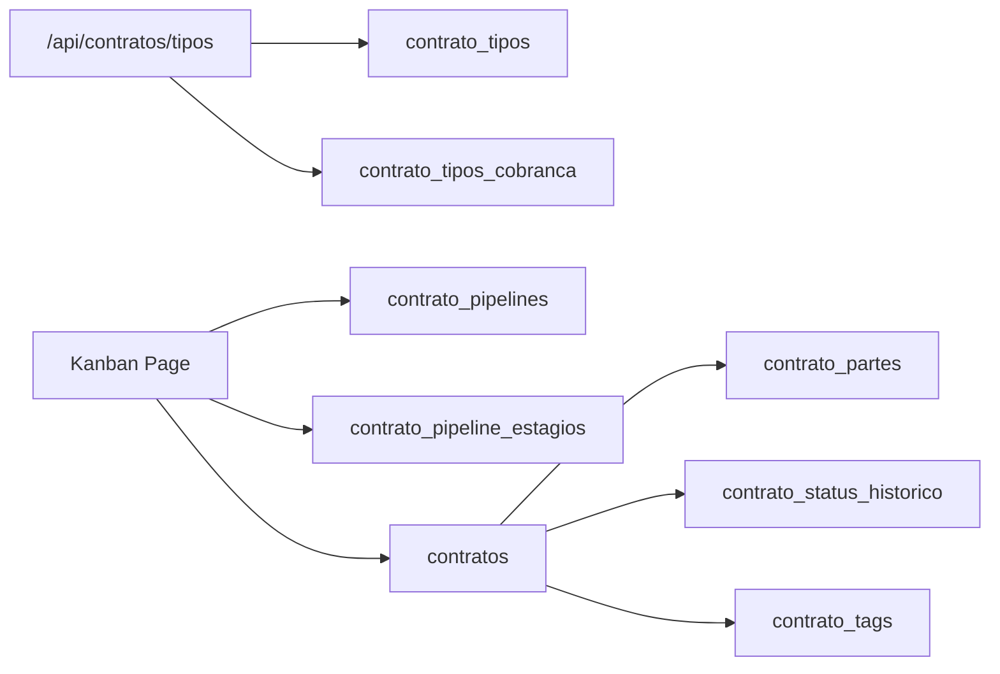

**Diagram sources**
- [src/app/api/contratos/tipos/route.ts:1-88](file://src/app/api/contratos/tipos/route.ts#L1-L88)
- [src/app/(authenticated)/contratos/kanban/page.tsx](file://src/app/(authenticated)/contratos/kanban/page.tsx#L1-L19)
- [supabase/migrations/20260225000001_create_contrato_tipos.sql:1-74](file://supabase/migrations/20260225000001_create_contrato_tipos.sql#L1-L74)
- [supabase/migrations/20260225000002_create_contrato_pipelines.sql:1-74](file://supabase/migrations/20260225000002_create_contrato_pipelines.sql#L1-L74)
- [supabase/schemas/11_contratos.sql:1-61](file://supabase/schemas/11_contratos.sql#L1-L61)
- [supabase/schemas/42_contrato_partes.sql:1-21](file://supabase/schemas/42_contrato_partes.sql#L1-L21)
- [supabase/schemas/43_contrato_status_historico.sql:1-19](file://supabase/schemas/43_contrato_status_historico.sql#L1-L19)
- [supabase/schemas/44_contrato_tags.sql:1-15](file://supabase/schemas/44_contrato_tags.sql#L1-L15)

**Section sources**
- [src/app/api/contratos/tipos/route.ts:1-88](file://src/app/api/contratos/tipos/route.ts#L1-L88)
- [src/app/(authenticated)/contratos/kanban/page.tsx](file://src/app/(authenticated)/contratos/kanban/page.tsx#L1-L19)
- [supabase/migrations/20260225000001_create_contrato_tipos.sql:1-74](file://supabase/migrations/20260225000001_create_contrato_tipos.sql#L1-L74)
- [supabase/migrations/20260225000002_create_contrato_pipelines.sql:1-74](file://supabase/migrations/20260225000002_create_contrato_pipelines.sql#L1-L74)
- [supabase/schemas/11_contratos.sql:1-61](file://supabase/schemas/11_contratos.sql#L1-L61)
- [supabase/schemas/42_contrato_partes.sql:1-21](file://supabase/schemas/42_contrato_partes.sql#L1-L21)
- [supabase/schemas/43_contrato_status_historico.sql:1-19](file://supabase/schemas/43_contrato_status_historico.sql#L1-L19)
- [supabase/schemas/44_contrato_tags.sql:1-15](file://supabase/schemas/44_contrato_tags.sql#L1-L15)

## Performance Considerations
- Indexes on foreign keys and frequently filtered columns improve query performance.
- Denormalized snapshots and JSONB fields support auditability but should be used judiciously.
- Kanban queries should leverage pipeline and stage ordering to minimize sorting overhead.

[No sources needed since this section provides general guidance]

## Troubleshooting Guide
- API permission errors: Ensure proper permissions for contract type creation and listing.
- Validation failures: Confirm required fields are present before submission.
- Kanban rendering issues: Verify pipeline existence for the selected segment and stage ordering.
- PDF generation errors: Check template mapping completeness and storage availability.

**Section sources**
- [src/app/api/contratos/tipos/route.ts:55-88](file://src/app/api/contratos/tipos/route.ts#L55-L88)
- [openspec/changes/archive/2026-02-25-flexibilizar-contratos-pipeline-kanban/specs/contratos/spec.md:86-96](file://openspec/changes/archive/2026-02-25-flexibilizar-contratos-pipeline-kanban/specs/contratos/spec.md#L86-L96)
- [src/app/(authenticated)/contratos/hooks/use-kanban-contratos.ts](file://src/app/(authenticated)/contratos/hooks/use-kanban-contratos.ts#L109-L115)
- [docs/superpowers/specs/2026-04-16-gerar-pdfs-contrato-trabalhista-design.md:20-28](file://docs/superpowers/specs/2026-04-16-gerar-pdfs-contrato-trabalhista-design.md#L20-L28)

## Conclusion
The Contract Management System leverages configurable contract types, billing types, and pipeline stages to support flexible workflows. The kanban board provides visual tracking, while tagging and status history enable compliance and auditability. Integration with legal processes and document management rounds out the solution for a complete legal operations platform.

[No sources needed since this section summarizes without analyzing specific files]

## Appendices
- OpenSpec requirements for contract creation and kanban board.
- Migration scripts defining the contract domain model and pipeline configuration.
- PDF template generation documentation and plans.

**Section sources**
- [openspec/changes/archive/2026-02-25-flexibilizar-contratos-pipeline-kanban/specs/contratos/spec.md:74-101](file://openspec/changes/archive/2026-02-25-flexibilizar-contratos-pipeline-kanban/specs/contratos/spec.md#L74-L101)
- [openspec/changes/archive/2026-02-25-flexibilizar-contratos-pipeline-kanban/specs/contrato-kanban/spec.md:1-35](file://openspec/changes/archive/2026-02-25-flexibilizar-contratos-pipeline-kanban/specs/contrato-kanban/spec.md#L1-L35)
- [openspec/specs/contrato-kanban/spec.md:1-35](file://openspec/specs/contrato-kanban/spec.md#L1-L35)
- [supabase/migrations/20260225000001_create_contrato_tipos.sql:1-74](file://supabase/migrations/20260225000001_create_contrato_tipos.sql#L1-L74)
- [supabase/migrations/20260225000002_create_contrato_pipelines.sql:1-74](file://supabase/migrations/20260225000002_create_contrato_pipelines.sql#L1-L74)
- [docs/superpowers/specs/2026-04-16-gerar-pdfs-contrato-trabalhista-design.md:20-28](file://docs/superpowers/specs/2026-04-16-gerar-pdfs-contrato-trabalhista-design.md#L20-L28)
- [docs/superpowers/plans/2026-04-16-gerar-pdfs-contrato-trabalhista.md:893-969](file://docs/superpowers/plans/2026-04-16-gerar-pdfs-contrato-trabalhista.md#L893-L969)