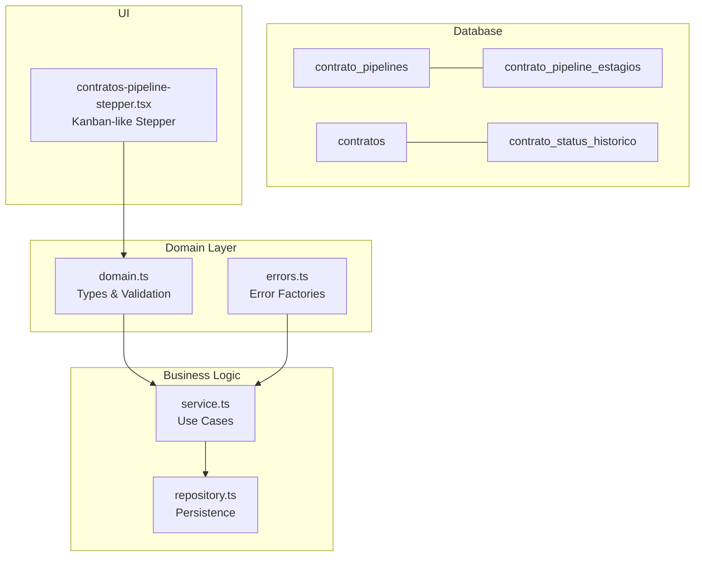
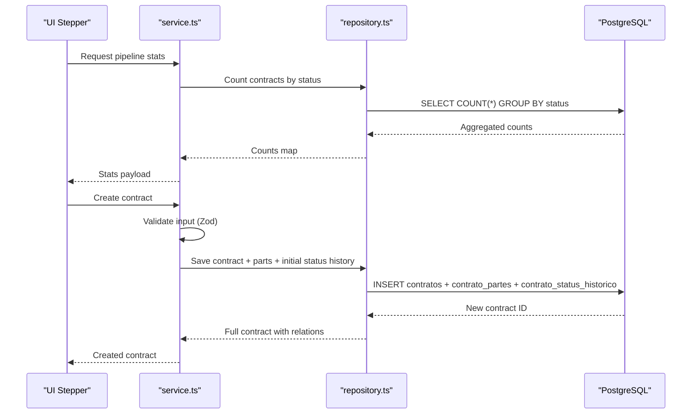
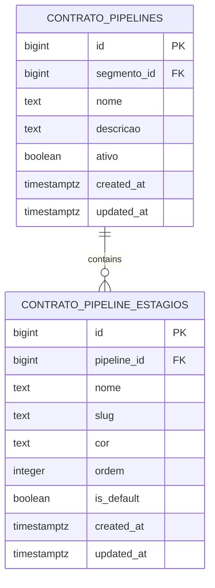
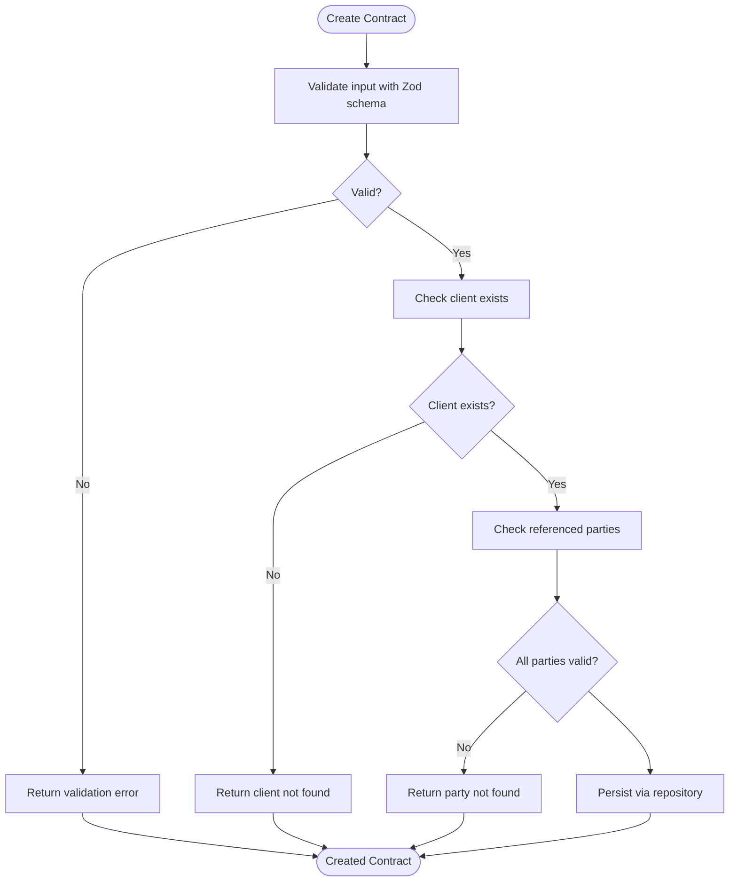
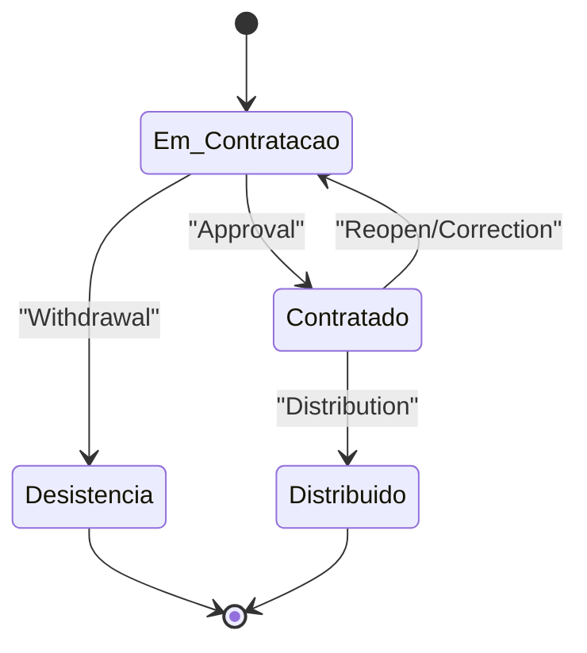
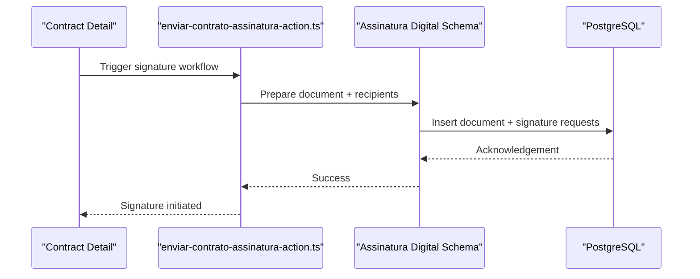
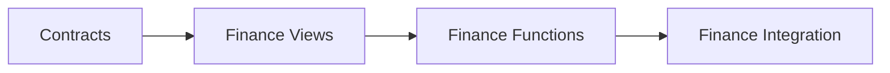
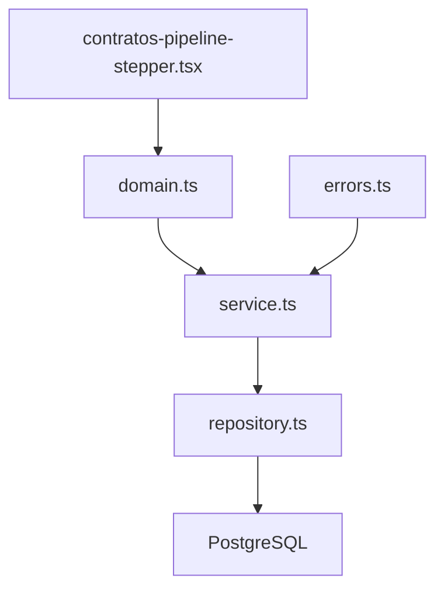

# Contract Pipelines and Workflows

<cite>
**Referenced Files in This Document**
- [20260225000002_create_contrato_pipelines.sql](file://supabase/migrations/20260225000002_create_contrato_pipelines.sql)
- [20260225000006_seed_contrato_pipelines.sql](file://supabase/migrations/20260225000006_seed_contrato_pipelines.sql)
- [domain.ts](file://src/shared/contratos/domain.ts)
- [service.ts](file://src/shared/contratos/service.ts)
- [repository.ts](file://src/shared/contratos/repository.ts)
- [errors.ts](file://src/shared/contratos/errors.ts)
- [contratos-pipeline-stepper.tsx](file://src/app/(authenticated)/contratos/components/contratos-pipeline-stepper.tsx)
- [enviar-contrato-assinatura-action.ts](file://src/app/(authenticated)/contratos/actions/enviar-contrato-assinatura-action.ts)
- [assinatura_digital.sql](file://supabase/migrations/20260105160000_add_assinatura_digital_documentos_tables.sql)
- [assinatura_digital.sql](file://supabase/schemas/25_assinatura_digital.sql)
- [financeiro_functions.sql](file://supabase/schemas/33_financeiro_functions.sql)
- [financeiro_views.sql](file://supabase/schemas/34_financeiro_views.sql)
- [financeiro_integracao.sql](file://supabase/schemas/35_financeiro_integracao.sql)
</cite>

## Table of Contents
1. [Introduction](#introduction)
2. [Project Structure](#project-structure)
3. [Core Components](#core-components)
4. [Architecture Overview](#architecture-overview)
5. [Detailed Component Analysis](#detailed-component-analysis)
6. [Dependency Analysis](#dependency-analysis)
7. [Performance Considerations](#performance-considerations)
8. [Troubleshooting Guide](#troubleshooting-guide)
9. [Conclusion](#conclusion)

## Introduction
This document explains the Contract Pipelines and Workflows system that orchestrates legal contract creation, approval, and lifecycle transitions. It covers the step-by-step contract creation process, approval workflows, status transitions, pipeline stages, decision points, automation rules, and integrations with document generation, signature workflows, and financial tracking. It also documents pipeline configuration, custom workflow creation, status management, validation, error handling, rollback mechanisms, and the relationship between pipelines and contract templates.

## Project Structure
The Contract Pipelines and Workflows span three layers:
- Database schema and seed for pipeline configuration
- Shared business logic (domain, service, repository, errors)
- Frontend pipeline visualization and actions

**Diagram sources**
- [20260225000002_create_contrato_pipelines.sql:4-74](file://supabase/migrations/20260225000002_create_contrato_pipelines.sql#L4-L74)
- [20260225000006_seed_contrato_pipelines.sql:1-30](file://supabase/migrations/20260225000006_seed_contrato_pipelines.sql#L1-L30)
- [domain.ts:1-368](file://src/shared/contratos/domain.ts#L1-L368)
- [service.ts:1-404](file://src/shared/contratos/service.ts#L1-L404)
- [repository.ts:1-800](file://src/shared/contratos/repository.ts#L1-L800)
- [contratos-pipeline-stepper.tsx](file://src/app/(authenticated)/contratos/components/contratos-pipeline-stepper.tsx#L1-L213)

**Section sources**
- [20260225000002_create_contrato_pipelines.sql:1-74](file://supabase/migrations/20260225000002_create_contrato_pipelines.sql#L1-L74)
- [20260225000006_seed_contrato_pipelines.sql:1-30](file://supabase/migrations/20260225000006_seed_contrato_pipelines.sql#L1-L30)
- [domain.ts:1-368](file://src/shared/contratos/domain.ts#L1-L368)
- [service.ts:1-404](file://src/shared/contratos/service.ts#L1-L404)
- [repository.ts:1-800](file://src/shared/contratos/repository.ts#L1-L800)
- [contratos-pipeline-stepper.tsx](file://src/app/(authenticated)/contratos/components/contratos-pipeline-stepper.tsx#L1-L213)

## Core Components
- Pipeline definition and stages: Each segment has a single configurable pipeline with ordered stages and default stage selection.
- Contract lifecycle: Creation, approval, distribution, and optional withdrawal, tracked by status and historical records.
- Business rules: Validation, existence checks, partial updates, and snapshotting for auditability.
- UI pipeline stepper: Visual funnel showing counts, percentages, and click-to-filter by stage.
- Signature workflow integration: Contract document generation and signature steps integrated via dedicated actions and schema.
- Financial tracking: Functions, views, and integration tables support financial metrics and reporting.

**Section sources**
- [20260225000002_create_contrato_pipelines.sql:37-74](file://supabase/migrations/20260225000002_create_contrato_pipelines.sql#L37-L74)
- [20260225000006_seed_contrato_pipelines.sql:1-30](file://supabase/migrations/20260225000006_seed_contrato_pipelines.sql#L1-L30)
- [domain.ts:48-143](file://src/shared/contratos/domain.ts#L48-L143)
- [service.ts:80-136](file://src/shared/contratos/service.ts#L80-L136)
- [repository.ts:642-741](file://src/shared/contratos/repository.ts#L642-L741)
- [contratos-pipeline-stepper.tsx](file://src/app/(authenticated)/contratos/components/contratos-pipeline-stepper.tsx#L30-L64)

## Architecture Overview
The system follows a layered architecture:
- Domain defines types, enums, validation schemas, and labels.
- Service encapsulates business rules and orchestrates repository operations.
- Repository handles database persistence and joins.
- UI renders pipeline stages and interacts with backend actions.
- Integrations: Signature workflow and finance systems extend the pipeline.

**Diagram sources**
- [service.ts:80-136](file://src/shared/contratos/service.ts#L80-L136)
- [repository.ts:642-741](file://src/shared/contratos/repository.ts#L642-L741)
- [domain.ts:169-239](file://src/shared/contratos/domain.ts#L169-L239)

## Detailed Component Analysis

### Pipeline Definition and Stages
- One pipeline per segment with ordered stages and a single default stage.
- Seed creates a default pipeline with four stages aligned to contract statuses.
- UI stepper reflects the canonical stage order and labels.

**Diagram sources**
- [20260225000002_create_contrato_pipelines.sql:4-74](file://supabase/migrations/20260225000002_create_contrato_pipelines.sql#L4-L74)

**Section sources**
- [20260225000002_create_contrato_pipelines.sql:1-74](file://supabase/migrations/20260225000002_create_contrato_pipelines.sql#L1-L74)
- [20260225000006_seed_contrato_pipelines.sql:1-30](file://supabase/migrations/20260225000006_seed_contrato_pipelines.sql#L1-L30)
- [contratos-pipeline-stepper.tsx](file://src/app/(authenticated)/contratos/components/contratos-pipeline-stepper.tsx#L36-L64)

### Contract Creation and Validation
- Input validation uses Zod schemas for creation and updates.
- Existence checks for referenced entities (client, parties).
- Default status is set during creation; initial status history is recorded.
- Snapshot of previous values is preserved for audit trail.

**Diagram sources**
- [service.ts:80-136](file://src/shared/contratos/service.ts#L80-L136)
- [repository.ts:642-741](file://src/shared/contratos/repository.ts#L642-L741)
- [domain.ts:203-239](file://src/shared/contratos/domain.ts#L203-L239)

**Section sources**
- [service.ts:80-136](file://src/shared/contratos/service.ts#L80-L136)
- [repository.ts:642-741](file://src/shared/contratos/repository.ts#L642-L741)
- [domain.ts:169-239](file://src/shared/contratos/domain.ts#L169-L239)
- [errors.ts:14-68](file://src/shared/contratos/errors.ts#L14-L68)

### Status Transitions and History
- Status is part of the contract entity and supports canonical values.
- Status history captures from/to transitions with timestamps and metadata.
- UI displays stage counts and conversion percentages.

**Diagram sources**
- [domain.ts:48-54](file://src/shared/contratos/domain.ts#L48-L54)
- [repository.ts:130-144](file://src/shared/contratos/repository.ts#L130-L144)
- [contratos-pipeline-stepper.tsx](file://src/app/(authenticated)/contratos/components/contratos-pipeline-stepper.tsx#L36-L64)

**Section sources**
- [domain.ts:48-88](file://src/shared/contratos/domain.ts#L48-L88)
- [repository.ts:130-144](file://src/shared/contratos/repository.ts#L130-L144)
- [contratos-pipeline-stepper.tsx](file://src/app/(authenticated)/contratos/components/contratos-pipeline-stepper.tsx#L36-L64)

### Approval Workflow and Signature Integration
- Contract document generation and signature steps are integrated via actions and schema.
- The signature workflow leverages dedicated tables and policies for document management and compliance.

**Diagram sources**
- [enviar-contrato-assinatura-action.ts](file://src/app/(authenticated)/contratos/actions/enviar-contrato-assinatura-action.ts)
- [assinatura_digital.sql](file://supabase/migrations/20260105160000_add_assinatura_digital_documentos_tables.sql)
- [assinatura_digital.sql](file://supabase/schemas/25_assinatura_digital.sql)

**Section sources**
- [enviar-contrato-assinatura-action.ts](file://src/app/(authenticated)/contratos/actions/enviar-contrato-assinatura-action.ts)
- [assinatura_digital.sql](file://supabase/migrations/20260105160000_add_assinatura_digital_documentos_tables.sql)
- [assinatura_digital.sql](file://supabase/schemas/25_assinatura_digital.sql)

### Financial Tracking Integration
- Finance functions, views, and integration tables support financial metrics and reporting.
- These components complement the contract lifecycle by enabling billing, invoicing, and revenue tracking aligned to contract status and processes.

**Diagram sources**
- [financeiro_functions.sql](file://supabase/schemas/33_financeiro_functions.sql)
- [financeiro_views.sql](file://supabase/schemas/34_financeiro_views.sql)
- [financeiro_integracao.sql](file://supabase/schemas/35_financeiro_integracao.sql)

**Section sources**
- [financeiro_functions.sql](file://supabase/schemas/33_financeiro_functions.sql)
- [financeiro_views.sql](file://supabase/schemas/34_financeiro_views.sql)
- [financeiro_integracao.sql](file://supabase/schemas/35_financeiro_integracao.sql)

## Dependency Analysis
- Domain depends on Zod for validation and exposes typed enums and schemas.
- Service depends on repository and domain for business logic and error handling.
- Repository depends on Supabase client and converts raw rows to typed domain objects.
- UI depends on domain labels and status enums for rendering.

**Diagram sources**
- [domain.ts:1-368](file://src/shared/contratos/domain.ts#L1-L368)
- [service.ts:1-404](file://src/shared/contratos/service.ts#L1-L404)
- [repository.ts:1-800](file://src/shared/contratos/repository.ts#L1-L800)
- [contratos-pipeline-stepper.tsx](file://src/app/(authenticated)/contratos/components/contratos-pipeline-stepper.tsx#L1-L213)

**Section sources**
- [domain.ts:1-368](file://src/shared/contratos/domain.ts#L1-L368)
- [service.ts:1-404](file://src/shared/contratos/service.ts#L1-L404)
- [repository.ts:1-800](file://src/shared/contratos/repository.ts#L1-L800)
- [contratos-pipeline-stepper.tsx](file://src/app/(authenticated)/contratos/components/contratos-pipeline-stepper.tsx#L1-L213)

## Performance Considerations
- Aggregation queries for status counts use exact counting and head-based queries to avoid default row limits.
- Sorting and filtering leverage indexed columns and proper ordering to minimize scan costs.
- UI steppers compute totals and percentages client-side to reduce server load.

[No sources needed since this section provides general guidance]

## Troubleshooting Guide
Common issues and resolutions:
- Validation errors: Review Zod schema violations and ensure required fields are present.
- Entity not found: Verify client/parties exist before creating/updating contracts.
- No fields to update: Ensure at least one updatable field is provided.
- Database errors: Inspect error codes and messages returned by repository operations.

**Section sources**
- [errors.ts:74-133](file://src/shared/contratos/errors.ts#L74-L133)
- [repository.ts:297-306](file://src/shared/contratos/repository.ts#L297-L306)
- [service.ts:240-324](file://src/shared/contratos/service.ts#L240-L324)

## Conclusion
The Contract Pipelines and Workflows system provides a robust foundation for managing legal contracts from creation through distribution and optional withdrawal. Its modular design separates concerns across domain, service, and repository layers, while UI components offer intuitive stage visualization. Integrations with signature workflows and financial systems extend the pipeline to support end-to-end contract lifecycle management, ensuring compliance, traceability, and operational efficiency.