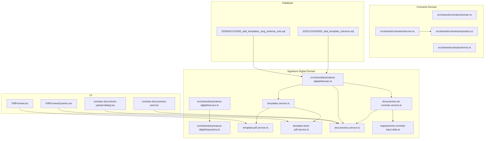
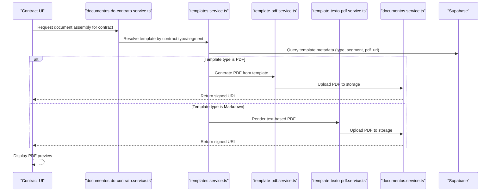
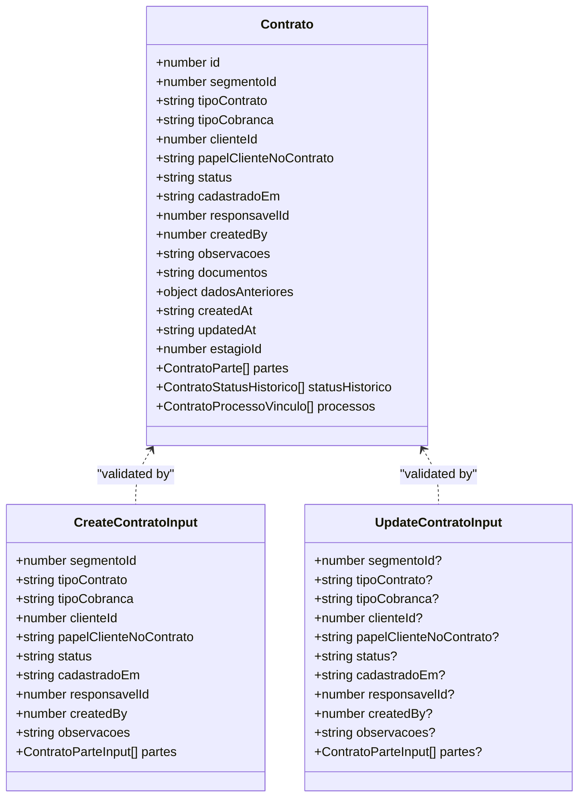
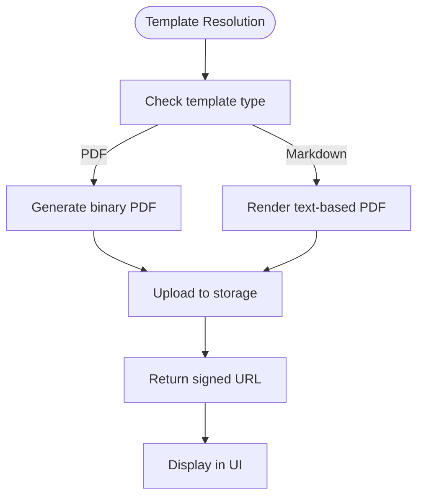
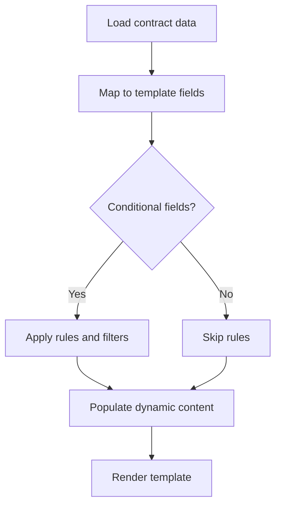
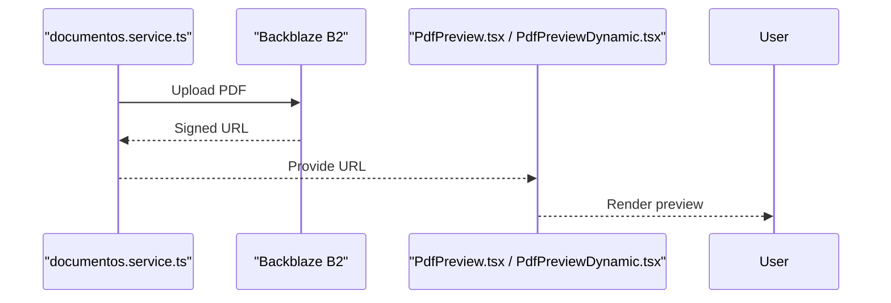
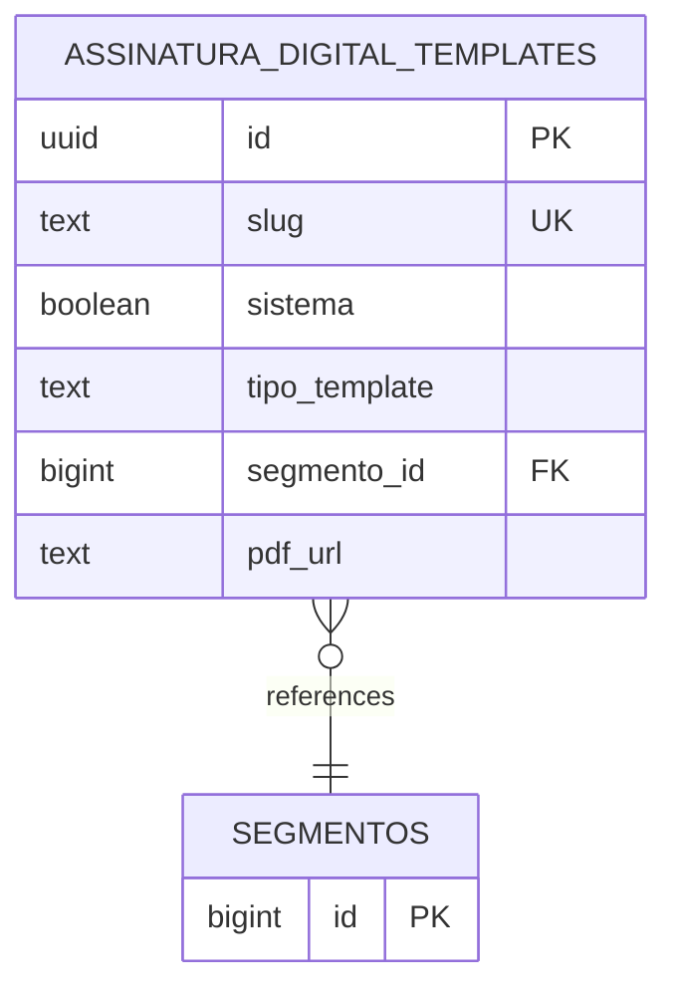
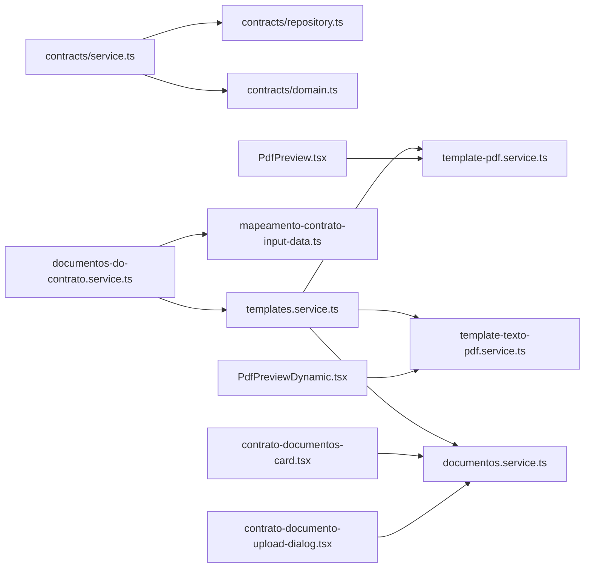

# Contract Templates and Document Generation

<cite>
**Referenced Files in This Document**
- [domain.ts](file://src/shared/contratos/domain.ts)
- [service.ts](file://src/shared/contratos/service.ts)
- [repository.ts](file://src/shared/contratos/repository.ts)
- [errors.ts](file://src/shared/contratos/errors.ts)
- [domain.ts](file://src/shared/assinatura-digital/domain.ts)
- [repository.ts](file://src/shared/assinatura-digital/repository.ts)
- [service.ts](file://src/shared/assinatura-digital/service.ts)
- [templates.service.ts](file://src/shared/assinatura-digital/services/templates.service.ts)
- [template-pdf.service.ts](file://src/shared/assinatura-digital/services/template-pdf.service.ts)
- [template-texto-pdf.service.ts](file://src/shared/assinatura-digital/services/template-texto-pdf.service.ts)
- [documentos.service.ts](file://src/shared/assinatura-digital/services/documentos.service.ts)
- [documentos-do-contrato.service.ts](file://src/shared/assinatura-digital/services/documentos-do-contrato.service.ts)
- [mapeamento-contrato-input-data.ts](file://src/shared/assinatura-digital/services/mapeamento-contrato-input-data.ts)
- [20251210020000_add_template_columns.sql](file://supabase/migrations/20251210020000_add_template_columns.sql)
- [20260422120300_add_templates_slug_sistema_cols.sql](file://supabase/migrations/20260422120300_add_templates_slug_sistema_cols.sql)
- [contrato-documentos-card.tsx](file://src/app/(authenticated)/contratos/[id]/components/contrato-documentos-card.tsx)
- [contrato-documento-upload-dialog.tsx](file://src/app/(authenticated)/contratos/[id]/components/contrato-documento-upload-dialog.tsx)
- [contrato-documentos-assinatura-card.tsx](file://src/app/(authenticated)/contratos/[id]/components/contrato-documentos-assinatura-card.tsx)
- [documentos-contratacao-card.tsx](file://src/app/(authenticated)/contratos/[id]/components/documentos-contratacao-card.tsx)
- [PdfPreview.tsx](file://src/shared/assinatura-digital/components/pdf/PdfPreview.tsx)
- [PdfPreviewDynamic.tsx](file://src/shared/assinatura-digital/components/pdf/PdfPreviewDynamic.tsx)
</cite>

## Table of Contents
1. [Introduction](#introduction)
2. [Project Structure](#project-structure)
3. [Core Components](#core-components)
4. [Architecture Overview](#architecture-overview)
5. [Detailed Component Analysis](#detailed-component-analysis)
6. [Dependency Analysis](#dependency-analysis)
7. [Performance Considerations](#performance-considerations)
8. [Troubleshooting Guide](#troubleshooting-guide)
9. [Conclusion](#conclusion)
10. [Appendices](#appendices)

## Introduction
This document explains the Contract Templates and Document Generation system. It covers how templates are modeled, how fields are mapped and dynamically populated, how documents are generated and integrated with the document management system, and how template versioning and sharing are handled. It also documents the relationship between templates and contract types, validation rules, and approval workflows, along with compliance and reuse mechanisms.

## Project Structure
The system spans two main domains:
- Contracts: domain modeling, validation, persistence, and business services for contracts.
- Signature Digital (Templates and Documents): domain modeling, services for templates, PDF generation, and document assembly.

Key areas:
- Contract domain and services under src/shared/contratos
- Template and document services under src/shared/assinatura-digital
- Database schema evolution for templates under supabase/migrations
- UI components for document display and assembly under src/app/(authenticated)/contratos/[id]/components and src/shared/assinatura-digital/components/pdf

**Diagram sources**
- [domain.ts:105-143](file://src/shared/contratos/domain.ts#L105-L143)
- [service.ts:80-136](file://src/shared/contratos/service.ts#L80-L136)
- [repository.ts:271-317](file://src/shared/contratos/repository.ts#L271-L317)
- [domain.ts](file://src/shared/assinatura-digital/domain.ts)
- [repository.ts](file://src/shared/assinatura-digital/repository.ts)
- [service.ts](file://src/shared/assinatura-digital/service.ts)
- [templates.service.ts](file://src/shared/assinatura-digital/services/templates.service.ts)
- [template-pdf.service.ts](file://src/shared/assinatura-digital/services/template-pdf.service.ts)
- [template-texto-pdf.service.ts](file://src/shared/assinatura-digital/services/template-texto-pdf.service.ts)
- [documentos.service.ts](file://src/shared/assinatura-digital/services/documentos.service.ts)
- [documentos-do-contrato.service.ts](file://src/shared/assinatura-digital/services/documentos-do-contrato.service.ts)
- [mapeamento-contrato-input-data.ts](file://src/shared/assinatura-digital/services/mapeamento-contrato-input-data.ts)
- [20251210020000_add_template_columns.sql:1-42](file://supabase/migrations/20251210020000_add_template_columns.sql#L1-L42)
- [20260422120300_add_templates_slug_sistema_cols.sql:1-16](file://supabase/migrations/20260422120300_add_templates_slug_sistema_cols.sql#L1-L16)
- [contrato-documentos-card.tsx](file://src/app/(authenticated)/contratos/[id]/components/contrato-documentos-card.tsx)
- [contrato-documento-upload-dialog.tsx](file://src/app/(authenticated)/contratos/[id]/components/contrato-documento-upload-dialog.tsx)
- [PdfPreview.tsx](file://src/shared/assinatura-digital/components/pdf/PdfPreview.tsx)
- [PdfPreviewDynamic.tsx](file://src/shared/assinatura-digital/components/pdf/PdfPreviewDynamic.tsx)

**Section sources**
- [domain.ts:105-143](file://src/shared/contratos/domain.ts#L105-L143)
- [service.ts:80-136](file://src/shared/contratos/service.ts#L80-L136)
- [repository.ts:271-317](file://src/shared/contratos/repository.ts#L271-L317)
- [domain.ts](file://src/shared/assinatura-digital/domain.ts)
- [repository.ts](file://src/shared/assinatura-digital/repository.ts)
- [service.ts](file://src/shared/assinatura-digital/service.ts)
- [templates.service.ts](file://src/shared/assinatura-digital/services/templates.service.ts)
- [template-pdf.service.ts](file://src/shared/assinatura-digital/services/template-pdf.service.ts)
- [template-texto-pdf.service.ts](file://src/shared/assinatura-digital/services/template-texto-pdf.service.ts)
- [documentos.service.ts](file://src/shared/assinatura-digital/services/documentos.service.ts)
- [documentos-do-contrato.service.ts](file://src/shared/assinatura-digital/services/documentos-do-contrato.service.ts)
- [mapeamento-contrato-input-data.ts](file://src/shared/assinatura-digital/services/mapeamento-contrato-input-data.ts)
- [20251210020000_add_template_columns.sql:1-42](file://supabase/migrations/20251210020000_add_template_columns.sql#L1-L42)
- [20260422120300_add_templates_slug_sistema_cols.sql:1-16](file://supabase/migrations/20260422120300_add_templates_slug_sistema_cols.sql#L1-L16)
- [contrato-documentos-card.tsx](file://src/app/(authenticated)/contratos/[id]/components/contrato-documentos-card.tsx)
- [contrato-documento-upload-dialog.tsx](file://src/app/(authenticated)/contratos/[id]/components/contrato-documento-upload-dialog.tsx)
- [PdfPreview.tsx](file://src/shared/assinatura-digital/components/pdf/PdfPreview.tsx)
- [PdfPreviewDynamic.tsx](file://src/shared/assinatura-digital/components/pdf/PdfPreviewDynamic.tsx)

## Core Components
- Contracts domain: Defines contract types, enums, validation schemas, and related entities (parties, statuses, processes).
- Contracts services: Business logic for creating, updating, listing, and counting contracts with validation and error handling.
- Contracts repository: Database access for contracts, including joins to related entities and pagination.
- Signature Digital domain: Defines templates, segments, and document lifecycle.
- Templates services: Template management, PDF generation (binary PDF vs. text-based), and document assembly for contracts.
- Document services: Document indexing, storage integration, and contract-specific document assembly.
- Database migrations: Add template columns (type, segment association, PDF URL), and slug/system flags for template governance.

**Section sources**
- [domain.ts:105-143](file://src/shared/contratos/domain.ts#L105-L143)
- [service.ts:80-136](file://src/shared/contratos/service.ts#L80-L136)
- [repository.ts:271-317](file://src/shared/contratos/repository.ts#L271-L317)
- [domain.ts](file://src/shared/assinatura-digital/domain.ts)
- [templates.service.ts](file://src/shared/assinatura-digital/services/templates.service.ts)
- [template-pdf.service.ts](file://src/shared/assinatura-digital/services/template-pdf.service.ts)
- [template-texto-pdf.service.ts](file://src/shared/assinatura-digital/services/template-texto-pdf.service.ts)
- [documentos.service.ts](file://src/shared/assinatura-digital/services/documentos.service.ts)
- [documentos-do-contrato.service.ts](file://src/shared/assinatura-digital/services/documentos-do-contrato.service.ts)
- [20251210020000_add_template_columns.sql:1-42](file://supabase/migrations/20251210020000_add_template_columns.sql#L1-L42)
- [20260422120300_add_templates_slug_sistema_cols.sql:1-16](file://supabase/migrations/20260422120300_add_templates_slug_sistema_cols.sql#L1-L16)

## Architecture Overview
The system separates concerns across layers:
- Presentation/UI: Contract document cards and upload dialogs.
- Services: Business logic for contracts and templates/documents.
- Persistence: Supabase ORM queries and migrations.
- Storage: Backblaze B2 integration for PDF storage and retrieval.

**Diagram sources**
- [documentos-do-contrato.service.ts](file://src/shared/assinatura-digital/services/documentos-do-contrato.service.ts)
- [templates.service.ts](file://src/shared/assinatura-digital/services/templates.service.ts)
- [template-pdf.service.ts](file://src/shared/assinatura-digital/services/template-pdf.service.ts)
- [template-texto-pdf.service.ts](file://src/shared/assinatura-digital/services/template-texto-pdf.service.ts)
- [documentos.service.ts](file://src/shared/assinatura-digital/services/documentos.service.ts)

## Detailed Component Analysis

### Contracts Domain and Services
- Domain defines contract entity, enums (type, billing type, status), validation schemas, and related entities (parties, statuses, processes).
- Services enforce business rules for create/update/list/delete, validate inputs, and coordinate persistence.
- Repository handles database queries, joins, pagination, and conversion from database records to typed entities.

**Diagram sources**
- [domain.ts:105-143](file://src/shared/contratos/domain.ts#L105-L143)
- [domain.ts:203-239](file://src/shared/contratos/domain.ts#L203-L239)

**Section sources**
- [domain.ts:105-143](file://src/shared/contratos/domain.ts#L105-L143)
- [domain.ts:203-239](file://src/shared/contratos/domain.ts#L203-L239)
- [service.ts:80-136](file://src/shared/contratos/service.ts#L80-L136)
- [repository.ts:271-317](file://src/shared/contratos/repository.ts#L271-L317)

### Templates and Document Assembly
- Templates are stored with metadata: type (PDF or Markdown), segment association, and optional PDF URL.
- Templates service resolves appropriate template for a contract based on type and segment.
- PDF generation supports:
  - Binary PDF generation via template-pdf.service.ts
  - Text-based PDF rendering via template-texto-pdf.service.ts
- Document assembly for contracts uses documentos-do-contrato.service.ts to map contract data to template fields and produce final documents.

**Diagram sources**
- [templates.service.ts](file://src/shared/assinatura-digital/services/templates.service.ts)
- [template-pdf.service.ts](file://src/shared/assinatura-digital/services/template-pdf.service.ts)
- [template-texto-pdf.service.ts](file://src/shared/assinatura-digital/services/template-texto-pdf.service.ts)
- [documentos-do-contrato.service.ts](file://src/shared/assinatura-digital/services/documentos-do-contrato.service.ts)

**Section sources**
- [templates.service.ts](file://src/shared/assinatura-digital/services/templates.service.ts)
- [template-pdf.service.ts](file://src/shared/assinatura-digital/services/template-pdf.service.ts)
- [template-texto-pdf.service.ts](file://src/shared/assinatura-digital/services/template-texto-pdf.service.ts)
- [documentos-do-contrato.service.ts](file://src/shared/assinatura-digital/services/documentos-do-contrato.service.ts)

### Field Mapping and Dynamic Content Generation
- Field mapping uses mapeamento-contrato-input-data.ts to translate contract data into template fields.
- Conditional fields and automated data population are driven by contract type, segment, and available party data.
- The mapping ensures only relevant fields are populated, reducing noise and improving accuracy.

**Diagram sources**
- [mapeamento-contrato-input-data.ts](file://src/shared/assinatura-digital/services/mapeamento-contrato-input-data.ts)

**Section sources**
- [mapeamento-contrato-input-data.ts](file://src/shared/assinatura-digital/services/mapeamento-contrato-input-data.ts)

### Document Management Integration and PDF Workflows
- documentos.service.ts manages document lifecycle: creation, indexing, and storage integration.
- PDF generation workflows support both binary and text-based templates, returning signed URLs for secure access.
- UI components PdfPreview.tsx and PdfPreviewDynamic.tsx render previews for static and dynamic PDFs respectively.

**Diagram sources**
- [documentos.service.ts](file://src/shared/assinatura-digital/services/documentos.service.ts)
- [PdfPreview.tsx](file://src/shared/assinatura-digital/components/pdf/PdfPreview.tsx)
- [PdfPreviewDynamic.tsx](file://src/shared/assinatura-digital/components/pdf/PdfPreviewDynamic.tsx)

**Section sources**
- [documentos.service.ts](file://src/shared/assinatura-digital/services/documentos.service.ts)
- [PdfPreview.tsx](file://src/shared/assinatura-digital/components/pdf/PdfPreview.tsx)
- [PdfPreviewDynamic.tsx](file://src/shared/assinatura-digital/components/pdf/PdfPreviewDynamic.tsx)

### Template Versioning and Governance
- Templates are governed by slug and system flags to prevent accidental deletion and ensure core templates remain intact.
- Segment association allows per-segment templates while global templates serve as fallbacks.
- Indexes on segment and type improve query performance for template resolution.

**Diagram sources**
- [20251210020000_add_template_columns.sql:1-42](file://supabase/migrations/20251210020000_add_template_columns.sql#L1-L42)
- [20260422120300_add_templates_slug_sistema_cols.sql:1-16](file://supabase/migrations/20260422120300_add_templates_slug_sistema_cols.sql#L1-L16)

**Section sources**
- [20251210020000_add_template_columns.sql:1-42](file://supabase/migrations/20251210020000_add_template_columns.sql#L1-L42)
- [20260422120300_add_templates_slug_sistema_cols.sql:1-16](file://supabase/migrations/20260422120300_add_templates_slug_sistema_cols.sql#L1-L16)

### Relationship Between Templates and Contract Types
- Templates are resolved based on contract type and segment.
- The mapping ensures that the correct template is selected for each contract subtype, enabling standardized document generation across legal practice areas.

**Section sources**
- [templates.service.ts](file://src/shared/assinatura-digital/services/templates.service.ts)
- [domain.ts](file://src/shared/assinatura-digital/domain.ts)

### Validation Rules and Approval Workflows
- Contracts enforce strict validation via Zod schemas and business rules in services.
- Approval workflows are not explicitly implemented in the referenced files; however, the contracts status model and audit trail enable workflow integration at the status change level.

**Section sources**
- [service.ts:80-136](file://src/shared/contratos/service.ts#L80-L136)
- [domain.ts:105-143](file://src/shared/contratos/domain.ts#L105-L143)

### Template Sharing and Reuse Mechanisms
- Global templates (segment null) can be reused across segments.
- Per-segment templates override global defaults for specific practice areas.
- Slug uniqueness ensures controlled reuse and prevents conflicts.

**Section sources**
- [20251210020000_add_template_columns.sql:12-16](file://supabase/migrations/20251210020000_add_template_columns.sql#L12-L16)
- [20260422120300_add_templates_slug_sistema_cols.sql:10-12](file://supabase/migrations/20260422120300_add_templates_slug_sistema_cols.sql#L10-L12)

### Compliance Requirements
- System templates are marked with a system flag to prevent accidental modification or deletion.
- Unique slugs ensure compliance with governance policies for template ownership and versioning.

**Section sources**
- [20260422120300_add_templates_slug_sistema_cols.sql:14-16](file://supabase/migrations/20260422120300_add_templates_slug_sistema_cols.sql#L14-L16)

## Dependency Analysis
- Contracts services depend on repository for persistence and on domain schemas for validation.
- Templates services depend on document services for storage and on PDF generation services for rendering.
- UI components depend on document services for displaying previews and on templates services for document assembly.

**Diagram sources**
- [service.ts:80-136](file://src/shared/contratos/service.ts#L80-L136)
- [repository.ts:271-317](file://src/shared/contratos/repository.ts#L271-L317)
- [domain.ts:105-143](file://src/shared/contratos/domain.ts#L105-L143)
- [templates.service.ts](file://src/shared/assinatura-digital/services/templates.service.ts)
- [template-pdf.service.ts](file://src/shared/assinatura-digital/services/template-pdf.service.ts)
- [template-texto-pdf.service.ts](file://src/shared/assinatura-digital/services/template-texto-pdf.service.ts)
- [documentos.service.ts](file://src/shared/assinatura-digital/services/documentos.service.ts)
- [documentos-do-contrato.service.ts](file://src/shared/assinatura-digital/services/documentos-do-contrato.service.ts)
- [mapeamento-contrato-input-data.ts](file://src/shared/assinatura-digital/services/mapeamento-contrato-input-data.ts)
- [contrato-documentos-card.tsx](file://src/app/(authenticated)/contratos/[id]/components/contrato-documentos-card.tsx)
- [contrato-documento-upload-dialog.tsx](file://src/app/(authenticated)/contratos/[id]/components/contrato-documento-upload-dialog.tsx)
- [PdfPreview.tsx](file://src/shared/assinatura-digital/components/pdf/PdfPreview.tsx)
- [PdfPreviewDynamic.tsx](file://src/shared/assinatura-digital/components/pdf/PdfPreviewDynamic.tsx)

**Section sources**
- [service.ts:80-136](file://src/shared/contratos/service.ts#L80-L136)
- [repository.ts:271-317](file://src/shared/contratos/repository.ts#L271-L317)
- [domain.ts:105-143](file://src/shared/contratos/domain.ts#L105-L143)
- [templates.service.ts](file://src/shared/assinatura-digital/services/templates.service.ts)
- [template-pdf.service.ts](file://src/shared/assinatura-digital/services/template-pdf.service.ts)
- [template-texto-pdf.service.ts](file://src/shared/assinatura-digital/services/template-texto-pdf.service.ts)
- [documentos.service.ts](file://src/shared/assinatura-digital/services/documentos.service.ts)
- [documentos-do-contrato.service.ts](file://src/shared/assinatura-digital/services/documentos-do-contrato.service.ts)
- [mapeamento-contrato-input-data.ts](file://src/shared/assinatura-digital/services/mapeamento-contrato-input-data.ts)
- [contrato-documentos-card.tsx](file://src/app/(authenticated)/contratos/[id]/components/contrato-documentos-card.tsx)
- [contrato-documento-upload-dialog.tsx](file://src/app/(authenticated)/contratos/[id]/components/contrato-documento-upload-dialog.tsx)
- [PdfPreview.tsx](file://src/shared/assinatura-digital/components/pdf/PdfPreview.tsx)
- [PdfPreviewDynamic.tsx](file://src/shared/assinatura-digital/components/pdf/PdfPreviewDynamic.tsx)

## Performance Considerations
- Use indexes on template segment and type to accelerate template resolution.
- Prefer binary PDF generation for large documents to reduce rendering overhead.
- Cache signed URLs for frequently accessed documents to minimize storage round trips.

[No sources needed since this section provides general guidance]

## Troubleshooting Guide
- Contract creation failures: Validate input against schemas and ensure referenced entities exist before saving.
- Template resolution failures: Verify template type, segment association, and slug uniqueness.
- PDF generation errors: Confirm template content and storage connectivity; check signed URL generation.

**Section sources**
- [errors.ts:25-68](file://src/shared/contratos/errors.ts#L25-L68)
- [service.ts:80-136](file://src/shared/contratos/service.ts#L80-L136)
- [templates.service.ts](file://src/shared/assinatura-digital/services/templates.service.ts)
- [documentos.service.ts](file://src/shared/assinatura-digital/services/documentos.service.ts)

## Conclusion
The Contract Templates and Document Generation system integrates contract data with flexible templates, robust validation, and efficient PDF generation. Templates are governed by segment associations, slugs, and system flags to ensure compliance and reuse. The architecture cleanly separates concerns across contracts, templates, and document services, with UI components providing seamless document previews and assembly.

## Appendices
- Example template creation: Define template metadata (type, segment, slug), ensure system flag for core templates, and upload PDF via document services.
- Example field configuration: Map contract parties and attributes to template placeholders using the mapping service.
- Example document assembly: Resolve template by contract type/segment, generate PDF, upload to storage, and display preview in UI.

[No sources needed since this section provides general guidance]