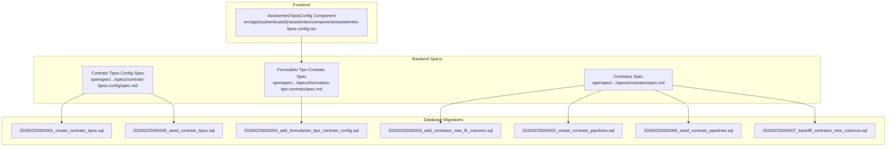
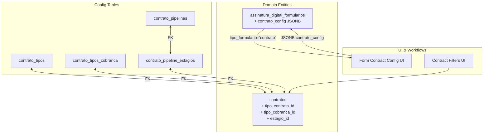
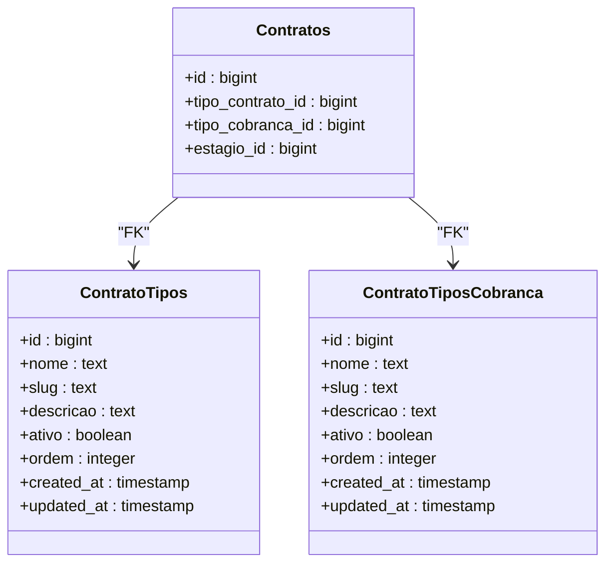
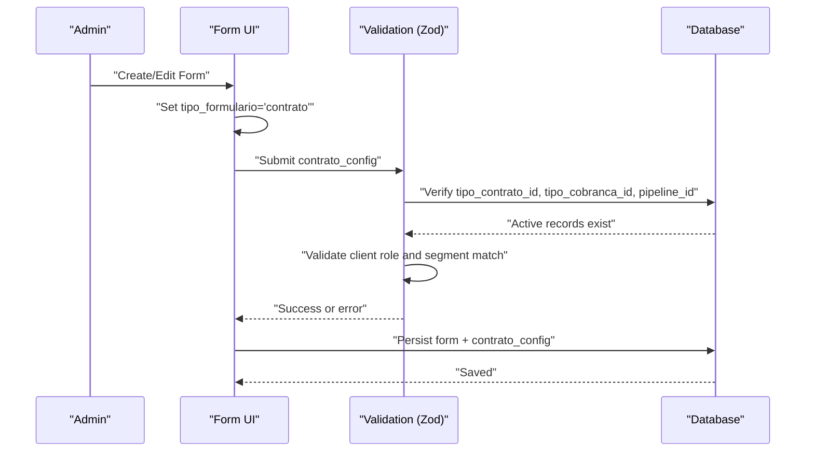
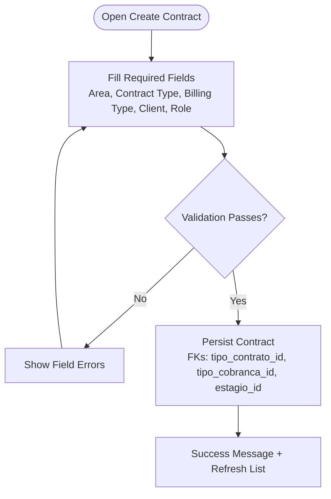
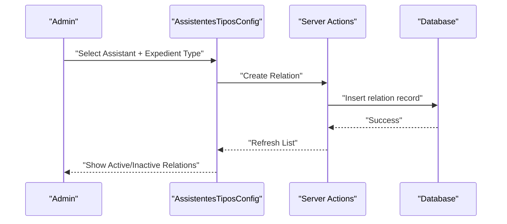
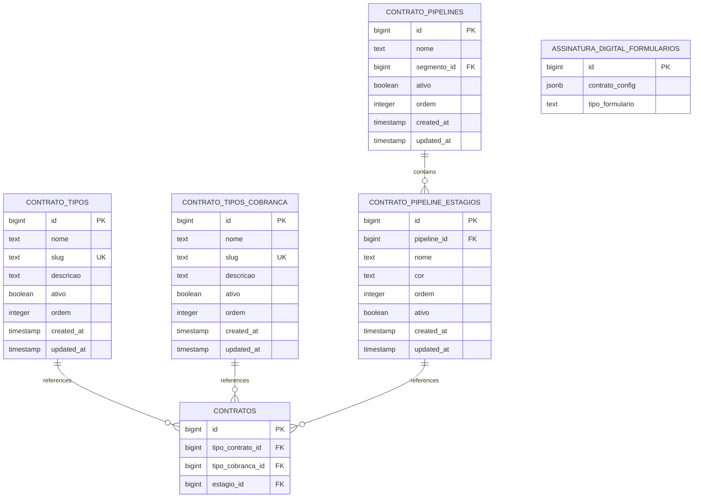

# Contract Types and Configuration

<cite>
**Referenced Files in This Document**
- [assistentes-tipos-config.tsx](file://src/app/(authenticated)/assistentes/components/assistentes-tipos-config.tsx)
- [spec.md](file://openspec/changes/archive/2026-02-25-flexibilizar-contratos-pipeline-kanban/specs/contrato-tipos-config/spec.md)
- [formulario-tipo-contrato/spec.md](file://openspec/changes/archive/2026-02-25-flexibilizar-contratos-pipeline-kanban/specs/formulario-tipo-contrato/spec.md)
- [contratos/spec.md](file://openspec/changes/archive/2026-02-25-flexibilizar-contratos-pipeline-kanban/specs/contratos/spec.md)
- [20251229000000_refactor_contratos_modelo_relacional.sql](file://supabase/migrations/20251229000000_refactor_contratos_modelo_relacional.sql)
- [20260225000001_create_contrato_tipos.sql](file://supabase/migrations/20260225000001_create_contrato_tipos.sql)
- [20260225000002_create_contrato_pipelines.sql](file://supabase/migrations/20260225000002_create_contrato_pipelines.sql)
- [20260225000003_add_contratos_new_fk_columns.sql](file://supabase/migrations/20260225000003_add_contratos_new_fk_columns.sql)
- [20260225000004_add_formularios_tipo_contrato_config.sql](file://supabase/migrations/20260225000004_add_formularios_tipo_contrato_config.sql)
- [20260225000005_seed_contrato_tipos.sql](file://supabase/migrations/20260225000005_seed_contrato_tipos.sql)
- [20260225000006_seed_contrato_pipelines.sql](file://supabase/migrations/20260225000006_seed_contrato_pipelines.sql)
- [20260225000007_backfill_contratos_new_columns.sql](file://supabase/migrations/20260225000007_backfill_contratos_new_columns.sql)
- [20260225000008_create_get_user_auth_sessions_rpc.sql](file://supabase/migrations/20260225000008_create_get_user_auth_sessions_rpc.sql)
</cite>

## Table of Contents
1. [Introduction](#introduction)
2. [Project Structure](#project-structure)
3. [Core Components](#core-components)
4. [Architecture Overview](#architecture-overview)
5. [Detailed Component Analysis](#detailed-component-analysis)
6. [Dependency Analysis](#dependency-analysis)
7. [Performance Considerations](#performance-considerations)
8. [Troubleshooting Guide](#troubleshooting-guide)
9. [Conclusion](#conclusion)

## Introduction
This document explains the Contract Types and Configuration system that powers configurable contract categories and billing types within the platform. It covers how contract types are modeled, validated, and managed through the tipos-config system, how form configurations relate to contract types, and how these types integrate with segmentos (areas of law) and the broader contract lifecycle workflow. The system replaces fixed PostgreSQL enums with updatable, auditable tables and ensures backward compatibility during migration.

## Project Structure
The Contract Types and Configuration system spans frontend UI components, backend specifications, and database migrations:

- Frontend: A configuration UI component manages assistant-to-expedient-type mappings, demonstrating the pattern for managing configurable relationships.
- Backend specifications: Formal requirements define the contract type CRUD, validation rules, and integration with segmentos and pipelines.
- Database migrations: Schema changes introduce contract type tables, foreign keys, seeds, and backfills to support the new model.

**Diagram sources**
- [assistentes-tipos-config.tsx](file://src/app/(authenticated)/assistentes/components/assistentes-tipos-config.tsx#L1-L327)
- [spec.md:1-70](file://openspec/changes/archive/2026-02-25-flexibilizar-contratos-pipeline-kanban/specs/contrato-tipos-config/spec.md#L1-L70)
- [formulario-tipo-contrato/spec.md:1-74](file://openspec/changes/archive/2026-02-25-flexibilizar-contratos-pipeline-kanban/specs/formulario-tipo-contrato/spec.md#L1-L74)
- [contratos/spec.md:1-116](file://openspec/changes/archive/2026-02-25-flexibilizar-contratos-pipeline-kanban/specs/contratos/spec.md#L1-L116)
- [20260225000001_create_contrato_tipos.sql](file://supabase/migrations/20260225000001_create_contrato_tipos.sql)
- [20260225000002_create_contrato_pipelines.sql](file://supabase/migrations/20260225000002_create_contrato_pipelines.sql)
- [20260225000003_add_contratos_new_fk_columns.sql](file://supabase/migrations/20260225000003_add_contratos_new_fk_columns.sql)
- [20260225000004_add_formularios_tipo_contrato_config.sql](file://supabase/migrations/20260225000004_add_formularios_tipo_contrato_config.sql)
- [20260225000005_seed_contrato_tipos.sql](file://supabase/migrations/20260225000005_seed_contrato_tipos.sql)
- [20260225000006_seed_contrato_pipelines.sql](file://supabase/migrations/20260225000006_seed_contrato_pipelines.sql)
- [20260225000007_backfill_contratos_new_columns.sql](file://supabase/migrations/20260225000007_backfill_contratos_new_columns.sql)

**Section sources**
- [assistentes-tipos-config.tsx](file://src/app/(authenticated)/assistentes/components/assistentes-tipos-config.tsx#L1-L327)
- [spec.md:1-70](file://openspec/changes/archive/2026-02-25-flexibilizar-contratos-pipeline-kanban/specs/contrato-tipos-config/spec.md#L1-L70)
- [formulario-tipo-contrato/spec.md:1-74](file://openspec/changes/archive/2026-02-25-flexibilizar-contratos-pipeline-kanban/specs/formulario-tipo-contrato/spec.md#L1-L74)
- [contratos/spec.md:1-116](file://openspec/changes/archive/2026-02-25-flexibilizar-contratos-pipeline-kanban/specs/contratos/spec.md#L1-L116)

## Core Components
- Contract Type Management (tipos-config): Admin CRUD for contract types and billing types, replacing fixed enums with configurable records.
- Form Configuration: Form schemas distinguish contract forms and auto-generate sections, storing contract-specific configuration as JSONB.
- Segmento Integration: Pipelines and form fields are filtered by segmentos to ensure contextual correctness.
- Contract Lifecycle: Contracts reference contract types, billing types, and pipeline stages via foreign keys, enabling advanced filtering and display formatting.

Key implementation references:
- Contract types CRUD and constraints: [spec.md:3-70](file://openspec/changes/archive/2026-02-25-flexibilizar-contratos-pipeline-kanban/specs/contrato-tipos-config/spec.md#L3-L70)
- Form contract configuration and validation: [formulario-tipo-contrato/spec.md:25-42](file://openspec/changes/archive/2026-02-25-flexibilizar-contratos-pipeline-kanban/specs/formulario-tipo-contrato/spec.md#L25-L42)
- Contract creation and filtering with new FKs: [contratos/spec.md:11-25](file://openspec/changes/archive/2026-02-25-flexibilizar-contratos-pipeline-kanban/specs/contratos/spec.md#L11-L25)

**Section sources**
- [spec.md:3-70](file://openspec/changes/archive/2026-02-25-flexibilizar-contratos-pipeline-kanban/specs/contrato-tipos-config/spec.md#L3-L70)
- [formulario-tipo-contrato/spec.md:25-42](file://openspec/changes/archive/2026-02-25-flexibilizar-contratos-pipeline-kanban/specs/formulario-tipo-contrato/spec.md#L25-L42)
- [contratos/spec.md:11-25](file://openspec/changes/archive/2026-02-25-flexibilizar-contratos-pipeline-kanban/specs/contratos/spec.md#L11-L25)

## Architecture Overview
The system is built around three pillars:
- Configurable contract types and billing types stored in dedicated tables.
- Forms that can be configured as contract forms, generating schema sections and storing contract configuration.
- Contracts referencing these configurations with foreign keys, enabling filtering and display formatting.

**Diagram sources**
- [20260225000001_create_contrato_tipos.sql](file://supabase/migrations/20260225000001_create_contrato_tipos.sql)
- [20260225000002_create_contrato_pipelines.sql](file://supabase/migrations/20260225000002_create_contrato_pipelines.sql)
- [20260225000003_add_contratos_new_fk_columns.sql](file://supabase/migrations/20260225000003_add_contratos_new_fk_columns.sql)
- [20260225000004_add_formularios_tipo_contrato_config.sql](file://supabase/migrations/20260225000004_add_formularios_tipo_contrato_config.sql)
- [formulario-tipo-contrato/spec.md:25-42](file://openspec/changes/archive/2026-02-25-flexibilizar-contratos-pipeline-kanban/specs/formulario-tipo-contrato/spec.md#L25-L42)
- [contratos/spec.md:11-25](file://openspec/changes/archive/2026-02-25-flexibilizar-contratos-pipeline-kanban/specs/contratos/spec.md#L11-L25)

## Detailed Component Analysis

### Contract Types and Billing Types (tipos-config)
Contract types and billing types replace fixed enums with configurable records:
- Admin can create, list, update, and delete contract types and billing types.
- Unique slugs prevent conflicts; deletion is prevented when records are referenced by contracts.
- Seed migrations populate initial values from existing enums, ensuring continuity.

**Diagram sources**
- [20260225000001_create_contrato_tipos.sql](file://supabase/migrations/20260225000001_create_contrato_tipos.sql)
- [20260225000003_add_contratos_new_fk_columns.sql](file://supabase/migrations/20260225000003_add_contratos_new_fk_columns.sql)
- [spec.md:58-70](file://openspec/changes/archive/2026-02-25-flexibilizar-contratos-pipeline-kanban/specs/contrato-tipos-config/spec.md#L58-L70)

**Section sources**
- [spec.md:3-70](file://openspec/changes/archive/2026-02-25-flexibilizar-contratos-pipeline-kanban/specs/contrato-tipos-config/spec.md#L3-L70)
- [20260225000001_create_contrato_tipos.sql](file://supabase/migrations/20260225000001_create_contrato_tipos.sql)
- [20260225000003_add_contratos_new_fk_columns.sql](file://supabase/migrations/20260225000003_add_contratos_new_fk_columns.sql)

### Form Configuration for Contract Forms
Contract forms automatically generate schema sections and store configuration as JSONB:
- When a form is marked as a contract form, the system generates a default schema with sections for client data, opposing party, and contract details.
- The form stores contract configuration (type, billing type, client role, pipeline) as JSONB for later validation and rendering.
- Validation ensures referenced IDs exist and are active, and that the selected pipeline belongs to the same segment as the form.

**Diagram sources**
- [formulario-tipo-contrato/spec.md:25-42](file://openspec/changes/archive/2026-02-25-flexibilizar-contratos-pipeline-kanban/specs/formulario-tipo-contrato/spec.md#L25-L42)
- [20260225000004_add_formularios_tipo_contrato_config.sql](file://supabase/migrations/20260225000004_add_formularios_tipo_contrato_config.sql)

**Section sources**
- [formulario-tipo-contrato/spec.md:25-74](file://openspec/changes/archive/2026-02-25-flexibilizar-contratos-pipeline-kanban/specs/formulario-tipo-contrato/spec.md#L25-L74)
- [20260225000004_add_formularios_tipo_contrato_config.sql](file://supabase/migrations/20260225000004_add_formularios_tipo_contrato_config.sql)

### Contract Creation and Filtering
Contracts now reference configurable types and stages:
- New contracts are created with foreign keys to contract types, billing types, and default pipeline stages aligned to the selected segment.
- Advanced filters allow users to search by area of law, contract type, billing type, stage, client, and responsible person.
- Display formatting converts enum-like values to readable labels and applies stage-specific styling.

**Diagram sources**
- [contratos/spec.md:71-97](file://openspec/changes/archive/2026-02-25-flexibilizar-contratos-pipeline-kanban/specs/contratos/spec.md#L71-L97)
- [20260225000003_add_contratos_new_fk_columns.sql](file://supabase/migrations/20260225000003_add_contratos_new_fk_columns.sql)

**Section sources**
- [contratos/spec.md:71-116](file://openspec/changes/archive/2026-02-25-flexibilizar-contratos-pipeline-kanban/specs/contratos/spec.md#L71-L116)
- [20260225000003_add_contratos_new_fk_columns.sql](file://supabase/migrations/20260225000003_add_contratos_new_fk_columns.sql)

### Relationship Between Contract Types and Expedientes
While the primary focus of the tipos-config system is contract types, the platform also supports associating assistants with expedient types for automated document generation. This demonstrates a similar pattern of configurable relationships between entities.

**Diagram sources**
- [assistentes-tipos-config.tsx](file://src/app/(authenticated)/assistentes/components/assistentes-tipos-config.tsx#L68-L146)

**Section sources**
- [assistentes-tipos-config.tsx](file://src/app/(authenticated)/assistentes/components/assistentes-tipos-config.tsx#L1-L327)

## Dependency Analysis
The system introduces several new tables and foreign keys while maintaining backward compatibility:

**Diagram sources**
- [20260225000001_create_contrato_tipos.sql](file://supabase/migrations/20260225000001_create_contrato_tipos.sql)
- [20260225000002_create_contrato_pipelines.sql](file://supabase/migrations/20260225000002_create_contrato_pipelines.sql)
- [20260225000003_add_contratos_new_fk_columns.sql](file://supabase/migrations/20260225000003_add_contratos_new_fk_columns.sql)
- [20260225000004_add_formularios_tipo_contrato_config.sql](file://supabase/migrations/20260225000004_add_formularios_tipo_contrato_config.sql)

**Section sources**
- [20260225000001_create_contrato_tipos.sql](file://supabase/migrations/20260225000001_create_contrato_tipos.sql)
- [20260225000002_create_contrato_pipelines.sql](file://supabase/migrations/20260225000002_create_contrato_pipelines.sql)
- [20260225000003_add_contratos_new_fk_columns.sql](file://supabase/migrations/20260225000003_add_contratos_new_fk_columns.sql)
- [20260225000004_add_formularios_tipo_contrato_config.sql](file://supabase/migrations/20260225000004_add_formularios_tipo_contrato_config.sql)

## Performance Considerations
- Indexes on foreign keys improve join performance for contracts, forms, and pipeline stages.
- RLS policies ensure row-level security without impacting query plans significantly.
- Backfill operations should be batched to avoid long-running transactions on large datasets.
- Consider partitioning or materialized views for frequently filtered segments if query performance becomes a concern.

## Troubleshooting Guide
Common issues and resolutions:
- Duplicate slug errors when creating contract types or billing types indicate a conflict; choose a unique slug.
- Deletion failures occur when records are referenced by contracts; deactivate the record instead of deleting.
- Validation errors when saving contract forms arise from invalid IDs, mismatched segment/pipeline, or incorrect client roles; confirm selections align with active records and segment context.
- After migration, contracts may require backfilling of FK columns; ensure the backfill job completes successfully.

**Section sources**
- [spec.md:10-24](file://openspec/changes/archive/2026-02-25-flexibilizar-contratos-pipeline-kanban/specs/contrato-tipos-config/spec.md#L10-L24)
- [formulario-tipo-contrato/spec.md:32-42](file://openspec/changes/archive/2026-02-25-flexibilizar-contratos-pipeline-kanban/specs/formulario-tipo-contrato/spec.md#L32-L42)
- [20260225000007_backfill_contratos_new_columns.sql](file://supabase/migrations/20260225000007_backfill_contratos_new_columns.sql)

## Conclusion
The Contract Types and Configuration system modernizes how contract categories and billing types are managed by replacing fixed enums with configurable tables. It integrates tightly with forms, segmentos, and pipelines to provide a flexible, maintainable foundation for the contract lifecycle. The system’s design ensures backward compatibility, robust validation, and clear separation of concerns across frontend, backend specifications, and database migrations.