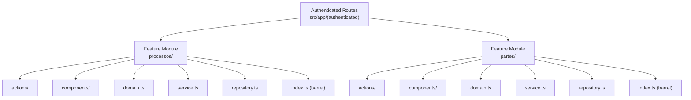
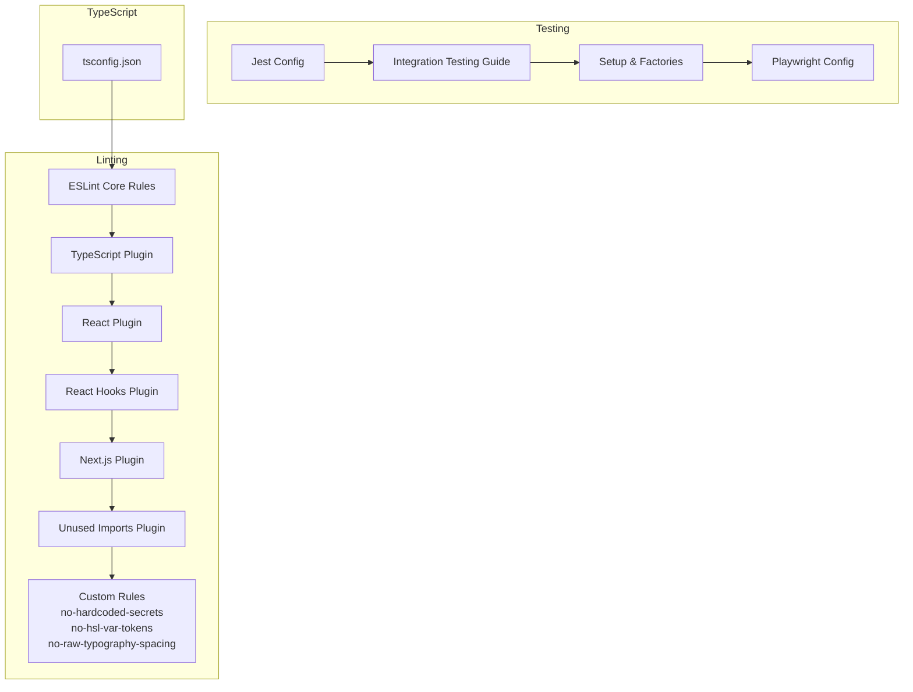
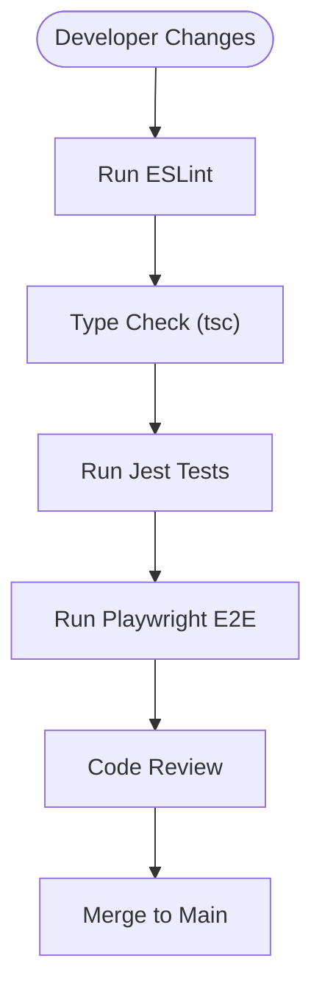
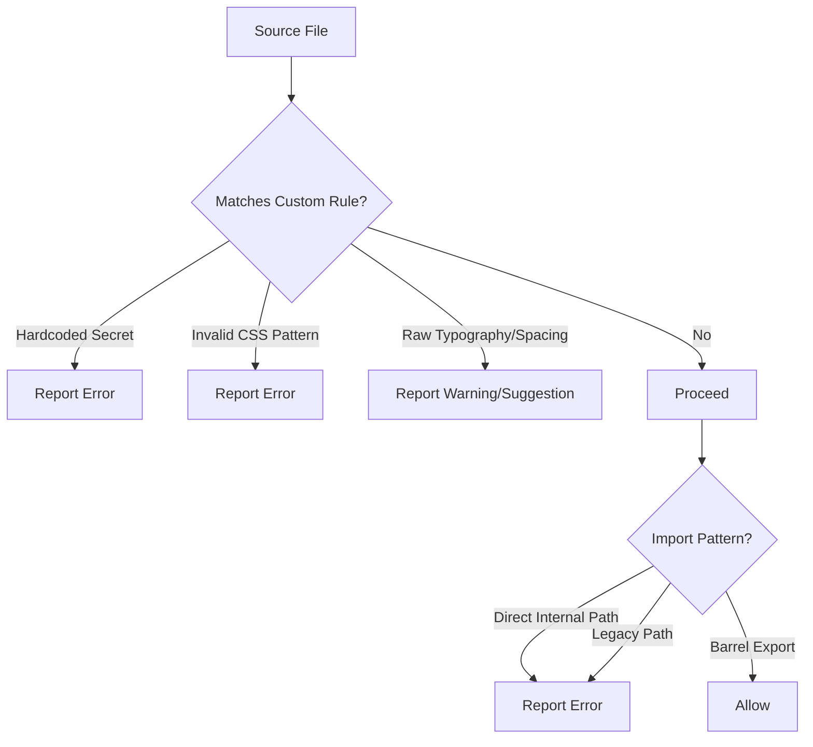
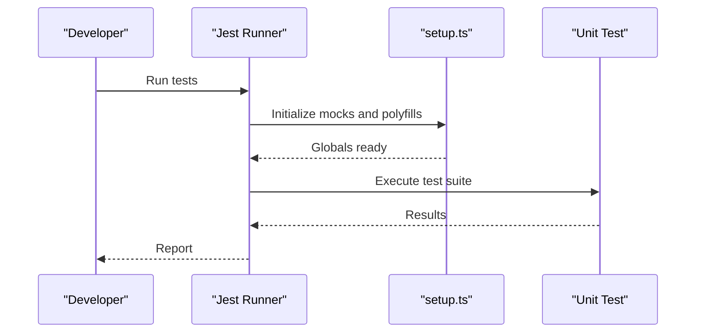
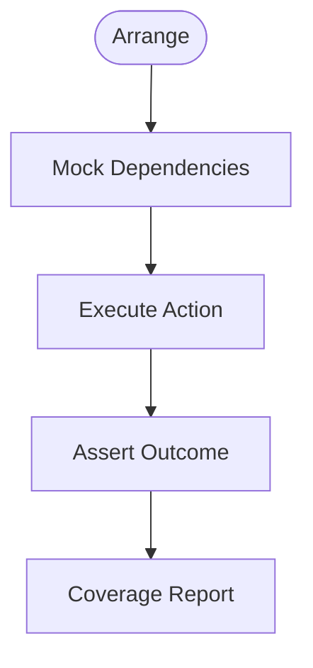
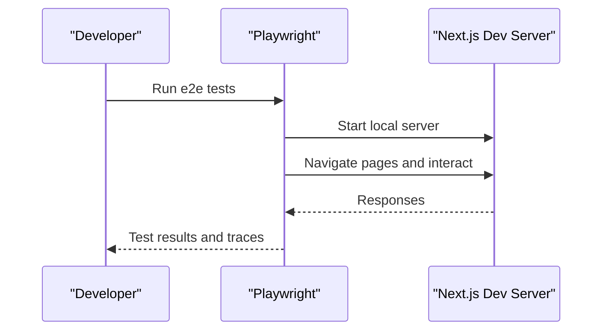
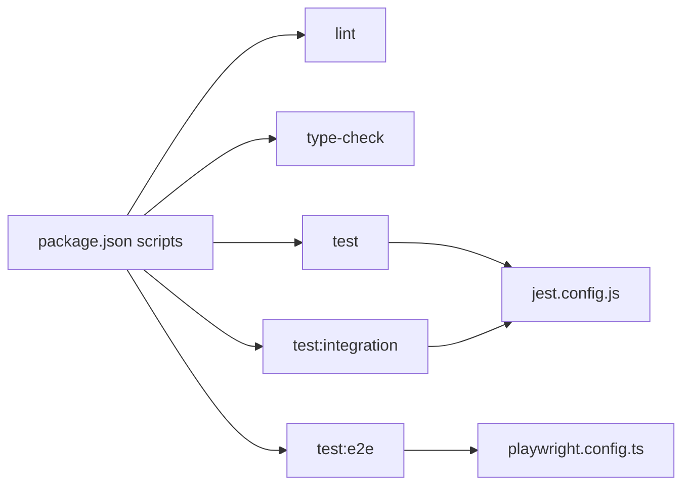

# Contributing Guidelines

<cite>
**Referenced Files in This Document**
- [package.json](file://package.json)
- [eslint.config.mjs](file://eslint.config.mjs)
- [jest.config.js](file://jest.config.js)
- [playwright.config.ts](file://playwright.config.ts)
- [tsconfig.json](file://tsconfig.json)
- [src/testing/INTEGRATION_TESTING_GUIDE.md](file://src/testing/INTEGRATION_TESTING_GUIDE.md)
- [src/testing/setup.ts](file://src/testing/setup.ts)
- [src/testing/mocks.ts](file://src/testing/mocks.ts)
- [src/testing/factories.ts](file://src/testing/factories.ts)
- [eslint-rules/no-hardcoded-secrets.js](file://eslint-rules/no-hardcoded-secrets.js)
- [eslint-rules/no-hsl-var-tokens.js](file://eslint-rules/no-hsl-var-tokens.js)
- [eslint-rules/no-raw-typography-spacing.js](file://eslint-rules/no-raw-typography-spacing.js)
- [README.md](file://README.md)
</cite>

## Table of Contents
1. [Introduction](#introduction)
2. [Project Structure](#project-structure)
3. [Core Components](#core-components)
4. [Architecture Overview](#architecture-overview)
5. [Detailed Component Analysis](#detailed-component-analysis)
6. [Dependency Analysis](#dependency-analysis)
7. [Performance Considerations](#performance-considerations)
8. [Troubleshooting Guide](#troubleshooting-guide)
9. [Conclusion](#conclusion)
10. [Appendices](#appendices)

## Introduction
This document defines the contribution workflow for the ZattarOS project. It covers code standards, pull request process, testing requirements, documentation standards, Feature-Sliced Design contribution patterns, TypeScript coding standards, and ESLint configuration. It also explains unit, integration, and end-to-end testing expectations, the PR workflow, code review process, merge requirements, and practical examples for feature development, testing, and documentation updates. Finally, it outlines the release process, versioning strategy, and community contribution guidelines.

## Project Structure
ZattarOS follows Feature-Sliced Design (FSD) colocated under authenticated routes. Modules are grouped by feature and include actions, components, domain logic, services, and repositories. Barrel exports enforce controlled access and prevent deep imports.

**Diagram sources**
- [README.md:43-69](file://README.md#L43-L69)

**Section sources**
- [README.md:43-69](file://README.md#L43-L69)

## Core Components
- Feature modules are colocated under authenticated routes and expose a barrel index for controlled imports.
- Strict import rules prevent deep imports from internal module folders; use barrel exports instead.
- TypeScript strictness and Next.js App Router are configured globally.

**Section sources**
- [README.md:43-69](file://README.md#L43-L69)
- [tsconfig.json:13-14](file://tsconfig.json#L13-L14)
- [tsconfig.json:38-64](file://tsconfig.json#L38-L64)

## Architecture Overview
The project enforces:
- Controlled imports via barrel exports
- Strict lint rules for design system governance
- Security-focused lint rules for secrets
- Comprehensive testing via Jest and Playwright

**Diagram sources**
- [eslint.config.mjs:12-47](file://eslint.config.mjs#L12-L47)
- [eslint.config.mjs:77-95](file://eslint.config.mjs#L77-L95)
- [eslint.config.mjs:116-186](file://eslint.config.mjs#L116-L186)
- [jest.config.js:12-118](file://jest.config.js#L12-L118)
- [src/testing/INTEGRATION_TESTING_GUIDE.md:1-530](file://src/testing/INTEGRATION_TESTING_GUIDE.md#L1-L530)
- [src/testing/setup.ts:1-358](file://src/testing/setup.ts#L1-L358)
- [playwright.config.ts:1-46](file://playwright.config.ts#L1-L46)
- [tsconfig.json:1-94](file://tsconfig.json#L1-L94)

## Detailed Component Analysis

### Code Standards and TypeScript Coding Standards
- Strict TypeScript compiler options are enabled, with no emit and bundler module resolution.
- Path aliases simplify imports and align with FSD.
- Jest environment is configured for both Node and JSDOM, with ESM transforms for specific packages.

**Diagram sources**
- [package.json:45-51](file://package.json#L45-L51)
- [tsconfig.json:13-14](file://tsconfig.json#L13-L14)
- [jest.config.js:12-118](file://jest.config.js#L12-L118)
- [playwright.config.ts:1-46](file://playwright.config.ts#L1-46)

**Section sources**
- [tsconfig.json:1-94](file://tsconfig.json#L1-L94)
- [jest.config.js:12-118](file://jest.config.js#L12-L118)
- [package.json:45-51](file://package.json#L45-L51)

### ESLint Configuration and Custom Rules
- Core ESLint plugins include TypeScript, React, React Hooks, Next.js, and unused-imports.
- Custom rules:
  - no-hardcoded-secrets: detects hardcoded secrets and API keys.
  - no-hsl-var-tokens: blocks invalid CSS patterns that mix HSL with OKLCH tokens.
  - no-raw-typography-spacing: encourages using Design System primitives for typography and spacing.
- Import restrictions:
  - Prohibit direct internal module imports; enforce barrel exports.
  - Restrict legacy paths in src/.
- Design System governance:
  - Enforce semantic tokens and Typography wrappers.
  - Restrict direct Badge imports in feature code.

**Diagram sources**
- [eslint.config.mjs:77-95](file://eslint.config.mjs#L77-L95)
- [eslint.config.mjs:116-186](file://eslint.config.mjs#L116-L186)
- [eslint.config.mjs:201-279](file://eslint.config.mjs#L201-L279)
- [eslint.config.mjs:280-323](file://eslint.config.mjs#L280-L323)
- [eslint-rules/no-hardcoded-secrets.js:14-41](file://eslint-rules/no-hardcoded-secrets.js#L14-L41)
- [eslint-rules/no-hsl-var-tokens.js:59-74](file://eslint-rules/no-hsl-var-tokens.js#L59-L74)
- [eslint-rules/no-raw-typography-spacing.js:29-94](file://eslint-rules/no-raw-typography-spacing.js#L29-L94)

**Section sources**
- [eslint.config.mjs:12-47](file://eslint.config.mjs#L12-L47)
- [eslint.config.mjs:77-95](file://eslint.config.mjs#L77-L95)
- [eslint.config.mjs:116-186](file://eslint.config.mjs#L116-L186)
- [eslint.config.mjs:201-279](file://eslint.config.mjs#L201-L279)
- [eslint.config.mjs:280-323](file://eslint.config.mjs#L280-L323)
- [eslint-rules/no-hardcoded-secrets.js:14-41](file://eslint-rules/no-hardcoded-secrets.js#L14-L41)
- [eslint-rules/no-hsl-var-tokens.js:59-74](file://eslint-rules/no-hsl-var-tokens.js#L59-L74)
- [eslint-rules/no-raw-typography-spacing.js:29-94](file://eslint-rules/no-raw-typography-spacing.js#L29-L94)

### Testing Requirements

#### Unit Tests
- Jest is configured with dual environments: Node and JSDOM.
- ESM packages requiring transformation are whitelisted.
- Environment polyfills and global mocks are centralized in setup.

**Diagram sources**
- [jest.config.js:12-118](file://jest.config.js#L12-L118)
- [src/testing/setup.ts:1-358](file://src/testing/setup.ts#L1-L358)

**Section sources**
- [jest.config.js:12-118](file://jest.config.js#L12-L118)
- [src/testing/setup.ts:1-358](file://src/testing/setup.ts#L1-L358)

#### Integration Tests
- Located under feature modules’ __tests__/integration.
- Naming convention: {feature}-flow.test.ts.
- Follow AAA pattern: Arrange, Act, Assert.
- Use factories and helpers for deterministic data and assertions.
- Coverage reporting supports HTML, text, and LCOV.

**Diagram sources**
- [src/testing/INTEGRATION_TESTING_GUIDE.md:38-55](file://src/testing/INTEGRATION_TESTING_GUIDE.md#L38-L55)
- [src/testing/INTEGRATION_TESTING_GUIDE.md:115-147](file://src/testing/INTEGRATION_TESTING_GUIDE.md#L115-L147)
- [src/testing/INTEGRATION_TESTING_GUIDE.md:315-355](file://src/testing/INTEGRATION_TESTING_GUIDE.md#L315-L355)

**Section sources**
- [src/testing/INTEGRATION_TESTING_GUIDE.md:1-530](file://src/testing/INTEGRATION_TESTING_GUIDE.md#L1-L530)
- [src/testing/factories.ts:1-17](file://src/testing/factories.ts#L1-L17)
- [src/testing/mocks.ts:1-77](file://src/testing/mocks.ts#L1-L77)

#### End-to-End Tests
- Playwright targets spec files under src/testing/e2e and src/**/__tests__/e2e.
- Parallel execution across Chromium, Firefox, Safari, and mobile devices.
- Web server launched on localhost:3000 during test runs.

**Diagram sources**
- [playwright.config.ts:1-46](file://playwright.config.ts#L1-L46)

**Section sources**
- [playwright.config.ts:1-46](file://playwright.config.ts#L1-L46)

### Pull Request Workflow, Code Review, and Merge Requirements
- Branch protection and CI checks are implied by the presence of lint and type-check scripts.
- Recommended PR checklist:
  - All lint checks pass.
  - TypeScript compiles without errors.
  - Unit tests pass.
  - Integration tests pass.
  - E2E tests pass (where applicable).
  - No hardcoded secrets.
  - No direct internal module imports.
  - Design System rules respected.
- Code review:
  - Ensure adherence to FSD and barrel exports.
  - Verify test coverage for critical flows.
  - Confirm accessibility and performance considerations.

**Section sources**
- [package.json:45-51](file://package.json#L45-L51)
- [eslint.config.mjs:116-186](file://eslint.config.mjs#L116-L186)
- [eslint.config.mjs:201-279](file://eslint.config.mjs#L201-L279)

### Practical Examples

#### Feature Development Example
- Create a new feature module under src/app/(authenticated)/{feature}/.
- Add barrel export index.ts and implement domain.ts, service.ts, repository.ts, actions/, and components/.
- Use barrel exports for controlled imports; avoid deep imports.

**Section sources**
- [README.md:43-69](file://README.md#L43-L69)

#### Testing Implementation Example
- Place integration tests under src/app/(authenticated)/{feature}/__tests__/integration/{feature}-flow.test.ts.
- Use factories and helpers for deterministic data.
- Follow AAA pattern and assert both success and error scenarios.

**Section sources**
- [src/testing/INTEGRATION_TESTING_GUIDE.md:19-37](file://src/testing/INTEGRATION_TESTING_GUIDE.md#L19-L37)
- [src/testing/INTEGRATION_TESTING_GUIDE.md:38-55](file://src/testing/INTEGRATION_TESTING_GUIDE.md#L38-L55)
- [src/testing/INTEGRATION_TESTING_GUIDE.md:115-147](file://src/testing/INTEGRATION_TESTING_GUIDE.md#L115-L147)
- [src/testing/factories.ts:1-17](file://src/testing/factories.ts#L1-L17)
- [src/testing/mocks.ts:1-77](file://src/testing/mocks.ts#L1-L77)

#### Documentation Updates Example
- Keep documentation concise and aligned with FSD.
- Reference AGENTS.md, ARCHITECTURE.md, and CLAUDE.md for agent-facing guidance.

**Section sources**
- [README.md:78-85](file://README.md#L78-L85)

## Dependency Analysis
- Script-driven quality gates:
  - lint, type-check, test, test:integration, test:e2e.
- Jest projects separate Node and JSDOM environments.
- Playwright runs against a local Next.js dev server.

**Diagram sources**
- [package.json:9-134](file://package.json#L9-L134)
- [jest.config.js:12-118](file://jest.config.js#L12-L118)
- [playwright.config.ts:1-46](file://playwright.config.ts#L1-L46)

**Section sources**
- [package.json:9-134](file://package.json#L9-L134)
- [jest.config.js:12-118](file://jest.config.js#L12-L118)
- [playwright.config.ts:1-46](file://playwright.config.ts#L1-L46)

## Performance Considerations
- Prefer barrel exports to reduce circular dependencies and improve tree-shaking.
- Use factories and deterministic mocks to keep tests fast and reliable.
- Limit E2E scope to critical user journeys; rely on unit and integration tests for most logic.

## Troubleshooting Guide
- Lint failures:
  - Hardcoded secrets: resolve by moving values to environment variables.
  - HSL with var tokens: switch to OKLCH tokens or var(--token) directly.
  - Raw typography/spacings: replace with Design System primitives.
  - Direct internal imports: import via barrel exports.
- Test failures:
  - Missing polyfills or mocks: ensure setup.ts is loaded.
  - ESM transform issues: whitelist packages in transformIgnorePatterns.
  - Supabase mocks: use createMockSupabaseClient helper.
- Type errors:
  - Enable strict mode and resolve type mismatches.
- E2E flakiness:
  - Increase timeouts or adjust device targets in playwright.config.ts.

**Section sources**
- [eslint.config.mjs:77-95](file://eslint.config.mjs#L77-L95)
- [eslint.config.mjs:116-186](file://eslint.config.mjs#L116-L186)
- [eslint-rules/no-hardcoded-secrets.js:14-41](file://eslint-rules/no-hardcoded-secrets.js#L14-L41)
- [eslint-rules/no-hsl-var-tokens.js:59-74](file://eslint-rules/no-hsl-var-tokens.js#L59-L74)
- [eslint-rules/no-raw-typography-spacing.js:29-94](file://eslint-rules/no-raw-typography-spacing.js#L29-L94)
- [src/testing/setup.ts:1-358](file://src/testing/setup.ts#L1-L358)
- [src/testing/mocks.ts:12-76](file://src/testing/mocks.ts#L12-L76)
- [jest.config.js:19-23](file://jest.config.js#L19-L23)
- [jest.config.js:105-113](file://jest.config.js#L105-L113)
- [playwright.config.ts:9-22](file://playwright.config.ts#L9-L22)

## Conclusion
By adhering to Feature-Sliced Design, TypeScript strictness, and the ESLint rules, contributors can maintain a consistent, secure, and scalable codebase. Comprehensive testing with Jest and Playwright ensures reliability across unit, integration, and end-to-end scenarios. Following the PR workflow and merge requirements guarantees high-quality contributions.

## Appendices

### Release Process and Versioning Strategy
- Versioning:
  - Semantic versioning is implied by the current version field.
- Release steps:
  - Ensure lint, type-check, unit, integration, and E2E tests pass.
  - Update changelog entries and increment version in package.json.
  - Tag and publish releases as appropriate for the deployment platform.

**Section sources**
- [package.json:3](file://package.json#L3)

### Community Contribution Guidelines
- Use feature branches and open PRs for review.
- Keep PRs focused and small.
- Include tests and documentation updates with feature changes.
- Respect FSD and barrel exports.
- Avoid hardcoded secrets and follow Design System rules.