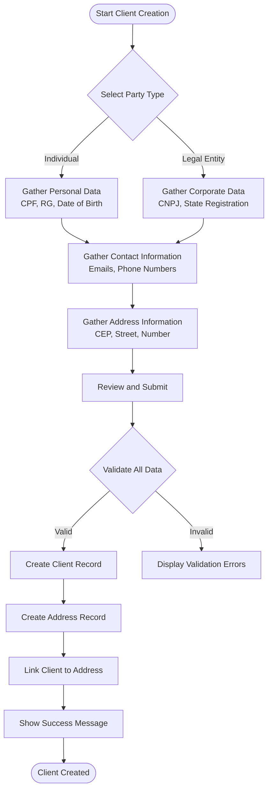
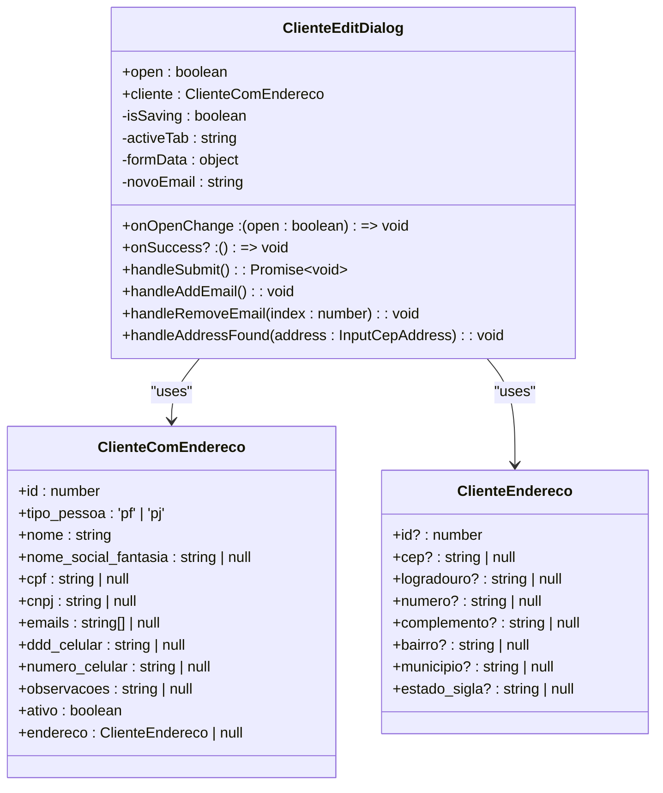
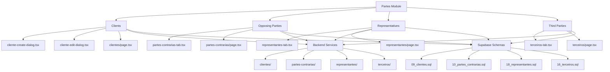
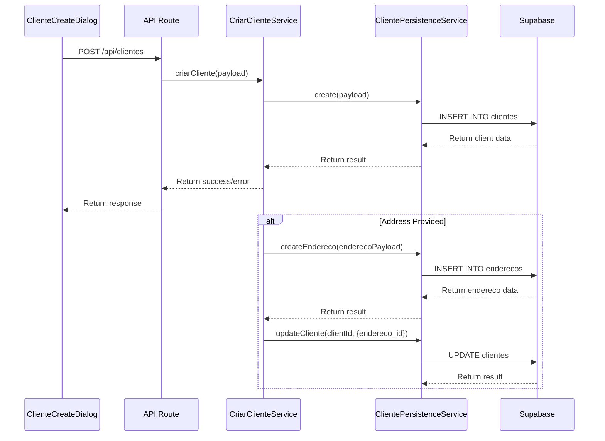

# Client Management Module

<cite>
**Referenced Files in This Document**   
- [cliente-create-dialog.tsx](file://app/(dashboard)/partes/components/cliente-create-dialog.tsx)
- [cliente-edit-dialog.tsx](file://app/(dashboard)/partes/components/cliente-edit-dialog.tsx)
- [page.tsx](file://app/(dashboard)/partes/page.tsx)
- [clientes/page.tsx](file://app/(dashboard)/partes/clientes/page.tsx)
- [partes-contrarias/page.tsx](file://app/(dashboard)/partes/partes-contrarias/page.tsx)
- [representantes/page.tsx](file://app/(dashboard)/partes/representantes/page.tsx)
- [terceiros/page.tsx](file://app/(dashboard)/partes/terceiros/page.tsx)
- [criar-cliente.service.ts](file://backend/clientes/services/clientes/criar-cliente.service.ts)
- [atualizar-cliente.service.ts](file://backend/clientes/services/clientes/atualizar-cliente.service.ts)
- [cliente-persistence.service.ts](file://backend/clientes/services/persistence/cliente-persistence.service.ts)
- [criar-parte-contraria.service.ts](file://backend/partes-contrarias/services/partes-contrarias/criar-parte-contraria.service.ts)
- [atualizar-parte-contraria.service.ts](file://backend/partes-contrarias/services/partes-contrarias/atualizar-parte-contraria.service.ts)
- [parte-contraria-persistence.service.ts](file://backend/partes-contrarias/services/persistence/parte-contraria-persistence.service.ts)
- [representantes-persistence.service.ts](file://backend/representantes/services/representantes-persistence.service.ts)
- [terceiro-persistence.service.ts](file://backend/terceiros/services/persistence/terceiro-persistence.service.ts)
- [09_clientes.sql](file://supabase/schemas/09_clientes.sql)
- [10_partes_contrarias.sql](file://supabase/schemas/10_partes_contrarias.sql)
- [18_representantes.sql](file://supabase/schemas/18_representantes.sql)
- [16_terceiros.sql](file://supabase/schemas/16_terceiros.sql)
- [enderecos.sql](file://supabase/schemas/15_enderecos.sql)
- [17_processo_partes.sql](file://supabase/schemas/17_processo_partes.sql)
</cite>

## Table of Contents
1. [Introduction](#introduction)
2. [Client Registration Implementation](#client-registration-implementation)
3. [Client Management Interface](#client-management-interface)
4. [Party Type Architecture](#party-type-architecture)
5. [Backend Services](#backend-services)
6. [Supabase Schemas](#supabase-schemas)
7. [Unified Partes Interface](#unified-partes-interface)
8. [Deduplication Logic](#deduplication-logic)
9. [Conclusion](#conclusion)

## Introduction
The Client Management Module in the Sinesys application provides a comprehensive system for managing different party types including clients, opposing parties (partes contrárias), representatives, and third parties. This module implements a unified approach to party management while maintaining specific requirements for each party type. The system features a multi-step wizard for client creation, tab-based editing interface, and robust backend services for data persistence. The architecture is designed to handle the complexities of legal party management while ensuring data integrity through proper deduplication mechanisms.

**Section sources**
- [page.tsx](file://app/(dashboard)/partes/page.tsx)

## Client Registration Implementation

The client registration process is implemented through the `cliente-create-dialog.tsx` component, which features a multi-step wizard interface. The registration process consists of five sequential steps that guide users through the complete client creation workflow.

The first step requires selecting the party type (individual or legal entity), which determines the subsequent fields displayed. For individuals (PF), the system collects CPF, RG, date of birth, gender, and marital status. For legal entities (PJ), it collects CNPJ, state registration, and date of incorporation. The form includes client-side validation for CPF and CNPJ numbers using standard Brazilian validation algorithms.

Contact information collection includes multiple email addresses (with add/remove functionality) and three types of phone numbers (mobile, residential, and commercial). The address section integrates with a CEP (postal code) lookup service that automatically populates city, state, and neighborhood information when a valid postal code is entered.

The implementation uses React state management to maintain form data across steps and provides visual feedback through step indicators. Error handling is implemented with toast notifications that display validation errors when users attempt to proceed to the next step with invalid or missing information.

The submission process follows a two-phase approach: first creating the client record, then creating the associated address record, and finally linking them together. This ensures data consistency even if address creation fails.

**Diagram sources**
- [cliente-create-dialog.tsx](file://app/(dashboard)/partes/components/cliente-create-dialog.tsx)

**Section sources**
- [cliente-create-dialog.tsx](file://app/(dashboard)/partes/components/cliente-create-dialog.tsx)

## Client Management Interface

The client management interface is implemented through the `cliente-edit-dialog.tsx` component, which provides a tab-based editing experience for existing clients. The interface is organized into three main tabs: Identification, Contact, and Address, allowing users to focus on specific aspects of client information.

The Identification tab displays read-only document numbers (CPF/CNPJ) while allowing editing of other personal or corporate information. For individuals, this includes fields like RG, date of birth, gender, and marital status. For legal entities, it includes state registration and date of incorporation. A status toggle allows administrators to mark clients as active or inactive.

The Contact tab manages communication information, supporting multiple email addresses with add and remove functionality. Three phone number fields (mobile, residential, and commercial) are provided, each with proper formatting for Brazilian phone numbers (separate DDD and number fields). The Observations field allows free-text notes about the client.

The Address tab provides a complete address management interface with CEP lookup functionality. When a valid postal code is entered, the system automatically populates the city, state, and neighborhood fields, reducing data entry errors. Users can still manually override these values if needed.

The interface implements responsive design principles, with tab labels condensing to icons on smaller screens. Form submission is protected with loading states and error handling, ensuring users receive feedback on the success or failure of their updates.

**Diagram sources**
- [cliente-edit-dialog.tsx](file://app/(dashboard)/partes/components/cliente-edit-dialog.tsx)

**Section sources**
- [cliente-edit-dialog.tsx](file://app/(dashboard)/partes/components/cliente-edit-dialog.tsx)

## Party Type Architecture

The Sinesys application implements a comprehensive architecture for managing four distinct party types: clients, opposing parties (partes contrárias), representatives, and third parties. Each party type has its own dedicated pages and backend services while sharing common data structures and management principles.

The application routes are organized under the `/partes` path, with each party type having its own subdirectory: `/clientes`, `/partes-contrarias`, `/representantes`, and `/terceiros`. The root `/partes` page redirects to the clients page, establishing clients as the primary party type.

Clients and opposing parties share nearly identical data models, both containing comprehensive personal and corporate information, contact details, and address references. The key difference is their role in legal proceedings, with clients being the law firm's customers and opposing parties being the adversaries in cases.

Representatives have a specialized data model focused on legal professionals, with the CPF as the primary unique identifier and support for multiple OAB (Brazilian Bar Association) registrations stored as JSONB arrays. This design accommodates lawyers who are registered in multiple states.

Third parties represent various auxiliary roles in legal processes, such as experts, public prosecutors, and assistants. Their data model includes fields for party type classification and procedural pole (active, passive, others), allowing for precise categorization within legal contexts.

All party types follow the same UI pattern: a tabbed interface for editing and a list view for browsing, ensuring consistency across the application.

**Diagram sources**
- [clientes/page.tsx](file://app/(dashboard)/partes/clientes/page.tsx)
- [partes-contrarias/page.tsx](file://app/(dashboard)/partes/partes-contrarias/page.tsx)
- [representantes/page.tsx](file://app/(dashboard)/partes/representantes/page.tsx)
- [terceiros/page.tsx](file://app/(dashboard)/partes/terceiros/page.tsx)

**Section sources**
- [clientes/page.tsx](file://app/(dashboard)/partes/clientes/page.tsx)
- [partes-contrarias/page.tsx](file://app/(dashboard)/partes/partes-contrarias/page.tsx)
- [representantes/page.tsx](file://app/(dashboard)/partes/representantes/page.tsx)
- [terceiros/page.tsx](file://app/(dashboard)/partes/terceiros/page.tsx)

## Backend Services

The backend services for party management are organized in the `backend` directory with dedicated service modules for each party type. Each service follows a consistent pattern of business logic services and persistence services.

The client management services include `criar-cliente.service.ts` and `atualizar-cliente.service.ts` for business logic, and `cliente-persistence.service.ts` for database operations. These services handle the complete client lifecycle, including validation, creation, and updating.

Similarly, opposing parties have their own set of services: `criar-parte-contraria.service.ts`, `atualizar-parte-contraria.service.ts`, and `parte-contraria-persistence.service.ts`. The service architecture mirrors that of clients, reflecting their similar data models and management requirements.

Representatives and third parties have more specialized services. The representatives service focuses on OAB registration management and CPF-based identification, while the third parties service handles the various party types and procedural poles.

All services implement proper error handling and validation, with business logic separated from data persistence. The persistence services interact directly with the Supabase database, while the business logic services handle application-specific rules and workflows.

The services are accessed through API routes in the `api` directory, which provide the interface between the frontend components and backend logic.

**Diagram sources**
- [criar-cliente.service.ts](file://backend/clientes/services/clientes/criar-cliente.service.ts)
- [cliente-persistence.service.ts](file://backend/clientes/services/persistence/cliente-persistence.service.ts)

**Section sources**
- [criar-cliente.service.ts](file://backend/clientes/services/clientes/criar-cliente.service.ts)
- [atualizar-cliente.service.ts](file://backend/clientes/services/clientes/atualizar-cliente.service.ts)
- [cliente-persistence.service.ts](file://backend/clientes/services/persistence/cliente-persistence.service.ts)
- [criar-parte-contraria.service.ts](file://backend/partes-contrarias/services/partes-contrarias/criar-parte-contraria.service.ts)
- [atualizar-parte-contraria.service.ts](file://backend/partes-contrarias/services/partes-contrarias/atualizar-parte-contraria.service.ts)
- [parte-contraria-persistence.service.ts](file://backend/partes-contrarias/services/persistence/parte-contraria-persistence.service.ts)
- [representantes-persistence.service.ts](file://backend/representantes/services/representantes-persistence.service.ts)
- [terceiro-persistence.service.ts](file://backend/terceiros/services/persistence/terceiro-persistence.service.ts)

## Supabase Schemas

The Supabase database schema implements a robust data model for party management with separate tables for each party type while maintaining consistent design patterns. The schema includes proper constraints, indexes, and row-level security policies.

The `clientes` table (defined in `09_clientes.sql`) contains comprehensive information for clients, with fields for both individual and corporate clients. Key features include:
- Unique constraints on CPF and CNPJ fields
- Foreign key reference to the `enderecos` table
- JSONB fields for flexible data storage (emails)
- Row-level security with policies for service_role and authenticated users
- Automatic timestamp updates via triggers

The `partes_contrarias` table (defined in `10_partes_contrarias.sql`) is nearly identical to the clients table, reflecting their similar data requirements. This design allows for consistent management of both party types while maintaining their distinct roles in the application.

The `representantes` table (defined in `18_representantes.sql`) has a specialized design focused on legal professionals:
- CPF as the primary unique identifier
- JSONB array for multiple OAB registrations
- GIN index on the OABs field for efficient querying
- Simplified data model compared to clients and opposing parties

The `terceiros` table (defined in `16_terceiros.sql`) accommodates various third-party roles in legal processes:
- Type classification (expert, public prosecutor, assistant, etc.)
- Procedural pole information
- Support for both individual and corporate third parties
- Unique constraints on CPF and CNPJ fields

All party tables reference the `enderecos` table for address information, implementing a normalized design that prevents data duplication. The `processo_partes` table establishes the relationship between parties and legal processes, allowing parties to be associated with multiple cases.

```mermaid
erDiagram
CLIENTES {
bigint id PK
tipo_pessoa tipo_pessoa NOT NULL
text nome NOT NULL
text nome_social_fantasia
text cpf UK
text cnpj UK
text rg
date data_nascimento
genero_usuario genero
estado_civil estado_civil
text nacionalidade
text inscricao_estadual
text tipo_documento
jsonb emails
text status_pje
text situacao_pje
text login_pje
boolean autoridade
text ddd_celular
text numero_celular
text ddd_residencial
text numero_residencial
text ddd_comercial
text numero_comercial
text sexo
text nome_genitora
integer naturalidade_id_pje
text naturalidade_municipio
integer naturalidade_estado_id_pje
text naturalidade_estado_sigla
integer uf_nascimento_id_pje
text uf_nascimento_sigla
text uf_nascimento_descricao
integer pais_nascimento_id_pje
text pais_nascimento_codigo
text pais_nascimento_descricao
integer escolaridade_codigo
integer situacao_cpf_receita_id
text situacao_cpf_receita_descricao
boolean pode_usar_celular_mensagem
date data_abertura
date data_fim_atividade
boolean orgao_publico
text tipo_pessoa_codigo_pje
text tipo_pessoa_label_pje
text tipo_pessoa_validacao_receita
text ds_tipo_pessoa
integer situacao_cnpj_receita_id
text situacao_cnpj_receita_descricao
text ramo_atividade
text cpf_responsavel
boolean oficial
text ds_prazo_expediente_automatico
integer porte_codigo
text porte_descricao
timestamptz ultima_atualizacao_pje
bigint endereco_id FK
text observacoes
bigint created_by FK
jsonb dados_anteriores
boolean ativo NOT NULL
timestamptz created_at NOT NULL
timestamptz updated_at NOT NULL
}
PARTES_CONTRARIAS {
bigint id PK
tipo_pessoa tipo_pessoa NOT NULL
text nome NOT NULL
text nome_social_fantasia
text cpf UK
text cnpj UK
text rg
date data_nascimento
genero_usuario genero
estado_civil estado_civil
text nacionalidade
text inscricao_estadual
text tipo_documento
jsonb emails
text status_pje
text situacao_pje
text login_pje
boolean autoridade
text ddd_celular
text numero_celular
text ddd_residencial
text numero_residencial
text ddd_comercial
text numero_comercial
text sexo
text nome_genitora
integer naturalidade_id_pje
text naturalidade_municipio
integer naturalidade_estado_id_pje
text naturalidade_estado_sigla
integer uf_nascimento_id_pje
text uf_nascimento_sigla
text uf_nascimento_descricao
integer pais_nascimento_id_pje
text pais_nascimento_codigo
text pais_nascimento_descricao
integer escolaridade_codigo
integer situacao_cpf_receita_id
text situacao_cpf_receita_descricao
boolean pode_usar_celular_mensagem
date data_abertura
date data_fim_atividade
boolean orgao_publico
text tipo_pessoa_codigo_pje
text tipo_pessoa_label_pje
text tipo_pessoa_validacao_receita
text ds_tipo_pessoa
integer situacao_cnpj_receita_id
text situacao_cnpj_receita_descricao
text ramo_atividade
text cpf_responsavel
boolean oficial
text ds_prazo_expediente_automatico
integer porte_codigo
text porte_descricao
timestamptz ultima_atualizacao_pje
bigint endereco_id FK
text observacoes
bigint created_by FK
jsonb dados_anteriores
boolean ativo NOT NULL
timestamptz created_at NOT NULL
timestamptz updated_at NOT NULL
}
REPRESENTANTES {
bigint id PK
text cpf NOT NULL UK
text nome NOT NULL
text sexo
text tipo
jsonb oabs
jsonb emails
text email
text ddd_celular
text numero_celular
text ddd_residencial
text numero_residencial
text ddd_comercial
text numero_comercial
bigint endereco_id FK
jsonb dados_anteriores
timestamptz created_at
timestamptz updated_at
}
TERCEIROS {
bigint id PK
bigint id_tipo_parte
text tipo_parte NOT NULL
text polo NOT NULL
tipo_pessoa tipo_pessoa NOT NULL
text nome NOT NULL
text nome_fantasia
text cpf UK
text cnpj UK
text tipo_documento
boolean principal
boolean autoridade
boolean endereco_desconhecido
text status_pje
text situacao_pje
text login_pje
integer ordem
jsonb emails
text ddd_celular
text numero_celular
text ddd_residencial
text numero_residencial
text ddd_comercial
text numero_comercial
text sexo
text rg
date data_nascimento
genero_usuario genero
estado_civil estado_civil
text nome_genitora
text nacionalidade
integer uf_nascimento_id_pje
text uf_nascimento_sigla
text uf_nascimento_descricao
integer naturalidade_id_pje
text naturalidade_municipio
integer naturalidade_estado_id_pje
text naturalidade_estado_sigla
integer pais_nascimento_id_pje
text pais_nascimento_codigo
text pais_nascimento_descricao
integer escolaridade_codigo
integer situacao_cpf_receita_id
text situacao_cpf_receita_descricao
boolean pode_usar_celular_mensagem
date data_abertura
date data_fim_atividade
boolean orgao_publico
text tipo_pessoa_codigo_pje
text tipo_pessoa_label_pje
text tipo_pessoa_validacao_receita
text ds_tipo_pessoa
integer situacao_cnpj_receita_id
text situacao_cnpj_receita_descricao
text ramo_atividade
text cpf_responsavel
boolean oficial
text ds_prazo_expediente_automatico
integer porte_codigo
text porte_descricao
text inscricao_estadual
text observacoes
bigint endereco_id FK
boolean ativo
timestamptz created_at
timestamptz updated_at
}
ENDERECOS {
bigint id PK
entidade_tipo entidade_tipo NOT NULL
bigint entidade_id NOT NULL
text cep
text logradouro
text numero
text complemento
text bairro
text municipio
text estado_sigla
timestamptz created_at NOT NULL
timestamptz updated_at NOT NULL
}
PROCESSO_PARTES {
bigint id PK
bigint processo_id FK
bigint parte_id FK
text parte_tipo NOT NULL
text polo NOT NULL
boolean principal
timestamptz created_at NOT NULL
timestamptz updated_at NOT NULL
}
CLIENTES ||--o{ ENDERECOS : "has address"
PARTES_CONTRARIAS ||--o{ ENDERECOS : "has address"
REPRESENTANTES ||--o{ ENDERECOS : "has address"
TERCEIROS ||--o{ ENDERECOS : "has address"
CLIENTES ||--o{ PROCESSO_PARTES : "participates in"
PARTES_CONTRARIAS ||--o{ PROCESSO_PARTES : "participates in"
REPRESENTANTES ||--o{ PROCESSO_PARTES : "participates in"
TERCEIROS ||--o{ PROCESSO_PARTES : "participates in"
```

**Diagram sources**
- [09_clientes.sql](file://supabase/schemas/09_clientes.sql)
- [10_partes_contrarias.sql](file://supabase/schemas/10_partes_contrarias.sql)
- [18_representantes.sql](file://supabase/schemas/18_representantes.sql)
- [16_terceiros.sql](file://supabase/schemas/16_terceiros.sql)
- [15_enderecos.sql](file://supabase/schemas/15_enderecos.sql)
- [17_processo_partes.sql](file://supabase/schemas/17_processo_partes.sql)

**Section sources**
- [09_clientes.sql](file://supabase/schemas/09_clientes.sql)
- [10_partes_contrarias.sql](file://supabase/schemas/10_partes_contrarias.sql)
- [18_representantes.sql](file://supabase/schemas/18_representantes.sql)
- [16_terceiros.sql](file://supabase/schemas/16_terceiros.sql)

## Unified Partes Interface

The unified partes interface in Sinesys provides a consistent user experience across all party types while accommodating their specific requirements. The interface is accessible through the main navigation and organizes party management into distinct sections.

The interface implements a tabbed navigation system that allows users to switch between different party types: Clients, Opposing Parties, Representatives, and Third Parties. Each tab displays a list of parties with search and filtering capabilities, enabling users to quickly find specific records.

For client management, the interface provides both creation and editing functionality through dedicated dialogs. The creation dialog uses a multi-step wizard approach, guiding users through the complete data entry process. The editing dialog uses a tabbed interface to organize information into logical groups: Identification, Contact, and Address.

The unified design principles include:
- Consistent use of UI components across all party types
- Standardized data entry patterns and validation
- Uniform error handling and feedback mechanisms
- Shared address management functionality
- Common filtering and search capabilities

Despite the unified interface, each party type maintains its specialized characteristics. For example, the representatives section includes OAB registration management, while the third parties section includes classification by party type and procedural pole.

The interface also provides consistent access to related information, such as cases associated with each party, ensuring that users can easily navigate between parties and their legal contexts.

**Section sources**
- [page.tsx](file://app/(dashboard)/partes/page.tsx)
- [clientes/page.tsx](file://app/(dashboard)/partes/clientes/page.tsx)
- [partes-contrarias/page.tsx](file://app/(dashboard)/partes/partes-contrarias/page.tsx)
- [representantes/page.tsx](file://app/(dashboard)/partes/representantes/page.tsx)
- [terceiros/page.tsx](file://app/(dashboard)/partes/terceiros/page.tsx)

## Deduplication Logic

The deduplication logic in the Sinesys application is implemented at both the database and service levels to prevent duplicate party entries. The primary mechanism is the use of unique constraints on identification documents (CPF and CNPJ) in the database schema.

For clients and opposing parties, the `clientes` and `partes_contrarias` tables have unique constraints on the CPF and CNPJ fields. This ensures that no two records can have the same CPF or CNPJ, preventing exact duplicates. The database-level constraints provide a reliable foundation for data integrity.

The backend services implement additional deduplication checks before creating new records. When a user attempts to create a new client or opposing party, the service first queries the database to check if a record with the same CPF (for individuals) or CNPJ (for legal entities) already exists. If a match is found, the system prevents the creation of a duplicate record and informs the user.

For representatives, the deduplication is based on the CPF field, which has a unique constraint in the `representantes` table. This ensures that each representative is uniquely identified by their CPF, preventing duplicate entries for the same legal professional.

The third parties table also implements deduplication through unique constraints on CPF and CNPJ fields, applied conditionally when these fields are not null. This allows the system to prevent duplicates while accommodating third parties that may not have these identification documents.

The deduplication logic is complemented by search functionality that helps users find existing parties before creating new ones. The search interface allows users to search by name, CPF/CNPJ, or other identifying information, reducing the likelihood of accidental duplicates.

In cases where duplicate entries do occur (for example, through data import or system errors), the application provides manual merging capabilities through administrative interfaces, allowing staff to consolidate duplicate records while preserving all relevant information.

**Section sources**
- [09_clientes.sql](file://supabase/schemas/09_clientes.sql)
- [10_partes_contrarias.sql](file://supabase/schemas/10_partes_contrarias.sql)
- [18_representantes.sql](file://supabase/schemas/18_representantes.sql)
- [16_terceiros.sql](file://supabase/schemas/16_terceiros.sql)
- [criar-cliente.service.ts](file://backend/clientes/services/clientes/criar-cliente.service.ts)
- [criar-parte-contraria.service.ts](file://backend/partes-contrarias/services/partes-contrarias/criar-parte-contraria.service.ts)

## Conclusion
The Client Management Module in Sinesys provides a comprehensive and well-structured system for managing various party types in a legal context. The architecture effectively balances the need for specialized data models for different party types with the benefits of a unified interface and consistent management patterns.

Key strengths of the implementation include the multi-step client creation wizard, tab-based editing interface, and robust deduplication mechanisms. The separation of concerns between frontend components, backend services, and database schema promotes maintainability and scalability.

The system's design accommodates the complexities of legal party management, from basic client information to specialized requirements for representatives and third parties. The use of Supabase features like JSONB fields, row-level security, and triggers enhances both functionality and data integrity.

Future enhancements could include more advanced duplicate detection algorithms that identify potential duplicates based on name similarity or other factors, even when identification documents differ. Additionally, expanding the integration with external systems like the PJE (Processo Judicial Eletrônico) could further automate data collection and validation.

Overall, the Client Management Module represents a sophisticated solution for legal practice management, demonstrating careful consideration of both user experience and data integrity requirements.