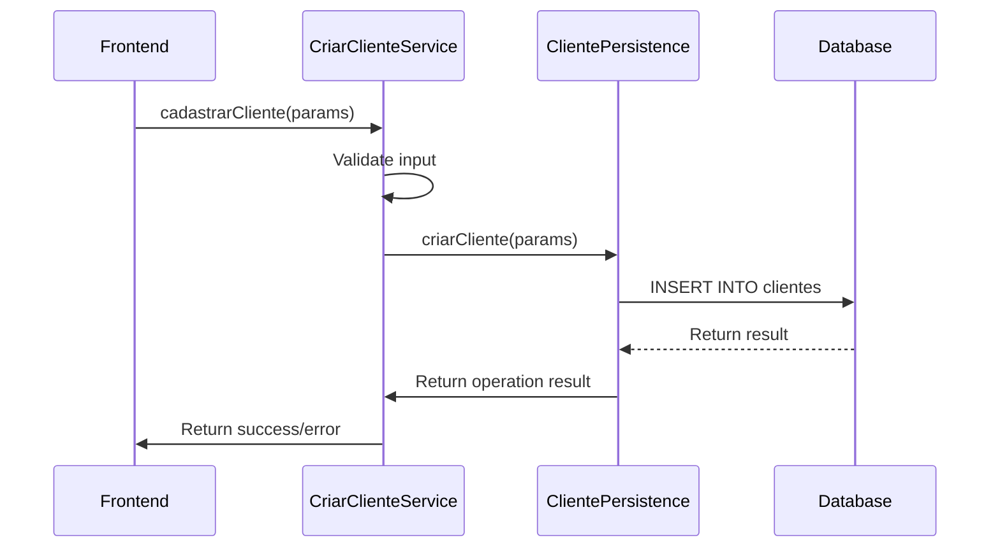
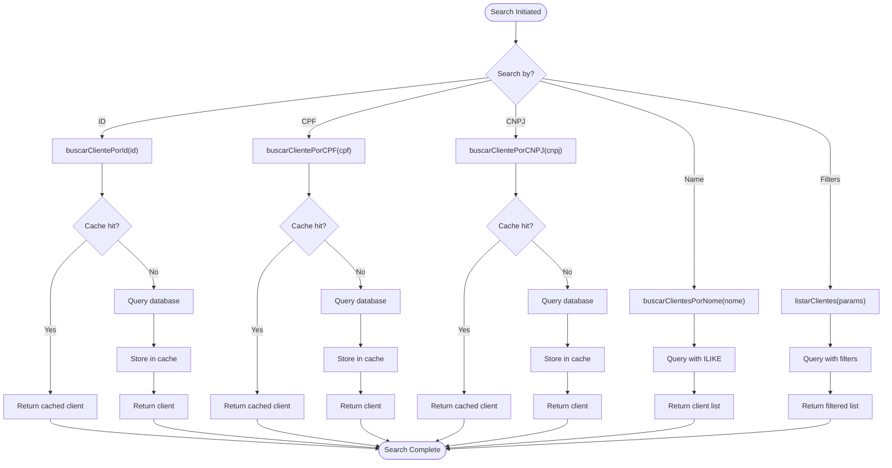

# Clients

<cite>
**Referenced Files in This Document**   
- [cliente-create-dialog.tsx](file://app/(dashboard)/partes/components/cliente-create-dialog.tsx)
- [cliente-edit-dialog.tsx](file://app/(dashboard)/partes/components/cliente-edit-dialog.tsx)
- [atualizar-cliente.service.ts](file://backend/clientes/services/clientes/atualizar-cliente.service.ts)
- [buscar-cliente.service.ts](file://backend/clientes/services/clientes/buscar-cliente.service.ts)
- [criar-cliente.service.ts](file://backend/clientes/services/clientes/criar-cliente.service.ts)
- [cliente-persistence.service.ts](file://backend/clientes/services/persistence/cliente-persistence.service.ts)
- [09_clientes.sql](file://supabase/schemas/09_clientes.sql)
</cite>

## Table of Contents
1. [Introduction](#introduction)
2. [Client Registration](#client-registration)
3. [Client Management](#client-management)
4. [Backend Services](#backend-services)
5. [Data Model](#data-model)
6. [Search Functionality](#search-functionality)
7. [Deduplication Logic](#deduplication-logic)
8. [Conclusion](#conclusion)

## Introduction
The Clients feature in the Sinesys application provides a comprehensive system for managing client information within a legal practice environment. This documentation details the implementation of client registration and management, covering both frontend components and backend services. The system supports two types of clients: individuals (Pessoa Física) and legal entities (Pessoa Jurídica), with distinct data models for each type. The implementation includes robust validation, search capabilities, and deduplication logic to ensure data integrity across the application.

**Section sources**
- [cliente-create-dialog.tsx](file://app/(dashboard)/partes/components/cliente-create-dialog.tsx)
- [09_clientes.sql](file://supabase/schemas/09_clientes.sql)

## Client Registration
The client registration process is implemented through the `cliente-create-dialog.tsx` component, which features a multi-step wizard interface for collecting client information. The registration flow consists of five sequential steps: Type of Person, Identification, Contact, Address, and Additional Information. This structured approach guides users through the complete client creation process while ensuring data completeness and accuracy.

The first step requires users to select between individual (PF) and legal entity (PJ) as the client type, which determines the subsequent fields displayed. For individuals, the system collects personal information including full name, CPF (individual taxpayer registry), RG (identity document), date of birth, gender, marital status, nationality, and mother's name. For legal entities, the system collects corporate information including corporate name, CNPJ (corporate taxpayer registry), state registration, and date of incorporation.

Contact information collection includes email addresses, mobile phone, residential phone, and commercial phone numbers. The interface allows multiple email addresses to be added through an interactive system where users can input an email and click an add button or press enter to include it in the list. Address information is collected through a dedicated step that includes CEP (postal code), street, number, complement, neighborhood, city, and state fields. The system integrates with a CEP lookup service to automatically populate address fields when a valid postal code is entered.

**Section sources**
- [cliente-create-dialog.tsx](file://app/(dashboard)/partes/components/cliente-create-dialog.tsx)

## Client Management
Client management is handled through the `cliente-edit-dialog.tsx` component, which provides a tabbed interface for editing existing client records. The interface is organized into three main tabs: Identification, Contact, and Address, allowing users to focus on specific aspects of client information without overwhelming them with too many fields at once.

The Identification tab displays core client information and allows editing of most fields except for the CPF or CNPJ, which are immutable once set. This restriction prevents data integrity issues that could arise from changing these unique identifiers. The Contact tab manages communication details including email addresses, phone numbers, and additional notes. The Address tab handles location information with the same CEP lookup functionality as the registration process.

The edit dialog implements a responsive design that works well on both desktop and mobile devices. On desktop, the tabs are fully labeled, while on mobile devices they use abbreviated labels to conserve space. The interface includes proper validation and error handling, with visual feedback for required fields and format validation. When saving changes, the system sends updated data to the backend service, which handles the database update and cache invalidation.

**Section sources**
- [cliente-edit-dialog.tsx](file://app/(dashboard)/partes/components/cliente-edit-dialog.tsx)

## Backend Services
The backend services for client management are implemented in the `backend/clientes/services` directory, with separate modules for different operations. The service layer follows a clean architecture pattern, separating business logic from data persistence concerns.

The `criar-cliente.service.ts` file implements the client creation service, which orchestrates the process of registering new clients. This service validates input data, checks for duplicates, and creates new records in the database. The `atualizar-cliente.service.ts` file handles client updates, verifying that the client exists, validating changes, and applying updates to the database. The `buscar-cliente.service.ts` file provides search functionality, allowing clients to be retrieved by ID, CPF, or CNPJ.

These services interact with the persistence layer through well-defined interfaces, promoting loose coupling and testability. Each service includes comprehensive logging to aid in debugging and monitoring. Error handling is implemented consistently across all services, with specific error messages returned to the frontend to provide meaningful feedback to users. The services also handle cache invalidation when data is modified, ensuring that subsequent reads return the most current information.

**Diagram sources **
- [criar-cliente.service.ts](file://backend/clientes/services/clientes/criar-cliente.service.ts)
- [cliente-persistence.service.ts](file://backend/clientes/services/persistence/cliente-persistence.service.ts)

## Data Model
The client data model is defined in the `09_clientes.sql` schema file and implemented as a comprehensive PostgreSQL table with support for both individual and legal entity clients. The table uses a discriminated union pattern, where the `tipo_pessoa` field determines which set of fields are relevant for a particular record.

For individuals (PF), the model includes personal information such as CPF, RG, date of birth, gender, marital status, nationality, and mother's name. It also includes detailed PJE (Processo Judicial Eletrônico) integration fields such as naturalness information, birth state, birth country, education level, and tax status. For legal entities (PJ), the model includes corporate information such as CNPJ, state registration, date of incorporation, company type, tax status, business activity, responsible person's CPF, and company size.

The data model includes several important constraints to ensure data integrity. The CPF and CNPJ fields have unique constraints to prevent duplicate clients, serving as the primary mechanism for deduplication. The table also includes soft delete capability through the `ativo` boolean field, allowing clients to be deactivated without permanent deletion. Audit fields such as `created_at`, `updated_at`, and `created_by` track record creation and modification history.

```mermaid
erDiagram
CLIENTES {
bigint id PK
tipo_pessoa tipo_pessoa NOT NULL
text nome NOT NULL
text nome_social_fantasia
text cpf UK
text cnpj UK
text rg
date data_nascimento
genero_usuario genero
estado_civil estado_civil
text nacionalidade
text inscricao_estadual
text tipo_documento
jsonb emails
text status_pje
text situacao_pje
text login_pje
boolean autoridade
text ddd_celular
text numero_celular
text ddd_residencial
text numero_residencial
text ddd_comercial
text numero_comercial
text sexo
text nome_genitora
integer naturalidade_id_pje
text naturalidade_municipio
integer naturalidade_estado_id_pje
text naturalidade_estado_sigla
integer uf_nascimento_id_pje
text uf_nascimento_sigla
text uf_nascimento_descricao
integer pais_nascimento_id_pje
text pais_nascimento_codigo
text pais_nascimento_descricao
integer escolaridade_codigo
integer situacao_cpf_receita_id
text situacao_cpf_receita_descricao
boolean pode_usar_celular_mensagem
date data_abertura
date data_fim_atividade
boolean orgao_publico
text tipo_pessoa_codigo_pje
text tipo_pessoa_label_pje
text tipo_pessoa_validacao_receita
text ds_tipo_pessoa
integer situacao_cnpj_receita_id
text situacao_cnpj_receita_descricao
text ramo_atividade
text cpf_responsavel
boolean oficial
text ds_prazo_expediente_automatico
integer porte_codigo
text porte_descricao
timestamptz ultima_atualizacao_pje
bigint endereco_id FK
text observacoes
bigint created_by FK
jsonb dados_anteriores
boolean ativo NOT NULL
timestamptz created_at NOT NULL
timestamptz updated_at NOT NULL
}
ENDERECOS {
bigint id PK
entidade_tipo entidade_tipo NOT NULL
bigint entidade_id NOT NULL
text cep
text logradouro
text numero
text complemento
text bairro
text municipio
text estado_sigla
timestamptz created_at NOT NULL
timestamptz updated_at NOT NULL
}
USUARIOS {
bigint id PK
text email NOT NULL
text nome NOT NULL
boolean ativo NOT NULL
timestamptz created_at NOT NULL
timestamptz updated_at NOT NULL
}
CLIENTES ||--o{ ENDERECOS : "has"
CLIENTES }o--|| USUARIOS : "created by"
```

**Diagram sources **
- [09_clientes.sql](file://supabase/schemas/09_clientes.sql)

## Search Functionality
The client search functionality is implemented through multiple methods in the `cliente-persistence.service.ts` file, providing flexible ways to locate clients within the system. The primary search methods include lookup by ID, CPF, CNPJ, and name, catering to different user needs and scenarios.

The `buscarClientePorId` function retrieves a client by their unique database identifier, typically used when navigating from other parts of the application that reference a specific client. The `buscarClientePorCPF` and `buscarClientePorCNPJ` functions provide fast lookup by the client's tax identification number, which is critical for verifying client identity and preventing duplicates. These functions include caching to improve performance for frequently accessed clients.

The `buscarClientesPorNome` function implements partial name matching using the PostgreSQL ILIKE operator, allowing users to find clients by typing part of their name. This function returns up to 100 results ordered alphabetically, providing a balance between usability and system performance. The `listarClientes` function supports more complex queries with filtering by client type, name, CPF, CNPJ, and sorting options, enabling users to generate filtered lists for various business purposes.

**Diagram sources **
- [cliente-persistence.service.ts](file://backend/clientes/services/persistence/cliente-persistence.service.ts)

## Deduplication Logic
The deduplication logic in the Sinesys application is primarily enforced at the database level through unique constraints on the CPF and CNPJ fields in the clients table. This design ensures that no two clients can have the same tax identification number, which is the primary identifier for individuals and legal entities in Brazil.

When attempting to create a new client, the system first validates the input data and then attempts to insert the record into the database. If a client with the same CPF (for individuals) or CNPJ (for legal entities) already exists, the database will reject the insertion due to the unique constraint violation. The backend service catches this error and returns a specific error message to the frontend, which displays it to the user to prevent duplicate entries.

The persistence layer also provides upsert functionality through the `upsertClientePorCPF` and `upsertClientePorCNPJ` functions, which check for existing clients before creating or updating records. This is particularly useful when synchronizing data from external systems like PJE, where the same client might be encountered multiple times. The upsert functions first attempt to find an existing client by their tax identification number, and if found, update the existing record with new information rather than creating a duplicate.

This deduplication strategy ensures data integrity while allowing for flexible data management. The combination of database constraints and application-level logic provides a robust defense against duplicate client entries, which is critical for maintaining accurate records in a legal practice environment.

**Section sources**
- [cliente-persistence.service.ts](file://backend/clientes/services/persistence/cliente-persistence.service.ts)
- [09_clientes.sql](file://supabase/schemas/09_clientes.sql)

## Conclusion
The Clients feature in the Sinesys application provides a comprehensive solution for managing client information in a legal practice environment. The implementation combines a user-friendly frontend interface with a robust backend service layer and a well-designed data model to ensure data integrity and usability. The multi-step registration process guides users through complete client creation, while the tabbed editing interface makes it easy to manage existing client information.

The system's architecture separates concerns effectively, with clear boundaries between frontend components, backend services, and data persistence. This design promotes maintainability and allows for independent evolution of different parts of the system. The deduplication logic, based on unique constraints for CPF and CNPJ, ensures data integrity and prevents the creation of duplicate client records.

Future enhancements could include additional search capabilities, such as advanced filtering options or full-text search, as well as improved integration with external systems for automatic client data enrichment. The current implementation provides a solid foundation for client management that can be extended to meet evolving business needs.