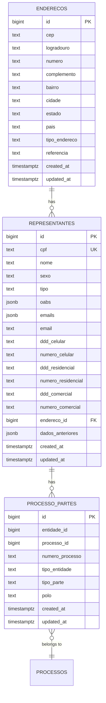
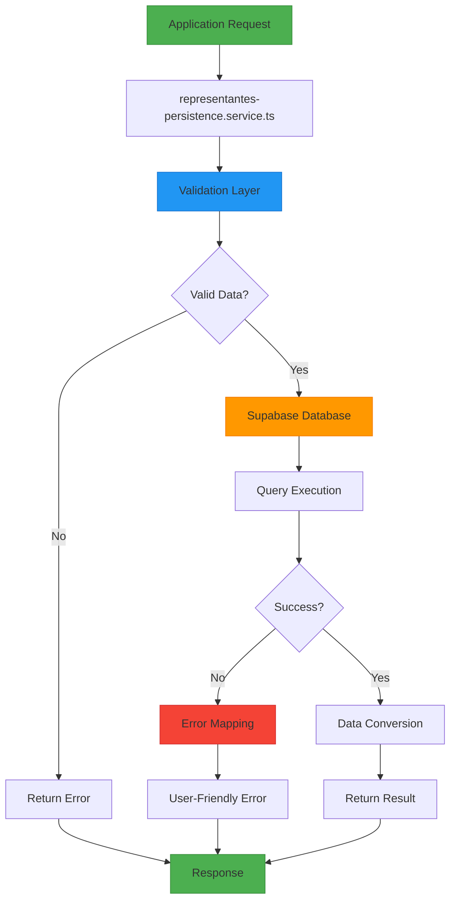
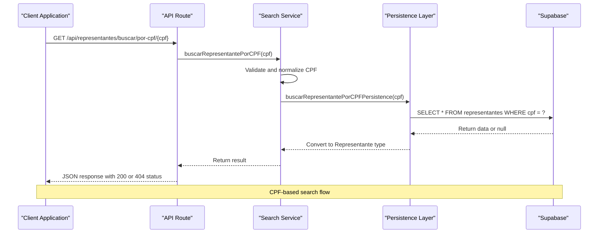
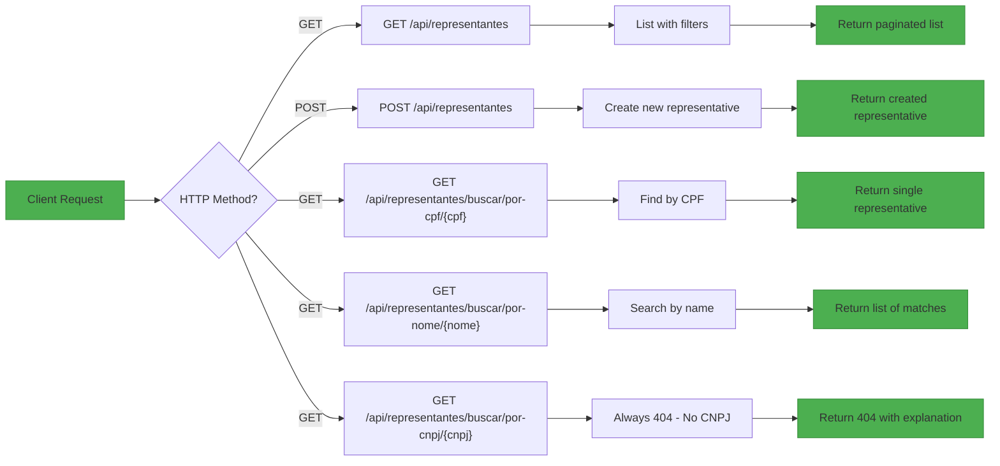
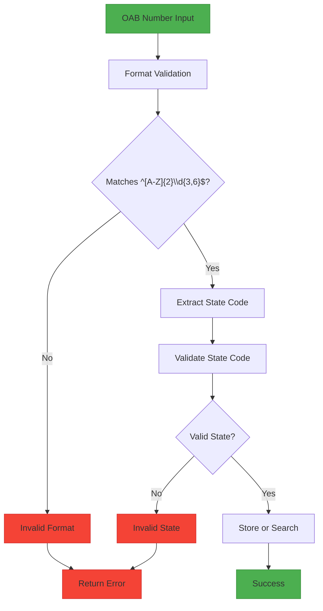

# Representatives

<cite>
**Referenced Files in This Document**   
- [18_representantes.sql](file://supabase/schemas/18_representantes.sql)
- [representantes-persistence.service.ts](file://backend/representantes/services/representantes-persistence.service.ts)
- [buscar-representante-por-cpf.service.ts](file://backend/representantes/services/representantes/buscar-representante-por-cpf.service.ts)
- [buscar-representante-por-nome.service.ts](file://backend/representantes/services/representantes/buscar-representante-por-nome.service.ts)
- [buscar-representante-por-cnpj.service.ts](file://backend/representantes/services/representantes/buscar-representante-por-cnpj.service.ts)
- [route.ts](file://app/api/representantes/buscar/por-cpf/[cpf]/route.ts)
- [route.ts](file://app/api/representantes/buscar/por-nome/[nome]/route.ts)
- [route.ts](file://app/api/representantes/buscar/por-cnpj/[cnpj]/route.ts)
- [representantes-types.ts](file://backend/types/representantes/representantes-types.ts)
- [representantes.ts](file://types/domain/representantes.ts)
- [processo_partes.sql](file://supabase/schemas/17_processo_partes.sql)
</cite>

## Table of Contents
1. [Introduction](#introduction)
2. [Data Model](#data-model)
3. [Persistence Layer](#persistence-layer)
4. [Search Services](#search-services)
5. [API Endpoints](#api-endpoints)
6. [Process Association](#process-association)
7. [OAB Validation](#oab-validation)
8. [Conclusion](#conclusion)

## Introduction

The Representatives feature in the Sinesys application manages legal representatives (typically attorneys) who are associated with legal processes. This documentation details the implementation of representative management, including creation, updating, and association with processes. The system is designed around the principle that representatives are unique by CPF (individual taxpayer registry), with each representative potentially having multiple OAB (Brazilian Bar Association) registrations across different states.

The implementation includes backend services for searching representatives by name, CPF, and CNPJ, with specific validation rules and search capabilities. The persistence layer uses Supabase as the database backend, with a well-defined schema that supports efficient querying and relationship management. Representatives are connected to legal processes through a many-to-many relationship managed by the processo_partes table, allowing flexible representation across multiple cases.

**Section sources**
- [18_representantes.sql](file://supabase/schemas/18_representantes.sql#L1-L63)
- [representantes-persistence.service.ts](file://backend/representantes/services/representantes-persistence.service.ts#L1-L843)

## Data Model

The data model for representatives is centered around the `representantes` table in Supabase, which stores comprehensive information about legal representatives. The table is designed with a primary key on the `id` field, but the business key is the `cpf` field, which has a unique constraint ensuring that each representative is uniquely identified by their CPF.

The core fields in the data model include:
- **CPF**: The unique identifier for the representative (text, not null, unique)
- **Nome**: The full name of the representative (text, not null)
- **Sexo**: Gender information (text)
- **Tipo**: The type of representative (text)
- **OABs**: An array of OAB registrations stored as JSONB, allowing multiple registrations across different states
- **Contact information**: Email addresses (both array and single field), and phone numbers (cellular, residential, commercial) with separate DDD and number fields
- **Endereço_id**: Foreign key reference to the enderecos table for address information
- **Timestamps**: created_at and updated_at with default values

The OAB registration data is stored as a JSONB array with the structure: `[{"numero": "MG128404", "uf": "MG", "situacao": "REGULAR"}, ...]`. This design allows a single attorney to have multiple OAB registrations in different states, which is common in Brazilian legal practice. The JSONB format provides flexibility while maintaining queryability through PostgreSQL's JSONB operators.

The table includes several indexes to optimize query performance:
- `idx_representantes_cpf` on the CPF field for exact match lookups
- `idx_representantes_oabs` using GIN (Generalized Inverted Index) on the OABs JSONB field for efficient JSON queries
- `idx_representantes_endereco` on the endereco_id field for address relationship queries

Row Level Security (RLS) is implemented with two policies:
- Service role has full access to all representatives
- Authenticated users can read representatives



**Diagram sources **
- [18_representantes.sql](file://supabase/schemas/18_representantes.sql#L7-L37)
- [17_processo_partes.sql](file://supabase/schemas/17_processo_partes.sql#L1-L20)
- [15_enderecos.sql](file://supabase/schemas/15_enderecos.sql#L1-L20)

**Section sources**
- [18_representantes.sql](file://supabase/schemas/18_representantes.sql#L1-L63)
- [representantes.ts](file://types/domain/representantes.ts#L45-L65)

## Persistence Layer

The persistence layer for representatives is implemented in the `representantes-persistence.service.ts` file, which provides a comprehensive set of CRUD operations with proper validation and error handling. The service acts as an abstraction layer between the application logic and the Supabase database, ensuring type safety and consistent data handling.

The service exports several key functions for managing representatives:
- `criarRepresentante`: Creates a new representative with CPF validation and required field checks
- `atualizarRepresentante`: Updates an existing representative, preserving previous data in the `dados_anteriores` field for audit purposes
- `buscarRepresentante`: Retrieves a representative by ID
- `buscarRepresentantePorCPF`: Retrieves a representative by CPF
- `buscarRepresentantesPorNome`: Searches for representatives by name using partial matching
- `buscarRepresentantesPorOAB`: Searches for representatives by OAB number
- `listarRepresentantes`: Lists representatives with pagination and filtering
- `upsertRepresentantePorCPF`: Idempotent upsert operation by CPF
- `deletarRepresentante`: Deletes a representative by ID

Each operation includes comprehensive validation and error mapping. The service uses a `mapSupabaseError` function to translate PostgreSQL error codes into user-friendly messages:
- Code `23505` (unique constraint violation) becomes "Representante já cadastrado com este CPF"
- Code `23503` (foreign key violation) becomes "Endereço não encontrado"
- Code `23502` (not null violation) becomes "Campo obrigatório não informado"

The service also includes specialized functions that join with related tables:
- `buscarRepresentanteComEndereco`: Retrieves a representative with their address data
- `listarRepresentantesComEndereco`: Lists representatives with their address data
- `listarRepresentantesComEnderecoEProcessos`: Lists representatives with their address and related processes

These functions use Supabase's relational query capabilities to perform LEFT JOINs and retrieve related data in a single query, reducing the number of database round trips and improving performance.



**Diagram sources **
- [representantes-persistence.service.ts](file://backend/representantes/services/representantes-persistence.service.ts#L209-L615)

**Section sources**
- [representantes-persistence.service.ts](file://backend/representantes/services/representantes-persistence.service.ts#L1-L843)

## Search Services

The search functionality for representatives is implemented through three dedicated service files: `buscar-representante-por-cpf.service.ts`, `buscar-representante-por-nome.service.ts`, and `buscar-representante-por-cnpj.service.ts`. These services provide a clean separation between the business logic and the persistence layer, allowing for consistent validation and error handling across the application.

The `buscar-representante-por-cpf.service.ts` service handles searches by CPF, which is the primary identifier for representatives. The service normalizes the CPF input by removing non-numeric characters and validates that the CPF has exactly 11 digits. It then delegates to the persistence layer to perform the actual database query. This service is critical for exact match lookups and is used when the system needs to retrieve a specific representative's complete information.

The `buscar-representante-por-nome.service.ts` service handles partial name searches, which are essential for user-facing interfaces where users may not know the exact CPF. The service validates that the search term is not empty and has at least 3 characters to prevent overly broad queries. It uses the `ilike` operator with wildcards to perform case-insensitive partial matching on the nome field. The results are ordered alphabetically by name and limited to 100 records to prevent performance issues with large result sets.

The `buscar-representante-por-cnpj.service.ts` service is implemented for interface consistency but has a specific behavior due to the nature of representatives in the system. Since representatives are always individuals (pessoas físicas) and not legal entities (pessoas jurídicas), they do not have CNPJs. This service always returns null, and the corresponding API endpoint returns a 404 status with a message explaining that representatives are individuals and should be searched by CPF instead.

All search services follow a consistent pattern:
1. Input validation and normalization
2. Delegation to the appropriate persistence function
3. Error handling with meaningful messages
4. Return of typed results



**Diagram sources **
- [buscar-representante-por-cpf.service.ts](file://backend/representantes/services/representantes/buscar-representante-por-cpf.service.ts#L1-L24)
- [buscar-representante-por-nome.service.ts](file://backend/representantes/services/representantes/buscar-representante-por-nome.service.ts#L1-L28)
- [buscar-representante-por-cnpj.service.ts](file://backend/representantes/services/representantes/buscar-representante-por-cnpj.service.ts#L1-L20)

**Section sources**
- [buscar-representante-por-cpf.service.ts](file://backend/representantes/services/representantes/buscar-representante-por-cpf.service.ts#L1-L24)
- [buscar-representante-por-nome.service.ts](file://backend/representantes/services/representantes/buscar-representante-por-nome.service.ts#L1-L28)
- [buscar-representante-por-cnpj.service.ts](file://backend/representantes/services/representantes/buscar-representante-por-cnpj.service.ts#L1-L20)

## API Endpoints

The API endpoints for the Representatives feature are implemented as Next.js route handlers in the `app/api/representantes` directory. These endpoints provide a RESTful interface for client applications to interact with the representative data, with proper authentication, validation, and error handling.

The main collection endpoint at `/api/representantes` supports both GET and POST methods:
- **GET**: Lists representatives with pagination and filtering capabilities. The endpoint accepts query parameters for pagination (pagina, limite), filtering (nome, cpf, oab, busca), sorting (ordenar_por, ordem), and data inclusion (incluir_endereco, incluir_processos). When `incluir_processos` is true, the response includes the processes associated with each representative.
- **POST**: Creates a new representative. The endpoint validates required fields (cpf, nome) and returns appropriate status codes (201 for success, 400 for invalid data, 409 for duplicate CPF).

The search endpoints are implemented as dynamic routes:
- `/api/representantes/buscar/por-cpf/[cpf]`: Retrieves a specific representative by CPF. The CPF parameter can be provided with or without formatting (dots and dashes). The endpoint returns 200 with the representative data if found, or 404 if not found.
- `/api/representantes/buscar/por-nome/[nome]`: Searches for representatives by name using partial matching. The name parameter must have at least 3 characters. The endpoint returns a list of matching representatives, which may be empty if no matches are found.
- `/api/representantes/buscar/por-cnpj/[cnpj]`: This endpoint exists for interface consistency but always returns 404, as representatives are individuals and do not have CNPJs. The response includes a message explaining that representatives should be searched by CPF.

All API endpoints implement authentication using the `authenticateRequest` function, which validates the user's session or API key. Unauthorized requests receive a 401 status code. The endpoints also include comprehensive error handling with detailed logging to aid in debugging.



**Diagram sources **
- [route.ts](file://app/api/representantes/route.ts#L1-L294)
- [route.ts](file://app/api/representantes/buscar/por-cpf/[cpf]/route.ts#L1-L84)
- [route.ts](file://app/api/representantes/buscar/por-nome/[nome]/route.ts#L1-L78)
- [route.ts](file://app/api/representantes/buscar/por-cnpj/[cnpj]/route.ts#L1-L61)

**Section sources**
- [route.ts](file://app/api/representantes/route.ts#L1-L294)
- [route.ts](file://app/api/representantes/buscar/por-cpf/[cpf]/route.ts#L1-L84)
- [route.ts](file://app/api/representantes/buscar/por-nome/[nome]/route.ts#L1-L78)
- [route.ts](file://app/api/representantes/buscar/por-cnpj/[cnpj]/route.ts#L1-L61)

## Process Association

Representatives are associated with legal processes through the `processo_partes` table, which implements a many-to-many relationship between processes and various types of parties (including representatives). This design allows a single representative to be associated with multiple processes and a single process to have multiple representatives.

The relationship is managed through the `listarRepresentantesComEnderecoEProcessos` function in the persistence layer, which performs a JOIN between the `representantes`, `enderecos`, and `processo_partes` tables. The function first retrieves the representatives with their address information, then queries the `processo_partes` table to find all process relationships for the retrieved representatives, and finally combines this data into a single response structure.

The `processo_partes` table contains the following key fields for representative associations:
- `entidade_id`: The ID of the representative
- `tipo_entidade`: Set to 'representante' to identify the type of entity
- `processo_id`: The ID of the associated process
- `numero_processo`: The process number for reference
- `tipo_parte`: The type of party the representative is representing (e.g., 'cliente', 'parte_contraria')
- `polo`: The legal pole of the representation (ativo, passivo, or outros)

This design allows for flexible representation scenarios, such as:
- A single attorney representing multiple clients in different cases
- Multiple attorneys representing the same client in a single case
- Attorneys representing different parties in the same case (with appropriate conflict checks at the business logic level)

The association is typically created when a process is updated to include a new representative, triggering an insertion into the `processo_partes` table with the appropriate relationship data.

```mermaid
erDiagram
REPRESENTANTES {
bigint id PK
text cpf UK
text nome
}
PROCESSOS {
bigint id PK
text numero_processo
text tribunal
text classe_judicial
}
PROCESSO_PARTES {
bigint id PK
bigint entidade_id
bigint processo_id
text tipo_entidade
text tipo_parte
text polo
}
REPRESENTANTES ||--o{ PROCESSO_PARTES : "represented in"
PROCESSOS ||--o{ PROCESSO_PARTES : "has parties"
note right of PROCESSO_PARTES
tipo_entidade = 'representante'
when linking to representatives
end note
```

**Diagram sources **
- [representantes-persistence.service.ts](file://backend/representantes/services/representantes-persistence.service.ts#L739-L843)
- [17_processo_partes.sql](file://supabase/schemas/17_processo_partes.sql#L1-L20)

**Section sources**
- [representantes-persistence.service.ts](file://backend/representantes/services/representantes-persistence.service.ts#L739-L843)

## OAB Validation

The system includes comprehensive validation for OAB (Ordem dos Advogados do Brasil) numbers, which are critical for identifying licensed attorneys in Brazil. The validation is implemented in the `validarOAB` function within the `representantes-persistence.service.ts` file.

The validation logic checks two main aspects of the OAB number:
1. **Format validation**: The function verifies that the OAB number follows the pattern of two letters (representing the state) followed by 3 to 6 digits (e.g., "MG128404"). This is enforced using a regular expression pattern `/^[A-Z]{2}\d{3,6}$/`.

2. **State code validation**: The function checks that the state code (the first two letters) is one of the valid Brazilian state codes. The valid codes include all 26 states and the Federal District: 'AC', 'AL', 'AP', 'AM', 'BA', 'CE', 'DF', 'ES', 'GO', 'MA', 'MT', 'MS', 'MG', 'PA', 'PB', 'PR', 'PE', 'PI', 'RJ', 'RN', 'RS', 'RO', 'RR', 'SC', 'SP', 'SE', 'TO'.

The validation is applied in multiple contexts:
- When creating a new representative with an OAB number
- When updating a representative's OAB information
- When searching for representatives by OAB number

For search operations, the system normalizes the OAB number by removing the state code prefix and non-numeric characters, allowing users to search by the numeric portion of the OAB alone. The search can be further refined by specifying a particular state (UF), which will then look for exact matches of the OAB number in that state.

The OAB data is stored in the database as a JSONB array, allowing a single representative to have multiple OAB registrations in different states, which is common for attorneys who are licensed to practice in multiple jurisdictions.



**Diagram sources **
- [representantes-persistence.service.ts](file://backend/representantes/services/representantes-persistence.service.ts#L104-L117)

**Section sources**
- [representantes-persistence.service.ts](file://backend/representantes/services/representantes-persistence.service.ts#L104-L117)

## Conclusion

The Representatives feature in Sinesys provides a robust system for managing legal representatives and their associations with processes. The implementation is built on a solid data model with representatives uniquely identified by CPF, allowing for accurate tracking and management of attorney information.

Key strengths of the implementation include:
- **Data integrity**: The use of unique constraints on CPF and proper validation ensures data quality
- **Flexible OAB management**: The JSONB array structure allows attorneys to have multiple state registrations
- **Efficient searching**: Multiple search endpoints with appropriate indexing enable quick lookups by CPF, name, or OAB
- **Clear process association**: The processo_partes table provides a flexible many-to-many relationship between representatives and processes
- **Comprehensive validation**: Built-in validation for CPF, OAB, and other fields prevents data entry errors

The system correctly recognizes that representatives are always individuals (pessoas físicas) and not legal entities, which is reflected in the decision to not support CNPJ searches for representatives. This design decision aligns with Brazilian legal practice where attorneys are licensed as individuals.

For future improvements, consideration could be given to:
- Implementing OAB status verification through integration with OAB databases
- Adding conflict checking when associating representatives with processes
- Enhancing the search functionality with fuzzy matching for names
- Providing audit trails for changes to representative information

The current implementation provides a solid foundation for representative management in the Sinesys application, supporting the core use cases of creating, updating, searching, and associating representatives with legal processes.