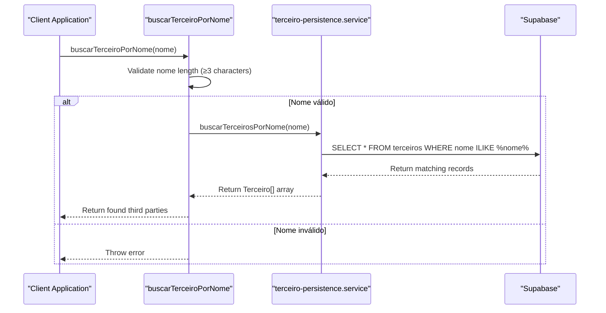
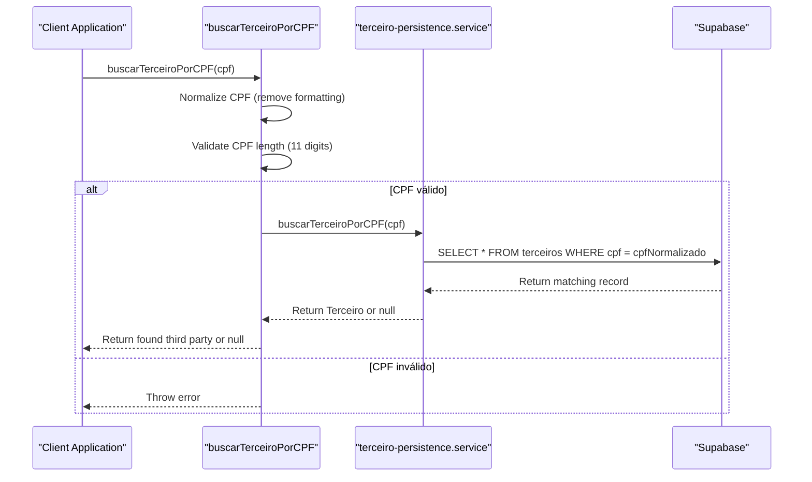
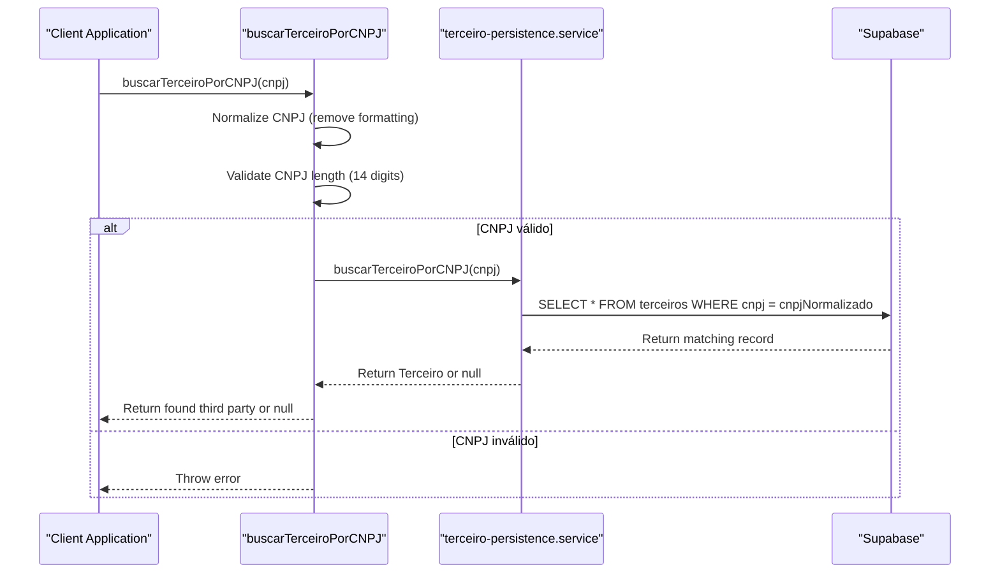

# Third Parties

<cite>
**Referenced Files in This Document**   
- [16_terceiros.sql](file://supabase/schemas/16_terceiros.sql)
- [17_processo_partes.sql](file://supabase/schemas/17_processo_partes.sql)
- [buscar-terceiro-por-nome.service.ts](file://backend/terceiros/services/terceiros/buscar-terceiro-por-nome.service.ts)
- [buscar-terceiro-por-cpf.service.ts](file://backend/terceiros/services/terceiros/buscar-terceiro-por-cpf.service.ts)
- [buscar-terceiro-por-cnpj.service.ts](file://backend/terceiros/services/terceiros/buscar-terceiro-por-cnpj.service.ts)
- [terceiro-persistence.service.ts](file://backend/terceiros/services/persistence/terceiro-persistence.service.ts)
- [terceiros-types.ts](file://backend/types/partes/terceiros-types.ts)
- [partes.ts](file://types/domain/partes.ts)
- [contratos.ts](file://types/contracts/partes.ts)
- [processo-partes-persistence.service.ts](file://backend/processo-partes/services/persistence/processo-partes-persistence.service.ts)
</cite>

## Table of Contents
1. [Introduction](#introduction)
2. [Data Model](#data-model)
3. [Third Party Management](#third-party-management)
4. [Search Services](#search-services)
5. [Persistence Layer](#persistence-layer)
6. [Process-Partes Relationship](#process-partes-relationship)
7. [Common Issues and Solutions](#common-issues-and-solutions)
8. [Conclusion](#conclusion)

## Introduction
The Third Parties feature in the Sinesys application manages external entities involved in legal processes, such as experts, public prosecutors, assistants, witnesses, and other third-party participants. Unlike clients or opposing parties, third parties are global entities that can be associated with multiple processes. This document details the implementation of third party management, including creation, updating, and association with processes, as well as the backend services for searching and persistence.

**Section sources**
- [16_terceiros.sql](file://supabase/schemas/16_terceiros.sql)
- [17_processo_partes.sql](file://supabase/schemas/17_processo_partes.sql)

## Data Model
The third party data model is designed to store comprehensive information about external entities involved in legal processes. The model is implemented in the `terceiros` table and supports both individuals (Pessoa Física) and organizations (Pessoa Jurídica).

### Core Attributes
The data model includes several categories of information:

**Identification**
- `nome`: Full name of the third party
- `nome_fantasia`: Trade name (for organizations)
- `tipo_pessoa`: Person type (PF or PJ)
- `cpf`: Individual taxpayer registry (for individuals)
- `cnpj`: Corporate taxpayer registry (for organizations)
- `tipo_documento`: Document type (CPF or CNPJ)

**Contact Details**
- `emails`: Array of email addresses
- `ddd_celular` and `numero_celular`: Mobile phone number
- `ddd_residencial` and `numero_residencial`: Residential phone number
- `ddd_comercial` and `numero_comercial`: Business phone number

**Individual-Specific Data (PF)**
- `rg`: Identity document
- `sexo`: Gender
- `nome_genitora`: Mother's name
- `data_nascimento`: Date of birth
- `genero`: Gender identity
- `estado_civil`: Marital status
- `nacionalidade`: Nationality
- Various PJE-specific fields for birthplace and tax status

**Organization-Specific Data (PJ)**
- `data_abertura`: Company opening date
- `data_fim_atividade`: End of activity date
- `orgao_publico`: Public agency flag
- `inscricao_estadual`: State registration
- `ramo_atividade`: Business activity sector
- `porte_codigo` and `porte_descricao`: Company size
- Various PJE-specific fields for tax status and classification

**Process-Related Attributes**
- `tipo_parte`: Type of third party (PERITO, MINISTERIO_PUBLICO, ASSISTENTE, etc.)
- `polo`: Legal position (ATIVO, PASSIVO, NEUTRO, TERCEIRO)
- `principal`: Whether the party is the main representative in their pole
- `autoridade`: Authority flag
- `endereco_desconhecido`: Unknown address flag
- `ordem`: Display order within the pole

**Control Fields**
- `ativo`: Active status
- `created_at` and `updated_at`: Timestamps
- `observacoes`: Notes
- `endereco_id`: Foreign key to address table

The data model uses a discriminated union pattern in TypeScript, with `TerceiroPessoaFisica` and `TerceiroPessoaJuridica` interfaces extending a common `TerceiroBase` interface. This allows for type-safe handling of the different data structures for individuals and organizations.

```mermaid
erDiagram
TERCEIROS {
bigint id PK
text tipo_parte
text polo
public.tipo_pessoa tipo_pessoa
text nome
text nome_fantasia
text cpf
text cnpj
text tipo_documento
boolean principal
boolean autoridade
boolean endereco_desconhecido
text status_pje
text situacao_pje
text login_pje
integer ordem
jsonb emails
text ddd_celular
text numero_celular
text ddd_residencial
text numero_residencial
text ddd_comercial
text numero_comercial
text sexo
text rg
date data_nascimento
public.genero_usuario genero
public.estado_civil estado_civil
text nome_genitora
text nacionalidade
integer uf_nascimento_id_pje
text uf_nascimento_sigla
text uf_nascimento_descricao
integer naturalidade_id_pje
text naturalidade_municipio
integer naturalidade_estado_id_pje
text naturalidade_estado_sigla
integer pais_nascimento_id_pje
text pais_nascimento_codigo
text pais_nascimento_descricao
integer escolaridade_codigo
integer situacao_cpf_receita_id
text situacao_cpf_receita_descricao
boolean pode_usar_celular_mensagem
date data_abertura
date data_fim_atividade
boolean orgao_publico
text tipo_pessoa_codigo_pje
text tipo_pessoa_label_pje
text tipo_pessoa_validacao_receita
text ds_tipo_pessoa
integer situacao_cnpj_receita_id
text situacao_cnpj_receita_descricao
text ramo_atividade
text cpf_responsavel
boolean oficial
text ds_prazo_expediente_automatico
integer porte_codigo
text porte_descricao
text inscricao_estadual
text observacoes
bigint endereco_id FK
boolean ativo
timestamp with time zone created_at
timestamp with time zone updated_at
}
ENDERECOS {
bigint id PK
text logradouro
text numero
text complemento
text bairro
text cidade
text estado
text cep
text pais
text tipo_endereco
text situacao
text observacoes
boolean principal
boolean endereco_correspondencia
boolean endereco_entrega
boolean endereco_fiscal
boolean endereco_residencial
boolean endereco_comercial
boolean endereco_trabalho
boolean endereco_cobranca
boolean endereco_correspondencia_judicial
boolean endereco_correspondencia_administrativa
boolean endereco_correspondencia_fiscal
boolean endereco_correspondencia_eletronica
boolean endereco_correspondencia_postal
boolean endereco_correspondencia_telefonica
boolean endereco_correspondencia_whatsapp
boolean endereco_correspondencia_email
boolean endereco_correspondencia_sms
boolean endereco_correspondencia_fax
boolean endereco_correspondencia_telegram
boolean endereco_correspondencia_signal
boolean endereco_correspondencia_messenger
boolean endereco_correspondencia_instagram
boolean endereco_correspondencia_facebook
boolean endereco_correspondencia_twitter
boolean endereco_correspondencia_linkedin
boolean endereco_correspondencia_youtube
boolean endereco_correspondencia_tiktok
boolean endereco_correspondencia_snapchat
boolean endereco_correspondencia_pinterest
boolean endereco_correspondencia_reddit
boolean endereco_correspondencia_discord
boolean endereco_correspondencia_slack
boolean endereco_correspondencia_teams
boolean endereco_correspondencia_zoom
boolean endereco_correspondencia_google_meet
boolean endereco_correspondencia_skype
boolean endereco_correspondencia_whatsapp_business
boolean endereco_correspondencia_telegram_business
boolean endereco_correspondencia_signal_business
boolean endereco_correspondencia_messenger_business
boolean endereco_correspondencia_instagram_business
boolean endereco_correspondencia_facebook_business
boolean endereco_correspondencia_twitter_business
boolean endereco_correspondencia_linkedin_business
boolean endereco_correspondencia_youtube_business
boolean endereco_correspondencia_tiktok_business
boolean endereco_correspondencia_snapchat_business
boolean endereco_correspondencia_pinterest_business
boolean endereco_correspondencia_reddit_business
boolean endereco_correspondencia_discord_business
boolean endereco_correspondencia_slack_business
boolean endereco_correspondencia_teams_business
boolean endereco_correspondencia_zoom_business
boolean endereco_correspondencia_google_meet_business
boolean endereco_correspondencia_skype_business
}
PROCESSO_PARTES {
bigint id PK
bigint processo_id FK
text tipo_entidade
bigint entidade_id
bigint id_pje
bigint id_pessoa_pje
bigint id_tipo_parte
text tipo_parte
text polo
text trt
text grau
text numero_processo
boolean principal
integer ordem
text status_pje
text situacao_pje
boolean autoridade
boolean endereco_desconhecido
jsonb dados_pje_completo
timestamptz ultima_atualizacao_pje
timestamptz created_at
timestamptz updated_at
}
TERCEIROS ||--o{ PROCESSO_PARTES : "has"
ENDERECOS ||--o{ TERCEIROS : "has"
```

**Diagram sources**
- [16_terceiros.sql](file://supabase/schemas/16_terceiros.sql#L6-L119)
- [17_processo_partes.sql](file://supabase/schemas/17_processo_partes.sql#L6-L144)

**Section sources**
- [16_terceiros.sql](file://supabase/schemas/16_terceiros.sql#L6-L119)
- [partes.ts](file://types/domain/partes.ts#L194-L308)
- [contratos.ts](file://types/contracts/partes.ts#L474-L725)

## Third Party Management
The third party management system in Sinesys provides comprehensive functionality for creating, updating, and managing third parties. The implementation follows a service-oriented architecture with clear separation between business logic and persistence layers.

### Creation Process
Creating a new third party involves the following steps:
1. Validate required fields (tipo_pessoa, nome, tipo_parte, polo)
2. Validate CPF/CNPJ based on person type
3. Validate email addresses if provided
4. Prepare data for insertion with proper normalization
5. Insert into the terceiros table

The creation process enforces several business rules:
- CPF must be 11 digits for individuals
- CNPJ must be 14 digits for organizations
- Name is mandatory
- Tipo_parte and polo are mandatory
- Email addresses must be valid if provided

### Update Process
Updating an existing third party follows these principles:
- The tipo_pessoa field cannot be changed after creation
- Only provided fields are updated (partial updates)
- CPF/CNPJ are normalized during update
- Validation is performed on changed fields only

The update process prevents modification of the person type to maintain data integrity, as changing from individual to organization (or vice versa) would require different data structures and validation rules.

### Business Rules
The third party management system enforces several important business rules:
- **Uniqueness**: CPF and CNPJ must be unique across all third parties
- **Immutability**: The tipo_pessoa field cannot be modified after creation
- **Validation**: CPF and CNPJ are validated for correct format and length
- **Required Fields**: tipo_parte, polo, nome, and tipo_pessoa are mandatory
- **Data Normalization**: CPF and CNPJ are stored without formatting characters

These rules ensure data consistency and prevent common data entry errors.

**Section sources**
- [terceiro-persistence.service.ts](file://backend/terceiros/services/persistence/terceiro-persistence.service.ts#L185-L330)
- [terceiros-types.ts](file://backend/types/partes/terceiros-types.ts)

## Search Services
The Sinesys application provides specialized search services for finding third parties by different criteria. These services are implemented as separate modules to ensure separation of concerns and reusability.

### Search by Name
The `buscarTerceiroPorNome` service allows searching for third parties by name using partial matching:



**Diagram sources**
- [buscar-terceiro-por-nome.service.ts](file://backend/terceiros/services/terceiros/buscar-terceiro-por-nome.service.ts)
- [terceiro-persistence.service.ts](file://backend/terceiros/services/persistence/terceiro-persistence.service.ts#L568-L588)

### Search by CPF
The `buscarTerceiroPorCPF` service provides lookup by individual taxpayer registry:



**Diagram sources**
- [buscar-terceiro-por-cpf.service.ts](file://backend/terceiros/services/terceiros/buscar-terceiro-por-cpf.service.ts)
- [terceiro-persistence.service.ts](file://backend/terceiros/services/persistence/terceiro-persistence.service.ts#L523-L540)

### Search by CNPJ
The `buscarTerceiroPorCNPJ` service provides lookup by corporate taxpayer registry:



**Diagram sources**
- [buscar-terceiro-por-cnpj.service.ts](file://backend/terceiros/services/terceiros/buscar-terceiro-por-cnpj.service.ts)
- [terceiro-persistence.service.ts](file://backend/terceiros/services/persistence/terceiro-persistence.service.ts#L545-L562)

### Search Implementation Details
All search services follow a consistent pattern:
1. Input validation and normalization
2. Delegation to persistence layer
3. Error handling with meaningful messages
4. Return of properly typed results

The services validate input parameters before proceeding with database queries, ensuring that invalid searches are caught early. CPF and CNPJ values are normalized by removing non-digit characters before storage and comparison.

The search by name service uses case-insensitive partial matching (ILIKE with wildcards) to find third parties whose names contain the search term. Results are ordered alphabetically by name and limited to 100 records to prevent performance issues.

**Section sources**
- [buscar-terceiro-por-nome.service.ts](file://backend/terceiros/services/terceiros/buscar-terceiro-por-nome.service.ts)
- [buscar-terceiro-por-cpf.service.ts](file://backend/terceiros/services/terceiros/buscar-terceiro-por-cpf.service.ts)
- [buscar-terceiro-por-cnpj.service.ts](file://backend/terceiros/services/terceiros/buscar-terceiro-por-cnpj.service.ts)
- [terceiro-persistence.service.ts](file://backend/terceiros/services/persistence/terceiro-persistence.service.ts)

## Persistence Layer
The persistence layer for third parties is implemented in the `terceiro-persistence.service.ts` file and provides direct database operations for the third parties feature. This layer handles all CRUD operations and data conversion between the database format and application types.

### Key Functions
The persistence service exports several key functions:

**Creation**
- `criarTerceiro`: Inserts a new third party record
- Performs comprehensive validation of all required fields
- Normalizes CPF/CNPJ before storage
- Returns operation result with success status and error details

**Update**
- `atualizarTerceiro`: Updates an existing third party
- Prevents modification of the tipo_pessoa field
- Updates only the fields provided in the parameters
- Maintains data integrity by preserving unchanged fields

**Search and Retrieval**
- `buscarTerceiroPorId`: Finds a third party by ID
- `buscarTerceiroPorCPF`: Finds a third party by CPF
- `buscarTerceiroPorCNPJ`: Finds a third party by CNPJ
- `buscarTerceirosPorNome`: Finds third parties by name (partial match)
- `listarTerceiros`: Lists third parties with filtering and pagination

**Upsert Operations**
- `upsertTerceiroPorCPF`: Creates or updates a third party by CPF
- `upsertTerceiroPorCNPJ`: Creates or updates a third party by CNPJ
- `upsertTerceiroPorDocumento`: Generic upsert by document (CPF or CNPJ)

### Data Conversion
The persistence layer includes a `converterParaTerceiro` function that transforms database records into properly typed application objects. This function:
- Handles the discriminated union between PF and PJ types
- Converts date strings to appropriate format
- Parses JSON fields (emails)
- Maps database columns to TypeScript interface properties
- Ensures type safety throughout the application

### Error Handling
The persistence layer implements comprehensive error handling:
- Database constraint violations are mapped to meaningful error messages
- Validation errors are caught and reported
- Unexpected errors are logged and wrapped in user-friendly messages
- Specific error codes are handled appropriately (e.g., record not found)

The error handling ensures that database-level issues are translated into application-level errors that can be properly handled by the business logic layer.

**Section sources**
- [terceiro-persistence.service.ts](file://backend/terceiros/services/persistence/terceiro-persistence.service.ts)
- [16_terceiros.sql](file://supabase/schemas/16_terceiros.sql)

## Process-Partes Relationship
The relationship between third parties and legal processes is managed through the `processo_partes` table, which implements a many-to-many relationship between processes and various party types (clients, opposing parties, and third parties).

### Relationship Model
The `processo_partes` table serves as a junction table with the following key attributes:

**Foreign Keys**
- `processo_id`: References the process (acervo table)
- `tipo_entidade`: Polymorphic type indicator (cliente, parte_contraria, terceiro)
- `entidade_id`: ID of the entity in the corresponding table

**Process Information**
- `trt`: TRT code from process data
- `grau`: Process level (first_grau or segundo_grau)
- `numero_processo`: Process number

**Party Information**
- `id_pje`: Part ID in PJE (mandatory)
- `id_pessoa_pje`: Person ID in PJE (optional, for PJE audit)
- `id_tipo_parte`: Part type ID in PJE (optional)
- `tipo_parte`: Participant type in process (e.g., RECLAMANTE, RECLAMADO, PERITO, etc.)
- `polo`: Legal position (ATIVO, PASSIVO, NEUTRO, TERCEIRO)
- `principal`: Indicates if the party is the main representative in their pole
- `ordem`: Display order within the pole (0-based, must be ≥ 0)

**Audit and Control**
- `status_pje`: Status in PJE (optional)
- `situacao_pje`: Situation in PJE (optional)
- `autoridade`: Indicates if the party is an authority (optional)
- `endereco_desconhecido`: Indicates if address is unknown (optional)
- `dados_pje_completo`: Complete JSON from PJE for audit and history
- `ultima_atualizacao_pje`: Timestamp of last PJE update
- `created_at` and `updated_at`: Internal timestamps

### Relationship Management
The relationship is managed through the `processo-partes-persistence.service.ts` file, which provides functions for:
- Creating process-party associations
- Updating existing associations
- Deleting associations
- Listing associations with filters
- Finding parties for a specific process
- Finding processes for a specific party

The service enforces several important constraints:
- The combination of processo_id, tipo_entidade, entidade_id, and grau must be unique
- Required fields include tipo_parte, polo, principal, and ordem
- The ordem field must be greater than or equal to zero
- Certain fields cannot be modified after creation (processo_id, tipo_entidade, entidade_id, grau)

### Association Process
When associating a third party with a process:
1. The third party must already exist in the terceiros table
2. A new record is created in processo_partes with the relationship details
3. The relationship includes process-specific information like polo and ordem
4. The same third party can be associated with multiple processes

This design allows third parties to be global entities that can participate in multiple legal processes with different roles and positions in each process.

```mermaid
erDiagram
PROCESSOS {
bigint id PK
text numero_processo
text classe_judicial
text codigo_status_processo
date data_autuacao
text nome_parte_autora
text nome_parte_re
text trt
text grau
text situacao
text status
text vara
text forum
text comarca
text estado
text uf
text tribunal
text orgao_julgador
text tipo_processo
text assunto
text area
text valor_causa
text nivel_sigilo
text grau_sigilo
text tipo_acao
text natureza_acao
text procedimento
text rito
text fase_processual
text status_processual
text situacao_processual
text prioridade
text urgencia
text segredo_justica
text justica_gratuita
text assistencia_judiciaria
text defensoria_publica
text promotoria
text juiz
text magistrado
text servidor
text cartorio
text secretaria
text protocolo
text distribuicao
text acao_principal
text acao_cautelar
text acao_execucao
text acao_monitoria
text acao_reipersecutoria
text acao_declaratoria
text acao_condenatoria
text acao_constitutiva
text acao_preparatoria
text acao_inibitoria
text acao_reipersecutoria
text acao_reivindicatória
text acao_indenizatória
text acao_compensatória
text acao_restitutória
text acao_anulatória
text acao_revocatoria
text acao_rescisória
text acao_mandamental
text acao_cautelar_preparatória
text acao_cautelar_inominada
text acao_cautelar_nomeada
text acao_cautelar_liminar
text acao_cautelar_antecipada
text acao_cautelar_urgente
text acao_cautelar_preventiva
text acao_cautelar_reipersecutoria
text acao_cautelar_indenizatória
text acao_cautelar_compensatória
text acao_cautelar_restitutória
text acao_cautelar_anulatória
text acao_cautelar_revocatoria
text acao_cautelar_rescisória
text acao_cautelar_mandamental
}
TERCEIROS {
bigint id PK
text tipo_parte
text polo
public.tipo_pessoa tipo_pessoa
text nome
text nome_fantasia
text cpf
text cnpj
text tipo_documento
boolean principal
boolean autoridade
boolean endereco_desconhecido
text status_pje
text situacao_pje
text login_pje
integer ordem
jsonb emails
text ddd_celular
text numero_celular
text ddd_residencial
text numero_residencial
text ddd_comercial
text numero_comercial
text sexo
text rg
date data_nascimento
public.genero_usuario genero
public.estado_civil estado_civil
text nome_genitora
text nacionalidade
integer uf_nascimento_id_pje
text uf_nascimento_sigla
text uf_nascimento_descricao
integer naturalidade_id_pje
text naturalidade_municipio
integer naturalidade_estado_id_pje
text naturalidade_estado_sigla
integer pais_nascimento_id_pje
text pais_nascimento_codigo
text pais_nascimento_descricao
integer escolaridade_codigo
integer situacao_cpf_receita_id
text situacao_cpf_receita_descricao
boolean pode_usar_celular_mensagem
date data_abertura
date data_fim_atividade
boolean orgao_publico
text tipo_pessoa_codigo_pje
text tipo_pessoa_label_pje
text tipo_pessoa_validacao_receita
text ds_tipo_pessoa
integer situacao_cnpj_receita_id
text situacao_cnpj_receita_descricao
text ramo_atividade
text cpf_responsavel
boolean oficial
text ds_prazo_expediente_automatico
integer porte_codigo
text porte_descricao
text inscricao_estadual
text observacoes
bigint endereco_id FK
boolean ativo
timestamp with time zone created_at
timestamp with time zone updated_at
}
PROCESSO_PARTES {
bigint id PK
bigint processo_id FK
text tipo_entidade
bigint entidade_id
bigint id_pje
bigint id_pessoa_pje
bigint id_tipo_parte
text tipo_parte
text polo
text trt
text grau
text numero_processo
boolean principal
integer ordem
text status_pje
text situacao_pje
boolean autoridade
boolean endereco_desconhecido
jsonb dados_pje_completo
timestamptz ultima_atualizacao_pje
timestamptz created_at
timestamptz updated_at
}
PROCESSOS ||--o{ PROCESSO_PARTES : "has"
TERCEIROS ||--o{ PROCESSO_PARTES : "has"
```

**Diagram sources**
- [17_processo_partes.sql](file://supabase/schemas/17_processo_partes.sql#L6-L144)
- [processo-partes-persistence.service.ts](file://backend/processo-partes/services/persistence/processo-partes-persistence.service.ts)

**Section sources**
- [17_processo_partes.sql](file://supabase/schemas/17_processo_partes.sql)
- [processo-partes-persistence.service.ts](file://backend/processo-partes/services/persistence/processo-partes-persistence.service.ts)

## Common Issues and Solutions
The implementation of third parties in Sinesys addresses several common issues in legal process management systems.

### Distinguishing Third Parties from Other Party Types
One common challenge is distinguishing third parties from clients and opposing parties. The solution implemented in Sinesys is a clear separation of concerns:

**Global vs. Process-Specific Entities**
- Third parties are global entities stored in the terceiros table
- Clients and opposing parties are typically process-specific
- This allows third parties to be reused across multiple processes

**Polymorphic Relationship**
- The processo_partes table uses a polymorphic relationship with tipo_entidade
- This allows a single table to reference multiple entity types
- The type is explicitly declared (cliente, parte_contraria, terceiro)

**Clear Type Definitions**
- TypeScript interfaces clearly define the differences between party types
- Terceiro interface extends TerceiroBase with specific attributes
- Domain types prevent confusion between different party types

### Data Consistency Issues
The system addresses data consistency through several mechanisms:

**Immutable Person Type**
- The tipo_pessoa field cannot be changed after creation
- This prevents data corruption from type changes
- Ensures validation rules remain consistent

**Document Uniqueness**
- CPF and CNPJ have unique constraints in the terceiros table
- Prevents duplicate entries for the same individual or organization
- Ensures data integrity across the system

**Validation Layer**
- Input validation at both service and persistence layers
- CPF/CNPJ format validation
- Required field validation
- Email format validation

### Search Performance
The system optimizes search performance through:

**Indexing**
- Index on tipo_parte for filtering by party type
- Unique constraints on CPF and CNPJ for fast lookups
- Appropriate indexing on commonly searched fields

**Caching Strategy**
- While not currently implemented, the code includes TODO comments for adding cache
- Future implementation could cache frequently accessed third parties
- Cache would improve performance for repeated searches

**Query Optimization**
- Limit of 100 results for name searches to prevent performance issues
- Use of ILIKE with wildcards for partial name matching
- Proper ordering of results

### Integration with PJE
The system handles PJE integration challenges:

**PJE ID Management**
- id_pje is mandatory for process associations
- id_pessoa_pje is optional for audit purposes
- Both IDs are stored in the processo_partes table

**Data Synchronization**
- dados_pje_completo stores complete JSON from PJE for audit and history
- ultima_atualizacao_pje tracks the last PJE update
- This allows reconciliation with PJE data

**Mapping PJE Data**
- The system maps PJE-specific fields to database columns
- Examples include uf_nascimento_id_pje, naturalidade_id_pje, etc.
- This preserves PJE-specific information while providing a clean application interface

These solutions ensure that the third parties feature is robust, performant, and maintains data integrity while providing the flexibility needed for legal process management.

**Section sources**
- [terceiro-persistence.service.ts](file://backend/terceiros/services/persistence/terceiro-persistence.service.ts)
- [16_terceiros.sql](file://supabase/schemas/16_terceiros.sql)
- [17_processo_partes.sql](file://supabase/schemas/17_processo_partes.sql)

## Conclusion
The Third Parties feature in the Sinesys application provides a comprehensive solution for managing external entities involved in legal processes. The implementation features a well-designed data model that supports both individuals and organizations, with extensive attributes for identification, contact information, and process-specific roles.

The system's architecture follows a clean separation of concerns, with distinct layers for business logic (service layer) and data access (persistence layer). This design promotes maintainability and testability. The search services provide efficient lookup by name, CPF, and CNPJ, with proper validation and error handling.

A key architectural decision is the use of global third parties that can be associated with multiple processes through the processo_partes junction table. This many-to-many relationship allows for flexible process configurations while maintaining data consistency.

The implementation addresses common challenges in legal process management, including distinguishing third parties from other party types, ensuring data consistency, and optimizing search performance. The solution provides a robust foundation for managing complex legal relationships while maintaining data integrity and performance.

Future enhancements could include implementing caching for improved performance, expanding the audit capabilities, and enhancing the user interface for third party management. The current implementation provides a solid foundation that can be extended to meet evolving requirements.

**Section sources**
- [16_terceiros.sql](file://supabase/schemas/16_terceiros.sql)
- [17_processo_partes.sql](file://supabase/schemas/17_processo_partes.sql)
- [terceiro-persistence.service.ts](file://backend/terceiros/services/persistence/terceiro-persistence.service.ts)
- [processo-partes-persistence.service.ts](file://backend/processo-partes/services/persistence/processo-partes-persistence.service.ts)