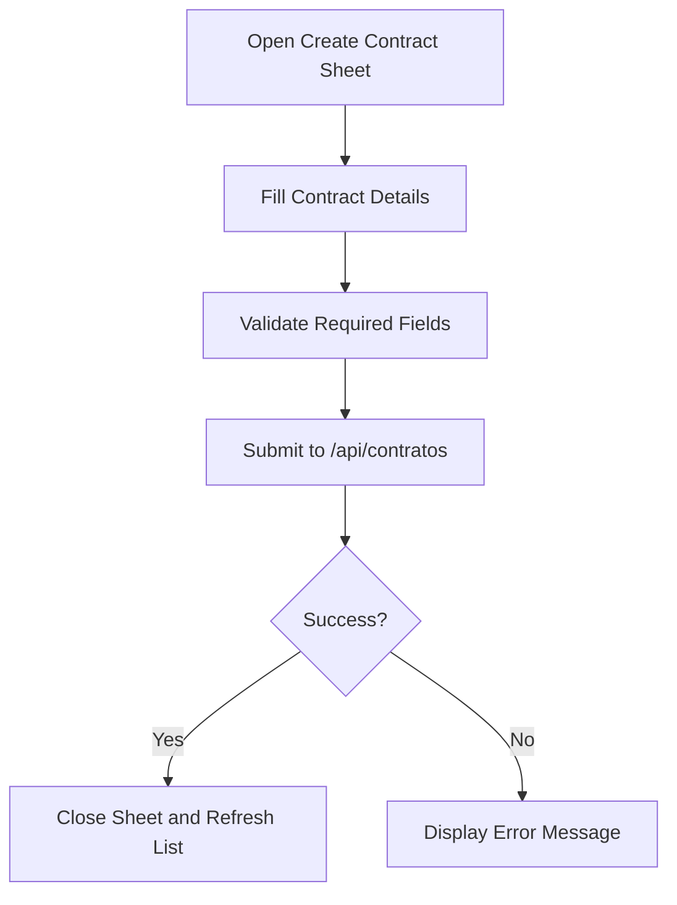
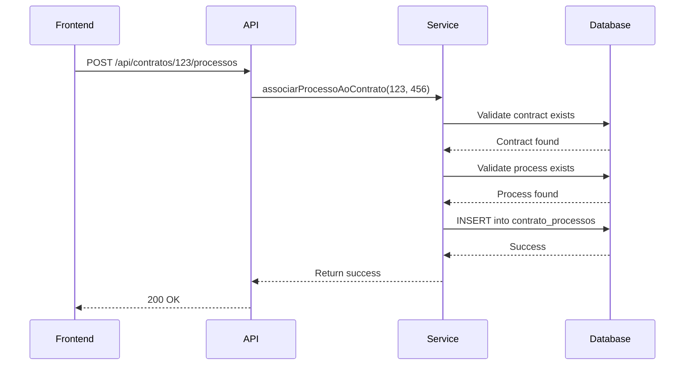
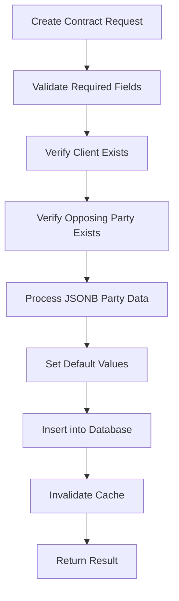
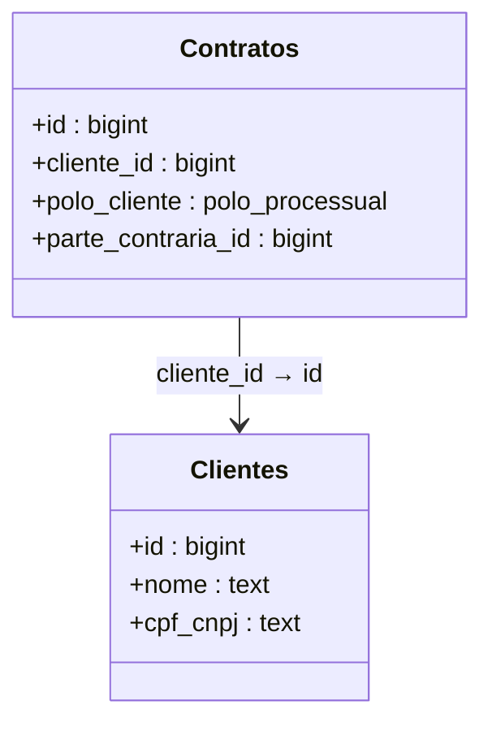
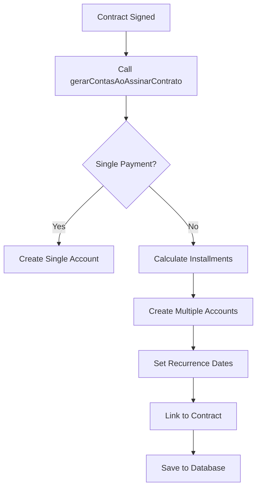

# Contract Management Module

<cite>
**Referenced Files in This Document**   
- [contrato-create-sheet.tsx](file://app/(dashboard)/contratos/components/contrato-create-sheet.tsx)
- [contrato-edit-sheet.tsx](file://app/(dashboard)/contratos/components/contrato-edit-sheet.tsx)
- [contrato-view-sheet.tsx](file://app/(dashboard)/contratos/components/contrato-view-sheet.tsx)
- [contratos-toolbar-filters.tsx](file://app/(dashboard)/contratos/components/contratos-toolbar-filters.tsx)
- [page.tsx](file://app/(dashboard)/contratos/page.tsx)
- [criar-contrato.service.ts](file://backend/contratos/services/contratos/criar-contrato.service.ts)
- [atualizar-contrato.service.ts](file://backend/contratos/services/contratos/atualizar-contrato.service.ts)
- [buscar-contrato.service.ts](file://backend/contratos/services/contratos/buscar-contrato.service.ts)
- [listar-contratos.service.ts](file://backend/contratos/services/contratos/listar-contratos.service.ts)
- [gerar-conta-receber-contrato.service.ts](file://backend/contratos/services/contratos/gerar-conta-receber-contrato.service.ts)
- [gerenciar-processos.service.ts](file://backend/contratos/services/contratos/gerenciar-processos.service.ts)
- [contrato-persistence.service.ts](file://backend/contratos/services/persistence/contrato-persistence.service.ts)
- [contrato-processo-persistence.service.ts](file://backend/contratos/services/persistence/contrato-processo-persistence.service.ts)
- [11_contratos.sql](file://supabase/schemas/11_contratos.sql)
- [12_contrato_processos.sql](file://supabase/schemas/12_contrato_processos.sql)
- [route.ts](file://app/api/contratos/route.ts)
- [route.ts](file://app/api/contratos/[id]/route.ts)
- [route.ts](file://app/api/contratos/[id]/processos/route.ts)
- [route.ts](file://app/api/contratos/[id]/processos/[processoId]/route.ts)
</cite>

## Table of Contents
1. [Introduction](#introduction)
2. [Contract CRUD Operations](#contract-crud-operations)
3. [Contract-Process Association](#contract-process-association)
4. [Backend Business Logic](#backend-business-logic)
5. [Client Linking Implementation](#client-linking-implementation)
6. [Supabase Schemas](#supabase-schemas)
7. [Financial Account Generation](#financial-account-generation)
8. [Common Issues and Solutions](#common-issues-and-solutions)
9. [Conclusion](#conclusion)

## Introduction

The Contract Management Module in the Sinesys application provides a comprehensive system for managing legal contracts within a law firm environment. This module enables users to create, read, update, and delete contracts, associate contracts with legal processes, and generate financial accounts from contracts. The implementation follows a clean architecture pattern with clear separation between frontend components, API routes, backend services, and database persistence layers.

The module is designed to handle various types of legal contracts including litigation, defense, procedural acts, advisory services, consulting, extrajudicial matters, and opinions. Contracts can be linked to clients and opposing parties, with support for multiple parties on both sides of a case. The system also tracks contract status through various stages from initial engagement to distribution or withdrawal.

This documentation provides a detailed analysis of the module's implementation, covering the frontend components, backend services, database schema, and integration points that enable the full contract management lifecycle.

**Section sources**
- [page.tsx](file://app/(dashboard)/contratos/page.tsx)

## Contract CRUD Operations

The Contract Management Module implements a complete CRUD (Create, Read, Update, Delete) interface for contract management through a series of React components and backend services. The primary interface components are implemented as sheets (modal dialogs) that provide a consistent user experience for creating and editing contracts.

The `contrato-create-sheet.tsx` component provides a form interface for creating new contracts. This component includes fields for essential contract information such as area of law, contract type, billing type, client information, and dates. The form validates required fields before submission and makes a POST request to the `/api/contratos` endpoint to create a new contract. The component handles loading states and displays error messages if the creation process fails.



**Diagram sources**
- [contrato-create-sheet.tsx](file://app/(dashboard)/contratos/components/contrato-create-sheet.tsx)

The `contrato-edit-sheet.tsx` component allows users to modify existing contracts. It pre-populates the form with the current contract data when opened and submits updates via a PUT request to the `/api/contratos/{id}` endpoint. The component includes similar validation to the create sheet but is designed to handle partial updates to contract information.

Both components follow a consistent design pattern with sections for basic information, client details, dates, and observations. They use standardized UI components for form elements including selects for enumerated values, date pickers for date fields, and text inputs for identifiers. The sheets are triggered from the main contracts page through buttons in the data table interface.

**Section sources**
- [contrato-create-sheet.tsx](file://app/(dashboard)/contratos/components/contrato-create-sheet.tsx)
- [contrato-edit-sheet.tsx](file://app/(dashboard)/contratos/components/contrato-edit-sheet.tsx)

## Contract-Process Association

Contracts in the Sinesys application can be associated with one or more legal processes, creating a many-to-many relationship between contracts and cases. This association is managed through the `contrato-processos-persistence.service.ts` which handles the CRUD operations for the contract-process relationship table.

The association functionality is exposed through API routes that allow adding and removing processes from contracts. The POST route at `/api/contratos/[id]/processos` adds a process to a contract, while the DELETE route at `/api/contratos/[id]/processos/[processoId]` removes a specific process association. These routes validate that both the contract and process exist before creating or removing the association.



**Diagram sources**
- [gerenciar-processos.service.ts](file://backend/contratos/services/contratos/gerenciar-processos.service.ts)
- [contrato-processo-persistence.service.ts](file://backend/contratos/services/persistence/contrato-processo-persistence.service.ts)

The frontend interface for managing contract-process associations is integrated into the contract view and edit sheets. Users can add processes by entering process IDs, and the system validates the existence of these processes before creating the association. The interface also displays a list of currently associated processes with the ability to remove individual associations.

The implementation includes error handling for common issues such as attempting to associate a process that is already linked to the contract (which would violate the unique constraint on the contract-process relationship table) or referencing non-existent contracts or processes.

**Section sources**
- [contrato-processo-persistence.service.ts](file://backend/contratos/services/persistence/contrato-processo-persistence.service.ts)
- [gerenciar-processos.service.ts](file://backend/contratos/services/contratos/gerenciar-processos.service.ts)

## Backend Business Logic

The backend implementation of the Contract Management Module follows a service-oriented architecture with clear separation between API handlers, business logic services, and data persistence layers. The core business logic is implemented in the `backend/contratos/services/contratos/` directory, with each major operation encapsulated in its own service file.

The `criar-contrato.service.ts` file contains the business logic for creating new contracts. This service validates input parameters, ensures referential integrity by verifying that referenced clients and opposing parties exist, and handles the insertion of contract data into the database. The service also manages the conversion between API input formats and database storage formats, including handling of JSONB fields for multiple parties.



**Diagram sources**
- [criar-contrato.service.ts](file://backend/contratos/services/contratos/criar-contrato.service.ts)
- [contrato-persistence.service.ts](file://backend/contratos/services/persistence/contrato-persistence.service.ts)

The `atualizar-contrato.service.ts` file implements the logic for modifying existing contracts. This service includes additional validation to ensure that only existing contracts can be updated and handles partial updates by only modifying the fields that are provided in the request. The service also manages the automatic updating of the `updated_at` timestamp through database triggers.

Both creation and update services include comprehensive error handling and logging to facilitate debugging and monitoring. They return structured result objects that include success status, the updated contract data, and error messages when applicable. The services also integrate with the caching system to ensure data consistency across the application.

The business logic layer also includes services for listing contracts with various filtering options and retrieving individual contracts by ID. These services support pagination and can filter contracts by area of law, contract type, billing type, status, client, opposing party, and responsible user.

**Section sources**
- [criar-contrato.service.ts](file://backend/contratos/services/contratos/criar-contrato.service.ts)
- [atualizar-contrato.service.ts](file://backend/contratos/services/contratos/atualizar-contrato.service.ts)
- [buscar-contrato.service.ts](file://backend/contratos/services/contratos/buscar-contrato.service.ts)
- [listar-contratos.service.ts](file://backend/contratos/services/contratos/listar-contratos.service.ts)

## Client Linking Implementation

Client linking is a fundamental aspect of the contract management system, establishing the relationship between contracts and clients in the database. This relationship is implemented through foreign key constraints and is validated at multiple levels in the application stack.

In the database schema, the `contratos` table includes a `cliente_id` field that references the `id` field in the `clientes` table. This foreign key constraint ensures referential integrity at the database level, preventing the creation of contracts that reference non-existent clients. The constraint is defined with `on delete restrict` semantics, which prevents the deletion of clients that have associated contracts.



**Diagram sources**
- [11_contratos.sql](file://supabase/schemas/11_contratos.sql)

At the application level, both the contract creation and update services validate the existence of referenced clients before proceeding with the operation. The `criar-contrato.service.ts` service performs a database query to verify that the specified `clienteId` exists in the `clientes` table. If the client does not exist, the service returns an error response without attempting to create the contract.

The frontend components also implement client validation through the use of ID input fields. While the current implementation requires users to enter client IDs manually, the system validates these IDs against the database when the form is submitted. Future enhancements could include autocomplete functionality to improve the user experience and reduce input errors.

The client linking implementation also supports the concept of the client's position in the legal process (plaintiff or defendant) through the `polo_cliente` field. This field is required for all contracts and determines how the client is positioned in relation to the opposing party in the legal proceedings.

**Section sources**
- [contrato-persistence.service.ts](file://backend/contratos/services/persistence/contrato-persistence.service.ts)
- [11_contratos.sql](file://supabase/schemas/11_contratos.sql)

## Supabase Schemas

The Contract Management Module uses two primary tables in the Supabase database: `contratos` and `contrato_processos`. These tables are defined in SQL schema files that specify the structure, constraints, indexes, and security policies for the data.

The `contratos` table (defined in `11_contratos.sql`) stores the core contract information with fields for area of law, contract type, billing type, client and opposing party references, process parties (stored as JSONB), status, dates, and metadata. The table includes several important design features:

- **JSONB fields** for `parte_autora` and `parte_re` to support multiple parties on each side of a case
- **Foreign key constraints** to ensure referential integrity with clients, opposing parties, and users
- **Indexes** on frequently queried fields including area of law, contract type, status, and client ID
- **GIN indexes** on the JSONB fields to enable efficient querying of party data
- **Row Level Security (RLS)** to control access to contract data based on user permissions
- **Trigger** to automatically update the `updated_at` timestamp on modifications

```sql
create table public.contratos (
  id bigint generated always as identity primary key,
  area_direito public.area_direito not null,
  tipo_contrato public.tipo_contrato not null,
  tipo_cobranca public.tipo_cobranca not null,
  cliente_id bigint not null references public.clientes(id) on delete restrict,
  polo_cliente public.polo_processual not null,
  parte_contraria_id bigint references public.partes_contrarias(id) on delete set null,
  parte_autora jsonb,
  parte_re jsonb,
  qtde_parte_autora integer not null default 1,
  qtde_parte_re integer not null default 1,
  status public.status_contrato not null default 'em_contratacao',
  data_contratacao timestamptz default now() not null,
  data_assinatura date,
  data_distribuicao date,
  data_desistencia date,
  responsavel_id bigint references public.usuarios(id) on delete set null,
  created_by bigint references public.usuarios(id) on delete set null,
  observacoes text,
  dados_anteriores jsonb,
  created_at timestamptz default now() not null,
  updated_at timestamptz default now() not null
);
```

The `contrato_processos` table (defined in `12_contrato_processos.sql`) implements the many-to-many relationship between contracts and legal processes. This junction table includes foreign keys to both the `contratos` and `acervo` (processes) tables, with cascade delete behavior to automatically remove associations when either the contract or process is deleted. The table includes a unique constraint to prevent duplicate associations and indexes to optimize queries by contract or process.

**Section sources**
- [11_contratos.sql](file://supabase/schemas/11_contratos.sql)
- [12_contrato_processos.sql](file://supabase/schemas/12_contrato_processos.sql)

## Financial Account Generation

The Contract Management Module includes functionality to generate financial accounts (accounts receivable) from contracts through the `gerar-conta-receber-contrato.service.ts` service. This feature automates the creation of billing records based on contract terms, reducing manual data entry and ensuring consistency between contract agreements and financial records.

The service provides several methods for generating financial accounts:

- `gerarContaReceberContrato`: Creates a single account receivable from a contract
- `gerarContasParcelasContrato`: Creates multiple installment-based accounts receivable
- `gerarContasAoAssinarContrato`: Automatically generates accounts when a contract is signed
- `buscarContasReceberDoContrato`: Retrieves all financial accounts associated with a contract



**Diagram sources**
- [gerar-conta-receber-contrato.service.ts](file://backend/contratos/services/contratos/gerar-conta-receber-contrato.service.ts)

The financial account generation process considers the contract's billing type (success fee or professional fee) when determining the description and category of the generated accounts. For success fee contracts, accounts are categorized as "honorarios_exito" (success fees), while professional fee contracts use the "honorarios_contratuais" (contractual fees) category.

The service includes validation to prevent generating accounts for contracts with a "desistencia" (withdrawal) status, ensuring that financial obligations are not created for terminated contracts. It also validates that the contract exists and is in an appropriate status before generating accounts.

When generating installment-based accounts, the service calculates the value of each installment by dividing the total contract value by the number of installments. It then creates individual account records with appropriate due dates based on the specified frequency (weekly, biweekly, monthly, etc.).

**Section sources**
- [gerar-conta-receber-contrato.service.ts](file://backend/contratos/services/contratos/gerar-conta-receber-contrato.service.ts)

## Common Issues and Solutions

The Contract Management Module may encounter several common issues during operation. Understanding these issues and their solutions is essential for maintaining system reliability and data integrity.

### Contract-Process Association Errors

One common issue is attempting to associate a process with a contract when the process is already linked to that contract. This violates the unique constraint on the `contrato_processos` table and results in a database error with code '23505'. The system handles this gracefully by returning a user-friendly error message: "Este processo já está associado ao contrato" (This process is already associated with the contract).

Another common issue is attempting to associate non-existent contracts or processes. The system validates the existence of both entities before creating the association, returning appropriate error messages when either entity is not found. This prevents orphaned records and maintains referential integrity.

### Client Validation Issues

Since the current implementation requires manual entry of client IDs, users may enter invalid or non-existent client IDs. The system addresses this by validating client existence in the backend services before creating or updating contracts. However, a better user experience could be achieved by implementing client autocomplete functionality in the frontend.

### Data Type and Format Issues

The system uses JSONB fields to store arrays of parties (`parte_autora` and `parte_re`). Issues can arise if the JSON structure is invalid or contains unexpected data types. The persistence service includes validation functions that sanitize and validate these JSON structures, ensuring they conform to the expected format with proper `tipo`, `id`, and `nome` fields.

### Caching Inconsistencies

The system implements Redis caching for contract data to improve performance. However, this can lead to consistency issues if the cache is not properly invalidated after data modifications. The implementation addresses this by calling `invalidateContratosCache()` after successful create, update, and delete operations, ensuring that subsequent requests retrieve the most current data.

**Section sources**
- [contrato-processo-persistence.service.ts](file://backend/contratos/services/persistence/contrato-processo-persistence.service.ts)
- [contrato-persistence.service.ts](file://backend/contratos/services/persistence/contrato-persistence.service.ts)
- [gerar-conta-receber-contrato.service.ts](file://backend/contratos/services/contratos/gerar-conta-receber-contrato.service.ts)

## Conclusion

The Contract Management Module in the Sinesys application provides a robust and comprehensive system for managing legal contracts throughout their lifecycle. The implementation follows sound architectural principles with clear separation of concerns between frontend components, API routes, business logic services, and data persistence layers.

Key strengths of the implementation include:

- **Comprehensive CRUD interface** with user-friendly forms for creating and editing contracts
- **Flexible contract-process association** that supports multiple processes per contract
- **Robust client linking** with referential integrity enforcement at both database and application levels
- **Automated financial account generation** that reduces manual data entry and ensures billing consistency
- **Efficient database design** with appropriate indexes, constraints, and security policies
- **Comprehensive error handling** that provides meaningful feedback to users

The module effectively addresses the core requirements of contract management in a law firm environment, providing tools for contract creation, process association, client management, and financial integration. With minor enhancements such as client autocomplete functionality, the user experience could be further improved while maintaining the solid technical foundation already in place.