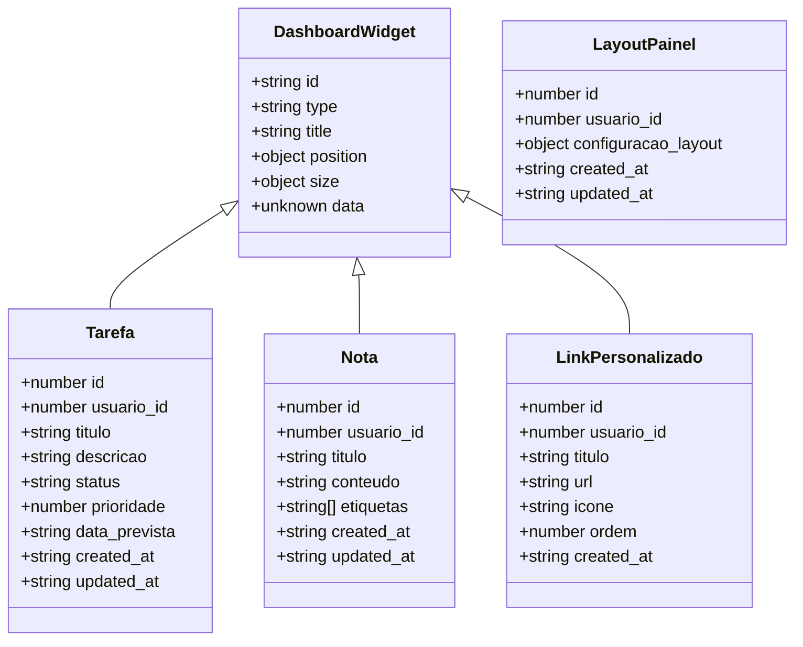
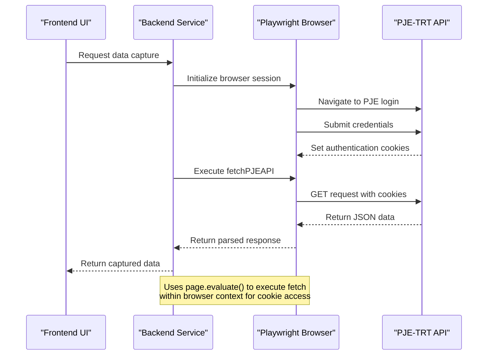
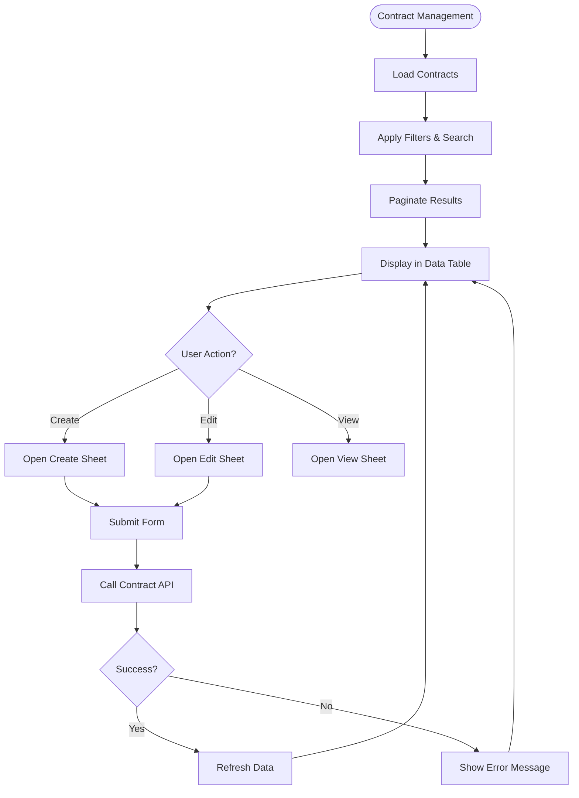

# Core Modules

<cite>
**Referenced Files in This Document**   
- [dashboard/page.tsx](file://app/(dashboard)/dashboard/page.tsx)
- [dashboard-api.ts](file://app/_lib/dashboard-api.ts)
- [dashboard-types.ts](file://app/_lib/dashboard-types.ts)
- [pje.ts](file://app/actions/pje.ts)
- [pje-trt/index.ts](file://backend/api/pje-trt/index.ts)
- [fetch.ts](file://backend/api/pje-trt/shared/fetch.ts)
- [contratos/page.tsx](file://app/(dashboard)/contratos/page.tsx)
- [clientes/page.tsx](file://app/(dashboard)/partes/clientes/page.tsx)
- [audiencias/page.tsx](file://app/(dashboard)/audiencias/page.tsx)
- [captura/page.tsx](file://app/(dashboard)/captura/page.tsx)
</cite>

## Table of Contents
1. [Dashboard Module](#dashboard-module)
2. [Data Capture Module](#data-capture-module)
3. [Contract Management Module](#contract-management-module)
4. [Client Management Module](#client-management-module)
5. [Hearing Management Module](#hearing-management-module)

## Dashboard Module

The Dashboard module serves as the central hub for visualizing legal processes, hearings, and pending items through a customizable widget-based interface. It provides users with a personalized view of their workflow, enabling efficient monitoring of tasks, notes, and custom links.

The dashboard functionality is implemented through a combination of frontend components and backend API services. The main dashboard page renders the `DashboardContent` component within a container layout, providing a clean and responsive user interface.

Key features of the dashboard include:
- **Task Management**: Users can create, update, and delete tasks with status tracking and priority levels
- **Note Taking**: Personal notes with tagging capabilities for organization
- **Custom Links**: Personalized shortcuts to frequently accessed resources
- **Layout Personalization**: Customizable grid layout for arranging widgets

The module uses Supabase as its backend service, with dedicated API functions for retrieving and manipulating dashboard data. The `dashboard-api.ts` file exports functions for handling CRUD operations on tasks, notes, links, and layout configurations. Each function first authenticates the user and retrieves their user ID before performing database operations.

Domain models are defined in `dashboard-types.ts`, specifying interfaces for `Tarefa` (Task), `Nota` (Note), `LinkPersonalizado` (Custom Link), and `LayoutPainel` (Dashboard Layout). These types ensure type safety throughout the application and define the structure of data exchanged between frontend and backend.

**Diagram sources**
- [dashboard-types.ts](file://app/_lib/dashboard-types.ts#L1-L76)

**Section sources**
- [dashboard/page.tsx](file://app/(dashboard)/dashboard/page.tsx#L1-L10)
- [dashboard-api.ts](file://app/_lib/dashboard-api.ts#L1-L209)
- [dashboard-types.ts](file://app/_lib/dashboard-types.ts#L1-L76)

## Data Capture Module

The Data Capture module enables integration with the PJE-TRT (Processo Judicial Eletrônico - Tribunal Regional do Trabalho) system through browser automation, allowing for automated data extraction from judicial platforms. This module handles credential management, session authentication, and error handling for reliable data capture operations.

The module architecture follows a service-oriented pattern, with the `pje-trt` API serving as the central integration point. The main entry file `index.ts` re-exports various API functions for different data capture operations, including:
- Acervo Geral (General Collection)
- Expedientes (Pending Matters)
- Audiências (Hearings)
- Arquivados (Archived Cases)
- Timeline data

The core of the integration is the `fetchPJEAPI` function in `fetch.ts`, which performs HTTP GET requests to the PJE API using browser session cookies for authentication. This approach leverages Playwright's Page object to execute fetch operations within the browser context, ensuring that authentication cookies are automatically included in requests.

Key implementation details:
- Authentication is cookie-based rather than using Authorization headers
- Requests are executed within the Playwright browser context via `page.evaluate()`
- The base URL is dynamically determined from the current page origin
- Query parameters are properly encoded and converted to strings
- Error handling includes HTTP status codes and response text

The module handles common issues such as authentication timeouts and network errors by leveraging Playwright's robust browser automation capabilities. Credential management is handled separately, with the system maintaining authenticated browser sessions for data extraction.

**Diagram sources**
- [pje-trt/index.ts](file://backend/api/pje-trt/index.ts#L1-L47)
- [fetch.ts](file://backend/api/pje-trt/shared/fetch.ts#L1-L204)

**Section sources**
- [captura/page.tsx](file://app/(dashboard)/captura/page.tsx#L1-L10)
- [pje-trt/index.ts](file://backend/api/pje-trt/index.ts#L1-L47)
- [fetch.ts](file://backend/api/pje-trt/shared/fetch.ts#L1-L204)

## Contract Management Module

The Contract Management module provides comprehensive CRUD operations for managing legal contracts, including process association and client linking functionality. The implementation follows a component-based architecture with a data table interface for efficient contract management.

The main `ContratosPage` component renders a data table with filtering, sorting, and pagination capabilities. Key features include:
- **Search functionality** with debounce optimization
- **Filtering system** with predefined filter groups
- **Pagination** with configurable page size
- **CRUD operations** through modal sheets (create, view, edit)
- **Status visualization** with color-coded badges

The module uses React hooks for state management and data fetching, with `useContratos` handling API communication. The table columns are dynamically generated with specialized rendering for different data types:
- ID display with hash prefix
- Date formatting
- Badge rendering for categorical data (area of law, contract type, billing type, status)
- Action buttons for editing and viewing

Contract associations are managed through foreign key relationships, with each contract linked to a client via `clienteId`. The interface displays only the client ID in the main table, with detailed client information available in the contract detail view.

Common issues and solutions:
- **Performance with large datasets**: Addressed through server-side pagination and debounced search
- **Data consistency**: Ensured through proper state management and refetching after mutations
- **User experience**: Enhanced with loading states and error handling

**Diagram sources**
- [contratos/page.tsx](file://app/(dashboard)/contratos/page.tsx#L1-L318)

**Section sources**
- [contratos/page.tsx](file://app/(dashboard)/contratos/page.tsx#L1-L318)

## Client Management Module

The Client Management module handles client registration and management of related entities including opposing parties, representatives, and third parties. The implementation provides a tab-based interface for organizing different types of parties.

The main `ClientesPage` component serves as the entry point for client management, rendering a `ClientesTab` component within a suspense boundary for loading states. The use of React Suspense ensures a smooth user experience during data loading.

Key aspects of the implementation:
- **Client registration**: Creation and management of client records
- **Opposing parties**: Management of parties on the opposite side of legal matters
- **Representatives**: Handling of legal representatives and attorneys
- **Third parties**: Management of other entities involved in legal processes

The module follows a modular architecture with separate components for each party type, allowing for independent development and maintenance. The tab-based navigation enables users to switch between different party categories efficiently.

Data loading is handled asynchronously with proper loading states displayed through skeleton components. This approach provides visual feedback to users during data retrieval operations.

**Section sources**
- [clientes/page.tsx](file://app/(dashboard)/partes/clientes/page.tsx#L1-L31)

## Hearing Management Module

The Hearing Management module provides calendar views for scheduling and tracking hearings, with functionality for assigning responsibilities and generating virtual hearing URLs. While specific implementation details are limited in the available context, the module structure indicates comprehensive hearing management capabilities.

Based on the project structure, the module includes:
- Calendar views organized by year, month, week, and day
- Hearing listing and management interface
- Responsibility assignment functionality
- Virtual hearing URL generation

The module likely integrates with external calendar services and video conferencing platforms to provide seamless scheduling and virtual hearing capabilities. The responsibility assignment feature enables team collaboration by designating specific team members to handle particular hearings.

The implementation follows the application's component-based architecture, with dedicated components for different views and functionalities. The calendar interface likely provides multiple viewing options to accommodate different user preferences and scheduling needs.

**Section sources**
- [audiencias/page.tsx](file://app/(dashboard)/audiencias/page.tsx)