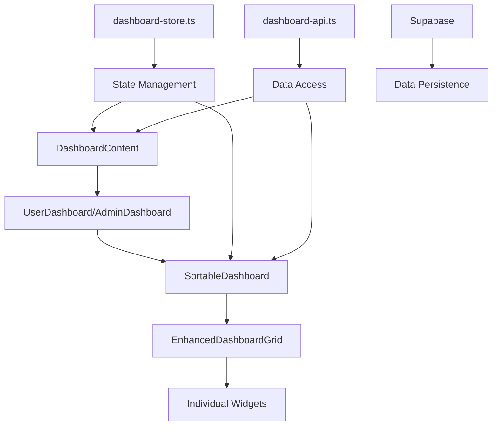
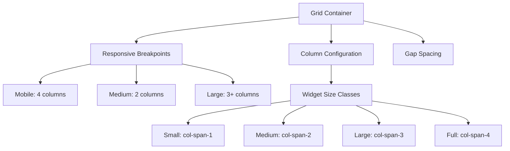
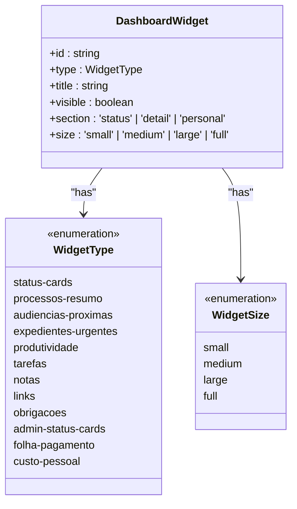
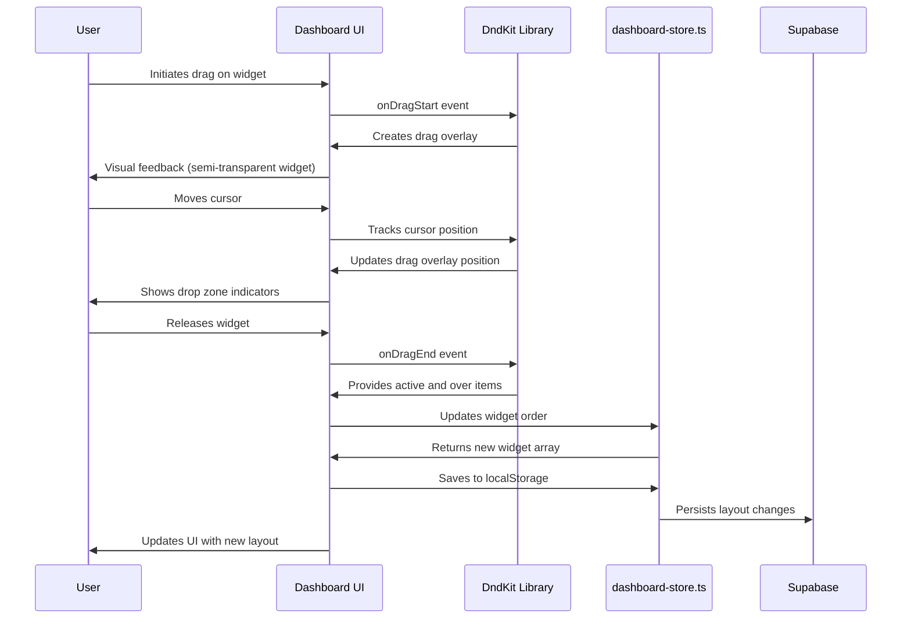
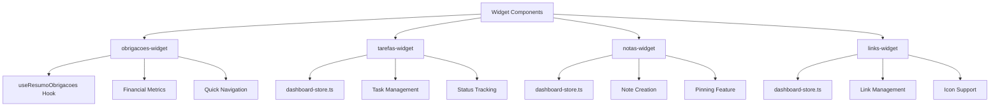
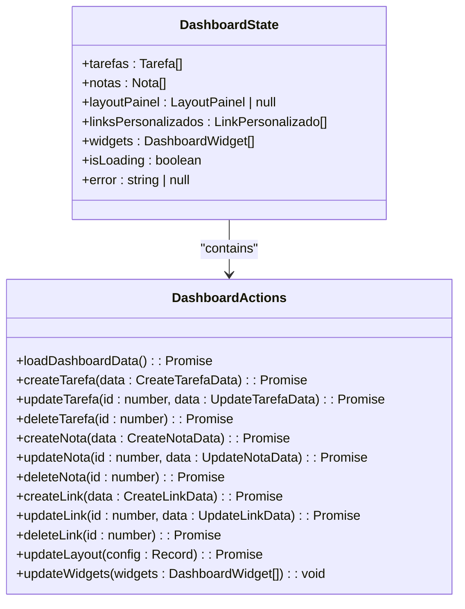
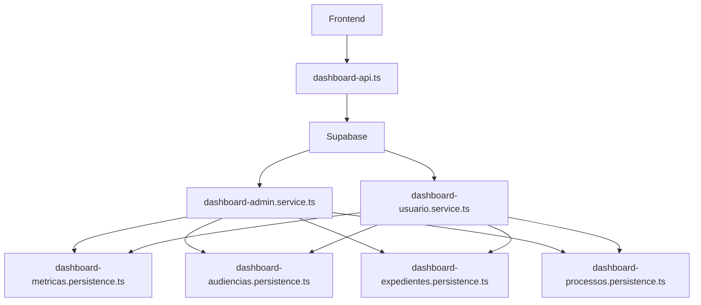
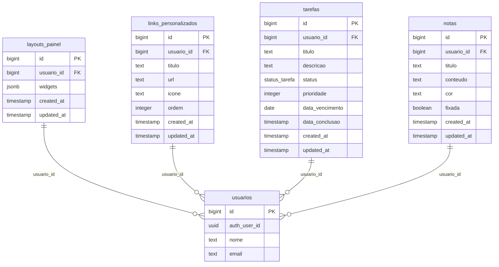
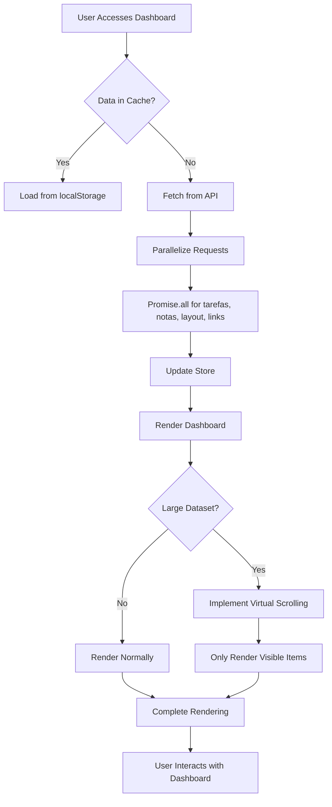

# Dashboard Module

<cite>
**Referenced Files in This Document**   
- [dashboard-content.tsx](file://app/(dashboard)/dashboard/components/dashboard-content.tsx)
- [dashboard-store.ts](file://app/_lib/stores/dashboard-store.ts)
- [dashboard-api.ts](file://app/_lib/dashboard-api.ts)
- [dashboard-types.ts](file://app/_lib/dashboard-types.ts)
- [enhanced-dashboard-grid.tsx](file://app/(dashboard)/dashboard/components/enhanced-dashboard-grid.tsx)
- [sortable-dashboard.tsx](file://app/(dashboard)/dashboard/components/sortable-dashboard.tsx)
- [obrigacoes-widget.tsx](file://app/(dashboard)/dashboard/components/obrigacoes-widget.tsx)
- [tarefas-widget.tsx](file://app/(dashboard)/dashboard/components/tarefas-widget.tsx)
- [notas-widget.tsx](file://app/(dashboard)/dashboard/components/notas-widget.tsx)
- [links-widget.tsx](file://app/(dashboard)/dashboard/components/links-widget.tsx)
- [23_dashboard.sql](file://supabase/schemas/23_dashboard.sql)
- [dashboard-admin.service.ts](file://backend/dashboard/services/dashboard/dashboard-admin.service.ts)
- [dashboard-usuario.service.ts](file://backend/dashboard/services/dashboard/dashboard-usuario.service.ts)
- [dashboard-metricas.persistence.ts](file://backend/dashboard/services/persistence/dashboard-metricas.persistence.ts)
</cite>

## Table of Contents
1. [Introduction](#introduction)
2. [Dashboard Architecture Overview](#dashboard-architecture-overview)
3. [Dashboard Grid System Implementation](#dashboard-grid-system-implementation)
4. [Widget Personalization and Data Visualization](#widget-personalization-and-data-visualization)
5. [Drag-and-Drop Dashboard Layout](#drag-and-drop-dashboard-layout)
6. [Dashboard Widget Components](#dashboard-widget-components)
7. [State Management with Dashboard Store](#state-management-with-dashboard-store)
8. [Backend Services and Data Persistence](#backend-services-and-data-persistence)
9. [Supabase Schema for Dashboard](#supabase-schema-for-dashboard)
10. [Performance Optimization and Loading States](#performance-optimization-and-loading-states)
11. [Conclusion](#conclusion)

## Introduction

The Dashboard Module in the Sinesys application provides a comprehensive, personalized overview of key legal and financial metrics for users and administrators. This document details the implementation of the dashboard grid system, widget personalization, data visualization components, and the drag-and-drop layout functionality. The module integrates with various application components including processes, hearings, financial obligations, and user tasks to provide a unified view of critical information.

The dashboard architecture is built around a modular widget system that allows users to customize their view according to their specific needs. The implementation leverages React with client-side state management through Zustand, drag-and-drop functionality via DndKit, and persistent storage in Supabase. The system supports both user and administrator views with different sets of widgets and metrics tailored to each role's requirements.

**Section sources**
- [dashboard-content.tsx](file://app/(dashboard)/dashboard/components/dashboard-content.tsx)

## Dashboard Architecture Overview

The Sinesys dashboard follows a component-based architecture with clear separation between presentation, state management, and data access layers. The main entry point is the DashboardContent component which orchestrates the rendering of different dashboard views based on user role and state.

The architecture consists of three main layers:
1. **Presentation Layer**: Composed of React components that render the UI, including the dashboard grid, widgets, and interactive elements
2. **State Management Layer**: Implemented using Zustand store (dashboard-store.ts) that manages the application state including widgets, tasks, notes, and links
3. **Data Access Layer**: Provides API functions (dashboard-api.ts) that interact with the Supabase backend to retrieve and persist data

The system differentiates between user and administrator dashboards, with the UserDashboard displaying personal productivity metrics and the AdminDashboard showing organizational-level analytics. Both views share the same underlying infrastructure but render different sets of widgets based on the user's role.

**Diagram sources**
- [dashboard-content.tsx](file://app/(dashboard)/dashboard/components/dashboard-content.tsx)
- [dashboard-store.ts](file://app/_lib/stores/dashboard-store.ts)
- [dashboard-api.ts](file://app/_lib/dashboard-api.ts)

**Section sources**
- [dashboard-content.tsx](file://app/(dashboard)/dashboard/components/dashboard-content.tsx)
- [dashboard-store.ts](file://app/_lib/stores/dashboard-store.ts)
- [dashboard-api.ts](file://app/_lib/dashboard-api.ts)

## Dashboard Grid System Implementation

The dashboard grid system is implemented using a responsive CSS Grid layout that adapts to different screen sizes. The grid is defined in the EnhancedDashboardGrid component, which provides a structured container for organizing widgets in a visually appealing and functional manner.

The grid system uses a 4-column layout on mobile devices, 2 columns on medium screens, and 3 or more columns on large screens. This responsive design ensures optimal widget arrangement across different device types. Each widget occupies a specific number of columns based on its size configuration, with options for small (1 column), medium (2 columns), large (3 columns), and full-width (4 columns) sizes.

The grid implementation includes several key features:
- Responsive breakpoints that adjust column counts based on screen width
- Gap spacing between widgets for visual separation
- Flexible sizing that allows widgets to expand or contract based on content
- Overflow handling for widgets with dynamic content

The grid system works in conjunction with the drag-and-drop functionality to provide an intuitive user experience for rearranging widgets. When a widget is dragged, the grid provides visual feedback by showing drop zones and reordering indicators.

**Diagram sources**
- [enhanced-dashboard-grid.tsx](file://app/(dashboard)/dashboard/components/enhanced-dashboard-grid.tsx)

**Section sources**
- [enhanced-dashboard-grid.tsx](file://app/(dashboard)/dashboard/components/enhanced-dashboard-grid.tsx)

## Widget Personalization and Data Visualization

The Sinesys dashboard supports extensive widget personalization, allowing users to tailor their view to their specific needs. Each widget represents a distinct data visualization component that displays information from various modules within the application.

Widgets are categorized into three main types:
1. **Status Widgets**: Display summary metrics and key performance indicators
2. **Detail Widgets**: Show detailed information about specific entities like processes, hearings, or financial obligations
3. **Personal Widgets**: Contain user-specific information such as tasks, notes, and custom links

Each widget can be personalized in several ways:
- **Visibility**: Users can show or hide specific widgets through the dashboard settings menu
- **Size**: Widgets can be resized to small, medium, large, or full-width configurations
- **Position**: Widgets can be reordered using drag-and-drop functionality
- **Content**: Some widgets allow filtering or configuration of the displayed data

The data visualization components use various chart types and formatting techniques to present information clearly. Financial data is formatted with currency symbols and appropriate decimal places, dates are localized to Brazilian Portuguese format, and numerical values use compact notation for large numbers (e.g., "1.2M" instead of "1,200,000").

**Diagram sources**
- [sortable-dashboard.tsx](file://app/(dashboard)/dashboard/components/sortable-dashboard.tsx)

**Section sources**
- [sortable-dashboard.tsx](file://app/(dashboard)/dashboard/components/sortable-dashboard.tsx)

## Drag-and-Drop Dashboard Layout

The drag-and-drop dashboard layout is implemented using the DndKit library, which provides robust drag-and-drop functionality for React applications. The system consists of two main components: EnhancedDashboardGrid and SortableDashboard, each serving different purposes in the layout management system.

The EnhancedDashboardGrid component provides basic vertical sorting of widgets, allowing users to reorder them in a list-like fashion. This implementation uses DndKit's SortableContext with verticalListSortingStrategy to handle the drag-and-drop interactions.

The SortableDashboard component offers a more advanced two-dimensional grid layout with additional personalization features. This component enables users to:
- Drag and drop widgets to reorder them within the grid
- Resize widgets using a dropdown menu with size options
- Show or hide specific widgets through a configuration menu
- Reset the layout to default settings

The drag-and-drop system includes several user experience enhancements:
- Visual feedback during drag operations with semi-transparent overlays
- Snap-to-grid behavior for precise widget placement
- Keyboard navigation support for accessibility
- Local storage persistence of layout changes

When a user drags a widget, the system creates a drag overlay that follows the cursor, providing visual feedback about the current position. The overlay displays the widget title and a "dragging" indicator. As the user moves the widget over potential drop zones, the grid provides visual cues about where the widget will be placed upon release.

**Diagram sources**
- [enhanced-dashboard-grid.tsx](file://app/(dashboard)/dashboard/components/enhanced-dashboard-grid.tsx)
- [sortable-dashboard.tsx](file://app/(dashboard)/dashboard/components/sortable-dashboard.tsx)

**Section sources**
- [enhanced-dashboard-grid.tsx](file://app/(dashboard)/dashboard/components/enhanced-dashboard-grid.tsx)
- [sortable-dashboard.tsx](file://app/(dashboard)/dashboard/components/sortable-dashboard.tsx)

## Dashboard Widget Components

The Sinesys dashboard includes several specialized widget components that retrieve and display data from various modules within the application. Each widget is implemented as a standalone React component that can be integrated into the dashboard grid system.

### Obrigacoes Widget

The obrigacoes-widget displays financial obligations data, including pending, overdue, and upcoming payments. This widget retrieves data through the useResumoObrigacoes hook, which calls backend services to fetch obligation metrics. The widget shows key information such as:
- Total pending obligations with warning indicators
- Overdue obligations with danger indicators
- Completed obligations with success indicators
- Projected balance with trend indicators
- Obligations due in the next 7 days

The widget includes quick navigation links to the full financial obligations page and uses color-coded metrics to highlight urgent items.

### Tarefas Widget

The tarefas-widget displays the user's task list with options to view, create, and manage tasks. This widget interacts with the dashboard store to retrieve tasks associated with the current user. It displays tasks in a list format with status indicators and priority levels.

### Notas Widget

The notas-widget provides a quick notes feature where users can create and view personal notes. Notes can be pinned to the top of the list and are displayed with customizable background colors. The widget supports rich text formatting and allows users to organize their thoughts and reminders.

### Links Widget

The links-widget displays a list of custom links that users can add for quick access to frequently used pages or external resources. Links are displayed in a grid format with optional icons and can be reordered by the user.

Each widget follows a consistent implementation pattern:
1. Data retrieval through hooks or direct store access
2. Loading state handling with skeleton screens
3. Error handling with fallback UI
4. Event handling for user interactions
5. Responsive design for different screen sizes

**Diagram sources**
- [obrigacoes-widget.tsx](file://app/(dashboard)/dashboard/components/obrigacoes-widget.tsx)
- [tarefas-widget.tsx](file://app/(dashboard)/dashboard/components/tarefas-widget.tsx)
- [notas-widget.tsx](file://app/(dashboard)/dashboard/components/notas-widget.tsx)
- [links-widget.tsx](file://app/(dashboard)/dashboard/components/links-widget.tsx)

**Section sources**
- [obrigacoes-widget.tsx](file://app/(dashboard)/dashboard/components/obrigacoes-widget.tsx)
- [tarefas-widget.tsx](file://app/(dashboard)/dashboard/components/tarefas-widget.tsx)
- [notas-widget.tsx](file://app/(dashboard)/dashboard/components/notas-widget.tsx)
- [links-widget.tsx](file://app/(dashboard)/dashboard/components/links-widget.tsx)

## State Management with Dashboard Store

The dashboard state management is implemented using Zustand, a lightweight state management solution for React applications. The dashboard-store.ts file defines a centralized store that manages all dashboard-related state, including widgets, tasks, notes, links, and layout configuration.

The store follows the Flux pattern with a unidirectional data flow:
1. Actions are dispatched to modify the state
2. Reducers handle the actions and update the state
3. Components subscribe to state changes and re-render accordingly

The dashboard store contains the following state properties:
- `tarefas`: Array of user tasks
- `notas`: Array of user notes
- `layoutPainel`: Current dashboard layout configuration
- `linksPersonalizados`: Array of custom links
- `widgets`: Array of dashboard widgets with their configuration
- `isLoading`: Loading state indicator
- `error`: Error message if data loading fails

The store provides several actions for modifying the state:
- `loadDashboardData`: Loads all dashboard data from the API
- `createTarefa`, `updateTarefa`, `deleteTarefa`: CRUD operations for tasks
- `createNota`, `updateNota`, `deleteNota`: CRUD operations for notes
- `createLink`, `updateLink`, `deleteLink`: CRUD operations for links
- `updateLayout`: Updates the dashboard layout configuration
- `updateWidgets`: Updates the widget configuration and persists changes

When the `updateWidgets` action is called, it not only updates the local state but also persists the changes to the backend by calling the `updateLayout` function with the new widget configuration. This ensures that layout changes are preserved across sessions.

**Diagram sources**
- [dashboard-store.ts](file://app/_lib/stores/dashboard-store.ts)

**Section sources**
- [dashboard-store.ts](file://app/_lib/stores/dashboard-store.ts)

## Backend Services and Data Persistence

The dashboard module relies on backend services in the backend/dashboard/ directory to provide metric data and handle data persistence. These services are organized into two main categories: dashboard services and persistence services.

The dashboard services include:
- `dashboard-admin.service.ts`: Handles data retrieval for administrator dashboards
- `dashboard-usuario.service.ts`: Handles data retrieval for user dashboards
- `index.ts`: Exports the dashboard services

The persistence services handle database operations for different dashboard entities:
- `dashboard-audiencias.persistence.ts`: Manages hearing-related data persistence
- `dashboard-expedientes.persistence.ts`: Manages case file-related data persistence
- `dashboard-metricas.persistence.ts`: Manages metric data persistence
- `dashboard-processos.persistence.ts`: Manages process-related data persistence

The backend services follow a service-oriented architecture where each service is responsible for a specific domain. The services interact with the Supabase database through the Supabase client and implement business logic for data retrieval and processing.

For example, the dashboard-usuario.service.ts retrieves user-specific data including:
- Process summaries
- Upcoming hearings
- Urgent case files
- Productivity metrics
- Task lists
- Notes
- Custom links

The services implement proper error handling and validation to ensure data integrity. They also include Row Level Security (RLS) policies to ensure that users can only access their own data.

**Diagram sources**
- [dashboard-admin.service.ts](file://backend/dashboard/services/dashboard/dashboard-admin.service.ts)
- [dashboard-usuario.service.ts](file://backend/dashboard/services/dashboard/dashboard-usuario.service.ts)
- [dashboard-metricas.persistence.ts](file://backend/dashboard/services/persistence/dashboard-metricas.persistence.ts)

**Section sources**
- [dashboard-admin.service.ts](file://backend/dashboard/services/dashboard/dashboard-admin.service.ts)
- [dashboard-usuario.service.ts](file://backend/dashboard/services/dashboard/dashboard-usuario.service.ts)
- [dashboard-metricas.persistence.ts](file://backend/dashboard/services/persistence/dashboard-metricas.persistence.ts)

## Supabase Schema for Dashboard

The dashboard persistence in Supabase is implemented through several tables defined in the 23_dashboard.sql schema file. These tables store user-specific dashboard configurations, tasks, notes, and custom links.

The main tables in the dashboard schema are:

### layouts_painel
Stores the dashboard layout configuration for each user, including widget positions, sizes, and types. Key fields:
- `id`: Primary key
- `usuario_id`: Foreign key to usuarios table
- `widgets`: JSONB field storing the widget configuration
- `created_at`: Timestamp of creation
- `updated_at`: Timestamp of last update

### links_personalizados
Stores custom links created by users. Key fields:
- `id`: Primary key
- `usuario_id`: Foreign key to usuarios table
- `titulo`: Link title
- `url`: Link URL
- `icone`: Optional icon
- `ordem`: Display order
- `created_at`: Timestamp of creation

### tarefas
Stores user tasks. Key fields:
- `id`: Primary key
- `usuario_id`: Foreign key to usuarios table
- `titulo`: Task title
- `descricao`: Task description
- `status`: Task status (pendente, em_andamento, concluida)
- `prioridade`: Priority level
- `data_vencimento`: Due date
- `data_conclusao`: Completion date
- `created_at`: Timestamp of creation
- `updated_at`: Timestamp of last update

### notas
Stores user notes. Key fields:
- `id`: Primary key
- `usuario_id`: Foreign key to usuarios table
- `titulo`: Note title (optional)
- `conteudo`: Note content
- `cor`: Background color (hex code)
- `fixada`: Boolean indicating if note is pinned
- `created_at`: Timestamp of creation
- `updated_at`: Timestamp of last update

All tables implement Row Level Security (RLS) policies to ensure data privacy:
- Users can only access their own data
- Service roles have full access for administrative operations
- Foreign key constraints ensure referential integrity

**Diagram sources**
- [23_dashboard.sql](file://supabase/schemas/23_dashboard.sql)

**Section sources**
- [23_dashboard.sql](file://supabase/schemas/23_dashboard.sql)

## Performance Optimization and Loading States

The Sinesys dashboard implements several performance optimizations and loading state handlers to ensure a smooth user experience, especially when dealing with large datasets or slow network conditions.

### Loading States

The dashboard uses skeleton screens to provide immediate visual feedback while data is being loaded. The DashboardSkeleton component displays placeholder elements that mimic the final UI layout, giving users a sense of progress and reducing perceived wait times.

Key loading state implementations:
- **DashboardSkeleton**: Shows placeholder cards and metrics while waiting for data
- **WidgetSkeleton**: Individual skeleton components for specific widgets
- **Error States**: Displays user-friendly error messages with retry options

The loading states are managed through the dashboard store's `isLoading` and `error` properties, which are updated during data retrieval operations.

### Performance Optimizations

The dashboard implements several performance optimizations:

1. **Data Fetching Optimization**: Uses Promise.all to parallelize data retrieval from multiple endpoints, reducing overall load time.

2. **Local Storage Caching**: Persists widget layout and configuration in localStorage, reducing the need for repeated backend calls for layout information.

3. **Virtual Scrolling**: For widgets with large datasets, implements virtual scrolling to render only visible items.

4. **Debounced Updates**: For frequent state changes (like drag operations), uses debouncing to batch updates and reduce re-renders.

5. **Memoization**: Uses React.memo and useMemo to prevent unnecessary re-renders of components and calculations.

6. **Code Splitting**: Implements dynamic imports for heavy components to reduce initial bundle size.

7. **Efficient State Updates**: Batches related state updates to minimize re-renders.

The system also handles large datasets by:
- Implementing pagination for lists with many items
- Using virtualized lists for long collections
- Providing search and filtering capabilities to reduce visible data
- Loading data incrementally rather than all at once

**Section sources**
- [dashboard-content.tsx](file://app/(dashboard)/dashboard/components/dashboard-content.tsx)
- [dashboard-store.ts](file://app/_lib/stores/dashboard-store.ts)
- [sortable-dashboard.tsx](file://app/(dashboard)/dashboard/components/sortable-dashboard.tsx)

## Conclusion

The Sinesys Dashboard Module provides a comprehensive, personalized view of key legal and financial metrics through a flexible and user-friendly interface. The implementation combines a responsive grid system with drag-and-drop functionality, allowing users to customize their dashboard layout according to their specific needs.

The architecture follows a clean separation of concerns with distinct layers for presentation, state management, and data access. The use of Zustand for state management provides a lightweight and efficient solution for managing complex dashboard state, while DndKit enables robust drag-and-drop interactions.

Key strengths of the implementation include:
- Role-based dashboards that provide relevant information for both users and administrators
- Extensive widget personalization options including visibility, size, and position
- Efficient data loading with skeleton screens and error handling
- Persistent layout storage that preserves user preferences across sessions
- Integration with multiple application modules to provide a unified view of critical information

The system is designed to handle large datasets through performance optimizations like virtual scrolling, memoization, and efficient state updates. The Supabase backend with Row Level Security ensures data privacy and integrity.

Future enhancements could include:
- Additional widget types for new modules
- Advanced filtering and search capabilities within widgets
- Dashboard sharing and collaboration features
- Export functionality for dashboard data
- Mobile-specific layout optimizations

The current implementation provides a solid foundation for a powerful dashboard system that can be extended to meet evolving user needs.