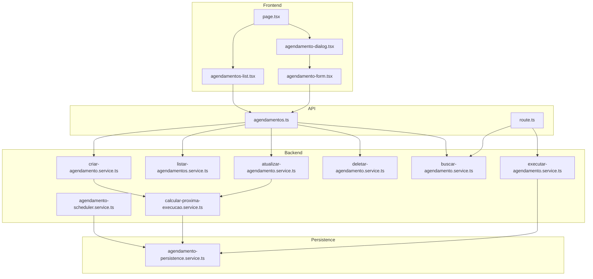
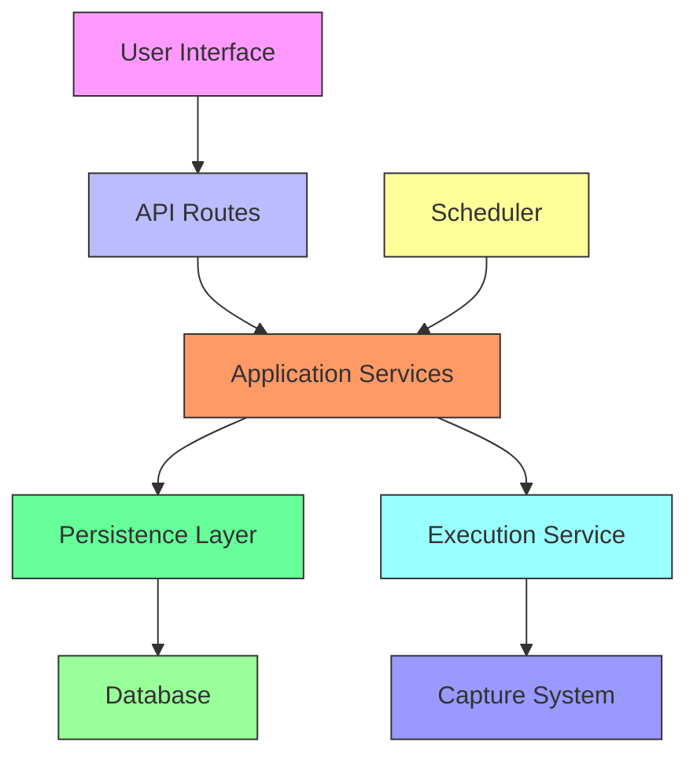
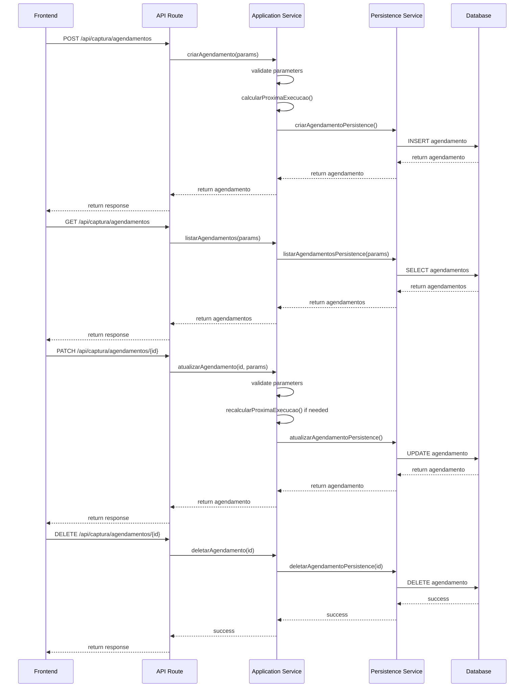
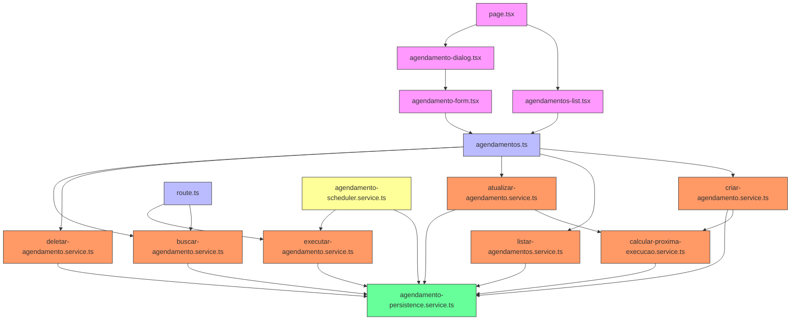

# Agendamentos

<cite>
**Referenced Files in This Document**   
- [agendamentos-list.tsx](file://app/(dashboard)/captura/components/agendamentos/agendamentos-list.tsx)
- [agendamento-form.tsx](file://app/(dashboard)/captura/components/agendamentos/agendamento-form.tsx)
- [agendamento-dialog.tsx](file://app/(dashboard)/captura/components/agendamento-dialog.tsx)
- [page.tsx](file://app/(dashboard)/captura/agendamentos/page.tsx)
- [criar-agendamento.service.ts](file://backend/captura/services/agendamentos/criar-agendamento.service.ts)
- [listar-agendamentos.service.ts](file://backend/captura/services/agendamentos/listar-agendamentos.service.ts)
- [atualizar-agendamento.service.ts](file://backend/captura/services/agendamentos/atualizar-agendamento.service.ts)
- [deletar-agendamento.service.ts](file://backend/captura/services/agendamentos/deletar-agendamento.service.ts)
- [buscar-agendamento.service.ts](file://backend/captura/services/agendamentos/buscar-agendamento.service.ts)
- [agendamento-persistence.service.ts](file://backend/captura/services/persistence/agendamento-persistence.service.ts)
- [agendamento-scheduler.service.ts](file://backend/captura/services/scheduler/agendamento-scheduler.service.ts)
- [executar-agendamento.service.ts](file://backend/captura/services/scheduler/executar-agendamento.service.ts)
- [calcular-proxima-execucao.service.ts](file://backend/captura/services/agendamentos/calcular-proxima-execucao.service.ts)
- [agendamentos.ts](file://app/api/captura/agendamentos/agendamentos.ts)
- [route.ts](file://app/api/captura/agendamentos/[id]/executar/route.ts)
</cite>

## Table of Contents
1. [Introduction](#introduction)
2. [Project Structure](#project-structure)
3. [Core Components](#core-components)
4. [Architecture Overview](#architecture-overview)
5. [Detailed Component Analysis](#detailed-component-analysis)
6. [Dependency Analysis](#dependency-analysis)
7. [Performance Considerations](#performance-considerations)
8. [Troubleshooting Guide](#troubleshooting-guide)
9. [Conclusion](#conclusion)

## Introduction
The Agendamentos (Scheduling) system in the Sinesys application enables automated capture execution from the PJE-TRT platform. This system allows users to create, manage, and monitor scheduled captures with configurable recurrence patterns. The implementation includes a comprehensive frontend interface for managing schedules and a robust backend scheduler that processes these schedules at defined intervals. The system supports various capture types including acervo geral, arquivados, audiencias, pendentes, and partes, with flexible scheduling options such as daily execution or execution at custom intervals. This documentation provides a detailed analysis of the system's architecture, components, and functionality.

## Project Structure
The Agendamentos system is organized across both frontend and backend directories with a clear separation of concerns. The frontend components are located in the `app/(dashboard)/captura/components/agendamentos/` directory, while the backend services reside in `backend/captura/services/agendamentos/` and `backend/captura/services/scheduler/`. The system follows a modular architecture with distinct layers for UI components, API routes, business logic services, and data persistence.



**Diagram sources**
- [agendamento-form.tsx](file://app/(dashboard)/captura/components/agendamentos/agendamento-form.tsx)
- [agendamentos-list.tsx](file://app/(dashboard)/captura/components/agendamentos/agendamentos-list.tsx)
- [agendamento-dialog.tsx](file://app/(dashboard)/captura/components/agendamento-dialog.tsx)
- [page.tsx](file://app/(dashboard)/captura/agendamentos/page.tsx)
- [criar-agendamento.service.ts](file://backend/captura/services/agendamentos/criar-agendamento.service.ts)
- [listar-agendamentos.service.ts](file://backend/captura/services/agendamentos/listar-agendamentos.service.ts)
- [atualizar-agendamento.service.ts](file://backend/captura/services/agendamentos/atualizar-agendamento.service.ts)
- [deletar-agendamento.service.ts](file://backend/captura/services/agendamentos/deletar-agendamento.service.ts)
- [buscar-agendamento.service.ts](file://backend/captura/services/agendamentos/buscar-agendamento.service.ts)
- [agendamento-scheduler.service.ts](file://backend/captura/services/scheduler/agendamento-scheduler.service.ts)
- [executar-agendamento.service.ts](file://backend/captura/services/scheduler/executar-agendamento.service.ts)
- [calcular-proxima-execucao.service.ts](file://backend/captura/services/agendamentos/calcular-proxima-execucao.service.ts)
- [agendamentos.ts](file://app/api/captura/agendamentos/agendamentos.ts)
- [route.ts](file://app/api/captura/agendamentos/[id]/executar/route.ts)
- [agendamento-persistence.service.ts](file://backend/captura/services/persistence/agendamento-persistence.service.ts)

**Section sources**
- [agendamento-form.tsx](file://app/(dashboard)/captura/components/agendamentos/agendamento-form.tsx)
- [agendamentos-list.tsx](file://app/(dashboard)/captura/components/agendamentos/agendamentos-list.tsx)
- [agendamento-dialog.tsx](file://app/(dashboard)/captura/components/agendamento-dialog.tsx)
- [page.tsx](file://app/(dashboard)/captura/agendamentos/page.tsx)

## Core Components
The Agendamentos system consists of several core components that work together to provide a complete scheduling solution. The frontend components include the agendamento-form for creating and editing schedules, agendamentos-list for displaying existing schedules, and agendamento-dialog for managing the creation process. On the backend, the system includes service components for CRUD operations on schedules, a scheduler service for executing scheduled captures, and utility services for calculating execution timing. The integration between frontend and backend is handled through API routes that expose the scheduling functionality to the user interface.

**Section sources**
- [agendamento-form.tsx](file://app/(dashboard)/captura/components/agendamentos/agendamento-form.tsx)
- [agendamentos-list.tsx](file://app/(dashboard)/captura/components/agendamentos/agendamentos-list.tsx)
- [agendamento-dialog.tsx](file://app/(dashboard)/captura/components/agendamento-dialog.tsx)
- [criar-agendamento.service.ts](file://backend/captura/services/agendamentos/criar-agendamento.service.ts)
- [listar-agendamentos.service.ts](file://backend/captura/services/agendamentos/listar-agendamentos.service.ts)
- [atualizar-agendamento.service.ts](file://backend/captura/services/agendamentos/atualizar-agendamento.service.ts)
- [deletar-agendamento.service.ts](file://backend/captura/services/agendamentos/deletar-agendamento.service.ts)
- [buscar-agendamento.service.ts](file://backend/captura/services/agendamentos/buscar-agendamento.service.ts)

## Architecture Overview
The Agendamentos system follows a layered architecture with clear separation between presentation, application logic, and data persistence. The frontend components are built using React with TypeScript, leveraging Next.js for server-side rendering and API routing. The backend services are implemented as modular TypeScript functions that handle specific business operations. The system uses Supabase as the database layer with a dedicated table for storing scheduling information. The scheduler runs periodically (typically every minute) to check for schedules that are ready for execution and processes them accordingly.



**Diagram sources**
- [page.tsx](file://app/(dashboard)/captura/agendamentos/page.tsx)
- [agendamentos.ts](file://app/api/captura/agendamentos/agendamentos.ts)
- [route.ts](file://app/api/captura/agendamentos/[id]/executar/route.ts)
- [criar-agendamento.service.ts](file://backend/captura/services/agendamentos/criar-agendamento.service.ts)
- [listar-agendamentos.service.ts](file://backend/captura/services/agendamentos/listar-agendamentos.service.ts)
- [atualizar-agendamento.service.ts](file://backend/captura/services/agendamentos/atualizar-agendamento.service.ts)
- [deletar-agendamento.service.ts](file://backend/captura/services/agendamentos/deletar-agendamento.service.ts)
- [buscar-agendamento.service.ts](file://backend/captura/services/agendamentos/buscar-agendamento.service.ts)
- [agendamento-scheduler.service.ts](file://backend/captura/services/scheduler/agendamento-scheduler.service.ts)
- [executar-agendamento.service.ts](file://backend/captura/services/scheduler/executar-agendamento.service.ts)
- [agendamento-persistence.service.ts](file://backend/captura/services/persistence/agendamento-persistence.service.ts)

## Detailed Component Analysis

### Frontend Components Analysis
The frontend components of the Agendamentos system provide a user-friendly interface for managing scheduled captures. The agendamento-form component allows users to configure all aspects of a schedule, including capture type, frequency, and timing. The agendamentos-list component displays existing schedules in a tabular format with actions for editing, executing, and deleting schedules. The agendamento-dialog component wraps the form in a modal interface for creating new schedules.

#### Component Hierarchy
```mermaid
classDiagram
class AgendamentosPage {
+agendamentoDialogOpen : boolean
+refreshAgendamentos : number
+buscaAgendamentos : string
+selectedFilterIdsAgendamentos : string[]
+handleAgendamentoSuccess() : void
}
class AgendamentoDialog {
+open : boolean
+onOpenChange : (open : boolean) => void
+onSuccess : () => void
}
class AgendamentoForm {
+advogadoId : number | null
+credenciaisSelecionadas : number[]
+tipoCaptura : TipoCapturaUI | ''
+periodicidade : 'diario' | 'a_cada_N_dias' | ''
+diasIntervalo : number
+horario : string
+dataInicio : string
+dataFim : string
+filtroPrazo : 'no_prazo' | 'sem_prazo' | ''
+isLoading : boolean
+result : { success : boolean | null; error? : string }
+handleSubmit() : Promise~void~
}
class AgendamentosList {
+pagina : number
+limite : number
+agendamentos : Agendamento[]
+paginacao : Paginacao
+isLoading : boolean
+error : string | null
+refetch() : void
+handleToggleAtivo(agendamento : Agendamento) : Promise~void~
+handleExecutar(agendamento : Agendamento) : Promise~void~
+handleDeletar(agendamento : Agendamento) : Promise~void~
}
AgendamentosPage --> AgendamentosList
AgendamentosPage --> AgendamentoDialog
AgendamentoDialog --> AgendamentoForm
```

**Diagram sources**
- [page.tsx](file://app/(dashboard)/captura/agendamentos/page.tsx)
- [agendamento-dialog.tsx](file://app/(dashboard)/captura/components/agendamento-dialog.tsx)
- [agendamento-form.tsx](file://app/(dashboard)/captura/components/agendamentos/agendamento-form.tsx)
- [agendamentos-list.tsx](file://app/(dashboard)/captura/components/agendamentos/agendamentos-list.tsx)

**Section sources**
- [agendamento-form.tsx](file://app/(dashboard)/captura/components/agendamentos/agendamento-form.tsx)
- [agendamentos-list.tsx](file://app/(dashboard)/captura/components/agendamentos/agendamentos-list.tsx)
- [agendamento-dialog.tsx](file://app/(dashboard)/captura/components/agendamento-dialog.tsx)
- [page.tsx](file://app/(dashboard)/captura/agendamentos/page.tsx)

### Backend Services Analysis
The backend services of the Agendamentos system implement the business logic for managing and executing scheduled captures. These services follow a clean architecture pattern with application services orchestrating operations and persistence services handling database interactions. The system includes dedicated services for each CRUD operation, as well as specialized services for scheduling and execution.

#### Service Architecture
```mermaid
classDiagram
class CriarAgendamentoService {
+criarAgendamento(params : CriarAgendamentoParams) : Promise~Agendamento~
}
class ListarAgendamentosService {
+listarAgendamentos(params : ListarAgendamentosParams) : Promise~ListarAgendamentosResult~
}
class AtualizarAgendamentoService {
+atualizarAgendamento(id : number, params : AtualizarAgendamentoParams) : Promise~Agendamento~
}
class DeletarAgendamentoService {
+deletarAgendamento(id : number) : Promise~void~
}
class BuscarAgendamentoService {
+buscarAgendamento(id : number) : Promise~Agendamento | null~
}
class AgendamentoSchedulerService {
+executarScheduler() : Promise~void~
}
class ExecutarAgendamentoService {
+executarAgendamento(agendamento : Agendamento, atualizarProximaExecucao : boolean) : Promise~void~
}
class CalcularProximaExecucaoService {
+calcularProximaExecucao(periodicidade : Periodicidade, dias_intervalo : number | null, horario : string, referencia : Date) : string
+recalcularProximaExecucaoAposExecucao(periodicidade : Periodicidade, dias_intervalo : number | null, horario : string) : string
}
class AgendamentoPersistenceService {
+criarAgendamentoPersistence(params : CriarAgendamentoParams & { proxima_execucao? : string }) : Promise~Agendamento~
+listarAgendamentosPersistence(params : ListarAgendamentosParams) : Promise~{ agendamentos : Agendamento[]; paginacao : Paginacao }~
+atualizarAgendamentoPersistence(id : number, params : AtualizarAgendamentoParams) : Promise~Agendamento~
+deletarAgendamentoPersistence(id : number) : Promise~void~
+buscarAgendamentoPorIdPersistence(id : number) : Promise~Agendamento | null~
+buscarAgendamentosParaExecutar() : Promise~Agendamento[]~
}
CriarAgendamentoService --> CalcularProximaExecucaoService
CriarAgendamentoService --> AgendamentoPersistenceService
AtualizarAgendamentoService --> CalcularProximaExecucaoService
AtualizarAgendamentoService --> AgendamentoPersistenceService
ListarAgendamentosService --> AgendamentoPersistenceService
DeletarAgendamentoService --> AgendamentoPersistenceService
BuscarAgendamentoService --> AgendamentoPersistenceService
AgendamentoSchedulerService --> AgendamentoPersistenceService
AgendamentoSchedulerService --> ExecutarAgendamentoService
```

**Diagram sources**
- [criar-agendamento.service.ts](file://backend/captura/services/agendamentos/criar-agendamento.service.ts)
- [listar-agendamentos.service.ts](file://backend/captura/services/agendamentos/listar-agendamentos.service.ts)
- [atualizar-agendamento.service.ts](file://backend/captura/services/agendamentos/atualizar-agendamento.service.ts)
- [deletar-agendamento.service.ts](file://backend/captura/services/agendamentos/deletar-agendamento.service.ts)
- [buscar-agendamento.service.ts](file://backend/captura/services/agendamentos/buscar-agendamento.service.ts)
- [agendamento-scheduler.service.ts](file://backend/captura/services/scheduler/agendamento-scheduler.service.ts)
- [executar-agendamento.service.ts](file://backend/captura/services/scheduler/executar-agendamento.service.ts)
- [calcular-proxima-execucao.service.ts](file://backend/captura/services/agendamentos/calcular-proxima-execucao.service.ts)
- [agendamento-persistence.service.ts](file://backend/captura/services/persistence/agendamento-persistence.service.ts)

**Section sources**
- [criar-agendamento.service.ts](file://backend/captura/services/agendamentos/criar-agendamento.service.ts)
- [listar-agendamentos.service.ts](file://backend/captura/services/agendamentos/listar-agendamentos.service.ts)
- [atualizar-agendamento.service.ts](file://backend/captura/services/agendamentos/atualizar-agendamento.service.ts)
- [deletar-agendamento.service.ts](file://backend/captura/services/agendamentos/deletar-agendamento.service.ts)
- [buscar-agendamento.service.ts](file://backend/captura/services/agendamentos/buscar-agendamento.service.ts)
- [agendamento-scheduler.service.ts](file://backend/captura/services/scheduler/agendamento-scheduler.service.ts)
- [executar-agendamento.service.ts](file://backend/captura/services/scheduler/executar-agendamento.service.ts)
- [calcular-proxima-execucao.service.ts](file://backend/captura/services/agendamentos/calcular-proxima-execucao.service.ts)
- [agendamento-persistence.service.ts](file://backend/captura/services/persistence/agendamento-persistence.service.ts)

### Scheduling Logic Analysis
The scheduling logic in the Agendamentos system is designed to handle various recurrence patterns and ensure reliable execution of scheduled captures. The system calculates the next execution time when a schedule is created or updated, and updates this time after each successful execution. The scheduler runs periodically to check for schedules that are ready for execution based on their next execution time.

#### Scheduling Workflow
```mermaid
flowchart TD
A[Create or Update Schedule] --> B{Validate Parameters}
B --> |Valid| C[Calculate Next Execution]
B --> |Invalid| D[Return Error]
C --> E[Store Schedule with Next Execution Time]
E --> F[Scheduler Runs Periodically]
F --> G[Find Schedules with next_execution <= now()]
G --> H{Schedules Found?}
H --> |Yes| I[Execute Each Schedule]
H --> |No| J[Log No Schedules Ready]
I --> K[Update Next Execution Time]
K --> L[Log Execution Result]
L --> M[Continue to Next Schedule]
M --> H
J --> N[End Process]
style A fill:#f9f,stroke:#333
style B fill:#ff9,stroke:#333
style C fill:#9f9,stroke:#333
style D fill:#f99,stroke:#333
style E fill:#9ff,stroke:#333
style F fill:#ff9,stroke:#333
style G fill:#9f9,stroke:#333
style H fill:#ff9,stroke:#333
style I fill:#9f9,stroke:#333
style J fill:#9f9,stroke:#333
style K fill:#9ff,stroke:#333
style L fill:#9f9,stroke:#333
style M fill:#9f9,stroke:#333
style N fill:#9f9,stroke:#333
```

**Diagram sources**
- [calcular-proxima-execucao.service.ts](file://backend/captura/services/agendamentos/calcular-proxima-execucao.service.ts)
- [agendamento-scheduler.service.ts](file://backend/captura/services/scheduler/agendamento-scheduler.service.ts)
- [executar-agendamento.service.ts](file://backend/captura/services/scheduler/executar-agendamento.service.ts)
- [agendamento-persistence.service.ts](file://backend/captura/services/persistence/agendamento-persistence.service.ts)

**Section sources**
- [calcular-proxima-execucao.service.ts](file://backend/captura/services/agendamentos/calcular-proxima-execucao.service.ts)
- [agendamento-scheduler.service.ts](file://backend/captura/services/scheduler/agendamento-scheduler.service.ts)
- [executar-agendamento.service.ts](file://backend/captura/services/scheduler/executar-agendamento.service.ts)

### API Integration Analysis
The API integration between the frontend and backend components of the Agendamentos system is designed to provide a seamless user experience while maintaining robust error handling and validation. The system exposes RESTful endpoints for all scheduling operations, with proper authentication and input validation.

#### API Workflow


**Diagram sources**
- [agendamentos.ts](file://app/api/captura/agendamentos/agendamentos.ts)
- [route.ts](file://app/api/captura/agendamentos/[id]/executar/route.ts)
- [criar-agendamento.service.ts](file://backend/captura/services/agendamentos/criar-agendamento.service.ts)
- [listar-agendamentos.service.ts](file://backend/captura/services/agendamentos/listar-agendamentos.service.ts)
- [atualizar-agendamento.service.ts](file://backend/captura/services/agendamentos/atualizar-agendamento.service.ts)
- [deletar-agendamento.service.ts](file://backend/captura/services/agendamentos/deletar-agendamento.service.ts)
- [buscar-agendamento.service.ts](file://backend/captura/services/agendamentos/buscar-agendamento.service.ts)
- [agendamento-persistence.service.ts](file://backend/captura/services/persistence/agendamento-persistence.service.ts)

**Section sources**
- [agendamentos.ts](file://app/api/captura/agendamentos/agendamentos.ts)
- [route.ts](file://app/api/captura/agendamentos/[id]/executar/route.ts)

## Dependency Analysis
The Agendamentos system has a well-defined dependency structure that ensures modularity and maintainability. The frontend components depend on backend services through API routes, while backend services have dependencies on persistence layers and utility functions. The system uses a service-oriented architecture where each component has a single responsibility and clear interfaces.



**Diagram sources**
- [agendamento-form.tsx](file://app/(dashboard)/captura/components/agendamentos/agendamento-form.tsx)
- [agendamentos-list.tsx](file://app/(dashboard)/captura/components/agendamentos/agendamentos-list.tsx)
- [agendamento-dialog.tsx](file://app/(dashboard)/captura/components/agendamento-dialog.tsx)
- [page.tsx](file://app/(dashboard)/captura/agendamentos/page.tsx)
- [agendamentos.ts](file://app/api/captura/agendamentos/agendamentos.ts)
- [route.ts](file://app/api/captura/agendamentos/[id]/executar/route.ts)
- [criar-agendamento.service.ts](file://backend/captura/services/agendamentos/criar-agendamento.service.ts)
- [listar-agendamentos.service.ts](file://backend/captura/services/agendamentos/listar-agendamentos.service.ts)
- [atualizar-agendamento.service.ts](file://backend/captura/services/agendamentos/atualizar-agendamento.service.ts)
- [deletar-agendamento.service.ts](file://backend/captura/services/agendamentos/deletar-agendamento.service.ts)
- [buscar-agendamento.service.ts](file://backend/captura/services/agendamentos/buscar-agendamento.service.ts)
- [executar-agendamento.service.ts](file://backend/captura/services/scheduler/executar-agendamento.service.ts)
- [calcular-proxima-execucao.service.ts](file://backend/captura/services/agendamentos/calcular-proxima-execucao.service.ts)
- [agendamento-persistence.service.ts](file://backend/captura/services/persistence/agendamento-persistence.service.ts)
- [agendamento-scheduler.service.ts](file://backend/captura/services/scheduler/agendamento-scheduler.service.ts)

**Section sources**
- [agendamento-form.tsx](file://app/(dashboard)/captura/components/agendamentos/agendamento-form.tsx)
- [agendamentos-list.tsx](file://app/(dashboard)/captura/components/agendamentos/agendamentos-list.tsx)
- [agendamento-dialog.tsx](file://app/(dashboard)/captura/components/agendamento-dialog.tsx)
- [page.tsx](file://app/(dashboard)/captura/agendamentos/page.tsx)
- [agendamentos.ts](file://app/api/captura/agendamentos/agendamentos.ts)
- [route.ts](file://app/api/captura/agendamentos/[id]/executar/route.ts)
- [criar-agendamento.service.ts](file://backend/captura/services/agendamentos/criar-agendamento.service.ts)
- [listar-agendamentos.service.ts](file://backend/captura/services/agendamentos/listar-agendamentos.service.ts)
- [atualizar-agendamento.service.ts](file://backend/captura/services/agendamentos/atualizar-agendamento.service.ts)
- [deletar-agendamento.service.ts](file://backend/captura/services/agendamentos/deletar-agendamento.service.ts)
- [buscar-agendamento.service.ts](file://backend/captura/services/agendamentos/buscar-agendamento.service.ts)
- [executar-agendamento.service.ts](file://backend/captura/services/scheduler/executar-agendamento.service.ts)
- [calcular-proxima-execucao.service.ts](file://backend/captura/services/agendamentos/calcular-proxima-execucao.service.ts)
- [agendamento-persistence.service.ts](file://backend/captura/services/persistence/agendamento-persistence.service.ts)
- [agendamento-scheduler.service.ts](file://backend/captura/services/scheduler/agendamento-scheduler.service.ts)

## Performance Considerations
The Agendamentos system has been designed with performance optimization in mind, particularly for handling large numbers of scheduled captures. The system uses efficient database queries with pagination and filtering to prevent performance degradation when retrieving schedules. The scheduler implementation processes schedules sequentially to avoid overwhelming system resources, with error handling that allows the process to continue even if individual schedules fail. The system also includes proper indexing on the agendamentos table to optimize queries based on execution time, which is critical for the scheduler's performance.

For large-scale deployments, the system could be enhanced with additional performance optimizations such as:
- Implementing a queue-based system for schedule execution to handle high volumes
- Adding caching mechanisms for frequently accessed schedule data
- Optimizing the scheduler frequency based on system load
- Implementing batch processing for multiple schedules
- Adding monitoring and alerting for performance metrics

**Section sources**
- [agendamento-persistence.service.ts](file://backend/captura/services/persistence/agendamento-persistence.service.ts)
- [agendamento-scheduler.service.ts](file://backend/captura/services/scheduler/agendamento-scheduler.service.ts)
- [listar-agendamentos.service.ts](file://backend/captura/services/agendamentos/listar-agendamentos.service.ts)

## Troubleshooting Guide
The Agendamentos system includes several mechanisms for handling common issues that may arise during operation. For missed executions, the system logs detailed information about the scheduler runs and execution attempts, which can be used to diagnose timing issues. The system handles timezone considerations by using ISO timestamps throughout, ensuring consistent time representation across different components.

Common issues and their solutions include:

1. **Missed Executions**: Check the scheduler logs to verify it is running at the expected frequency. Ensure the server clock is synchronized and the timezone configuration is correct.

2. **Timezone Handling**: The system uses UTC timestamps internally, but displays times in the user's local timezone. Ensure the frontend and backend are configured to handle timezone conversions correctly.

3. **Performance with Large Numbers of Schedules**: Monitor database query performance and consider adding additional indexes on frequently queried fields. For very large numbers of schedules, consider implementing a sharding strategy.

4. **Validation Errors**: The system includes comprehensive validation for schedule parameters. Check the error messages returned by the API to identify and correct invalid inputs.

5. **Conflict Resolution**: The system handles conflicts by processing schedules sequentially and logging errors without stopping the entire process. This ensures that a failure in one schedule does not affect others.

**Section sources**
- [agendamento-scheduler.service.ts](file://backend/captura/services/scheduler/agendamento-scheduler.service.ts)
- [agendamento-persistence.service.ts](file://backend/captura/services/persistence/agendamento-persistence.service.ts)
- [calcular-proxima-execucao.service.ts](file://backend/captura/services/agendamentos/calcular-proxima-execucao.service.ts)
- [agendamento-form.tsx](file://app/(dashboard)/captura/components/agendamentos/agendamento-form.tsx)

## Conclusion
The Agendamentos system in the Sinesys application provides a comprehensive solution for automating capture operations from the PJE-TRT platform. The system's architecture combines a user-friendly frontend interface with a robust backend implementation that ensures reliable execution of scheduled captures. The modular design with clear separation of concerns makes the system maintainable and extensible. The scheduling logic handles various recurrence patterns and includes mechanisms for error recovery and conflict resolution. The integration between frontend and backend is well-designed with proper validation and error handling. The system is optimized for performance and includes features to handle common issues such as missed executions and timezone considerations. Overall, the Agendamentos system represents a well-engineered solution that effectively meets the requirements for automated capture scheduling.