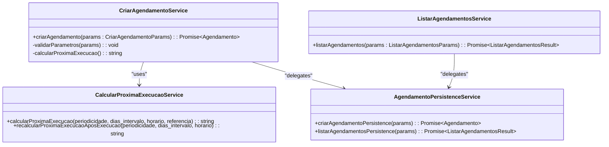

# Scheduled Captures Management

<cite>
**Referenced Files in This Document**   
- [agendamentos-list.tsx](file://app/(dashboard)/captura/components/agendamentos/agendamentos-list.tsx)
- [agendamento-form.tsx](file://app/(dashboard)/captura/components/agendamentos/agendamento-form.tsx)
- [criar-agendamento.service.ts](file://backend/captura/services/agendamentos/criar-agendamento.service.ts)
- [listar-agendamentos.service.ts](file://backend/captura/services/agendamentos/listar-agendamentos.service.ts)
- [agendamentos-types.ts](file://backend/types/captura/agendamentos-types.ts)
- [use-agendamentos.ts](file://app/_lib/hooks/use-agendamentos.ts)
- [calcular-proxima-execucao.service.ts](file://backend/captura/services/agendamentos/calcular-proxima-execucao.service.ts)
- [route.ts](file://app/api/captura/agendamentos/route.ts)
</cite>

## Table of Contents
1. [Introduction](#introduction)
2. [Project Structure](#project-structure)
3. [Core Components](#core-components)
4. [Architecture Overview](#architecture-overview)
5. [Detailed Component Analysis](#detailed-component-analysis)
6. [Dependency Analysis](#dependency-analysis)
7. [Performance Considerations](#performance-considerations)
8. [Troubleshooting Guide](#troubleshooting-guide)
9. [Conclusion](#conclusion)

## Introduction
The Scheduled Captures Management interface in the Sinesys application provides a comprehensive system for automating data capture from various tribunal sources. This document details the implementation of the agendamentos-list.tsx and agendamento-form.tsx components for managing scheduled captures, along with the backend services that support CRUD operations for capture schedules. The system enables users to create, edit, filter, and manage capture schedules with various frequency patterns, tribunal selections, credential associations, and process filters.

## Project Structure
The Scheduled Captures Management functionality is organized within the Sinesys application under the captura module, with frontend components separated from backend services. The structure follows a clean separation of concerns between UI presentation, business logic, and data persistence layers.

**Diagram sources**
- [agendamento-form.tsx](file://app/(dashboard)/captura/components/agendamentos/agendamento-form.tsx)
- [agendamentos-list.tsx](file://app/(dashboard)/captura/components/agendamentos/agendamentos-list.tsx)
- [criar-agendamento.service.ts](file://backend/captura/services/agendamentos/criar-agendamento.service.ts)
- [listar-agendamentos.service.ts](file://backend/captura/services/agendamentos/listar-agendamentos.service.ts)

**Section sources**
- [agendamento-form.tsx](file://app/(dashboard)/captura/components/agendamentos/agendamento-form.tsx)
- [agendamentos-list.tsx](file://app/(dashboard)/captura/components/agendamentos/agendamentos-list.tsx)
- [criar-agendamento.service.ts](file://backend/captura/services/agendamentos/criar-agendamento.service.ts)
- [listar-agendamentos.service.ts](file://backend/captura/services/agendamentos/listar-agendamentos.service.ts)

## Core Components
The Scheduled Captures Management interface consists of two primary frontend components: agendamentos-list.tsx for displaying and managing existing schedules with filtering and pagination capabilities, and agendamento-form.tsx for creating and editing capture schedules with comprehensive form validation. These components interact with backend services through API routes to perform CRUD operations on capture schedules, with the system supporting various frequency patterns, tribunal selections, credential associations, and process filters.

**Section sources**
- [agendamentos-list.tsx](file://app/(dashboard)/captura/components/agendamentos/agendamentos-list.tsx)
- [agendamento-form.tsx](file://app/(dashboard)/captura/components/agendamentos/agendamento-form.tsx)

## Architecture Overview
The Scheduled Captures Management system follows a client-server architecture with React-based frontend components communicating with backend services through API routes. The frontend utilizes a hook-based data fetching pattern with use-agendamentos.ts to retrieve and manage schedule data, while the backend implements service-oriented architecture with dedicated services for creating, listing, and calculating execution times for capture schedules.

**Diagram sources**
- [agendamentos-list.tsx](file://app/(dashboard)/captura/components/agendamentos/agendamentos-list.tsx)
- [use-agendamentos.ts](file://app/_lib/hooks/use-agendamentos.ts)
- [route.ts](file://app/api/captura/agendamentos/route.ts)
- [criar-agendamento.service.ts](file://backend/captura/services/agendamentos/criar-agendamento.service.ts)
- [calcular-proxima-execucao.service.ts](file://backend/captura/services/agendamentos/calcular-proxima-execucao.service.ts)

## Detailed Component Analysis

### agendamentos-list.tsx Analysis
The agendamentos-list.tsx component provides a comprehensive interface for displaying, filtering, and managing scheduled captures with pagination and status indicators. It implements a data table with columns for schedule ID, capture type, lawyer ID, frequency, time, status, last execution, and next execution, along with action buttons for toggling activation, executing immediately, editing, and deleting schedules.

**Diagram sources**
- [agendamentos-list.tsx](file://app/(dashboard)/captura/components/agendamentos/agendamentos-list.tsx)
- [agendamentos-types.ts](file://backend/types/captura/agendamentos-types.ts)

**Section sources**
- [agendamentos-list.tsx](file://app/(dashboard)/captura/components/agendamentos/agendamentos-list.tsx)

### agendamento-form.tsx Analysis
The agendamento-form.tsx component provides a user-friendly interface for creating and editing capture schedules with comprehensive form validation and error handling. It implements a two-column layout with primary settings (capture type, frequency, interval, time) in the first column and type-specific parameters in the second column, with conditional rendering based on the selected capture type.

**Diagram sources**
- [agendamento-form.tsx](file://app/(dashboard)/captura/components/agendamentos/agendamento-form.tsx)

**Section sources**
- [agendamento-form.tsx](file://app/(dashboard)/captura/components/agendamentos/agendamento-form.tsx)

### Backend Services Analysis
The backend services for Scheduled Captures Management implement a clean separation of concerns between application logic and data persistence. The criar-agendamento.service.ts handles the creation of new schedules with validation and next execution calculation, while listar-agendamentos.service.ts manages retrieval of existing schedules with filtering and pagination capabilities.

**Diagram sources**
- [criar-agendamento.service.ts](file://backend/captura/services/agendamentos/criar-agendamento.service.ts)
- [listar-agendamentos.service.ts](file://backend/captura/services/agendamentos/listar-agendamentos.service.ts)
- [calcular-proxima-execucao.service.ts](file://backend/captura/services/agendamentos/calcular-proxima-execucao.service.ts)

**Section sources**
- [criar-agendamento.service.ts](file://backend/captura/services/agendamentos/criar-agendamento.service.ts)
- [listar-agendamentos.service.ts](file://backend/captura/services/agendamentos/listar-agendamentos.service.ts)
- [calcular-proxima-execucao.service.ts](file://backend/captura/services/agendamentos/calcular-proxima-execucao.service.ts)

## Dependency Analysis
The Scheduled Captures Management system has a well-defined dependency structure with clear boundaries between frontend and backend components. The frontend components depend on shared UI components and hooks, while the backend services follow a layered architecture with application services depending on persistence services.

**Diagram sources**
- [agendamento-form.tsx](file://app/(dashboard)/captura/components/agendamentos/agendamento-form.tsx)
- [agendamentos-list.tsx](file://app/(dashboard)/captura/components/agendamentos/agendamentos-list.tsx)
- [criar-agendamento.service.ts](file://backend/captura/services/agendamentos/criar-agendamento.service.ts)
- [listar-agendamentos.service.ts](file://backend/captura/services/agendamentos/listar-agendamentos.service.ts)

**Section sources**
- [agendamento-form.tsx](file://app/(dashboard)/captura/components/agendamentos/agendamento-form.tsx)
- [agendamentos-list.tsx](file://app/(dashboard)/captura/components/agendamentos/agendamentos-list.tsx)
- [criar-agendamento.service.ts](file://backend/captura/services/agendamentos/criar-agendamento.service.ts)
- [listar-agendamentos.service.ts](file://backend/captura/services/agendamentos/listar-agendamentos.service.ts)

## Performance Considerations
The Scheduled Captures Management system implements several performance optimizations, including efficient data fetching with pagination in the use-agendamentos hook, memoization of table columns in agendamentos-list.tsx, and server-side validation to prevent unnecessary database operations. The backend services are designed to minimize database queries by combining operations where possible and using efficient indexing on frequently queried fields.

## Troubleshooting Guide
Common issues in the Scheduled Captures Management system include form validation errors, duplicate schedule creation, and timezone display inconsistencies. The system addresses these through comprehensive client-side validation in agendamento-form.tsx, server-side validation in criar-agendamento.service.ts, and consistent use of ISO timestamps throughout the system. For form validation errors, ensure all required fields are filled with valid data according to the specified formats. For duplicate schedules, the system should implement unique constraints at the database level. For timezone issues, ensure all datetime operations use consistent timezone handling, preferably UTC for storage and display in the user's local timezone.

**Section sources**
- [agendamento-form.tsx](file://app/(dashboard)/captura/components/agendamentos/agendamento-form.tsx)
- [criar-agendamento.service.ts](file://backend/captura/services/agendamentos/criar-agendamento.service.ts)
- [calcular-proxima-execucao.service.ts](file://backend/captura/services/agendamentos/calcular-proxima-execucao.service.ts)

## Conclusion
The Scheduled Captures Management interface in the Sinesys application provides a robust and user-friendly system for automating data capture from tribunal sources. The implementation follows modern React patterns with a clean separation between frontend and backend concerns, comprehensive validation at both client and server levels, and efficient data handling through pagination and optimized API calls. The system supports various capture types with specific parameters, flexible scheduling options, and real-time status updates, making it a powerful tool for managing automated data collection processes.