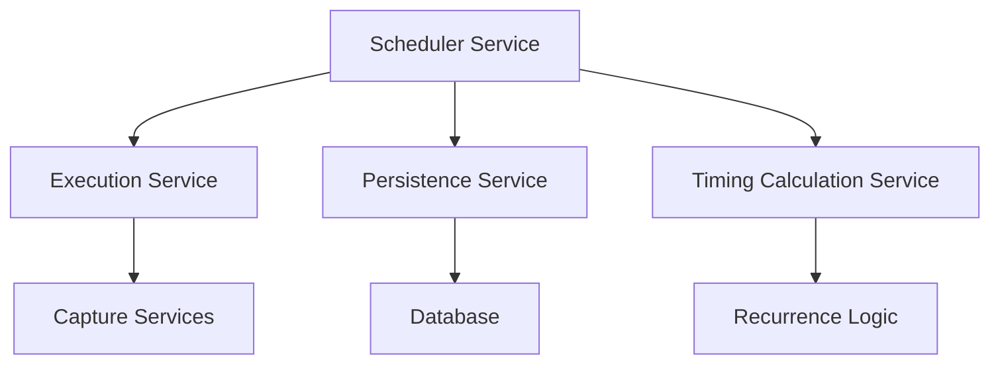
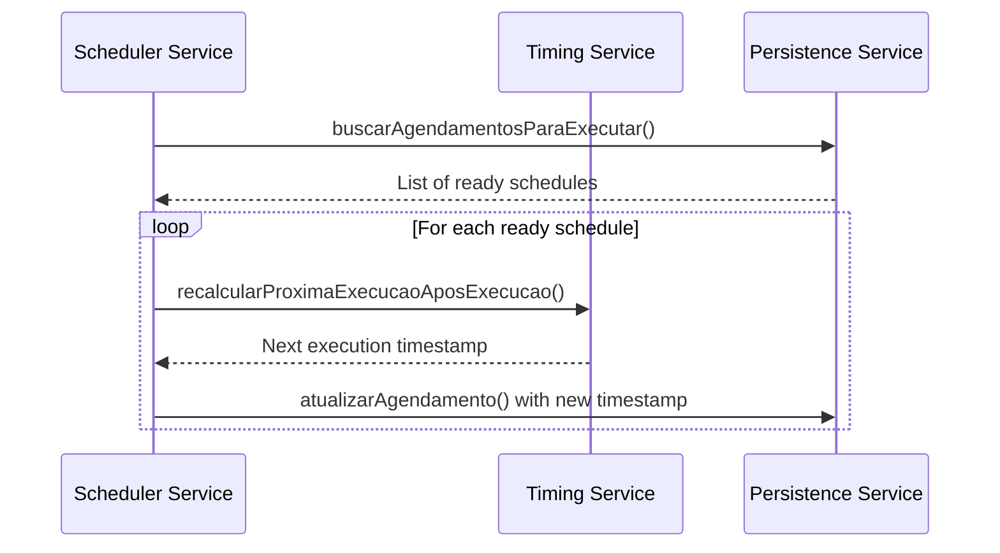
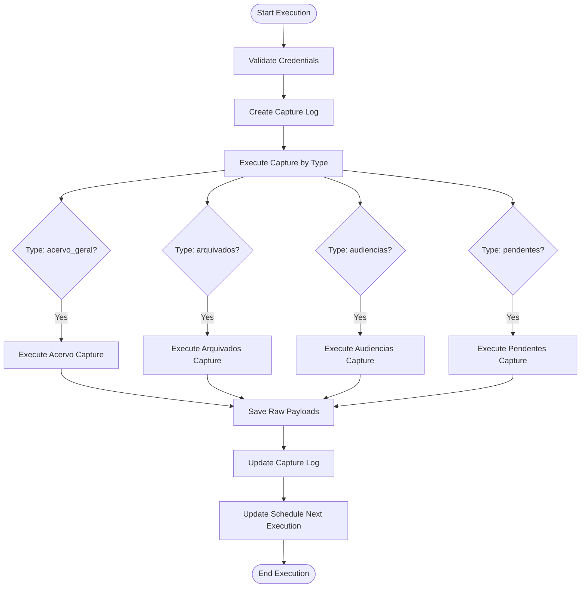
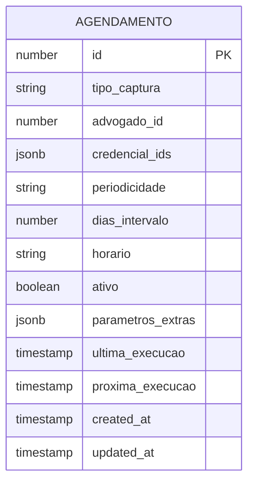
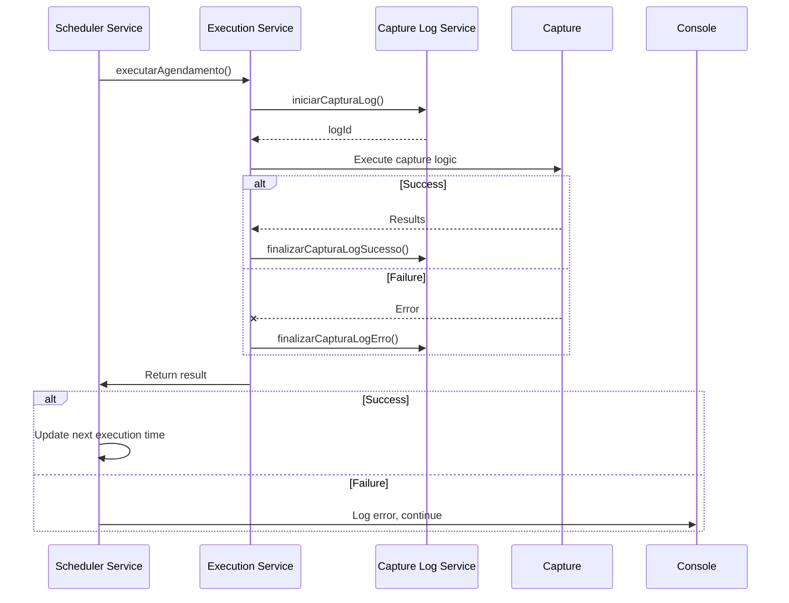
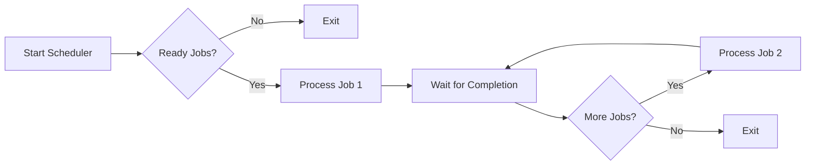
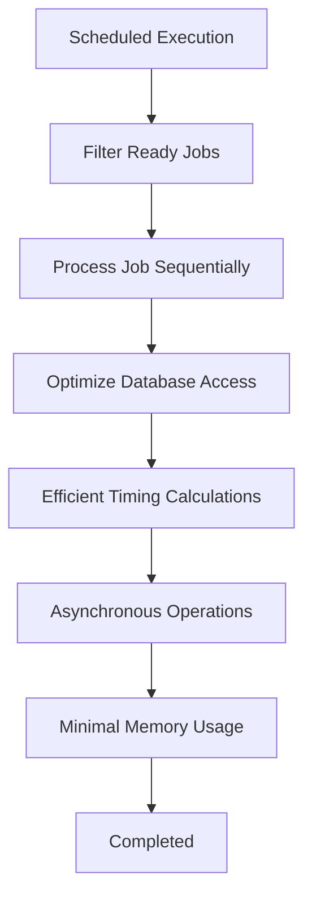
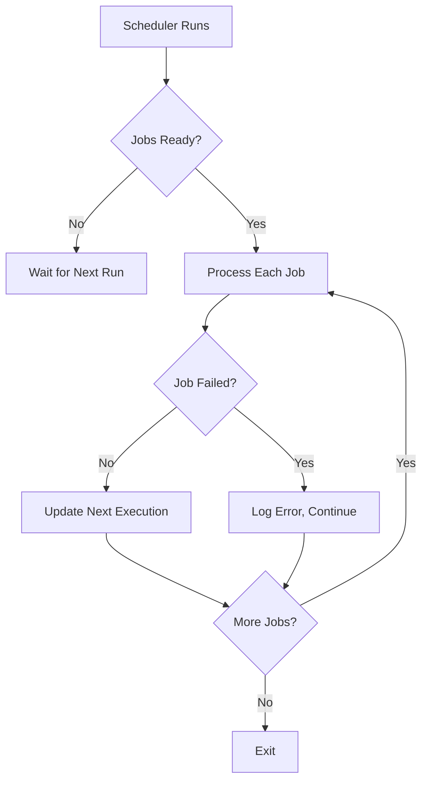
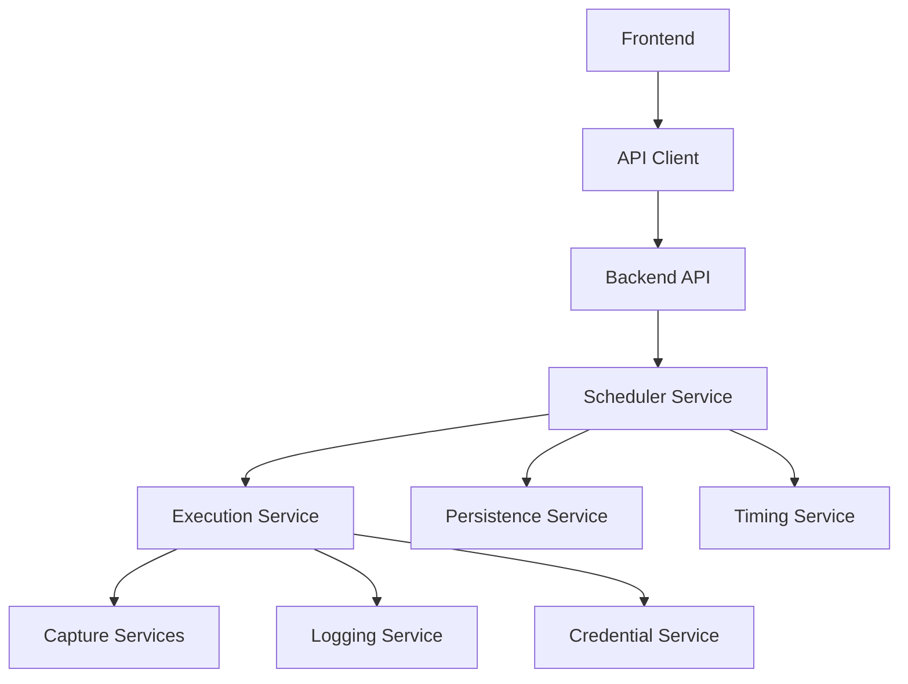

# Scheduler Engine

<cite>
**Referenced Files in This Document**   
- [agendamento-scheduler.service.ts](file://backend/captura/services/scheduler/agendamento-scheduler.service.ts)
- [executar-agendamento.service.ts](file://backend/captura/services/scheduler/executar-agendamento.service.ts)
- [calcular-proxima-execucao.service.ts](file://backend/captura/services/agendamentos/calcular-proxima-execucao.service.ts)
- [agendamento-persistence.service.ts](file://backend/captura/services/persistence/agendamento-persistence.service.ts)
- [agendamentos-types.ts](file://backend/types/captura/agendamentos-types.ts)
- [atualizar-agendamento.service.ts](file://backend/captura/services/agendamentos/atualizar-agendamento.service.ts)
- [captura-log.service.ts](file://backend/captura/services/captura-log.service.ts)
- [agendamentos.ts](file://app/api/captura/agendamentos/agendamentos.ts)
</cite>

## Table of Contents
1. [Introduction](#introduction)
2. [Scheduler Architecture](#scheduler-architecture)
3. [Scheduling Algorithm and Execution Timing](#scheduling-algorithm-and-execution-timing)
4. [Concurrency Control and Job Execution](#concurrency-control-and-job-execution)
5. [Persistence Layer](#persistence-layer)
6. [Error Handling and Retry Mechanisms](#error-handling-and-retry-mechanisms)
7. [Resource Management](#resource-management)
8. [Performance Optimization](#performance-optimization)
9. [Common Issues and Solutions](#common-issues-and-solutions)
10. [Integration Points](#integration-points)

## Introduction

The Scheduler Engine in the Sinesys application is responsible for managing the execution of scheduled captures from various court systems. This document provides a comprehensive analysis of the implementation, focusing on the core components that enable automated capture scheduling, execution, and state management. The system is designed to handle multiple types of captures including acervo geral, arquivados, audiencias, and pendentes, with support for different recurrence patterns and error handling mechanisms.

The scheduler operates as a periodic service that checks for ready-to-execute scheduled tasks and processes them accordingly. It integrates with various backend services to execute capture jobs, calculate next execution times, and maintain the state of scheduled jobs in the database. The system is designed to be resilient, handling failures gracefully while ensuring that scheduled captures are executed according to their defined recurrence patterns.

**Section sources**
- [agendamento-scheduler.service.ts](file://backend/captura/services/scheduler/agendamento-scheduler.service.ts#L1-L43)

## Scheduler Architecture

The Scheduler Engine follows a modular architecture with clear separation of concerns between scheduling, execution, persistence, and timing calculation components. The core architecture consists of four main services that work together to manage scheduled captures:

1. **agendamento-scheduler.service.ts**: The main scheduler service that orchestrates the execution of scheduled captures
2. **executar-agendamento.service.ts**: Handles the execution of individual capture jobs
3. **calcular-proxima-execucao.service.ts**: Determines the next execution time based on recurrence patterns
4. **agendamento-persistence.service.ts**: Manages the storage and retrieval of schedule state

The architecture follows a layered approach where the scheduler service acts as the coordinator, delegating specific responsibilities to specialized services. This design promotes maintainability and allows for independent evolution of each component.

**Diagram sources**
- [agendamento-scheduler.service.ts](file://backend/captura/services/scheduler/agendamento-scheduler.service.ts#L1-L43)
- [executar-agendamento.service.ts](file://backend/captura/services/scheduler/executar-agendamento.service.ts#L1-L485)
- [calcular-proxima-execucao.service.ts](file://backend/captura/services/agendamentos/calcular-proxima-execucao.service.ts#L1-L87)
- [agendamento-persistence.service.ts](file://backend/captura/services/persistence/agendamento-persistence.service.ts#L1-L247)

**Section sources**
- [agendamento-scheduler.service.ts](file://backend/captura/services/scheduler/agendamento-scheduler.service.ts#L1-L43)
- [executar-agendamento.service.ts](file://backend/captura/services/scheduler/executar-agendamento.service.ts#L1-L485)
- [calcular-proxima-execucao.service.ts](file://backend/captura/services/agendamentos/calcular-proxima-execucao.service.ts#L1-L87)
- [agendamento-persistence.service.ts](file://backend/captura/services/persistence/agendamento-persistence.service.ts#L1-L247)

## Scheduling Algorithm and Execution Timing

The scheduling algorithm in the Sinesys application is designed to handle two types of recurrence patterns: daily execution and execution at custom intervals. The algorithm is implemented in the `calcular-proxima-execucao.service.ts` file and supports the following periodicity types:

- **diario**: Executes the capture job every day at the specified time
- **a_cada_N_dias**: Executes the capture job every N days at the specified time

The algorithm calculates the next execution time based on the current time, the recurrence pattern, and the scheduled time. For daily executions, the next execution is always set to the same time on the following day. For custom interval executions, the next execution is calculated by adding the specified number of days to the current date.

The execution timing is determined by the `horario` field in the Agendamento interface, which stores the time in HH:mm format. The scheduler service runs periodically (typically every minute) to check for scheduled captures that are ready to execute based on their `proxima_execucao` timestamp.

**Diagram sources**
- [calcular-proxima-execucao.service.ts](file://backend/captura/services/agendamentos/calcular-proxima-execucao.service.ts#L1-L87)
- [agendamento-persistence.service.ts](file://backend/captura/services/persistence/agendamento-persistence.service.ts#L1-L247)

**Section sources**
- [calcular-proxima-execucao.service.ts](file://backend/captura/services/agendamentos/calcular-proxima-execucao.service.ts#L1-L87)
- [agendamentos-types.ts](file://backend/types/captura/agendamentos-types.ts#L1-L86)

## Concurrency Control and Job Execution

The Scheduler Engine implements a sequential execution model to manage concurrency and prevent resource exhaustion. When the scheduler runs, it processes each ready-to-execute capture job one at a time in a sequential manner. This approach ensures that system resources are not overwhelmed by concurrent capture operations, which could lead to performance degradation or failures.

The job execution is handled by the `executar-agendamento.service.ts` file, which coordinates the execution of capture jobs for different types of captures (acervo_geral, arquivados, audiencias, pendentes). Each capture job is executed with the following steps:

1. Retrieve credentials for the capture
2. Initialize a capture log entry
3. Execute the capture based on the capture type
4. Process the results and store raw payloads
5. Update the capture log with success or failure status
6. Update the schedule with the next execution time

The service handles multiple credentials for a single capture job by processing them sequentially. For capture types that support multiple filters (like 'pendentes' with 'no_prazo' and 'sem_prazo' filters), the service executes each filter separately and aggregates the results.

**Diagram sources**
- [executar-agendamento.service.ts](file://backend/captura/services/scheduler/executar-agendamento.service.ts#L1-L485)

**Section sources**
- [executar-agendamento.service.ts](file://backend/captura/services/scheduler/executar-agendamento.service.ts#L1-L485)

## Persistence Layer

The persistence layer of the Scheduler Engine is implemented in the `agendamento-persistence.service.ts` file and provides CRUD operations for managing scheduled captures in the database. The service uses Supabase as the underlying database technology and interacts with the 'agendamentos' table to store and retrieve schedule state.

The Agendamento interface defines the structure of a scheduled capture with the following key properties:

- **id**: Unique identifier for the schedule
- **tipo_captura**: Type of capture to execute
- **advogado_id**: ID of the lawyer associated with the capture
- **credencial_ids**: Array of credential IDs to use for the capture
- **periodicidade**: Recurrence pattern ('diario' or 'a_cada_N_dias')
- **dias_intervalo**: Number of days between executions (for 'a_cada_N_dias' pattern)
- **horario**: Time of day to execute the capture (HH:mm format)
- **ativo**: Flag indicating if the schedule is active
- **parametros_extras**: Additional parameters specific to the capture type
- **ultima_execucao**: Timestamp of the last execution
- **proxima_execucao**: Timestamp of the next scheduled execution

The persistence service provides methods for creating, reading, updating, and deleting scheduled captures, as well as specialized methods for listing captures with pagination and filters, and finding captures ready for execution.

**Diagram sources**
- [agendamento-persistence.service.ts](file://backend/captura/services/persistence/agendamento-persistence.service.ts#L1-L247)
- [agendamentos-types.ts](file://backend/types/captura/agendamentos-types.ts#L1-L86)

**Section sources**
- [agendamento-persistence.service.ts](file://backend/captura/services/persistence/agendamento-persistence.service.ts#L1-L247)
- [agendamentos-types.ts](file://backend/types/captura/agendamentos-types.ts#L1-L86)

## Error Handling and Retry Mechanisms

The Scheduler Engine implements comprehensive error handling to ensure reliability and resilience in the face of failures. The error handling strategy is implemented across multiple layers of the system and follows these principles:

1. **Graceful Failure**: When a capture job fails, the system logs the error and continues processing other scheduled captures
2. **Detailed Error Logging**: Errors are captured with sufficient context to enable debugging and troubleshooting
3. **Automatic Retry**: The next execution is automatically rescheduled according to the recurrence pattern, effectively implementing a retry mechanism

The error handling is implemented in both the scheduler service and the execution service. In the scheduler service, each capture job is executed in a try-catch block, ensuring that a failure in one job does not prevent the execution of subsequent jobs.

The execution service captures errors at multiple levels:
- Credential retrieval failures
- Tribunal configuration lookup failures
- Capture execution failures for specific credentials
- Database update failures

For capture types that support multiple filters (like 'pendentes'), the service implements granular error handling, allowing successful filters to complete even if others fail. This ensures maximum data retrieval even in partially failing scenarios.

**Diagram sources**
- [agendamento-scheduler.service.ts](file://backend/captura/services/scheduler/agendamento-scheduler.service.ts#L1-L43)
- [executar-agendamento.service.ts](file://backend/captura/services/scheduler/executar-agendamento.service.ts#L1-L485)
- [captura-log.service.ts](file://backend/captura/services/captura-log.service.ts#L1-L66)

**Section sources**
- [agendamento-scheduler.service.ts](file://backend/captura/services/scheduler/agendamento-scheduler.service.ts#L1-L43)
- [executar-agendamento.service.ts](file://backend/captura/services/scheduler/executar-agendamento.service.ts#L1-L485)

## Resource Management

The Scheduler Engine implements several resource management strategies to ensure efficient use of system resources and prevent exhaustion. The primary resource management approach is sequential execution of capture jobs, which prevents the system from being overwhelmed by concurrent operations.

The service manages the following resources:

1. **Database Connections**: By executing jobs sequentially, the system limits the number of concurrent database operations
2. **Memory Usage**: Processing one job at a time reduces peak memory consumption
3. **Network Resources**: Sequential execution prevents overwhelming external APIs with concurrent requests
4. **Credential Usage**: The system efficiently manages multiple credentials for each capture job

The resource management is particularly important when handling captures that involve large amounts of data, such as 'acervo_geral' captures that retrieve comprehensive case information from court systems.

The system also implements payload management by storing raw capture data in MongoDB, which helps distribute the storage load and enables reprocessing of captured data if needed. This approach separates the operational database from the raw data storage, improving overall system performance.

**Diagram sources**
- [executar-agendamento.service.ts](file://backend/captura/services/scheduler/executar-agendamento.service.ts#L1-L485)

**Section sources**
- [executar-agendamento.service.ts](file://backend/captura/services/scheduler/executar-agendamento.service.ts#L1-L485)

## Performance Optimization

The Scheduler Engine includes several performance optimizations to efficiently handle large numbers of scheduled jobs:

1. **Indexed Database Queries**: The persistence layer uses indexed queries to quickly find scheduled captures ready for execution, filtering by `ativo = true` and `proxima_execucao <= now()`.

2. **Batch Processing**: While capture jobs are executed sequentially, the system processes multiple credentials and filters within a single job efficiently.

3. **Minimal Memory Footprint**: The scheduler service only loads the necessary data for each job, releasing resources before processing the next job.

4. **Efficient Timing Calculations**: The timing calculation service uses simple date arithmetic to determine next execution times, avoiding complex computations.

5. **Asynchronous Operations**: The system uses asynchronous operations for database access and external API calls, preventing blocking operations.

The performance optimization strategy focuses on minimizing the overhead of the scheduling system itself, allowing it to scale to handle a large number of scheduled captures without significant performance degradation.

**Diagram sources**
- [agendamento-scheduler.service.ts](file://backend/captura/services/scheduler/agendamento-scheduler.service.ts#L1-L43)
- [agendamento-persistence.service.ts](file://backend/captura/services/persistence/agendamento-persistence.service.ts#L1-L247)
- [calcular-proxima-execucao.service.ts](file://backend/captura/services/agendamentos/calcular-proxima-execucao.service.ts#L1-L87)

**Section sources**
- [agendamento-scheduler.service.ts](file://backend/captura/services/scheduler/agendamento-scheduler.service.ts#L1-L43)
- [agendamento-persistence.service.ts](file://backend/captura/services/persistence/agendamento-persistence.service.ts#L1-L247)

## Common Issues and Solutions

The Scheduler Engine addresses several common issues that can occur in scheduled job systems:

### Missed Executions
Missed executions can occur if the scheduler service is not running or if system downtime prevents the scheduler from executing. The system handles this by:
- Checking for all scheduled captures where `proxima_execucao <= now()` regardless of how much time has passed
- Executing missed captures when the scheduler runs, rather than skipping them
- Recalculating the next execution time based on the current execution, not the originally scheduled time

### Clock Drift
Clock drift between servers could potentially cause timing issues. The system mitigates this by:
- Using ISO timestamps for all date/time operations
- Calculating next execution times based on the current server time
- Storing all timestamps in UTC to avoid timezone-related issues

### System Resource Exhaustion
To prevent system resource exhaustion, the scheduler:
- Processes jobs sequentially rather than concurrently
- Implements proper error handling to prevent unbounded resource consumption during failures
- Uses efficient database queries with appropriate indexing
- Releases resources after each job completes

The system is designed to be resilient and self-correcting, automatically recovering from temporary issues and continuing to execute scheduled captures according to their defined patterns.

**Diagram sources**
- [agendamento-scheduler.service.ts](file://backend/captura/services/scheduler/agendamento-scheduler.service.ts#L1-L43)
- [executar-agendamento.service.ts](file://backend/captura/services/scheduler/executar-agendamento.service.ts#L1-L485)

**Section sources**
- [agendamento-scheduler.service.ts](file://backend/captura/services/scheduler/agendamento-scheduler.service.ts#L1-L43)
- [executar-agendamento.service.ts](file://backend/captura/services/scheduler/executar-agendamento.service.ts#L1-L485)

## Integration Points

The Scheduler Engine integrates with several other components in the Sinesys application through well-defined interfaces:

1. **Frontend API**: The scheduler can be triggered and managed through API endpoints accessible to the frontend application, allowing users to create, update, and execute scheduled captures.

2. **Capture Services**: The execution service integrates with specific capture services for different types of data (acervo_geral, arquivados, audiencias, pendentes), delegating the actual data retrieval to specialized services.

3. **Authentication System**: The scheduler uses credential management services to authenticate with court systems, ensuring secure access to protected data.

4. **Logging System**: The system integrates with a comprehensive logging framework to record the status and results of each capture job.

The integration with the frontend is facilitated through API client functions defined in the `agendamentos.ts` file, which provide a clean interface for the frontend to interact with the scheduling system.

**Diagram sources**
- [agendamentos.ts](file://app/api/captura/agendamentos/agendamentos.ts#L1-L106)
- [agendamento-scheduler.service.ts](file://backend/captura/services/scheduler/agendamento-scheduler.service.ts#L1-L43)

**Section sources**
- [agendamentos.ts](file://app/api/captura/agendamentos/agendamentos.ts#L1-L106)
- [agendamento-scheduler.service.ts](file://backend/captura/services/scheduler/agendamento-scheduler.service.ts#L1-L43)