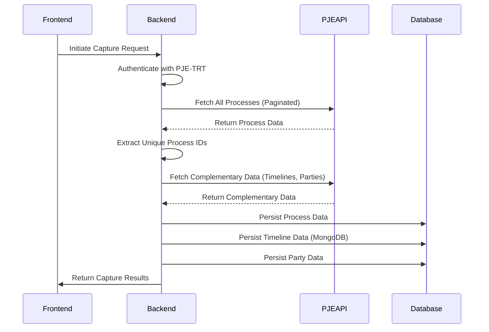
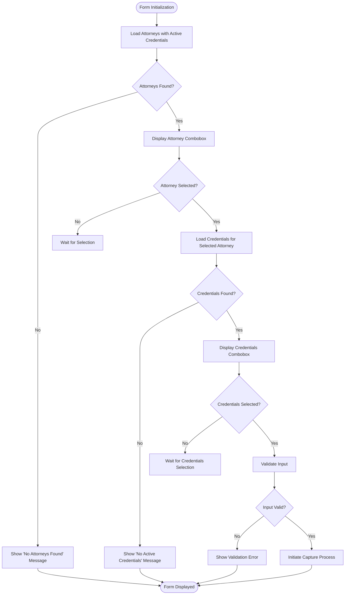
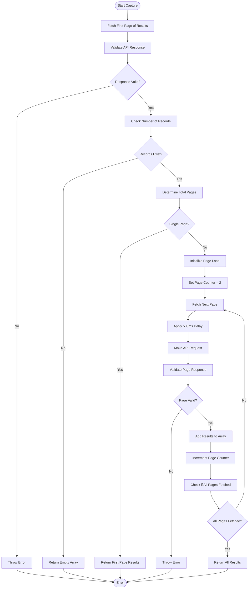
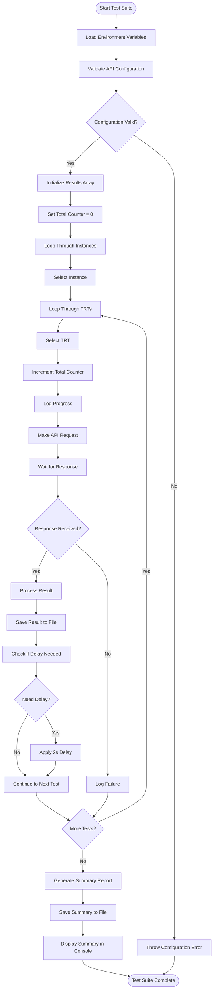

# Acervo Geral Capture

<cite>
**Referenced Files in This Document**   
- [acervo-geral.service.ts](file://backend/captura/services/trt/acervo-geral.service.ts)
- [captura-form-base.tsx](file://app/(dashboard)/captura/components/captura-form-base.tsx)
- [21_capturas.sql](file://supabase/schemas/21_capturas.sql)
- [test-api-acervo-geral.ts](file://scripts/api-acervo-geral/test-api-acervo-geral.ts)
- [obter-todos-processos.ts](file://backend/api/pje-trt/acervo-geral/obter-todos-processos.ts)
- [obter-processos.ts](file://backend/api/pje-trt/acervo-geral/obter-processos.ts)
- [obter-totalizadores.ts](file://backend/api/pje-trt/acervo-geral/obter-totalizadores.ts)
- [acervo-geral-form.tsx](file://app/(dashboard)/captura/components/acervo-geral-form.tsx)
- [capturarAcervoGeral](file://app/api/captura/captura)
</cite>

## Table of Contents
1. [Introduction](#introduction)
2. [Core Components](#core-components)
3. [Capture Process Orchestration](#capture-process-orchestration)
4. [User Input Collection and Validation](#user-input-collection-and-validation)
5. [Data Transformation and Unification](#data-transformation-and-unification)
6. [Persistence Mechanism](#persistence-mechanism)
7. [Handling Large Result Sets and Pagination](#handling-large-result-sets-and-pagination)
8. [Error Recovery and Partial Captures](#error-recovery-and-partial-captures)
9. [Test Script Validation](#test-script-validation)
10. [Conclusion](#conclusion)

## Introduction

The Acervo Geral Capture feature is a critical component of the Sinesys application that enables users to capture comprehensive case data from the PJE-TRT (Processo Judicial Eletrônico - Tribunal Regional do Trabalho) system. This document provides a detailed analysis of the implementation, focusing on the orchestration of the capture process, user input handling, data transformation, persistence mechanisms, and strategies for handling large datasets and error recovery.

The feature is designed to streamline the process of retrieving case information from multiple TRTs (Tribunais Regionais do Trabalho) across Brazil, transforming the raw API responses into a unified domain model, and persisting the data in a structured manner. The implementation addresses challenges such as handling large result sets, implementing efficient pagination strategies, and ensuring robust error recovery for partial captures.

This documentation will explore the key components involved in the Acervo Geral Capture process, including the backend service that orchestrates the capture, the frontend component that collects user input, the data transformation logic, and the persistence mechanism defined in the database schema. Additionally, it will examine the test script that validates the functionality and ensures the reliability of the capture process.

## Core Components

The Acervo Geral Capture feature is composed of several key components that work together to provide a seamless user experience. The primary components include the `acervo-geral.service.ts` file, which orchestrates the capture process by calling the PJE-TRT API's `obter-processos` endpoint, and the `captura-form-base.tsx` component, which collects user input for tribunal selection and authentication credentials.

The `acervo-geral.service.ts` file is responsible for managing the entire capture workflow, from authentication to data persistence. It coordinates the interaction with the PJE-TRT API, handles data transformation, and ensures that the captured data is stored correctly in the application's database. This service is designed to be robust and efficient, capable of handling large datasets and recovering from errors gracefully.

The `captura-form-base.tsx` component serves as the user interface for initiating the capture process. It provides a form where users can select an attorney and their associated credentials, which are then used to authenticate with the PJE-TRT system. This component also includes validation logic to ensure that the user provides all necessary information before the capture process begins.

Additionally, the `21_capturas.sql` file defines the database schema for storing capture results, including both raw API responses and processed data. This schema is crucial for maintaining the integrity of the captured data and enabling efficient querying and analysis.

**Section sources**
- [acervo-geral.service.ts](file://backend/captura/services/trt/acervo-geral.service.ts)
- [captura-form-base.tsx](file://app/(dashboard)/captura/components/captura-form-base.tsx)
- [21_capturas.sql](file://supabase/schemas/21_capturas.sql)

## Capture Process Orchestration

The capture process is orchestrated by the `acervoGeralCapture` function in the `acervo-geral.service.ts` file. This function follows a six-phase workflow to ensure a systematic and efficient capture of data from the PJE-TRT system.

The first phase involves authentication, where the service authenticates with the PJE-TRT system using the provided credentials. This is achieved through the `autenticarPJE` function, which establishes a session and retrieves the necessary authentication tokens.

Once authenticated, the second phase begins, where the service calls the `obterTodosProcessosAcervoGeral` function to retrieve all processes from the acervo geral (general collection) of the selected attorney. This function handles pagination automatically, making multiple requests to the PJE-TRT API to fetch all pages of results.

In the third phase, the service extracts unique process IDs from the retrieved data. This is done using the `extrairProcessosUnicosDeAcervo` function, which creates a set of unique IDs to avoid duplicate processing.

The fourth phase involves fetching complementary data for each process, such as timelines and parties involved. This is handled by the `buscarDadosComplementaresProcessos` function, which makes additional API calls to retrieve this information. The service also implements a recapture verification mechanism to skip processes that have been recently updated, reducing unnecessary API calls.

The fifth phase focuses on data persistence. The service first saves the main process data to the acervo table using the `salvarAcervo` function. Then, it persists timeline data to MongoDB and party information to the appropriate tables. This phased approach ensures referential integrity and efficient data storage.

Finally, in the sixth phase, the service closes the browser session and returns the capture results, including statistics on the number of processes captured, timelines saved, and any errors encountered.



**Diagram sources **
- [acervo-geral.service.ts](file://backend/captura/services/trt/acervo-geral.service.ts)

**Section sources**
- [acervo-geral.service.ts](file://backend/captura/services/trt/acervo-geral.service.ts)

## User Input Collection and Validation

The user input collection and validation process is managed by the `captura-form-base.tsx` component, which provides a structured interface for users to select an attorney and their associated credentials. This component is designed to guide users through the capture process, ensuring that all necessary information is provided before initiating the capture.

The form consists of two main steps: selecting an attorney and choosing the credentials to use for authentication. The first step is implemented using the `AdvogadoCombobox` component, which displays a list of attorneys with active credentials. If no attorneys with active credentials are found, the form displays an appropriate message to inform the user.

Once an attorney is selected, the second step becomes available, allowing the user to choose one or more credentials associated with that attorney. The `CredenciaisCombobox` component is used to display the available credentials, and it automatically updates when the selected attorney changes. If no active credentials are found for the selected attorney, the form displays a message indicating this.

The component includes validation logic to ensure that both an attorney and at least one credential are selected before the capture can be initiated. This is implemented through the `validarCamposCaptura` function, which checks the current state of the form and returns a boolean indicating whether the input is valid.

When the user attempts to initiate the capture, the form validates the input and displays an error message if necessary. If the input is valid, the capture process is started by calling the `capturarAcervoGeral` function with the selected attorney ID and credential IDs.



**Diagram sources **
- [captura-form-base.tsx](file://app/(dashboard)/captura/components/captura-form-base.tsx)

**Section sources**
- [captura-form-base.tsx](file://app/(dashboard)/captura/components/captura-form-base.tsx)

## Data Transformation and Unification

The data transformation and unification process is a critical aspect of the Acervo Geral Capture feature, ensuring that the raw data retrieved from the PJE-TRT API is converted into a consistent and usable format within the application's domain model. This process involves several steps, including handling multi-instance processes and applying unification logic to create a cohesive dataset.

When the `obterTodosProcessosAcervoGeral` function retrieves data from the PJE-TRT API, it receives a paginated response containing process information. This data is then transformed into the application's `Processo` type, which defines the structure of a process in the domain model. The transformation process includes mapping API fields to the corresponding properties in the `Processo` type and handling any data type conversions.

One of the key challenges in this process is dealing with multi-instance processes, where the same case may appear in both the first and second instance (grau) of a tribunal. To address this, the system implements unification logic that identifies related processes across instances and combines them into a single, unified record. This is achieved by comparing process numbers and other identifying information to determine if two processes are part of the same case.

The unification process is particularly important for maintaining data integrity and providing a comprehensive view of each case. By combining information from multiple instances, the system can present a complete timeline of events and ensure that all relevant data is available to the user.

Additionally, the system handles the transformation of complementary data, such as timelines and parties, ensuring that this information is properly linked to the corresponding processes. This involves creating relationships between the main process data and the additional information, allowing for efficient querying and analysis.

The transformed and unified data is then prepared for persistence, with the system organizing the information into the appropriate format for storage in the database. This includes separating the raw API response from the processed data, allowing for both detailed analysis of the original data and efficient querying of the transformed data.

**Section sources**
- [acervo-geral.service.ts](file://backend/captura/services/trt/acervo-geral.service.ts)
- [obter-todos-processos.ts](file://backend/api/pje-trt/acervo-geral/obter-todos-processos.ts)

## Persistence Mechanism

The persistence mechanism for the Acervo Geral Capture feature is defined in the `21_capturas.sql` file, which outlines the database schema for storing capture results. This schema is designed to efficiently store both raw API responses and processed data, ensuring data integrity and enabling comprehensive analysis.

The main table in this schema is `capturas_log`, which records the history of all capture operations performed in the system. This table includes fields for the type of capture, the attorney ID, the status of the capture, and the result of the operation. The `resultado` field is of type `jsonb`, allowing for flexible storage of the capture results, including both structured data and raw API responses.

Another important table is `agendamentos`, which manages scheduled capture operations. This table includes fields for the type of capture, the attorney ID, the credentials to be used, and the schedule for the capture. It also includes a `parametros_extras` field of type `jsonb`, which can store additional parameters specific to the type of capture being performed.

The schema also includes several indexes to optimize query performance. For example, there are indexes on the `tipo_captura` and `status` fields in the `capturas_log` table, as well as on the `proxima_execucao` field in the `agendamentos` table. These indexes ensure that queries related to capture history and scheduling are executed efficiently.

Row-level security (RLS) is implemented on both tables to ensure data privacy and security. The `capturas_log` table has policies that allow the service role full access and authenticated users to read the data. Similarly, the `agendamentos` table has policies that grant full access to the service role and read access to authenticated users.

The persistence mechanism follows a phased approach to ensure referential integrity. First, the main process data is saved to the acervo table, which returns the generated IDs. These IDs are then used to persist timeline data to MongoDB and party information to the appropriate tables. This approach ensures that all related data is properly linked and can be efficiently queried.

The schema also includes comments on each table and column, providing clear documentation of the purpose and meaning of each field. This documentation is crucial for maintaining the database and ensuring that future developers can understand the structure and intent of the schema.

```mermaid
erDiagram
CAPTURAS_LOG {
bigint id PK
public.tipo_captura tipo_captura
bigint advogado_id FK
bigint[] credencial_ids
public.status_captura status
jsonb resultado
text erro
text mongodb_id
timestamp with time zone iniciado_em
timestamp with time zone concluido_em
timestamp with time zone created_at
}
AGENDAMENTOS {
bigint id PK
public.tipo_captura tipo_captura
bigint advogado_id FK
bigint[] credencial_ids
text periodicidade
integer dias_intervalo
time horario
boolean ativo
jsonb parametros_extras
timestamp with time zone ultima_execucao
timestamp with time zone proxima_execucao
timestamp with time zone created_at
timestamp with time zone updated_at
}
ADVOGADOS {
bigint id PK
text nome
text cpf
}
CAPTURAS_LOG ||--o{ ADVOGADOS : "advogado_id"
AGENDAMENTOS ||--o{ ADVOGADOS : "advogado_id"
```

**Diagram sources **
- [21_capturas.sql](file://supabase/schemas/21_capturas.sql)

**Section sources**
- [21_capturas.sql](file://supabase/schemas/21_capturas.sql)

## Handling Large Result Sets and Pagination

The Acervo Geral Capture feature employs a sophisticated pagination strategy to handle large result sets efficiently when retrieving data from the PJE-TRT API. This is crucial for ensuring that the capture process can handle attorneys with thousands of cases without overwhelming system resources or exceeding API rate limits.

The pagination mechanism is implemented in the `obterTodosProcessosAcervoGeral` function, which is responsible for fetching all processes from the acervo geral. This function uses a two-step approach to determine the total number of pages and retrieve all data.

First, it makes an initial request to fetch the first page of results. This request not only retrieves the first set of processes but also provides metadata about the total number of pages available. The function then uses this information to determine how many additional requests are needed to retrieve all pages.

The function iterates through each subsequent page, making individual requests to fetch the data. To prevent overwhelming the PJE-TRT API and to comply with rate limiting policies, a delay of 500 milliseconds is introduced between each request. This delay can be adjusted based on the specific requirements and constraints of the target system.

An important consideration in this implementation is how the PJE-TRT API handles the case of a single page of results. When there is only one page, the API returns a `qtdPaginas` value of 0. The function accounts for this by checking the actual number of records in the result array, ensuring that it correctly identifies when there is only one page of data.

The pagination strategy also includes robust error handling to deal with potential issues such as network timeouts, API errors, or invalid responses. If any page returns an invalid response, the function throws an error, preventing the processing of incomplete or corrupted data.

By implementing this pagination strategy, the system can efficiently handle large datasets while maintaining stability and reliability. This approach ensures that even attorneys with extensive case histories can be processed without issues, providing a seamless user experience.



**Diagram sources **
- [obter-todos-processos.ts](file://backend/api/pje-trt/acervo-geral/obter-todos-processos.ts)

**Section sources**
- [obter-todos-processos.ts](file://backend/api/pje-trt/acervo-geral/obter-todos-processos.ts)

## Error Recovery and Partial Captures

The Acervo Geral Capture feature implements robust error recovery mechanisms to handle partial captures and ensure data integrity in the face of various failure scenarios. This is particularly important given the complexity of the capture process and the potential for issues such as network interruptions, API errors, or authentication problems.

The error recovery strategy is built into the `acervoGeralCapture` function, which follows a structured approach to handling errors at each phase of the capture process. The function uses try-catch blocks to catch and handle exceptions, ensuring that the capture process can continue even if individual operations fail.

One key aspect of the error recovery mechanism is the use of a finally block to ensure that the browser session is always closed, regardless of whether the capture process completes successfully or encounters an error. This prevents resource leaks and ensures that the system remains stable even in the event of unexpected failures.

For partial captures, where some processes are successfully captured while others fail, the system maintains detailed logs of the capture process. These logs include information about which processes were successfully processed, which ones failed, and the reasons for any failures. This information is stored in the `capturas_log` table, allowing users and administrators to review and analyze the results of each capture operation.

The system also implements a recapture verification mechanism that checks whether a process has been recently updated before attempting to capture its data. This helps to reduce unnecessary API calls and prevents overwriting recently updated data. If a process has been updated within the last 24 hours, it is skipped during the capture process.

In cases where the capture process is interrupted, the system can resume from where it left off by using the information stored in the `capturas_log` table. This allows users to retry failed captures without starting from the beginning, saving time and reducing the load on the PJE-TRT API.

The error recovery mechanism also includes logging of detailed error messages, which can be used for debugging and troubleshooting. These logs are stored both in memory during the capture process and persisted to the database for long-term analysis.

**Section sources**
- [acervo-geral.service.ts](file://backend/captura/services/trt/acervo-geral.service.ts)

## Test Script Validation

The functionality of the Acervo Geral Capture feature is validated through a comprehensive test script located in `test-api-acervo-geral.ts`. This script is designed to simulate API requests from external sources or the frontend, testing the capture process for all TRTs (Tribunais Regionais do Trabalho) across both first and second instances.

The test script operates by making HTTP POST requests to the `/api/captura/trt/acervo-geral` endpoint, simulating the initiation of a capture process. It uses environment variables to configure the API base URL and service API key, ensuring that the tests can be run in different environments.

The script tests each TRT in both the first and second instance, following a specific order: first testing all TRTs in the first instance, then moving on to the second instance. This approach allows for systematic testing and helps identify any instance-specific issues.

For each test, the script records detailed information, including the timestamp, TRT code, instance, duration of the test, and the result of the capture operation. This information is saved to a JSON file in the results directory, providing a comprehensive record of each test run.

The test script also includes error handling to catch and report any issues that occur during the testing process. If a test fails, the script logs the error message and continues with the next test, ensuring that a single failure does not prevent the completion of the entire test suite.

After completing all tests, the script generates a summary report that includes statistics such as the total number of tests performed, the number of successes and failures, the total number of processes captured, and the overall duration of the testing process. This summary is saved to a JSON file and also displayed in the console output.

The test script is designed to be run manually or as part of an automated testing pipeline. It includes a delay of 2 seconds between tests to prevent overwhelming the API and to comply with rate limiting policies.

This comprehensive testing approach ensures that the Acervo Geral Capture feature is thoroughly validated across all supported TRTs and instances, providing confidence in its reliability and performance.



**Diagram sources **
- [test-api-acervo-geral.ts](file://scripts/api-acervo-geral/test-api-acervo-geral.ts)

**Section sources**
- [test-api-acervo-geral.ts](file://scripts/api-acervo-geral/test-api-acervo-geral.ts)

## Conclusion

The Acervo Geral Capture feature is a sophisticated and robust system for retrieving and processing case data from the PJE-TRT system. Through a well-structured orchestration process, efficient user input handling, comprehensive data transformation, and reliable persistence mechanisms, this feature provides a seamless experience for users while ensuring data integrity and system stability.

The implementation demonstrates a deep understanding of the challenges involved in capturing large datasets from external APIs, with thoughtful solutions for pagination, error recovery, and partial captures. The use of a phased approach to data persistence ensures referential integrity and efficient storage, while the comprehensive test script validates the functionality across all supported TRTs and instances.

Key strengths of the implementation include its modular design, with clear separation of concerns between different components, and its robust error handling, which ensures that the system can recover gracefully from various failure scenarios. The use of detailed logging and comprehensive testing further enhances the reliability and maintainability of the feature.

As the system continues to evolve, potential areas for improvement could include optimizing the pagination strategy for even larger datasets, enhancing the user interface for better feedback during long-running capture operations, and expanding the data transformation logic to handle additional types of complementary data.

Overall, the Acervo Geral Capture feature represents a significant achievement in integrating with external legal systems and providing valuable functionality to users. Its well-designed architecture and thorough implementation set a high standard for similar features in the application.

[No sources needed since this section summarizes without analyzing specific files]