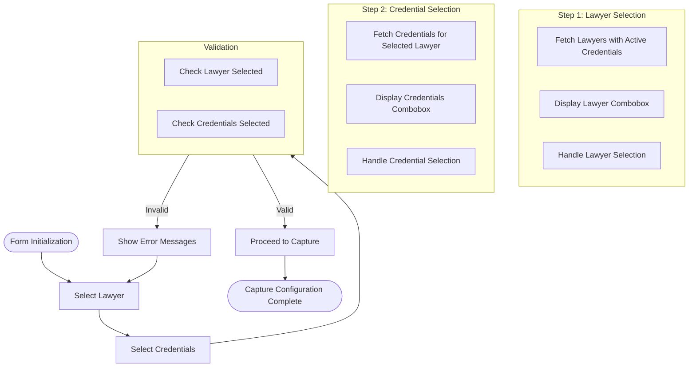
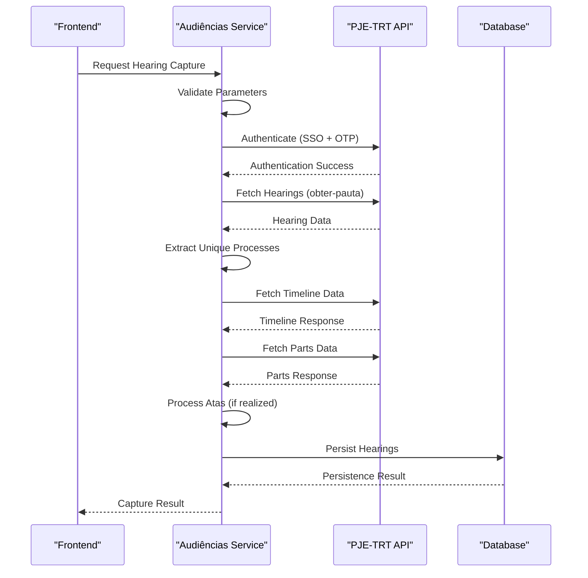
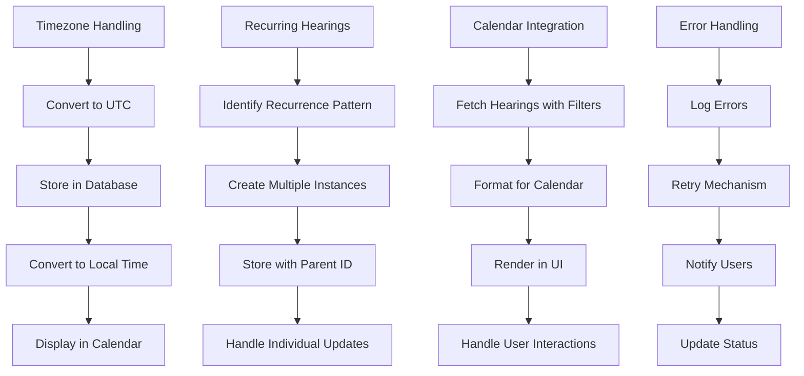
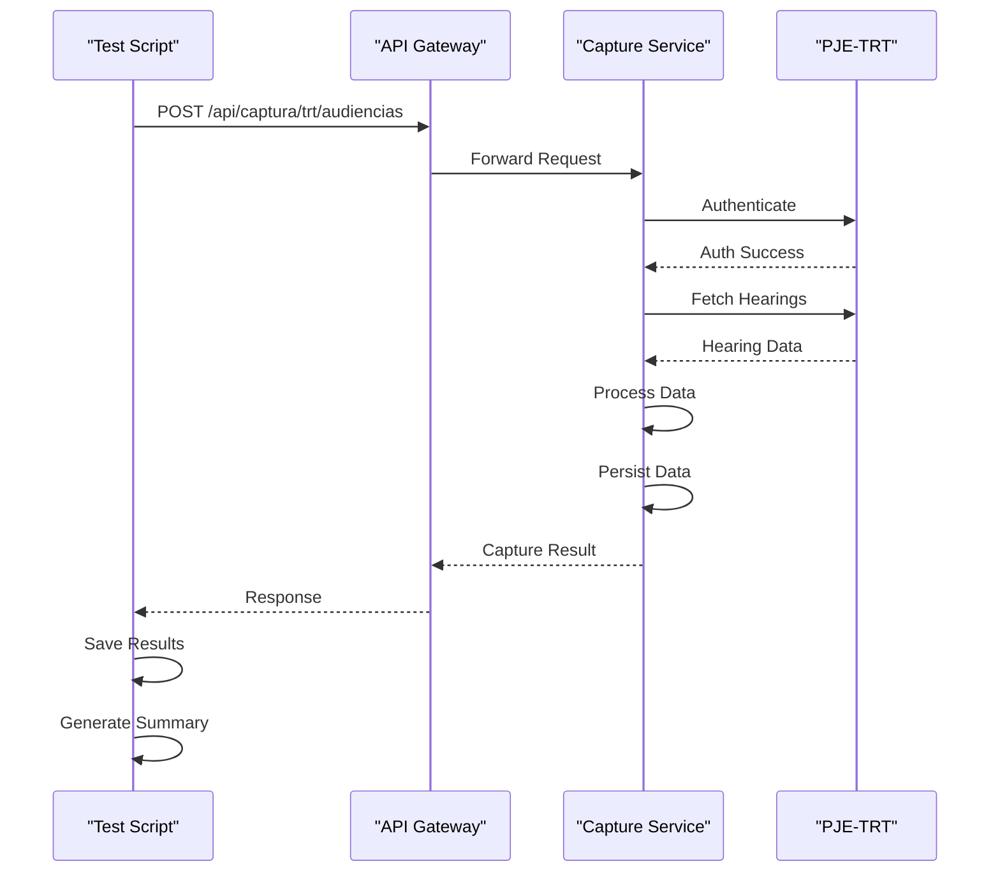

# Audiências Capture

<cite>
**Referenced Files in This Document**   
- [audiencias.service.ts](file://backend/captura/services/trt/audiencias.service.ts)
- [captura-form-base.tsx](file://app/(dashboard)/captura/components/captura-form-base.tsx)
- [21_capturas.sql](file://supabase/schemas/21_capturas.sql)
- [test-api-audiencias.ts](file://scripts/api-audiencias/test-api-audiencias.ts)
- [route.ts](file://app/api/audiencias/route.ts)
- [listar-audiencias.service.ts](file://backend/audiencias/services/persistence/listar-audiencias.service.ts)
- [dados-complementares.service.ts](file://backend/captura/services/trt/dados-complementares.service.ts)
- [trt-auth.service.ts](file://backend/captura/services/trt/trt-auth.service.ts)
- [audiencias-persistence.service.ts](file://backend/captura/services/persistence/audiencias-persistence.service.ts)
</cite>

## Table of Contents
1. [Introduction](#introduction)
2. [Audiências Service Implementation](#audiências-service-implementation)
3. [Capture Form Configuration](#capture-form-configuration)
4. [Data Processing and Parsing](#data-processing-and-parsing)
5. [Database Schema and Temporal Aspects](#database-schema-and-temporal-aspects)
6. [Challenges and Integration](#challenges-and-integration)
7. [Test Validation](#test-validation)
8. [Conclusion](#conclusion)

## Introduction
The Audiências Capture feature enables the system to retrieve hearing schedules from the PJE-TRT API's obter-pauta endpoint. This documentation details the implementation of the capture functionality, including service coordination, form configuration, data processing, database schema, and integration challenges. The system is designed to efficiently capture hearing data while handling complex requirements such as timezone management, recurring hearings, and calendar visualization integration.

## Audiências Service Implementation

The audiencias.service.ts file implements the core logic for capturing hearing data from the PJE-TRT system. The service follows an optimized six-phase workflow that leverages authenticated sessions to maximize efficiency and minimize API calls.

```mermaid
graph TD
A[Authentication Phase] --> B[Fetch Hearings Phase]
B --> C[Extract Unique Processes Phase]
C --> D[Fetch Complementary Data Phase]
D --> E[Persistence Phase]
E --> F[Close Browser Phase]
subgraph "Authentication Phase"
A1[Login SSO PDPJ]
A2[OTP Verification]
A3[JWT + Cookies]
end
subgraph "Fetch Hearings Phase"
B1[GET /pauta-usuarios-externos]
B2[Return Hearings with Process IDs]
end
subgraph "Extract Unique Processes Phase"
C1[Set Process IDs]
C2[Identify Unique Processes]
end
subgraph "Fetch Complementary Data Phase"
D1[Timeline: GET /processos/id/{id}/timeline]
D2[Parts: GET /processos/id/{id}/partes]
D3[300ms delay between requests]
end
subgraph "Persistence Phase"
E1[Process: upsert acervo]
E2[Timeline: upsert MongoDB]
E3[Parts: upsert entities]
E4[Hearings: upsert Supabase]
end
subgraph "Close Browser Phase"
F1[Close Browser Session]
end
```

**Diagram sources**
- [audiencias.service.ts](file://backend/captura/services/trt/audiencias.service.ts#L46-L480)

**Section sources**
- [audiencias.service.ts](file://backend/captura/services/trt/audiencias.service.ts#L46-L480)

## Capture Form Configuration

The captura-form-base.tsx component provides the base form structure for configuring audiências capture. It implements a two-step selection process that guides users through the capture configuration workflow.



The component uses React hooks to manage state and data fetching, with specific handlers for lawyer and credential selection changes. It includes validation logic to ensure both a lawyer and at least one credential are selected before proceeding.

**Diagram sources**
- [captura-form-base.tsx](file://app/(dashboard)/captura/components/captura-form-base.tsx#L22-L144)

**Section sources**
- [captura-form-base.tsx](file://app/(dashboard)/captura/components/captura-form-base.tsx#L22-L144)

## Data Processing and Parsing

The system processes hearing data through a comprehensive pipeline that includes parsing hearing details, assigning responsibility, and extracting virtual hearing URLs. The data processing workflow is designed to handle both captured and manually created hearings.



The service implements robust error handling and logging throughout the data processing pipeline. It also includes functionality to process atas (minutes) for hearings that have been realized, downloading and storing the PDF documents in Backblaze storage.

**Diagram sources**
- [audiencias.service.ts](file://backend/captura/services/trt/audiencias.service.ts#L133-L480)
- [audiencias-persistence.service.ts](file://backend/captura/services/persistence/audiencias-persistence.service.ts)

**Section sources**
- [audiencias.service.ts](file://backend/captura/services/trt/audiencias.service.ts#L133-L480)
- [audiencias-persistence.service.ts](file://backend/captura/services/persistence/audiencias-persistence.service.ts)

## Database Schema and Temporal Aspects

The hearing data is structured in the database according to the schema defined in 21_capturas.sql. The schema includes two main tables: capturas_log for tracking capture operations and agendamentos for managing automated capture schedules.

```mermaid
erDiagram
CAPTURAS_LOG {
bigint id PK
tipo_captura tipo_captura NOT NULL
bigint advogado_id FK
bigint[] credencial_ids
status_captura status_captura NOT NULL
jsonb resultado
text erro
text mongodb_id
timestamp with time zone iniciado_em
timestamp with time zone concluido_em
timestamp with time zone created_at
}
AGENDAMENTOS {
bigint id PK
tipo_captura tipo_captura NOT NULL
bigint advogado_id FK
bigint[] credencial_ids NOT NULL
text periodicidade NOT NULL
integer dias_intervalo
time horario NOT NULL
boolean ativo DEFAULT true
jsonb parametros_extras
timestamp with time zone ultima_execucao
timestamp with time zone proxima_execucao NOT NULL
timestamp with time zone created_at
timestamp with time zone updated_at
}
CAPTURAS_LOG ||--o{ AGENDAMENTOS : "triggered_by"
CAPTURAS_LOG }o--|| ADVOGADOS : "belongs_to"
```

The temporal aspects of the capture system are managed through timestamp fields that track when captures are initiated and completed. The agendamentos table includes scheduling information with support for daily or custom interval execution, allowing for flexible automation of the capture process.

**Diagram sources**
- [21_capturas.sql](file://supabase/schemas/21_capturas.sql#L6-L104)

**Section sources**
- [21_capturas.sql](file://supabase/schemas/21_capturas.sql#L6-L104)

## Challenges and Integration

The hearing data capture system addresses several challenges specific to the domain, including timezone handling, recurring hearings, and integration with the calendar visualization system.



The system handles timezone conversion by storing all timestamps in UTC and converting to local time when displaying in the calendar interface. For recurring hearings, the system identifies patterns and creates individual instances while maintaining a relationship to the parent hearing. The calendar integration is achieved through API endpoints that provide filtered and paginated hearing data suitable for calendar rendering.

**Diagram sources**
- [route.ts](file://app/api/audiencias/route.ts#L225-L499)
- [listar-audiencias.service.ts](file://backend/audiencias/services/persistence/listar-audiencias.service.ts#L77-L271)

**Section sources**
- [route.ts](file://app/api/audiencias/route.ts#L225-L499)
- [listar-audiencias.service.ts](file://backend/audiencias/services/persistence/listar-audiencias.service.ts#L77-L271)

## Test Validation

The capture functionality is validated through a comprehensive test script that simulates API requests for all TRTs. The test script verifies the end-to-end functionality of the hearing capture system.



The test script runs against both first and second instance TRTs, testing the capture functionality with a one-year date range. It includes error handling and retry mechanisms to ensure reliable testing even in the presence of network issues.

**Diagram sources**
- [test-api-audiencias.ts](file://scripts/api-audiencias/test-api-audiencias.ts#L84-L320)

**Section sources**
- [test-api-audiencias.ts](file://scripts/api-audiencias/test-api-audiencias.ts#L84-L320)

## Conclusion

The Audiências Capture feature provides a robust solution for retrieving and processing hearing schedules from the PJE-TRT system. The implementation follows a well-structured six-phase workflow that optimizes performance by leveraging authenticated sessions and minimizing API calls. The system is designed with scalability in mind, supporting both manual and automated capture through configurable scheduling. The database schema effectively captures the temporal aspects of the capture process, while the integration with the calendar visualization system provides users with an intuitive interface for managing their hearing schedules. The comprehensive test suite ensures the reliability and correctness of the capture functionality across all supported TRTs.