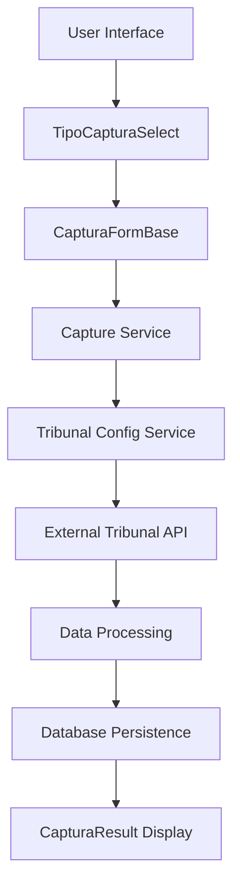
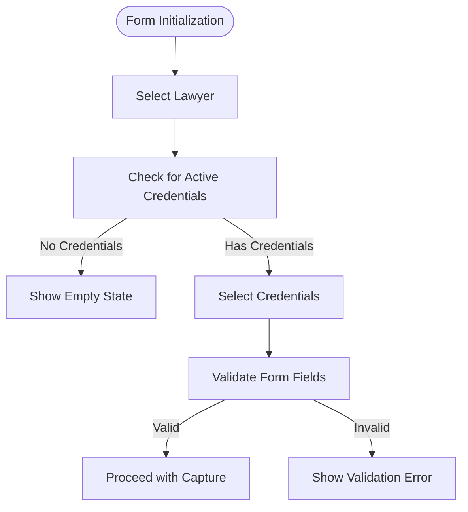
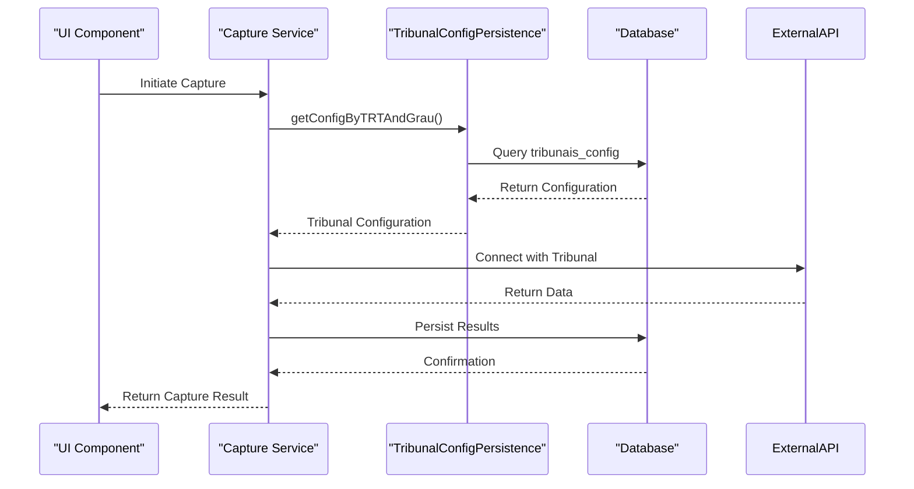
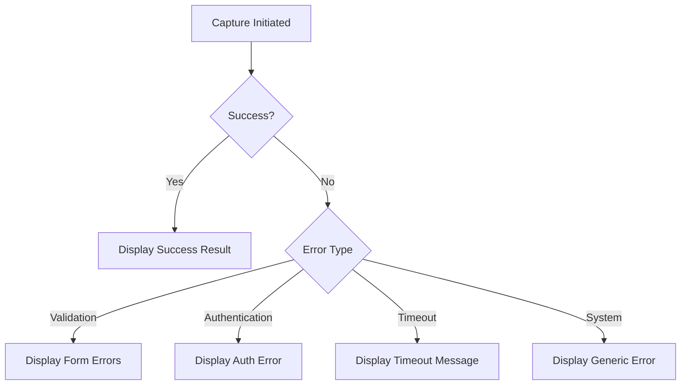

# Capture Workflow

<cite>
**Referenced Files in This Document**   
- [captura-form-base.tsx](file://app/(dashboard)/captura/components/captura-form-base.tsx)
- [tipo-captura-select.tsx](file://app/(dashboard)/captura/components/tipo-captura-select.tsx)
- [trt-capture.service.ts](file://backend/captura/services/trt/trt-capture.service.ts)
- [captura-result.tsx](file://app/(dashboard)/captura/components/captura-result.tsx)
- [tribunal-config-persistence.service.ts](file://backend/captura/services/persistence/tribunal-config-persistence.service.ts)
- [21_capturas.sql](file://supabase/schemas/21_capturas.sql)
</cite>

## Table of Contents
1. [Introduction](#introduction)
2. [Capture Workflow Overview](#capture-workflow-overview)
3. [UI Components](#ui-components)
4. [Capture Service Implementation](#capture-service-implementation)
5. [Tribunal Configuration Management](#tribunal-configuration-management)
6. [Database Schema](#database-schema)
7. [Data Flow and Processing](#data-flow-and-processing)
8. [Error Handling and Validation](#error-handling-and-validation)
9. [Common Issues and Solutions](#common-issues-and-solutions)
10. [Conclusion](#conclusion)

## Introduction
The Sinesys application provides a comprehensive capture workflow for retrieving legal data from various tribunal systems. This document details the end-to-end process of initiating captures, managing different capture types, and handling the data flow from UI to backend services. The system supports multiple capture types including acervo-geral, audiencias, and pendentes-manifestacao, with robust error handling and persistence mechanisms.

## Capture Workflow Overview
The capture workflow in Sinesys follows a structured process that begins with user interaction through the UI and ends with data persistence in the database. The workflow consists of several key components that work together to ensure reliable data capture from tribunal systems.

**Diagram sources**
- [tipo-captura-select.tsx](file://app/(dashboard)/captura/components/tipo-captura-select.tsx)
- [captura-form-base.tsx](file://app/(dashboard)/captura/components/captura-form-base.tsx)
- [trt-capture.service.ts](file://backend/captura/services/trt/trt-capture.service.ts)
- [captura-result.tsx](file://app/(dashboard)/captura/components/captura-result.tsx)

**Section sources**
- [captura-form-base.tsx](file://app/(dashboard)/captura/components/captura-form-base.tsx)
- [tipo-captura-select.tsx](file://app/(dashboard)/captura/components/tipo-captura-select.tsx)
- [trt-capture.service.ts](file://backend/captura/services/trt/trt-capture.service.ts)

## UI Components
The capture workflow begins with two primary UI components that handle user input and form management.

### CapturaFormBase Component
The CapturaFormBase component serves as the foundation for all capture operations, managing the selection of lawyers and credentials. It implements a two-step process:
1. Select a lawyer with active credentials
2. Select specific credentials for the capture operation

The component includes validation logic to ensure both a lawyer and at least one credential are selected before proceeding with the capture.

**Diagram sources**
- [captura-form-base.tsx](file://app/(dashboard)/captura/components/captura-form-base.tsx)

**Section sources**
- [captura-form-base.tsx](file://app/(dashboard)/captura/components/captura-form-base.tsx)

### TipoCapturaSelect Component
The TipoCapturaSelect component allows users to select the type of capture they want to perform. It supports multiple capture types with descriptive labels and icons for better user experience.

Supported capture types include:
- **acervo-geral**: Capture active processes from the general collection
- **arquivados**: Capture archived processes
- **audiencias**: Capture scheduled hearings
- **pendentes**: Capture pending matters for manifestation
- **timeline**: Capture process timeline movements and documents
- **partes**: Capture process parties, representatives, and relationships

The component can filter to show only schedulable capture types when needed.

**Section sources**
- [tipo-captura-select.tsx](file://app/(dashboard)/captura/components/tipo-captura-select.tsx)

## Capture Service Implementation
The backend capture services implement the logic for communicating with tribunal systems and processing the captured data.

### TRT Capture Service
The TRT capture service provides the base functionality for all tribunal capture operations. It defines common interfaces and parameters used across different capture types.

Key interfaces include:
- **CapturaTRTParams**: Base parameters for all TRT captures
- **CapturaPendentesManifestacaoParams**: Parameters for pending matters capture
- **CapturaAudienciasParams**: Parameters for hearing capture with date range options

The service architecture avoids inheritance, with each specific service calling authentication directly.

**Section sources**
- [trt-capture.service.ts](file://backend/captura/services/trt/trt-capture.service.ts)

## Tribunal Configuration Management
The system retrieves tribunal configurations through a dedicated persistence service that manages tribunal-specific settings.

### TribunalConfigPersistence Service
This service handles the retrieval of tribunal configurations from the database, including:
- System URLs for different tribunal types
- Access methods and authentication endpoints
- Custom timeouts for specific tribunals
- Tribunal metadata (code, name)

The service provides several key functions:
- getConfigByTribunalAndTipoAcesso: Get configuration by tribunal code and access type
- getConfigByTRTAndGrau: Get TRT configuration by code and degree (first, second, superior)
- listAllConfigs: List all available tribunal configurations
- isValidTribunalCode: Validate if a tribunal code has an active configuration

**Diagram sources**
- [tribunal-config-persistence.service.ts](file://backend/captura/services/persistence/tribunal-config-persistence.service.ts)

**Section sources**
- [tribunal-config-persistence.service.ts](file://backend/captura/services/persistence/tribunal-config-persistence.service.ts)

## Database Schema
The capture workflow utilizes specific database tables to store capture history and scheduling information.

### capturas_log Table
This table records all capture operations with detailed information:

**Table: capturas_log**
| Column | Type | Description |
|-------|------|-------------|
| id | bigint | Primary key, auto-generated |
| tipo_captura | tipo_captura | Type of capture (acervo_geral, arquivados, etc.) |
| advogado_id | bigint | Lawyer ID who owns the scheduling |
| credencial_ids | bigint[] | Array of credential IDs used in capture |
| status | status_captura | Status (pending, in_progress, completed, failed) |
| resultado | jsonb | Capture result in JSON format |
| erro | text | Error message if capture failed |
| mongodb_id | text | ID of document in MongoDB for raw JSON |
| iniciado_em | timestamp | Capture start time |
| concluido_em | timestamp | Capture completion time |

### agendamentos Table
This table manages scheduled capture executions:

**Table: agendamentos**
| Column | Type | Description |
|-------|------|-------------|
| id | bigint | Primary key, auto-generated |
| tipo_captura | tipo_captura | Type of capture to be scheduled |
| advogado_id | bigint | Lawyer ID who owns the scheduling |
| credencial_ids | bigint[] | Array of credential IDs to be used |
| periodicidade | text | Frequency (diario, a_cada_N_dias) |
| dias_intervalo | integer | Days between executions |
| horario | time | Execution time (HH:MM) |
| ativo | boolean | Whether scheduling is active |
| parametros_extras | jsonb | Extra parameters (date ranges, filters) |
| ultima_execucao | timestamp | Timestamp of last execution |
| proxima_execucao | timestamp | Calculated timestamp of next execution |

**Section sources**
- [21_capturas.sql](file://supabase/schemas/21_capturas.sql)

## Data Flow and Processing
The data flow in the capture workflow follows a well-defined path from user initiation to result display.

### End-to-End Data Flow

```mermaid
flowchart LR
A[User selects capture type] --> B[User selects lawyer]
B --> C[User selects credentials]
C --> D[Form validation]
D --> E[Capture service initiation]
E --> F[Tribunal configuration retrieval]
F --> G[Authentication with tribunal]
G --> H[Data extraction from tribunal]
H --> I[Data processing and transformation]
I --> J[Database persistence]
J --> K[Result formatting]
K --> L[Result display to user]
```

The system handles both synchronous and asynchronous capture operations. For longer-running captures, the system returns immediately with a success message indicating the capture is processing in the background, along with the capture ID for tracking in the history.

**Section sources**
- [captura-form-base.tsx](file://app/(dashboard)/captura/components/captura-form-base.tsx)
- [trt-capture.service.ts](file://backend/captura/services/trt/trt-capture.service.ts)
- [captura-result.tsx](file://app/(dashboard)/captura/components/captura-result.tsx)

## Error Handling and Validation
The capture workflow implements comprehensive error handling and validation at multiple levels.

### Client-Side Validation
The UI components perform validation before initiating captures:
- Ensures a lawyer is selected
- Verifies at least one active credential is selected
- Validates date ranges for time-based captures
- Prevents submission with incomplete form data

### Server-Side Error Handling
The backend services implement robust error handling:
- Graceful handling of tribunal API timeouts
- Proper error propagation from tribunal systems
- Detailed error logging for debugging
- Transactional integrity for data persistence

### Result Display
The CapturaResult component displays different messages based on the capture outcome:
- Success with detailed statistics
- Errors with descriptive messages
- Asynchronous processing status

**Section sources**
- [captura-form-base.tsx](file://app/(dashboard)/captura/components/captura-form-base.tsx)
- [captura-result.tsx](file://app/(dashboard)/captura/components/captura-result.tsx)

## Common Issues and Solutions
The capture workflow addresses several common challenges in tribunal data integration.

### Tribunal-Specific Response Formats
Different tribunals return data in varying formats. The system handles this by:
- Using tribunal-specific configuration settings
- Implementing flexible data parsing
- Applying transformation rules based on tribunal type

### Timeout Handling
Long-running captures are managed through:
- Asynchronous processing for extended operations
- Background job execution
- Progress tracking through the capture history

### Partial Data Capture
The system handles partial failures by:
- Continuing with available data when possible
- Logging specific errors for failed items
- Reporting success statistics including error counts
- Allowing retry of failed items

**Section sources**
- [trt-capture.service.ts](file://backend/captura/services/trt/trt-capture.service.ts)
- [captura-result.tsx](file://app/(dashboard)/captura/components/captura-result.tsx)

## Conclusion
The Sinesys capture workflow provides a robust and flexible system for retrieving legal data from various tribunal sources. The architecture separates concerns effectively between UI components, service logic, and data persistence. The system handles multiple capture types with appropriate validation, error handling, and user feedback mechanisms. Tribunal configurations are managed centrally, allowing for easy adaptation to different tribunal systems and their specific requirements. The database schema supports both immediate capture results and scheduled operations, providing a comprehensive solution for legal data integration.